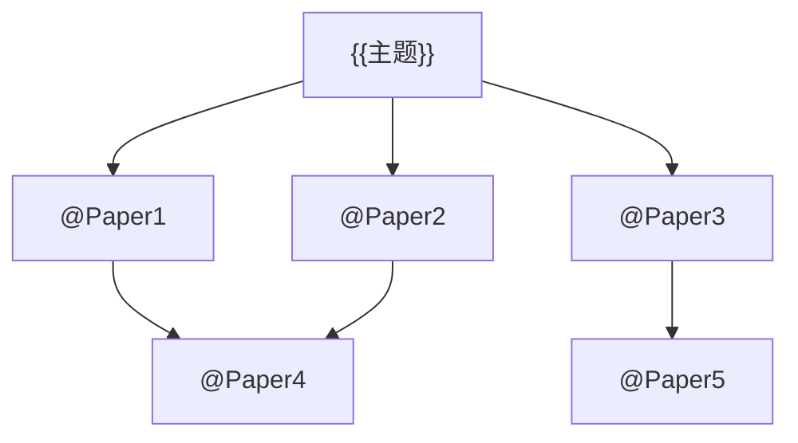

# 智能学术研究技能

## 核心能力

### 1. 文献智能调研

**自动化工作流：**
```
用户输入研究主题
    ↓
并行搜索 (semantic-scholar + tavily + zotero)
    ↓
智能筛选高引用/最新论文
    ↓
生成结构化文献报告
    ↓
创建带引用的Obsidian笔记
    ↓
绘制引用关系图谱
```

**调研报告模板：**
```markdown
# 📚 {{主题}} 文献调研报告

> 生成时间: {{timestamp}}
> 涵盖范围: {{year_range}}

---

## 🔬 一句话总结

{{用一句话概括该领域现状和核心挑战}}

---

## 📊 领域概述

### 研究背景
{{详细介绍领域背景}}

### 关键里程碑
| 年份 | 成果 | 意义 |
|------|------|------|
| {{year}} | {{achievement}} | {{significance}} |

---

## 🧠 核心原理

### 物理图像
{{用简洁语言描述核心物理过程}}

### 关键公式
$$
{{核心公式}}
$$
其中：
- {{参数1}}: {{含义}}，典型值 {{value}}
- {{参数2}}: {{含义}}

---

## 📈 最新进展 (2023-2026)

{{按时间线组织的重要论文}}

### 代表性工作

#### 1. {{论文标题}}
- **作者**: {{authors}}
- **发表于**: {{journal}} ({{year}})
- **核心贡献**: {{contribution}}
- **关键结果**: {{key_results}}
- **DOI**: {{doi}}
- **引用数**: {{citations}}

#### 2. ... (继续列出5-10篇)

---

## 🔗 引用关系图



---

## ⚖️ 技术对比

| 方法 | 优势 | 劣势 | 适用场景 |
|------|------|------|----------|
| {{Method A}} | {{pros}} | {{cons}} | {{use_case}} |
| {{Method B}} | {{pros}} | {{cons}} | {{use_case}} |

---

## 💡 我的研究思考

### 现有方法的局限
{{critical analysis}}

### 可能的研究方向
1. {{direction 1}}
2. {{direction 2}}
3. {{direction 3}}

---

## 📚 参考文献

{{all citations in standard format}}

---
*本报告由 Claude Code 学术大脑自动生成*
```

### 2. 论文深度理解

当用户提交一篇论文时：

1. **下载并解析** - 使用 paper-search 或 zotero 获取PDF
2. **结构化提取** - 提取研究问题、方法、结果、创新点
3. **生成笔记** - 创建精品笔记，包含：
   - 一句话物理图像
   - 核心公式及参数物理意义
   - 技术路线图
   - 与已有知识关联
4. **可视化辅助** - 生成原理示意图

### 3. 智能问答

基于已调研内容，回答用户问题：
- 概念解释（带物理图像）
- 方法对比（带表格）
- 趋势分析（带时间线）
- 引用推荐（带Zotero关联）

## MCP协同指令

### 并行搜索策略
```
1. 使用 semantic-scholar 搜索核心论文
2. 并行使用 tavily-search 搜索最新进展
3. 并行使用 zotero 搜索个人库相关文献
4. 汇总结果，去重排序
```

### 结果筛选标准
- 优先选择：高引用(>50)、近3年、顶级期刊
- 覆盖范围：开创性工作 + 最新进展 + 代表性方法

### 笔记质量标准
每篇笔记必须包含：
- ☑️ 一句话物理图像（让人"看见"物理）
- ☑️ 核心公式（LaTeX格式 + 参数说明）
- ☑️ Mermaid图（知识树/流程图）
- ☑️ 具体数值（参数、指标）
- ☑️ 文献引用（2+代表性论文）

## 使用示例

### 示例1: 完整调研
```
用户: 帮我调研太赫兹量子级联激光器的最新进展

助手(自动执行):
1. 搜索 semantic-scholar: "THz quantum cascade laser"
2. 搜索 tavily: "THz QCL 2024 2025 breakthrough"
3. 搜索 zotero: "QCL THz"
4. 汇总10-15篇核心论文
5. 生成调研报告
6. 创建Obsidian笔记
7. 绘制引用关系图
```

### 示例2: 论文理解
```
用户: 深入理解这篇论文: Tonouchi2007

助手(自动执行):
1. 从Zotero获取论文信息
2. 提取核心内容
3. 生成带物理图像的解释
4. 创建笔记并关联到知识树
```

### 示例3: 对比研究
```
用户: 比较光电导天线和光整流产生THz的优缺点

助手(自动执行):
1. 搜索两种方法的代表性论文
2. 提取技术参数
3. 生成对比表格
4. 给出具体应用场景建议
```

## 自动化规则

1. **不重复原则**: 创建笔记前检查是否已存在相关笔记
2. **关联原则**: 新笔记必须关联到已有知识树
3. **溯源原则**: 所有信息必须标注来源
4. **可视化原则**: 复杂概念必须生成辅助图

## 错误处理

- 如果某MCP不可用，自动降级到其他数据源
- 如果论文PDF无法获取，使用摘要信息
- 如果生成失败，保存中间结果供用户检查
