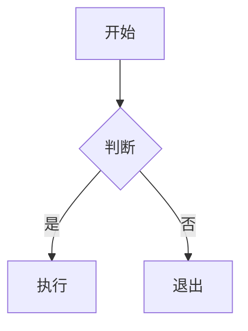
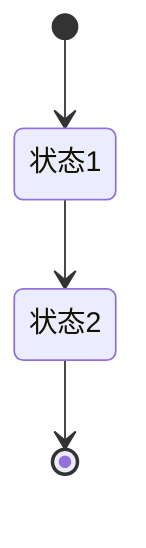
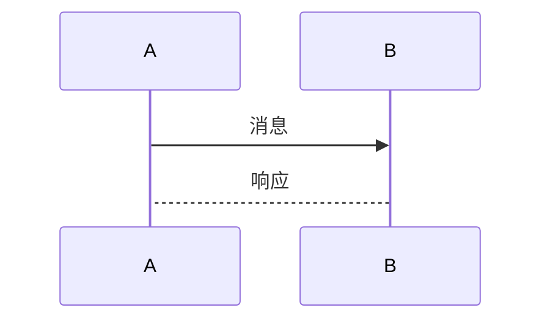

# Obsidian 学术笔记排版规范指南

> 本文档基于 Obsidian 官方文档和社区最佳实践总结

## 一、标题层级规范

### 官方标准层级
Obsidian 使用 6 级标题 (`#` 到 `######`)：

| 层级 | 语法 | 用途 | 字号建议 |
|------|------|------|----------|
| H1 | `# 标题` | 文件顶级标题（等于文件名） | 1.5em - 1.75em |
| H2 | `## 标题` | 主要章节 | 1.25em - 1.5em |
| H3 | `### 标题` | 子章节 | 1.1em - 1.25em |
| H4 | `#### 标题` | 细节分类 | 1em |
| H5 | `##### 标题` | 次要细节 | 0.9em |
| H6 | `###### 标题` | 最小分类 | 0.85em |

### 学术笔记推荐结构

```
# 笔记主题 (H1 - 文件名即标题)
## 一级章节 (H2)
### 二级章节 (H3)
#### 具体概念 (H4)
```

**原则**：
- H1 在笔记中通常只使用一次（文件开头）
- 避免跳级使用（如 H2 后直接 H4）
- 标题应简洁明了，不超过一行

## 二、文本格式规范

### 加粗、斜体、高亮

| 样式 | 语法 | 用途 |
|------|------|------|
| **加粗** | `**文本**` | 关键词、核心概念、重要数值 |
| *斜体* | `*文本*` | 术语强调、英文名称 |
| ==高亮== | `==文本==` | 需要醒目但非关键词的内容 |

### 学术场景使用规范

```
**关键参数**：频率范围 0.1-10 THz
*Ti:Sa激光器* 是最常用的泵浦源
==注意==：需要充氮气保护
```

## 三、列表格式

### 无序列表
- 使用 `-` 或 `*` 符号
- 嵌套使用 2-4 个空格缩进
- 同一层级保持一致的缩进

### 有序列表
- 使用 `1.` `2.` `3.` 格式
- 步骤类内容使用有序列表
- Shift+Enter 可以在列表内换行

### 学术笔记列表规范

```
**优点**：
- 优点1
- 优点2
  - 子优点2.1
  - 子优点2.2

**缺点**：
1. 缺点1
2. 缺点2
```

## 四、表格格式

### Obsidian 表格语法

```markdown
| 列1 | 列2 | 列3 |
|------|------|------|
| 内容 | 内容 | 内容 |
```

### 对齐方式

```markdown
| 左对齐 | 居中 | 右对齐 |
|:------|:----:|------:|
| 内容 | 内容 | 内容 |
```

### 学术表格规范

| 元素 | 规范 |
|------|------|
| 表头 | 首行加粗，背景色区分 |
| 对齐 | 数据右对齐，文字左对齐 |
| 单位 | 在表头或括号中标明 |
| 引用 | 大表格可拆分为多个小表 |

## 五、代码块

### 行内代码
- 用于：参数名、变量名、代码片段
- 语法：`` `code` ``

### 代码块
- 用于：完整代码、命令、配置
- 语法：```` ```language ````

### 学术笔记代码规范

```
```python
# Python 示例
import numpy as np
E_thz = dJ/dt
```
```

## 六、数学公式

### 行内公式
- 语法：`$公式$`
- 用于：简短公式如 $E = mc^2$

### 块级公式
- 语法：`$$\n公式\n$$`
- 用于：重要公式、推导过程

### 公式格式规范

```
> [!formula]+ 公式名称
> $$E_{THz}(t) \propto \frac{dJ(t)}{dt}$$
>
> 其中：
> - $J(t)$ = 瞬态电流
> - $t$ = 时间
```

## 七、Callout（标注框）

### 官方支持类型

| 类型 | 用途 | 颜色 |
|------|------|------|
| `note` | 信息说明 | 蓝 |
| `abstract` | 摘要/总结 | 蓝 |
| `tip` | 提示/技巧 | 绿 |
| `success` | 成功/优势 | 绿 |
| `warning` | 警告/注意 | 黄 |
| `danger` | 危险/错误 | 红 |
| `info` | 一般信息 | 蓝 |
| `quote` | 引用 | 紫 |

### 自定义学术 Callout

```css
.callout[data-callout="formula"] {
    background: linear-gradient(135deg, #ede9fe 0%, #ddd6fe 100%);
    border-color: #8250df;
}
```

### Callout 使用场景

| 内容类型 | 推荐 Callout |
|---------|-------------|
| 一句话物理图像 | `concept` |
| 核心公式 | `formula` |
| 关键参数 | `key-point` |
| 物理图像 | `tip` |
| 注意事项 | `warning` |
| 优势总结 | `success` |
| 参考文献 | `cite` |

## 八、Mermaid 图表

### 流程图



### 状态图



### 序列图



## 九、排版美学原则

### 字体大小层级

| 元素 | 相对字号 | CSS 变量 |
|------|----------|----------|
| 标题 1 | 1.5em | --h1-size |
| 标题 2 | 1.3em | --h2-size |
| 标题 3 | 1.1em | --h3-size |
| 正文 | 1em | --font-text-size |
| 小字 | 0.85em | --font-small |

### 间距规范

| 元素 | 间距建议 |
|------|----------|
| 标题与正文 | 16px - 24px |
| 段落之间 | 12px - 16px |
| 列表项之间 | 4px - 8px |
| 表格行之间 | 8px - 12px |

### 视觉层次

```
┌─────────────────────────────────────┐
│  H1 - 章节标题（大标题）              │
│  ━━━━━━━━━━━━━━━━━━━━━━━━━━━━━━━━━  │
│                                     │
│  H2 - 二级标题（重要概念）             │
│  ┌─────────────────────────────────┐│
│  │ Callout - 核心概念框             ││
│  └─────────────────────────────────┘│
│                                     │
│  H3 - 三级标题（详细说明）            │
│  正文内容，**加粗**关键词，*斜体*术语  │
│                                     │
│  ┌─────────────────────────────────┐│
│  │ 表格 - 参数对比                  ││
│  └─────────────────────────────────┘│
└─────────────────────────────────────┘
```

## 十、常见问题

### Q: 标题太大/太小
A: 在 CSS 中覆盖 `--h1-size`、`--h2-size` 等变量

### Q: 表格对齐不生效
A: 确保表格语法正确，使用 `:` 指定对齐 `:---`、`:---:`、`---:`

### Q: Callout 图标不显示
A: 检查 CSS snippet 是否正确启用，或使用 emoji 作为替代

### Q: Mermaid 图渲染异常
A: 确保在 Obsidian 设置中启用了"Mermaid 图表"支持

## 十一、CSS 变量参考

```css
:root {
    /* 字号 */
    --font-text-size: 16px;
    --h1-size: 1.5em;
    --h2-size: 1.3em;
    --h3-size: 1.1em;

    /* 颜色 */
    --text-accent: #6366f1;
    --background-accent: rgba(99, 102, 241, 0.1);

    /* 间距 */
    --spacing: 16px;
    --line-height: 1.6;
}
```

## 十二、快速检查清单

- [ ] 标题层级是否连续（无跳级）
- [ ] 关键概念是否用 **加粗** 强调
- [ ] 术语是否用 *斜体* 标记
- [ ] 公式是否在 callout 中
- [ ] 表格是否有表头加粗
- [ ] 列表是否有适当的层级缩进
- [ ] Mermaid 图是否清晰可读
- [ ] Callout 类型是否恰当

---

*本规范基于 Obsidian 官方文档和社区最佳实践总结，持续更新。*
