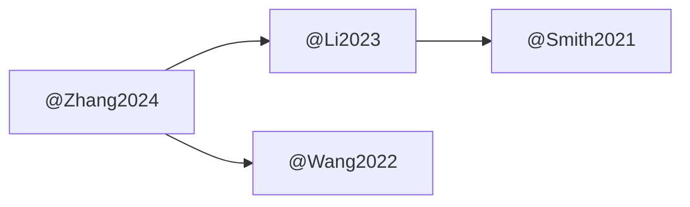

# 文献同步技能

## 能力概览

1. **Zotero → Obsidian 同步** - 将 Zotero 文献转为 Obsidian 笔记
2. **BibTeX 导入** - 从 BibTeX 文件批量导入
3. **引用格式化** - 生成标准 cite key 和引用格式
4. **文献关联** - 建立文献间的引用关系图

## 工作流程

### 方式 1: BibTeX 导出 (推荐)

1. 在 Zotero 中安装 **Better BibTeX** 插件
2. 配置自动导出：`Zotero → 导出库 → Better-BibTeX`
3. 选择位置：`Self_Learning/Zotero/export.bib`
4. 运行同步：
   ```bash
   python Obsidian-Vault/6️⃣ 工具/scripts/sync_zotero.py --bibtex Zotero/export.bib
   ```

### 方式 2: Zotero API (需要配置)

1. 获取 API Key：Zotero → 设置 → Feeds/API
2. 设置环境变量：
   ```bash
   export ZOTERO_LIBRARY_ID=your_library_id
   export ZOTERO_API_KEY=your_api_key
   ```
3. 运行同步：
   ```bash
   python Obsidian-Vault/6️⃣ 工具/scripts/sync_zotero.py --zotero
   ```

## 笔记模板

生成的文献笔记位于：`Obsidian-Vault/4️⃣ 文献库/@AuthorYear.md`

包含：
- 论文元数据 (title, authors, journal, DOI)
- 研究问题
- 核心创新点
- 关键技术路线
- 主要结论
- 对自己的启发

## 引用格式

### Obsidian 内部引用
```
[[cite:@author2024]]      → 作者, 2024
[[@author2024]]           → (作者, 2024)
[[cite:@author2024|p.]]   → 作者, 2024, p.xx
```

### BibTeX Key 格式
```
@Author2024
@Zhang2024NaturePhotonics
```

## 文献关联

自动生成引用关系图：



## 常用命令

| 命令 | 用途 |
|------|------|
| `sync_zotero.py --list` | 列出所有文献 |
| `sync_zotero.py --key ABCD123` | 同步特定文献 |
| `sync_zotero.py --dry-run` | 预览同步内容 |

## Zotero 插件推荐

1. **Better BibTeX** - 自动化 BibTeX 导出
2. **Zotero Integration** - Obsidian 内直接引用
3. **ZotFile** - PDF 自动重命名和附件管理
