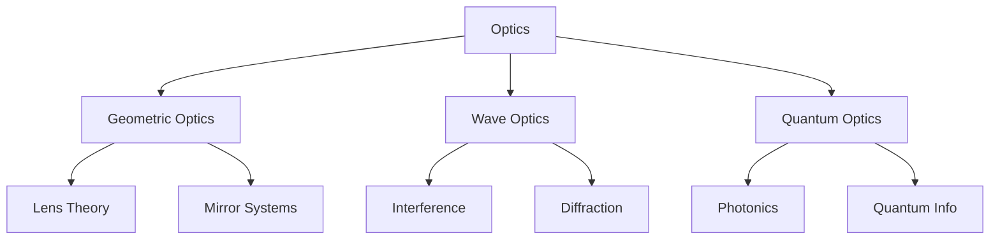
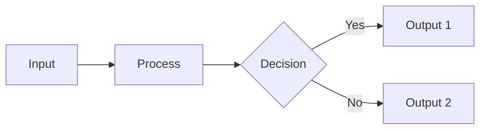
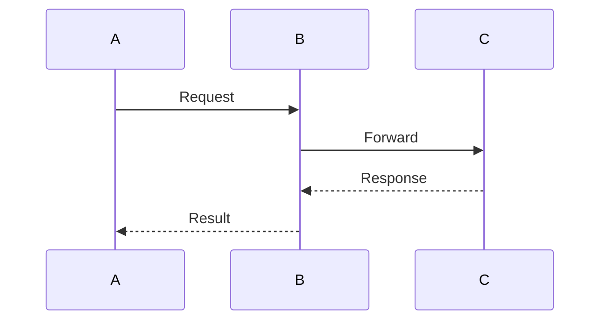
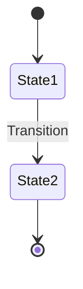
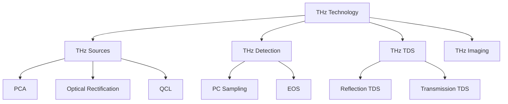
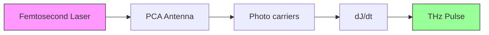

# Mermaid Diagram Generation Skill

## Overview

This skill generates Mermaid diagrams for visualizing knowledge structures, workflows, and relationships. Mermaid diagrams are rendered as SVGs and embedded directly in Markdown/ Obsidian.

## Mermaid MCP Tools

The following MCP tools are available:
- `generate_mermaid_diagram` - Generate Mermaid diagram as base64 PNG, SVG, or Mermaid code

## Diagram Types

| Type | Best For | Mermaid Keyword |
|------|----------|----------------|
| Flowchart | Processes, decision trees | `graph` |
| Sequence | Interactions, protocols | `sequenceDiagram` |
| Class | OOP structures | `classDiagram` |
| State | State machines | `stateDiagram` |
| ER | Database schemas | `erDiagram` |
| Gantt | Timelines | `gantt` |
| Pie | Distributions | `pie` |
| Mindmap | brainstorming | `mindmap` |

## Common Patterns

### Knowledge Tree (Recommended for Optics Research)



### Flowchart for Process



### Sequence Diagram



### State Diagram



## Usage Guidelines

### When to Use Mermaid vs Other Tools

| Use Case | Tool | Why |
|----------|------|-----|
| Knowledge tree | Mermaid | Free, fast, editable |
| Simple flowchart | Mermaid | Standard, integrated |
| Architecture diagram | diagram-generator | More control |
| Realistic illustration | image-generation | Photorealistic |
| Technical schematic | image-generation | Detailed rendering |

### Recommended Parameters

```
output_type: "svg"   # SVG for crisp rendering at any size
theme: "default"     # default/base/forest/dark/neutral
backgroundColor: "white"  # or transparent
```

## Example Prompts

**User**: "生成太赫兹知识体系的知识树"



**User**: "画一个光电导天线发射太赫兹的流程"



## Best Practices

1. **Use consistent naming** - `[Node]` for nodes, `"Label"` for labels
2. **Add styling** - Use `style` for emphasis on key nodes
3. **Keep it simple** - Break complex diagrams into smaller ones
4. **Use appropriate direction** - `TD` (top-down) for trees, `LR` (left-right) for flows
5. **Add colors sparingly** - for emphasis, not decoration

## Integration with Project

1. Generate Mermaid code
2. Save to Obsidian note with code block: ` ```mermaid `
3. Or use `generate_mermaid_diagram` MCP for rendered image
4. Save to: `Obsidian-Vault/6️⃣ 工具/visualizations/`
5. Insert reference: `![[visualizations/diagram.png]]`

## Error Handling

If Mermaid generation fails:
1. Check syntax - common issues with special characters
2. Simplify the graph structure
3. Remove non-ASCII characters from labels
4. Try SVG output instead of base64
5. Fall back to text description

## Notes

- Mermaid is free and doesn't consume API quota
- For Obsidian, install "Excalidraw" or "Mermaid" plugin for live preview
- Complex diagrams may render better as image-generation
- mindmap syntax is newer - test compatibility
