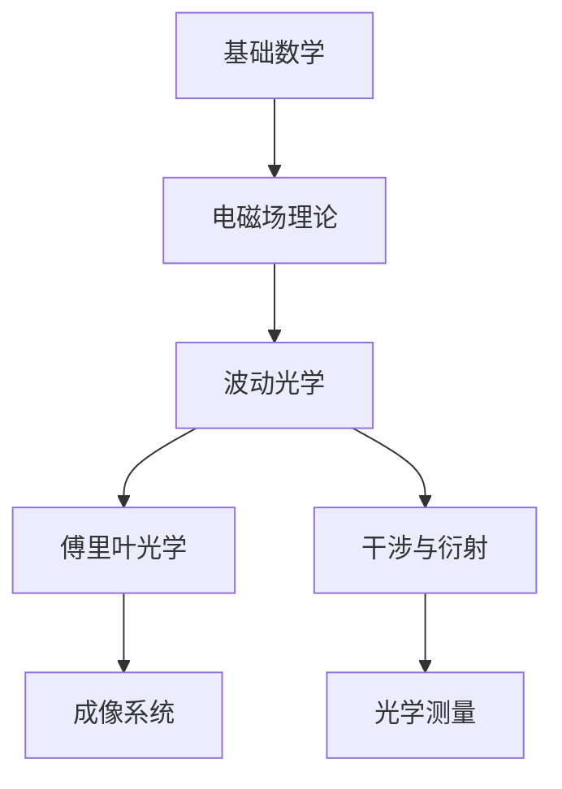

# 光学学习技能

## 能力概览

当你需要系统学习某个光学领域时，此技能提供：

1. **知识树构建** - 分析领域内的概念依赖关系
2. **学习路径规划** - 确定从基础到高级的学习顺序
3. **可视化** - 生成概念关系图和流程图
4. **进度跟踪** - 帮助你记录和追踪学习状态

## 知识树构建流程

### 1. 领域分析
分析目标领域的关键概念：
- 核心定义和原理
- 关键公式和定律
- 典型应用场景
- 与其他领域的关联

### 2. 依赖关系梳理
确定前置知识（必须先学）和并行知识（可以同时学）：

```
前置依赖：
  A 知识 → B 知识 （必须先学 A 才能学 B）

并行关系：
  A 知识 ←→ B 知识 （两者可以交叉学习）
```

### 3. 生成结构

输出格式：
```markdown
# [领域] 知识树

## Level 1: 基础概念
- [[概念A]] - 核心定义
- [[概念B]] - 关键原理

## Level 2: 核心理论
- [[理论X]] - 核心公式
- [[理论Y]] - 关键应用

## Level 3: 高级应用
- [[应用Z]] - ...

## 学习路径
1. 先学 [[A]] 和 [[B]]
2. 然后学 [[X]]
3. 最后深入 [[Z]]
```

## 可视化支持

### Mermaid 图

自动生成知识树的可视化：



### Python 可视化

使用 `optics_viz.py` 脚本生成概念图：

- 高斯光束传播
- 衍射图样
- 超表面相位分布
- 干涉条纹

## 学习进度跟踪

### 状态定义
- `ideas` - 听说过，了解大概
- `studying` - 正在学习
- `mastered` - 已掌握
- `reference` - 作为参考

### Dataview 查询

在 Obsidian 中使用：
```
```dataview
TABLE title, type, status
FROM ""
WHERE field = "optics" AND subfield = "超表面光学"
SORT status
```
```

## 光学子领域清单

### 基础层
- 电磁场理论 (Maxwell 方程)
- 波动光学 (干涉、衍射、偏振)
- 几何光学 (光线追迹、成像)

### 方法层
- 傅里叶光学 (频率分析、传递函数)
- 激光物理 (谐振腔、增益介质)
- 非线性光学 (极化率、XPM、SPM)

### 应用层
- 超表面光学 (相位调控、异常折射)
- 等离激元光学 (SPR、纳米光学)
- 量子光学 (纠缠、压缩态)

### 计算层
- FDTD (时域有限差分)
- RCWA (严格耦合波分析)
- BPM (光束传播法)

## 快速启动命令

当你需要开始新领域学习时，使用以下 prompt：

```
"帮我构建 [领域名] 的知识树，生成 Obsidian 笔记并更新学习路径"
```

## 示例

### 超表面光学知识树

```
超表面光学
├── 前置知识
│   ├── 电磁场理论
│   ├── 波动光学
│   └── 广义斯涅尔定律
├── 核心概念
│   ├── 相位突变 (Phase Discontinuity)
│   ├── 广义反射/折射定律
│   └── 共振单元设计
├── 关键技术
│   ├── V 形天线阵列
│   ├── 高折射率介电纳米柱
│   └── 几何相位 (Pancharatnam-Berry)
└── 应用方向
    ├── 超构透镜 (Metalens)
    ├── 轨道角动量生成
    └── 智能光学表面
```
