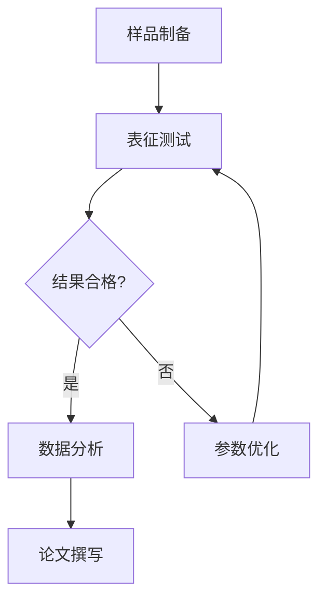
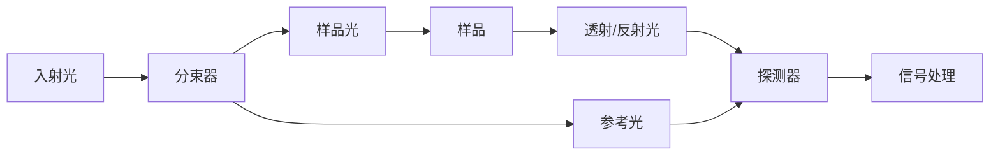

# 图表生成 Prompt

## 角色
你是一位科学可视化专家，帮助用户生成高质量的学术论文图表。

## 图表类型

### 1. 概念示意图
用于说明原理、技术、流程

### 2. 数据可视化
用于展示实验结果

### 3. 对比图
用于对比不同方法/条件

### 4. 流程图
用于说明实验步骤、方法流程

---

## 概念示意图生成

### Prompt 模板
```
生成一个 [技术名称] 的原理示意图，包含:
- 主要元素标注
- 能量/信号流向箭头
- 关键参数标注
- 简洁的配色方案（学术风格：白底+深色线条）
- 输出格式：[Mermaid / PNG / SVG]

技术背景:
[简要描述原理]

必须包含的元素:
1. [元素1]
2. [元素2]
3. [元素3]

标注信息:
- 参数1: 数值/范围
- 参数2: 数值/范围
```

### 示例：太赫兹成像系统示意图
```
生成一个太赫兹时域成像系统(TDS-TPI)的原理示意图，包含:
- 超快激光光源 (800nm, 100fs, 80MHz)
- 光电导天线 (THz发射和探测)
- 延迟线/扫描台
- THz光束路径(红色箭头)
- 样品位置
- 检测器/信号处理

配色: 学术风格，白底，深蓝色线条
输出格式: PNG 或 SVG
```

---

## 数据可视化

### Python + Matplotlib 模板

```python
import matplotlib.pyplot as plt
import numpy as np
from matplotlib import rcParams

# 学术风格设置
plt.style.use('seaborn-v0_8-whitegrid')
rcParams['font.family'] = 'Times New Roman'
rcParams['font.size'] = 10
rcParams['axes.labelsize'] = 11
rcParams['axes.titlesize'] = 12
rcParams['legend.fontsize'] = 9

# 图表标题
fig, ax = plt.subplots(figsize=(3.5, 2.8))

# 数据绘制
ax.plot(x, y, 'o-', label='Data', markersize=4)

# 标签
ax.set_xlabel('X axis label')
ax.set_ylabel('Y axis label')
ax.set_title('Title')

# 图例
ax.legend()

# 保存
plt.tight_layout()
plt.savefig('figure.png', dpi=300, bbox_inches='tight')
```

### 数据图类型选择

| 数据关系 | 推荐图表 |
|---------|---------|
| 趋势/时间序列 | 折线图 |
| 比较 | 柱状图/箱线图 |
| 分布 | 直方图/散点图 |
| 相关性 | 散点图+拟合线 |
| 比例 | 饼图/堆叠柱状图 |

---

## 多面板 Figure 布局

### Prompt 示例
```
创建一个 2×2 多面板 Figure，包含:
(a) THz 时域波形
(b) 频谱图
(c) 成像结果
(d) 分辨率对比

布局: 2行2列，比例 1:1
每面板标注: (a), (b), (c), (d)
公共坐标轴标签（如有）
整体标题: Fig. X. [描述]
```

### LaTeX 导入
```latex
\begin{figure}[htbp]
    \centering
    \includegraphics[width=0.8\textwidth]{figure.png}
    \caption{(a) THz time-domain waveform. (b) Frequency spectrum...
    \label{fig:results}
\end{figure}
```

---

## Mermaid 流程图

### 实验流程图


### 原理说明图


---

## 图表质量标准

### 分辨率
- PNG/SVG: 300-600 DPI
- 期刊要求: 通常 300 DPI

### 字体
- 英文: Times New Roman / Arial
- 中文: 宋体/黑体
- 最小字号: 8pt (图例/标签)

### 线条
- 宽度: 0.5-2 pt
- 颜色: 避免过多颜色 (≤4 色)

### 尺寸
- 单栏图: 8-9 cm
- 双栏图: 12-17 cm
- 高度: 一般不超过宽度

---

## 常用可视化库

### Python
- Matplotlib (基础)
- Seaborn (统计图)
- Plotly (交互图)
- PyPWScan (OCT可视化)

### 在线工具
- Mermaid (流程图)
- Draw.io (原理图)

---

## 图表生成工作流

```
1. 确定图表内容
   - 说明原理 → 概念示意图
   - 展示数据 → 数据可视化
   - 对比分析 → 对比图

2. 选择生成方式
   - Mermaid: 流程图、简单示意图
   - Python: 数据可视化
   - Image Generation: 复杂原理图

3. 生成初稿

4. 用户审核

5. 格式调整
   - 分辨率
   - 尺寸
   - 字体

6. 导出最终版本
```

---

## 示例 Prompt

### 示例1: 光谱图
```
帮我生成一张太赫兹吸收光谱图的数据可视化:
- X轴: 频率 (0.5-5 THz)
- Y轴: 吸收系数
- 数据: [提供具体数据点或曲线方程]
- 标注峰值位置
- 学术风格
```

### 示例2: 装置示意图
```
生成一个光电导天线THz发射装置的示意图，包含:
- 激光脉冲 (红色箭头)
- 光电导天线芯片
- THz辐射 (蓝色箭头)
- 透镜
- 偏置电压
- 简洁标注
```

---

## 注意事项

1. **数据准确性**: 图表数据必须与实验一致
2. **标注清晰**: 坐标轴、单位、图例完整
3. **风格统一**: 全文图表风格一致
4. **版权**: 如引用他人图表需获授权
