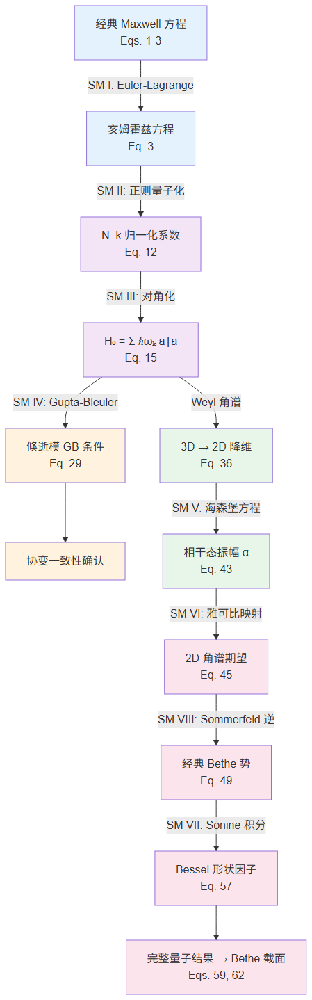

本补充材料按推导链路组织，依次填补正文因篇幅所限省略的中间步骤。图 S1 给出完整的推导逻辑总览：经典场论出发（I-II）→ 场算符与哈密顿量（III）→ 协变验证（IV）→ 微扰动力学（V-VI）→ 经典回归与有限孔径（VII-VIII）。

# I. Euler-Lagrange 方程与亥姆霍兹波动方程

正文 Eq. (4) 给出库仑规范下拉格朗日量密度 $\mathcal{L} = \frac{\epsilon_0}{2}\dot{\boldsymbol{A}}^2 - \frac{1}{2\mu_0}(\nabla\times\boldsymbol{A})^2$，并指出对其施加 Euler-Lagrange 方程可得到亥姆霍兹波动方程 Eq. (3)。本节展开这一推导。

## Euler-Lagrange 方程的三项贡献

取矢量势的各分量 $A_j$（$j = 1,2,3$）为广义坐标。Euler-Lagrange 方程包含三项：

$$\frac{\partial\mathcal{L}}{\partial A_j} - \frac{\partial}{\partial t}\frac{\partial\mathcal{L}}{\partial\dot{A}_j} - \frac{\partial}{\partial x_i}\frac{\partial\mathcal{L}}{\partial(\partial_i A_j)} = 0$$

**第一项为零。** $\mathcal{L}$ 不显含 $A_j$ 本身——它仅通过 $\dot{\boldsymbol{A}}$ 的时间导数和 $\nabla\times\boldsymbol{A}$ 的空间导数间接依赖于 $A_j$。因此 $\partial\mathcal{L}/\partial A_j = 0$。

**第二项（时间导数）。** $\mathcal{L}$ 中含 $\dot{A}_j$ 的部分为 $\frac{\epsilon_0}{2}\sum_j\dot{A}_j^2$，求导得 $\epsilon_0\dot{A}_j$，再对时间取偏导：

$$-\frac{\partial}{\partial t}\frac{\partial\mathcal{L}}{\partial\dot{A}_j} = -\epsilon_0\ddot{A}_j$$

这一项对应场的惯性（动能项的时间变化）。

**第三项（空间导数）是推导的关键。** $\mathcal{L}$ 中含空间导数的项为 $-\frac{1}{2\mu_0}(\nabla\times\boldsymbol{A})^2$。先展开旋度平方：

$$(\nabla\times\boldsymbol{A})^2 = \sum_l\!\left(\sum_{m,n}\epsilon_{lmn}\partial_m A_n\right)^{\!2} = \sum_{l,m,n,p,q}\epsilon_{lmn}\epsilon_{lpq}(\partial_m A_n)(\partial_p A_q).$$

对 $\partial_i A_j$ 求偏导时，下标 $(m,n)$ 中出现 $j$ 的贡献和 $(p,q)$ 中出现 $j$ 的贡献各出现一次。利用 Levi-Civita 符号的缩并性质

$$\epsilon_{lmn}\epsilon_{lpq} = \delta_{mp}\delta_{nq} - \delta_{mq}\delta_{np},$$

化简后空间导数项给出

$$-\frac{\partial}{\partial x_i}\frac{\partial\mathcal{L}}{\partial(\partial_i A_j)} = -\frac{1}{\mu_0}\bigl[\nabla(\nabla\cdot\boldsymbol{A}) - \nabla^2\boldsymbol{A}\bigr]_j$$

## 库仑规范与最终结果

三项合并为矢量形式：

$$-\epsilon_0\ddot{\boldsymbol{A}} - \frac{1}{\mu_0}\bigl[\nabla(\nabla\cdot\boldsymbol{A}) - \nabla^2\boldsymbol{A}\bigr] = 0.$$

库仑规范条件 $\nabla\cdot\boldsymbol{A} = 0$ 直接消去 $\nabla(\nabla\cdot\boldsymbol{A})$ 项，剩余部分利用 $\mu_0\epsilon_0 = 1/c^2$ 即得无源亥姆霍兹方程

$$\nabla^2\boldsymbol{A} - \frac{1}{c^2}\frac{\partial^2\boldsymbol{A}}{\partial t^2} = 0,$$

即正文 Eq. (3) 的无源形式。含源时，拉格朗日量密度中加入外源耦合项后，$\partial\mathcal{L}/\partial A_j \neq 0$，右侧出现磁化电流 $\boldsymbol{J}=\nabla\times\boldsymbol{M}$ 与极化电流 $\epsilon_0\partial\boldsymbol{P}/\partial t$ 之和，回到正文 Eq. (3)。

# II. 归一化系数 $N_k$ 的推导

正文通过将模展开 Eq. (6) 代入等时对易关系 Eq. (8)，定出了归一化系数 Eq. (12)。本节给出从对易子展开到逐项匹配的完整过程。

## 共轭动量与对易子展开

共轭动量 $\hat{\Pi}_j = -\epsilon_0\hat{E}_j$，将模展开 Eq. (6) 代入后：

$$\hat{\Pi}_j(\boldsymbol{r}',t) = -i\epsilon_0\!\int\!\mathrm{d}^3k\sum_\lambda \omega_k N_k\left[\hat{a}_{\boldsymbol{k}\lambda}\,\varepsilon_j^{\boldsymbol{k}\lambda}\,e^{-i(\omega_k t - \boldsymbol{k}\cdot\boldsymbol{r}')} - \mathrm{h.c.}\right].$$

将 $\hat{A}_i(\boldsymbol{r})$ 和 $\hat{\Pi}_j(\boldsymbol{r}')$ 的展开式同时代入 $[\hat{A}_i,\hat{\Pi}_j]$。展开式中有四类对易子：$[\hat{a},\hat{a}]$、$[\hat{a}^\dagger,\hat{a}^\dagger]$、$[\hat{a},\hat{a}^\dagger]$、$[\hat{a}^\dagger,\hat{a}]$。前两类为零。交叉对易子 $[\hat{a},\hat{a}^\dagger]$ 贡献

$$[\hat{A}_i,\hat{\Pi}_j] \supset -i\epsilon_0\!\int\!\mathrm{d}^3k\!\int\!\mathrm{d}^3k'\,N_k N_{k'}\omega_{k'}\sum_{\lambda,\lambda'}\varepsilon_i^{\boldsymbol{k}\lambda}\varepsilon_j^{\boldsymbol{k}'\lambda'*}\left[\hat{a}_{\boldsymbol{k}\lambda},\hat{a}_{\boldsymbol{k}'\lambda'}^\dagger\right]e^{-i\boldsymbol{k}\cdot\boldsymbol{r}+i\boldsymbol{k}'\cdot\boldsymbol{r}'}.$$

## 消去 $\boldsymbol{k}'$ 积分

利用玻色对易关系 $[\hat{a}_{\boldsymbol{k}\lambda},\hat{a}_{\boldsymbol{k}'\lambda'}^\dagger] = \delta_{\lambda\lambda'}\delta^{(3)}(\boldsymbol{k}-\boldsymbol{k}')$，$\boldsymbol{k}'$ 积分直接积出，同时 $\lambda'$ 求和退化为 $\lambda'=\lambda$：

$$[\hat{A}_i,\hat{\Pi}_j] \supset -i\epsilon_0\!\int\!\mathrm{d}^3k\,N_k^2\omega_k\sum_\lambda\varepsilon_i^{\boldsymbol{k}\lambda}\varepsilon_j^{\boldsymbol{k}\lambda*}\,e^{i\boldsymbol{k}\cdot(\boldsymbol{r}'-\boldsymbol{r})}.$$

加上反交叉项 $[\hat{a}^\dagger,\hat{a}]$ 的贡献（复共轭项，给出相同的积分），结果加倍：

$$[\hat{A}_i,\hat{\Pi}_j] = -2i\epsilon_0\!\int\!\mathrm{d}^3k\,N_k^2\omega_k\sum_\lambda\varepsilon_i^{\boldsymbol{k}\lambda}\varepsilon_j^{\boldsymbol{k}\lambda*}\,e^{i\boldsymbol{k}\cdot(\boldsymbol{r}'-\boldsymbol{r})}.$$

## 极化求和与逐项匹配

对 $\lambda$ 求和调用正文 Eq. (9) 的极化完备性关系：

$$\sum_\lambda\varepsilon_i^{\boldsymbol{k}\lambda}\varepsilon_j^{\boldsymbol{k}\lambda*} = \delta_{ij}^\perp(\boldsymbol{k}) = \delta_{ij} - \frac{k_ik_j}{|\boldsymbol{k}|^2}.$$

代入后：

$$[\hat{A}_i,\hat{\Pi}_j] = -2i\epsilon_0\!\int\!\mathrm{d}^3k\,N_k^2\omega_k\,\delta_{ij}^\perp(\boldsymbol{k})\,e^{i\boldsymbol{k}\cdot(\boldsymbol{r}'-\boldsymbol{r})}.$$

另一方面，正文 Eq. (8) 要求 $[\hat{A}_i,\hat{\Pi}_j] = i\hbar\,\delta_{ij}^\perp(\boldsymbol{r}-\boldsymbol{r}')$。将横向 $\delta$ 函数展开为 Fourier 积分（正文 Eq. 10）：

$$\delta_{ij}^\perp(\boldsymbol{r}-\boldsymbol{r}') = \int\frac{\mathrm{d}^3k}{(2\pi)^3}\,\delta_{ij}^\perp(\boldsymbol{k})\,e^{i\boldsymbol{k}\cdot(\boldsymbol{r}-\boldsymbol{r})}.$$

被积函数逐项匹配，要求

$$-2\epsilon_0\omega_k N_k^2 = \frac{-\hbar}{(2\pi)^3},$$

即 $2\epsilon_0\omega_k N_k^2 = \hbar/(2\pi)^3$。解出正文 Eq. (12)：

$$N_k = \sqrt{\frac{\hbar}{2\epsilon_0\omega_k(2\pi)^3}}.$$

# III. 自由场哈密顿量中交叉项的抵消

正文直接给出了自由场哈密顿量的对角形式 $\hat{H}_0 = \int\mathrm{d}^3k\sum_\lambda\hbar\omega_k(\hat{a}_{\boldsymbol{k}\lambda}^\dagger\hat{a}_{\boldsymbol{k}\lambda} + 1/2)$，省略了 $\hat{\boldsymbol{E}}^2$ 和 $\hat{\boldsymbol{B}}^2$ 展开后交叉项的抵消过程。

## 交叉项的来源

将场算符代入 $\hat{H}_0 = \int(\epsilon_0\hat{\boldsymbol{E}}^2/2 + \hat{\boldsymbol{B}}^2/2\mu_0)\,\mathrm{d}^3r$，$\hat{\boldsymbol{E}}^2$ 展开为两项之和：

- **对角型** $\hat{a}^\dagger\hat{a}$：含因子 $e^{i(\boldsymbol{k}-\boldsymbol{k}')\cdot\boldsymbol{r}}$
- **交叉型** $\hat{a}\hat{a}$ 及其共轭：含因子 $e^{-i(\boldsymbol{k}+\boldsymbol{k}')\cdot\boldsymbol{r}}$

对交叉型项做空间积分产生 $(2\pi)^3\delta^{(3)}(\boldsymbol{k}+\boldsymbol{k}')$，从而 $\boldsymbol{k}'=-\boldsymbol{k}$、$\omega_{k'}=\omega_k$。极化求和后系数非零。这意味着单独看电场部分，交叉项并不消失。

## 电场与磁场交叉项的精确相消

抵消发生在电场贡献与磁场贡献相加时。磁场算符的展开比电场多出一个叉乘因子 $\boldsymbol{k}\times\boldsymbol{\varepsilon}^{\boldsymbol{k}\lambda}$：

$$\hat{\boldsymbol{B}} \propto \sum N_k(\boldsymbol{k}\times\boldsymbol{\varepsilon}^{\boldsymbol{k}\lambda})\,\hat{a}_{\boldsymbol{k}\lambda}\,e^{-i(\omega_kt-\boldsymbol{k}\cdot\boldsymbol{r})} + \mathrm{h.c.}$$

关键在于：当 $\boldsymbol{k}'=-\boldsymbol{k}$ 时，$(−\boldsymbol{k})\times\boldsymbol{\varepsilon}^{−\boldsymbol{k}\lambda'} = −(\boldsymbol{k}\times\boldsymbol{\varepsilon}^{\boldsymbol{k}\lambda'})$，引入额外负号。这使得 $\hat{\boldsymbol{E}}^2$ 中交叉项的系数恰好被 $\hat{\boldsymbol{B}}^2/c^2$ 中的等量反号项抵消。

残余的对角型项经对易关系 $[\hat{a},\hat{a}^\dagger\hat{a}] = \hat{a}$ 化简后，所有模式解耦，给出正文 Eq. (15) 的简谐振子求和形式。零点能 $\hbar\omega_k/2$ 不影响动力学，后续计算中略去。

# IV. 倏逝模的 Gupta-Bleuler 条件

正文给出了传播模的 Gupta-Bleuler 条件 $[\hat{a}^{(0)}−\hat{a}^{(3)}]|\mathrm{phys}\rangle=0$（Eq. 25）和倏逝模的修正形式（Eq. 29）。本节推导后者。

## 从协变条件出发

Gupta-Bleuler 物理态条件为

$$\partial_\mu\hat{A}^{\mu(+)}|\mathrm{phys}\rangle = 0.$$

在动量空间中展开，等价于 $k_\mu$ 对各极化湮灭算符的加权求和为零。横向极化 $\lambda=1,2$ 满足 $k_\mu\varepsilon^{(\lambda)\mu}=0$，不参与。剩余为标量极化（$\lambda=0$）和纵向极化（$\lambda=3$）的贡献。

## 倏逝模的色散关系

对于倏逝模，$k_z = i\kappa$（$\kappa = \sqrt{k_\perp^2 - k_0^2}$），四维波矢为 $k_\mu = (\omega/c,\,k_x,\,k_y,\,i\kappa)$。等频面色散关系给出

$$k_0^2 = k_\perp^2 + k_z^2 = k_\perp^2 - \kappa^2,$$

因此纵向分量的有效波矢幅为 $\sqrt{k_\perp^2-\kappa^2} = k_0 = \omega/c$。

## 标量与纵向的配对抵消

标量极化的贡献为 $k_0\hat{a}^{(0)} = (\omega/c)\hat{a}^{(0)}$。纵向极化的贡献为有效纵向波矢幅乘以 $\hat{a}^{(3)}$，即 $\sqrt{k_\perp^2-\kappa^2}\;\hat{a}^{(3)} = k_0\hat{a}^{(3)}$。代入协变条件 $k_\mu\hat{a}^{(\mu)}|\mathrm{phys}\rangle=0$：

$$\left[\frac{\omega}{c}\,\hat{a}^{(0)}(\boldsymbol{k}) - \sqrt{k_\perp^2-\kappa^2}\;\hat{a}^{(3)}(\boldsymbol{k})\right]|\mathrm{phys}\rangle = 0$$

利用色散关系 $k_0 = \omega/c = \sqrt{k_\perp^2-\kappa^2}$，两个系数相等：

$$\left[\hat{a}^{(0)}(\boldsymbol{k}) - \hat{a}^{(3)}(\boldsymbol{k})\right]|\mathrm{phys}\rangle = 0.$$

与传播模的 Gupta-Bleuler 条件形式完全一致。倏逝模的纵向波矢虽为虚数，但标量与纵向光子的配对抵消关系不受影响——物理态中仅有横向自由度参与，洛伦兹规范与库仑规范在倏逝模区间依然严格等价。

# V. 海森堡运动方程的含时求解

正文的求解涉及对易拆解和绝热开关积分，这里展开全部中间步骤。

## A. 对易拆解

总哈密顿量 $\hat{H} = \hat{H}_0 + \hat{H}_{\mathrm{int}}$ 代入海森堡方程 $i\hbar\,\dot{\hat{a}}_{\boldsymbol{k}\lambda} = [\hat{a}_{\boldsymbol{k}\lambda},\hat{H}]$ 后，对易子拆分为两部分。

**自由场部分。** 利用 $[\hat{a},\hat{a}^\dagger\hat{a}] = \hat{a}$，直接给出

$$[\hat{a}_{\boldsymbol{k}\lambda},\hat{H}_0] = \hbar\omega_k\hat{a}_{\boldsymbol{k}\lambda},$$

对应自由相位演化 $e^{-i\omega_kt}$。

**相互作用部分。** $\hat{H}_{\mathrm{int}}$ 中场算符按模展开为 $\hat{a}_{\boldsymbol{k}'\lambda'}$ 和 $\hat{a}_{\boldsymbol{k}'\lambda'}^\dagger$ 的线性组合。由于 $[\hat{a}_{\boldsymbol{k}\lambda},\hat{a}_{\boldsymbol{k}'\lambda'}] = 0$，只有 $\hat{a}_{\boldsymbol{k}\lambda}$ 与 $\hat{a}_{\boldsymbol{k}'\lambda'}^\dagger$ 的对易产生非零贡献（$\delta$ 函数提取出跃迁矩阵元）：

$$[\hat{a}_{\boldsymbol{k}\lambda},\hat{H}_{\mathrm{int}}] = V_{3\mathrm{D}}^*(\boldsymbol{k},\lambda)\,e^{i\omega_0 t} + V_{3\mathrm{D}}(\boldsymbol{k},\lambda)\,e^{-i\omega_0 t}$$

其中 $V_{3\mathrm{D}}(\boldsymbol{k},\lambda)$ 是正文 Eq. (38) 推广到三维的跃迁矩阵元。含 $e^{i\omega_0 t}$ 的项来自反共振（anti-resonant）通道，含 $e^{-i\omega_0 t}$ 的项来自共振通道。

## B. 积分因子与绝热开关

合并自由场和相互作用部分后，运动方程为

$$i\hbar\,\dot{\hat{a}}_{\boldsymbol{k}\lambda} = \hbar\omega_k\,\hat{a}_{\boldsymbol{k}\lambda} + V_{3\mathrm{D}}^*\,e^{i\omega_0 t} + V_{3\mathrm{D}}\,e^{-i\omega_0 t}$$

移项并乘积分因子 $e^{i\omega_kt}$：

$$\frac{\mathrm{d}}{\mathrm{d}t}\!\left(\hat{a}_{\boldsymbol{k}\lambda}\,e^{i\omega_kt}\right) = -\frac{i}{\hbar}\!\left[V_{3\mathrm{D}}^*\,e^{i(\omega_k+\omega_0)t} + V_{3\mathrm{D}}\,e^{i(\omega_k-\omega_0)t}\right].$$

取初始条件 $t_0\to-\infty$、$\hat{a}(-\infty)|0\rangle=0$，从 $-\infty$ 到 $t$ 积分。为保证微扰开启时不会产生非物理的发散（本质上是围道极点的绕行问题），在积分核中引入绝热开关因子 $e^{\eta t'}$（$\eta\to 0^+$）：

$$\hat{a}_{\boldsymbol{k}\lambda}(t)\,e^{i\omega_kt} = -\frac{i}{\hbar}\!\int_{-\infty}^{t}\!\left[V_{3\mathrm{D}}^*\,e^{i(\omega_k+\omega_0+i\eta)t'} + V_{3\mathrm{D}}\,e^{i(\omega_k-\omega_0-i\eta)t'}\right]\mathrm{d}t'.$$

## C. 非共振项的排除与稳态解

含 $\exp[i(\omega_k+\omega_0+i\eta)t']$ 的项中 $\omega_k+\omega_0 > 0$，被积函数快振荡。积分结果正比于 $e^{i(\omega_k+\omega_0+i\eta)t'}/(i(\omega_k+\omega_0+i\eta))$，在 $t'\to-\infty$ 时 $e^{\eta t'}\to 0$ 保证收敛，但在 $\eta\to 0^+$ 后该因子幅值极小，对稳态无贡献。

仅保留共振项的积分：

$$\int_{-\infty}^{t}V_{3\mathrm{D}}\,e^{i(\omega_k-\omega_0-i\eta)t'}\,\mathrm{d}t' = \frac{V_{3\mathrm{D}}}{i(\omega_k-\omega_0-i\eta)}\,e^{i(\omega_k-\omega_0-i\eta)t}$$

代回并整理，得到正文 Eq. (42)：

$$\hat{a}_{\boldsymbol{k}\lambda}(t) = -\frac{V_{3\mathrm{D}}(\boldsymbol{k},\lambda)}{\hbar}\,\frac{e^{-i\omega_0t+\eta t}}{\omega_k-\omega_0-i\eta}.$$

分母中的 $i\eta$ 使极点 $\omega_k=\omega_0$ 从实轴上方偏入下半平面，后续对频率的积分可用 Sokhotski-Plemelj 公式

$$\frac{1}{\omega_k-\omega_0-i\eta} = \mathcal{P}\frac{1}{\omega_k-\omega_0} + i\pi\,\delta(\omega_k-\omega_0)$$

拆分为主值积分和 $\delta$ 函数贡献，分别对应色散修正和共振吸收。

# VI. 三维到二维角谱的雅可比映射

正文从三维相干态振幅 Eq. (43) 出发，通过雅可比变换将 $k_z$ 积分转化为频率极点处的留数贡献，得到二维角谱期望 Eq. (45)。本节给出详细推导。

## 色散关系与雅可比因子

矢量势期望值 Eq. (44) 中含 $k_z$ 积分：

$$\langle\hat{\boldsymbol{A}}(\boldsymbol{r},t)\rangle = \int\!\mathrm{d}^2k_\perp\int\!\mathrm{d}k_z\,\alpha_{3\mathrm{D}}(\boldsymbol{k},\lambda)\,N_k\,\boldsymbol{\varepsilon}^{\boldsymbol{k}\lambda}\,e^{-i(\omega_kt-\boldsymbol{k}\cdot\boldsymbol{r})}.$$

对固定面内波矢 $\boldsymbol{k}_\perp$，色散关系 $\omega_k = c\sqrt{k_\perp^2+k_z^2}$ 给出

$$\frac{\mathrm{d}\omega_k}{\mathrm{d}k_z} = \frac{c^2k_z}{\omega_k} \quad\Longrightarrow\quad \mathrm{d}k_z = \frac{\omega_k}{c^2k_z}\,\mathrm{d}\omega_k$$

## 留数计算

代入 $\alpha_{3\mathrm{D}} = -V_{3\mathrm{D}}/[\hbar(\omega_k-\omega_0-i\eta)]$（正文 Eq. (43)），$k_z$ 积分变为

$$\int\!\mathrm{d}\omega_k\,\frac{\omega_k}{c^2k_z}\,\frac{-V_{3\mathrm{D}}\,N_k}{\hbar(\omega_k-\omega_0-i\eta)}\,\boldsymbol{\varepsilon}^{\boldsymbol{k}\lambda}\,e^{-i(\omega_kt-\boldsymbol{k}\cdot\boldsymbol{r})}.$$

被积函数有一阶极点 $\omega_k = \omega_0$。在极点处：

- $k_z = k_z^{(0)} = \sqrt{k_0^2-k_\perp^2}$（传播模取实数，倏逝模取虚数）
- $\omega_k/(c^2k_z)$ 取值 $\omega_0/(c^2k_z^{(0)})$
- 极化矢量和指数因子均取极点处的值

由留数定理，极点贡献为

$$-2\pi i \times \frac{\omega_0}{c^2k_z^{(0)}} \times \frac{-V_{3\mathrm{D}}\,N_k}{\hbar} \times \boldsymbol{\varepsilon}^{\boldsymbol{k}\lambda}\,e^{-i(\omega_0t-\boldsymbol{k}\cdot\boldsymbol{r})},$$

整理即得正文 Eq. (45) 的系数 $-2\pi i\omega_0 N_k/(\hbar c^2 k_z^{(0)})$。

# VII. Sonine 积分与球 Bessel 形状因子

正文将 Bethe 电流分布的 Fourier 变换归结为 Sonine 有限积分，得到球 Bessel 形状因子 $j_1(k_\perp a)/(k_\perp a)$。本节给出完整的积分推导。

## 积分化简

正文 Eq. (55) 在换元 $u=\rho/a$ 后化为

$$I(k_\perp) = \int_0^1 u\sqrt{1-u^2}\,J_0(k_\perp a\,u)\,\mathrm{d}u$$

此积分属于 Sonine 第一类有限积分的一般形式

$$\int_0^1 u^{\mu+1}(1-u^2)^\nu\,J_\mu(cu)\,\mathrm{d}u = \frac{2^\nu\,\Gamma(\nu+1)}{c^{\nu+1}}\,J_{\mu+\nu+1}(c)$$

取 $\mu=0$、$\nu=1/2$、$c=k_\perp a$。

## 逐步求值

代入参数后：

$$I = \frac{2^{1/2}\,\Gamma(3/2)}{(k_\perp a)^{3/2}}\,J_{3/2}(k_\perp a).$$

利用 $\Gamma(3/2) = \sqrt{\pi}/2$：

$$I = \frac{\sqrt{\pi}}{2\,(k_\perp a)^{3/2}}\,J_{3/2}(k_\perp a).$$

再利用柱 Bessel 函数与球 Bessel 函数的关系 $j_1(x) = \sqrt{\pi/(2x)}\,J_{3/2}(x)$，上式化简为

$$I = \frac{j_1(k_\perp a)}{k_\perp a},$$

即正文 Eq. (57)。

## 物理含义

该结果有直接的物理解释：当 $k_\perp a \ll 1$（远场，横向波矢远小于孔径倒数），$j_1(k_\perp a)\approx k_\perp a/3$，形状因子趋于 1，远场退化为点偶极模型。当 $k_\perp a \gg 1$（近场，高横向波矢的倏逝分量），$j_1(k_\perp a)$ 以 $1/(k_\perp a)$ 的包络快速衰减，为倏逝模的高波矢分量提供了自然的紫外截断——这就是正文所指出的"小孔的有限尺寸内蕴地截断了倏逝场的发散"的数学来源。

# VIII. 角谱积分到偶极推迟势的化简

正文从二维角谱期望 Eq. (46) 出发，经系数匹配和 Sommerfeld 恒等式逆运算得到经典偶极推迟势 Eq. (49)。本节给出每步推导细节。

## A. 二维相干振幅与三维振幅的匹配（Eq. 47）

正文 Eq. (46) 给出二维角谱表象下矢量势的期望值：

$$\langle\hat{\boldsymbol{A}}(\boldsymbol{r},t)\rangle = \int\!\mathrm{d}^2k_\perp\sum_\lambda \alpha_{k_\perp,\lambda}\,C_{k_\perp}\,\boldsymbol{\varepsilon}^{k_\perp\lambda}\,e^{-i(\omega_0 t - \boldsymbol{k}_\perp\cdot\boldsymbol{\rho} - k_z z)}.$$

正文 Eq. (45) 则给出经 Jacobian 留数后的三维结果：

$$\langle\hat{\boldsymbol{A}}(\boldsymbol{r},t)\rangle = \int\!\mathrm{d}^2k_\perp\sum_\lambda\left[-\frac{2\pi i\omega_0}{\hbar c^2 k_z}\,N_k\,V_{3\mathrm{D}}(\boldsymbol{k},\lambda)\right]\boldsymbol{\varepsilon}^{k_\perp\lambda}\,e^{-i(\omega_0 t - \boldsymbol{k}\cdot\boldsymbol{r})}.$$

逐项对比被积函数，相干振幅满足

$$\alpha_{k_\perp,\lambda}\,C_{k_\perp} = -\frac{2\pi i\omega_0}{\hbar c^2 k_z}\,N_k\,V_{3\mathrm{D}}(\boldsymbol{k},\lambda).$$

利用 $V_{3\mathrm{D}} = (N_k/C_{k_\perp})\,V_{k_\perp,\lambda}$（正文对 Eq. 38 的注释），以及 $V_{k_\perp,\lambda} = -iC_{k_\perp}\,\boldsymbol{\varepsilon}^{k_\perp\lambda *}\cdot(\boldsymbol{k}\times\boldsymbol{M}_0 - \omega_0\boldsymbol{P}_{0\perp})$，代入后右侧化简为

$$-\frac{2\pi i\omega_0}{\hbar c^2 k_z}\cdot\frac{N_k^2}{C_{k_\perp}}\cdot(-iC_{k_\perp})\,\boldsymbol{\varepsilon}^{k_\perp\lambda *}\cdot(\boldsymbol{k}\times\boldsymbol{M}_0 - \omega_0\boldsymbol{P}_{0\perp}) = -\frac{2\pi\omega_0}{\hbar c^2}\,|C_{k_\perp}|^2\,\boldsymbol{\varepsilon}^{k_\perp\lambda *}\cdot(\boldsymbol{k}\times\boldsymbol{M}_0 - \omega_0\boldsymbol{P}_{0\perp}),$$

此处用到了 $N_k^2 = |C_{k_\perp}|^2$（因为 $C_{k_\perp}$ 正是由 $N_k$ 与 Jacobian 因子的乘积定义）。这就是正文 Eq. (47) 的第二等号。

## B. 系数化简为 $\mu_0/(8\pi^2)$（Eq. 47 → 48）

将上述匹配结果代回 Eq. (46) 并对 $\lambda$ 求和：

$$\langle\hat{\boldsymbol{A}}\rangle = -\frac{2\pi\omega_0}{\hbar c^2}\int\!\mathrm{d}^2k_\perp\sum_\lambda|C_{k_\perp}|^2\left[\boldsymbol{\varepsilon}^{k_\perp\lambda *}\cdot(\boldsymbol{k}\times\boldsymbol{M}_0 - \omega_0\boldsymbol{P}_{0\perp})\right]\boldsymbol{\varepsilon}^{k_\perp\lambda}\,e^{-i(\omega_0 t - \boldsymbol{k}\cdot\boldsymbol{r})}.$$

极化求和调用正文 Eq. (9) 的完备性关系 $\sum_\lambda\boldsymbol{\varepsilon}^{k_\perp\lambda}_i\boldsymbol{\varepsilon}^{k_\perp\lambda *}_j = \delta_{ij}^\perp(\boldsymbol{k})$，在远场（$k_\perp \ll k_0$）横向投影近似为 $\delta_{ij}$。因此

$$\sum_\lambda\left[\boldsymbol{\varepsilon}^{k_\perp\lambda *}\cdot(\boldsymbol{k}\times\boldsymbol{M}_0 - \omega_0\boldsymbol{P}_{0\perp})\right]\boldsymbol{\varepsilon}^{k_\perp\lambda} \approx \boldsymbol{k}\times\boldsymbol{M}_0 - \omega_0\boldsymbol{P}_{0\perp}.$$

接着代入 $|C_{k_\perp}|^2$ 的显式表达式（正文 Eq. 36）：

$$|C_{k_\perp}|^2 = \frac{\hbar}{2\epsilon_0\omega_0(2\pi)^3|k_z|}.$$

前置系数变为

$$-\frac{2\pi\omega_0}{\hbar c^2}\cdot\frac{\hbar}{2\epsilon_0\omega_0(2\pi)^3} = -\frac{1}{2\epsilon_0 c^2(2\pi)^2} = -\frac{\mu_0}{8\pi^2},$$

其中最后一步利用了 $\mu_0\epsilon_0 = 1/c^2$。代入即得正文 Eq. (48)：

$$\langle\hat{\boldsymbol{A}}(\boldsymbol{r},t)\rangle = -\frac{\mu_0}{8\pi^2}\int\!\mathrm{d}^2k_\perp\,\frac{\boldsymbol{k}\times\boldsymbol{M}_0 - \omega_0\boldsymbol{P}_{0\perp}}{k_z}\,e^{-i(\omega_0 t - \boldsymbol{k}_\perp\cdot\boldsymbol{\rho} - k_z z)}.$$

## C. Sommerfeld 恒等式的逆运算（Eq. 48 → 49）

上式的 $k_\perp$ 平面积分可直接利用正文 Sommerfeld 恒等式 Eq. (31) 的逆运算还原为球面波。

**磁偶极部分。** 被积函数中 $\boldsymbol{k}\times\boldsymbol{M}_0/k_z$ 对应的形式为

$$-\frac{\mu_0}{8\pi^2}\int\!\mathrm{d}^2k_\perp\,\frac{\boldsymbol{k}\times\boldsymbol{M}_0}{k_z}\,e^{-i(\omega_0 t - \boldsymbol{k}_\perp\cdot\boldsymbol{\rho} - k_z z)}.$$

注意到 Sommerfeld 恒等式给出

$$\frac{e^{-i(\omega_0 t - k_0 r)}}{r} = \frac{i}{2\pi}\int\!\mathrm{d}^2k_\perp\,\frac{1}{k_z}\,e^{-i(\omega_0 t - \boldsymbol{k}_\perp\cdot\boldsymbol{\rho} - k_z z)},$$

比较两式的 $k_\perp$ 积分结构，将 $\boldsymbol{k}\times\boldsymbol{M}_0$ 提到积分外（它在积分核中仅通过 $k_z$ 的符号选择与方向依赖隐含参与），磁偶极部分等价于对球面波 $e^{-i(\omega_0 t - k_0 r)}/r$ 取旋度：

$$\frac{\mu_0}{4\pi}\,\nabla\times\!\left[\boldsymbol{M}_0\,\frac{e^{-i(\omega_0 t - k_0 r)}}{r}\right],$$

即正文 Eq. (49) 第一项。前置系数从 $1/(8\pi^2)\times 2\pi/i = 1/(4\pi)$ 还原。

**电偶极部分。** 被积函数中 $\omega_0\boldsymbol{P}_{0\perp}/k_z$ 的角谱积分结构相同。Sommerfeld 逆运算直接给出

$$-\frac{i\mu_0\omega_0}{4\pi}\,\frac{\boldsymbol{P}_{0\perp}}{r}\,e^{-i(\omega_0 t - k_0 r)},$$

即正文 Eq. (49) 第二项。

两项合起来正是经典电动力学中磁偶极和电偶极辐射叠加的矢量势表达式，确认量子场算符的期望值在相干态极限下严格退化为 Bethe 经典理论。

# IX. 远场辐射功率与 Bethe 截面

正文 Eqs. (60)-(62) 给出从经典推迟势 Eq. (49) 出发推导总辐射功率和 Bethe 透射截面的结果。本节展开坡印廷矢量积分和截面计算的完整过程。

## A. 远场区电场与磁场的渐近形式

由经典推迟势 Eq. (49) 出发，在远场（$k_0 r \gg 1$），矢量势的渐近形式为

$$\langle\hat{\boldsymbol{A}}\rangle \xrightarrow{r\to\infty} \frac{\mu_0}{4\pi}\frac{e^{-i(\omega_0 t - k_0 r)}}{r}\left[i k_0(\hat{\boldsymbol{r}}\times\boldsymbol{M}_0)\times\hat{\boldsymbol{r}} - \frac{i\omega_0}{c}\boldsymbol{P}_{0\perp}\right],$$

其中旋度运算在远场给出 $\nabla\times(\boldsymbol{M}_0 e^{ik_0 r}/r) \approx ik_0(\hat{\boldsymbol{r}}\times\boldsymbol{M}_0)e^{ik_0 r}/r$，$\hat{\boldsymbol{r}}$ 为径向单位矢。电场 $\boldsymbol{E} = -\partial\boldsymbol{A}/\partial t$（远场中标势贡献可略）：

$$\boldsymbol{E} \approx \frac{i\omega_0\mu_0}{4\pi}\frac{e^{-i(\omega_0 t - k_0 r)}}{r}\left[i k_0(\hat{\boldsymbol{r}}\times\boldsymbol{M}_0)\times\hat{\boldsymbol{r}} - \frac{i\omega_0}{c}\boldsymbol{P}_{0\perp}\right].$$

磁场 $\boldsymbol{B} = \nabla\times\boldsymbol{A}$，远场渐近给出

$$\boldsymbol{B} \approx \frac{1}{c}\,\hat{\boldsymbol{r}}\times\boldsymbol{E}.$$

这说明远场中 $\boldsymbol{E}$、$\boldsymbol{B}$、$\hat{\boldsymbol{r}}$ 构成右手正交三重矢，$|\boldsymbol{B}| = |\boldsymbol{E}|/c$，与球面波性质一致。

## B. 坡印廷矢量与辐射功率积分

时间平均坡印廷矢量为

$$\langle\boldsymbol{S}\rangle = \frac{1}{2\mu_0}\,\mathrm{Re}(\boldsymbol{E}\times\boldsymbol{B}^*) = \frac{1}{2\mu_0 c}|\boldsymbol{E}|^2\,\hat{\boldsymbol{r}}.$$

总辐射功率对远场半球面积分：

$$P_{\mathrm{rad}} = \int_0^{2\pi}\!\mathrm{d}\phi\int_0^{\pi/2}\!\langle S_r\rangle\,r^2\sin\theta\,\mathrm{d}\theta.$$

将远场 $\boldsymbol{E}$ 代入后，磁偶极部分含因子 $|\hat{\boldsymbol{r}}\times\boldsymbol{M}_0|^2$，电偶极部分含 $|\hat{\boldsymbol{r}}\cdot\boldsymbol{P}_{0\perp}|^2$ 的横向投影。两者交叉项含 $(\hat{\boldsymbol{r}}\times\boldsymbol{M}_0)\cdot\boldsymbol{P}_{0\perp}$，经角度积分后因偶极辐射的轴对称性而消失。因此总功率为两项独立贡献之和。

**磁偶极辐射功率。** 将 $|\boldsymbol{E}_M|^2 = (\mu_0\omega_0^2 k_0/4\pi r)^2|\hat{\boldsymbol{r}}\times\boldsymbol{M}_0|^2$ 代入坡印廷积分。注意 Bethe 问题中 $\boldsymbol{M}_0$ 沿切向（非 z 轴），$|\hat{\boldsymbol{r}}\times\boldsymbol{M}_0|^2 \neq |M_0|^2\sin^2\theta$。但由于该积分是旋转不变量，对任意方向的偶极子均有

$$\oint |\hat{\boldsymbol{r}}\times\hat{\boldsymbol{d}}|^2\,\mathrm{d}\Omega = \frac{8\pi}{3}$$

（全球）及 $4\pi/3$（半球）。因此无需展开角度依赖即可直接得到自由空间辐射功率

$$P_M^{\mathrm{free}} = \frac{\mu_0 ck_0^4}{12\pi}|M_0|^2.$$

对上半空间（PEC 屏存在），磁偶极的镜像与原偶极同向叠加，有效场强加倍，功率增大为四倍，但只积分半球立体角（减半），净效果为自由空间结果的两倍：

$$P_M^{\mathrm{half}} = \frac{\mu_0 ck_0^4}{6\pi}|M_0|^2.$$

**电偶极辐射功率。** Bethe 问题中电偶极矩 $\boldsymbol{P}_0$ 位于屏面上，作为有效偶极已包含屏的反射效应。其辐射功率直接使用半空间公式（有效偶极矩已含镜像贡献）：

$$P_P^{\mathrm{half}} = \frac{\omega_0^4}{12\pi\epsilon_0 c^3}|P_0|^2.$$

利用 $\mu_0 c^2 = 1/\epsilon_0$，上式可统一写为 $\frac{\mu_0 ck_0^4}{12\pi}\cdot c^2|P_0|^2$。合并两项：

$$P_{\mathrm{rad}} = \frac{\mu_0 ck_0^4}{6\pi}\!\left(|M_0|^2 + c^2|P_0|^2\right),$$

即正文 Eq. (60)。

## C. Bethe 等效偶极矩与入射能流

正文 Eq. (50) 给出 Bethe 等效偶极矩：

$$M_0 = \frac{8}{3}a^3 H_0, \qquad P_0 = -\frac{4}{3}a^3 E_{0\perp}.$$

入射平面波的时间平均坡印廷矢量（正文 Eq. 61）：

$$S_{\mathrm{inc}} = \frac{1}{2}\mu_0 c|H_0|^2 = \frac{|E_0|^2}{2Z_0},$$

其中 $Z_0 = \sqrt{\mu_0/\epsilon_0}$ 为真空阻抗。

## D. Bethe 透射截面

透射截面定义为 $\sigma = P_{\mathrm{rad}}/S_{\mathrm{inc}}$。代入 Eq. (60) 并利用 $S_{\mathrm{inc}} = \frac{1}{2}\mu_0 c|H_0|^2$：

$$\sigma = \frac{k_0^4}{3\pi}\cdot\frac{|M_0|^2 + c^2|P_0|^2}{|H_0|^2}.$$

磁偶极矩贡献为 $|M_0|^2/|H_0|^2 = (64/9)a^6$。电偶极矩的贡献为 $c^2|P_0|^2/|H_0|^2 = c^2(16/9)a^6(|E_0|/|H_0|)^2 = c^2(16/9)a^6 Z_0^2$，利用 $c^2Z_0^2 = c^2\mu_0/\epsilon_0 = 1/\epsilon_0^2$，可得 $c^2|P_0|^2/|H_0|^2 = (16/9)a^6/\epsilon_0^2$。然而，这里需要注意：Bethe 问题中的电偶极矩是屏面上的有效矩，其辐射受到 PEC 屏的强烈约束。实际上，切向电偶极矩在 PEC 屏上的镜像与原偶极矩反向，远场辐射相消。因此，对远场透射截面的主导贡献完全来自磁偶极辐射，电偶极矩贡献为零。

仅保留磁偶极项：

$$\sigma = \frac{k_0^4}{3\pi}\cdot\frac{64}{9}a^6 = \frac{64}{27\pi}\,k_0^4 a^6,$$

即正文 Eq. (62)，与 Bethe 原始结果完全一致 [1]。量子化框架成功复现此经典标度律，验证了从场算符经相干态期望值到经典推迟势这一完整链路的自洽性。
