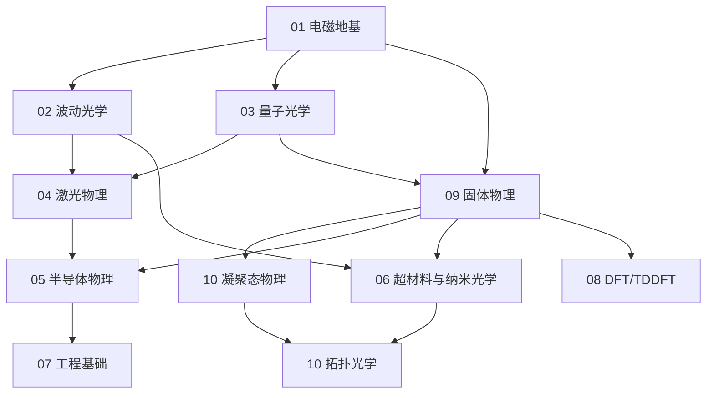

# 学科基础学习路径

## 一句话物理图像

> 光学博士的"内功修炼"——从电磁场的"基本舞蹈"到光子的"量子魔术"，每一层都是下一层的基础

## 📁 01 电磁地基

| 序号 | 文件 | 难度 | 核心内容 |
|------|------|------|----------|
| 01 | 01_电磁场理论基础.md | ★★☆ | 场概念、Green函数、波导模式、KK关系 |
| 02 | 02_麦克斯韦方程组.md | ★★★ | 四大方程、规范场论、复杂介质本构关系 |

## 📁 02 波动光学

| 序号 | 文件 | 难度 | 核心内容 |
|------|------|------|----------|
| 03 | 03_波动光学.md | ★★★ | Fourier光学、vCZ定理、结构光、微腔 |
| 04 | 04_光学原理.md | ★★☆ | 几何光学、反射/折射、透镜 |
| 05 | 05_傅里叶光学.md | ★★★★ | 空间频率、4f系统、光学滤波 |

## 📁 03 量子光学 ★重点

| 序号 | 文件 | 难度 | 核心内容 |
|------|------|------|----------|
| 06 | 06_量子光学.md | ★★★★★ | Dirac符号、Fock态、量子纠缠、量子传感 |
| 07 | 07_腔量子电动力学.md | ★★★★ | Jaynes-Cummings、强耦合、Purcell效应 |

## 📁 04 激光物理

| 序号 | 文件 | 难度 | 核心内容 |
|------|------|------|----------|
| 08 | 07_激光物理.md | ★★★ | Einstein系数推导、谐振腔、锁模、THz产生 |

## 📁 05 半导体物理

| 序号 | 文件 | 难度 | 核心内容 |
|------|------|------|----------|
| 09 | 08_半导体物理.md | ★★★ | 能带论、pn结、光电导效应 |

## 📁 06 超材料与纳米光学

| 序号 | 文件 | 难度 | 核心内容 |
|------|------|------|----------|
| 10 | 09_近场光学.md | ★★☆ | 倏逝波、SNOM原理 |
| 11 | 10_纳米光学.md | ★★★★ | 等离激元、局域场增强 |
| 12 | 11_超表面与超材料.md | ★★★★ | CM推导、PB相位、Mie共振、BIC、THz超表面 |

## 📁 07 工程基础

| 序号 | 文件 | 难度 | 核心内容 |
|------|------|------|----------|
| 13 | 12_微波工程.md | ★★★ | 传输线理论、S参数 |
| 14 | 13_无线通信原理.md | ★★☆ | 调制、信道、SNR |
| 15 | 14_半导体工艺.md | ★★☆ | 光刻、刻蚀、掺杂工艺 |

## 📁 08 DFT/TDDFT

| 序号 | 文件 | 难度 | 核心内容 |
|------|------|------|----------|
| 16 | 15_DFT_TDDFT.md | ★★★★ | DFT/TDDFT基础、吸收谱计算、VASP/Octopus实操 |

## 📁 09 固体与凝聚态 ★新增

| 序号 | 文件 | 难度 | 核心内容 |
|------|------|------|----------|
| 17 | 16_固体物理.md | ★★★★ | Bloch定理、能带论、声子、Drude模型、固体光学性质 |
| 18 | 17_凝聚态物理.md | ★★★★★ | 对称性破缺、拓扑物态、超导、磁性、强关联、二维材料 |

## 📁 10 拓扑光学 ★新增

| 序号 | 文件 | 难度 | 核心内容 |
|------|------|------|----------|
| 19 | 18_拓扑光学.md | ★★★★★ | Berry相位、Chern数、谷Hall、拓扑超表面、拓扑激光 |

---

## 学习阶段总览

| 阶段 | 内容 | 预计时间 | 重要性 |
|------|------|----------|--------|
| **第一阶段** | 电磁地基 | 2-3周 | ★★★★★ |
| **第二阶段** | 波动光学 | 2-3周 | ★★★★★ |
| **第三阶段** | 量子光学 | 3-4周 | ★★★★★（重点） |
| **第四阶段** | 激光+半导体+固体 | 4-5周 | ★★★★★（核心） |
| **第五阶段** | 超材料/纳米光学/拓扑光学 | 3-4周 | ★★★★（专业方向） |
| **第六阶段** | 工程基础 | 1-2周 | ★★★（按需） |
| **第七阶段** | DFT/TDDFT计算 | 2-3周 | ★★★★（按需） |

## 知识依赖图

## 每门课的难度等级

| 等级 | 说明 |
|------|------|
| **L2 物理理解** | 概念清晰，会画物理图像 |
| **L3 数学描述** | 公式推导，关键步骤懂 |
| **L4 深入理论** | 公式要会推导，能做习题 |
| **L5 前沿延伸** | 理解到能读论文程度 |

## 快速通道

| 背景 | 推荐路径 |
|------|----------|
| 有物理背景 | 固体物理 → 凝聚态物理 → 拓扑光学 → 超表面 |
| 有光学背景 | 量子光学 → 激光物理 → 半导体物理 → 超材料 |
| 有EE背景 | 固体物理 → 半导体物理 → 微波工程 → 超表面 |
| THz方向 | 激光物理 → 固体物理 → 超表面 → 拓扑光学 |

---

*最后更新：2026-06-05*
