# 电磁场理论基础

## 一句话物理图像

> 电磁场不是数学抽象——它是带电粒子之间传递相互作用的物理媒介。电荷运动 → 场被激发 → 场以光速传播 → 远处电荷受力。理解"场如何被激发、如何传播、如何被接收"，就理解了从静电到激光的全部经典电动力学

---

## 零、为什么需要电磁场理论？

### 0.1 超距作用 vs 场论

| 理论 | 观点 | 困境 |
|------|------|------|
| 超距作用 | 电荷之间瞬时相互作用 | 与狭义相对论矛盾（信息传播速度 ∞） |
| **场论** | 电荷产生场，场以有限速度传播，远处电荷响应场 | ✓ 因果律、能量动量守恒、可统一描述 |

> [!concept]+ 场论的深层动机
> **机制**：场不仅是传递相互作用的"中介"——场本身携带能量、动量、角动量，是独立的物理实体。电磁波可以在没有电荷的真空中传播，说明场不依附于源而存在。
>
> **极限**：经典电磁场论在原子尺度以下失效。当光子能量 $h\nu$ 可与体系能量比拟时，需要量子化→量子电动力学(QED)。经典场论是 QED 在 $\hbar \to 0$ 极限下的近似。
>
> **连接**：→ [[麦克斯韦方程组]] 将四个场定律统一 → [[量子光学]] 将场量子化

### 0.2 本笔记的结构逻辑

```
电荷/电流 (源)
    ↓ 产生
矢量分析 (数学语言)
    ↓ 描述
静电场 + 静磁场 (静态解)
    ↓ 引入势
标量势 φ + 矢量势 A (简化描述)
    ↓ 时变
电磁波方程 (动态传播)
    ↓ 介质
介质响应 + 色散 (材料效应)
    ↓ 辐射
多极展开 + 辐射场 (远场行为)
    ↓ 界面
边界条件 + Fresnel公式 (散射/反射)
```

---

## 一、矢量分析——电磁学的数学语言

> Gibbs 和 Heaviside 在19世纪独立发展矢量分析，正是为了让 Maxwell 方程摆脱四元数的晦涩。以下内容是整个经典电动力学的运算基础。

### 1.1 三个核心微分算子

| 算子 | 定义 | 物理含义 |
|------|------|---------|
| 梯度 $\nabla f$ | $(\partial_x f, \partial_y f, \partial_z f)$ | 标量场变化最快的方向和速率 |
| 散度 $\nabla \cdot \mathbf{A}$ | $\partial_x A_x + \partial_y A_y + \partial_z A_z$ | 场线"流出"还是"流入"（源/汇） |
| 旋度 $\nabla \times \mathbf{A}$ | 见下方行列式 | 场线"旋转"程度（涡旋） |

$$\nabla \times \mathbf{A} = \begin{vmatrix} \hat{x} & \hat{y} & \hat{z} \\ \partial_x & \partial_y & \partial_z \\ A_x & A_y & A_z \end{vmatrix}$$

> [!concept]+ 机制级物理图像
> **散度**：在空间取一个微小体积元，散度量化的是"从该体积元净流出的通量密度"。散度 > 0 = 存在源头（如正电荷），散度 < 0 = 存在汇（如负电荷），散度 = 0 = 无源的不可压缩流。
>
> **旋度**：在空间取一个微小面积元，旋度量化的是"沿该面积元边界的环量密度"。旋度 ≠ 0 意味着场在该点有"涡旋"结构——例如电流周围的磁场。
>
> **梯度**：标量场中某点上升最陡的方向。电势的负梯度就是电场——电子"沿电势最陡下降方向"加速。

### 1.2 二阶恒等式（推导基础）

$$\boxed{\nabla \times (\nabla f) = 0} \quad \text{（梯度的旋度恒为零）}$$

$$\boxed{\nabla \cdot (\nabla \times \mathbf{A}) = 0} \quad \text{（旋度的散度恒为零）}$$

$$\boxed{\nabla \times (\nabla \times \mathbf{A}) = \nabla(\nabla \cdot \mathbf{A}) - \nabla^2 \mathbf{A}}$$

> [!formula]+ 指标运算SOP——用 Levi-Civita 符号严格证明
>
> **核心工具**：
> - Levi-Civita: $\epsilon_{ijk} = \begin{cases} +1 & \text{偶排列} \\ -1 & \text{奇排列} \\ 0 & \text{重复指标} \end{cases}$
> - Kronecker-$\delta$: $\delta_{ij}$，替换指标用
> - $\epsilon$-$\delta$ 恒等式: $\epsilon_{ijk} \epsilon_{ilm} = \delta_{jl}\delta_{km} - \delta_{jm}\delta_{kl}$
>
> **案例1**: $\nabla \cdot (\nabla \times \mathbf{A}) = \partial_i(\epsilon_{ijk}\partial_j A_k) = \epsilon_{ijk}\partial_i\partial_j A_k = 0$
> 因为 $\partial_i\partial_j$ 对称而 $\epsilon_{ijk}$ 反对称 → 对称 × 反对称 = 0
>
> **案例2**: $[\nabla \times (\nabla \times \mathbf{A})]_i = \epsilon_{ijk}\partial_j(\epsilon_{klm}\partial_l A_m)$
> $= (\delta_{il}\delta_{jm} - \delta_{im}\delta_{jl})\partial_j\partial_l A_m = \partial_j\partial_i A_j - \partial_j\partial_j A_i$
> $= [\nabla(\nabla \cdot \mathbf{A})]_i - \nabla^2 A_i$

### 1.3 积分定理（全局 vs 局域）

| 定理 | 表达式 | 物理 |
|------|--------|------|
| Gauss散度定理 | $\oint_S \mathbf{A}\cdot d\mathbf{S} = \int_V (\nabla\cdot\mathbf{A})\,dV$ | 通量 = 体积内源的总量 |
| Stokes旋度定理 | $\oint_L \mathbf{A}\cdot d\mathbf{l} = \int_S (\nabla\times\mathbf{A})\cdot d\mathbf{S}$ | 环量 = 面上涡旋的累积 |
| Green第一公式 | $\int_V (\phi\nabla^2\psi + \nabla\phi\cdot\nabla\psi)\,dV = \oint_S \phi(\nabla\psi)\cdot d\mathbf{S}$ | Green函数方法的数学基础 |

> [!tip]+ 积分定理的统一理解
> 所有积分定理的本质相同：**边界上的量 = 内部的微分量的积分**。散度定理是"体积→表面"，Stokes定理是"面→边线"。它们是将 Maxwell 方程从积分形式转化为微分形式的数学桥梁。

---

## 二、静电场：从 Coulomb 到 Poisson

### 2.1 Coulomb 定律与电场定义

**实验基础**（Coulomb, 1785）：

$$\mathbf{F} = \frac{1}{4\pi\epsilon_0} \frac{q_1 q_2}{r^2} \hat{\mathbf{r}}$$

**电场定义**：

$$\mathbf{E}(\mathbf{r}) = \frac{\mathbf{F}}{q_{\text{test}}} = \frac{1}{4\pi\epsilon_0} \frac{q}{r^2} \hat{\mathbf{r}}$$

> [!concept]+ 机制：电场的物理起源
> 电场的本质是**空间每点的力场**。电荷在其周围空间产生一个矢量场，使得任何放入该空间的其他电荷都受到力。这种"通过空间传递力"的机制取代了超距作用——信息以光速从源传到场点。

### 2.2 Gauss 定理与 Poisson 方程

从 Coulomb 定律可以证明 **Gauss 定理**：

$$\oint_S \mathbf{E} \cdot d\mathbf{S} = \frac{Q_{enc}}{\epsilon_0}$$

微分形式（利用散度定理）：

$$\nabla \cdot \mathbf{E} = \frac{\rho}{\epsilon_0}$$

引入电势 $\mathbf{E} = -\nabla\phi$：

$$\boxed{\nabla^2\phi = -\frac{\rho}{\epsilon_0}} \quad \text{（Poisson方程）}$$

无源区域（$\rho = 0$）：$\nabla^2\phi = 0$（Laplace方程）

### 2.3 唯一性定理

> **定理**：在区域 $V$ 内，若电荷分布 $\rho$ 已知，且边界上 $\phi$ 或 $\partial\phi/\partial n$ 已知，则 $V$ 内的电势唯一确定。

**意义**：只要找到一个满足边界条件的解，它就是唯一解。这是**镜像法**和**分离变量法**的理论基础。

### 2.4 镜像法

**问题**：点电荷 $q$ 距接地导体平面 $d$，求空间电场。

**方法**：在导体另一侧对称位置放 $-q$，撤去导体。两电荷的场在导体外区域满足 Poisson 方程和边界条件（导体面上 $\phi = 0$），由唯一性定理，这就是正确解。

> [!concept]+ 镜像法的本质
> 镜像法不是"近似"——它是唯一性定理的精确应用。导体表面的感应电荷分布被等效为一个点电荷代替，两者在导体外区域产生完全相同的场。
>
> **极限**：镜像法仅适用于简单几何（平面、球面、柱面）。复杂边界必须用 Green 函数或数值方法。

### 2.5 Green 函数方法

Poisson 方程的通解：

$$\phi(\mathbf{r}) = \frac{1}{4\pi\epsilon_0}\int_V \frac{\rho(\mathbf{r}')}{|\mathbf{r}-\mathbf{r}'|}\,dV' + \frac{1}{4\pi}\oint_S \left[\frac{1}{R}\frac{\partial\phi}{\partial n'} - \phi\frac{\partial}{\partial n'}\left(\frac{1}{R}\right)\right]dS'$$

其中 $R = |\mathbf{r}-\mathbf{r}'|$。第一项是体积内电荷的贡献，第二项是边界条件的贡献。

> [!tip]+ Green 函数的物理含义
> $G(\mathbf{r}, \mathbf{r}') = 1/(4\pi|\mathbf{r}-\mathbf{r}'|)$ 是**点电荷在无穷大空间的电势**——即 Green 函数 = 单位点源的响应函数。任意电荷分布的电势 = 电荷分布与 Green 函数的卷积。

---

## 三、静磁场：从 Biot-Savart 到矢量势

### 3.1 磁场的产生

**Biot-Savart 定律**（电流元的磁场）：

$$d\mathbf{B} = \frac{\mu_0}{4\pi} \frac{I\,d\mathbf{l} \times \hat{\mathbf{r}}}{r^2}$$

**Lorentz 力**（磁场对运动电荷的力）：

$$\mathbf{F} = q(\mathbf{E} + \mathbf{v} \times \mathbf{B})$$

> [!concept]+ 机制：磁场为什么只对运动电荷有作用？
> 磁力的本质是**运动电荷之间的相对论效应**。在静止参考系中只有电力；换到运动参考系时，电力的一部分表现为磁力。磁力不是新的基本力——它是电力的相对论修正。这解释了为什么磁力不做功（$\mathbf{F} \perp \mathbf{v}$）：它只改变方向，不改变速率。
>
> **极限**：当 $v \to c$ 时，必须用相对论形式的 Lorentz 力。

### 3.2 Ampère 定理

$$\oint_L \mathbf{B} \cdot d\mathbf{l} = \mu_0 I_{enc}$$

微分形式：$\nabla \times \mathbf{B} = \mu_0 \mathbf{J}$

### 3.3 矢量势

由 $\nabla \cdot \mathbf{B} = 0$（磁场无源）和恒等式 $\nabla \cdot (\nabla \times \mathbf{A}) = 0$：

$$\mathbf{B} = \nabla \times \mathbf{A}$$

Coulomb 规范（$\nabla \cdot \mathbf{A} = 0$）下，矢量势满足 Poisson 方程：

$$\nabla^2 \mathbf{A} = -\mu_0 \mathbf{J}$$

解为：

$$\mathbf{A}(\mathbf{r}) = \frac{\mu_0}{4\pi}\int \frac{\mathbf{J}(\mathbf{r}')}{|\mathbf{r}-\mathbf{r}'|}\,dV'$$

> [!concept]+ 矢量势的物理可观测性
> 经典物理中，$\mathbf{A}$ 被视为数学工具（因为 $\mathbf{B} = \nabla \times \mathbf{A}$ 且规范变换不改变 $\mathbf{B}$）。但 **Aharonov-Bohm 效应**（1959）证明：电子绕过螺线管时，即使路径上 $\mathbf{B} = 0$，$\mathbf{A} \neq 0$ 的区域仍会影响电子的量子相位。这直接证明了矢量势具有物理意义。
>
> **连接**：→ [[量子光学]] 中场的量子化直接量子化 $\mathbf{A}$，而非 $\mathbf{B}$。

### 3.4 磁偶极子

电流环在远处的场等价于磁偶极子：

$$\mathbf{A}_{dip}(\mathbf{r}) = \frac{\mu_0}{4\pi} \frac{\mathbf{m} \times \hat{\mathbf{r}}}{r^2}$$

其中 $\mathbf{m} = I\mathbf{S}$ 是磁偶极矩（$I$ 为电流，$\mathbf{S}$ 为面积矢量）。

---

## 四、电磁势与规范自由度

### 4.1 从 Maxwell 方程引入势

**第一步**：$\nabla \cdot \mathbf{B} = 0$ → $\mathbf{B} = \nabla \times \mathbf{A}$

**第二步**：Faraday 定律 $\nabla \times \mathbf{E} = -\partial_t\mathbf{B} = -\partial_t(\nabla \times \mathbf{A})$

$$\nabla \times \left(\mathbf{E} + \frac{\partial \mathbf{A}}{\partial t}\right) = 0$$

由 $\nabla \times (\nabla f) = 0$：

$$\boxed{\mathbf{E} = -\nabla\phi - \frac{\partial \mathbf{A}}{\partial t}}$$

**物理含义**：电场有两个来源——电荷分布（$-\nabla\phi$）和时变磁场（$-\partial_t\mathbf{A}$）。前者是静电学，后者是电磁感应。

### 4.2 规范变换

$$\phi' = \phi - \frac{\partial\chi}{\partial t}, \quad \mathbf{A}' = \mathbf{A} + \nabla\chi$$

$\mathbf{E}$ 和 $\mathbf{B}$ 在此变换下不变——这就是**规范不变性**。

> [!concept]+ 机制：规范自由度的本质
> 规范自由度的物理本质是：**可观测的电磁场（$\mathbf{E}$, $\mathbf{B}$）对势（$\phi$, $\mathbf{A}$）存在冗余描述**。同一个物理状态可以用无穷多种不同的势来描述。这类似于用不同坐标系描述同一个几何对象——坐标是冗余的，几何不变量才是物理。
>
> **极限**：虽然经典物理中规范选择是"方便"问题，但在量子力学中规范不变性成为基本原理（→ U(1)规范对称性 → 电荷守恒）。

### 4.3 常用规范

| 规范 | 条件 | 适用场景 | 优势 |
|------|------|---------|------|
| **Coulomb** | $\nabla \cdot \mathbf{A} = 0$ | 静电问题、量子光学 | $\phi$ 满足瞬时的 Poisson 方程 |
| **Lorenz** | $\nabla \cdot \mathbf{A} + \frac{1}{c^2}\frac{\partial\phi}{\partial t} = 0$ | 辐射问题、相对论 | $\phi$ 和 $\mathbf{A}$ 满足相同形式的波动方程 |
| **时性** | $\phi = 0$ | 量子力学（光-物质耦合） | 只有 $\mathbf{A}$，简化量子 Hamilton 量 |

### 4.4 Lorenz 规范下的波动方程

将势代入 Maxwell 方程并使用 Lorenz 条件：

$$\boxed{\nabla^2\phi - \frac{1}{c^2}\frac{\partial^2\phi}{\partial t^2} = -\frac{\rho}{\epsilon_0}}$$

$$\boxed{\nabla^2\mathbf{A} - \frac{1}{c^2}\frac{\partial^2\mathbf{A}}{\partial t^2} = -\mu_0\mathbf{J}}$$

这两个方程形式完全一致——标量势和矢量势都满足**非齐次波动方程**（d'Alembert 方程）。

> [!formula]+ 推导
> 从 $\mathbf{E} = -\nabla\phi - \partial_t\mathbf{A}$ 代入 $\nabla \cdot \mathbf{E} = \rho/\epsilon_0$：
> $$-\nabla^2\phi - \partial_t(\nabla \cdot \mathbf{A}) = \frac{\rho}{\epsilon_0}$$
> Lorenz 条件 $\nabla \cdot \mathbf{A} = -\frac{1}{c^2}\partial_t\phi$ 代入：
> $$\nabla^2\phi - \frac{1}{c^2}\partial_t^2\phi = -\frac{\rho}{\epsilon_0}$$

**解**（推迟势）：

$$\phi(\mathbf{r}, t) = \frac{1}{4\pi\epsilon_0}\int\frac{\rho(\mathbf{r}', t - R/c)}{R}\,dV'$$

$$\mathbf{A}(\mathbf{r}, t) = \frac{\mu_0}{4\pi}\int\frac{\mathbf{J}(\mathbf{r}', t - R/c)}{R}\,dV'$$

其中 $R = |\mathbf{r}-\mathbf{r}'|$，$t_r = t - R/c$ 是**推迟时间**。

> [!concept]+ 因果性的数学表述
> 推迟势中 $t - R/c$ = "光从源走到场点所需的时间"。源在 $t_r$ 时刻的状态决定了场点在 $t$ 时刻的场值。信息以光速 $c$ 传播——**电磁学的因果律**。

---

## 五、电磁波方程

### 5.1 无源波动方程的完整推导

**起点**：Maxwell 方程组（无源、各向同性均匀介质）

$$\nabla \cdot \mathbf{E} = 0, \quad \nabla \cdot \mathbf{B} = 0$$

$$\nabla \times \mathbf{E} = -\frac{\partial \mathbf{B}}{\partial t}, \quad \nabla \times \mathbf{B} = \mu\epsilon\frac{\partial \mathbf{E}}{\partial t}$$

**推导**：对 Faraday 定律取旋度：

1. $\nabla \times (\nabla \times \mathbf{E}) = -\partial_t(\nabla \times \mathbf{B})$
2. 左边：$\nabla(\nabla \cdot \mathbf{E}) - \nabla^2\mathbf{E} = -\nabla^2\mathbf{E}$（因为 $\nabla \cdot \mathbf{E} = 0$）
3. 右边：$-\partial_t(\mu\epsilon\,\partial_t\mathbf{E}) = -\mu\epsilon\,\partial_t^2\mathbf{E}$

$$\boxed{\nabla^2\mathbf{E} - \mu\epsilon\frac{\partial^2\mathbf{E}}{\partial t^2} = 0}$$

同理：$\nabla^2\mathbf{B} - \mu\epsilon\partial_t^2\mathbf{B} = 0$

**波速**：$v = 1/\sqrt{\mu\epsilon}$，真空中 $c = 1/\sqrt{\mu_0\epsilon_0} \approx 3 \times 10^8$ m/s

> [!concept]+ 推导的核心逻辑
> 整个推导只有一步关键操作：**对 Faraday 定律取旋度，用 Ampère-Maxwell 消去 $\mathbf{B}$**。物理上是"变化的电场产生磁场，变化的磁场又产生电场"——这个自洽循环就是电磁波。Maxwell 由此预言了电磁波的存在，并发现其速度等于光速→光是电磁波。

### 5.2 平面波解

设 $\mathbf{E} = \mathbf{E}_0 e^{i(\mathbf{k}\cdot\mathbf{r} - \omega t)}$，代入波动方程得色散关系：

$$\omega^2 = \frac{k^2}{\mu\epsilon}, \quad v = \frac{\omega}{k} = \frac{1}{\sqrt{\mu\epsilon}}$$

平面波的性质：

| 性质 | 表达式 | 含义 |
|------|--------|------|
| 横波性 | $\mathbf{E} \perp \mathbf{k}$, $\mathbf{B} \perp \mathbf{k}$ | 场振动垂直传播方向 |
| 正交性 | $\mathbf{E} \perp \mathbf{B}$ | 电场与磁场互相垂直 |
| 场强比 | $|\mathbf{E}| = v|\mathbf{B}|$ | 真空中 $E = cB$ |

### 5.3 波导中的电磁波（概述）

电磁波在金属或介质波导中传播时，受边界约束形成**导波模式**：

| 模式类型 | 特征 | 典型波导 |
|----------|------|---------|
| **TEM** | $\mathbf{E}$, $\mathbf{B}$ 均横向，无截止频率 | 同轴线 |
| **TE** | $\mathbf{E}$ 横向，$\mathbf{B}$ 有纵向分量 | 矩形波导 |
| **TM** | $\mathbf{B}$ 横向，$\mathbf{E}$ 有纵向分量 | 矩形波导 |

**截止频率**：$f_c = c/(2a)$（矩形波导宽边 $a$）。低于 $f_c$ 的波被指数衰减——**截止现象**。

> [!tip]+ 波导与THz
> THz 波段（0.1-10 THz）的标准矩形波导尺寸在 25-250 μm 量级。加工精度要求极高，这是 THz 技术的工程挑战之一。→ [[微波工程]] 详述

---

## 六、介质中的电磁场

### 6.1 极化与磁化

**极化**：外电场使介质中正负电荷中心偏移，产生感应偶极子。

$$\mathbf{P} = \chi_e \epsilon_0 \mathbf{E}, \quad \mathbf{D} = \epsilon_0\mathbf{E} + \mathbf{P} = \epsilon\mathbf{E}$$

**磁化**：外磁场使电子轨道磁矩排列。

$$\mathbf{M} = \chi_m \mathbf{H}, \quad \mathbf{B} = \mu_0(\mathbf{H} + \mathbf{M}) = \mu\mathbf{H}$$

### 6.2 Drude-Lorentz 色散模型

电子在原子中做受迫阻尼振荡，解运动方程：

$$m_e\ddot{x} + m_e\gamma\dot{x} + m_e\omega_0^2 x = -eE_0 e^{-i\omega t}$$

稳态解→介电函数：

$$\boxed{\epsilon(\omega) = \epsilon_\infty + \frac{\omega_p^2}{\omega_0^2 - \omega^2 - i\gamma\omega}}$$

| 参数 | 含义 | 典型值 |
|------|------|--------|
| $\omega_p = \sqrt{ne^2/m_e\epsilon_0}$ | 等离子体频率 | Ag: ~9 eV（紫外） |
| $\omega_0$ | 共振频率 | 绝缘体有，金属 $\omega_0 = 0$ |
| $\gamma$ | 阻尼系数 | 决定吸收线宽 |

**特殊情形**：
- **金属（Drude模型）**：$\omega_0 = 0$ → $\epsilon = 1 - \omega_p^2/(\omega^2 + i\gamma\omega)$ → 可见光/红外 $\epsilon < 0$（负介电常数）
- **绝缘体（Lorentz模型）**：$\omega_0 \neq 0$ → 共振附近急剧变化（反常色散）

> [!concept]+ 机制：为什么金属在可见光下反射？
> Drude 模型给出 $\epsilon < 0$（当 $\omega < \omega_p$）。复折射率 $\tilde{n} = n + i\kappa$ 中 $\kappa$ 很大 → 光在金属表面被强烈衰减 → 入射能量几乎全部反射。这就是金属的"光泽"不是来自颜色，而是来自介电函数的负值区。
>
> **极限**：当 $\omega > \omega_p$（紫外），$\epsilon > 0$，金属变得透明。碱金属在紫外确实透明。
>
> **连接**：→ [[超表面与超材料]] 利用 Drude 模型设计等离激元共振单元

### 6.3 Kramers-Kronig 关系

$$\epsilon'(\omega) = 1 + \frac{2}{\pi}\mathcal{P}\int_0^\infty \frac{\omega''\epsilon''(\omega'')}{\omega''^2 - \omega^2}\,d\omega''$$

$$\epsilon''(\omega) = -\frac{2\omega}{\pi}\mathcal{P}\int_0^\infty \frac{\epsilon'(\omega'') - 1}{\omega''^2 - \omega^2}\,d\omega''$$

> [!concept]+ 机制：K-K关系的物理本质是因果律
> K-K关系是**因果律的必然推论**：系统不能在激励到来之前就做出响应（响应函数的因果性）。数学上，因果性导致介电函数在复频率上半平面解析，而解析函数的实部和虚部互相关联。
>
> **实际意义**：只需测量吸收谱（$\epsilon''$），就能推出色散（$\epsilon'$），反之亦然。这是光谱学的理论基础之一。

### 6.4 色散类型总结

| 色散 | $dn/d\lambda$ | 区域 | 物理原因 |
|------|-------------|------|---------|
| 正常色散 | $< 0$ | 远离共振 | $n$ 随 $\omega$ 增大而增大 |
| 反常色散 | $> 0$ | 共振附近 | 强吸收导致 $n$ 随 $\omega$ 减小 |
| 群速度色散 | $d^2n/d\lambda^2$ | 超短脉冲传播 | 脉冲展宽/压缩 |

**群速度**（信号/波包传播速度）：

$$v_g = \frac{d\omega}{dk} = \frac{c}{n + \omega\frac{dn}{d\omega}}$$

> [!tip]+ 相速度 vs 群速度
> - **相速度** $v_p = \omega/k$：等相面移动速度，可 $> c$（反常色散区），不违反因果律（无信息传递）
> - **群速度** $v_g = d\omega/dk$：波包传播速度，正常色散区 $v_g < c$。在强反常色散区 $v_g$ 也可 $> c$，但此时波包严重畸变，信号速度仍 $< c$

---

## 七、多极展开与辐射

### 7.1 静电多极展开

当电荷分布尺度 $d \ll r$（远场），标量势展开：

$$\phi(\mathbf{r}) = \frac{1}{4\pi\epsilon_0}\left[\frac{Q}{r} + \frac{\mathbf{p}\cdot\hat{\mathbf{r}}}{r^2} + \frac{1}{2}\sum_{ij}Q_{ij}\frac{\hat{r}_i\hat{r}_j}{r^3} + \cdots\right]$$

| 阶数 | 名称 | 表达式 | 物理含义 |
|------|------|--------|---------|
| 0 | 单极矩 | $Q = \int\rho\,dV$ | 总电荷 |
| 1 | 偶极矩 | $\mathbf{p} = \int \mathbf{r}'\rho\,dV$ | 正负电荷中心偏移 |
| 2 | 四极矩 | $Q_{ij} = \int(3r'_ir'_j - r'^2\delta_{ij})\rho\,dV$ | 电荷分布的椭球度 |

> [!concept]+ 为什么多极展开收敛快？
> 在 $r \gg d$ 时，高阶项以 $(d/r)^n$ 衰减。对于中性系统（$Q=0$），第一项为零，偶极项主导。对于对称中性系统（如 O₂, N₂），偶极矩也为零，四极项主导。这就是为什么分子光谱中四极跃迁虽然弱但可观测。

### 7.2 电偶极辐射

时变偶极子 $\mathbf{p}(t) = p_0 e^{-i\omega t}$ 产生辐射场：

**近场** ($r \ll \lambda$)：

$$\mathbf{E}_{near} \approx \frac{1}{4\pi\epsilon_0}\frac{1}{r^3}[3(\mathbf{p}\cdot\hat{\mathbf{r}})\hat{\mathbf{r}} - \mathbf{p}]$$

**远场/辐射场** ($r \gg \lambda$)：

$$\mathbf{E}_{rad} = -\frac{\mu_0}{4\pi}\frac{\omega^2 p_0}{r}\sin\theta\, e^{i(kr-\omega t)}\,\hat{\boldsymbol{\theta}}$$

$$\mathbf{B}_{rad} = \frac{1}{c}\hat{\mathbf{r}} \times \mathbf{E}_{rad}$$

**辐射角分布**：$dP/d\Omega \propto \sin^2\theta$（沿偶极轴无辐射，垂直方向最强）

### 7.3 Larmor 公式

加速电荷的总辐射功率：

$$\boxed{P = \frac{\mu_0 q^2 a^2}{6\pi c} = \frac{q^2 a^2}{6\pi\epsilon_0 c^3}}$$

> [!concept]+ 机制：为什么加速电荷会辐射？
> 匀速运动电荷的电场线径向延伸。当电荷突然加速时，远处的场线还"不知道"电荷已经移动——它们仍指向原来的位置。近处的场线跟随电荷。这两部分场线之间出现"扭折"（kink），这个扭折以光速向外传播——**就是辐射**。
>
> **极限**：非相对论 ($v \ll c$) 用 Larmor 公式。相对论推广为 Liénard 公式：$P = \frac{q^2\gamma^6}{6\pi\epsilon_0 c^3}(a_\perp^2 + \gamma^2 a_\parallel^2)$。
>
> **连接**：→ 同步辐射（相对论电子做圆周运动）→ 自由电子激光 → [[激光物理]]

### 7.4 辐射类型全景

| 辐射类型 | 条件 | 特点 | 应用 |
|----------|------|------|------|
| **偶极辐射** | 线性加速 | $\sin^2\theta$ 角分布 | 天线、原子跃迁 |
| **磁偶极辐射** | 电流环振荡 | 比电偶极弱 $(v/c)^2$ | NMR 射频线圈 |
| **同步辐射** | 相对论电子圆周运动 | 宽带、高亮度、偏振 | 同步辐射光源 |
| **韧致辐射** | 电子被原子核偏转 | 连续谱 | X射线管 |
| **Cherenkov辐射** | 粒子速度 > 介质中光速 | 锥形波前 | 粒子探测器 |

---

## 八、能量与动量

### 8.1 Poynting 定理

从 Maxwell 方程推导能量守恒：

$$\frac{\partial u}{\partial t} + \nabla \cdot \mathbf{S} = -\mathbf{J}\cdot\mathbf{E}$$

| 符号 | 含义 | 表达式 |
|------|------|--------|
| $u$ | 电磁能量密度 | $\frac{1}{2}\epsilon_0 E^2 + \frac{B^2}{2\mu_0}$ |
| $\mathbf{S}$ | Poynting矢量（能流密度） | $\frac{1}{\mu_0}\mathbf{E} \times \mathbf{B}$ |
| $-\mathbf{J}\cdot\mathbf{E}$ | 场对电荷做功（焦耳热） | — |

**物理解读**：能量密度变化率 + 能流散度 = 场对电荷做功的负值 → **能量守恒**。

### 8.2 平面波的平均能流

$$\langle S \rangle = \frac{1}{2\mu_0} E_0 B_0 = \frac{1}{2} \epsilon_0 c E_0^2 = \frac{c}{2\mu_0} B_0^2$$

### 8.3 电磁动量与辐射压力

**动量密度**：$\mathbf{g} = \epsilon_0(\mathbf{E} \times \mathbf{B}) = \mathbf{S}/c^2$

**辐射压力**（垂直入射）：

| 表面 | 辐射压力 |
|------|---------|
| 完全吸收 | $P_{rad} = \langle S \rangle/c$ |
| 完全反射 | $P_{rad} = 2\langle S \rangle/c$ |

> [!example]+ 数值：太阳光压与光镊
> 太阳常数 $I \approx 1361$ W/m²：
> $$P_{rad} = \frac{1361}{3\times10^8} \approx 4.5\,\mu\text{Pa}$$
> IKAROS 太阳帆（2010）：196 m² 太阳帆产生 ~1.12 mN 推力。
>
> 光镊（Ashkin, 2018 Nobel）：聚焦激光对微米粒子产生梯度力（捕获）和散射力（推进）。典型光镊力 ~pN 量级。

---

## 九、边界条件与 Fresnel 公式

### 9.1 四个边界条件

从 Maxwell 方程积分形式，在界面处取极限：

| 分量 | 条件 | 来源方程 |
|------|------|---------|
| $E_{1\parallel} = E_{2\parallel}$ | 切向电场连续 | Faraday 定律 |
| $H_{1\parallel} = H_{2\parallel}$（无面电流） | 切向磁场连续 | Ampère 定律 |
| $D_{2\perp} - D_{1\perp} = \sigma_f$ | 法向 $\mathbf{D}$ 跳跃 | Gauss 定律 |
| $B_{1\perp} = B_{2\perp}$ | 法向磁场连续 | Gauss 磁定理 |

> [!concept]+ 统一理解
> 边界条件的推导方法完全一致：对 Maxwell 方程取积分形式，在界面上取一个跨界面的微元（窄回路或扁圆柱），令厚度→0。关键技巧：**切向条件用窄回路，法向条件用扁圆柱**。

### 9.2 Fresnel 公式推导

电磁波斜入射到两种介质界面（$n_1 \to n_2$），由边界条件推导反射/透射系数：

**s偏振**（$\mathbf{E} \perp$ 入射面）：

$$r_s = \frac{n_1\cos\theta_i - n_2\cos\theta_t}{n_1\cos\theta_i + n_2\cos\theta_t}$$

$$t_s = \frac{2n_1\cos\theta_i}{n_1\cos\theta_i + n_2\cos\theta_t}$$

**p偏振**（$\mathbf{E} \parallel$ 入射面）：

$$r_p = \frac{n_2\cos\theta_i - n_1\cos\theta_t}{n_2\cos\theta_i + n_1\cos\theta_t}$$

$$t_p = \frac{2n_1\cos\theta_i}{n_2\cos\theta_i + n_1\cos\theta_t}$$

### 9.3 特殊角度

| 现象 | 条件 | 公式 |
|------|------|------|
| **Brewster角** | $r_p = 0$（p偏振零反射） | $\theta_B = \arctan(n_2/n_1)$ |
| **全内反射** | $\theta_i > \theta_c$（$n_1 > n_2$） | $\theta_c = \arcsin(n_2/n_1)$ |
| **倏逝波** | 全内反射时透射侧的指数衰减场 | $E \propto e^{-\kappa z}$, $\kappa = k_0\sqrt{n_1^2\sin^2\theta_i - n_2^2}$ |

> [!concept]+ 倏逝波的机制与连接
> 全内反射时，界面法向波矢 $k_z = k_0\sqrt{n_2^2 - n_1^2\sin^2\theta_i}$ 变为虚数——透射波在法向指数衰减但沿界面传播。这就是**倏逝波**。
>
> **极限**：倏逝波的穿透深度 $\delta = 1/\kappa \sim \lambda/2\pi$，只存在于界面附近一个波长范围内。
>
> **连接**：
> - → [[近场光学]]（SNOM 利用倏逝波突破衍射极限）
> - → [[超表面与超材料]]（广义 Snell 定律通过相位梯度调制倏逝波→传播波转换）
> - → 光纤波导（全内反射约束光在芯中传播）

### 9.4 反射率与透射率

$$R = \frac{I_r}{I_i} = |r|^2, \quad T = \frac{n_2\cos\theta_t}{n_1\cos\theta_i}|t|^2, \quad R + T = 1$$

> [!example]+ 数值：空气→玻璃界面
> $n_1 = 1$, $n_2 = 1.5$，正入射（$\theta_i = 0$）：
> $$r = \frac{1-1.5}{1+1.5} = -0.2, \quad R = 0.04 = 4\%$$
> 这就是为什么未经镀膜的光学元件表面反射约4%的光。多层镀膜利用干涉相消可将反射率降至 < 0.1%。

---

## 十、电磁场数值方法（概述）

> 实际工程问题（天线、超表面、波导）几乎无法解析求解，必须依赖数值方法。以下三种是最常用的电磁场数值方法。

| 方法 | 核心思想 | 网格类型 | 时/频域 | 适用场景 |
|------|---------|---------|---------|---------|
| **FDTD** | 时空离散化 Maxwell 方程的 Yee 网格 | 结构化六面体 | 时域 | 宽带响应、超表面、天线 |
| **FEM** | 变分原理 + 有限元离散 | 非结构化四面体 | 频域 | 复杂几何、波导、谐振腔 |
| **MoM (矩量法)** | 积分方程 + 表面离散 | 面网格 | 频域 | 金属散射、天线阵列 |

> [!tip]+ 选择策略
> - 需要宽带频谱？→ FDTD（一次仿真得到全频段）
> - 几何复杂（曲面、不规则形状）？→ FEM
> - 大面积金属结构？→ MoM（只离散表面，计算量小）
> - 超表面设计？→ FDTD 或 RCWA（严格耦合波分析）
>
> 常用软件：CST (FDTD/FEM), COMSOL (FEM), HFSS (FEM), Lumerical (FDTD)

---

## 十一、知识树

```mermaid
graph TD
    A["电磁场理论基础"] --> B["矢量分析"]
    A --> C["静电场"]
    A --> D["静磁场"]
    A --> E["电磁势与规范"]
    A --> F["电磁波"]
    A --> G["介质响应"]
    A --> H["多极展开与辐射"]
    A --> I["能量与动量"]
    A --> J["边界条件与Fresnel"]
    A --> K["数值方法"]

    B --> B1["梯度/散度/旋度"]
    B --> B2["指标运算SOP"]
    B --> B3["积分定理"]

    C --> C1["Coulomb→Gauss→Poisson"]
    C --> C2["唯一性定理"]
    C --> C3["镜像法"]
    C --> C4["Green函数"]

    D --> D1["Biot-Savart→Ampère"]
    D --> D2["矢量势A"]
    D --> D3["磁偶极子"]

    E --> E1["规范自由度"]
    E --> E2["Coulomb/Lorenz/时性"]
    E --> E3["推迟势"]

    F --> F1["波动方程推导"]
    F --> F2["平面波解"]
    F --> F3["波导模式"]

    G --> G1["极化/磁化"]
    G --> G2["Drude-Lorentz模型"]
    G --> G3["K-K关系"]
    G --> G4["色散"]

    H --> H1["多极展开"]
    H --> H2["偶极辐射"]
    H --> H3["Larmor公式"]
    H --> H4["辐射类型全景"]

    I --> I1["Poynting定理"]
    I --> I2["动量密度"]
    I --> I3["辐射压力"]

    J --> J1["四个边界条件"]
    J --> J2["Fresnel公式"]
    J --> J3["Brewster角"]
    J --> J4["全内反射/倏逝波"]

    K --> K1["FDTD"]
    K --> K2["FEM"]
    K --> K3["MoM"]

    style A fill:#FF6B6B,stroke:#FF0000,stroke-width:3px
    style E fill:#6BCB77,stroke:#228B22
    style F fill:#9B59B6,stroke:#6C3483
    style G fill:#4D96FF,stroke:#0000CD
    style J fill:#FFD93D,stroke:#FF8C00
```



---

## 十二、延伸阅读

- [[麦克斯韦方程组]] — 四大方程的深入推导与对称性分析
- [[波动光学]] — 电磁波的光学性质（干涉、衍射、偏振）
- [[量子光学]] — 电磁场的量子化（$\mathbf{A}$ → 产生/湮灭算符）— **RAG库收录** Scully & Zubairy 教材 [[cite:@Scully1997]]
- [[超表面与超材料]] — Drude模型在超原子设计中的应用
- [[近场光学]] — 倏逝波的深入利用

---

## 参考文献

1. **[[cite:@Griffiths2017]]** — "Introduction to Electrodynamics", 第4版。矢量分析到辐射的标准入门。本章§1-3主要参考此书
2. **[[cite:@Jackson1998]]** — "Classical Electrodynamics", 第3版。多极展开、Green函数、辐射的权威参考。§4, §7主要参考此书
3. **[[cite:@Scully1997]]** — "Quantum Optics"。电磁场量子化的标准教材。**RAG库收录** — 含 Maxwell 方程推导、规范条件、腔模量化
4. **[[cite:@Zangwill2013]]** — "Modern Electrodynamics"。Gibbs/Heaviside 矢量分析历史，辐射反应的详细讨论
5. **[[cite:@Dressel2015]]** — Dressel, Bliokh & Nori, Phys. Rep. 589 (2015)。矢量势与几何代数视角
6. **[[cite:@Born1999]]** — "Principles of Optics", 第7版。Fresnel 公式与晶体光学权威参考
7. **[[cite:@Taflove2005]]** — "Computational Electrodynamics: The FDTD Method"。数值方法标准参考
