# 电磁场理论基础

## 一句话物理图像

> 电磁场是带电粒子相互作用的"舞台"——就像引力场让地球绕太阳转，电磁场让电子绕原子核跳舞

## 一、为什么需要电磁场概念？

### 1.1 超距作用的困惑

**问题**：两个电荷相隔一定距离，它们如何"知道"对方的存在？

| 理论 | 观点 | 问题 |
|------|------|------|
| 超距作用 | 即刻相互作用，无需媒介 | 与相对性矛盾 |
| **场论** | 空间中每点都有场的值，信息以光速传播 | 更物理 |

> [!concept]+ 物理图像：场像池塘的涟漪
> 把石子扔进池塘，水面每一点都有高度（场强）。远处的浮标不需要直接碰触石子，而是被水面"传递"的波动推动。电磁场就是"池塘"，带电粒子在里面产生涟漪。

### 1.2 电场和磁场的分工

**电场 $\mathbf{E}$**：描述电荷对其他电荷的"推拉"能力

$$\mathbf{F} = q\mathbf{E}$$

**磁场 $\mathbf{B}$**：描述运动电荷受到的"偏转"力

$$\mathbf{F} = q\mathbf{v} \times \mathbf{B}$$

> [!tip]+ 关键区别
> - 电场对所有电荷都有作用（加速或减速）
> - 磁场只对运动电荷有作用（只改变方向，不改变速率）

---

## 二、矢量分析——电磁学的数学语言

> 物理学家 Gibbs 和 Heaviside 在 19 世纪独立发展了矢量分析，正是为了让麦克斯韦方程组摆脱四元数的晦涩。理解下面这些恒等式，是读懂整个经典电动力学的钥匙。

### 2.1 三个核心微分算子

| 算子 | 定义 | 物理含义 |
|------|------|---------|
| 梯度 $\nabla f$ | $(\partial_x f, \partial_y f, \partial_z f)$ | 标量场变化最快的方向和速率 |
| 散度 $\nabla \cdot \mathbf{A}$ | $\partial_x A_x + \partial_y A_y + \partial_z A_z$ | 场线"流出"还是"流入"（源/汇） |
| 旋度 $\nabla \times \mathbf{A}$ | 见下方行列式 | 场线"旋转"程度（涡旋） |

旋度的分量展开：

$$\nabla \times \mathbf{A} = \begin{vmatrix} \hat{x} & \hat{y} & \hat{z} \\ \partial_x & \partial_y & \partial_z \\ A_x & A_y & A_z \end{vmatrix}$$

> [!concept]+ 物理图像：散度与旋度
> **散度**：想象在水池里放水龙头。散度 > 0 = 水龙头（源头），散度 < 0 = 排水口（汇），散度 = 0 = 水流只是经过。
> **旋度**：把一片小树叶放到水流中。如果树叶转起来，说明旋度不为零——水在打旋。

### 2.2 二阶恒等式（推导基础）

以下六个恒等式是整个经典电动力学的运算基石：

$$\boxed{\nabla \times (\nabla f) = 0} \quad \text{（梯度的旋度恒为零）}$$

$$\boxed{\nabla \cdot (\nabla \times \mathbf{A}) = 0} \quad \text{（旋度的散度恒为零）}$$

$$\boxed{\nabla \times (\nabla \times \mathbf{A}) = \nabla(\nabla \cdot \mathbf{A}) - \nabla^2 \mathbf{A}}$$

> [!formula]+ 关键恒等式的推导
> $\nabla \times (\nabla f) = 0$ 的证明：
> $$[\nabla \times (\nabla f)]_z = \partial_x(\partial_y f) - \partial_y(\partial_x f) = 0$$
> 因为混合偏导与顺序无关（Schwarz定理）。
>
> $\nabla \times (\nabla \times \mathbf{A}) = \nabla(\nabla \cdot \mathbf{A}) - \nabla^2\mathbf{A}$ 的证明：
> 用 Levi-Civita 符号：
> $$[\nabla \times (\nabla \times \mathbf{A})]_i = \epsilon_{ijk}\partial_j(\epsilon_{klm}\partial_l A_m) = (\delta_{il}\delta_{jm} - \delta_{im}\delta_{jl})\partial_j\partial_l A_m$$
> $$= \partial_j\partial_i A_j - \partial_j\partial_j A_i = \partial_i(\nabla \cdot \mathbf{A}) - \nabla^2 A_i$$

***

# 附录：张量分析语言与对称性速证（指标运算 SOP）

> [!info] 为什么需要这套规则？
> 在经典电动力学（如推导 Maxwell 方程组微分形式、波动方程）中，三维矢量运算极易出错。引入 **Levi-Civita 符号（$\epsilon_{ijk}$）** 可以将复杂的“空间几何操作”转化为纯粹的“代数指标缩并”。掌握它，你能像做初等代数一样严谨推导电磁场公式。
> 以下内容默认使用 **Einstein 求和约定**（省略 $\Sigma$，重复下标自动求和）。

---

## 一、核心疑惑解析：算符提取与“对称 vs 反对称”

在利用指标进行公式推导时，初学者常有两个巨大的疑惑。在此先给出物理图像上的明确答复：

### 疑惑 1：为什么矢量 $\mathbf{A}$ 可以提来提去，偏导算符好像跟它无关？
**解答**：在指标运算中，**算符和变量只是书写顺序不同的符号而已**。
例如展开 $\partial_i (\epsilon_{ijk} \partial_j A_k)$ 时，你实际上面对的是对乘积求导。由于 Levi-Civita 符号 $\epsilon_{ijk}$ 在直角坐标系下是**纯常数**（取值 1, -1 或 0），它不受偏导数 $\partial_i$ 的作用。
因此，依据乘积法则，算符只对后面的空间函数起作用。在书写时，为了排版和观察指标，我们完全可以将常数 $\epsilon_{ijk}$ 随意移动到算符左边或右边，比如写成 $\epsilon_{ijk} \partial_i (\partial_j A_k)$，只要保证**算符 $\partial$ 准确作用在它该作用的场（如 $A_k$）上**即可。

### 疑惑 2：对称性怎么就能直接得出结果为 0？
**解答**：这是张量运算中最具威力的**“对称 × 反对称 = 0”**定理。
如果有两个算子（如 $\partial_i \partial_j$）对下标是对称的（即交换 $i$ 和 $j$ 不影响结果：$\partial_x \partial_y = \partial_y \partial_x$），而与之相乘的算子（如 $\epsilon_{ijk}$）对这两个下标是反对称的（交换 $i$ 和 $j$ 会变号：$\epsilon_{ijk} = -\epsilon_{jik}$）。那么，将它们所有的排列求和，正负项会完美抵消，结果**绝对且严格为 0**。

---

## 二、三大基础法则

### 法则 1：核心张量的定义
- **Levi-Civita 符号（描述叉乘/右手定则）**：
  $$ \epsilon_{ijk} = \begin{cases} +1 & \text{偶排列 (123, 231, 312)} \\ -1 & \text{奇排列 (213, 321, 132)} \\ 0 & \text{有重复指标 (112)} \end{cases} $$
  **反对称性推论**：交换任意两个相邻下标，结果变号（$\epsilon_{ijk} = -\epsilon_{jik}$）。
- **Kronecker-$\delta$ 符号（描述点乘/指标替换）**：
  $$ \delta_{ij} = \begin{cases} 1 & i = j \\ 0 & i \neq j \end{cases} $$
  **替换法则**：$A_i \delta_{ij} = A_j$（消灭求和号，替换指标）。

### 法则 2：运算的指标翻译
- **点乘**：$\mathbf{A} \cdot \mathbf{B} = A_i B_i$
- **叉乘第 $i$ 分量**：$(\mathbf{A} \times \mathbf{B})_i = \epsilon_{ijk} A_j B_k$
- **旋度第 $i$ 分量**：$(\nabla \times \mathbf{A})_i = \epsilon_{ijk} \partial_j A_k$

### 法则 3：$\epsilon-\delta$ 恒等式（降维工具）
遇到两个 $\epsilon$ 相乘，且有一个下标相同时，展开为 $\delta$：
$$ \epsilon_{ijk} \epsilon_{ilm} = \delta_{jl}\delta_{km} - \delta_{jm}\delta_{kl} $$
> [!tip] 记忆口诀
> **“前前减前后”**。等号左边两个 $\epsilon$ 的后两个下标对分别为 $(j,k)$ 和 $(l,m)$。等号右边是“第一个的第一乘第二个的第一，减去交叉相乘”。

---

## 三、实战演练：用对称性与指标秒杀电动力学恒等式

### 案例 1：证明旋度的散度为零 $\nabla \cdot (\nabla \times \mathbf{A}) = 0$
> [!question] 物理图像：为什么场线打出旋儿的同时，又没有源头冒出来？

利用指标展开，结合上述**疑惑 1** 和 **疑惑 2**，证明过程只需两步：
1. **写出分量并提取常数**：
   $$ \nabla \cdot (\nabla \times \mathbf{A}) = \partial_i [(\nabla \times \mathbf{A})_i] = \partial_i (\epsilon_{ijk} \partial_j A_k) $$
   因为 $\epsilon_{ijk}$ 是纯常数，可以提到偏导算符外面：
   $$ = \epsilon_{ijk} \partial_i \partial_j A_k $$
2. **利用对称性绝杀**：
   观察求和项中的 $\partial_i \partial_j$。由于求偏导与顺序无关（Schwarz 定理），所以它对 $i,j$ 是**对称的**（$\partial_x \partial_y = \partial_y \partial_x$）。
   而前面的 $\epsilon_{ijk}$ 对 $i,j$ 是**反对称的**。
   **对称 × 反对称 = 0**，求和后所有项正负抵消：
   $$ \therefore \epsilon_{ijk} \partial_i \partial_j A_k = 0 \quad \text{（证明完毕）} $$

### 案例 2：证明梯度的旋度为零 $\nabla \times (\nabla f) = 0$
证明逻辑与案例 1 完全镜像：
1. 写出分量：$[\nabla \times (\nabla f)]_i = \epsilon_{ijk} \partial_j (\partial_k f) = \epsilon_{ijk} \partial_j \partial_k f$
2. 同样，$\partial_j \partial_k$ 是**对称**算子，$\epsilon_{ijk}$ 是**反对称**常数。
3. 正负抵消，结果为 $0$。

### 案例 3：推导矢量双重叉乘 $\mathbf{A} \times (\mathbf{B} \times \mathbf{C}) = \mathbf{B}(\mathbf{A}\cdot\mathbf{C}) - \mathbf{C}(\mathbf{A}\cdot\mathbf{B})$
**处理流程：翻译 $\rightarrow$ $\epsilon-\delta$恒等式 $\rightarrow$ 替换 $\rightarrow$ 还原矢量**
1. 取第 $i$ 分量：$[\mathbf{A} \times (\mathbf{B} \times \mathbf{C})]_i = \epsilon_{ijk} A_j (\epsilon_{klm} B_l C_m)$
2. 由于 $\epsilon_{kij} = \epsilon_{ijk}$，调整下标触发法则 3：
   $$ = (\epsilon_{kij} \epsilon_{klm}) A_j B_l C_m = (\delta_{il}\delta_{jm} - \delta_{im}\delta_{jl}) A_j B_l C_m $$
3. 利用 $\delta$ 替换指标（如 $\delta_{il}$ 意味着把后面的 $l$ 变成 $i$）：
   $$ = A_j B_i C_j - A_j B_j C_i $$
4. 重新写成矢量（$A_j C_j = \mathbf{A}\cdot\mathbf{C}$，提取常量分量）：
   $$ = B_i(\mathbf{A}\cdot\mathbf{C}) - C_i(\mathbf{A}\cdot\mathbf{B}) $$
   *(这就是著名的 BAC-CAB 法则，代数推导避免了空间想象的困难)*

### 案例 4：电动力学基石——旋度的旋度 $\nabla \times (\nabla \times \mathbf{A})$
算法与案例 3 完全相同，只是把矢量 $\mathbf{B}, \mathbf{C}$ 换成了算符 $\nabla$：
1. $[\nabla \times (\nabla \times \mathbf{A})]_i = \epsilon_{ijk} \partial_j (\epsilon_{klm} \partial_l A_m) = (\delta_{il}\delta_{jm} - \delta_{im}\delta_{jl}) \partial_j \partial_l A_m$
2. 第一项：$\delta_{il}\delta_{jm} \partial_j \partial_l A_m = \partial_j \partial_i A_j = \partial_i (\partial_j A_j) = [\nabla(\nabla \cdot \mathbf{A})]_i$
3. 第二项：$\delta_{im}\delta_{jl} \partial_j \partial_l A_m = \partial_j \partial_j A_i = \nabla^2 A_i$
4. 合并即得经典公式：$\nabla \times (\nabla \times \mathbf{A}) = \nabla(\nabla \cdot \mathbf{A}) - \nabla^2 \mathbf{A}$

---
> [!summary] 指标运算的标准操作程序 (SOP)
> 1. **降维**：将矢量方程改写为第 $i$ 分量的标量方程。
> 2. **翻译**：将 $\times$ 变 $\epsilon$，将 $\cdot$ 变重复指标。
> 3. **提取常数**：遇到偏导算符，记住常数（如 $\epsilon$）可以随意进出，只要算符别漏掉对该求导的场求导即可。
> 4. **破局**：遇到两个 $\epsilon$，用 **$\epsilon-\delta$ 恒等式** 展开；观察是否有对称算子和反对称常数相乘。
> 5. **升维**：把化简后的标量分量重新打包成 $\mathbf{E}, \mathbf{B}$ 等矢量形式。

### 2.3 积分定理（全局 vs 局域的联系）

| 定理 | 表达式 | 物理 |
|------|--------|------|
| Gauss散度定理 | $\oint_S \mathbf{A}\cdot d\mathbf{S} = \int_V (\nabla\cdot\mathbf{A})\,dV$ | 通量 = 体积内源的总量 |
| Stokes旋度定理 | $\oint_L \mathbf{A}\cdot d\mathbf{l} = \int_S (\nabla\times\mathbf{A})\cdot d\mathbf{S}$ | 环量 = 面上涡旋的累积 |
| Green第一公式 | $\int_V (\phi\nabla^2\psi + \nabla\phi\cdot\nabla\psi)\,dV = \oint_S \phi(\nabla\psi)\cdot d\mathbf{S}$ | Green函数方法的数学基础 |

> [!concept]+ 散度定理的直觉
> 把一个房间分成很多小格子。每个格子里空气的"净流出量"（散度）加在一起，等于从窗户（表面）跑出去的总量（通量）。内部的格间流动互相抵消，只有边界的才"泄漏"出去。

---

## 三、标量势与矢量势——简化电磁场的描述

### 3.1 为什么需要势？

直接求解 $\mathbf{E}(\mathbf{r})$ 和 $\mathbf{B}(\mathbf{r})$ 需要 6 个分量（3+3）。引入势后，只需要 4 个（1个标量 + 3个矢量分量）。

### 3.2 从 Maxwell 方程引入势

**第一步**：Maxwell 方程中 $\nabla \cdot \mathbf{B} = 0$（磁场无源）

由恒等式 $\nabla \cdot (\nabla \times \mathbf{A}) = 0$，可以定义：

$$\mathbf{B} = \nabla \times \mathbf{A}$$

$\mathbf{A}$ 称为**矢量势 (vector potential)**。

**第二步**：Faraday 定律 $\nabla \times \mathbf{E} = -\partial\mathbf{B}/\partial t$

代入 $\mathbf{B} = \nabla \times \mathbf{A}$：

$$\nabla \times \mathbf{E} = -\frac{\partial}{\partial t}(\nabla \times \mathbf{A}) = -\nabla \times \frac{\partial \mathbf{A}}{\partial t}$$

$$\nabla \times \left(\mathbf{E} + \frac{\partial \mathbf{A}}{\partial t}\right) = 0$$

由恒等式 $\nabla \times (\nabla f) = 0$，括号内可写成某个标量函数的梯度：

$$\mathbf{E} + \frac{\partial \mathbf{A}}{\partial t} = -\nabla\phi$$

$$\boxed{\mathbf{E} = -\nabla\phi - \frac{\partial \mathbf{A}}{\partial t}}$$

$\phi$ 称为**标量势 (scalar potential)**。

> [!concept]+ 物理图像
> - $\mathbf{B} = \nabla \times \mathbf{A}$：磁场是矢量势的"旋转"——就像河流的漩涡是水流的旋度
> - $\mathbf{E} = -\nabla\phi - \partial\mathbf{A}/\partial t$：电场有两部分来源——电荷分布（$-\nabla\phi$）和变化的磁场（$-\partial\mathbf{A}/\partial t$）

### 3.3 规范自由度（gauge freedom）

势的选取不唯一。以下变换不改变物理可观测的 $\mathbf{E}$ 和 $\mathbf{B}$：

$$\phi' = \phi - \frac{\partial\chi}{\partial t}, \quad \mathbf{A}' = \mathbf{A} + \nabla\chi$$

其中 $\chi(\mathbf{r}, t)$ 是任意标量函数。这就是**规范变换**。

> [!tip]+ 为什么"规范"不影响物理？
> 物理测量的是 $\mathbf{E}$ 和 $\mathbf{B}$，它们由 $\mathbf{A}$ 的微商决定。给 $\mathbf{A}$ 加一个梯度，旋度不变（$\nabla \times (\nabla\chi) = 0$），所以 $\mathbf{B}$ 不变。$\mathbf{E}$ 不变是因为 $\phi$ 和 $\mathbf{A}$ 的变化恰好互相抵消。

### 3.4 常用规范

| 规范 | 条件 | 适用场景 |
|------|------|---------|
| **Coulomb规范** | $\nabla \cdot \mathbf{A} = 0$ | 静电问题、量子光学 |
| **Lorenz规范** | $\nabla \cdot \mathbf{A} + \frac{1}{c^2}\frac{\partial\phi}{\partial t} = 0$ | 辐射问题、相对论 |
| **时性规范** | $\phi = 0$ | 量子力学（光与物质耦合） |

**Lorenz规范下的波动方程**（将势的方程解耦）：

$$\nabla^2\phi - \frac{1}{c^2}\frac{\partial^2\phi}{\partial t^2} = -\frac{\rho}{\epsilon_0}$$

$$\nabla^2\mathbf{A} - \frac{1}{c^2}\frac{\partial^2\mathbf{A}}{\partial t^2} = -\mu_0\mathbf{J}$$

> [!formula]+ Lorenz规范推导
> 从 $\mathbf{E} = -\nabla\phi - \partial_t\mathbf{A}$ 代入 $\nabla \cdot \mathbf{E} = \rho/\epsilon_0$：
> $$-\nabla^2\phi - \partial_t(\nabla \cdot \mathbf{A}) = \frac{\rho}{\epsilon_0}$$
> Lorenz条件 $\nabla \cdot \mathbf{A} = -\frac{1}{c^2}\partial_t\phi$ 代入：
> $$\nabla^2\phi - \frac{1}{c^2}\partial_t^2\phi = -\frac{\rho}{\epsilon_0}$$
> 这就是标量势的**非齐次波动方程**（d'Alembert方程），源项 $\rho/\epsilon_0$ 驱动势的传播。

---

## 四、多极展开——远场近似下的电磁场

### 4.1 为什么需要多极展开？

当电荷分布的尺寸 $d$ 远小于到场点的距离 $r$（$d \ll r$）时，可以用级数展开精确描述远场。

$$\frac{1}{|\mathbf{r} - \mathbf{r}'|} \approx \frac{1}{r} + \frac{\mathbf{r}\cdot\mathbf{r}'}{r^3} + \cdots$$

### 4.2 静电多极展开

标量势在远处的展开：

$$\phi(\mathbf{r}) = \frac{1}{4\pi\epsilon_0}\left[\frac{Q}{r} + \frac{\mathbf{p}\cdot\hat{\mathbf{r}}}{r^2} + \frac{1}{2}\sum_{ij}Q_{ij}\frac{\hat{r}_i\hat{r}_j}{r^3} + \cdots\right]$$

| 阶数 | 名称 | 表达式 | 物理含义 |
|------|------|--------|---------|
| 0 | 单极矩 | $Q = \int\rho\,dV$ | 总电荷 |
| 1 | 偶极矩 | $\mathbf{p} = \int \mathbf{r}'\rho\,dV$ | 正负电荷中心偏移 |
| 2 | 四极矩 | $Q_{ij} = \int(3r'_ir'_j - r'^2\delta_{ij})\rho\,dV$ | 电荷分布的椭球度 |

### 4.3 电偶极子的场

**近场** ($r \ll \lambda$)：

$$\mathbf{E}_{near} = \frac{1}{4\pi\epsilon_0}\frac{1}{r^3}[3(\mathbf{p}\cdot\hat{\mathbf{r}})\hat{\mathbf{r}} - \mathbf{p}]$$

**远场/辐射场** ($r \gg \lambda$)：

$$\mathbf{E}_{rad} = -\frac{\mu_0}{4\pi}\frac{\omega^2 p_0}{r}\sin\theta\, e^{i(kr-\omega t)}\,\hat{\boldsymbol{\theta}}$$

$$\mathbf{B}_{rad} = \frac{\mu_0}{4\pi}\frac{\omega^2 p_0}{cr}\sin\theta\, e^{i(kr-\omega t)}\,\hat{\boldsymbol{\phi}}$$

> [!concept]+ 偶极辐射的方向性
> 辐射强度 $\propto \sin^2\theta$——沿偶极子轴方向（$\theta = 0$）无辐射，垂直方向（$\theta = \pi/2$）最强。就像天线：沿天线方向收不到信号，垂直方向信号最强。

### 4.4 Larmor 公式

加速电荷的总辐射功率：

$$\boxed{P = \frac{\mu_0 q^2 a^2}{6\pi c}}$$

其中 $a$ 是电荷加速度。

> [!formula]+ 推导思路
> 1. 从偶极辐射功率公式：$P = \frac{\mu_0 \omega^4 |\mathbf{p}|^2}{12\pi c}$
> 2. 振荡偶极子 $\mathbf{p} = q\mathbf{r}_0\cos\omega t$，加速度 $a = \omega^2 r_0$
> 3. 代入得 $P = \frac{\mu_0 q^2 a^2}{6\pi c}$
>
> 这个结果适用于非相对论情况。相对论推广为 Lienard 公式。

> [!example]+ 数值估算
> 电子在同步辐射光源中做圆周运动，$v \approx c$，向心加速度 $a = v^2/R$。
> 若 $R = 10$ m，$a \approx 9 \times 10^{15}$ m/s²：
> $$P = \frac{4\pi \times 10^{-7} \times (1.6\times10^{-19})^2 \times (9\times10^{15})^2}{6\pi \times 3\times10^8} \approx 6.9 \times 10^{-14} \text{ W}$$
> 虽然单个电子功率很小，但 $10^{10}$ 个电子同时辐射可达数百瓦——这就是同步辐射光源的原理。

---

## 五、电磁波方程——从 Maxwell 到波动

### 5.1 无源波动方程的完整推导

**起点**：Maxwell 方程组（无源、各向同性介质）

$$\nabla \cdot \mathbf{E} = 0 \quad (1)$$
$$\nabla \cdot \mathbf{B} = 0 \quad (2)$$
$$\nabla \times \mathbf{E} = -\frac{\partial \mathbf{B}}{\partial t} \quad (3)$$
$$\nabla \times \mathbf{B} = \mu\epsilon\frac{\partial \mathbf{E}}{\partial t} \quad (4)$$

**推导步骤**：

1. 对 (3) 取旋度：$\nabla \times (\nabla \times \mathbf{E}) = -\frac{\partial}{\partial t}(\nabla \times \mathbf{B})$
2. 左边用恒等式：$\nabla \times (\nabla \times \mathbf{E}) = \nabla(\nabla \cdot \mathbf{E}) - \nabla^2\mathbf{E}$
3. 由 (1)：$\nabla \cdot \mathbf{E} = 0$，第一项为零
4. 右边代入 (4)：$\nabla \times \mathbf{B} = \mu\epsilon\,\partial_t\mathbf{E}$

$$\boxed{-\nabla^2\mathbf{E} = -\mu\epsilon\frac{\partial^2\mathbf{E}}{\partial t^2}}$$

$$\nabla^2\mathbf{E} - \mu\epsilon\frac{\partial^2\mathbf{E}}{\partial t^2} = 0$$

同理对 $\mathbf{B}$：

$$\nabla^2\mathbf{B} - \mu\epsilon\frac{\partial^2\mathbf{B}}{\partial t^2} = 0$$

**波速**：$v = 1/\sqrt{\mu\epsilon}$，真空中 $c = 1/\sqrt{\mu_0\epsilon_0}$。

> [!concept]+ 推导的核心逻辑
> 整个推导只有一步：**对 Faraday 定律取旋度，再用 Ampere-Maxwell 消去 $\mathbf{B}$**。物理上是"变化的电场产生磁场，变化的磁场又产生电场"——这个自洽循环就是电磁波。

### 5.2 有源情况——Green 函数方法

有电荷电流时，势满足非齐次方程。解可以用 **Green 函数**写出：

$$\phi(\mathbf{r}, t) = \frac{1}{4\pi\epsilon_0}\int\frac{\rho(\mathbf{r}', t - |\mathbf{r}-\mathbf{r}'|/c)}{|\mathbf{r}-\mathbf{r}'|}\,dV'$$

$$\mathbf{A}(\mathbf{r}, t) = \frac{\mu_0}{4\pi}\int\frac{\mathbf{J}(\mathbf{r}', t - |\mathbf{r}-\mathbf{r}'|/c)}{|\mathbf{r}-\mathbf{r}'|}\,dV'$$

这就是**推迟势 (retarded potential)**——场点在 $t$ 时刻感受到的是源在 $t_r = t - R/c$ 时刻的状态。

> [!concept]+ 因果性的数学表述
> 推迟势中的 $t - R/c$ 就是"光从源走到场点所需的时间"。信息以光速 $c$ 传播——这就是电磁学中的**因果律**。电磁场不会"预知"源的未来行为。

### 5.3 电磁波的能量与动量

**能量密度**：$u = \frac{1}{2}\epsilon_0 E^2 + \frac{1}{2\mu_0}B^2$

**动量密度**：$\mathbf{g} = \epsilon_0(\mathbf{E} \times \mathbf{B}) = \frac{\mathbf{S}}{c^2}$

**辐射压力**（垂直入射到完全吸收体）：

$$P_{rad} = \frac{I}{c} = \frac{\langle S \rangle}{c}$$

| 情况 | 辐射压力 |
|------|---------|
| 完全吸收 | $I/c$ |
| 完全反射（垂直） | $2I/c$ |
| 完全反射（45°入射） | $\sqrt{2}I/c$ |

> [!example]+ 太阳光压
> 太阳常数 $I \approx 1361$ W/m²：
> $$P_{rad} = \frac{1361}{3\times10^8} \approx 4.5\,\mu\text{Pa}$$
> 虽然很小，但在太空环境中足以驱动太阳帆。IKAROS 任务（2010）用 196 m² 的太阳帆实现了约 1.12 mN 的推力。

---

## 六、电磁波在介质中的传播

### 6.1 复折射率

有损耗介质中，波矢为复数：

$$\tilde{n} = n + i\kappa$$

电场传播：

$$\mathbf{E}(z) = \mathbf{E}_0 e^{-\kappa k_0 z}\,e^{i(nk_0 z - \omega t)}$$

| 参数 | 含义 |
|------|------|
| $n$ | 实折射率（决定相速度） |
| $\kappa$ | 消光系数（决定衰减速率） |
| $\alpha = 2\kappa k_0$ | 吸收系数（Beer定律中的 $\alpha$） |

### 6.2 Drude-Lorentz 色散模型

电子在原子中做受迫阻尼振荡，解运动方程得介电函数：

$$\epsilon(\omega) = \epsilon_\infty + \frac{\omega_p^2}{\omega_0^2 - \omega^2 - i\gamma\omega}$$

| 参数 | 含义 |
|------|------|
| $\omega_p = \sqrt{ne^2/m_e\epsilon_0}$ | 等离子体频率 |
| $\omega_0$ | 共振频率 |
| $\gamma$ | 阻尼系数 |

> [!formula]+ Drude模型的推导
> 电子运动方程：$m_e\ddot{x} + m_e\gamma\dot{x} + m_e\omega_0^2 x = -eE_0 e^{-i\omega t}$
> 
> 稳态解 $x = x_0 e^{-i\omega t}$：
> $$x_0 = \frac{-eE_0/m_e}{\omega_0^2 - \omega^2 - i\gamma\omega}$$
> 
> 极化率 $\alpha = -ex_0/E_0$，介电函数 $\epsilon = 1 + N\alpha/\epsilon_0$（$N$ = 电子数密度）。
>
> 特殊情况：
> - **金属（Drude模型）**：$\omega_0 = 0$，$\epsilon = 1 - \omega_p^2/(\omega^2 + i\gamma\omega)$
> - **绝缘体**：$\omega_0 \neq 0$，共振附近 $\epsilon$ 急剧变化（反常色散）

### 6.3 介质中的色散类型

| 色散 | $dn/d\lambda$ | 区域 | 物理原因 |
|------|-------------|------|---------|
| 正常色散 | $< 0$ | 远离共振 | $n$ 随 $\omega$ 增大而增大 |
| 反常色散 | $> 0$ | 共振附近 | 强吸收导致 $n$ 随 $\omega$ 减小 |
| 群速度色散 | $d^2n/d\lambda^2$ | 超短脉冲传播 | 脉冲展宽/压缩 |

**群速度**（波包传播速度）：

$$v_g = \frac{d\omega}{dk} = \frac{c}{n + \omega\frac{dn}{d\omega}}$$

> [!concept]+ 相速度 vs 群速度
> **相速度** $v_p = \omega/k$：单个等相面的移动速度。在大多数介质中 $v_p < c$，但在反常色散区可以 $> c$——这不违反因果律，因为没有信息以相速度传播。
> **群速度** $v_g = d\omega/dk$：波包（信息）的传播速度。在正常色散区 $v_g < c$。

---

## 七、边界条件的推导

### 7.1 切向分量的连续性

取 Maxwell 方程的积分形式，在界面处做一个跨界面的窄回路：

**Faraday 定律** $\oint \mathbf{E}\cdot d\mathbf{l} = -d\Phi_B/dt$：

回路宽度 $\Delta h \to 0$ 时，磁通量 $\Phi_B \to 0$：

$$\oint \mathbf{E}\cdot d\mathbf{l} = (E_{1\parallel} - E_{2\parallel})\Delta l = 0$$

$$\boxed{E_{1\parallel} = E_{2\parallel}}$$

### 7.2 法向分量的跳跃

**Gauss 定律** $\oint \mathbf{D}\cdot d\mathbf{S} = Q_{free}$：

做一个跨界面的小圆柱（高斯面），高度 $\Delta h \to 0$：

$$(D_{2\perp} - D_{1\perp})\Delta A = \sigma_f \Delta A$$

$$\boxed{D_{2\perp} - D_{1\perp} = \sigma_f}$$

> [!concept]+ 边界条件的统一理解
> | 条件 | 来源方程 | 直觉 |
> |------|---------|------|
> | $\mathbf{E}_\parallel$ 连续 | Faraday | 闭合回路上电场做功为零（无磁通变化） |
> | $\mathbf{H}_\parallel$ 连续（无面电流） | Ampere | 闭合回路被电流环量平衡 |
> | $\mathbf{D}_\perp$ 跳跃 | Gauss | 表面自由电荷是场的"源" |
> | $\mathbf{B}_\perp$ 连续 | Gauss磁 | 无磁单极子 |

---

## 八、电场详解

### 2.1 电场的定义

$$\mathbf{E}(\mathbf{r}) = \frac{\mathbf{F}}{q_{\text{测试}}}$$

**物理含义**：单位正电荷在位置 $\mathbf{r}$ 处受到的电场力。

### 2.2 点电荷的电场（库仑定律推导）

**实验定律**（库仑，1785）：

$$\mathbf{F} = \frac{1}{4\pi\epsilon_0} \frac{q_1 q_2}{r^2} \hat{\mathbf{r}}$$

**推导电场**：

对于点电荷 $q$：

$$\mathbf{E}(\mathbf{r}) = \frac{1}{4\pi\epsilon_0} \frac{q}{r^2} \hat{\mathbf{r}}$$

> [!formula]+ 推导步骤
> 1. 在位置 $\mathbf{r}$ 放置测试电荷 $q_0$
> 2. 受力：$\mathbf{F} = \frac{1}{4\pi\epsilon_0} \frac{q q_0}{r^2} \hat{\mathbf{r}}$
> 3. 除以 $q_0$：$\mathbf{E} = \frac{\mathbf{F}}{q_0} = \frac{1}{4\pi\epsilon_0} \frac{q}{r^2} \hat{\mathbf{r}}$

### 2.3 电场线（可视化工具）

电场线的密度 $\propto$ 电场强度，方向 $\parallel$ 电场方向。

| 电荷分布 | 电场线特征 |
|----------|-----------|
| 正点电荷 | 从中心向外辐射 |
| 负点电荷 | 向中心汇聚 |
| 偶极子 | 从正到负的曲线 |

> [!example]+ 电场线不是"路径"
> 电场线不是带电粒子运动的轨迹！粒子沿合力方向运动，但轨迹取决于初始条件。

### 2.4 电势（标量场的优势）

**问题**：描述电场需要三个分量（矢量），能否用更少的数学描述？

**解决**：引入电势 $V$（标量）

$$\mathbf{E} = -\nabla V$$

**物理含义**：$V(\mathbf{r})$ 是单位正电荷从 $\mathbf{r}$ 移到无穷远，电场做的功（的负值）。

> [!concept]+ 物理图像：电势像"高度"
> 重力场中，高度决定势能。电磁场中，电势决定电荷的"电势能高度"。电场线总是从高电势指向低电势。

---

## 三、磁场详解

### 3.1 磁场的产生

| 来源 | 公式 |
|------|------|
| 运动电荷（电流） | $\mathbf{B} = \frac{\mu_0}{4\pi} \frac{q\mathbf{v} \times \hat{\mathbf{r}}}{r^2}$ |
| 电流元 | $d\mathbf{B} = \frac{\mu_0}{4\pi} \frac{I d\mathbf{l} \times \hat{\mathbf{r}}}{r^2}$ |

> [!formula]+ 比奥-萨伐尔定律
> 电流元 $I d\mathbf{l}$ 在空间产生的磁场：
> $$d\mathbf{B} = \frac{\mu_0}{4\pi} \frac{I d\mathbf{l} \times \hat{\mathbf{r}}}{r^2}$$
>
> 其中 $\mu_0 = 4\pi \times 10^{-7}$ H/m 是真空磁导率。

### 3.2 磁场对电流的作用

$$\mathbf{F} = I \mathbf{l} \times \mathbf{B}$$

**物理含义**：长度为 $l$ 的直导线，通有电流 $I$，在磁场 $\mathbf{B}$ 中受到的作用力。

### 3.3 磁场线特征

- 磁场线是闭合的（无磁单极子）
- 从 N 极到 S 极（外部），从 S 极到 N 极（内部）
- 永远不会中断

---

## 四、均匀平面电磁波

### 4.1 平面波解的推导

从麦克斯韦方程组（无源、线性、各向同性介质）：

**假设**：$\mathbf{E} = \mathbf{E}_0 e^{i(\mathbf{k} \cdot \mathbf{r} - \omega t)}$

**代入波动方程**：

$$\nabla^2 \mathbf{E} - \mu\epsilon \frac{\partial^2 \mathbf{E}}{\partial t^2} = 0$$

得到色散关系：

$$\omega^2 = \frac{k^2}{\mu\epsilon}$$

相速度：

$$v = \frac{\omega}{k} = \frac{1}{\sqrt{\mu\epsilon}}$$

### 4.2 平面波的性质

| 性质 | 表达式 | 物理含义 |
|------|--------|----------|
| 电场方向 | $\mathbf{E} \perp \mathbf{k}$ | 横波 |
| 磁场方向 | $\mathbf{B} \perp \mathbf{k}$ | 横波 |
| $\mathbf{E} \perp \mathbf{B}$ | $\mathbf{E} \cdot \mathbf{B} = 0$ | 正交 |
| $E/c = B$ | $| \mathbf{E} | = c | \mathbf{B} |$ | 场强关系 |

### 4.3 真空中的平面电磁波

$$c = \frac{1}{\sqrt{\mu_0 \epsilon_0}} = 3 \times 10^8 \text{ m/s}$$

电磁波谱（按频率/波长）：

| 波段 | 频率 | 波长 |
|------|------|------|
| 无线电 | < 300 MHz | > 1 m |
| 微波 | 300 MHz - 300 GHz | 1 m - 1 mm |
| 红外 | 300 GHz - 400 THz | 1 mm - 700 nm |
| 可见光 | 400-790 THz | 700-400 nm |
| 紫外 | 790 THz - 30 PHz | 400-10 nm |

---

## 五、电磁能量传输

### 5.1 能量守恒方程

**核心方程**（电磁场能量守恒定律的微分形式）：

$$\frac{\partial u}{\partial t} + \nabla \cdot \mathbf{S} = 0$$

> [!tip]+ 符号说明
> | 符号 | 含义 | 表达式 |
> |------|------|--------|
> | $u$ | 电磁能量密度 | $u = \frac{1}{2}\varepsilon_0 E^2 + \frac{B^2}{2\mu_0}$ |
> | $\mathbf{S}$ | 波印廷矢量（能流密度） | $\mathbf{S} = \frac{1}{\mu_0}\mathbf{E} \times \mathbf{B}$ |
> | $\nabla \cdot \mathbf{S}$ | 能流散度 | 单位体积内能流的净流出量 |

**物理含义**：
- $\partial u/\partial t$：本地能量密度的时间变化率（能量积累或减少）
- $\nabla \cdot \mathbf{S}$：能流的发散（流出 - 流入）
- 两者之和为零 = **能量守恒**

### 5.2 能量守恒的物理图像

```
┌─────────────────────────────────────────────────────┐
│                                                     │
│   能量密度 u 的增加率    +    能流的散度 (∇·S)    │
│   ∂u/∂t                        = 0                 │
│   (本地能量积累)        +    (流出-流入)            │
│                                                     │
└─────────────────────────────────────────────────────┘
           ↓
    "能量既不会凭空产生，也不会凭空消失"
```

### 5.3 完整的电磁能量循环

```
                    ┌──────────────┐
                    │  电场 E 做功  │
                    │  u_e = ½ε₀E² │
                    └──────┬───────┘
                           │
                           ▼
┌─────────────┐      ┌──────────────┐      ┌─────────────┐
│  电磁场能量  │ ◄──► │  能流 S      │ ◄──► │  洛伦兹力   │
│   u = ½εE²  │      │  S = E×H    │      │  F = q(E+v×B) │
│   + ½B²/μ₀  │      │  (能量传输)  │      │             │
└─────────────┘      └──────────────┘      └─────────────┘
       ▲                                        │
       │                                        ▼
       │                              ┌──────────────┐
       └───────────────────────────── │  焦耳热耗散   │
                                      │  J = σE     │
                                      │  (欧姆损耗)   │
                                      └──────────────┘
```

### 5.4 坡印廷矢量

$$\mathbf{S} = \frac{1}{\mu_0} \mathbf{E} \times \mathbf{B}$$

> [!formula]+ 坡印廷矢量的物理含义
> $\mathbf{S} = \mathbf{E} \times \mathbf{H}$（或 $\mathbf{E} \times \mathbf{B}/\mu_0$）
>
> 方向：$\mathbf{E}$ 和 $\mathbf{B}$ 叉乘的方向 = 能量传播方向
> 大小：单位时间通过单位面积的能量

### 5.2 平面波的平均功率

对于 $\mathbf{E} = \mathbf{E}_0 \cos(kz - \omega t)$：

$$\langle S \rangle = \frac{1}{2\mu_0} E_0 B_0 = \frac{1}{2} \epsilon_0 c E_0^2$$

> [!example]+ 阳光的功率密度
> 太阳光照射到地球的功率密度约 1361 W/m²。这个值可以用坡印廷矢量计算验证。

---

## 六、介质中的电磁场

### 6.1 介质的极化

当介质放入电场 $\mathbf{E}$ 时：
- 电子云相对原子核偏移（电子极化）
- 正负电荷中心不重合，产生**感应偶极子**

**极化强度** $\mathbf{P}$：单位体积的电偶极矩

$$\mathbf{P} = \chi_e \epsilon_0 \mathbf{E}$$

### 6.2 介质的磁化

当介质放入磁场 $\mathbf{B}$ 时：
- 电子轨道磁矩排列
- 产生**磁化电流**

**磁化强度** $\mathbf{M}$：单位体积的磁偶极矩

$$\mathbf{M} = \chi_m \mathbf{H}$$

### 6.3 本构关系

| 参数 | 定义 | 物理含义 |
|------|------|----------|
| 相对介电常数 | $\epsilon_r = 1 + \chi_e$ | 电介质响应 |
| 相对磁导率 | $\mu_r = 1 + \chi_m$ | 磁介质响应 |
| 折射率 | $n = \sqrt{\epsilon_r \mu_r}$ | 光速比 $c/n$ |

> [!tip]+ 重要结论
> 光在介质中的速度：$v = c/n$
> 红光在水中比蓝光慢（折射率更大）→ 色散现象

---

## 七、边界条件

### 7.1 为什么要边界条件？

当电磁波通过两种介质的界面时：
- 电场和磁场的切向分量必须连续
- 电位移和磁场的法向分量有跳跃（取决于表面电荷/电流）

### 7.2 边界条件公式

| 分量 | 无自由电荷/电流 | 一般情况 |
|------|----------------|----------|
| $E_{\parallel}$ | 连续 | 连续 |
| $D_{\perp}$ | 连续 | $D_{2\perp} - D_{1\perp} = \sigma_f$ |
| $B_{\parallel}$ | 连续 | 连续 |
| $H_{\perp}$ | 连续 | $H_{2\perp} - H_{1\perp} = \mathbf{K}_f \times \hat{n}$ |

**简化版**（无自由表面电荷/电流）：

$$\hat{n} \times (\mathbf{E}_2 - \mathbf{E}_1) = 0$$
$$\hat{n} \cdot (\mathbf{D}_2 - \mathbf{D}_1) = 0$$
$$\hat{n} \times (\mathbf{H}_2 - \mathbf{H}_1) = 0$$
$$\hat{n} \cdot (\mathbf{B}_2 - \mathbf{B}_1) = 0$$

---

## 八、场的叠加与镜像法

### 8.1 叠加原理

电磁场满足线性叠加原理：

$$\mathbf{E}_{\text{total}} = \sum_i \mathbf{E}_i$$

**适用条件**：线性介质（$\mathbf{P} \propto \mathbf{E}$）

### 8.2 镜像法（简化求解）

**问题**：点电荷靠近导体平面，如何求电场？

**方法**：用"镜像电荷"替代导体表面的感应电荷。

> [!example]+ 镜像法示例
> 距离接地导体平面 $d$ 的点电荷 $q$：
> - 真实情况：导体表面感应负电荷
> - 镜像法：在导体另一侧 $d$ 处放置 $-q$
> - 结果：在导体外部的电场与真实情况相同

---

## 十三、知识树

```mermaid
graph TD
    A["电磁场理论"] --> B["基本概念"]
    A --> C["矢量分析"]
    A --> D["标矢势"]
    A --> E["多极展开"]
    A --> F["电磁波"]
    A --> G["介质传播"]
    A --> H["边界条件"]
    A --> I["能量动量"]

    B --> B1["场的定义"]
    B --> B2["叠加原理"]
    B --> B3["镜像法"]

    C --> C1["梯度/散度/旋度"]
    C --> C2["二阶恒等式"]
    C --> C3["积分定理"]

    D --> D1["标量势 φ"]
    D --> D2["矢量势 A"]
    D --> D3["规范自由度"]
    D --> D4["Coulomb/Lorenz规范"]

    E --> E1["单极/偶极/四极"]
    E --> E2["偶极辐射场"]
    E --> E3["Larmor公式"]

    F --> F1["波动方程推导"]
    F --> F2["推迟势"]
    F --> F3["平面波解"]
    F --> F4["电磁波谱"]

    G --> G1["复折射率"]
    G --> G2["Drude-Lorentz模型"]
    G --> G3["色散类型"]

    H --> H1["切向连续"]
    H --> H2["法向跳跃"]

    I --> I1["坡印廷矢量"]
    I --> I2["辐射压力"]

    style A fill:#FF6B6B,stroke:#FF0000,stroke-width:3px
    style C fill:#FFD93D,stroke:#FF8C00
    style D fill:#6BCB77,stroke:#228B22
    style E fill:#4D96FF,stroke:#0000CD
    style F fill:#9B59B6,stroke:#6C3483
    style G fill:#E67E22,stroke:#D35400
```



---

## 十四、延伸阅读

- [[麦克斯韦方程组]] - 核心方程详解（规范场论视角）
- [[波动光学]] - 电磁波的光学性质（衍射、干涉）
- [[量子光学]] - 电磁场的量子化（光子） — **RAG 库收录** Scully & Zubairy 教材 [[cite:@Scully1997]]

---

## 参考文献

1. **[[cite:@Griffiths2017]]** — "Introduction to Electrodynamics", 第4版，矢量分析到辐射的标准入门
2. **[[cite:@Jackson1998]]** — "Classical Electrodynamics", 第3版，多极展开与 Green 函数的权威参考
3. **[[cite:@Scully1997]]** — "Quantum Optics", 电磁场量子化的标准教材。**RAG 库收录** — 含 Maxwell 方程推导、规范条件、腔模量化
4. **[[cite:@Dressel2015]]** — Dressel, Bliokh & Nori, "Spacetime algebra", Phys. Rep. 589 (2015)。**RAG 库收录** — 矢量势与几何代数视角的电磁场统一