# 麦克斯韦方程组

## 一句话物理图像

> 四个优雅的方程像"剧本"——规定了什么产生电磁场、场如何传播、以及它们如何相互作用

---

## 一、为什么需要麦克斯韦方程组？

### 1.1 经典电磁学的困难

在麦克斯韦之前，电学和磁学是**割裂的**：

| 现象 | 谁发现的 | 定律 |
|------|----------|------|
| 静电荷产生电场 | 库仑 | 库仑定律 |
| 电流产生磁场 | 奥斯特 | 安培定律 |
| 变化磁场产生电场 | 法拉第 | 电磁感应 |
| 变化的电场产生磁场 | 麦克斯韦 | 虚拟位移电流 |

**核心问题**：这些定律彼此独立，没有统一框架！

### 1.2 麦克斯韦的天才统一

> 麦克斯韦意识到：如果变化的电场能产生磁场，变化的磁场也能产生电场，那么电磁场就能**自持传播**——不需要任何介质！

这意味着：**光就是一种电磁波**。

> [!concept]+ 物理图像：方程组的"舞蹈"
> 想象两个舞者——电场和磁场。电场强时磁场弱，磁场强时电场弱。它们互相"推拉"着向前走，这个"推拉"就是光速传播的电磁波。

---

## 二、积分形式（实验定律的数学表达）

### 2.1 高斯定律（电场）

$$\oint_S \mathbf{E} \cdot d\mathbf{A} = \frac{Q_{\text{enc}}}{\epsilon_0}$$

**物理含义**：电场线从正电荷发出，汇聚于负电荷。封闭面的电通量只与内部净电荷有关。

> [!tip]+ 直观理解
> 就像水流：封闭表面的净流出量 = 内部源的水量。如果表面内没有净电荷，进来的水量 = 出去的水量。

### 2.2 磁通连续性定理

$$\oint_S \mathbf{B} \cdot d\mathbf{A} = 0$$

**物理含义**：磁感线是闭合的——没有磁单极子！

> [!concept]+ 这和电场完全不同
> 电场从正电荷发出、终止于负电荷。但磁感线没有起点也没有终点——它们永远是闭环。

### 2.3 法拉第电磁感应定律

$$\oint_C \mathbf{E} \cdot d\mathbf{l} = -\frac{d}{dt}\int_S \mathbf{B} \cdot d\mathbf{A}$$

**物理含义**：变化的磁通量产生环形电场。

> [!example]+ 生活中的例子
> - 磁铁在线圈中移动，产生电流（发电机原理）
> - 变化的磁场在周围空间激发出环形电场
> - 这个电场会推动导线中的电子，形成感应电流

### 2.4 安培环路定律（含麦克斯韦修正）

$$\oint_C \mathbf{B} \cdot d\mathbf{l} = \mu_0 I_{\text{enc}} + \mu_0 \epsilon_0 \frac{d}{dt}\int_S \mathbf{E} \cdot d\mathbf{A}$$

**关键项**：第二项 $\mu_0 \epsilon_0 \frac{d}{dt}\int_S \mathbf{E} \cdot d\mathbf{A}$ 是**位移电流**，由麦克斯韦添加！

> [!concept]+ 位移电流的物理直觉
> 为什么变化的电场能"代替"电流产生磁场？想象电容充电时：两个极板之间没有自由电子通过，但电场在变化。麦克斯韦认为这种"变化中的电场"同样能产生磁场——这统一了电与磁。

---

## 三、微分形式（局域化的物理定律）

积分形式描述的是**整体关系**，微分形式描述的是**每一点的规律**。

### 3.1 从积分到微分的数学变换

利用**斯托克斯定理**（环路积分→面积分）和**高斯定理**（面积分→体积分），可将积分方程转化为微分方程：

| 积分形式 | 微分形式 | 数学工具 |
|----------|----------|----------|
| $\oint \mathbf{E} \cdot d\mathbf{A} = Q/\epsilon_0$ | $\nabla \cdot \mathbf{E} = \rho/\epsilon_0$ | 高斯定理 |
| $\oint \mathbf{B} \cdot d\mathbf{A} = 0$ | $\nabla \cdot \mathbf{B} = 0$ | 高斯定理 |
| $\oint \mathbf{E} \cdot d\mathbf{l} = -d\Phi_B/dt$ | $\nabla \times \mathbf{E} = -\partial\mathbf{B}/\partial t$ | 斯托克斯定理 |
| $\oint \mathbf{B} \cdot d\mathbf{l} = \mu_0 I + \mu_0\epsilon_0 d\Phi_E/dt$ | $\nabla \times \mathbf{B} = \mu_0 \mathbf{J} + \mu_0\epsilon_0 \partial\mathbf{E}/\partial t$ | 斯托克斯定理 |

### 3.2 四个微分方程

$$\nabla \cdot \mathbf{E} = \frac{\rho}{\epsilon_0} \quad \text{(高斯定律)}$$

$$\nabla \cdot \mathbf{B} = 0 \quad \text{(磁单极不存在)}$$

$$\nabla \times \mathbf{E} = -\frac{\partial \mathbf{B}}{\partial t} \quad \text{(法拉第电磁感应)}$$

$$\nabla \times \mathbf{B} = \mu_0 \mathbf{J} + \mu_0 \epsilon_0 \frac{\partial \mathbf{E}}{\partial t} \quad \text{(广义安培定律)}$$

---

## 四、介质中的麦克斯韦方程组

### 4.1 本构关系 (Constitutive Relations)

在物质中引入 $\mathbf{D}$（电位移）和 $\mathbf{H}$（磁场强度）：

$$\mathbf{D} = \epsilon_0 \mathbf{E} + \mathbf{P} = \epsilon \mathbf{E}$$

$$\mathbf{H} = \frac{\mathbf{B}}{\mu_0} - \mathbf{M} = \frac{\mathbf{B}}{\mu}$$

$$\mathbf{J} = \sigma \mathbf{E}$$

| 参数 | 含义 | 真空值 |
|------|------|--------|
| $\epsilon = \epsilon_0\epsilon_r$ | 介电常数 | $\epsilon_0 = 8.854 \times 10^{-12}$ F/m |
| $\mu = \mu_0\mu_r$ | 磁导率 | $\mu_0 = 4\pi \times 10^{-7}$ H/m |
| $\sigma$ | 电导率 | 0 (真空) |
| $\mathbf{P}$ | 极化强度 | — |
| $\mathbf{M}$ | 磁化强度 | — |

### 4.2 介质中的方程组

$$\nabla \cdot \mathbf{D} = \rho_f \quad \text{(自由电荷产生电位移)}$$

$$\nabla \cdot \mathbf{B} = 0$$

$$\nabla \times \mathbf{E} = -\frac{\partial \mathbf{B}}{\partial t}$$

$$\nabla \times \mathbf{H} = \mathbf{J}_f + \frac{\partial \mathbf{D}}{\partial t} \quad \text{(自由电流 + 位移电流)}$$

### 4.3 物质的电磁响应分类

| 介质类型 | $\epsilon_r$ | $\mu_r$ | $\sigma$ | 典型材料 |
|----------|-------------|---------|----------|---------|
| 真空 | 1 | 1 | 0 | — |
| 线性电介质 | >1 | ~1 | ~0 | SiO₂ (3.9), 玻璃 |
| 高 $k$ 介质 | >>1 | ~1 | ~0 | HfO₂ (25), TiO₂ (80) |
| 金属 | 复数 | ~1 | >>1 | Au, Cu, Al |
| 铁磁体 | — | >>1 | 中 | Fe, Co, Ni |
| 超材料 | 人工设计 | 人工设计 | 可变 | SRR, 渔网结构 |

---

## 五、推导电磁波动方程

### 5.1 为什么要推导波动方程？

**问题**：麦克斯韦方程组是否预言了电磁波的存在？

**方法**：从方程组中消去 $\mathbf{E}$ 或 $\mathbf{B}$，得到只含单一变量的方程。

### 5.2 详细推导（真空、无源情况）

设 $\rho = 0$，$\mathbf{J} = 0$（自由空间）：

**第一步**：对法拉第定律取旋度

$$\nabla \times (\nabla \times \mathbf{E}) = \nabla \times \left( -\frac{\partial \mathbf{B}}{\partial t} \right)$$

**第二步**：利用矢量恒等式

$$\nabla \times (\nabla \times \mathbf{E}) = \nabla(\nabla \cdot \mathbf{E}) - \nabla^2 \mathbf{E}$$

代入 $\nabla \cdot \mathbf{E} = 0$（无源）：

$$\nabla \times (\nabla \times \mathbf{E}) = -\nabla^2 \mathbf{E}$$

**第三步**：交换求导顺序

右边：$\nabla \times \left( -\frac{\partial \mathbf{B}}{\partial t} \right) = -\frac{\partial}{\partial t}(\nabla \times \mathbf{B})$

**第四步**：代入安培定律（无源）

$$\nabla \times \mathbf{B} = \mu_0 \epsilon_0 \frac{\partial \mathbf{E}}{\partial t}$$

所以：

$$\nabla \times (\nabla \times \mathbf{E}) = -\frac{\partial}{\partial t} \left( \mu_0 \epsilon_0 \frac{\partial \mathbf{E}}{\partial t} \right) = -\mu_0 \epsilon_0 \frac{\partial^2 \mathbf{E}}{\partial t^2}$$

**第五步**：得到波动方程

$$\boxed{\nabla^2 \mathbf{E} - \mu_0 \epsilon_0 \frac{\partial^2 \mathbf{E}}{\partial t^2} = 0}$$

其中 $\mu_0 \epsilon_0 = \frac{1}{c^2}$，所以：

$$\nabla^2 \mathbf{E} - \frac{1}{c^2} \frac{\partial^2 \mathbf{E}}{\partial t^2} = 0$$

### 5.3 波动方程的解

对于沿 $z$ 方向传播的平面波：

$$\mathbf{E}(z,t) = \mathbf{E}_0 e^{i(kz - \omega t)}$$

代入波动方程得到：

$$-k^2 + \frac{\omega^2}{c^2} = 0 \quad \Rightarrow \quad c = \frac{\omega}{k}$$

> [!formula]+ 关键结论
> 电磁波在真空中的速度：$c = \frac{1}{\sqrt{\mu_0 \epsilon_0}} = 3 \times 10^8$ m/s
>
> 这与光速精确吻合——麦克斯韦由此预言：光是一种电磁波！

### 5.4 磁场波动方程（同样推导）

$$\nabla^2 \mathbf{B} - \mu_0 \epsilon_0 \frac{\partial^2 \mathbf{B}}{\partial t^2} = 0$$

### 5.5 介质中的波动方程

$$\nabla^2 \mathbf{E} - \mu\epsilon \frac{\partial^2 \mathbf{E}}{\partial t^2} - \mu\sigma \frac{\partial \mathbf{E}}{\partial t} = 0$$

第三项 $\mu\sigma \partial\mathbf{E}/\partial t$ 是导电介质中的**损耗项**。

解的形式：

$$\mathbf{E}(z,t) = \mathbf{E}_0 \, e^{-\alpha z} \, e^{i(\beta z - \omega t)}$$

| 参数 | 公式 | 含义 |
|------|------|------|
| $\alpha$ | $\omega\sqrt{\mu\epsilon/2}[\sqrt{1+(\sigma/\omega\epsilon)^2}-1]^{1/2}$ | 衰减常数 |
| $\beta$ | $\omega\sqrt{\mu\epsilon/2}[\sqrt{1+(\sigma/\omega\epsilon)^2}+1]^{1/2}$ | 相位常数 |
| $\delta_{skin}$ | $1/\alpha = \sqrt{2/(\omega\mu\sigma)}$ | 趋肤深度 |

> [!concept]+ 趋肤效应
> 高频电磁波在导体中指数衰减。频率越高，趋肤深度越浅：
> - 铜 @ 1 GHz: $\delta \approx 2$ μm
> - 铜 @ 100 GHz: $\delta \approx 0.2$ μm
> 这解释了为什么微波电路表面粗糙度如此重要。

---

## 六、边界条件

### 6.1 界面处的电磁场关系

在两种介质（1 和 2）的界面处，麦克斯韦方程给出边界条件：

$$\hat{n} \cdot (\mathbf{D}_2 - \mathbf{D}_1) = \sigma_f$$

$$\hat{n} \cdot (\mathbf{B}_2 - \mathbf{B}_1) = 0$$

$$\hat{n} \times (\mathbf{E}_2 - \mathbf{E}_1) = 0$$

$$\hat{n} \times (\mathbf{H}_2 - \mathbf{H}_1) = \mathbf{K}_f$$

### 6.2 边界条件的物理含义

| 条件 | 文字描述 | 应用 |
|------|---------|------|
| D 法向分量跃变 | 表面自由电荷导致法向 D 不连续 | 电容器、MOS结构 |
| B 法向连续 | 磁通量在界面上守恒 | 磁路设计 |
| E 切向连续 | 电场的切向分量在界面上连续 | 反射/折射定律推导 |
| H 切向跃变 | 表面自由电流导致切向 H 不连续 | 波导壁电流 |

### 6.3 由边界条件推导 Snell 定律

从 $E_\parallel$ 连续 + $H_\parallel$ 连续，结合相位匹配条件：

$$k_{1\parallel} = k_{2\parallel} \Rightarrow n_1 \sin\theta_1 = n_2 \sin\theta_2$$

### 6.4 Fresnel 系数

**s 偏振 (TE)**：

$$r_s = \frac{n_1\cos\theta_i - n_2\cos\theta_t}{n_1\cos\theta_i + n_2\cos\theta_t}$$

$$t_s = \frac{2n_1\cos\theta_i}{n_1\cos\theta_i + n_2\cos\theta_t}$$

**p 偏振 (TM)**：

$$r_p = \frac{n_2\cos\theta_i - n_1\cos\theta_t}{n_2\cos\theta_i + n_1\cos\theta_t}$$

$$t_p = \frac{2n_1\cos\theta_i}{n_2\cos\theta_i + n_1\cos\theta_t}$$

| 特殊情况 | 结果 |
|---------|------|
| 正入射 $\theta_i = 0$ | $r = (n_1-n_2)/(n_1+n_2)$ |
| Brewster 角 $\theta_B = \arctan(n_2/n_1)$ | $r_p = 0$（p偏振全透射） |
| 全反射 $\theta_i > \theta_c$ | $|r| = 1$，产生倏逝波 |

---

## 七、电磁场的能量与动量

### 7.1 坡印廷矢量（能量流密度）

$$\mathbf{S} = \frac{1}{\mu_0} \mathbf{E} \times \mathbf{B}$$

**物理含义**：$\mathbf{S}$ 的方向是能量传播方向，大小是单位面积上的功率。

### 7.2 坡印廷定理（能量守恒）

$$-\frac{\partial u}{\partial t} = \nabla \cdot \mathbf{S} + \mathbf{J} \cdot \mathbf{E}$$

| 项 | 含义 |
|----|------|
| $-\partial u/\partial t$ | 储能减少率 |
| $\nabla \cdot \mathbf{S}$ | 能量流出 |
| $\mathbf{J} \cdot \mathbf{E}$ | 欧姆损耗 |

### 7.3 能量密度

$$u = \frac{\epsilon_0}{2}E^2 + \frac{1}{2\mu_0}B^2 = u_{\text{电场}} + u_{\text{磁场}}$$

**重要结论**：对于平面电磁波，电场能量密度 = 磁场能量密度：

$$u_{\text{电场}} = u_{\text{磁场}} = \frac{1}{2}u$$

### 7.4 电磁动量与辐射压力

$$\mathbf{p} = \frac{\mathbf{S}}{c^2} = \frac{u}{c}\hat{n}$$

辐射压力：

$$P_{rad} = \frac{I}{c} \quad (\text{全吸收})$$

$$P_{rad} = \frac{2I}{c} \quad (\text{全反射})$$

> [!example]+ 数值例子
> 太阳辐射在地球表面的强度 $I \approx 1$ kW/m²，辐射压力 $\sim 3.3 \times 10^{-6}$ Pa。微小但可测量——太阳帆推进利用此原理。

---

## 八、电磁波的偏振

### 8.1 偏振态描述

$$\mathbf{E}(z,t) = (E_x\hat{x} + E_y\hat{y})e^{i(kz-\omega t)}$$

| 偏振态 | 条件 | 轨迹 |
|--------|------|------|
| 线偏振 | $\delta = 0$ 或 $\pi$ | 直线 |
| 右旋圆偏振 | $E_x = E_y$, $\delta = -\pi/2$ | 顺时针圆 |
| 左旋圆偏振 | $E_x = E_y$, $\delta = +\pi/2$ | 逆时针圆 |
| 椭圆偏振 | 一般情况 | 椭圆 |

### 8.2 Jones 矢量表示

$$\mathbf{E} = \begin{pmatrix} E_x \\ E_y \end{pmatrix} = \begin{pmatrix} A_x e^{i\delta_x} \\ A_y e^{i\delta_y} \end{pmatrix}$$

| 偏振 | Jones 矢量 |
|------|-----------|
| 水平线偏振 | $(1, 0)^T$ |
| 垂直线偏振 | $(0, 1)^T$ |
| +45° 线偏振 | $(1, 1)^T/\sqrt{2}$ |
| 右旋圆 | $(1, -i)^T/\sqrt{2}$ |
| 左旋圆 | $(1, i)^T/\sqrt{2}$ |

### 8.3 Stokes 参量（部分偏振）

$$S_0 = |E_x|^2 + |E_y|^2$$

$$S_1 = |E_x|^2 - |E_y|^2$$

$$S_2 = 2\text{Re}(E_x E_y^*)$$

$$S_3 = 2\text{Im}(E_x E_y^*)$$

偏振度：

$$\text{DoP} = \frac{\sqrt{S_1^2 + S_2^2 + S_3^2}}{S_0}$$

---

## 九、色散与群速度

### 9.1 色散关系

$$\omega = \omega(k) \quad \text{或} \quad k = k(\omega)$$

| 速度 | 定义 | 含义 |
|------|------|------|
| 相速度 $v_p$ | $\omega/k$ | 等相面移动速度 |
| 群速度 $v_g$ | $d\omega/dk$ | 波包/能量传播速度 |

### 9.2 色散类型

| 类型 | $d^2k/d\omega^2$ | 效果 |
|------|-------------------|------|
| 正常色散 | > 0 | 高频慢（蓝光折射率大） |
| 反常色散 | < 0 | 高频快（共振附近） |
| 零色散 | = 0 | 无展宽（特定波长） |

> [!tip]+ 群速度色散 (GVD)
> 脉冲传播时：$\beta_2 = d^2k/d\omega^2$ 决定脉冲展宽速率。飞秒激光脉冲需要精确补偿 GVD 才能保持超短脉冲宽度。

---

## 十、洛伦兹力（带电粒子与场的相互作用）

$$\mathbf{F} = q(\mathbf{E} + \mathbf{v} \times \mathbf{B})$$

**物理含义**：
- 电场力 $q\mathbf{E}$：沿电场方向（正电荷）或逆电场方向（负电荷）
- 磁场力 $q\mathbf{v} \times \mathbf{B}$：垂直于速度方向，只改变运动方向不改变速率

> [!example]+ 磁场力不做功
> 因为 $\mathbf{F}_B \cdot \mathbf{v} = q(\mathbf{v} \times \mathbf{B}) \cdot \mathbf{v} = 0$，所以磁场只偏转带电粒子轨迹，不加速它。

### 带电粒子在电磁场中的运动

$$m\frac{d\mathbf{v}}{dt} = q(\mathbf{E} + \mathbf{v} \times \mathbf{B})$$

| 场配置 | 运动类型 | 参数 |
|--------|---------|------|
| 均匀 B | 圆周运动 | 回旋频率 $\omega_c = qB/m$ |
| B + E⊥ | E×B 漂移 | $v_d = E \times B / B^2$ |
| B + E∥ | 螺旋加速 | 回旋+纵向加速 |
| 交变 E | 振荡 | 等离子体振荡 |

---

## 十一、势函数与规范变换

### 11.1 电磁势

$$\mathbf{B} = \nabla \times \mathbf{A}$$

$$\mathbf{E} = -\nabla\phi - \frac{\partial \mathbf{A}}{\partial t}$$

### 11.2 规范自由度

$\mathbf{A}$ 和 $\phi$ 不唯一，可做规范变换：

$$\mathbf{A}' = \mathbf{A} + \nabla\chi$$

$$\phi' = \phi - \frac{\partial\chi}{\partial t}$$

### 11.3 常用规范

| 规范 | 条件 | 适用场景 |
|------|------|----------|
| Coulomb 规范 | $\nabla \cdot \mathbf{A} = 0$ | 静电+辐射分离 |
| Lorenz 规范 | $\nabla \cdot \mathbf{A} + \frac{1}{c^2}\frac{\partial\phi}{\partial t} = 0$ | 相对论协变 |

Lorenz 规范下势函数满足波动方程：

$$\nabla^2\phi - \frac{1}{c^2}\frac{\partial^2\phi}{\partial t^2} = -\frac{\rho}{\epsilon_0}$$

$$\nabla^2\mathbf{A} - \frac{1}{c^2}\frac{\partial^2\mathbf{A}}{\partial t^2} = -\mu_0\mathbf{J}$$

---

## 时空代数视角下的麦克斯韦方程

> 基于 RAG 库中的 [[cite:@Dressel2015]] (Dressel, Bliokh & Nori, "Spacetime algebra as a powerful tool for electromagnetism", 2015)

### 为什么需要时空代数？

传统矢量分析用 4 个独立方程描述电磁场。[[cite:@Dressel2015]] 展示了一种更深刻的表述——将麦克斯韦方程组统一为**一个**方程：

$$\nabla F = J$$

其中 $\nabla$ 是时空导数（4 维），$F$ 是电磁双矢量场（bivector），$J$ 是时空电流密度。

**与传统形式的对比**：

| 表述 | 方程数 | 变量 | 协变性 |
|------|--------|------|--------|
| 传统 3D 矢量 | 4 个 | $\mathbf{E}, \mathbf{B}$ | 需 Lorentz 变换 |
| 协变张量 ($F^{\mu\nu}$) | 2 个 | 张量分量 | 显式协变 |
| **时空代数** | **1 个** | **多矢量 $F$** | **内禀协变** |

### 时空代数 $\mathcal{C}\ell_{1,3}$ 的结构

[[cite:@Dressel2015]] Figure 2 描述了时空代数的分级基：

| 级 (Grade) | 元素类型 | 维度 | 物理量 |
|------------|---------|------|--------|
| 0 (标量) | $\{1\}$ | 1 = $\binom{4}{0}$ | 相位, 不变量 |
| 1 (矢量) | $\{\gamma_0, \gamma_1, \gamma_2, \gamma_3\}$ | 4 = $\binom{4}{1}$ | 时空位置, 电流 |
| 2 (双矢量) | $\{\gamma_i\gamma_j\}$ | 6 = $\binom{4}{2}$ | **电磁场 $F$** |
| 3 (三矢量) | $\{\gamma_i\gamma_j\gamma_k\}$ | 4 = $\binom{4}{3}$ | 对偶电流 |
| 4 (赝标量) | $\{I = \gamma_0\gamma_1\gamma_2\gamma_3\}$ | 1 = $\binom{4}{4}$ | 磁荷 (若存在) |

总维度 = $1 + 4 + 6 + 4 + 1 = 16 = 2^4$

### 电磁场的双矢量表示

关键洞察：$\mathbf{E}$ 和 $\mathbf{B}$ 统一为一个双矢量 $F$：

$$F = \mathbf{E} + c\mathbf{B}I$$

其中 $I$ 是时空赝标量（Hodge 对偶算子）。[[cite:@Dressel2015]] 指出：

> "The complex structure with Hodge-dual (Figure 5) shows that $\mathbf{E}$ and $c\mathbf{B}$ are not independent vector fields, but rather two faces of the same geometric object — a bivector in spacetime."

**物理意义**：

- $\mathbf{E}$ 和 $\mathbf{B}$ 的"分离"是**观测者依赖的**——不同惯性参考系看到的 E/B 分量不同
- $F$ 本身是**参考系无关的几何对象**——这就是 Lorentz 协变性的几何根源
- 电磁不变量 $F^2 = |\mathbf{E}|^2 - c^2|\mathbf{B}|^2 + 2c(\mathbf{E} \cdot \mathbf{B})I$ 自然出现

### 单一方程的展开

$$\nabla F = J \Rightarrow \begin{cases} \nabla \cdot F = J & \text{(矢量部分：源方程)} \\ \nabla \wedge F = 0 & \text{(三矢量部分：无磁荷)} \end{cases}$$

| 传统方程 | 时空代数对应 | 级 |
|----------|------------|-----|
| $\nabla \cdot \mathbf{E} = \rho/\epsilon_0$ | $\nabla \cdot F = J$ 的标量部分 | 1 |
| $\nabla \times \mathbf{B} - \frac{1}{c^2}\frac{\partial \mathbf{E}}{\partial t} = \mu_0\mathbf{J}$ | $\nabla \cdot F = J$ 的矢量部分 | 1 |
| $\nabla \times \mathbf{E} + \frac{\partial \mathbf{B}}{\partial t} = 0$ | $\nabla \wedge F = 0$ 的双矢量部分 | 3 |
| $\nabla \cdot \mathbf{B} = 0$ | $\nabla \wedge F = 0$ 的三矢量部分 | 3 |

> [!concept]+ 深层洞察
> 四个麦克斯韦方程本质上是**同一个几何关系**在不同级（grade）上的投影。就像白光通过棱镜分解为光谱——四个方程不是独立的物理规律，而是同一个更深层结构的不同"颜色"。[[cite:@Dressel2015]] 的时空代数框架揭示了这种统一性。

### 介质中的推广

[[cite:@Dressel2015]] 进一步将宏观麦克斯韦方程也纳入这一框架：

$$\nabla F = J_f, \quad F = F_{micro} + P + MI$$

其中 $P$ 是极化双矢量，$M$ 是磁化矢量。介质响应自然嵌入几何结构，无需引入 $\mathbf{D}$ 和 $\mathbf{H}$ 的"辅助"场——它们只是自由空间方程中额外源的几何重组。

---

## 十二、四个方程的物理图像总结

| 方程 | "剧本"内容 | 核心因果链 |
|------|-----------|-----------|
| $\nabla \cdot \mathbf{E} = \rho/\epsilon_0$ | 电荷是电场的"源头" | 电荷 $\rightarrow$ 电场 |
| $\nabla \cdot \mathbf{B} = 0$ | 磁场没有"源头" | 无磁单极子 |
| $\nabla \times \mathbf{E} = -\partial\mathbf{B}/\partial t$ | 变磁场产生环形电场 | 变化磁场 $\rightarrow$ 电场 |
| $\nabla \times \mathbf{B} = \mu_0\mathbf{J} + \mu_0\epsilon_0\partial\mathbf{E}/\partial t$ | 电流和变电场产生环形磁场 | 电流+变化电场 $\rightarrow$ 磁场 |

> [!abstract]+ 一句话总结
> 麦克斯韦方程组描述了一个"自洽的舞蹈"：电荷产生电场，电流和变化的电场产生磁场，变化的磁场又产生电场——这个循环使得电磁场能够脱离源而自主传播（这就是光！）。

---

## 十三、知识树

```mermaid
graph TD
    A["麦克斯韦方程组"] --> B["积分形式"]
    A --> C["微分形式"]
    A --> D["介质中方程"]
    A --> E["波动方程"]
    A --> F["能量与动量"]
    A --> G["边界条件"]
    A --> H["偏振"]
    A --> I["势函数"]
    A --> J["时空代数"]

    B --> B1["高斯定律-电"]
    B --> B2["磁通连续"]
    B --> B3["法拉第感应"]
    B --> B4["安培环路"]

    D --> D1["本构关系 D=εE"]
    D --> D2["介质波动方程"]

    E --> E1["真空波动方程"]
    E --> E2["光速=1/√μ₀ε₀"]
    E --> E3["趋肤效应"]

    G --> G1["Snell定律"]
    G --> G2["Fresnel系数"]
    G --> G3["全反射+倏逝波"]

    H --> H1["Jones矢量"]
    H --> H2["Stokes参量"]

    I --> I1["规范变换"]
    I --> I2["Lorenz规范"]

    J --> J1["双矢量F=E+cBI"]
    J --> J2["单一方程∇F=J"]
    J --> J3["Lorentz协变几何根源"]

    style A fill:#FF6B6B,stroke:#FF0000,stroke-width:3px
    style B fill:#FFD93D,stroke:#FF8C00
    style E fill:#6BCB77,stroke:#228B22
    style G fill:#4D96FF,stroke:#0000CD
    style H fill:#9B59B6,stroke:#6C3483
```

---

## 参考文献

1. **[[cite:@Jackson1998]]** — "Classical Electrodynamics", 经典电动力学标准教材
2. **[[cite:@Griffiths2017]]** — "Introduction to Electrodynamics", 入门教材
3. **[[cite:@Born1980]]** — "Principles of Optics", 光学中的电磁理论（Fresnel系数、偏振）
4. **[[cite:@Zangwill2013]]** — "Modern Electrodynamics", 现代电动力学
5. **[[cite:@Stratton1941]]** — "Electromagnetic Theory", 经典电磁理论
6. **[[cite:@Dressel2015]]** — Dressel, Bliokh & Nori, "Spacetime algebra as a powerful tool for electromagnetism", *Phys. Rep.* 589, 1 (2015). **RAG 库收录** — 时空代数统一表述

---

## 延伸阅读

- [[电磁场理论基础]] — 理论框架和更基础的内容
- [[波动光学]] — 麦克斯韦方程在光学中的应用
- [[量子光学]] — 电磁场的量子化（光子）
- [[近场光学]] — 倏逝波与亚波长光学
