# 麦克斯韦方程组

## 一句话物理图像

> 麦克斯韦方程组不是四个独立的定律——它们是电磁场的**自洽约束**：电荷决定电场的散度，无磁单极决定磁场的散度，时变磁场驱动电场的旋度，电流和时变电场驱动磁场的旋度。这四个约束的耦合使得场可以脱离源头独立传播——这就是光

---

## 零、为什么 Maxwell 方程如此重要？

### 0.1 统一的历史

| 年份 | 发现者 | 贡献 |
|------|--------|------|
| 1785 | Coulomb | 电荷间的力 |
| 1820 | Oersted | 电流产生磁场 |
| 1820 | Ampère | 电流-磁场定量关系 |
| 1831 | Faraday | 变化磁场产生电场 |
| **1861** | **Maxwell** | **位移电流 → 统一四个方程 → 预言电磁波** |
| 1887 | Hertz | 实验证实电磁波 |

### 0.2 Maxwell 的天才：位移电流

**Ampère 原始定律**：$\nabla \times \mathbf{B} = \mu_0 \mathbf{J}$

**矛盾**：对电容器充电电路，取一个包围导线的曲面 $S_1$ 和穿过电容器间隙的曲面 $S_2$（共边 $C$）：

$$\oint_C \mathbf{B} \cdot d\mathbf{l} = \mu_0 \int_{S_1} \mathbf{J}\cdot d\mathbf{S} = \mu_0 I \neq 0$$

$$\oint_C \mathbf{B} \cdot d\mathbf{l} = \mu_0 \int_{S_2} \mathbf{J}\cdot d\mathbf{S} = 0 \quad \text{（间隙中无传导电流）}$$

同一个回路 $C$，不同曲面给出不同结果——**矛盾**！

**Maxwell 的修正**：在间隙中虽然没有传导电流，但有**变化的电场**。Maxwell 引入位移电流 $\epsilon_0\partial\mathbf{E}/\partial t$：

$$\boxed{\nabla \times \mathbf{B} = \mu_0 \mathbf{J} + \mu_0\epsilon_0\frac{\partial \mathbf{E}}{\partial t}}$$

> [!concept]+ 机制：位移电流的物理本质
> 位移电流 $\epsilon_0\partial\mathbf{E}/\partial t$ 不是"电流"——它是**电场的时间变化率**。但它在 Ampère 定律中的角色与传导电流完全等价：都能产生磁场。Maxwell 引入它不是为了"修补数学"，而是出于物理直觉：**既然变化磁场能产生电场（Faraday），变化电场也应该能产生磁场（对称性要求）**。
>
> **极限**：没有位移电流项，方程组无法预言电磁波，波动方程推导不出来。
>
> **连接**：位移电流是激光、无线电、所有电磁波存在的根本原因。

---

## 一、四大方程：积分形式 → 微分形式

### 1.1 积分形式（实验定律的直接翻译）

| 方程 | 积分形式 | 物理含义 |
|------|---------|---------|
| **Gauss 电** | $\oint_S \mathbf{E}\cdot d\mathbf{S} = Q_{enc}/\epsilon_0$ | 电荷是电场的源头 |
| **Gauss 磁** | $\oint_S \mathbf{B}\cdot d\mathbf{S} = 0$ | 无磁单极子 |
| **Faraday** | $\oint_C \mathbf{E}\cdot d\mathbf{l} = -d\Phi_B/dt$ | 变化磁通产生环电场 |
| **Ampère-Maxwell** | $\oint_C \mathbf{B}\cdot d\mathbf{l} = \mu_0 I_{enc} + \mu_0\epsilon_0\,d\Phi_E/dt$ | 电流+位移电流产生环磁场 |

### 1.2 微分形式（局域化定律）

利用 Gauss 散度定理和 Stokes 旋度定理，将积分形式转化为**每一点**的方程：

$$\boxed{\nabla \cdot \mathbf{E} = \frac{\rho}{\epsilon_0}} \quad \text{(Gauss)} \tag{1}$$

$$\boxed{\nabla \cdot \mathbf{B} = 0} \quad \text{(无磁单极)} \tag{2}$$

$$\boxed{\nabla \times \mathbf{E} = -\frac{\partial \mathbf{B}}{\partial t}} \quad \text{(Faraday)} \tag{3}$$

$$\boxed{\nabla \times \mathbf{B} = \mu_0 \mathbf{J} + \mu_0\epsilon_0\frac{\partial \mathbf{E}}{\partial t}} \quad \text{(Ampère-Maxwell)} \tag{4}$$

> [!concept]+ 四个方程的深层关系
> **(1)和(2)是约束方程**：它们限制了场的空间结构（电场必须有源，磁场必须无源）。**(3)和(4)是动力学方程**：它们描述场如何随时间演化。这种"约束+动力学"的二分结构在场论中是普遍的——Einstein 引力方程、Yang-Mills 方程都有类似结构。
>
> **相容性**：对(1)取时间导数得 $\nabla \cdot \mathbf{J} = -\partial\rho/\partial t$（电荷守恒）。对(4)取散度并利用(1)也得到同一结果。四个方程是**内部自洽**的。

### 1.3 介质中的 Maxwell 方程

引入 $\mathbf{D} = \epsilon\mathbf{E}$, $\mathbf{H} = \mathbf{B}/\mu$, $\mathbf{J} = \sigma\mathbf{E}$：

$$\nabla \cdot \mathbf{D} = \rho_f, \quad \nabla \cdot \mathbf{B} = 0$$

$$\nabla \times \mathbf{E} = -\frac{\partial \mathbf{B}}{\partial t}, \quad \nabla \times \mathbf{H} = \mathbf{J}_f + \frac{\partial \mathbf{D}}{\partial t}$$

| 介质类型 | $\epsilon_r$ | $\mu_r$ | 典型材料 |
|----------|-------------|---------|---------|
| 真空 | 1 | 1 | — |
| 线性电介质 | >1 | ~1 | SiO₂ (3.9), 玻璃 (1.5) |
| 高 $k$ 介质 | >>1 | ~1 | HfO₂ (25), TiO₂ (80) |
| 金属 | 复数（Drude） | ~1 | Au, Cu, Al |
| 铁磁体 | — | >>1 | Fe, Co, Ni |
| **超材料** | 人工设计 | 人工设计 | SRR, 渔网结构 |

---

## 二、从 Maxwell 到波动方程

### 2.1 真空无源波动方程

对 Faraday 定律取旋度，用 Ampère-Maxwell 消去 $\mathbf{B}$（详见 [[电磁场理论基础]] §五）：

$$\nabla^2\mathbf{E} - \frac{1}{c^2}\frac{\partial^2\mathbf{E}}{\partial t^2} = 0$$

$$\nabla^2\mathbf{B} - \frac{1}{c^2}\frac{\partial^2\mathbf{B}}{\partial t^2} = 0$$

**波速**：$c = 1/\sqrt{\mu_0\epsilon_0} = 3 \times 10^8$ m/s = 光速。

### 2.2 有源波动方程

利用 Lorenz 规范下电磁势的 d'Alembert 方程：

$$\nabla^2\phi - \frac{1}{c^2}\partial_t^2\phi = -\frac{\rho}{\epsilon_0}$$

$$\nabla^2\mathbf{A} - \frac{1}{c^2}\partial_t^2\mathbf{A} = -\mu_0\mathbf{J}$$

解为推迟势：$\phi(\mathbf{r},t) = \frac{1}{4\pi\epsilon_0}\int\frac{\rho(\mathbf{r}',t-R/c)}{R}\,dV'$

### 2.3 导电介质中的波动方程

$$\nabla^2\mathbf{E} - \mu\epsilon\,\partial_t^2\mathbf{E} - \mu\sigma\,\partial_t\mathbf{E} = 0$$

第三项是**损耗项**（$\sigma$ 为电导率）。解的形式：

$$\mathbf{E} = \mathbf{E}_0\,e^{-\alpha z}\,e^{i(\beta z - \omega t)}$$

| 参数 | 含义 | 公式 |
|------|------|------|
| $\alpha$ | 衰减常数 | $\omega\sqrt{\mu\epsilon/2}\,[\sqrt{1+(\sigma/\omega\epsilon)^2}-1]^{1/2}$ |
| $\beta$ | 相位常数 | $\omega\sqrt{\mu\epsilon/2}\,[\sqrt{1+(\sigma/\omega\epsilon)^2}+1]^{1/2}$ |
| $\delta_{skin}$ | 趋肤深度 | $\sqrt{2/(\omega\mu\sigma)}$ |

> [!concept]+ 趋肤效应的机制
> 高频电磁波进入导体后，感应出的涡电流产生反向磁场，抵消入射场——场在表面指数衰减。频率越高→涡电流响应越快→衰减越快→趋肤深度越浅。
>
> Cu @ 1 GHz: $\delta \approx 2\,\mu$m; Cu @ 1 THz: $\delta \approx 0.06\,\mu$m。THz 频段导体表面粗糙度严重影响性能。

---

## 三、能量守恒：Poynting 定理

### 3.1 从 Maxwell 方程推导

用 $\mathbf{E}$ 点乘(4)减去 $\mathbf{B}/\mu_0$ 点乘(3)：

$$\mathbf{E}\cdot(\nabla \times \mathbf{B}/\mu_0) - \frac{\mathbf{B}}{\mu_0}\cdot(\nabla \times \mathbf{E}) = \mathbf{J}\cdot\mathbf{E} + \epsilon_0\mathbf{E}\cdot\partial_t\mathbf{E} + \frac{1}{\mu_0}\mathbf{B}\cdot\partial_t\mathbf{B}$$

利用矢量恒等式 $\nabla\cdot(\mathbf{E}\times\mathbf{B}) = \mathbf{B}\cdot(\nabla\times\mathbf{E}) - \mathbf{E}\cdot(\nabla\times\mathbf{B})$：

$$\boxed{\frac{\partial u}{\partial t} + \nabla \cdot \mathbf{S} = -\mathbf{J}\cdot\mathbf{E}}$$

| 量 | 表达式 | 含义 |
|-----|--------|------|
| $u$ | $\frac{1}{2}\epsilon_0 E^2 + \frac{B^2}{2\mu_0}$ | 电磁能量密度 |
| $\mathbf{S}$ | $\frac{1}{\mu_0}\mathbf{E}\times\mathbf{B}$ | Poynting 矢量（能流密度） |

> [!concept]+ 能量守恒的场论意义
> Poynting 定理是**连续性方程**的一种形式：$\partial_t$(密度) + $\nabla\cdot$(流) = 源。这个结构在物理学中反复出现：质量守恒、电荷守恒、概率守恒都取此形式。它不是附加的物理假设——它是 Maxwell 方程的数学推论。
>
> **平面波特例**：电场和磁场各贡献一半能量，$u_E = u_B = u/2$。

### 3.2 Lorentz 力与能量转化

$$\mathbf{F} = q(\mathbf{E} + \mathbf{v}\times\mathbf{B})$$

磁场力不做功（$\mathbf{F}_B \perp \mathbf{v}$）。能量转化完全由电场力 $q\mathbf{E}\cdot\mathbf{v}$ 完成。

---

## 四、动量守恒：Maxwell 应力张量

### 4.1 电磁动量密度

$$\mathbf{g} = \epsilon_0(\mathbf{E}\times\mathbf{B}) = \frac{\mathbf{S}}{c^2}$$

### 4.2 动量守恒方程

从 Lorentz 力密度 $\mathbf{f} = \rho\mathbf{E} + \mathbf{J}\times\mathbf{B}$ 出发，用 Maxwell 方程消去 $\rho$ 和 $\mathbf{J}$：

$$\frac{\partial \mathbf{g}}{\partial t} + \nabla \cdot \mathbf{T} = -\mathbf{f}$$

其中 $\mathbf{T}$ 是 **Maxwell 应力张量**：

$$T_{ij} = \epsilon_0\left(E_i E_j - \frac{1}{2}\delta_{ij}E^2\right) + \frac{1}{\mu_0}\left(B_i B_j - \frac{1}{2}\delta_{ij}B^2\right)$$

> [!concept]+ 应力张量的物理含义
> $T_{ij}$ 描述电磁场施加在面上的第 $i$ 方向力密度的第 $j$ 分量。它将电磁力从"点粒子"语言推广到"场"语言——力不再只是两个电荷之间的作用，而是场的**空间梯度**所携带的动量流。
>
> **辐射压力**是应力张量的特例：平面波垂直入射到完全吸收表面，辐射压力 = $T_{zz} = u = \langle S \rangle / c$。

---

## 五、对称性与守恒律

### 5.1 从 Maxwell 方程导出的守恒量

| 对称性 | 守恒律 | Maxwell 方程中的体现 |
|--------|--------|---------------------|
| 时间平移 | 能量守恒 | Poynting 定理 |
| 空间平移 | 动量守恒 | 应力张量方程 |
| 空间旋转 | 角动量守恒 | 电磁角动量密度 $\mathbf{L} = \mathbf{r}\times\mathbf{g}$ |
| **规范不变性** | **电荷守恒** | $\nabla\cdot\mathbf{J} + \partial_t\rho = 0$ |

### 5.2 电荷守恒的推导

对 Ampère-Maxwell 方程取散度：

$$\nabla\cdot(\nabla\times\mathbf{B}) = 0 = \mu_0\nabla\cdot\mathbf{J} + \mu_0\epsilon_0\frac{\partial}{\partial t}(\nabla\cdot\mathbf{E})$$

代入 Gauss 定律 $\nabla\cdot\mathbf{E} = \rho/\epsilon_0$：

$$\boxed{\nabla\cdot\mathbf{J} + \frac{\partial\rho}{\partial t} = 0} \quad \text{（电荷连续性方程）}$$

> [!concept]+ Noether 定理在电动力学中的体现
> Noether 定理指出：**每一种连续对称性对应一个守恒律**。在电动力学中：
> - **规范对称性**（$\mathbf{A} \to \mathbf{A} + \nabla\chi$）→ 电荷守恒。这是最深刻的连接：电荷为什么守恒？因为电磁理论具有规范不变性。
> - **时空平移对称性** → 能量/动量守恒（Poynting 定理/应力张量）
>
> **极限**：如果介质不是均匀的（空间对称性破缺），动量不再守恒——光在折射率梯度中受力（光镊原理）。

### 5.3 Lorentz 协变性（概述）

Maxwell 方程天然满足 **Lorentz 协变性**——在不同惯性参考系中形式不变。这是 Einstein 狭义相对论的出发点之一。

用协变张量表述（自然单位 $c=1$）：

$$\partial_\mu F^{\mu\nu} = \mu_0 J^\nu$$

$$\partial_{[\alpha}F_{\beta\gamma]} = 0$$

其中 $F^{\mu\nu}$ 是电磁场张量：

$$F^{\mu\nu} = \begin{pmatrix} 0 & -E_x & -E_y & -E_z \\ E_x & 0 & -B_z & B_y \\ E_y & B_z & 0 & -B_x \\ E_z & -B_y & B_x & 0 \end{pmatrix}$$

> [!tip]+ 协变形式的物理洞察
> $\mathbf{E}$ 和 $\mathbf{B}$ 不是独立的矢量场——它们是**同一个四维张量 $F^{\mu\nu}$ 的不同分量**。不同惯性系看到的 E/B 分配不同（Lorentz 变换混合它们），但 $F^{\mu\nu}$ 本身是不变的几何对象。
>
> 不变量：$|\mathbf{E}|^2 - c^2|\mathbf{B}|^2$ 和 $\mathbf{E}\cdot\mathbf{B}$ 在所有惯性系中不变。

---

## 六、色散关系与相速/群速

### 6.1 色散关系的推导

在均匀线性介质中，平面波 $\mathbf{E} = \mathbf{E}_0 e^{i(\mathbf{k}\cdot\mathbf{r}-\omega t)}$ 代入 Maxwell 方程：

$$k^2 = \mu\epsilon\,\omega^2 = \frac{\omega^2}{v^2}$$

**复折射率**（有损耗介质）：$\tilde{n} = n + i\kappa$，$k = \tilde{n}\omega/c$

### 6.2 相速度与群速度

$$v_p = \frac{\omega}{k} = \frac{c}{n}, \quad v_g = \frac{d\omega}{dk} = \frac{c}{n + \omega\,dn/d\omega}$$

| 情况 | $v_p$ | $v_g$ | 说明 |
|------|-------|-------|------|
| 非色散介质 | $c/n$ | $= v_p$ | $dn/d\omega = 0$ |
| 正常色散 | $c/n$ | $< v_p$ | $dn/d\omega > 0$ |
| 反常色散 | $> c/n$ | 可能 $> c$ | $dn/d\omega < 0$ |

> [!concept]+ 群速度超过 $c$ 不违反因果律
> 在反常色散区（共振附近），$v_g$ 可以 $> c$ 甚至为负。这不违反因果律，因为：(1) 群速度描述的是**波包包络**的速度，不是信息速度；(2) 在反常色散区，波包严重畸变，"群速度"已不再代表信号传播速度；(3) 真正的信号（前沿）速度始终 $< c$。因果律由解析性（Kramers-Kronig 关系）而非群速度保证。

### 6.3 群速度色散

$$\text{GVD} = \beta_2 = \frac{d^2k}{d\omega^2}$$

| GVD | 效果 | 应用 |
|-----|------|------|
| $\beta_2 > 0$ | 正常色散，脉冲展宽 | 需要补偿 |
| $\beta_2 < 0$ | 反常色散，脉冲可压缩 | 孤子传输 |
| $\beta_2 = 0$ | 零色散点 | 通信窗口（1310 nm 光纤） |

**连接**：飞秒激光脉冲需要精确补偿 GVD → [[激光物理]] 锁模技术

---

## 七、宏观 vs 微观 Maxwell 方程（概述）

### 7.1 微观 Maxwell 方程

描述**真空中的场与点电荷/电流**的相互作用：

$$\nabla \cdot \mathbf{e} = \frac{\rho_{micro}}{\epsilon_0}, \quad \nabla \cdot \mathbf{b} = 0$$

$$\nabla \times \mathbf{e} = -\partial_t\mathbf{b}, \quad \nabla \times \mathbf{b} = \mu_0\mathbf{j}_{micro} + \mu_0\epsilon_0\partial_t\mathbf{e}$$

这里 $\mathbf{e}, \mathbf{b}$ 是微观场（包含原子尺度的剧烈涨落），$\rho_{micro}$ 包含所有电荷（束缚+自由）。

### 7.2 从微观到宏观的统计平均

对微观场在**宏观小、微观大**的体积内做空间平均：

$$\mathbf{E} = \langle\mathbf{e}\rangle, \quad \mathbf{B} = \langle\mathbf{b}\rangle$$

束缚电荷的贡献被重新打包为**极化**和**磁化**：

$$\rho_{bound} = -\nabla\cdot\mathbf{P}, \quad \mathbf{J}_{bound} = \partial_t\mathbf{P} + \nabla\times\mathbf{M}$$

由此引入 $\mathbf{D}$ 和 $\mathbf{H}$，将微观方程转化为宏观形式。

> [!concept]+ 为什么需要宏观方程？
> 微观场在原子尺度剧烈涨落（$\sim 10^{-10}$ m），而我们关心的宏观现象（光传播、天线辐射）尺度 $\gg 10^{-10}$ m。宏观方程通过统计平均消去涨落，用**本构关系**（$\mathbf{D}=\epsilon\mathbf{E}$ 等）将材料响应参数化。
>
> **极限**：当工作波长接近原子尺度（X射线），宏观平均不再有效，必须回到微观方程。

---

## 八、规范场论视角（概述）

### 8.1 U(1) 规范对称性

Maxwell 方程可以从**规范原理**出发推导：

1. 要求自由粒子的量子力学相位 $\psi \to \psi\,e^{i\theta}$ 具有**局域不变性**（$\theta$ 可随时空变化）
2. 普通导数 $\partial_\mu$ 不满足局域不变性，必须引入**协变导数** $D_\mu = \partial_\mu + iqA_\mu/\hbar$
3. $A_\mu$ 就是电磁势，它的场强 $F_{\mu\nu} = \partial_\mu A_\nu - \partial_\nu A_\mu$ 就是电磁场

> [!concept]+ 规范原理的物理含义
> 电磁相互作用不是"假设"的——它是**局域 U(1) 对称性的必然结果**。要求相位自由度局域化，就必须引入一个场来"补偿"相位变化，这个场就是电磁场。
>
> 这解释了：
> - **为什么电磁力力程无限**：光子质量为零（规范不变性禁止质量项）
> - **为什么电荷守恒**：Noether 定理，U(1) 对称性 → 电荷守恒
> - **为什么光子自旋为1**：规范场 $A_\mu$ 是矢量场
>
> **连接**：弱相互作用（SU(2)）和强相互作用（SU(3)）的规范理论是同一思路的推广。→ 标准模型

### 8.2 时空代数表述

基于 RAG 库收录的 Dressel, Bliokh & Nori [[cite:@Dressel2015]]：

Maxwell 方程在时空代数 $\mathcal{C}\ell_{1,3}$ 中统一为**一个方程**：

$$\nabla F = J$$

其中 $F = \mathbf{E} + c\mathbf{B}I$ 是电磁双矢量场（bivector），$J$ 是四维电流。

| 表述 | 方程数 | 协变性 |
|------|--------|--------|
| 传统 3D 矢量 | 4 个 | 需 Lorentz 变换 |
| 协变张量 | 2 个 | 显式协变 |
| **时空代数** | **1 个** | **内禀协变** |

$\mathbf{E}$ 和 $\mathbf{B}$ 不是独立场——它们是同一个几何对象 $F$ 在不同参考系下的"投影"。

---

## 九、电磁波在复杂介质中的传播（概述）

### 9.1 各向异性介质——双折射

晶体中不同方向极化响应不同，介电常数是张量 $\boldsymbol{\epsilon}$：

$$D_i = \epsilon_{ij}E_j$$

**结果**：一束光进入晶体后分裂为**寻常光（o光）**和**非常光（e光）**——双折射。

| 介质类型 | 介电张量 | 偏振效应 |
|----------|---------|---------|
| 各向同性 | $\epsilon\delta_{ij}$ | 无双折射 |
| 单轴晶体 | 对角，$\epsilon_x = \epsilon_y \neq \epsilon_z$ | o光/e光分裂（方解石、石英） |
| 双轴晶体 | 对角，$\epsilon_x \neq \epsilon_y \neq \epsilon_z$ | 两条折射光（云母） |

> [!tip]+ 连接
> 波片（$\lambda/4$, $\lambda/2$）利用双折射产生可控相位延迟→ 偏振控制。→ [[波动光学]] 偏振理论。超表面可以人工实现任意轴比的等效各向异性→ [[超表面与超材料]]

### 9.2 手性介质

手性介质的本构关系包含交叉耦合项：

$$\mathbf{D} = \epsilon\mathbf{E} + i\xi\mathbf{B}, \quad \mathbf{H} = \frac{1}{\mu}\mathbf{B} + i\xi\mathbf{E}$$

**效应**：左旋和右旋圆偏振光具有不同的折射率和吸收系数→**圆二色性（CD）**。

### 9.3 超材料预告

当 $\epsilon < 0$ 且 $\mu < 0$ 时，折射率 $n = -\sqrt{\epsilon\mu}$（负值）→ **负折射**。

详见 [[超表面与超材料]]。

---

## 十、偏振态的完整描述

> 偏振的详细推导见 [[波动光学]]，此处给出 Maxwell 方程约束下的核心结论。

### 10.1 横波性→偏振自由度

Maxwell 方程要求 $\nabla\cdot\mathbf{E} = 0$（无源区）→ $\mathbf{E} \perp \mathbf{k}$。在传播方向确定后，$\mathbf{E}$ 只有**两个**独立分量→这就是偏振自由度的来源。

$$\mathbf{E} = (E_x\hat{x} + E_y\hat{y})\,e^{i(kz-\omega t)}$$

| 偏振态 | 条件 | Jones 矢量 |
|--------|------|-----------|
| 水平线偏振 | $\delta = 0$ | $(1, 0)^T$ |
| 45° 线偏振 | $\delta = 0$, $E_x = E_y$ | $(1, 1)^T/\sqrt{2}$ |
| 右旋圆偏振 | $\delta = -\pi/2$ | $(1, -i)^T/\sqrt{2}$ |
| 左旋圆偏振 | $\delta = +\pi/2$ | $(1, i)^T/\sqrt{2}$ |

### 10.2 Stokes 参量与 Poincaré 球

| 参量 | 定义 | 测量 |
|------|------|------|
| $S_0$ | 总光强 | 直接测量 |
| $S_1$ | 水平 vs 垂直偏振 | $I_H - I_V$ |
| $S_2$ | +45° vs -45° 偏振 | $I_{+45} - I_{-45}$ |
| $S_3$ | 左旋 vs 右旋圆偏振 | $I_{RCP} - I_{LCP}$ |

Poincaré 球上每点对应一种偏振态，球面 = 完全偏振，球心 = 非偏振。

> [!tip]+ 连接
> 几何相位（PB相位）通过旋转各向异性结构在 Poincaré 球上产生"路径"→ 相位积累。→ [[超表面与超材料]] 几何相位

---

## 十一、知识树

```mermaid
graph TD
    A["麦克斯韦方程组"] --> B["四大方程"]
    A --> C["波动方程"]
    A --> D["能量守恒"]
    A --> E["动量守恒"]
    A --> F["对称性与守恒"]
    A --> G["色散关系"]
    A --> H["宏观vs微观"]
    A --> I["规范场论"]
    A --> J["复杂介质"]
    A --> K["偏振"]

    B --> B1["位移电流的动机"]
    B --> B2["积分→微分形式"]
    B --> B3["介质中方程"]

    C --> C1["真空波动方程"]
    C --> C2["有源:推迟势"]
    C --> C3["导电介质:趋肤效应"]

    D --> D1["Poynting定理推导"]
    D --> D2["能流密度S"]

    E --> E1["Maxwell应力张量"]
    E --> E2["辐射压力"]

    F --> F1["Noether定理"]
    F --> F2["规范不变性→电荷守恒"]
    F --> F3["Lorentz协变性"]

    G --> G1["色散关系推导"]
    G --> G2["相速vs群速"]
    G --> G3["GVD"]

    H --> H1["统计平均过程"]
    H --> H2["本构关系"]

    I --> I1["U1规范对称性"]
    I --> I2["时空代数 ∇F=J"]

    J --> J1["各向异性/双折射"]
    J --> J2["手性介质"]
    J --> J3["超材料预告"]

    K --> K1["横波性→偏振自由度"]
    K --> K2["Jones矢量"]
    K --> K3["Stokes/Poincaré"]

    style A fill:#FF6B6B,stroke:#FF0000,stroke-width:3px
    style F fill:#6BCB77,stroke:#228B22
    style I fill:#9B59B6,stroke:#6C3483
    style C fill:#4D96FF,stroke:#0000CD
```

---

## 十二、延伸阅读

- [[电磁场理论基础]] — 场概念、矢量分析、势函数、多极展开、辐射、Fresnel公式
- [[波动光学]] — 干涉、衍射、偏振的详细推导
- [[量子光学]] — 电磁场量子化（$F^{\mu\nu} \to$ 光子）
- [[激光物理]] — 谐振腔中的电磁波模式、增益介质中的色散
- [[超表面与超材料]] — 人工 $\epsilon, \mu$ 设计、负折射、广义 Snell 定律
- [[微波工程]] — 波导模式、S参数、传输线理论

---

## 参考文献

1. **[[cite:@Jackson1998]]** — "Classical Electrodynamics", 第3版。协变形式、应力张量、规范理论的权威参考
2. **[[cite:@Griffiths2017]]** — "Introduction to Electrodynamics", 第4版。四大方程的入门推导
3. **[[cite:@Zangwill2013]]** — "Modern Electrodynamics"。宏观vs微观方程的详细讨论
4. **[[cite:@Dressel2015]]** — Dressel, Bliokh & Nori, Phys. Rep. 589, 1 (2015)。时空代数统一表述。**RAG库收录**
5. **[[cite:@Born1999]]** — "Principles of Optics", 第7版。晶体光学、偏振理论
6. **[[cite:@Stratton1941]]** — "Electromagnetic Theory"。应力张量与动量守恒的经典参考
7. **[[cite:@Scully1997]]** — "Quantum Optics"。规范场量子化的标准教材。**RAG库收录**
