# 波动光学

## 一句话物理图像

> 波动光学的核心命题是：**光作为电磁波，其传播行为由 Helmholtz 方程完全决定**。干涉是波在时域的叠加效应，衍射是波在空域的传播效应，偏振是横波的两个自由度，相干性是场的统计关联——它们都是同一个波动方程在不同条件下的表现

---

## 零、从 Maxwell 到波动光学

### 0.1 粒子说为什么失败

| 实验 | 粒子说预测 | 实际观测 | 矛盾本质 |
|------|-----------|----------|---------|
| **双缝干涉** | 两条亮线 | 明暗相间条纹 | 叠加产生零强度——粒子无法"抵消" |
| **衍射** | 直线传播 | 绕过障碍物弯曲 | 传播不是射线而是波的扩展 |
| **Poisson亮斑** | 遮挡物后方全暗 | 中心有亮斑 | 衍射的必然结果 |
| **光速在介质中** | 不变 | 变慢 | 波动说与实验一致（傅科实验，1850） |

> [!concept]+ 机制：为什么波动说必然胜利
> 粒子模型的根本困难是：它无法解释**相消干涉**——两个粒子如何抵消？波动模型通过"相位"自然解决：当两列波的相位差为 $\pi$ 时，场值相加为零。相位是波动的内禀属性，粒子模型没有这个自由度。
>
> **极限**：波动光学本身也不是最终理论——极弱光强下出现光子计数统计，需要量子光学。波动光学是量子光学在 $n \gg 1$（大光子数）极限下的经典近似。

### 0.2 从 Maxwell 到 Helmholtz

在 [[麦克斯韦方程组]] 中已推导出电磁波方程：

$$\nabla^2\mathbf{E} - \mu\epsilon\,\partial_t^2\mathbf{E} = 0$$

对单色波 $\mathbf{E}(\mathbf{r},t) = \mathbf{E}(\mathbf{r})\,e^{-i\omega t}$，分离时间变量：

$$\boxed{(\nabla^2 + k^2)\mathbf{E}(\mathbf{r}) = 0}, \quad k = \omega\sqrt{\mu\epsilon} = \omega n/c$$

这就是 **Helmholtz 方程**——整个波动光学的数学起点。

---

## 一、Helmholtz 方程的解

### 1.1 平面波

$$\mathbf{E}(\mathbf{r}) = \mathbf{E}_0\,e^{i\mathbf{k}\cdot\mathbf{r}}$$

等相面为平面。传播方向沿 $\mathbf{k}$，相速度 $v_p = \omega/k = c/n$。

### 1.2 球面波

$$\mathbf{E}(\mathbf{r}) = \frac{\mathbf{E}_0}{r}\,e^{ikr}$$

从点源发出，振幅随 $1/r$ 衰减（能量守恒的要求：通量 $\propto 1/r^2$，振幅 $\propto 1/r$）。

### 1.3 柱面波

$$\mathbf{E}(\mathbf{r}) \propto \frac{1}{\sqrt{\rho}}\,e^{ik\rho}$$

从线源发出，振幅随 $1/\sqrt{\rho}$ 衰减。

> [!tip]+ 波型选择的物理依据
| 波型 | 适用场景 | 振幅衰减 |
|------|---------|---------|
| 平面波 | 远场近似、激光束 | 不衰减（理想化） |
| 球面波 | 点光源散射 | $1/r$ |
| 柱面波 | 线源、狭缝 | $1/\sqrt{\rho}$ |
| 高斯光束 | 激光基模 | 近轴近似下的准平面波 |

---

## 二、干涉——波的时域叠加

### 2.1 叠加原理

线性介质中，电磁场满足叠加原理：

$$\mathbf{E}_{total} = \sum_j \mathbf{E}_j$$

光强是场的模平方：$I = \frac{1}{2}c\epsilon_0 n|\mathbf{E}|^2$

> [!concept]+ 机制：叠加原理为什么成立
> 叠加原理不是数学假设——它来自 Maxwell 方程在**线性介质**中的线性性质。当 $\mathbf{D} = \epsilon\mathbf{E}$（线性本构关系）时，方程是线性的，解可以叠加。
>
> **极限**：非线性介质（$\mathbf{P} = \chi^{(1)}\mathbf{E} + \chi^{(2)}\mathbf{E}^2 + \cdots$）中叠加原理失效→非线性光学（倍频、和频、差频）。→ [[超表面与超材料]] 非线性超表面

### 2.2 双缝干涉

两束光的光程差 $\Delta = d\sin\theta$，相位差 $\Delta\phi = (2\pi/\lambda)d\sin\theta$。

**干涉条件**：

| 光程差 | 相位差 | 干涉结果 |
|--------|--------|----------|
| $\Delta = m\lambda$ | $2m\pi$ | 相长（最亮） |
| $\Delta = (m+1/2)\lambda$ | $(2m+1)\pi$ | 相消（最暗） |

**条纹间距**（$\theta$ 小时）：$\Delta x = \lambda L/d$

**干涉光强**（等振幅情况）：

$$\boxed{I = 4I_0\cos^2\left(\frac{\Delta\phi}{2}\right)} = 4I_0\cos^2\left(\frac{\pi d\sin\theta}{\lambda}\right)$$

### 2.3 薄膜干涉

薄膜（厚度 $d$，折射率 $n$）上下表面反射光的光程差：

$$\Delta = 2nd\cos\theta_r + \frac{\lambda}{2}$$

$\lambda/2$ 来自光疏→光密反射时的半波损失（相位突变 $\pi$）。

**应用**：

| 应用 | 条件 | 典型参数 |
|------|------|---------|
| 增透膜 | 两次反射相消 | $d = \lambda_0/(4n_f)$, $n_f = \sqrt{n_0 n_s}$ |
| 高反膜 | 多层 $\lambda/4$ 交替堆叠 | 每层光学厚度 $= \lambda/4$ |

### 2.4 法布里-珀罗干涉仪

两个平行高反射镜构成 FP 腔。光多次反射，每次透射一部分。

**Airy 函数**（透射率）：

$$\boxed{T = \frac{(1-R)^2}{(1-R)^2 + 4R\sin^2(\delta/2)}}$$

其中 $\delta = 4\pi nd\cos\theta/\lambda$。

| 参数 | 定义 | 表达式 |
|------|------|--------|
| 细度 $\mathcal{F}$ | FSR 内可分辨线数 | $\pi\sqrt{R}/(1-R)$ |
| 自由光谱范围 FSR | 相邻级次间距 | $c/(2nd)$ |
| 线宽 $\delta\nu$ | 峰的 FWHM | $\Delta\nu_{FSR}/\mathcal{F}$ |

> [!concept]+ FP 腔的机制与连接
> FP 腔本质上是**频率选择器**——只有满足共振条件 $\delta = 2m\pi$ 的频率才能高效透过。反射率越高，选择性越尖锐。
>
> **极限**：FP 腔的分辨率受限于镜面平整度和衍射损耗。超高细度 FP（$\mathcal{F} > 10^5$）需要 $\lambda/1000$ 级面型精度。
>
> **连接**：→ 激光谐振腔（有源 FP 腔）→ [[激光物理]]；→ 腔 QED（单原子耦合到 FP 腔）→ [[量子光学]]

---

## 三、Kirchhoff 衍射理论

### 3.1 标量衍射理论

从 Helmholtz 方程 $\nabla^2 U + k^2U = 0$ 出发（$U$ 为标量场，近似处理一个偏振分量）。

利用 Green 第二恒等式，取自由空间 Green 函数 $G = e^{ikR}/R$：

$$U(P) = \frac{1}{4\pi}\oint_S \left[\frac{e^{ikr}}{r}\frac{\partial U}{\partial n} - U\frac{\partial}{\partial n}\left(\frac{e^{ikr}}{r}\right)\right]dS$$

### 3.2 Fresnel-Kirchhoff 衍射公式

在孔径 $\Sigma$ 处应用 Kirchhoff 边界条件（孔径外 $U=0$, $\partial U/\partial n=0$）：

$$U(P) = \frac{-i}{\lambda}\frac{A\,e^{ik(r'+r)}}{r'r}\cdot\frac{1+\cos\theta}{2}\,d\Sigma$$

**倾斜因子** $(1+\cos\theta)/2$：
- $\theta = 0$（正前方）：1（最强）
- $\theta = \pi/2$（侧向）：1/2
- $\theta = \pi$（反向）：0（无后向衍射）

> [!concept]+ 机制：为什么没有后向波
> Huygens 原理原始形式预测前后都有波，与实验矛盾。Kirchhoff 理论通过倾斜因子自然解决：反向传播时 $\cos\theta = -1$ → 倾斜因子为零。物理原因是：次波之间在前向相长干涉、后向相消干涉。
>
> **极限**：Kirchhoff 边界条件是近似——它假设孔径边缘处场突变，实际边缘的场有复杂行为。更严格的理论需要用 Sommerfeld 精确解（仅对半无限平面有解析解）。

---

## 四、Fresnel 与 Fraunhofer 衍射

### 4.1 两种近似

对 Kirchhoff 积分中的 $e^{ikr}$ 做不同级数的展开：

| 近似 | 条件 | 数学处理 |
|------|------|---------|
| **Fresnel**（近场） | $z^3 \gg \frac{k}{2}(x^2+y^2)_{max}^2$ | 保留二次相位项 |
| **Fraunhofer**（远场） | $z \gg \frac{k}{2}(x^2+y^2)_{max}$ | 只保留线性相位项 |

### 4.2 Fraunhofer 衍射 = Fourier 变换

$$\boxed{U(x,y) = \frac{e^{ikz}}{i\lambda z}e^{i\frac{k}{2z}(x^2+y^2)}\iint U_0(x',y')\,e^{-i\frac{2\pi}{\lambda z}(xx'+yy')}\,dx'dy'}$$

> [!concept]+ 核心洞察
> **远场衍射就是孔径函数的 Fourier 变换**。空间分布 $U_0(x',y')$ 与角谱互为 Fourier 对。这就是说，空间中"窄"的结构对应角度上"宽"的分布——衍射越强，结构越细。这直接解释了为什么亚波长结构产生强衍射。
>
> **连接**：→ [[傅里叶光学]] 用 4f 系统实现光学 Fourier 变换和空间滤波；→ [[超表面与超材料]] 亚波长周期结构的衍射效率分析

### 4.3 单缝衍射

孔径函数 $U_0 = \text{rect}(x'/a)$ → Fourier 变换给出 sinc 函数：

$$\boxed{I(\theta) = I_0\left(\frac{\sin\beta}{\beta}\right)^2, \quad \beta = \frac{\pi a\sin\theta}{\lambda}}$$

| 特征 | 条件 | 角位置 |
|------|------|--------|
| 中央极大 | $\beta = 0$ | $\theta = 0$ |
| 第一暗纹 | $\beta = \pi$ | $\sin\theta = \lambda/a$ |
| 中央极大角宽度 | 半宽 | $\Delta\theta \approx \lambda/a$ |

> [!example]+ 数值
> 缝宽 $a = 0.1$ mm，$\lambda = 633$ nm：$\theta_1 = 6.33$ mrad ≈ 0.36°。屏幕 1 m 处中央亮纹宽约 12.7 mm。

### 4.4 圆孔衍射与 Airy 斑

$$I(\theta) = I_0\left[\frac{2J_1(ka\sin\theta)}{ka\sin\theta}\right]^2$$

第一暗环：$\sin\theta = 1.22\lambda/D$

$$\boxed{r_{Airy} = 1.22\frac{\lambda f}{D}}$$

| 孔径 D | λ=500 nm | Airy斑半径 (f=100mm) |
|--------|----------|---------------------|
| 1 mm | 500 nm | 61 μm |
| 10 mm | 500 nm | 6.1 μm |
| 100 mm | 500 nm | 0.61 μm |

> [!concept]+ Airy 斑的物理含义
> Airy 斑是**衍射对成像分辨率的根本限制**。口径越大→Airy 斑越小→分辨率越高。Rayleigh 判据：两个点源恰好可分辨当其中一个的 Airy 斑中心落在另一个的第一暗环上。
>
> **极限**：传统透镜无法突破 $\lambda/2$ 的分辨率限制。突破途径：(1) 近场方法（SNOM）→ [[近场光学]]；(2) 超透镜（$\epsilon = -1$ 的平板放大倏逝波）→ [[超表面与超材料]]；(3) 受激发射损耗（STED）显微镜。

### 4.5 光栅衍射

$N$ 条缝，间距 $d$，每条缝宽 $a$：

$$I(\theta) = I_0\left(\frac{\sin\beta}{\beta}\right)^2\left(\frac{\sin N\alpha}{N\sin\alpha}\right)^2$$

$\beta = \pi a\sin\theta/\lambda$（单缝包络），$\alpha = \pi d\sin\theta/\lambda$（多缝干涉）。

**光栅分辨率**（Rayleigh 判据）：$R = \lambda/\Delta\lambda = mN$

> [!example]+ 光栅分辨率
> 1200 lines/mm，宽 50 mm（$N = 60000$），二级：$R = 120000$。对 $\lambda = 500$ nm：$\Delta\lambda \approx 0.004$ nm。

---

## 五、Fourier 光学基础

### 5.1 空间频率

Fraunhofer 衍射中，观察平面上的坐标 $(x,y)$ 与空间频率 $(f_x, f_y)$ 对应：

$$f_x = \frac{x}{\lambda z}, \quad f_y = \frac{y}{\lambda z}$$

**含义**：物面上的周期性结构（光栅、条纹）→ 频谱面上出现离散的衍射点。

### 5.2 4f 系统与光学滤波

```
物体 → [透镜 f] → Fourier面 → [透镜 f] → 像
  z=f        z=2f          z=f
```

- 第一个透镜：对物体做 Fourier 变换，在焦平面产生频谱
- 第二个透镜：逆 Fourier 变换，重建像

**在 Fourier 面放置滤波器**：

| 滤波器 | 效果 | 应用 |
|--------|------|------|
| 低通（小孔） | 去除高频→模糊 | 去噪 |
| 高通（环形遮挡） | 去除低频→边缘增强 | 相衬显微镜 |
| 相位滤波 | 将相位变化转为强度 | Zernike 相衬 |
| 4f 全息滤波 | 任意波前重建 | 光学相关器 |

> [!concept]+ 机制：为什么光学能做 Fourier 变换
> 透镜对球面波引入二次相位因子 $e^{-ikr^2/2f}$。在 4f 系统中，两次相位变换恰好完成 $\int U_0(x')e^{-i2\pi f_x x'}dx'$ 的操作——这是纯物理的、光速的 Fourier 变换，无需电子计算机。
>
> **连接**：超表面的波前工程本质上是在界面上实现任意的相位/振幅调制——等价于在 Fourier 面放置任意滤波器。→ [[超表面与超材料]]

### 5.3 光学传递函数 (OTF)

对于非相干成像系统，像的频谱 = 物的频谱 × OTF：

$$\tilde{I}_{image}(f_x, f_y) = \tilde{I}_{object}(f_x, f_y) \cdot \text{OTF}(f_x, f_y)$$

$\text{OTF} = \text{MTF}\cdot e^{i\text{PTF}}$，其中 MTF (modulation transfer function) 描述对比度传递效率。

**截止频率**：$f_c = 2\text{NA}/\lambda$（非相干照明）。高于此频率的细节完全无法传递。

---

## 六、偏振理论

### 6.1 Maxwell 方程约束下的偏振自由度

无源区 $\nabla\cdot\mathbf{E}=0$ → $\mathbf{E}\perp\mathbf{k}$。传播方向确定后，$\mathbf{E}$ 只有**两个正交分量**——这就是偏振自由度的来源。

$$\mathbf{E} = (E_x\hat{x} + E_y\hat{y})\,e^{i(kz-\omega t)}, \quad E_{x,y} = A_{x,y}\,e^{i\delta_{x,y}}$$

### 6.2 Jones 矩阵形式

$$\mathbf{E} = \begin{pmatrix} E_x \\ E_y \end{pmatrix} = \begin{pmatrix} A_x e^{i\delta_x} \\ A_y e^{i\delta_y} \end{pmatrix}$$

| 偏振态 | Jones 矢量 |
|--------|-----------|
| 水平线偏振 | $(1, 0)^T$ |
| +45° 线偏振 | $(1, 1)^T/\sqrt{2}$ |
| 右旋圆偏振 (RCP) | $(1, -i)^T/\sqrt{2}$ |
| 左旋圆偏振 (LCP) | $(1, i)^T/\sqrt{2}$ |

**偏振器件**用 Jones 矩阵描述：

| 元件 | Jones 矩阵 |
|------|-----------|
| 水平偏振片 | $\begin{pmatrix}1&0\\0&0\end{pmatrix}$ |
| $\lambda/4$ 波片（快轴水平） | $\begin{pmatrix}1&0\\0&-i\end{pmatrix}$ |
| $\lambda/2$ 波片（快轴水平） | $\begin{pmatrix}1&0\\0&-1\end{pmatrix}$ |
| 旋转 $\theta$ 角 | $R(\theta) = \begin{pmatrix}\cos\theta&-\sin\theta\\\sin\theta&\cos\theta\end{pmatrix}$ |

### 6.3 Stokes 参量与 Poincaré 球

Jones 矢量只能描述完全偏振光。**Stokes 参量**描述任意偏振态：

$$S_0 = \langle E_x E_x^* + E_y E_y^* \rangle = I_{total}$$

$$S_1 = \langle E_x E_x^* - E_y E_y^* \rangle = I_H - I_V$$

$$S_2 = \langle E_x E_y^* + E_y E_x^* \rangle = I_{+45} - I_{-45}$$

$$S_3 = \langle i(E_y E_x^* - E_x E_y^*) \rangle = I_{RCP} - I_{LCP}$$

**偏振度**：$P = \sqrt{S_1^2 + S_2^2 + S_3^2}/S_0$

| Poincaré 球上的位置 | 对应的偏振态 |
|---------------------|-------------|
| 北极 | RCP |
| 南极 | LCP |
| 赤道 | 线偏振（方位角对应经度） |
| 球内 | 部分偏振 |
| 球心 | 非偏振 |

> [!concept]+ 连接：Poincaré 球与几何相位
> 几何相位（PB 相位）的本质是：偏振态在 Poincaré 球上走过的**路径所张的立体角**。旋转各向异性结构使偏振态沿球面移动→路径不同→相位不同。→ [[超表面与超材料]] 几何相位机制

---

## 七、相干性理论

### 7.1 互相干函数

空间两点 $\mathbf{r}_1, \mathbf{r}_2$ 在时刻 $t_1, t_2$ 的场的关联：

$$\Gamma_{12}(\tau) = \langle E^*(\mathbf{r}_1, t)\,E(\mathbf{r}_2, t+\tau)\rangle$$

**归一化复相干度**：

$$\gamma_{12}(\tau) = \frac{\Gamma_{12}(\tau)}{\sqrt{I_1 I_2}}$$

### 7.2 干涉条纹可见度

$$\mathcal{V} = \frac{I_{max} - I_{min}}{I_{max} + I_{min}} = \frac{2\sqrt{I_1 I_2}}{I_1 + I_2}|\gamma_{12}(\tau)|$$

等振幅时：$\mathcal{V} = |\gamma_{12}(\tau)|$

### 7.3 时间相干性

**相干时间** $\tau_c$：$\gamma_{11}(\tau)$ 从 1 衰减到 $1/e$ 的时间。

**相干长度**：$L_c = c\tau_c$

| 光源 | 线宽 $\Delta\nu$ | $L_c$ |
|------|-----------------|-------|
| 白炽灯 | ~300 THz | ~1 μm |
| 低压钠灯 | ~10 GHz | ~3 cm |
| He-Ne 激光 | ~1 MHz | ~300 m |
| 稳频激光 | ~1 kHz | ~300 km |

**谱线线型与相干长度**：

| 线型 | 线型函数 | $\tau_c$ |
|------|---------|---------|
| Lorentzian | $\frac{\Delta\nu/2\pi}{(\nu-\nu_0)^2+(\Delta\nu/2)^2}$ | $1/(\pi\Delta\nu)$ |
| Gaussian | $\exp[-4\ln2(\nu-\nu_0)^2/\Delta\nu^2]$ | $\sqrt{2\ln2/\pi}/\Delta\nu$ |

### 7.4 空间相干性：van Cittert-Zernike 定理

**定理**：扩展光源在两点 $\mathbf{r}_1, \mathbf{r}_2$ 产生的复相干度，等于光源强度分布的归一化 Fourier 变换：

$$\gamma_{12}(0) = \frac{\int I_{source}(\xi,\eta)\,e^{-i\frac{2\pi}{\lambda z}(\xi\Delta x + \eta\Delta y)}\,d\xi d\eta}{\int I_{source}\,d\xi d\eta}$$

其中 $\Delta x = x_2 - x_1$, $\Delta y = y_2 - y_1$。

> [!concept]+ 机制：van Cittert-Zernike 的物理含义
> 扩展光源上不同点发出的光是不相干的（独立的热源）。在远处，这些独立贡献以不同相位叠加——叠加后的关联函数恰好是光源强度分布的 Fourier 变换。
>
> **实际意义**：光源越大，远处场的空间相干性越低（相干面积越小）。反之，点光源（如激光）产生完全空间相干的场。
>
> **应用**：天文干涉仪（如 VLTI）利用此定理，通过测量远处恒星辐射的 $\gamma_{12}$ 来反演恒星的角直径。

---

## 八、结构光与光场调控（概述）

### 8.1 涡旋光束与轨道角动量

携带轨道角动量（OAM）的光束具有螺旋相位：

$$U(r,\phi,z) = A(r,z)\,e^{i\ell\phi}\,e^{ikz}$$

其中 $\ell$ 是拓扑荷数（整数）。每个光子携带 $\ell\hbar$ 的 OAM。

**特征**：中心处 $U=0$（相位奇点）→ 暗核环状光斑。

### 8.2 特殊光束类型

| 光束 | 特征 | 产生方式 | 应用 |
|------|------|---------|------|
| **Laguerre-Gaussian** | 环状强度，OAM | 螺旋相位板、SPP | OAM 通信 |
| **Bessel 光束** | 无衍射（理论上） | Axicon、锥透镜 | 光镊、粒子操纵 |
| **Airy 光束** | 自加速（弯曲传播） | 立方相位调制 | 粒子输运 |
| **矢量光束** | 空间变化偏振 | q-plate、超表面 | 焦点工程 |

> [!tip]+ 连接
> 超表面是产生结构光的高效平台——通过设计空间变化的相位分布，单个超薄元件即可产生任意 OAM 态、Airy 光束、矢量光束。→ [[超表面与超材料]] 涡旋光束产生

---

## 九、光学微腔（概述）

### 9.1 微腔类型

| 类型 | Q因子 | 模式体积 V | 特点 |
|------|-------|-----------|------|
| **Fabry-Pérot** | $10^2$ - $10^5$ | ~$\lambda^3$ | 最简单，两面镜 |
| **Whispering Gallery (WGM)** | $10^6$ - $10^9$ | ~$100\lambda^3$ | 全内反射约束，极高Q |
| **光子晶体微腔** | $10^4$ - $10^6$ | ~$(\lambda/n)^3$ | 超小模式体积 |
| **等离子体纳腔** | $10^1$ - $10^3$ | ~$10^{-3}\lambda^3$ | 极小V，但Q低 |

### 9.2 Purcell 效应

在腔内，自发辐射速率被增强：

$$\boxed{F_P = \frac{3}{4\pi^2}\left(\frac{\lambda}{n}\right)^3\frac{Q}{V}}$$

$F_P$ 是 Purcell 因子。高 Q + 小 V → 强自发辐射增强。

> [!concept]+ Purcell 效应的物理本质
> 自发辐射不是原子的固有属性——它依赖于电磁场的模式密度。自由空间中模式密度低，自发辐射慢。微腔中模式密度被谐振增强→自发辐射加速。极端情况下，单个光子就能饱和跃迁→单光子源。
>
> **连接**：→ [[量子光学]] 强耦合腔 QED（Jaynes-Cummings 模型）；→ [[激光物理]] 阈值行为由 Purcell 增强决定

---

## 十、知识树

```mermaid
graph TD
    A["波动光学"] --> B["Helmholtz方程"]
    A --> C["干涉"]
    A --> D["衍射"]
    A --> E["Fourier光学"]
    A --> F["偏振"]
    A --> G["相干性"]
    A --> H["结构光"]
    A --> I["光学微腔"]

    B --> B1["平面波/球面波/柱面波"]

    C --> C1["双缝干涉"]
    C --> C2["薄膜干涉"]
    C --> C3["法布里-珀罗"]

    D --> D1["Kirchhoff理论"]
    D --> D2["Fresnel衍射"]
    D --> D3["Fraunhofer=FT"]
    D --> D4["单缝/Airy斑/光栅"]

    E --> E1["空间频率"]
    E --> E2["4f系统"]
    E --> E3["OTF/MTF"]

    F --> F1["Jones矩阵"]
    F --> F2["Stokes参量"]
    F --> F3["Poincaré球"]

    G --> G1["互相干函数"]
    G --> G2["时间相干"]
    G --> G3["van Cittert-Zernike"]

    H --> H1["涡旋光束/OAM"]
    H --> H2["Bessel/Airy"]
    H --> H3["矢量光束"]

    I --> I1["FP/WGM/PhC"]
    I --> I2["Purcell效应"]

    style A fill:#FF6B6B,stroke:#FF0000,stroke-width:3px
    style D fill:#4D96FF,stroke:#0000CD
    style E fill:#6BCB77,stroke:#228B22
    style G fill:#FFD93D,stroke:#FF8C00
    style H fill:#9B59B6,stroke:#6C3483
```



---

## 十一、延伸阅读

- [[电磁场理论基础]] — Fresnel 公式、边界条件、Drude-Lorentz 色散
- [[麦克斯韦方程组]] — 波动方程推导、色散关系、偏振自由度
- [[傅里叶光学]] — 4f 系统、光学信息处理、全息术的深入展开
- [[量子光学]] — 光子计数统计、$g^{(2)}$ 与二阶相干性
- [[超表面与超材料]] — 亚波长衍射效率、几何相位、涡旋光束产生
- [[近场光学]] — 突破衍射极限的方法

---

## 参考文献

1. **[[cite:@Born1999]]** — "Principles of Optics", 第7版。Kirchhoff 衍射理论、Fresnel/Fraunhofer 近似、晶体光学的权威参考
2. **[[cite:@Goodman2017]]** — "Introduction to Fourier Optics", 第3版。Fraunhofer 衍射=FT、4f 系统、OTF 的标准教材
3. **[[cite:@Hecht2015]]** — "Optics", 第5版。干涉、衍射、偏振的经典入门教材
4. **[[cite:@Mandel1995]]** — "Optical Coherence and Quantum Optics"。相干性理论的权威专著。van Cittert-Zernike 定理、互相干函数的完整推导
5. **[[cite:@Scully1997]]** — "Quantum Optics"。量子相干函数、$g^{(2)}$ 测量。**RAG库收录**
6. **[[cite:@Andrews2012]]** — Andrews & Padgett, "Structured Light and Its Applications"。结构光与 OAM 的综述
7. **[[cite:@Vahala2009]]** — Vahala, "Optical Microcavities"。WGM 微腔与 Purcell 效应的权威参考
