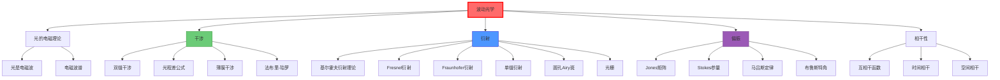

# 波动光学

## 一句话物理图像

> 光是一种电磁波——它的波动性解释了为什么光能绕过障碍物形成影子（衍射），为什么两束光能叠加成明暗条纹（干涉）

## 一、为什么需要波动光学？

### 1.1 粒子说的困难

如果光只是"粒子"（牛顿粒子说），无法解释：

| 实验 | 粒子说预测 | 实验现象 | 矛盾点 |
|------|-----------|----------|--------|
| **牛顿环** | 光斑连续 | 明暗相间环 | 无法解释干涉 |
| **双缝实验** | 两条亮线 | 多条干涉条纹 | 无法解释叠加 |
| **衍射** | 直线传播 | 绕过障碍物弯曲 | 无法解释弯曲 |

### 1.2 波动说的崛起

> **托马斯·杨（1801）**：光是一种波，能发生干涉。

**关键证据**：双缝干涉实验——在屏幕上出现等间距的明暗条纹。

> [!concept]+ 物理图像：水波干涉
> 想象湖面上两艘船产生的涟漪相遇：当波峰遇到波峰，水面特别高（干涉相长）；当波峰遇到波谷，水面平静（干涉相消）。光也是同样的原理。

### 1.3 波动说 vs 粒子说 的最终判决

| 预测 | 粒子说 | 波动说 | 实验验证 |
|------|--------|--------|----------|
| 光速在水中 | 不变 | 变慢 | 傅科实验：光速在水中变慢 → 波动说胜 |
| 干涉 | 无 | 有 | 杨氏双缝 → 波动说胜 |
| 偏振 | 无 | 有（横波） | 偏振实验 → 波动说胜 |

---

## 二、光的电磁理论

### 2.1 麦克斯韦的贡献

麦克斯韦方程组统一了电、磁、光：

$$\boxed{\text{光是一种电磁波}}$$

**预言**：
- 光速 $c = 1/\sqrt{\mu_0 \epsilon_0} \approx 3 \times 10^8$ m/s
- 光是横波（$\mathbf{E} \perp \mathbf{B} \perp$ 传播方向）

### 2.2 可见光在电磁波谱中的位置

$$c = \lambda \nu$$

| 波段 | 波长 | 频率 | 备注 |
|------|------|------|------|
| 无线电 | > 1 mm | < 300 GHz | 广播、雷达 |
| **红外** | 1 μm - 1 mm | 300 GHz - 400 THz | 热辐射 |
| **可见光** | 400-700 nm | 400-790 THz | 人眼可见 |
| **紫外** | < 400 nm | > 790 THz | 皮肤晒黑 |
| X射线 | < 10 nm | > 30 PHz | 医学成像 |

> [!tip]+ 太赫兹波段
> 0.1-10 THz（300 μm - 3 mm）是太赫兹波段，位于微波和红外之间。这个波段兼具微波（穿透性）和光学（分辨率）特性，是当前研究热点。

---

## 三、干涉——波动叠加原理

### 3.1 干涉条件

**相干条件**（才能产生稳定干涉图样）：
1. **频率相同**（$\Delta \nu = 0$）
2. **相位差稳定**（固定或周期变化）
3. **振动方向不垂直**（有平行分量）

> [!concept]+ 相干性像什么？
> 两个人荡秋千：如果节奏完全一致（频率相同），且每次推的力度关系固定（相位稳定），秋千就会越荡越高（相长干涉）。如果节奏混乱，秋千就晃晃停停（不相干）。

### 3.2 光程差与干涉

两束光的光程差：

$$\Delta = n_1 r_1 - n_2 r_2$$

**干涉条件**：

| 光程差 | 相位差 | 干涉结果 |
|--------|--------|----------|
| $\Delta = m\lambda$ | $2m\pi$ | **相长干涉**（最亮） |
| $\Delta = (m+1/2)\lambda$ | $(2m+1)\pi$ | **相消干涉**（最暗） |

### 3.3 双缝干涉（详细推导）

```
        单色光源
             │
             ▼
         ┌──┴──┐
         │ 缝1 │ d/2
         └──┬──┘
            │ θ
    ─────────┼───────── 屏幕
            │ θ
         ┌──┬──┐
         │ 缝2 │ d/2
         └──┴──┘
```

**几何关系**：从缝1和缝2到屏幕上P点的距离差：

$$\Delta r = d \sin\theta$$

**干涉极大条件**：

$$d \sin\theta = m\lambda, \quad m = 0, \pm 1, \pm 2, \ldots$$

**推导**：
- 相位差 $\Delta \phi = \frac{2\pi}{\lambda} d \sin\theta$
- 当 $\Delta \phi = 2m\pi$ 时，两束光同相相加（相长）
- 即 $d \sin\theta = m\lambda$

### 3.4 干涉光强公式

$$I = I_1 + I_2 + 2\sqrt{I_1 I_2} \cos(\Delta \phi)$$

当 $I_1 = I_2 = I_0$ 时：

$$I = 4I_0 \cos^2\left(\frac{\Delta \phi}{2}\right)$$

| 参数 | 含义 |
|------|------|
| $I_1, I_2$ | 两束光各自强度 |
| $\Delta \phi$ | 两束光相位差 |
| $4I_0$ | 最大光强（相长干涉时） |

### 3.5 条纹间距

由 $d \sin\theta = m\lambda$，当 $\theta$ 很小时，$\sin\theta \approx \theta \approx x/L$：

$$x_m = \frac{m\lambda L}{d}$$

**条纹间距**：

$$\Delta x = \frac{\lambda L}{d}$$

> [!example]+ 数值估算
> 双缝间距 $d = 0.5$ mm，缝到屏幕 $L = 1$ m，波长 $\lambda = 500$ nm：
> $$\Delta x = \frac{500 \times 10^{-9} \times 1}{0.5 \times 10^{-3}} = 1 \text{ mm}$$
>
> 屏幕上可看到约 1 mm 间距的明暗条纹。

---

## 四、基尔霍夫衍射理论——波动方程的严格解

### 4.1 标量衍射理论

从 Helmholtz 方程 $\nabla^2 U + k^2U = 0$ 出发，利用 Green 第二恒等式：

$$\oint_S \left(U\frac{\partial G}{\partial n} - G\frac{\partial U}{\partial n}\right)dS = 0$$

其中 $G = e^{ikR}/R$ 是自由空间 Green 函数。

**基尔霍夫积分定理**（封闭面 $S$ 上的场值决定内部任意点的场）：

$$U(P) = \frac{1}{4\pi}\oint_S \left[\frac{e^{ikr}}{r}\frac{\partial U}{\partial n} - U\frac{\partial}{\partial n}\left(\frac{e^{ikr}}{r}\right)\right]dS$$

### 4.2 Fresnel-Kirchhoff 衍射公式

在孔径 $\Sigma$ 处应用基尔霍夫边界条件（$U$ 和 $\partial U/\partial n$ 在孔径外为零），点光源照明：

$$U(P) = \frac{-i}{\lambda}\frac{A e^{ik(r'+r)}}{r'r}\cdot\frac{1+\cos\theta}{2}\,d\Sigma$$

| 参数 | 含义 |
|------|------|
| $r'$ | 光源到孔径的距离 |
| $r$ | 孔径到观察点的距离 |
| $\theta$ | 衍射角 |
| $(1+\cos\theta)/2$ | 倾斜因子（Kirchhoff边界条件） |

> [!formula]+ 倾斜因子的物理含义
> $\theta = 0$（正前方）：倾斜因子 = 1，最强
> $\theta = \pi/2$（侧向）：倾斜因子 = 1/2
> $\theta = \pi$（反向）：倾斜因子 = 0，无后向衍射
>
> 这个结果修正了 Huygens 原理的原始缺陷——Huygens 原理无法解释为什么没有后向波。

### 4.3 Fresnel 近似与 Fraunhofer 近似

对衍射积分做不同近似：

| 近似 | 条件 | 数学处理 |
|------|------|---------|
| Fresnel（近场） | $z^3 \gg \frac{k}{2}(x^2+y^2)_{max}^2$ | 二次相位展开 |
| Fraunhofer（远场） | $z \gg \frac{k}{2}(x^2+y^2)_{max}$ | 远场 Fourier 变换 |

**Fresnel 衍射积分**：

$$U(x,y) = \frac{e^{ikz}}{i\lambda z}e^{i\frac{k}{2z}(x^2+y^2)}\iint U_0(x',y')\,e^{i\frac{k}{2z}(x'^2+y'^2)}\,e^{-i\frac{k}{z}(xx'+yy')}\,dx'dy'$$

**Fraunhofer 衍射**（$z \to \infty$ 或透镜焦平面）：

$$U(x,y) = \frac{e^{ikz}}{i\lambda z}e^{i\frac{k}{2z}(x^2+y^2)}\iint U_0(x',y')\,e^{-i\frac{2\pi}{\lambda z}(xx'+yy')}\,dx'dy'$$

> [!concept]+ 关键理解
> **Fraunhofer 衍射就是孔径函数的 Fourier 变换！** 这意味着在远场（或透镜后焦面），空间分布 $U_0(x',y')$ 与角谱（方向分布）互为 Fourier 对。这是整个傅里叶光学的基石。详见 [[傅里叶光学]]。

---

## 五、单缝与多缝衍射——详细分析

### 5.1 单缝衍射（从 Fourier 变换推导）

单缝孔径函数：$U_0(x') = \text{rect}(x'/a)$（宽 $a$ 的矩形函数）

Fourier 变换：

$$\tilde{U}(k_x) = \int_{-a/2}^{a/2} e^{-ik_x x'}dx' = a\,\text{sinc}\left(\frac{k_x a}{2}\right)$$

其中 $k_x = k\sin\theta = 2\pi\sin\theta/\lambda$，$\text{sinc}(x) = \sin x / x$。

$$\boxed{I(\theta) = I_0 \left(\frac{\sin\beta}{\beta}\right)^2, \quad \beta = \frac{\pi a\sin\theta}{\lambda}}$$

**特征尺度**：

| 特征 | 条件 | 角位置 |
|------|------|--------|
| 中央极大 | $\beta = 0$ | $\theta = 0$ |
| 第一暗纹 | $\beta = \pi$ | $\sin\theta = \lambda/a$ |
| 中央极大角宽度 | 半宽 | $\Delta\theta \approx \lambda/a$ |

> [!example]+ 数值：单缝衍射
> 缝宽 $a = 0.1$ mm，$\lambda = 633$ nm（He-Ne激光）：
> $$\theta_1 = \frac{\lambda}{a} = \frac{633\times10^{-9}}{10^{-4}} = 6.33\,\text{mrad} \approx 0.36°$$
> 屏幕距离 1 m 处，中央亮纹宽度约 12.7 mm。

### 5.2 圆孔衍射与 Airy 斑

圆孔的 Fourier 变换给出：

$$I(\theta) = I_0\left[\frac{2J_1(ka\sin\theta)}{ka\sin\theta}\right]^2$$

第一暗环：$ka\sin\theta = 3.832$，即 $\sin\theta = 1.22\lambda/D$（$D = 2a$ 为孔径）。

**Airy 斑半径**：

$$r_{Airy} = 1.22\frac{\lambda f}{D}$$

| 孔径 D | λ = 500 nm | Airy斑半径 (f=100mm) |
|--------|-----------|---------------------|
| 1 mm | 500 nm | 61 μm |
| 10 mm | 500 nm | 6.1 μm |
| 100 mm | 500 nm | 0.61 μm |

> [!concept]+ Airy斑与分辨率
> 望远镜口径越大，Airy斑越小，分辨率越高。这就是为什么天文台要建大口径望远镜——不是"看得更远"，而是"看得更清楚"（角分辨率更高）。

### 5.3 光栅衍射（多缝干涉 × 单缝衍射）

$N$ 条缝，间距 $d$，每条缝宽 $a$：

$$I(\theta) = I_0\left(\frac{\sin\beta}{\beta}\right)^2\left(\frac{\sin N\alpha}{N\sin\alpha}\right)^2$$

其中 $\beta = \pi a\sin\theta/\lambda$，$\alpha = \pi d\sin\theta/\lambda$。

| 因子 | 来源 | 特点 |
|------|------|------|
| $(\sin\beta/\beta)^2$ | 单缝衍射包络 | 宽的调制包络 |
| $(\sin N\alpha / N\sin\alpha)^2$ | 多缝干涉 | 窄的锐利峰 |

**光栅分辨率**（Rayleigh判据）：

$$R = \frac{\lambda}{\Delta\lambda} = mN$$

> [!example]+ 光栅分辨率计算
> 1200 lines/mm 光栅，宽度 50 mm（$N = 60000$），二级衍射（$m = 2$）：
> $$R = 2 \times 60000 = 120000$$
> 可分辨 $\Delta\lambda = \lambda/R$。对 $\lambda = 500$ nm：
> $$\Delta\lambda = \frac{500}{120000} \approx 0.004\,\text{nm}$$

---

## 六、法布里-珀罗干涉仪——多光束干涉

### 6.1 工作原理

两个平行的高反射率镜面，间距 $d$，构成**法布里-珀罗 (FP) 腔**。光在腔内多次反射，每次透射出一部分光。

**透射函数**（Airy函数）：

$$\boxed{T = \frac{(1-R)^2}{(1-R)^2 + 4R\sin^2(\delta/2)}}$$

其中 $\delta = 4\pi nd\cos\theta/\lambda$ 是相邻光束的相位差。

### 6.2 关键参数

| 参数 | 定义 | 表达式 |
|------|------|--------|
| 细度 $\mathcal{F}$ | 自由光谱范围内可分辨线数 | $\mathcal{F} = \frac{\pi\sqrt{R}}{1-R}$ |
| 自由光谱范围 FSR | 相邻级次的频率/波长间距 | $\Delta\nu_{FSR} = c/(2nd)$ |
| 线宽 $\delta\nu$ | 峰的半高全宽 | $\delta\nu = \Delta\nu_{FSR}/\mathcal{F}$ |
| 品质因子 $Q$ | $\nu_0/\delta\nu$ | $Q = m\mathcal{F}$ |

> [!formula]+ 透射函数推导
> 第 $n$ 次透射光的振幅：$t_n = t_1(t_1 r'/r_1)^{n-1} e^{in\delta}$（$r'$ = 镜面反射系数，$t_1$ = 透射系数）
> 所有透射光叠加：$E_T = \sum_{n=1}^{\infty} t_n = \frac{t_1^2 e^{i\delta}}{1 - r'^2 e^{i\delta}}$
> 取 $|E_T|^2$，用 $R = r'^2$，$T = t_1^2$：
> $$T = \frac{T^2}{|1 - Re^{i\delta}|^2} = \frac{(1-R)^2}{(1-R)^2 + 4R\sin^2(\delta/2)}$$

### 6.3 数值示例

| 参数 | 值 |
|------|-----|
| 反射率 $R$ | 0.95 |
| 细度 $\mathcal{F}$ | $\pi\sqrt{0.95}/0.05 \approx 61$ |
| 腔长 $d$ | 1 cm |
| FSR | $c/(2d) = 15$ GHz |
| 线宽 | $15/61 \approx 0.25$ GHz |

> [!concept]+ FP腔的物理图像
> FP 腔像一个"频率筛子"——只有满足共振条件 $\delta = 2m\pi$ 的频率才能高效透过。反射率越高，筛子越精细。激光谐振腔本质上就是一个 FP 腔，详见 [[激光物理]]。

---

## 七、薄膜干涉

### 7.1 等倾干涉

薄膜（厚度 $d$，折射率 $n$）上下表面反射光的光程差：

$$\Delta = 2nd\cos\theta_r + \frac{\lambda}{2}$$

$\lambda/2$ 来自反射时的半波损失（光疏→光密反射时相位突变 $\pi$）。

**干涉条件**：
- 相长：$\Delta = m\lambda$ → 明环
- 相消：$\Delta = (m+1/2)\lambda$ → 暗环

### 7.2 等厚干涉（Newton 环）

平凸透镜放在平玻璃板上，空气隙厚度 $h(r) = r^2/(2R)$：

明环半径：$r_m = \sqrt{(m+1/2)\lambda R}$

暗环半径：$r_m = \sqrt{m\lambda R}$

> [!example]+ Newton 环测量曲率半径
> 用 $\lambda = 589$ nm 钠灯，第 10 个暗环半径 $r_{10} = 5.0$ mm：
> $$R = \frac{r_{10}^2}{m\lambda} = \frac{25\times10^{-6}}{10\times589\times10^{-9}} = 4.24\,\text{m}$$

### 7.3 增透膜与高反膜

| 应用 | 条件 | 典型厚度 |
|------|------|---------|
| **增透膜** | 两次反射光相消干涉 | $d = \lambda/(4n_f)$ |
| **高反膜** | 多层 $\lambda/4$ 膜交替堆叠 | 每层 $\lambda/4$ |

增透膜（单层）零反射条件：
1. $n_f = \sqrt{n_0 n_s}$（折射率匹配）
2. $d = \lambda_0/(4n_f)$（光学厚度 = $\lambda/4$）

> [!example]+ 镜头镀膜
> 玻璃 $n_s = 1.52$，空气中需要 $n_f = \sqrt{1.52} \approx 1.23$。常用 MgF₂（$n = 1.38$），不是完美匹配但可从 4% 反射率降到 ~1.3%。

---

## 八、偏振——完整理论

### 8.1 Jones 矩阵形式

偏振态用 Jones 矢量描述：

$$\mathbf{E} = \begin{pmatrix} E_x \\ E_y \end{pmatrix} = \begin{pmatrix} A_x e^{i\delta_x} \\ A_y e^{i\delta_y} \end{pmatrix}$$

| 偏振态 | Jones 矢量 |
|--------|-----------|
| 水平线偏振 | $(1, 0)^T$ |
| 垂直线偏振 | $(0, 1)^T$ |
| 45°线偏振 | $(1, 1)^T/\sqrt{2}$ |
| 右旋圆偏振 | $(1, -i)^T/\sqrt{2}$ |
| 左旋圆偏振 | $(1, i)^T/\sqrt{2}$ |

光学元件用 **Jones 矩阵**表示：

| 元件 | Jones 矩阵 |
|------|-----------|
| 水平偏振片 | $\begin{pmatrix}1&0\\0&0\end{pmatrix}$ |
| $\lambda/4$ 波片（快轴水平） | $\begin{pmatrix}1&0\\0&-i\end{pmatrix}$ |
| $\lambda/2$ 波片（快轴水平） | $\begin{pmatrix}1&0\\0&-1\end{pmatrix}$ |
| 旋转 $\theta$ 角 | $R(\theta) = \begin{pmatrix}\cos\theta&-\sin\theta\\\sin\theta&\cos\theta\end{pmatrix}$ |

### 8.2 Stokes 参量（描述部分偏振光）

Jones 矢量只能描述完全偏振光。**Stokes 参量**可以描述任意偏振态（包括部分偏振和非偏振光）：

$$S_0 = \langle E_x E_x^* + E_y E_y^* \rangle = I_{total}$$

$$S_1 = \langle E_x E_x^* - E_y E_y^* \rangle = I_H - I_V$$

$$S_2 = \langle E_x E_y^* + E_y E_x^* \rangle = I_{+45°} - I_{-45°}$$

$$S_3 = \langle i(E_y E_x^* - E_x E_y^*) \rangle = I_{RCP} - I_{LCP}$$

**偏振度**：

$$P = \frac{\sqrt{S_1^2 + S_2^2 + S_3^2}}{S_0}$$

| $P$ 值 | 偏振状态 |
|--------|---------|
| $P = 1$ | 完全偏振 |
| $0 < P < 1$ | 部分偏振 |
| $P = 0$ | 非偏振光 |

> [!concept]+ Stokes参量的直觉
> Stokes参量用6次光强测量定义了光的完整偏振信息：总光强 ($S_0$)、水平vs垂直偏振 ($S_1$)、±45°偏振 ($S_2$)、左旋vs右旋圆偏振 ($S_3$)。Poincaré球上每一点对应一种偏振态。

---

## 九、相干性理论——深入

### 9.1 互相干函数

空间两点 $\mathbf{r}_1, \mathbf{r}_2$ 在时刻 $t_1, t_2$ 的场之间关联：

$$\Gamma_{12}(\tau) = \langle E^*(\mathbf{r}_1, t)\, E(\mathbf{r}_2, t+\tau) \rangle$$

**归一化**：

$$\gamma_{12}(\tau) = \frac{\Gamma_{12}(\tau)}{\sqrt{I_1 I_2}}$$

### 9.2 干涉条纹可见度

$$\mathcal{V} = \frac{I_{max} - I_{min}}{I_{max} + I_{min}} = \frac{2\sqrt{I_1 I_2}}{I_1 + I_2}|\gamma_{12}(\tau)|$$

当 $I_1 = I_2$ 时：$\mathcal{V} = |\gamma_{12}(\tau)|$

| $|\gamma|$ | 相干程度 |
|-----------|---------|
| 1 | 完全相干 |
| 0 | 完全不相干 |
| 0 < $|\gamma|$ < 1 | 部分相干 |

### 9.3 光谱线的线型与相干长度

| 线型 | 谱线形状 | 相干时间 |
|------|---------|---------|
| Lorentzian | $\frac{\Delta\nu/2\pi}{(\nu-\nu_0)^2+(\Delta\nu/2)^2}$ | $\tau_c = 1/(\pi\Delta\nu)$ |
| Gaussian | $\exp[-4\ln2(\nu-\nu_0)^2/\Delta\nu^2]$ | $\tau_c = \sqrt{2\ln2/\pi}/\Delta\nu$ |

| 光源 | 线宽 $\Delta\nu$ | 相干长度 $L_c$ |
|------|----------------|---------------|
| 白炽灯 | ~300 THz | ~1 μm |
| 低压钠灯 | ~10 GHz | ~3 cm |
| He-Ne 激光 | ~1 MHz | ~300 m |
| 稳频激光 | ~1 kHz | ~300 km |

> [!concept]+ 相干长度决定干涉实验尺度
> 白炽灯的相干长度只有 ~1 μm——不可能用白炽灯做毫米尺度的干涉实验。这就是为什么 Michelson 需要仔细匹配两臂光程才能看到白光干涉条纹。激光的相干长度可达数百米甚至数百公里——很容易实现干涉。

---

## 十、知识树



---

## 十一、延伸阅读

- [[光学原理]] - 几何光学基础
- [[傅里叶光学]] - 波动光学的频域分析（Fraunhofer衍射 = Fourier变换）
- [[激光物理]] - 相干光源的原理（FP腔 → 激光谐振腔）
- [[量子光学]] - 光的量子描述 — **RAG 库收录** Scully & Zubairy 教材 [[cite:@Scully1997]]

---

## 参考文献

1. **[[cite:@Hecht2015]]** — "Optics", 第5版，干涉/衍射/偏振经典教材
2. **[[cite:@Born1999]]** — "Principles of Optics", 第7版，基尔霍夫衍射理论权威参考
3. **[[cite:@Goodman2017]]** — "Introduction to Fourier Optics", 第3版，Fraunhofer衍射与Fourier变换
4. **[[cite:@Scully1997]]** — "Quantum Optics", 相干性理论的量子基础。**RAG 库收录** — 含一阶/二阶相干函数、HBT实验图