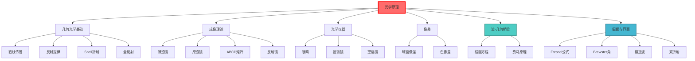

# 光学原理

## 一句话物理图像

> 几何光学是"光线近似"——当光遇到的障碍物远大于波长时，光可以看作沿直线传播的"光线"

## 一、光学的两大分支

```
光学
├── 几何光学（光线近似）
│   ├── 反射
│   ├── 折射
│   └── 成像
│
└── 波动光学（完整理论）
    ├── 干涉
    ├── 衍射
    └── 偏振
```

**分界线**：障碍物尺寸 $d$ vs 波长 $\lambda$

| 条件 | 理论 | 例子 |
|------|------|------|
| $d \gg \lambda$ | 几何光学 | 镜子、透镜 |
| $d \sim \lambda$ | 波动光学 | 小孔、狭缝 |
| $d \ll \lambda$ | 波动光学（近似射线） | 纳米结构 |

> [!concept]+ 物理图像：河流与石头
> 大石头（$d \gg \lambda$）：水可以看作沿直线流动（光线）。小石头（$d \sim \lambda$）：水波必须绕过石头（衍射），不能再当直线处理。

---

## 二、程函方程 (Eikonal Equation)

### 2.1 从波动方程到几何光学

几何光学并非独立理论，而是波动光学在短波长极限下的严格近似。程函方程建立了两者的桥梁。

> [!concept]+ 物理直觉
> 当波长 $\lambda \to 0$（即波数 $k_0 \to \infty$），波前变成尖锐的几何面，光线变成垂直于波前的直线。正如远看水面涟漪——波纹消失了，只剩"水流方向"。

### 2.2 推导：Helmholtz方程 → Eikonal方程

**出发点**：标量 Helmholtz 方程（单色波的稳态形式）

$$\nabla^2 U(\mathbf{r}) + k_0^2 n^2(\mathbf{r})\, U(\mathbf{r}) = 0$$

其中 $k_0 = 2\pi/\lambda_0$ 是真空波数，$n(\mathbf{r})$ 是空间变化的折射率。

> [!formula]+ 推导步骤
>
> **Step 1**：设试探解
>
> $$U(\mathbf{r}) = A(\mathbf{r})\, e^{ik_0 S(\mathbf{r})}$$
>
> 其中 $S(\mathbf{r})$ 称为**程函 (eikonal)**，即光程函数；$A(\mathbf{r})$ 是缓变振幅。
>
> **Step 2**：计算 Laplacian
>
> $$\nabla U = (\nabla A + ik_0 A\,\nabla S)\,e^{ik_0 S}$$
>
> $$\nabla^2 U = \left[\nabla^2 A + 2ik_0\nabla A\cdot\nabla S + ik_0 A\,\nabla^2 S - k_0^2 A\,|\nabla S|^2\right]e^{ik_0 S}$$
>
> **Step 3**：代入 Helmholtz 方程，按 $k_0$ 的幂次分组
>
> - $k_0^2$ 阶（最高阶）：$-|\nabla S|^2 + n^2(\mathbf{r}) = 0$
> - $k_0^1$ 阶：$2\nabla A\cdot\nabla S + A\,\nabla^2 S = 0$（输运方程）
> - $k_0^0$ 阶：$\nabla^2 A = 0$（最低阶，可忽略）
>
> **Step 4**：取 $k_0 \to \infty$ 极限，保留最高阶项

**结果——程函方程**：

$$\boxed{|\nabla S(\mathbf{r})|^2 = n^2(\mathbf{r})}$$

### 2.3 程函方程的物理含义

| 数学对象 | 物理含义 |
|----------|----------|
| $S(\mathbf{r})$ = const 的等值面 | **波前**（等相位面） |
| $\nabla S$ 的方向 | **光线方向**（垂直于波前） |
| $\|\nabla S\| = n$ | 光在折射率 $n$ 的介质中，$n$ 越大光线越"密" |
| 光程 $\int_A^B n\,ds = S(B) - S(A)$ | 费马原理的数学表达 |

**等价关系**：

$$\text{程函方程} \quad \Longleftrightarrow \quad \text{费马原理} \quad \Longleftrightarrow \quad \text{Snell定律}$$

> [!example]+ 光纤中的程函
> 阶跃光纤纤芯 $n_1 = 1.48$，包层 $n_2 = 1.46$。在纤芯内 $|\nabla S| = 1.48$，包层内 $|\nabla S| = 1.46$。光线在界面处 $\nabla S$ 大小突变，方向服从 Snell 定律——这正是程函方程的边界条件。

---

## 三、几何光学基本定律

### 3.1 直线传播定律

光在均匀介质中沿直线传播。

**原因**：波长 $\lambda \to 0$ 时，波动方程的解趋近于光线。

> [!example]+ 日食的原理
> 太阳发光沿直线传播。月球挡住太阳光，在地面形成本影——直线传播的直接证明。

### 3.2 反射定律

$$\theta_i = \theta_r$$

其中 $\theta_i$ 是入射角，$\theta_r$ 是反射角，均从法线测量。

**推导**（费马原理）：

光从 A 点到 B 点，无论反射与否，光程必须是最小值。

```
        n₁
    A ───●──────────── B
          ↖
           ↖ θᵢ
    ═══════●═══════ 界面
              ↘ θᵣ
               ↘
               C
```

实际路径 A → 界面 → B 比 A → C → B 更短，所以光在界面发生反射。

### 3.3 斯涅尔折射定律（详细推导）

**实验现象**：
- 光从空气进入水中，传播方向改变
- 筷子插入水中"折断"

**数学表达**：

$$n_1 \sin\theta_1 = n_2 \sin\theta_2$$

其中 $n$ 是折射率，$\theta$ 是与法线的夹角。

**推导**（费马原理）：

光从 A(0, -d₁) 到 B(0, d₂)，经过界面点 (x, 0)：

光程：$L(x) = n_1 \sqrt{x^2 + d_1^2} + n_2 \sqrt{x^2 + d_2^2}$

极小值条件 $dL/dx = 0$：

$$\frac{n_1 x}{\sqrt{x^2 + d_1^2}} + \frac{n_2 x}{\sqrt{x^2 + d_2^2}} = 0$$

解得：

$$n_1 \sin\theta_1 = n_2 \sin\theta_2$$

### 3.4 全反射

**临界角**：当光从光密介质（$n_1$）到光疏介质（$n_2 < n_1$），折射角 $\theta_2 = 90°$ 时：

$$\sin\theta_c = \frac{n_2}{n_1}$$

**物理条件**：
- $n_1 > n_2$（从光密到光疏）
- $\theta_1 > \theta_c$（入射角足够大）

> [!example]+ 全反射的应用
> - **光纤通信**：光在光纤核心（高折射率）和包层（低折射率）界面全反射，实现低损耗传输
> - **棱镜望远镜**：利用全反射代替反射镜，重量更轻

---

## 四、透镜成像

### 4.1 薄透镜公式推导

**符号约定**：
- 光线从左向右传播
- 物距 $s$：物到透镜的距离（实物为正，虚物为负）
- 像距 $s'$：像到透镜的距离（实像为正，虚像为负）
- 焦距 $f$：平行光聚焦到主焦点的距离

**近轴近似**：只考虑小角度（$\sin\theta \approx \theta$）

```
        物 (Object)
          │
          │ 光线1
          ▼
      ╭─────╮
      │ 透镜 │
      ╰─────╯
          ▲
          │ 光线2 (平行光)
          │
       焦点 f
          │
       虚像
```

**推导**：
1. 物距 $s$，像距 $s'$
2. 透镜的光焦度 $\Phi = 1/f$
3. 近轴光线追踪：$1/s + 1/s' = \Phi = 1/f$

### 4.2 透镜类型

| 类型 | 形状 | 焦距 | 成像特点 |
|------|------|------|----------|
| **双凸透镜** | 两面凸 | 正 | 会聚 |
| **双凹透镜** | 两面凹 | 负 | 发散 |
| **平凸透镜** | 一面平 | 正 | 会聚 |
| **平凹透镜** | 一面平 | 负 | 发散 |
| **弯月透镜** | 凹凸 | 可正可负 | 消像差 |

### 4.3 放大率

**横向放大率** $m$：

$$m = \frac{h'}{h} = -\frac{s'}{s}$$

其中 $h$ 是物高，$h'$ 是像高。

| $m$ 值 | 像的性质 |
|--------|----------|
| $|m| > 1$ | 放大 |
| $|m| < 1$ | 缩小 |
| $m > 0$ | 正立（虚像） |
| $m < 0$ | 倒立（实像） |

---

## 五、ABCD矩阵（光线传输矩阵）

### 5.1 光线的列向量表示

在近轴近似下，一条光线可以用两个参量完全描述：

$$\begin{pmatrix} y \\ \theta \end{pmatrix}$$

其中 $y$ 是光线相对于光轴的高度，$\theta$ 是光线与光轴的夹角（弧度，近轴下 $\theta \approx \sin\theta$）。

> [!concept]+ 物理直觉
> ABCD矩阵方法将光线追踪转化为**矩阵代数**。复杂光学系统的行为只需一次矩阵连乘即可求得——不需要逐面追踪每条光线。

### 5.2 基本ABCD矩阵推导

**1. 自由空间传播**（距离 $d$）

光线不变：$y' = y + d\theta$，$\theta' = \theta$

$$\boxed{M_{\text{free}} = \begin{pmatrix} 1 & d \\ 0 & 1 \end{pmatrix}}$$

**2. 薄透镜**（焦距 $f$，正为会聚）

光线高度不变：$y' = y$，角度改变：$\theta' = \theta - y/f$

$$\boxed{M_{\text{lens}} = \begin{pmatrix} 1 & 0 \\ -1/f & 1 \end{pmatrix}}$$

> [!formula]+ 薄透镜ABCD矩阵推导
> 由薄透镜公式 $1/s + 1/s' = 1/f$ 出发：
> - 入射光线在透镜处高度 $y$，出射时高度不变 $y' = y$
> - 入射角 $\theta_1 \approx y/s$（物方），出射角 $\theta_2 \approx -y/s'$（像方）
> - 由 $\theta_2 = \theta_1 - y/f$ 得矩阵第二行

**3. 球面折射**（曲率半径 $R$，从 $n_1$ 到 $n_2$）

$$\boxed{M_{\text{sphere}} = \begin{pmatrix} 1 & 0 \\ \dfrac{n_1 - n_2}{n_2 R} & \dfrac{n_1}{n_2} \end{pmatrix}}$$

**4. 平面折射**（$R \to \infty$）

$$\boxed{M_{\text{plane}} = \begin{pmatrix} 1 & 0 \\ 0 & n_1/n_2 \end{pmatrix}}$$

**5. 球面反射镜**（曲率半径 $R$）

$$\boxed{M_{\text{mirror}} = \begin{pmatrix} 1 & 0 \\ -2/R & 1 \end{pmatrix}}$$

### 5.3 矩阵乘法规则

对于多元素光学系统，系统矩阵为各元件矩阵**从右到左**连乘：

$$M_{\text{sys}} = M_N \times M_{N-1} \times \cdots \times M_2 \times M_1$$

**规则**：最先遇到的光学元件写在最右边。

$$\begin{pmatrix} y_{\text{out}} \\ \theta_{\text{out}} \end{pmatrix} = M_{\text{sys}} \begin{pmatrix} y_{\text{in}} \\ \theta_{\text{in}} \end{pmatrix} = \begin{pmatrix} A & B \\ C & D \end{pmatrix} \begin{pmatrix} y_{\text{in}} \\ \theta_{\text{in}} \end{pmatrix}$$

### 5.4 成像条件

从ABCD矩阵的矩阵元 $B$ 判断成像：

$$B = 0 \quad \Longleftrightarrow \quad \text{成像条件成立}$$

**原因**：$y_{\text{out}} = A\, y_{\text{in}} + B\, \theta_{\text{in}}$。当 $B = 0$ 时，$y_{\text{out}}$ 只取决于 $y_{\text{in}}$，与入射角 $\theta_{\text{in}}$ 无关——即物点对应唯一像点。

横向放大率：$m = A$（$B = 0$ 时）

> [!example]+ 数值示例：双透镜系统
> 两个薄透镜 $f_1 = 10\,\text{cm}$，$f_2 = 20\,\text{cm}$，间距 $d = 30\,\text{cm}$。
>
> 系统矩阵：
> $$M = M_{f_2} \times M_{d} \times M_{f_1} = \begin{pmatrix} 1 & 0 \\ -1/20 & 1 \end{pmatrix}\begin{pmatrix} 1 & 30 \\ 0 & 1 \end{pmatrix}\begin{pmatrix} 1 & 0 \\ -1/10 & 1 \end{pmatrix}$$
>
> 先算右侧两项：
> $$M_{d} \times M_{f_1} = \begin{pmatrix} 1 & 30 \\ 0 & 1 \end{pmatrix}\begin{pmatrix} 1 & 0 \\ -1/10 & 1 \end{pmatrix} = \begin{pmatrix} 1 - 3 & 30 \\ -1/10 & 1 \end{pmatrix} = \begin{pmatrix} -2 & 30 \\ -0.1 & 1 \end{pmatrix}$$
>
> 再左乘 $M_{f_2}$：
> $$M = \begin{pmatrix} 1 & 0 \\ -0.05 & 1 \end{pmatrix}\begin{pmatrix} -2 & 30 \\ -0.1 & 1 \end{pmatrix} = \begin{pmatrix} -2 & 30 \\ 0 & -0.5 \end{pmatrix}$$
>
> $B = 30 \neq 0$，不满足成像。若将物放在第一透镜前 $20\,\text{cm}$，加一段自由传播矩阵再计算。系统等效焦距 $f_{\text{eq}} = -1/C$，当 $C \neq 0$ 时有效。

---

## 六、厚透镜

### 6.1 主平面概念

实际透镜有一定厚度 $d$，光线在前后表面之间经历平移，不能用薄透镜近似。

**定义**：两个**主平面 (principal planes)** $H$ 和 $H'$ 是使得系统可以像薄透镜一样处理的参考面：
- 物距从**前主平面** $H$ 量起
- 像距从**后主平面** $H'$ 量起
- $H$ 和 $H'$ 之间的光线"跳跃"（等效为瞬时折射）

> [!concept]+ 物理直觉
> 厚透镜等效于"被拉开距离的薄透镜"。主平面就是等效薄透镜所在的位置——光线在 $H$ 和 $H'$ 之间"瞬间"完成折射，虽然实际经过了厚度 $d$ 的玻璃。

### 6.2 用ABCD矩阵推导厚透镜焦距

厚透镜由三个操作组成：前球面折射 → 玻璃中传播 → 后球面折射。

$$M_{\text{thick}} = M_{\text{back}} \times M_{\text{glass}} \times M_{\text{front}}$$

展开计算：

$$M_{\text{thick}} = \begin{pmatrix} 1 & 0 \\ \dfrac{n-1}{R_2} & \dfrac{1}{n} \end{pmatrix}^{-1} \begin{pmatrix} 1 & d \\ 0 & 1 \end{pmatrix} \begin{pmatrix} 1 & 0 \\ -\dfrac{n-1}{R_1} & \dfrac{1}{n} \end{pmatrix}$$

（注意符号约定：光从左向右，$R_1 > 0$ 为凸面，$R_2 < 0$ 为凸面）

最终厚透镜ABCD矩阵元中，$C$ 矩阵元给出等效光焦度：

$$\boxed{\frac{1}{f} = (n-1)\left[\frac{1}{R_1} - \frac{1}{R_2} + \frac{(n-1)\,d}{n\,R_1 R_2}\right]}$$

### 6.3 与薄透镜公式对比

| 公式 | 表达式 | 适用条件 |
|------|--------|----------|
| **薄透镜** | $\dfrac{1}{f} = (n-1)\left(\dfrac{1}{R_1} - \dfrac{1}{R_2}\right)$ | $d \ll R_1, R_2$ |
| **厚透镜** | $\dfrac{1}{f} = (n-1)\left[\dfrac{1}{R_1} - \dfrac{1}{R_2} + \dfrac{(n-1)\,d}{n\,R_1 R_2}\right]$ | 任意厚度 |
| **修正项** | $\Delta\Phi = \dfrac{(n-1)^2 d}{n\,R_1 R_2}$ | 厚度贡献 |

当 $d \to 0$ 时，修正项消失，厚透镜公式退化为薄透镜公式。

> [!example]+ 数值示例：平凸厚透镜
> 平凸透镜，$R_1 = +50\,\text{mm}$，$R_2 = \infty$（平面），$n = 1.5$，$d = 10\,\text{mm}$。
>
> **薄透镜近似**：$1/f = 0.5 \times (1/50) = 0.01$，$f = 100\,\text{mm}$
>
> **厚透镜精确值**：修正项 $(0.5)^2 \times 10 / (1.5 \times 50 \times \infty) = 0$（$R_2 = \infty$ 使得修正项为零）
>
> 所以平凸透镜中厚度修正恰好为零！焦距 $f = 100\,\text{mm}$ 不变。
>
> 若改为**双凸透镜** $R_1 = +50$，$R_2 = -50$：
> - 薄透镜：$1/f = 0.5 \times (1/50 + 1/50) = 0.02$，$f = 50\,\text{mm}$
> - 厚透镜：修正项 $= (0.25 \times 10)/(1.5 \times 50 \times (-50)) = -0.000667$
> - $1/f = 0.02 - 0.000667 = 0.01933$，$f \approx 51.7\,\text{mm}$
>
> 厚度使焦距略微增大（透镜变"弱"），偏差约 $3.4\%$。

---

## 七、反射镜成像

### 7.1 球面反射镜

**焦点距** $f = R/2$（$R$ 是曲率半径）

| 类型 | 焦点 | 应用 |
|------|------|------|
| 凹面镜 | 实焦点（前方） | 聚光、望远镜 |
| 凸面镜 | 虚焦点（后方） | 广角镜、后视镜 |

### 7.2 平面镜

**成像规律**：
- 像与物关于镜面对称
- 像距 = 物距
- 虚像，正立

---

## 八、光学仪器

### 8.1 眼睛（光学系统）

```
角膜 + 晶状体 → 组合透镜 → 视网膜
焦距可调（调节肌）  成倒立实像
```

**近视与远视**：

| 类型 | 问题 | 矫正 |
|------|------|------|
| 近视 | 晶状体过厚 or 眼轴过长 | 凹透镜（发散） |
| 远视 | 晶状体过薄 or 眼轴过短 | 凸透镜（会聚） |

### 8.2 放大镜

**角放大率** $M = \frac{\theta_{\text{像}}}{\theta_{\text{物}}} \approx \frac{25}{f}$

其中 25 cm 是明视距离，$f$ 是焦距（cm）。

### 8.3 显微镜

**总放大率** $M = M_{\text{物镜}} \times M_{\text{目镜}} = \frac{L}{f_{\text{物}}} \cdot \frac{25}{f_{\text{目镜}}}$

其中 $L$ 是镜筒长度。

### 8.4 望远镜

| 类型 | 物镜 | 目镜 | 特点 |
|------|------|------|------|
| 开普勒 | 凸透镜 | 凸透镜 | 倒立，室内用 |
| 伽利略 | 凸透镜 | 凹透镜 | 正立，简便 |

**角放大率** $M = \frac{f_{\text{物镜}}}{f_{\text{目镜}}}$

---

## 九、色散与像差

### 9.1 色散

**现象**：不同波长的光折射率不同，白光通过棱镜分解成彩虹。

$$n(\lambda) = A + \frac{B}{\lambda^2}$$

其中柯西方程的系数 $A, B > 0$，所以短波长（蓝光）折射率更大。

> [!example]+ 彩虹的形成
> 太阳光（白光）进入水滴，发生折射-反射-折射。由于不同波长折射角不同，分解出七色光（红→紫）。红光折射角最小，紫光最大。

### 9.2 球面像差

**问题**：透镜边缘的光不汇聚在焦点，而在焦点内侧。

**原因**：透镜边缘的折射角更大。

**矫正**：非球面透镜、组合透镜（凸+凹）

### 9.3 色像差

**问题**：不同波长的光聚焦在不同位置（透镜色散）。

**矫正**：消色差透镜（不同玻璃组合，如火石玻璃+冕牌玻璃）

---

## 十、偏振（几何光学视角）

### 10.1 反射光的偏振

当自然光以布鲁斯特角 $\theta_B$ 入射时，反射光是完全线偏振光。

$$\tan\theta_B = \frac{n_2}{n_1}$$

**原因**：此时反射光中电场的振动方向与界面平行（不产生反射）。

### 10.2 双折射

**波晶片**：晶体（如方解石）中，光分解成两束线偏振光。

| 类型 | 折射率特点 | 例子 |
|------|-----------|------|
| **寻常光 (o)** | $n_o$ 固定，与方向无关 | 方解石 |
| **非常光 (e)** | $n_e$ 随方向变化 | 石英 |

---

## 十一、Fresnel公式

### 11.1 电磁波在界面处的边界条件

Fresnel公式从 Maxwell 方程的边界条件严格推导，给出反射和透射振幅系数。

**界面条件**：电磁场在界面两侧的切向分量连续。

$$E_{1\parallel} = E_{2\parallel}, \quad H_{1\parallel} = H_{2\parallel}$$

> [!concept]+ 物理直觉
> Fresnel公式回答了最基本的问题：**光打在玻璃表面，有多少被反射，多少透射？** 答案取决于两个因素——入射角和偏振方向。日常经验（窗户反光）和高端技术（增透膜、分束器）都依赖这组公式。

### 11.2 s偏振和p偏振的定义

入射面包含入射光线和法线。电磁波的电场可分解为两个正交分量：

| 偏振分量 | 方向 | 别名 |
|----------|------|------|
| **s偏振** (TE) | 垂直于入射面 | $E_s \perp$ 入射面 |
| **p偏振** (TM) | 平行于入射面 | $E_p \in$ 入射面 |

```
         入射面
        ╱  │╲
       ╱   │ ╲  E_s ⊥ 纸面（用 ⊙ 表示出纸面）
      ╱  θᵢ│  ╲
     ╱      │   ╲
  ──●───────●─────── 界面
     ╲      │   ╱
      ╲  θₜ│  ╱  E_p ∈ 入射面
       ╲   │ ╱
        ╲  │╱
```

### 11.3 Fresnel反射和透射系数推导

> [!formula]+ Fresnel公式推导（s偏振）
>
> 设入射波 $E_i$、反射波 $E_r$、透射波 $E_t$。对s偏振，电场垂直于入射面。
>
> 边界条件（切向电场连续 + 切向磁场连续）：
>
> $$E_i + E_r = E_t$$
>
> $$H_i \cos\theta_i - H_r \cos\theta_i = H_t \cos\theta_t$$
>
> 利用 $H = nE/(c\mu_0)$（非磁性介质），化简得：
>
> $$n_1(E_i - E_r)\cos\theta_i = n_2 E_t \cos\theta_t$$
>
> 结合第一个方程消去 $E_t$，解出：

**s偏振Fresnel系数**：

$$\boxed{r_s = \frac{n_1\cos\theta_i - n_2\cos\theta_t}{n_1\cos\theta_i + n_2\cos\theta_t}}$$

$$\boxed{t_s = \frac{2n_1\cos\theta_i}{n_1\cos\theta_i + n_2\cos\theta_t}}$$

> [!formula]+ Fresnel公式推导（p偏振）
>
> p偏振的电场在入射面内，边界条件为：
>
> $$E_i\cos\theta_i - E_r\cos\theta_i = E_t\cos\theta_t$$
>
> $$n_1(E_i + E_r) = n_2 E_t$$
>
> 消去 $E_t$，解得：

**p偏振Fresnel系数**：

$$\boxed{r_p = \frac{n_2\cos\theta_i - n_1\cos\theta_t}{n_2\cos\theta_i + n_1\cos\theta_t}}$$

$$\boxed{t_p = \frac{2n_1\cos\theta_i}{n_2\cos\theta_i + n_1\cos\theta_t}}$$

### 11.4 反射率和透射率

反射率（intensity reflectance）和透射率（intensity transmittance）：

$$R_s = |r_s|^2, \quad R_p = |r_p|^2$$

$$T_s = \frac{n_2\cos\theta_t}{n_1\cos\theta_i}|t_s|^2, \quad T_p = \frac{n_2\cos\theta_t}{n_1\cos\theta_i}|t_p|^2$$

能量守恒：$R + T = 1$。

**自然光（非偏振光）**的平均反射率：

$$\bar{R} = \frac{R_s + R_p}{2}$$

### 11.5 Brewster角

p偏振反射系数 $r_p = 0$ 的条件：$n_2\cos\theta_i = n_1\cos\theta_t$。

利用 Snell 定律 $n_1\sin\theta_i = n_2\sin\theta_t$，联立解得：

$$\boxed{\tan\theta_B = \frac{n_2}{n_1}}$$

> [!concept]+ 物理直觉
> 在Brewster角入射时，反射光线与透射光线恰好成 $90°$。此时p偏振的电场沿反射光方向振动——但电磁波不能沿自身传播方向振动，故p分量无法被反射，只剩下s分量。

**常见材料的Brewster角**：

| 界面 | $n_1$ | $n_2$ | $\theta_B$ |
|------|-------|-------|------------|
| 空气 → 玻璃 | 1.0 | 1.5 | $56.3°$ |
| 空气 → 水 | 1.0 | 1.33 | $53.1°$ |
| 空气 → 硅 | 1.0 | 3.5 | $74.1°$ |

### 11.6 全反射与倏逝波

当 $\theta_i > \theta_c$ 时，$\sin\theta_t = (n_1/n_2)\sin\theta_i > 1$，$\cos\theta_t$ 变为纯虚数。

反射系数的模 $|r_s| = |r_p| = 1$（**全反射**），但相位发生突变。

透射波在第二介质中呈指数衰减——**倏逝波 (evanescent wave)**：

$$E_t \propto e^{-\kappa z}\, e^{i(k_x x - \omega t)}$$

其中衰减常数：

$$\kappa = k_0\sqrt{n_1^2\sin^2\theta_i - n_2^2}$$

穿透深度（场衰减到 $1/e$）：

$$d_p = \frac{1}{\kappa} = \frac{\lambda_0}{2\pi\sqrt{n_1^2\sin^2\theta_i - n_2^2}}$$

> [!example]+ 光纤中的倏逝波
> 阶跃光纤：纤芯 $n_1 = 1.48$，包层 $n_2 = 1.46$，$\lambda_0 = 1550\,\text{nm}$，$\theta_i = 85°$。
>
> $\kappa = k_0\sqrt{1.48^2\sin^2 85° - 1.46^2} = k_0\sqrt{2.171 - 2.132} = k_0\sqrt{0.039}$
>
> $d_p = 1550/(2\pi\sqrt{0.039}) \approx 1550/1.24 \approx 1250\,\text{nm}$
>
> 倏逝波在包层中延伸约 $1.25\,\mu\text{m}$——这正是光纤传感器的工作原理：包层外的物质会改变倏逝波的衰减，从而调制传输光强。

### 11.7 数值表：n=1.5玻璃的反射率

空气 → 玻璃（$n_1 = 1.0$，$n_2 = 1.5$），$\theta_B = 56.3°$，$\theta_c$ 不存在（光密到光疏）。

玻璃 → 空气（$n_1 = 1.5$，$n_2 = 1.0$），$\theta_B = 33.7°$，$\theta_c = 41.8°$。

| 入射角 $\theta_i$ | $R_s$ (空气→玻璃) | $R_p$ (空气→玻璃) | $\bar{R}$ (空气→玻璃) |
|-------------------|-------------------|-------------------|----------------------|
| $0°$ | 0.040 | 0.040 | 0.040 |
| $10°$ | 0.040 | 0.039 | 0.040 |
| $20°$ | 0.043 | 0.036 | 0.040 |
| $30°$ | 0.053 | 0.026 | 0.040 |
| $40°$ | 0.075 | 0.013 | 0.044 |
| $50°$ | 0.126 | 0.001 | 0.064 |
| $56.3°$ | 0.158 | **0.000** | 0.079 |
| $60°$ | 0.181 | 0.002 | 0.092 |
| $70°$ | 0.289 | 0.043 | 0.166 |
| $80°$ | 0.488 | 0.170 | 0.329 |
| $90°$ | 1.000 | 1.000 | 1.000 |

> [!example]+ 从表格读出的关键信息
> 1. **正入射**（$\theta_i = 0°$）：$R = 4\%$，这就是为什么窗户玻璃总反射约 $4\%$ 的光
> 2. **Brewster角**（$56.3°$）：$R_p = 0$，此时反射光完全s偏振——这就是偏振太阳镜的原理
> 3. **掠入射**（$\theta_i \to 90°$）：$R \to 100\%$，水面在低角度几乎完全反射

---

## 十二、知识树



---

## 十三、延伸阅读

- [[波动光学]] - 波动光学完整理论
- [[激光物理]] - 相干光源
- [[太赫兹光电子学]] - THz波段光学

---

## 参考文献

1. **[[cite:@Hecht2015]]** - "Optics", 第5版，第1-5章（几何光学基础、偏振与Fresnel公式）
2. **[[cite:@Born1999]]** - "Principles of Optics", 第7版（程函方程、光线光学的严格推导）
3. **[[cite:@Goodman2017]]** - "Introduction to Fourier Optics", 第4版（ABCD矩阵、光线传输理论）
4. **[[cite:@Saleh2019]]** - "Fundamentals of Photonics", 第3版（Fresnel公式、倏逝波、光纤光学）