# 傅里叶光学

## 一句话物理图像

> 把光场看作不同"纹理频率"的叠加——从平滑的背景（低频）到细节的纹理（高频），傅里叶变换让我们能精准操控每一个频率成分

## 一、为什么需要傅里叶光学？

### 1.1 波动光学的频域视角

波动光学用**空间坐标** $x, y$ 描述光场 $U(x,y)$。但有些问题在**频域**更简单。

> [!example]+ 比喻：音乐的时域 vs 频域
> 一首交响乐时域：波形随时间变化。
> 频域：每个乐器（不同频率）各自贡献多少。
> 傅里叶光学就像给光场"分乐器"——哪些是大尺度结构（低频），哪些是细节（高频）。

### 1.2 频域分析的优势

| 时域问题 | 频域简化 |
|----------|----------|
| 复杂衍射计算 | 传递函数相乘 |
| 多缝干涉 | FTT 变换 |
| 光学系统成像 | 滤波操作 |

---

## 二、傅里叶变换基础

### 2.1 二维傅里叶变换定义

对于光场 $U(x, y)$：

$$U(f_x, f_y) = \iint_{-\infty}^{\infty} U(x, y) e^{-i2\pi(f_x x + f_y y)} dxdy$$

其中：
- $f_x, f_y$ 是**空间频率**（单位： cycles/mm）
- 逆变换：$U(x, y) = \iint U(f_x, f_y) e^{i2\pi(f_x x + f_y y)} df_x df_y$

### 2.2 空间频率的物理含义

**空间频率**：光场在单位距离内变化的周期数。

| 空间频率 | 对应光场特征 | 例子 |
|----------|--------------|------|
| $f_x, f_y \to 0$ | 缓变（低频） | 均匀背景、大范围亮度 |
| $f_x, f_y$ 中等 | 边缘、轮廓 | 图片中的线条 |
| $f_x, f_y$ 高 | 快变（高频） | 细节、纹理、噪声 |

> [!concept]+ 物理图像：围棋棋盘
> 大范围看棋盘（低频）：看到的是整体布局。中范围（中频）：看到单个棋子的聚集。放大看（高频）：看到每个棋子的边界。

### 2.3 常用函数的傅里叶变换

| 函数 | 变换 | 备注 |
|------|------|------|
| $\delta(x)$ | $1$ | 点 → 常数（所有频率） |
| $\text{rect}(x)$ | $\text{sinc}(f)$ | 方波 → sinc函数 |
| $\text{circ}(r)$ | $J_1(2\pi r) / r$ | 圆孔 → Bessel函数 |
| $e^{i2\pi f_0 x}$ | $\delta(f - f_0)$ | 平面波 → 冲击 |

---

## 三、透镜的傅里叶变换作用

### 3.1 透镜作为相位元件

透镜对光场的作用相当于一个相位因子：

$$t(x, y) = e^{-i\frac{k}{2f}(x^2 + y^2)}$$

其中 $k = 2\pi/\lambda$。

> [!formula]+ 推导
> 透镜厚度 $d(x,y)$ 取决于位置：
> - 中心厚，边缘薄（凸透镜）
> - 相位延迟 $\phi = k n d(x,y) \approx k d_0 - \frac{k}{2f}(x^2+y^2)$
> - 省略常数，得到相位因子 $e^{-i\frac{k}{2f}(x^2+y^2)}$

### 3.2 4f 系统（傅里叶变换光学系统）

```
物平面 → 透镜 L₁ → 焦平面（频谱）→ 透镜 L₂ → 像平面
    u(x,y)          FT{u}           滤波      逆 FT
```

**关键性质**：透镜焦平面上的光场分布 = 物平面光场的傅里叶变换。

**推导**：
1. 透镜前表面：光场 $u_0 e^{ikz}$
2. 透镜作用：乘 $e^{-i\frac{k}{2f}(x^2+y^2)}$
3. 菲涅尔衍射传播 $f$ 距离后，得到傅里叶变换

> [!tip]+ 物理图像：4f 系统
> 物平面的每个点（空间位置）在焦平面对应一个方向（空间频率）。就像棱镜把光按角度分开，透镜把光按频率分开。

### 3.3 频谱面（焦平面）

在焦平面上：
- 中心 ( $f_x = 0, f_y = 0$ )：低频（直流）成分
- 远离中心：高空间频率成分

**位置关系**：
$$x' = f \lambda f_x$$
$$y' = f \lambda f_y$$

---

## 四、光学传递函数

### 4.1 系统响应

光学系统把物 $u_0(x,y)$ 变成像 $u_i(x,y)$：

$$u_i(x,y) = h(x,y) * u_0(x,y)$$

其中 $h(x,y)$ 是系统的**点扩散函数**（PSF），$*$ 表示卷积。

**频域**：

$$U_i(f_x, f_y) = H(f_x, f_y) \cdot U_0(f_x, f_y)$$

其中 $H = \mathcal{F}\{h\}$ 是**传递函数**。

### 4.2 常见光学系统的传递函数

**理想透镜**（无像差、有限孔径）：

$$H(f_x, f_y) = \text{circ}\left(\frac{\sqrt{f_x^2 + f_y^2}}{f_c}\right)$$

其中 $f_c = D/(2\lambda f)$ 是截止频率。

| 频率范围 | 传递函数值 | 含义 |
|----------|------------|------|
| $\sqrt{f_x^2 + f_y^2} < f_c$ | $1$ | 完全通过 |
| $\sqrt{f_x^2 + f_y^2} = f_c$ | $0.5$ | 半通过 |
| $\sqrt{f_x^2 + f_y^2} > f_c$ | $0$ | 完全截止 |

> [!concept]+ 分辨率极限的物理含义
> 截止频率 $f_c$ 决定了系统能传递的最高空间频率 → 决定了最小可分辨细节
> 推导：艾里斑半径 $\approx 1.22 \lambda f / D$，对应空间频率 $1/(1.22 \lambda f / D) = D/(1.22 \lambda f)$

### 4.3 相干传递函数 vs 非相干传递函数

| 照明 | 传递函数 | 特点 |
|------|-----------|------|
| **相干光** | $H_{\text{coh}} = H_{\text{amp}}$ | 振幅传递，线性相位 |
| **非相干光** | $H_{\text{incoh}} = |H_{\text{amp}}|^2$ | 强度传递，平方关系 |

---

## 五、衍射的傅里叶分析

### 5.1 菲涅尔衍射 → 傅里叶变换

**菲涅尔近似下**（观察面远离孔径）：

$$U(x,y) = \frac{e^{ikz}}{i\lambda z} \iint u_0(x_0,y_0) e^{-i\frac{k}{2z}(x x_0 + y y_0)} dx_0 dy_0$$

这是 $u_0$ 的**傅里叶变换**，频率参数为：

$$f_x = \frac{x}{\lambda z}, \quad f_y = \frac{y}{\lambda z}$$

### 5.2 夫琅禾费衍射（远场）

当 $z \to \infty$ 时，菲涅尔近似简化为夫琅禾费近似：

$$U(x,y) \propto \text{FT}\{u_0(x_0,y_0)\}$$

**结论**：远场衍射图样 = 孔径函数的傅里叶变换。

> [!example]+ 单缝衍射的傅里叶分析
> 单缝函数：$u_0(x) = \text{rect}(x/a)$
> 傅里叶变换：$U(f_x) = a \text{sinc}(\pi a f_x)$
> 强度：$I \propto \text{sinc}^2(\pi a f_x)$ —— 与波动光学公式一致！

### 5.3 光栅衍射

**光栅函数**：周期为 $d$ 的矩形波

$$u_0(x) = \text{rect}\left(\frac{x}{N d}\right) * \sum_m \delta(x - m d)$$

**傅里叶变换**：

$$U(f_x) = N d \cdot \text{sinc}(\pi N d f_x) \cdot \sum_m \delta(f_x - m/d)$$

**结论**：
- 主极大位置：$\sin\theta = m\lambda/d$
- 主极大宽度：$\Delta\theta \approx \lambda/(N d)$
- 分辨率：$R = mN$

---

## 六、光学滤波

### 6.1 空间滤波原理

在 4f 系统的频谱面放置滤波器：

```
物 → L₁ → 频谱面（滤波器）→ L₂ → 像
```

| 滤波器类型 | 作用 | 效果 |
|------------|------|------|
| **低通** | 阻挡高频 | 模糊图像 |
| **高通** | 阻挡低频 | 边缘增强 |
| **带通** | 只通过特定频段 | 选择特定结构 |
| **相位** | 改变相位分布 | 改善成像质量 |

### 6.2 振幅滤波器

| 类型 | 透光函数 | 应用 |
|------|-----------|------|
| **圆形低通** | $\text{circ}(\rho/\rho_0)$ | 去除噪声（但损失分辨率） |
| **狭缝** | $\text{rect}(x/w)$ | 只保留竖直细节 |
| **十字** | 两个狭缝垂直 | 只保留水平和竖直边缘 |

### 6.3 相位滤波器

**泽尼克相衬法**（Zernike, 1953）：

把透过率设计为：

$$t(\rho) = e^{i\phi(\rho)}$$

**应用**：把透明结构（相位物体，如细胞）的相位差异转化为可见强度变化。

> [!example]+ 生物学应用
> 观察活细胞时，细胞几乎是透明的（无振幅对比）。但细胞不同部分的折射率略有不同，导致光程差。相衬法把相位差变成可见的明暗对比。

---

## 七、傅里叶光谱术（傅里叶变换红外光谱）

### 7.1 基本原理

利用干涉仪产生不同光程差的干涉图，然后傅里叶变换得到光谱。

```
光源 → 分束器 → 移动镜 → 探测器
              ↓
         固定镜
```

干涉强度：

$$I(\delta) = \int_0^{\infty} S(\nu) \cos(2\pi \nu \delta) d\nu$$

其中 $S(\nu)$ 是光谱，$\delta$ 是光程差。

### 7.2 傅里叶变换的优势

| 方法 | 缺点 | 傅里叶变换优势 |
|------|------|---------------|
|棱镜光谱仪 | 光通量低 | 惠更斯原理，所有频率同时测量 |
| 光栅光谱仪 | 分辨率受限 | 分辨率 $\propto$ 最大光程差 |

** multiplex advantage**：同时测量所有波长，光通量高。

---

## 八、成像系统分析

### 8.1 相干成像 vs 非相干成像

| 类型 | 传递函数 | 图像形成 |
|------|-----------|----------|
| **相干成像** | $H_{\text{coh}}$ | 复振幅线性传递 |
| **非相干成像** | $H_{\text{incoh}} = |H_{\text{coh}}|^2$ | 强度线性传递 |

### 8.2 调制传递函数（MTF）

非相干成像的对比度传递：

$$MTF(f) = |H_{\text{incoh}}(f)|$$

> [!concept]+ MTF 评价标准
> MTF 越高，成像质量越好。通常规定 MTF > 0.1 是可分辨的极限。

---

## 九、角谱理论（Angular Spectrum Method）

### 9.1 平面波的角谱展开

任何满足 Helmholtz 方程 $\nabla^2 U + k^2 U = 0$ 的单色光场 $U(x,y,z)$，都可以在 $z=0$ 平面上做二维傅里叶展开：

$$U(x,y,0) = \iint_{-\infty}^{\infty} \hat{A}(k_x, k_y, 0)\, e^{i(k_x x + k_y y)}\, dk_x\, dk_y$$

其中 $\hat{A}(k_x, k_y, 0)$ 是 $z=0$ 平面上光场的**角谱**（angular spectrum），物理含义是光场中各平面波分量的复振幅权重。

> [!concept]+ 物理直觉：角谱 = 光场的"方向分解"
> 角谱 $\hat{A}(k_x, k_y)$ 把光场分解为无数平面波的叠加。每一组 $(k_x, k_y)$ 对应一个传播方向。角谱就是"这个方向上有多少光"。

### 9.2 自由空间传播的传递函数

将光场传播到任意 $z$ 平面：

$$U(x,y,z) = \iint_{-\infty}^{\infty} \hat{A}(k_x, k_y, 0)\, e^{i(k_x x + k_y y)}\, e^{ik_z z}\, dk_x\, dk_y$$

其中纵波矢分量：

$$k_z = \begin{cases} \sqrt{k^2 - k_x^2 - k_y^2} & k_x^2 + k_y^2 \leq k^2 \quad \text{(传播波)} \\ i\sqrt{k_x^2 + k_y^2 - k^2} & k_x^2 + k_y^2 > k^2 \quad \text{(倏逝波)} \end{cases}$$

因此，**传播传递函数**为：

$$H(k_x, k_y; z) = \begin{cases} e^{iz\sqrt{k^2 - k_x^2 - k_y^2}} & \text{传播波（只改变相位）} \\ e^{-z\sqrt{k_x^2 + k_y^2 - k^2}} & \text{倏逝波（指数衰减）} \end{cases}$$

> [!formula]+ 推导：角谱传播公式
> 1. 设解的形式 $U(x,y,z) = \hat{A}(k_x,k_y,z)\,e^{i(k_x x + k_y y)}$
> 2. 代入 Helmholtz 方程，得到 $\frac{d^2 \hat{A}}{dz^2} + (k^2 - k_x^2 - k_y^2)\hat{A} = 0$
> 3. 解为 $\hat{A}(k_x,k_y,z) = \hat{A}(k_x,k_y,0)\,e^{ik_z z}$
> 4. 当 $k_x^2 + k_y^2 > k^2$ 时，$k_z$ 为虚数 → 指数衰减（倏逝波）

### 9.3 空间频率与传播角度

空间频率 $(f_x, f_y)$ 与平面波传播方向 $(\theta_x, \theta_y)$ 的关系：

$$\sin\theta_x = \lambda f_x, \quad \sin\theta_y = \lambda f_y$$

$$k_x = k\sin\theta_x = 2\pi f_x, \quad k_y = k\sin\theta_y = 2\pi f_y$$

> [!example]+ 数值示例：角谱的截止
> 波长 $\lambda = 633\,\text{nm}$（He-Ne 激光），空间频率 $f_x = 1000\,\text{cycles/mm}$：
> - $\sin\theta_x = 633 \times 10^{-6} \times 1000 = 0.633$
> - $\theta_x = 39.3°$
> - 该频率分量对应的平面波以 $39.3°$ 倾斜传播
>
> 当 $f_x > 1/\lambda \approx 1580\,\text{cycles/mm}$ 时，$\sin\theta > 1$，该分量变为倏逝波，无法传播。

### 9.4 角谱方法 vs Fresnel 衍射

| 方法 | 适用范围 | 精度 |
|------|----------|------|
| **角谱理论** | 严格满足 Helmholtz 方程 | 精确（含倏逝波） |
| **Fresnel 近似** | $z \gg$ 孔径尺寸，近轴条件 | 抛物线近似 |
| **Fraunhofer 近似** | $z \to \infty$，远场 | 最粗糙 |

> [!concept]+ 角谱方法的数值优势
> 角谱方法在数值计算中极为强大：光场传播 = FFT → 乘传递函数 → IFFT。这比直接计算 Fresnel 积分快得多，且在近场精度更高。现代计算全息和数字全息几乎都使用角谱方法。

---

## 十、透镜的 Fourier 变换性质（精确推导）

### 10.1 薄透镜的相位变换函数

薄透镜对入射光场引入一个与位置相关的相位延迟：

$$t_{\text{lens}}(x, y) = \exp\!\left[-i\frac{k}{2f}(x^2 + y^2)\right] = \exp\!\left[-i\frac{\pi}{\lambda f}(x^2 + y^2)\right]$$

其中 $f$ 是焦距，$k = 2\pi/\lambda$。

> [!formula]+ 推导：薄透镜相位因子
> 1. 凸透镜表面曲率半径 $R$，厚度函数 $d(x,y) = d_0 - \frac{x^2+y^2}{2(n-1)f}$（近轴近似）
> 2. 相位延迟 $\phi(x,y) = k\,n\,d(x,y) + k\,[d_0 - d(x,y)]$（玻璃+空气路径）
> 3. 化简得 $\phi(x,y) = k\,d_0 + k(n-1)\frac{x^2+y^2}{2(n-1)f} - \frac{k}{2f}(x^2+y^2) = \text{const} - \frac{k}{2f}(x^2+y^2)$
> 4. 略去常数相位，得 $t_{\text{lens}} = e^{-i\frac{k}{2f}(x^2+y^2)}$

### 10.2 透镜后焦面 = 输入场的 Fourier 变换

**定理**：将透明物体放在透镜前 $d_1$ 处，则后焦面上（距透镜 $f$）的光场为物体光场的 Fourier 变换（在一定近似下）。

**特殊情况 $d_1 = 0$**（物体紧贴透镜）：

$$U_f(x_f, y_f) = \frac{e^{ikf}}{i\lambda f}\, e^{i\frac{k}{2f}(x_f^2+y_f^2)}\, \mathcal{F}\!\left\{U_0(x,y)\right\}\bigg|_{f_x = x_f/(\lambda f),\, f_y = y_f/(\lambda f)}$$

> [!formula]+ 精确推导：物体紧贴透镜，后焦面场的 Fourier 变换
> 1. 物体透射 $U_0(x,y)$ 紧贴透镜前表面
> 2. 经透镜后：$U_1(x,y) = U_0(x,y) \cdot t_{\text{lens}}(x,y) = U_0(x,y)\,e^{-i\frac{k}{2f}(x^2+y^2)}$
> 3. 用 Fresnel 衍射传播距离 $f$ 到后焦面：
>
> $$U_f(x_f, y_f) = \frac{e^{ikf}}{i\lambda f}\iint U_1(x,y)\,e^{i\frac{k}{2f}[(x_f-x)^2+(y_f-y)^2]}\,dx\,dy$$
>
> 4. 展开平方项 $(x_f - x)^2 = x_f^2 - 2x_f x + x^2$，代入 $U_1$：
>
> $$U_f = \frac{e^{ikf}}{i\lambda f}\,e^{i\frac{k}{2f}(x_f^2+y_f^2)}\iint U_0(x,y)\,\underbrace{e^{-i\frac{k}{2f}(x^2+y^2)}\cdot e^{i\frac{k}{2f}(x^2+y^2)}}_{\text{抵消！}} \cdot e^{-i\frac{k}{f}(x_f x + y_f y)}\,dx\,dy$$
>
> 5. 透镜的二次相位与 Fresnel 核的二次相位**精确抵消**！
> 6. 剩余积分为标准 Fourier 变换：
>
> $$U_f(x_f, y_f) = \frac{e^{ikf}}{i\lambda f}\,e^{i\frac{k}{2f}(x_f^2+y_f^2)}\,\tilde{U}_0\!\left(\frac{x_f}{\lambda f},\, \frac{y_f}{\lambda f}\right)$$

### 10.3 空间频率与焦面坐标的映射

焦面坐标 $(x_f, y_f)$ 对应空间频率：

$$f_x = \frac{x_f}{\lambda f}, \quad f_y = \frac{y_f}{\lambda f}$$

> [!example]+ 数值示例：焦面频率标定
> 透镜焦距 $f = 200\,\text{mm}$，波长 $\lambda = 633\,\text{nm}$：
> - 焦面上 $x_f = 1\,\text{mm}$ 处对应空间频率 $f_x = 1/(633\times10^{-6} \times 200) = 7.9\,\text{cycles/mm}$
> - 焦面上 $x_f = 10\,\text{mm}$ 处对应 $f_x = 79\,\text{cycles/mm}$
> - 空间频率越高，在焦面上离中心越远

> [!concept]+ 透镜 = 光学 Fourier 计算机
> 透镜以光速在焦面上实时完成二维 Fourier 变换，零能耗、零延迟。这种"光学计算"能力是 4f 系统和空间滤波技术的物理基础。现代光学信号处理和光学神经网络的核心思想都源于此。

---

## 十一、4f 系统详解

### 11.1 系统结构

4f 系统由两个焦距为 $f$ 的透镜组成，形成完整的相干光学信息处理系统：

```
                     f        f        f        f
              ←————→  ←————→  ←————→  ←————→
输入面(P1)         L₁      傅里叶面(P2)     L₂         输出面(P3)
  U_in(x,y)      透镜1     H(u,v)         透镜2      U_out(x,y)
   |──────────────|─────────|──────────────|────────────|
   0              f        2f             3f           4f
```

**光路说明**：
- **P1（输入面）**：放置输入透明片或空间光调制器（SLM）
- **L1（第一透镜）**：对输入场做 Fourier 变换
- **P2（傅里叶面/频谱面）**：放置空间滤波器 $H(u,v)$
- **L2（第二透镜）**：对滤波后的频谱做逆 Fourier 变换
- **P3（输出面）**：得到处理后的图像

### 11.2 数学描述

$$U_{\text{out}}(x, y) = \mathcal{F}^{-1}\!\left\{H(f_x, f_y) \cdot \mathcal{F}\!\left\{U_{\text{in}}(x, y)\right\}\right\}$$

等价地，输出 = 输入与系统脉冲响应的卷积：

$$U_{\text{out}}(x, y) = U_{\text{in}}(x, y) * h(x, y)$$

其中 $h(x,y) = \mathcal{F}^{-1}\{H(f_x, f_y)\}$ 是系统的有效脉冲响应。

> [!formula]+ 逐面推导
> 1. **P1 → P2**：L1 做 Fourier 变换
>    $$U_{P2}(f_x, f_y) = \mathcal{F}\{U_{\text{in}}(x,y)\}\bigg|_{f_x = x_2/(\lambda f)}$$
> 2. **P2 滤波**：乘以滤波器传递函数
>    $$U_{P2}'(f_x, f_y) = H(f_x, f_y) \cdot U_{P2}(f_x, f_y)$$
> 3. **P2 → P3**：L2 做逆 Fourier 变换（注意 L2 引入坐标反转 $x \to -x$）
>    $$U_{\text{out}}(x, y) = \mathcal{F}^{-1}\{U_{P2}'(f_x, f_y)\}$$
> 4. 综合：$U_{\text{out}} = \mathcal{F}^{-1}\{H \cdot \mathcal{F}\{U_{\text{in}}\}\} = U_{\text{in}} * \mathcal{F}^{-1}\{H\}$

### 11.3 4f 系统的关键性质

| 性质 | 描述 |
|------|------|
| **等倍成像** | 输出面与输入面尺寸相同（$M = -1$，倒像） |
| **频谱可及** | 傅里叶面上可放置任意滤波器 |
| **线性系统** | 输出 = 输入 * 脉冲响应（卷积） |
| **相干处理** | 对复振幅做线性运算（非强度） |

> [!concept]+ 4f 系统的本质
> 4f 系统实现了一个完整的"卷积运算器"：输入信号经 Fourier 变换到频域 → 在频域乘以滤波函数 → 逆 Fourier 变换回空域。这与数字信号处理中的频域滤波完全同构，但以光速并行完成，不需要任何电子计算。

---

## 十二、光学传递函数详解（OTF / MTF）

### 12.1 相干传递函数（CTF）

相干照明下，光学系统对**复振幅**做线性变换。CTF 等于出射光瞳函数的 Fourier 变换：

$$H_{\text{CTF}}(f_x, f_y) = P(\lambda d_i f_x,\, \lambda d_i f_y)$$

其中 $P$ 是**光瞳函数**（pupil function），$d_i$ 是像距。

对于直径为 $D$ 的圆形光瞳：

$$P(x, y) = \begin{cases} 1 & \sqrt{x^2+y^2} \leq D/2 \\ 0 & \text{其他} \end{cases}$$

对应的截止频率：

$$f_c = \frac{D}{2\lambda d_i}$$

> [!example]+ 数值示例：CTF 截止频率
> 透镜 $D = 50\,\text{mm}$，$f = 200\,\text{mm}$（$d_i \approx f$），$\lambda = 550\,\text{nm}$：
> - 截止频率 $f_c = 50/(2 \times 550\times10^{-6} \times 200) = 227\,\text{cycles/mm}$
> - 对应最小分辨间距 $\delta = 1/f_c = 4.4\,\mu\text{m}$
> - CTF 是理想低通：$|H| = 1$（$f < f_c$），$|H| = 0$（$f > f_c$）

### 12.2 非相干传递函数（OTF）

非相干照明下，光学系统对**强度**做线性变换。OTF 是 CTF 的自相关：

$$\mathcal{H}(f_x, f_y) = \frac{H_{\text{CTF}}(f_x, f_y) \star H_{\text{CTF}}^*(f_x, f_y)}{H_{\text{CTF}}(0,0) \star H_{\text{CTF}}^*(0,0)}$$

其中 $\star$ 表示相关运算。

对于圆形光瞳，OTF 有解析表达式（Goodman, 2017）：

$$\mathcal{H}(\rho) = \frac{2}{\pi}\left[\arccos\!\left(\frac{\rho}{2f_c}\right) - \frac{\rho}{2f_c}\sqrt{1 - \left(\frac{\rho}{2f_c}\right)^2}\right]$$

其中 $\rho = \sqrt{f_x^2 + f_y^2}$，$f_c$ 是 CTF 截止频率。

**非相干截止频率**是相干截止频率的两倍：

$$f_{\text{incoh}} = 2f_c = \frac{D}{\lambda d_i}$$

但 OTF 在高频区域的值迅速下降，实际分辨率不一定更好。

### 12.3 调制传递函数（MTF）

MTF 是 OTF 的模：

$$\text{MTF}(f_x, f_y) = |\mathcal{H}(f_x, f_y)|$$

MTF 的物理含义：**系统对不同空间频率正弦目标的对比度传递能力**。

> [!formula]+ MTF 的物理推导
> 输入正弦强度条纹：$I_{\text{in}}(x) = I_0[1 + m\cos(2\pi f_x x)]$
> - 输入对比度（调制深度）：$m_{\text{in}} = m$
>
> 经光学系统后：$I_{\text{out}}(x) = I_0'[1 + m\,\text{MTF}(f_x)\cos(2\pi f_x x + \phi)]$
> - 输出对比度：$m_{\text{out}} = m \cdot \text{MTF}(f_x)$
> - MTF = 输出对比度 / 输入对比度

### 12.4 理想系统的衍射极限 MTF 曲线

```
MTF
 1.0 |*
     | *
     |  *
     |   *
     |    *
     |     *
     |      *
     |       *
     |        *
 0.0 |_________*
     0        2fc
         空间频率 (fx)
```

圆孔系统 MTF 特征值：

| 归一化频率 $\rho/(2f_c)$ | MTF |
|---------------------------|-----|
| 0 | 1.0 |
| 0.25 | 0.61 |
| 0.50 | 0.39 |
| 0.75 | 0.18 |
| 1.0 | 0.0 |

> [!example]+ 数值示例：MTF 与成像质量
> 一个相机镜头 $f = 50\,\text{mm}$，$D = 25\,\text{mm}$（$f/2$），$\lambda = 550\,\text{nm}$：
> - 相干截止频率 $f_c = 227\,\text{cycles/mm}$
> - 非相干截止频率 $2f_c = 454\,\text{cycles/mm}$
> - 在 $f_x = 200\,\text{cycles/mm}$ 处：$\rho/(2f_c) = 0.44$，MTF $\approx 0.45$
>   → 原始对比度 0.5 的条纹，输出对比度仅 $0.5 \times 0.45 = 0.225$（明显退化）
> - 工程准则：MTF > 0.2 可分辨；MTF > 0.5 为高质量成像

### 12.5 CTF vs OTF 对比总结

| 特征 | CTF（相干） | OTF（非相干） |
|------|-------------|---------------|
| 线性量 | 复振幅 | 强度 |
| 定义 | $P(\lambda d_i f_x, \lambda d_i f_y)$ | CTF 的归一化自相关 |
| 截止频率 | $f_c = D/(2\lambda d_i)$ | $2f_c = D/(\lambda d_i)$ |
| 形状 | 矩形（理想光瞳） | 三角形（1D）/ 钟形（2D） |
| 相位信息 | 保留 | 丢失（取模） |
| 条纹偏移 | 可能有（edge ringing） | 无 ringing |

---

## 十三、空间滤波技术详解

### 13.1 低通滤波

在 4f 系统的傅里叶面放置圆形光阑，只通过低频分量：

$$H(f_x, f_y) = \text{circ}\!\left(\frac{\sqrt{f_x^2 + f_y^2}}{f_0}\right)$$

**效果**：平滑图像，去除高频噪声，但损失细节分辨率。

> [!example]+ 应用：激光光束清洗
> 激光器输出常含有不规则的高频噪声（散斑、衍射环）。
> - 将激光聚焦到针孔（空间滤波器）上
> - 针孔只通过零级（低频）分量
> - 输出为干净的 Gauss 光束
> - 典型针孔直径：$10$--$50\,\mu\text{m}$（取决于焦距和波长）

### 13.2 高通滤波

阻挡低频（直流和近直流），只通过高频：

$$H(f_x, f_y) = 1 - \text{circ}\!\left(\frac{\sqrt{f_x^2 + f_y^2}}{f_0}\right)$$

**效果**：边缘增强（edge enhancement），突出图像中的细节和轮廓。

> [!example]+ 应用：暗场显微镜（Dark-field Microscopy）
> - 用环形照明（高频分量）
> - 在傅里叶面用不透明圆盘挡住零级光（低频）
> - 只有被样品散射的高频光成像
> - 透明样品的微小结构变得可见
> - 广泛用于纳米颗粒检测和生物样品观察

### 13.3 方向滤波

使用狭缝滤波器，只通过特定方向的空间频率：

$$H(f_x, f_y) = \text{rect}\!\left(\frac{f_y}{w}\right)\quad\text{（只通过竖直方向频率）}$$

**效果**：去除特定方向的周期性噪声或结构。

> [!example]+ 应用示例
> 1. **去除半色调网点**：报纸/印刷品的半色调图案具有特定方向的周期性栅格。在傅里叶面用狭缝挡住对应频率，输出图像中网点消失
> 2. **条纹投影轮廓术**：去除投影栅线，只保留被测物体的高度调制信息
> 3. **晶体缺陷检测**：方向滤波突出晶体中的位错线方向

### 13.4 滤波技术总结

| 滤波类型 | 滤波器形状 | 保留频率 | 典型应用 |
|----------|-----------|---------|---------|
| 低通 | 圆孔 | $f < f_0$ | 光束清洗、噪声去除 |
| 高通 | 圆环遮板 | $f > f_0$ | 边缘增强、暗场成像 |
| 带通 | 环形通带 | $f_1 < f < f_2$ | 特征提取 |
| 方向 | 狭缝 | 特定方向 | 去栅格、条纹分析 |
| 相位 | λ/4 相移板 | 零级相移 | 相衬显微镜 |

---

## 十四、相衬显微镜（Zernike Phase Contrast）

### 14.1 相位物体的成像问题

**相位物体**：透射率函数仅有相位变化，无振幅变化

$$t(x,y) = e^{i\phi(x,y)} \approx 1 + i\phi(x,y) \quad (\phi \ll 1)$$

用普通显微镜观察时，像面强度：

$$I_{\text{image}} = |1 + i\phi(x,y)|^2 = 1 + \phi^2(x,y) \approx 1$$

**问题**：相位变化 $\phi(x,y)$ 对强度的贡献为 $\phi^2$（二阶小量），几乎不可见。

> [!concept]+ 物理直觉：为什么相位物体"不可见"？
> 想象一块玻璃板上刻了浅浅的凹槽。肉眼看去完全平整——因为光只改变了相位（延迟了一点），强度没有变化。人眼和相机只感知强度，无法直接检测相位。这就是为什么活细胞（几乎透明的相位物体）在普通显微镜下几乎不可见。

### 14.2 Zernike 相衬法的核心思想

在 4f 系统的傅里叶面放置一块 **λ/4 相移板**，对零级光（直流分量）引入 $\pm\pi/2$ 相移：

$$H_{\text{filter}}(f_x, f_y) = \begin{cases} e^{\pm i\pi/2} = \pm i & f_x = f_y = 0\ \text{（零级）} \\ 1 & \text{其他频率} \end{cases}$$

### 14.3 数学推导：为什么相移使相位可见

> [!formula]+ 完整推导
>
> **输入**：相位物体 $U_{\text{in}} = 1 + i\phi(x,y)$
>   - 零级分量（直流）：$U_0 = 1$
>   - 衍射分量（散射光）：$U_d = i\phi(x,y)$
>
> **经 4f 系统传播到傅里叶面**：
>   - 零级聚焦在中心点（$f_x = f_y = 0$）
>   - 衍射光分散到傅里叶面上各处
>
> **滤波器作用**（取正相衬 $+i$）：
>   - 零级 $U_0 = 1 \to 1 \times (+i) = +i$
>   - 衍射光不变：$U_d = i\phi(x,y)$
>
> **像面场**（L2 做 Fourier 逆变换）：
> $$U_{\text{out}} = +i + i\phi(x,y) = i[1 + \phi(x,y)]$$
>
> **像面强度**：
> $$I_{\text{out}} = |i[1 + \phi]|^2 = [1 + \phi(x,y)]^2 \approx 1 + 2\phi(x,y)$$
>
> **关键结果**：强度与相位**线性**相关！对比度从 $\phi^2$ 提升到 $2\phi$，增强了 $2/\phi$ 倍。

### 14.4 正相衬与负相衬

| 类型 | 零级相移 | 像面强度 | 视觉效果 |
|------|---------|---------|---------|
| **正相衬** | $+\pi/2$（$+i$） | $I \approx 1 + 2\phi$ | 相位延迟区域变亮 |
| **负相衬** | $-\pi/2$（$-i$） | $I \approx 1 - 2\phi$ | 相位延迟区域变暗 |

> [!example]+ 生物应用：活细胞观察
> 典型活细胞参数：
> - 折射率差 $\Delta n \approx 0.03$--$0.06$（细胞 vs 培养液）
> - 细胞厚度 $t \approx 1$--$5\,\mu\text{m}$
> - 相位延迟 $\phi = 2\pi \Delta n \cdot t / \lambda \approx 0.3$--$1.1\,\text{rad}$（$\lambda = 550\,\text{nm}$）
> - 普通显微镜对比度：$\phi^2 \sim 0.01$（不可见）
> - 相衬显微镜对比度：$2\phi \sim 0.6$--$2.2$（清晰可见！）
>
> Zernike 因此获得 1953 年诺贝尔物理学奖。

> [!concept]+ 相衬法的本质：参考光干涉
> 相衬法的本质是让零级光（参考光）与衍射光（信号光）发生干涉。未经相移时，零级为实数（$1$），衍射光为虚数（$i\phi$），两者正交，不产生干涉项。相移 $\pi/2$ 后，零级变为虚数（$i$），与衍射光（$i\phi$）同相/反相，干涉项从零变为 $\pm 2\phi$。这就是"正交照明 → 同相干涉"的巧妙之处。

---

## 十五、知识树

```mermaid
graph TD
    A["傅里叶光学"] --> B["傅里叶变换基础"]
    A --> C["透镜FT作用"]
    A --> D["传递函数"]
    A --> E["光学滤波"]
    A --> F["衍射分析"]
    A --> G["角谱理论"]
    A --> H["4f系统"]
    A --> I["相衬显微镜"]

    B --> B1["空间频率"]
    B --> B2["常用变换对"]

    C --> C1["薄透镜相位变换"]
    C --> C2["焦面FT推导"]
    C --> C3["频率-坐标映射"]

    D --> D1["CTF 相干传递函数"]
    D --> D2["OTF 非相干传递函数"]
    D --> D3["MTF 调制传递函数"]
    D --> D4["衍射极限MTF曲线"]

    E --> E1["低通滤波"]
    E --> E2["高通滤波"]
    E --> E3["方向滤波"]
    E --> E4["带通滤波"]

    F --> F1["夫琅禾费衍射"]
    F --> F2["光栅频谱"]

    G --> G1["角谱展开"]
    G --> G2["传播传递函数"]
    G --> G3["倏逝波"]
    G --> G4["空间频率-角度关系"]

    H --> H1["系统结构"]
    H --> H2["数学描述"]
    H --> H3["空间滤波应用"]

    I --> I1["相位物体问题"]
    I --> I2["Zernike相移法"]
    I --> I3["正相衬与负相衬"]
    I --> I4["生物应用"]

    style A fill:#FF6B6B,stroke:#FF0000,stroke-width:3px
    style G fill:#4ECDC4,stroke:#2C9C8F,stroke-width:2px
    style H fill:#45B7D1,stroke:#2980B9,stroke-width:2px
    style I fill:#96CEB4,stroke:#6BAF92,stroke-width:2px
```



---

## 十六、延伸阅读

- [[太赫兹时域光谱]] - THz波段傅里叶分析应用
- [[太赫兹成像]] - THz成像系统
- [[波动光学]] - Fresnel 衍射与近场光学
- [[光学原理]] - Helmholtz 方程与平面波展开

---

## 参考文献

1. **[[cite:@Goodman2017]]** - Goodman, J. W., "Introduction to Fourier Optics", 4th ed., W. H. Freeman (2017). 傅里叶光学经典教材，角谱理论、4f系统、OTF/MTF 的权威参考
2. **[[cite:@Hecht2015]]** - Hecht, E., "Optics", 5th ed., Pearson (2015). 光学综合教材，Fresnel 衍射与 Fourier 光学基础
3. **[[cite:@Born1999]]** - Born, M. & Wolf, E., "Principles of Optics", 7th ed., Cambridge University Press (1999). 第10章：衍射理论与 Fourier 方法
4. **[[cite:@Goodman2005]]** - Goodman, J. W., "Introduction to Fourier Optics", 3rd ed., Roberts & Company (2005). 第3版，角谱方法与光学信息处理