# 量子光学

## 一句话物理图像

> **量子光学是描述"光如何由光子组成并与物质对话"的学问——从爱因斯坦对光电效应的顿悟，到费曼用"箭头"理解QED，核心是掌握"光的粒子性"与"波动性"如何在量子力学框架下统一**

---

## 零、为什么需要量子光学？（历史与动机）

### 0.1 经典物理的困难

经典光学用**连续电磁波**描述光：

$$\mathbf{E}(z,t) = \mathbf{E}_0 \cos(kz - \omega t)$$

**但以下实验无法解释**：

| 实验 | 经典困难 | 量子解释 |
|------|----------|----------|
| **黑体辐射** | 瑞利-金斯定律在高频发散（紫外灾难） | 能量量子化：$\epsilon = h\nu$ |
| **光电效应** | 经典：光强决定电子能量 | 实验：频率决定电子动能 $K_{\max} = h\nu - \Phi$ |
| **康普顿散射** | 经典：连续散射 | 实验：波长偏移 $\Delta\lambda = \frac{h}{m_ec}(1-\cos\theta)$ |
| **氢原子光谱** | 经典：电子螺旋坍缩 | 量子：离散能级 $E_n = -\frac{13.6\ \text{eV}}{n^2}$ |

### 0.2 普朗克的突破（1900）

**黑体辐射谱**的实验公式：

$$\rho(\nu,T) = \frac{8\pi h\nu^3}{c^3} \frac{1}{e^{h\nu/kT} - 1}$$

普朗克的推导关键：**假设腔壁振子的能量是离散的**：

$$E_n = n h\nu, \quad n = 0,1,2,\ldots$$

> [!cite]+
> **[[cite:@Planck1900]]** - 普朗克1900年论文，能量量子化假说的诞生

### 0.3 爱因斯坦的光量子（1905）

**光电效应**的完整解释：

1. **光子能量**：$E = h\nu$
2. **光子动量**：$p = h/\lambda = h\nu/c$
3. **逸出功**：$K_{\max} = h\nu - \Phi$

> [!cite]+
> **[[cite:@Einstein1905]]** - 爱因斯坦1905年狭义相对论论文

---

## 一、量子力学数学基础

### 1.1 Hilbert空间与Dirac符号

**态矢量** $| \psi \rangle$ 存在于 **Hilbert空间** $\mathcal{H}$：

| 概念           | 记号                                | 物理含义                  |     |
| ------------ | --------------------------------- | --------------------- | --- |
| **Ket（态矢）**  | $\| \psi \rangle$                 | 系统的量子态                |     |
| **Bra（对偶矢）** | $\langle \psi \|$                 | 系统末态或对偶空间             |     |
| **内积**       | $\langle \phi \| \psi \rangle$    | $\phi$ 到 $\psi$ 的跃迁振幅 |     |
| **外积**       | $\| \phi \rangle \langle \psi \|$ | 投影算符                  |     |

**内积的性质**：
$$\langle \phi | \psi \rangle^* = \langle \psi | \phi \rangle$$
$$\langle \psi | \psi \rangle \geq 0 \quad \text{(概率非负)}$$
$$\| |\psi\rangle \| = \sqrt{\langle \psi | \psi \rangle} = 1 \quad \text{(归一化)}$$

### 1.2 算符代数

**算符** $\hat{A}$ 作用在态矢上产生新态矢：

$$\hat{A} | \psi \rangle = | \phi \rangle$$

**对易子**：
$$[\hat{A}, \hat{B}] \equiv \hat{A}\hat{B} - \hat{B}\hat{A}$$ (对易子运算规则记住顺序运算即可处理乘积、交换等问题)

**基本对易关系**（正则量子化）：
$$[\hat{x}, \hat{p}_x] = i\hbar$$

**不确定性原理**：
$$\Delta x \cdot \Delta p \geq \frac{\hbar}{2}$$

其中 $\Delta A = \sqrt{\langle \hat{A}^2 \rangle - \langle \hat{A} \rangle^2}$

### 1.3 密度矩阵（混合态）

**纯态**：$| \psi \rangle$，密度算符 $\rho = | \psi \rangle \langle \psi |$
纯态满足$\rho^2=\rho$ 的矩阵乘积关系，混合态不满足，纯态的相位信息存储与非对角矩阵元中。

**混合态**（统计系综）：
$$\rho = \sum_i p_i | \psi_i \rangle \langle \psi_i |, \quad \sum_i p_i = 1$$

**性质**：

| 纯态 | 混合态 |
|------|--------|
| $\textrm{Tr}(\rho^2) = 1$ | $\textrm{Tr}(\rho^2) < 1$ |
| $\rho^2 = \rho$ | $\rho^2 \neq \rho$ |
| 完全确定相位 | 缺乏相位信息 |

---

## 二、电磁场量子化（详细推导）

### 2.1 经典电磁场的哈密顿量

**自由电磁场的拉格朗日量**（无源情形）：

$$\mathcal{L} = \frac{\varepsilon_0}{2} \left( \mathbf{E}^2 - c^2 \mathbf{B}^2 \right)$$

从矢势 $\mathbf{A}$ 出发：$\mathbf{E} = -\nabla \phi - \frac{\partial \mathbf{A}}{\partial t}$，$\mathbf{B} = \nabla \times \mathbf{A}$

**在库仑规范**（$\nabla \cdot \mathbf{A} = 0$）下，电磁场展开为平面波模式：

$$\mathbf{A}(\mathbf{r}, t) = \sum_k \sqrt{\frac{\hbar}{2\varepsilon_0 \omega_k V}} \left( \mathbf{e}_k a_k e^{i\mathbf{k}\cdot\mathbf{r}} + \mathbf{e}_k^* a_k^* e^{-i\mathbf{k}\cdot\mathbf{r}} \right)$$

其中 $a_k$ 是**经典振幅**，$\mathbf{e}_k$ 是偏振单位矢量。此处的横向条件一定是针对波矢本身，并不针对笛卡尔坐标系的正交坐标系。

**哈密顿量**：
$$H = \frac{\varepsilon_0}{2} \int (\mathbf{E}^2 + c^2\mathbf{B}^2) d^3r = \sum_k \hbar\omega_k a_k^* a_k$$

### 2.2 正则量子化步骤

**步骤1：识别正则坐标与动量**

对于每个模式 $k$，定义：
- 正则坐标：$Q_k = \sqrt{\frac{\hbar}{2\omega_k}} (a_k + a_k^*)$
- 正则动量：$P_k = i\sqrt{\frac{\hbar \omega_k}{2}} (a_k^* - a_k)$

**步骤2：施加对易关系**
$$[Q_k, P_{k'}] = i\hbar \delta_{kk'}$$

转化为产生-湮灭算符形式：
$$[a_k, a_{k'}^\dagger] = \delta_{kk'}$$
$$[a_k, a_{k'}] = [a_k^\dagger, a_{k'}^\dagger] = 0$$

**步骤3：二次量子化哈密顿量**
$$H = \sum_k \hbar\omega_k \left( a_k^\dagger a_k + \frac{1}{2} \right)$$

**关键结果**：
- 真空态 $|0\rangle$ 能量：$E_0 = \sum_k \frac{1}{2}\hbar\omega_k$（无限大但可忽略）
- 产生算符 $a^\dagger$ 产生一个光子
- 湮灭算符 $a$ 湮灭一个光子

> [!cite]+
> **[[cite:@LandauVol4]]** - 朗道《统计物理学 Part 2》第四章，电磁场量子化详细推导

### 2.3 真空涨落（关键概念）

**真空态** $|0\rangle$ 满足 $a |0\rangle = 0$

**真空中的电场涨落**：
$$\langle 0 | \hat{\mathbf{E}}^2 | 0 \rangle = \mathcal{E}_0^2 \neq 0$$

> [!info]+
> **可视化：真空涨落**
> ![[vacuum_fluctuation.png|虚粒子对在真空中产生和湮灭]]

**卡西米尔效应**：两块平行金属板之间的真空涨落导致的吸引力

$$F = -\frac{\pi^2 \hbar c}{240 a^4} A$$

其中 $a$ 是板间距离，$A$ 是面积。

---

## 二A、Quadrature 算符——连接经典与量子的桥梁

### 2A.1 为什么需要 Quadrature？

经典电场写成正弦振荡：$E(t) = E_0\cos(\omega t - \phi)$。量子化的电场也应该有两个自由度：**振幅**和**相位**。但在量子力学中，振幅和相位不能同时精确确定（它们是一对共轭变量）。

**Quadrature 算符**是振幅和相位的量子对应物：

$$\hat{X} = \frac{\hat{a} + \hat{a}^\dagger}{2}, \quad \hat{P} = \frac{\hat{a} - \hat{a}^\dagger}{2i}$$

反过来的产生-湮灭用 quadrature 表示：

$$\hat{a} = \hat{X} + i\hat{P}, \quad \hat{a}^\dagger = \hat{X} - i\hat{P}$$

### 2A.2 对易关系与不确定性

$$[\hat{X}, \hat{P}] = \frac{i}{2}$$

由此得不确定性关系：

$$\Delta X \cdot \Delta P \geq \frac{1}{4}$$

**真空态取等号**：$\Delta X_0 = \Delta P_0 = 1/2$——这就是"真空噪声"的量子极限。

### 2A.3 电场算符的 Quadrature 分解

单模电场算符：

$$\hat{E}(t) = \mathcal{E}_0[\hat{X}\cos\omega t + \hat{P}\sin\omega t]$$

其中 $\mathcal{E}_0 = \sqrt{\hbar\omega/(2\varepsilon_0 V)}$ 是"每光子电场"。

| 分量 | 名称 | 物理含义 |
|------|------|---------|
| $\hat{X}\cos\omega t$ | 振幅 quadrature | 与经典振幅对应 |
| $\hat{P}\sin\omega t$ | 相位 quadrature | 与经典相位对应 |

> [!concept]+ Quadrature 的经典图像
> 想象一个旋转的时钟：时针的位置由两个分量决定——水平分量(X)和竖直分量(P)。经典时钟的针尖是一个点（完全确定），量子时钟的针尖是一个"模糊圆"（真空态）或"模糊椭圆"（压缩态）。测量 X 还是 P 取决于你用什么时刻去"取样"。

### 2A.4 Homodyne 检测——测量 Quadrature

**零差检测 (Homodyne detection)** 是实验上测量 quadrature 的标准方法：

```
信号光 ─────┐
             ├───── 分束器 ──── 差分探测器 → X_θ
本振光 ─────┘    (LO, 强相干光, 可调相位 θ)
```

本振光相位 $\theta$ 决定测量哪个 quadrature：
- $\theta = 0$：测量 $\hat{X}$
- $\theta = \pi/2$：测量 $\hat{P}$
- 一般：测量 $\hat{X}_\theta = \hat{X}\cos\theta + \hat{P}\sin\theta$

> [!formula]+ 为什么 Homodyne 能测 quadrature？
> 信号场 $\hat{a}_s$ 与强本振 $\hat{a}_{LO} = |\alpha|e^{i\theta}$ 在 50:50 分束器上干涉。
> 差分光电流 $\hat{I}_- \propto \hat{a}_{LO}^*\hat{a}_s + \hat{a}_{LO}\hat{a}_s^\dagger = 2|\alpha|\hat{X}_\theta$
>
> 本振像一个"放大器+选择器"——把信号中的特定 quadrature 分量放大到可探测的水平，同时通过调节 $\theta$ 选择测量 X 还是 P。

---

## 二B、电磁场量子化——逐步推导

> 以下推导补充 §二 的数学细节。每一步都标注物理含义。

### 2B.1 从经典波动方程到模式展开

自由电磁场满足 $\nabla^2\mathbf{A} - \frac{1}{c^2}\partial_t^2\mathbf{A} = 0$（Coulomb规范 $\nabla\cdot\mathbf{A}=0$）。

**分离变量**：设 $\mathbf{A}(\mathbf{r},t) = \sum_k q_k(t)\mathbf{u}_k(\mathbf{r})$

代入波动方程，得到空间部分和时间部分各自满足方程：

空间：$\nabla^2\mathbf{u}_k + k^2\mathbf{u}_k = 0$（Helmholtz方程）

时间：$\ddot{q}_k + \omega_k^2 q_k = 0$（谐振子方程！）

**平面波解**（立方腔 $V = L^3$，周期边界条件）：

$$\mathbf{u}_{\mathbf{k}\lambda}(\mathbf{r}) = \frac{\boldsymbol{\epsilon}_{\mathbf{k}\lambda}}{\sqrt{V}}e^{i\mathbf{k}\cdot\mathbf{r}}$$

其中 $\boldsymbol{\epsilon}_{\mathbf{k}\lambda}$ 是偏振矢量（$\lambda = 1,2$），$\mathbf{k} = 2\pi(n_x, n_y, n_z)/L$，$\omega_k = c|\mathbf{k}|$。

> [!concept]+ 为什么是谐振子？
> 每个电磁场模式的时间演化方程 $\ddot{q}_k + \omega_k^2 q_k = 0$ 与弹簧上的质点完全一样！
> 物理图像：电磁场的每个模式 = 一个独立的"弹簧振子"。整个自由电磁场 = 无穷多个弹簧振子的集合。

### 2B.2 经典哈密顿量

每个模式的能量（弹簧振子的动能+势能）：

$$H = \sum_{\mathbf{k}\lambda}\frac{1}{2}(p_k^2 + \omega_k^2 q_k^2)$$

其中 $p_k = \dot{q}_k$ 是正则动量。

### 2B.3 正则量子化

**核心步骤**：把经典变量替换为算符，施加对易关系。

$$q_k \to \hat{q}_k, \quad p_k \to \hat{p}_k, \quad [\hat{q}_k, \hat{p}_{k'}] = i\hbar\delta_{kk'}$$

定义产生-湮灭算符：

$$\hat{a}_k = \frac{1}{\sqrt{2\hbar\omega_k}}(\omega_k\hat{q}_k + i\hat{p}_k)$$

$$\hat{a}_k^\dagger = \frac{1}{\sqrt{2\hbar\omega_k}}(\omega_k\hat{q}_k - i\hat{p}_k)$$

**验证对易关系**：

$$[\hat{a}_k, \hat{a}_{k'}^\dagger] = \frac{1}{2\hbar\omega_k}[\omega_k\hat{q}_k + i\hat{p}_k, \omega_k\hat{q}_{k'} - i\hat{p}_{k'}] = \frac{-i\omega_k[\hat{q}_k,\hat{p}_{k'}] + i\omega_k[\hat{p}_k,\hat{q}_{k'}]}{2\hbar\omega_k} = \delta_{kk'}$$

> [!formula]+ 关键代换
> $\hat{q}_k = \sqrt{\frac{\hbar}{2\omega_k}}(\hat{a}_k + \hat{a}_k^\dagger)$
> $\hat{p}_k = -i\sqrt{\frac{\hbar\omega_k}{2}}(\hat{a}_k - \hat{a}_k^\dagger)$
>
> 这些是量子光学中所有计算的出发点。记住：$\hat{a}$ 和 $\hat{a}^\dagger$ 不是场的物理可观测量，$\hat{q}_k$ 和 $\hat{p}_k$ 才是（通过它们可以构造电场和磁场）。

### 2B.4 量子化的电场算符

把 $\hat{q}_k$ 代回 $\mathbf{A}$ 的展开：

$$\hat{\mathbf{A}}(\mathbf{r},t) = \sum_{\mathbf{k}\lambda}\sqrt{\frac{\hbar}{2\varepsilon_0\omega_k V}}\left[\boldsymbol{\epsilon}_{\mathbf{k}\lambda}\hat{a}_{\mathbf{k}\lambda}e^{i(\mathbf{k}\cdot\mathbf{r}-\omega_k t)} + \boldsymbol{\epsilon}_{\mathbf{k}\lambda}^*\hat{a}_{\mathbf{k}\lambda}^\dagger e^{-i(\mathbf{k}\cdot\mathbf{r}-\omega_k t)}\right]$$

电场 $\hat{\mathbf{E}} = -\partial_t\hat{\mathbf{A}}$：

$$\hat{\mathbf{E}}(\mathbf{r},t) = i\sum_{\mathbf{k}\lambda}\mathcal{E}_{k}\left[\boldsymbol{\epsilon}_{\mathbf{k}\lambda}\hat{a}_{\mathbf{k}\lambda}e^{i(\mathbf{k}\cdot\mathbf{r}-\omega_k t)} - \text{h.c.}\right]$$

其中 $\mathcal{E}_k = \sqrt{\frac{\hbar\omega_k}{2\varepsilon_0 V}}$ 是**单光子电场振幅**。

> [!concept]+ 单光子电场的量级
> 可见光 $\omega \sim 3\times10^{15}$ Hz，$V = 1$ cm³：
> $$\mathcal{E}_1 = \sqrt{\frac{1.05\times10^{-34}\times3\times10^{15}}{2\times8.85\times10^{-12}\times10^{-6}}} \approx 0.004\,\text{V/m}$$
> 非常微弱！这就是为什么单光子探测需要极高灵敏度。但如果把模体积压缩到 $(\lambda)^3$（光学腔），$\mathcal{E}_1$ 可增大到 ~100 V/m。

### 2B.5 哈密顿量的二次量子化形式

$$\hat{H} = \sum_{\mathbf{k}\lambda}\hbar\omega_k\left(\hat{a}_{\mathbf{k}\lambda}^\dagger\hat{a}_{\mathbf{k}\lambda} + \frac{1}{2}\right)$$

**每一项的含义**：
- $\hat{n} = \hat{a}^\dagger\hat{a}$：光子数算符，本征值 $n = 0,1,2,\ldots$
- $\hbar\omega_k\hat{n}$：$n$ 个光子的总能量
- $\frac{1}{2}\hbar\omega_k$：**零点能**（真空涨落的能量）

> [!warning]+ 零点能的发散
> 对所有模式求和：$E_0 = \sum_k \frac{1}{2}\hbar\omega_k \to \infty$。
> 这是紫外发散——高频模式贡献无穷大。
>
> **为什么可以忽略？** 所有物理可观测量（跃迁概率、光强等）只涉及能量差，零点能抵消。但在 Casimir 效应中，零点能的**差值**（不同几何间的差）产生可测量的力——这是唯一能"感知"零点能的实验。

---

## 二C、Wigner 函数与相空间表示

### 2C.1 为什么需要相空间？

经典力学用相空间 $(x, p)$ 完全描述系统状态。量子力学中 $\Delta x\cdot\Delta p \geq \hbar/2$，不能同时精确定义。**Wigner 函数**是量子态在相空间中最忠实的"投影"。

### 2C.2 Wigner 函数定义

$$W(\alpha) = \frac{2}{\pi}\text{Tr}\left[\hat{\rho}\hat{D}(\alpha)(-1)^{\hat{a}^\dagger\hat{a}}\hat{D}^\dagger(\alpha)\right]$$

等价的特征函数形式：

$$W(\alpha) = \frac{1}{\pi^2}\int d^2\beta\,\chi_W(\beta)e^{\alpha\beta^* - \alpha^*\beta}$$

其中 $\chi_W(\beta) = \text{Tr}[\hat{\rho}e^{\beta\hat{a}^\dagger}e^{-\beta^*\hat{a}}e^{|\beta|^2/2}]$ 是对称排序特征函数。

### 2C.3 几种量子态的 Wigner 函数

| 态 | Wigner 函数 | 特征 |
|----|-----------|------|
| **真空态** $\|0\rangle$ | $W = \frac{2}{\pi}e^{-2|\alpha|^2}$ | 正定高斯，圆对称 |
| **相干态** $\|\alpha_0\rangle$ | $W = \frac{2}{\pi}e^{-2|\alpha-\alpha_0|^2}$ | 正定高斯，中心移到 $\alpha_0$ |
| **Fock态** $\|1\rangle$ | $W = \frac{2}{\pi}(-1+4|\alpha|^2)e^{-2|\alpha|^2}$ | **有负值区域！** |
| **压缩真空** | 椭圆高斯 | 正定但不对称 |

> [!concept]+ Wigner 函数负值 = 量子性
> 经典概率密度永远非负。如果 $W(\alpha) < 0$ 出现在任何区域，说明这个态**没有经典对应**——它是本质量子的。
>
> - 真空态、相干态、压缩态：$W \geq 0$（"经典"量子态）
> - Fock态 $|n\rangle$（$n \geq 1$）：$W$ 在原点附近有负值（非经典！）
> - 猫态 $(|\alpha\rangle + |-\alpha\rangle)/\sqrt{N}$：在两个高斯峰之间有振荡的负值（高度非经典）
>
> 实验上测量 Wigner 函数需要量子层析成像 (quantum tomography)——通过多次不同角度的 homodyne 测量重构完整相空间分布。

### 2C.4 Q 函数（另一种相空间表示）

$$Q(\alpha) = \frac{1}{\pi}\langle\alpha|\hat{\rho}|\alpha\rangle$$

**性质**：$Q(\alpha) \geq 0$ 永远成立（因为它是投影概率）。但分辨率比 Wigner 函数低（多了一次"模糊化"）。

| 表示 | 对易关系排序 | 正定性 | 分辨率 |
|------|------------|--------|--------|
| P 函数 | 正常排序 | 不一定 | 最高 |
| Wigner | 对称排序 | 不一定 | 中等 |
| Q 函数 | 反正常排序 | 恒正 | 最低 |

> [!concept]+ 三种相空间函数的关系
> P 函数 → Wigner 函数 → Q 函数，每一步都是一次高斯"模糊化"（卷积 $e^{-2|\alpha|^2}$）。
> 就像照片的清晰度：P函数是原始负片（可能有"负像素"），Wigner 是正常曝光（可能仍有负值），Q函数是模糊版（永远非负但丢失细节）。

---

## 二D、量子相干性——从经典到量子

### 2D.1 一阶相干函数 $g^{(1)}$

量子电场的一阶关联函数：

$$G^{(1)}(\mathbf{r}_1, t_1; \mathbf{r}_2, t_2) = \langle\hat{E}^{(-)}(\mathbf{r}_1, t_1)\hat{E}^{(+)}(\mathbf{r}_2, t_2)\rangle$$

归一化：

$$g^{(1)}(\tau) = \frac{G^{(1)}(\tau)}{G^{(1)}(0)}$$

| $|g^{(1)}|$ | 相干性 | 光源 |
|------------|--------|------|
| 1 | 完全一阶相干 | 理想单模激光 |
| 0 | 完全不相干 | 宽带热光 |

### 2D.2 二阶相干函数 $g^{(2)}$——真正区分经典与量子

$$g^{(2)}(\tau) = \frac{\langle\hat{E}^{(-)}(t)\hat{E}^{(-)}(t+\tau)\hat{E}^{(+)}(t+\tau)\hat{E}^{(+)}(t)\rangle}{|\langle\hat{E}^{(-)}(t)\hat{E}^{(+)}(t)\rangle|^2}$$

用产生-湮灭算符（单模近似）：

$$g^{(2)}(\tau) = \frac{\langle\hat{a}^\dagger\hat{a}^\dagger\hat{a}\hat{a}\rangle}{\langle\hat{a}^\dagger\hat{a}\rangle^2} = \frac{\langle\hat{n}(\hat{n}-1)\rangle}{\langle\hat{n}\rangle^2}$$

### 2D.3 各量子态的 $g^{(2)}(0)$ 推导

**相干态** $|\alpha\rangle$：

$$g^{(2)}(0) = \frac{|\alpha|^4}{|\alpha|^4} = 1$$

（泊松统计 → 光子到达时间随机但独立 → 经典行为）

**热态** $\rho_{th} = \sum_n P_n|n\rangle\langle n|$，$P_n = \bar{n}^n/(1+\bar{n})^{n+1}$（Bose-Einstein分布）：

$$g^{(2)}(0) = 2$$

> [!formula]+ 热态 g^(2) 推导
> $\langle\hat{n}^2\rangle = \sum_n n^2 P_n = 2\bar{n}^2 + \bar{n}$（Bose-Einstein分布的二阶矩）
> $g^{(2)}(0) = \frac{\langle\hat{n}^2\rangle - \langle\hat{n}\rangle}{\langle\hat{n}\rangle^2} = \frac{2\bar{n}^2 + \bar{n} - \bar{n}}{\bar{n}^2} = 2$

**Fock态** $|n\rangle$：

$$g^{(2)}(0) = \frac{n(n-1)}{n^2} = 1 - \frac{1}{n}$$

**真空态** $|0\rangle$：$g^{(2)}(0) = 0/0$（无定义，因为没有光子可关联）

**单光子态** $|1\rangle$：

$$g^{(2)}(0) = \frac{1 \times 0}{1} = 0$$

> [!concept]+ Antibunching 的物理图像
> $g^{(2)}(0) < 1$（尤其是 $g^{(2)}(0) = 0$）意味着什么？
>
> $g^{(2)}(0)$ 是"在时刻 $t$ 检测到一个光子的同时，在 $t+\tau\to 0$ 也检测到另一个光子"的**条件概率**。
>
> - 热光 $g^{(2)}(0) = 2$：光子倾向于**成群到达**（photon bunching）——就像公交车，等了很久不来，一来就三辆
> - 相干态 $g^{(2)}(0) = 1$：光子到达完全随机——像放射性衰变
> - 单光子 $g^{(2)}(0) = 0$：**两个光子永远不会同时到达**（antibunching）——就像规矩排队的人，一人走完下一人才走
>
> **$g^{(2)}(0) < 1$ 没有任何经典解释**——这是纯量子效应。经典波动理论允许的最大值在 Hanbury Brown-Twiss 实验中是 $g^{(2)}(0) \geq 1$。

### 2D.4 光子统计分类总结

| 统计类型 | $g^{(2)}(0)$ | 分布 | 物理图像 |
|---------|-------------|------|---------|
| 亚泊松 (antibunching) | $< 1$ | Fock态、单光子源 | 光子排斥 |
| 泊松 | $= 1$ | 相干态、理想激光 | 独立随机 |
| 超泊松 (bunching) | $> 1$ | 热光、混沌光 | 光子聚集 |
| 完全 antibunching | $= 0$ | 单光子Fock态 | 严格单光子 |

---

## 二E、真空的物理——从数学到可观测效应

### 2E.1 真空涨落的定量描述

真空态 $|0\rangle$ 中，电场的期望值为零，但**方差不为零**：

$$\langle 0|\hat{\mathbf{E}}|0\rangle = 0 \quad \text{（无平均场）}$$

$$\langle 0|\hat{\mathbf{E}}^2|0\rangle = \sum_k \frac{\hbar\omega_k}{2\varepsilon_0 V} \neq 0 \quad \text{（有涨落！）}$$

单模真空涨落的 RMS 电场：

$$\Delta E_{vac} = \mathcal{E}_0 = \sqrt{\frac{\hbar\omega}{2\varepsilon_0 V}}$$

> [!concept]+ 真空涨落的直觉
> 真空不是"空无一物"，而是充满了量子涨落——虚光子不断产生又湮灭。就像平静的湖面——看起来平静，但微观层面水分子在不停做布朗运动。你不能控制这些涨落的方向，但你可以"压缩"它们（压缩态）。

### 2E.2 Casimir 效应——真空力的直接测量

两块平行理想导体板，间距 $a$，板间真空模式受限 → 零点能低于板外 → 净吸引力：

$$F/A = -\frac{\pi^2\hbar c}{240 a^4}$$

| 间距 $a$ | 力/面积 |
|---------|---------|
| 100 nm | 1.3 kPa |
| 10 nm | 130 kPa |
| 1 nm | 130 MPa |

> [!example]+ Casimir 力的量级
> 两块 $1$ cm² 的金属板，间距 $100$ nm：
> $$F = 1.3\times10^3 \times 10^{-4} = 0.13\,\text{N}$$
> 这个力虽然不大，但在 MEMS/NEMS 器件中（$a \sim 100$ nm，面积 ~μm²），Casimir 力可以成为**主要粘附力**，导致器件失效。

### 2E.3 Lamb 移位——真空涨落改变原子能级

氢原子 $2S_{1/2}$ 和 $2P_{1/2}$ 在 Dirac 方程中简并。但真空涨落扰动电子 → 有效势改变 → 能级移位：

$$\Delta E_{Lamb} \approx \frac{\alpha^5 m_e c^2}{4\pi n^3} \approx 1058\,\text{MHz}$$

实验（Lamb & Retherford, 1947）首次精确测量此移位，直接证明了真空涨落的存在。

> [!concept]+ Lamb 移位的物理机制
> 电子在原子中不是静止的——真空涨落像"随机推手"不断扰动电子的位置。这种位置不确定性改变了电子感受到的库仑势（因为 $V(r)$ 不是线性的），导致能级微移。
>
> 这就是为什么量子电动力学 (QED) 的精密计算能精确到小数点后10位——真空涨落的效应虽然小（$\alpha \approx 1/137$ 的幂次），但完全可计算且可测量。

---

## 三，光子数态（Fock态）

### 3.1 定义与数学性质

**Fock态**是**光子数算符**的本征态：

$$\hat{n} | n \rangle = n | n \rangle$$

其中 $\hat{n} = a^\dagger a$

**构造**：
$$| n \rangle = \frac{(a^\dagger)^n}{\sqrt{n!}} | 0 \rangle$$

**正交性**：
$$\langle m | n \rangle = \delta_{mn}$$

**完备性**：
$$\sum_{n=0}^{\infty} | n \rangle \langle n | = \hat{1}$$

### 3.2 Fock态的产生算符作用

$$a | n \rangle = \sqrt{n} | n-1 \rangle$$
$$a^\dagger | n \rangle = \sqrt{n+1} | n+1 \rangle$$

> [!note]+ 湮灭算符左作用：降光子数
> 产生算符右作用：升光子数

**验证**：
$$\langle n | a^\dagger a | n \rangle = \langle n | n | n \rangle = n \langle n | n \rangle = n \quad \checkmark$$

### 3.3 光子数统计

**概率分布**：在相干态 $|\alpha\rangle$ 中测量光子数得到 $n$ 的概率

$$P(n) = |\langle n | \alpha \rangle|^2 = e^{-|\alpha|^2} \frac{|\alpha|^{2n}}{n!}$$

这是**泊松分布**，均值 $\bar{n} = |\alpha|^2$，方差 $\Delta n = \sqrt{\bar{n}}$

**Fock态的光子数涨落**：
$$\Delta n = 0 \quad \text{(完全确定)}$$

这与相干态不同！Fock态是**粒子数确定的态**，没有光子数涨落。

> [!info]+
> **可视化：Fock态光子数分布**
> ![[fock_state.png|Fock态的光子数分布与泊松统计]]

> [!tip]+
> **交互式可视化**：拖动滑块调整参数，观察不同α值下相干态如何逼近Fock态
> [[quantum_optics_interactive.html|打开交互式可视化]]

### 3.4 Fock态的物理实现

**真空中单光子态** $|1\rangle$：

- **实现**：单原子跃迁、量子点发光
- **特征**：$g^{(2)}(0) = 0$（antibunching）
- **应用**：量子通信、量子密码

**双光子态** $|2\rangle$：

- **实现**：SPDC下转换
- **特征**：Hong-Ou-Mandel干涉
- **应用**：纠缠源

---

## 四、相干态（Coherent State）

### 4.1 定义

**相干态**是湮灭算符的**右本征态**：

$$\hat{a} | \alpha \rangle = \alpha | \alpha \rangle$$

其中 $\alpha$ 是**复数**（连续变量），$|\alpha|^2 = \bar{n}$ 是平均光子数。

### 4.2 数学推导

**构造**：从真空态出发，用**平移算符**作用

$$| \alpha \rangle = \hat{D}(\alpha) | 0 \rangle$$

其中**平移算符**（幺正算符）：
$$\hat{D}(\alpha) = e^{\alpha a^\dagger - \alpha^* a} = e^{-|\alpha|^2/2} e^{\alpha a^\dagger} e^{-\alpha^* a}$$

**验证湮灭算符本征值**：

$$\begin{align}
\hat{a} | \alpha \rangle &= \hat{a} e^{\alpha a^\dagger - \alpha^* a} | 0 \rangle \\
&= e^{-|\alpha|^2/2} \hat{a} e^{\alpha a^\dagger} | 0 \rangle \\
&= e^{-|\alpha|^2/2} \hat{a} \sum_{n=0}^{\infty} \frac{\alpha^n}{\sqrt{n!}} | n \rangle \\
&= e^{-|\alpha|^2/2} \sum_{n=1}^{\infty} \frac{\alpha^n}{\sqrt{(n-1)!}} | n-1 \rangle \\
&= \alpha e^{-|\alpha|^2/2} \sum_{n=0}^{\infty} \frac{\alpha^n}{\sqrt{n!}} | n \rangle \\
&= \alpha | \alpha \rangle \quad \checkmark
\end{align}$$

### 4.3 Fock态展开

展开系数给出**泊松分布**：

$$| \alpha \rangle = e^{-|\alpha|^2/2} \sum_{n=0}^{\infty} \frac{\alpha^n}{\sqrt{n!}} | n \rangle$$

**概率**：
$$P(n) = |\langle n | \alpha \rangle|^2 = e^{-\bar{n}} \frac{\bar{n}^n}{n!}$$

其中 $\bar{n} = |\alpha|^2$

### 4.4 性质汇总表

| 性质       | 表达式                                | 物理含义                       |                                                                     |      |       |                           |      |
| -------- | ---------------------------------- | -------------------------- | ------------------------------------------------------------------- | ---- | ----- | ------------------------- | ---- |
| 正交性（过完备） | $\langle \alpha$                   | \beta \rangle = e^{-(      | \alpha                                                              | ^2+  | \beta | ^2)/2} e^{\alpha^*\beta}$ | 非正交！ |
| 完备性      | $\frac{1}{\pi} \int                | \alpha\rangle\langle\alpha | d^2\alpha = \hat{1}$                                                | 过完备系 |       |                           |      |
| 最小不确定    | $\Delta X = \Delta P = 1/\sqrt{2}$ | 真空也满足                      |                                                                     |      |       |                           |      |
| 经典极限     | $\langle \alpha                    | \hat{\mathbf{E}}           | \alpha \rangle = 2\mathcal{E}_0 \textrm{Re}(\alpha e^{-i\omega t})$ | 正弦振荡 |       |                           |      |

### 4.5 过完备性与Bargmann表示

**过完备性**：相干态 $\{| \alpha \rangle\}$ 不是正交的，但仍是完备的（过完备）

这意味着同一量子态有**无穷多种相干态叠加表示**：

$$| \psi \rangle = \frac{1}{\pi} \int \psi(\alpha) e^{|\alpha|^2/2} | \alpha \rangle d^2\alpha$$

其中 $\psi(\alpha) = e^{-|\alpha|^2/2} \langle \alpha^* | \psi \rangle^*$ 是**Bargmann解析函数**。

**特点**：Bargmann空间是**全纯函数**空间，内积自动包含权重因子 $e^{-|\alpha|^2}$。

> [!cite]+
> **[[cite:@Glauber1963]]** - Glauber's original coherent state paper

### 4.6 P表象

任意量子态可以表示为相干态的**线性组合**（P表象）：

$$\rho = \int P(\alpha) | \alpha \rangle \langle \alpha | d^2\alpha$$

| 态 | $P(\alpha)$ | 类型 |
|----|-------------|------|
| 相干态 $|\alpha_0\rangle$ | $P(\alpha) = \delta(\alpha - \alpha_0)$ | 奇异 |
| 热态 | 高斯分布 | 正则 |
| Fock态 | 非正定！ | 准概率 |

> [!warning]+
> $P(\alpha)$ 不总是正定的！
> Fock态的 $P(\alpha)$ 包含**导数 $\delta$ 函数**，这反映了量子态与经典态的本质区别。

---

## 五、压缩态（Squeezed State）

### 5.1 定义

压缩态是**quadrature算符**的最小不确定态，但不确定度被"压缩"到某一分量：

$$\Delta X \neq \Delta P, \quad \Delta X \cdot \Delta P = \frac{1}{4}$$

其中 **quadrature算符**（无量纲）：
$$X = \frac{a + a^\dagger}{2}, \quad P = \frac{a - a^\dagger}{2i}$$

### 5.2 压缩算符与数学推导

**压缩算符**：
$$\hat{S}(\xi) = e^{\frac{1}{2}(\xi^* a^2 - \xi (a^\dagger)^2)}$$

其中 $\xi = re^{i\phi}$ 是复数，$r$ 是压缩参数。

**压缩真空态**：
$$| r \rangle = \hat{S}(r) | 0 \rangle$$

**验证**：计算光子数期望值
$$\langle n | \hat{S}(r) | 0 \rangle \propto \delta_{n, \text{even}}$$
压缩真空只含偶光子数！

### 5.3 不确定度

**真空态**（$r=0$）：
$$\Delta X_0 = \Delta P_0 = \frac{1}{2}$$

**压缩态**（$r>0$，$\phi=0$）：
$$\Delta X_r = \frac{1}{2} e^{-r}, \quad \Delta P_r = \frac{1}{2} e^{r}$$

> [!info]+
> **可视化：压缩态在相空间的不确定椭圆**
> ![[squeezed_state.png|压缩态（椭圆）vs真空态（圆）在相空间]]

> [!tip]+
> **交互式可视化**：拖动滑块调整压缩参数r和旋转角φ，观察椭圆的变化
> [[quantum_optics_interactive.html|打开交互式可视化]]

### 5.4 单模压缩态的性质

| 性质 | 值 |
|------|---|
| 平均光子数 | $\bar{n} = \sinh^2 r = \frac{\cosh(2r)-1}{2}$ |
| 光子数方差 | $(\Delta n)^2 = \bar{n}(\bar{n}+1)$（超泊松） |
| $g^{(2)}(0)$ | $> 2$（强聚束） |

**应用**：
- **LIGO引力波探测**：使用70dB压缩注入
- **量子通信**：降低噪声
- **量子计量**：突破标准量子极限

> [!cite]+
> **[[cite:@Walls2008]]** - Walls & Milburn 量子光学标准教材

---

## 六，光与物质相互作用

### 6.1 二能级原子模型

**原子哈密顿量**（在 $|1\rangle, |2\rangle$ 基底）：

$$\hat{H}_A = \begin{pmatrix} E_1 & 0 \\ 0 & E_2 \end{pmatrix} = \frac{\hbar\omega_0}{2} \sigma_z$$

其中：
- $\sigma_z = |2\rangle\langle2| - |1\rangle\langle1|$（泡利矩阵）
- $\omega_0 = (E_2 - E_1)/\hbar$（共振频率）
- 基态 $|1\rangle = \begin{pmatrix} 1 \\ 0 \end{pmatrix}$，激发态 $|2\rangle = \begin{pmatrix} 0 \\ 1 \end{pmatrix}$

### 6.2 电偶极相互作用

**电偶极矩**算符：$\hat{\mathbf{d}} = q \hat{\mathbf{r}}$

在电偶极近似下（波长 $\gg$ 原子尺度），相互作用哈密顿量：

$$\hat{H}_I = -\hat{\mathbf{d}} \cdot \hat{\mathbf{E}}(t)$$

设 $\mathbf{E}(t) = \mathcal{E}_0 \mathbf{e} \cos(\omega t)$，选择**偶极规范**：

$$\hat{H}_I = \hbar g (\sigma^+ + \sigma^-) (a e^{-i\omega t} + a^\dagger e^{i\omega t})$$

其中：
- $\sigma^+ = |2\rangle\langle1|$（升算符）
- $\sigma^- = |1\rangle\langle2|$（降算符）
- $g = \frac{d \mathcal{E}_0}{\hbar}$（耦合强度）
- $d = \langle2|q\hat{\mathbf{r}}|1\rangle \cdot \mathbf{e}$（跃迁偶极矩）

### 6.3 Jaynes-Cummings模型（详细推导）

**全哈密顿量**（旋转波近似）：

$$\hat{H} = \hbar\omega_0 \sigma_z + \hbar\omega a^\dagger a + \hbar g (\sigma^+ a + \sigma^- a^\dagger)$$

> [!note]+
> **旋转波近似（RWA）**
> 忽略快速振荡项 $\sigma^+ a^\dagger$ 和 $\sigma^- a$（频率 $\sim \omega + \omega_0$），保留慢变项 $\sigma^+ a$ 和 $\sigma^- a^\dagger$（频率 $\sim \omega - \omega_0$）。
>
> 这在 $g \ll \omega$（弱耦合）时是很好的近似！

**守恒量**：激发数 $N = a^\dagger a + \sigma^+\sigma^-$

这意味着 $|1,n\rangle$ 和 $|2,n-1\rangle$ 形成**封闭的二能级系统**！

### 6.4 Rabi振荡（解析推导）

考虑单光子共振（$\omega = \omega_0$）：

初始态：$| \psi(0) \rangle = |1,1\rangle$（原子在基态 + 1光子）

**态的演化**（未耦合前两项）：
$$| \psi(t) \rangle = c_1(t) |1,1\rangle + c_2(t) |2,0\rangle$$

**Schrodinger方程**：
$$i\hbar \frac{d}{dt} | \psi \rangle = \hat{H} | \psi \rangle$$

在基 $\{ |1,1\rangle, |2,0\rangle \}$ 下：

$$i \frac{d}{dt} \begin{pmatrix} c_1 \\ c_2 \end{pmatrix} = \begin{pmatrix} \omega & g \\ g & -\omega \end{pmatrix} \begin{pmatrix} c_1 \\ c_2 \end{pmatrix}$$

共振 $\omega=0$ 时：
$$c_1(t) = \cos(gt)$$
$$c_2(t) = -i\sin(gt)$$

**物理结果**：
$$P_1(t) = |c_1(t)|^2 = \cos^2(gt) = \frac{1 + \cos(2gt)}{2}$$
$$P_2(t) = |c_2(t)|^2 = \sin^2(gt) = \frac{1 - \cos(2gt)}{2}$$

> [!info]+
> **可视化：Rabi振荡的概率演化**
> ![[rabi_oscillation.png|原子在基态和激发态之间的周期性振荡]]

> [!tip]+
> **交互式可视化**：拖动滑块调整耦合强度g和失谐量δ，观察Rabi振荡的变化
> [[quantum_optics_interactive.html|打开交互式可视化]]

**Rabi频率**：$\Omega_R = 2g = \frac{2d\mathcal{E}_0}{\hbar}$

> [!note]+
> **Rabi振荡的物理图像**
> 原子在光场中像一个小磁针，在驱动场的作用下发生**周期性偏转**。当驱动频率接近原子共振频率时，偏转最大——这就是**共振吸收**的本质。

### 6.5 真空Rabi劈裂

当光子数 $n=1$ 且失谐 $\delta = \omega - \omega_0 \neq 0$ 时：

有效哈密顿量本征频率：
$$\Omega_n = \sqrt{g^2 n + \delta^2}$$

这导致 $|1,n\rangle \leftrightarrow |2,n-1\rangle$ 劈裂成两个峰——**真空Rabi劈裂**！

**实验观测**：在腔量子电动力学（cQED）系统中观测到 → **专题深化见 [[腔量子电动力学]]**

> [!cite]+
> **[[cite:@Hood2000]]** - cavity QED系统中真空Rabi劈裂的实验观测

---

## 七、量子纠缠

### 7.1 纠缠态的定义

**纠缠态**：不能分解为直积形式的态

$$| \psi_{\text{ent}} \rangle \neq |\psi_A\rangle \otimes |\psi_B\rangle$$

**可分离态**：可以分解为直积形式

$$| \psi_{\text{sep}} \rangle = |\psi_A\rangle \otimes |\psi_B\rangle$$

### 7.2 Bell态（最大纠缠双光子态）

**四Bell态**：

| 态 | 表达式 | 名称 |
|----|--------|------|
| $|\Phi^+\rangle$ | $\frac{1}{\sqrt{2}}(|01\rangle + |10\rangle)$ | 纠缠自旋单态 |
| $|\Phi^-\rangle$ | $\frac{1}{\sqrt{2}}(|01\rangle - |10\rangle)$ | 纠缠自旋三重态 |
| $|\Psi^+\rangle$ | $\frac{1}{\sqrt{2}}(|00\rangle + |11\rangle)$ | 纠缠光子对 |
| $|\Psi^-\rangle$ | $\frac{1}{\sqrt{2}}(|00\rangle - |11\rangle)$ | 纠缠光子对 |

其中 $|0\rangle, |1\rangle$ 代表**两个正交偏振**（如 $|H\rangle, |V\rangle$）。

> [!info]+
> **可视化：Bell纠缠态**
> ![[bell_state.png|四Bell态与EPR佯谬示意]]

### 7.3 CHSH不等式与Bell定理

**隐变量理论假设**：测量结果由"隐变量"预先确定

**CHSH不等式**：
$$S = E(a,b) - E(a,b') + E(a',b) + E(a',b') \leq 2$$

**量子力学预测**（纠缠态）：
$$S_{\text{quantum}} = 2\sqrt{2} > 2$$

> [!warning]+
> **为什么 S > 2 意味着"鬼魅超距作用"？**
> 隐变量理论要求测量结果在测量**前**就确定。量子力学中，纠缠粒子的测量结果是**在测量瞬间才确定**的——这意味着信息传播超过光速（在隐变量框架下），这就是Einstein所谓的"鬼魅超距作用"。

**实验结果**（Aspect, 1982; Zeilinger, 1998; Hensen, 2015无漏洞）：

$$S_{\text{exp}} = 2.42 \pm 0.04 > 2$$

**结论**：隐变量理论被排除，量子力学正确！

> [!cite]+
> **[[cite:@Bell1964]]** - Bell不等式原始论文
> **[[cite:@Aspect1982]]** - Bell不等式实验验证

### 7.4 量子隐形传态（详细步骤）

**任务**：把未知量子态 $|\psi\rangle_A$ 从 Alice 传到 Bob

**资源**：
- Alice：有 $|\psi\rangle_A$ 和纠缠对 $|\Phi^+\rangle_{AB}$
- Bob：有纠缠对的另一个粒子

**步骤**：

```
步骤1：初态
|ψ⟩_A ⊗ |Φ⁺⟩_{AB}
= (α|0⟩_A + β|1⟩_A) ⊗ (|00⟩_{AB} + |11⟩_{AB})/√2

步骤2：展开并重组
= (1/√2)[ α|0⟩(00⟩+|11⟩) + β|1⟩(00⟩+|11⟩) ]

Alice和EPR对重新组合：
= (1/2)[ |Φ⁺⟩(α|0⟩+β|1⟩) + |Φ⁻⟩(α|0⟩-β|1⟩)
    + |Ψ⁺⟩(α|1⟩+β|0⟩) + |Ψ⁻⟩(α|1⟩-β|0⟩) ]
```

**步骤3：Alice做Bell测量**

四种可能结果 $|\Phi^\pm\rangle, |\Psi^\pm\rangle$，Bob的粒子立刻处于对应态。

**步骤4：经典通信**

Alice通过经典信道告诉Bob她的测量结果（2比特信息）。

**步骤5：Bob执行相应操作**

| Alice结果 | Bob粒子态 | Bob操作 |
|-----------|-----------|---------|
| $|\Phi^+\rangle$ | $\alpha|0\rangle + \beta|1\rangle$ | 恒等操作 $I$ |
| $|\Phi^-\rangle$ | $\alpha|0\rangle - \beta|1\rangle$ | $\sigma_z$ |
| $|\Psi^+\rangle$ | $\alpha|1\rangle + \beta|0\rangle$ | $\sigma_x$ |
| $|\Psi^-\rangle$ | $\alpha|1\rangle - \beta|0\rangle$ | $i\sigma_y$ |

> [!important]+
> **不可克隆定理**
> 量子隐形传态**没有违反不可克隆定理**，因为：
> 1. 原始态 $|\psi\rangle_A$ 在测量中被摧毁
> 2. 传的是量子态，不是量子系统的复制品

---

## 八、量子光源

### 8.1 单光子源

**理想特征**：每次只发射一个光子

**判定标准**：二阶相干函数
$$g^{(2)}(0) = \frac{\langle a^\dagger a^\dagger a a \rangle}{\langle a^\dagger a \rangle^2} = 0$$

**实现方案**：

| 类型 | 原理 | $g^{(2)}(0)$ | 工作温度 |
|------|------|--------------|----------|
| **单原子束** | 原子囚禁 | ~0.001 | ~1K |
| **量子点** | 单电子跃迁 | <0.01 | 4K-77K |
| **NV色心** | 钻石缺陷 | ~0.04 | 室温 |
| **单分子** | 有机分子 | <0.05 | 4K |

> [!info]+
> **可视化：Antibunching效应**
> ![[antibunching.png|单光子流的二阶相关测量（HBT实验）]]

### 8.2 纠缠源（SPDC）

**自发参量下转换** (Spontaneous Parametric Down-Conversion)：

一束泵浦光子 $\omega_p$ 通过**非线性晶体**（如BBO），分裂为信号光子 $\omega_s$ 和闲频光子 $\omega_i$：

**能量守恒**：$\omega_p = \omega_s + \omega_i$
**动量守恒**：$\mathbf{k}_p = \mathbf{k}_s + \mathbf{k}_i$（相位匹配）

**I型SPDC**：
$$| \text{vac} \rangle \xrightarrow{\text{SPDC}} | \Psi \rangle = \frac{1}{\sqrt{2}} (|H\rangle_s |H\rangle_i + e^{i\phi} |V\rangle_s |V\rangle_i)$$

产生**偏振纠缠光子对**！

> [!info]+
> **可视化：SPDC过程**
> ![[spdc.png|非线性晶体中的参量下转换示意图]]

### 8.3 光子统计对比

> [!info]+
> **可视化：光子统计**
> ![[photon_statistics.png|泊松vs热光vs Fock态的光子统计对比]]

**对比表**：

| 类型 | 分布 | $g^{(2)}(0)$ | 物理来源 |
|------|------|--------------|----------|
| 相干态 | 泊松 | 1 | 经典光 |
| 热光 | 超泊松 | 2 | 黑体辐射 |
| Fock态 | 确定性 | 0 | 单光子 |

---

## 九、量子光学核心公式汇总

### 9.1 基本常数

| 常数 | 符号 | 值 |
|------|------|---|
| 普朗克常数 | $h$ | $6.626 \times 10^{-34}$ J·s |
| 约化普朗克常数 | $\hbar$ | $1.055 \times 10^{-34}$ J·s |
| 光速 | $c$ | $2.998 \times 10^8$ m/s |
| 真空介电常数 | $\varepsilon_0$ | $8.854 \times 10^{-12}$ F/m |

### 9.2 核心公式

| 公式 | 名称 | 应用场景 |
|------|------|----------|
| $E = h\nu$ | 光子能量 | 量子化入门 |
| $p = h/\lambda$ | 光子动量 | 康普顿散射 |
| $[a, a^\dagger] = 1$ | 对易关系 | 场量子化 |
| $a|\alpha\rangle = \alpha|\alpha\rangle$ | 相干态定义 | 最近经典光 |
| $|n\rangle = (a^\dagger)^n/\sqrt{n!}|0\rangle$ | Fock态 | 粒子数确定 |
| $\Delta X \cdot \Delta P \geq 1/4$ | 不确定性原理 | 压缩态 |
| $g^{(2)}(0) = 0$ | 单光子判定 | 单光子源 |
| $S = 2\sqrt{2}$ | Bell不等式最大违背 | 纠缠验证 |

### 9.3 爱因斯坦系数

$$A_{21} = \frac{\omega_{21}^3 |\mathbf{d}_{21}|^2}{3\pi\varepsilon_0 \hbar c^3}$$

自发辐射速率（单位：s$^{-1}$）

$$B_{21} = \frac{|\mathbf{d}_{21}|^2}{3\hbar^2 \varepsilon_0}$$

受激跃迁速率（单位：m$^2$/(J·s$^2$)）

---

## 十、知识体系图

```mermaid
graph TD
    A["量子光学"] --> B["基础理论"]
    A --> C["光场量子态"]
    A --> D["光-物质相互作用"]
    A --> E["量子纠缠"]
    A --> F["量子光源"]

    B --> B1["历史：普朗克→爱因斯坦"]
    B --> B2["Hilbert空间与Dirac符号"]
    B --> B3["电磁场量子化"]
    B3 --> B3a["正则量子化"]
    B3 --> B3b["真空涨落"]

    C --> C1["Fock态 |n⟩"]
    C1 --> C1a["光子数确定"]
    C1 --> C1b["泊松统计"]
    C --> C2["相干态 |α⟩"]
    C2 --> C2a["过完备性"]
    C2 --> C2b["P表象"]
    C --> C3["压缩态"]
    C3 --> C3a["最小不确定"]
    C3 --> C3b["Rabi振荡预备"]

    D --> D1["二能级原子"]
    D --> D2["Jaynes-Cummings模型"]
    D2 --> D2a["旋转波近似"]
    D2 --> D2b["Rabi频率"]
    D --> D3["爱因斯坦系数"]
    D3 --> D3a["自发辐射"]
    D3 --> D3b["受激发射"]

    E --> E1["Bell态"]
    E --> E2["CHSH不等式"]
    E2 --> E2a["隐变量否定"]
    E --> E3["量子隐形传态"]
    E3 --> E3a["Bell测量"]
    E3 --> E3b["不可克隆定理"]

    F --> F1["单光子源"]
    F1 --> F1a["g2(0)=0"]
    F1 --> F1b["antibunching"]
    F --> F2["纠缠源SPDC"]
    F2 --> F2a["能量/动量守恒"]
    F2 --> F2b["偏振纠缠"]

    style A fill:#f9f,stroke:#333,stroke-width:2px
    style B3 fill:#ff9,stroke:#333
    style D2 fill:#ff9,stroke:#333
    style E fill:#9f9,stroke:#333
    style F1 fill:#9ff,stroke:#333
```



---

## 附录：可视化资源

### 静态可视化图片

所有静态图片保存在：`Obsidian-Vault/6️⃣ 工具/visualizations/`

| 文件名 | 说明 | 所在章节 |
|--------|------|----------|
| `fock_state.png` | Fock态光子数分布 | 第3节 |
| `vacuum_fluctuation.png` | 真空涨落 | 第2节 |
| `squeezed_state.png` | 压缩态不确定椭圆 | 第5节 |
| `rabi_oscillation.png` | Rabi振荡 | 第6节 |
| `bell_state.png` | Bell纠缠态 | 第7节 |
| `antibunching.png` | Antibunching效应 | 第8节 |
| `spdc.png` | SPDC下转换 | 第8节 |
| `photon_statistics.png` | 光子统计对比 | 第8节 |
| `bloch_sphere.png` | Bloch球 | 第1节（数学基础） |

### 交互式可视化

**文件**：`quantum_optics_interactive.html`

**功能**：带滑块可调参数的可视化，支持：

| 概念 | 可调参数 | 说明 |
|------|----------|------|
| Fock态 | α (0-5), N (5-30) | 不同平均光子数下的分布 |
| 相干态 | Re(α), Im(α) | Q函数相空间分布 |
| 压缩态 | r (0-2.5), φ (0-180°) | 不确定椭圆变化 |
| Rabi振荡 | g (0.1-3), δ (-2-2) | 耦合强度与失谐影响 |
| 光子统计 | ⟨n⟩ (1-20) | 泊松vs热光vs Fock态 |

**打开方式**：在Obsidian中点击链接，或在浏览器中打开HTML文件。

---

## 参考文献

1. **[[cite:@Scully1997]]** - "Quantum Optics", 量子光学标准教材
2. **[[cite:@Garrison2008]]** - "Quantum Optics", Springer
3. **[[cite:@Feynman1985]]** - "QED: The Strange Theory of Light and Matter", 费曼QED讲义
4. **[[cite:@LandauVol4]]** - "Statistical Physics Part 2", 朗道理论物理教程卷4
5. **[[cite:@Glauber1963]]** - Glauber's original coherent state paper
6. **[[cite:@Aspect1982]]** - Bell inequality experimental test

---

*最后更新：2026-04-17*
*版本：v4.0（交互可视化版）*


---
