# 量子光学

## 一句话物理图像

> 量子光学的核心命题：**电磁场是量子谐振子的集合**。每个模式由产生/湮灭算符描述，量子化的核心后果是——光子数和相位不能同时精确确定，真空不空（零点涨落），光子行为偏离经典统计（antibunching）。掌握场量子化→量子态→光-物质耦合→纠缠，就掌握了从激光到量子通信的理论基础

---

## 零、经典物理的失败与量子诞生

### 0.1 四个无法经典解释的实验

| 实验 | 经典预测 | 实际观测 | 量子解释 |
|------|---------|---------|---------|
| **黑体辐射** | 瑞利-金斯：高频发散（紫外灾难） | Planck 谱 | $E = nh\nu$（能量量子化） |
| **光电效应** | 光强决定电子动能 | 频率决定：$K_{max} = h\nu - \Phi$ | 光子 $E = h\nu$ |
| **Compton 散射** | 连续散射 | 波长偏移 $\Delta\lambda = \frac{h}{m_ec}(1-\cos\theta)$ | 光子有动量 $p = h/\lambda$ |
| **氢原子光谱** | 连续辐射 | 离散线 $E_n = -13.6/n^2$ eV | 能级量子化 |

### 0.2 Planck 黑体辐射公式

$$\rho(\nu,T) = \frac{8\pi h\nu^3}{c^3}\frac{1}{e^{h\nu/k_BT}-1}$$

**推导关键**：假设腔壁振子能量离散 $E_n = nh\nu$ → 替代连续积分 → 自然截断高频。

> [!concept]+ 机制：量子化为什么能解决紫外灾难
> 经典统计力学中，每个模式的能量 $k_BT$（能均分定理），模式数按 $\nu^2$ 增长→总能量发散。量子化后，高频模式的激发需要 $h\nu \gg k_BT$ 的能量→指数抑制 $e^{-h\nu/kT}$→自然收敛。
>
> **极限**：当 $h\nu \ll kT$（低频/高温），量子公式退化为经典 Rayleigh-Jeans → 经典物理是量子物理的低能极限。

---

## 一、量子力学数学基础

### 1.1 Hilbert 空间与 Dirac 符号

| 概念 | 记号 | 物理含义 |
|------|------|---------|
| **Ket** | $|\psi\rangle$ | 系统的量子态 |
| **Bra** | $\langle\phi|$ | 对偶空间矢量 |
| **内积** | $\langle\phi|\psi\rangle$ | $|\phi\rangle$ 到 $|\psi\rangle$ 的跃迁振幅 |
| **外积** | $|\phi\rangle\langle\psi|$ | 投影算符 |

正则对易关系：$[\hat{x}, \hat{p}_x] = i\hbar$ → 不确定性原理 $\Delta x \cdot \Delta p \geq \hbar/2$

### 1.2 密度矩阵

**纯态**：$\hat{\rho} = |\psi\rangle\langle\psi|$，$\text{Tr}(\hat{\rho}^2) = 1$

**混合态**：$\hat{\rho} = \sum_i p_i |\psi_i\rangle\langle\psi_i|$，$\text{Tr}(\hat{\rho}^2) < 1$

**任意可观测量的期望值**：$\langle\hat{A}\rangle = \text{Tr}(\hat{\rho}\hat{A})$

---

## 二、电磁场量子化（完整推导）

### 2.1 从经典波动方程到模式展开

自由电磁场在 Coulomb 规范（$\nabla\cdot\mathbf{A}=0$）下满足 $\nabla^2\mathbf{A} - \frac{1}{c^2}\partial_t^2\mathbf{A} = 0$。

**分离变量** $\mathbf{A}(\mathbf{r},t) = \sum_k q_k(t)\mathbf{u}_k(\mathbf{r})$：

空间：$\nabla^2\mathbf{u}_k + k^2\mathbf{u}_k = 0$（Helmholtz 方程）

时间：$\ddot{q}_k + \omega_k^2 q_k = 0$（**谐振子方程！**）

> [!concept]+ 机制：为什么场量子化等价于谐振子量子化
> 每个电磁场模式的时间演化方程与弹簧振子完全相同。这意味着电磁场的每个 Fourier 分量就是一个独立的谐振子。**量子化电磁场 = 量子化无穷多个独立的谐振子**。这是场量子化的一般范式——不止电磁场，声子场、Klein-Gordon 场都如此。

### 2.2 正则量子化

**步骤 1**：识别正则坐标和动量

$$\hat{q}_k = \sqrt{\frac{\hbar}{2\omega_k}}(\hat{a}_k + \hat{a}_k^\dagger), \quad \hat{p}_k = -i\sqrt{\frac{\hbar\omega_k}{2}}(\hat{a}_k - \hat{a}_k^\dagger)$$

**步骤 2**：施加对易关系 $[\hat{q}_k, \hat{p}_{k'}] = i\hbar\delta_{kk'}$

**步骤 3**：转化为产生-湮灭算符对易关系

$$\boxed{[\hat{a}_k, \hat{a}_{k'}^\dagger] = \delta_{kk'}, \quad [\hat{a}_k, \hat{a}_{k'}] = 0}$$

**验证**：

$$[\hat{a}, \hat{a}^\dagger] = \frac{1}{2\hbar\omega}[\omega\hat{q}+i\hat{p},\,\omega\hat{q}-i\hat{p}] = \frac{-i\omega[\hat{q},\hat{p}]+i\omega[\hat{p},\hat{q}]}{2\hbar\omega} = \frac{i\hbar\omega + i\hbar\omega}{2\hbar\omega} = 1$$

### 2.3 量子化的电场算符

$$\hat{\mathbf{E}}(\mathbf{r},t) = i\sum_{\mathbf{k}\lambda}\mathcal{E}_k\left[\boldsymbol{\epsilon}_{\mathbf{k}\lambda}\hat{a}_{\mathbf{k}\lambda}e^{i(\mathbf{k}\cdot\mathbf{r}-\omega_k t)} - \text{h.c.}\right]$$

其中 $\mathcal{E}_k = \sqrt{\hbar\omega_k/(2\varepsilon_0 V)}$ 是**单光子电场振幅**。

### 2.4 二次量子化 Hamilton 量

$$\boxed{\hat{H} = \sum_{\mathbf{k}\lambda}\hbar\omega_k\left(\hat{a}_{\mathbf{k}\lambda}^\dagger\hat{a}_{\mathbf{k}\lambda} + \frac{1}{2}\right)}$$

| 项 | 含义 |
|----|------|
| $\hat{n} = \hat{a}^\dagger\hat{a}$ | 光子数算符，本征值 $n = 0,1,2,\ldots$ |
| $\hbar\omega\hat{n}$ | $n$ 个光子的总能量 |
| $\frac{1}{2}\hbar\omega$ | **零点能**（真空涨落的能量） |

> [!example]+ 数值：单光子电场
> 可见光 $\omega \sim 3\times10^{15}$ Hz，模体积 $V = (\lambda/2)^3 \sim 10^{-13}$ m³（光学微腔）：
> $$\mathcal{E}_1 = \sqrt{\frac{1.05\times10^{-34}\times3\times10^{15}}{2\times8.85\times10^{-12}\times10^{-13}}} \approx 420\,\text{V/m}$$
> 微腔中单光子电场可达数百 V/m——足以显著影响原子跃迁。这就是腔 QED 的物理基础。

---

## 三、量子态全景

### 3.1 Fock 态（光子数态）

$$\hat{n}|n\rangle = n|n\rangle, \quad |n\rangle = \frac{(\hat{a}^\dagger)^n}{\sqrt{n!}}|0\rangle$$

$$\hat{a}|n\rangle = \sqrt{n}|n-1\rangle, \quad \hat{a}^\dagger|n\rangle = \sqrt{n+1}|n+1\rangle$$

**特点**：光子数完全确定（$\Delta n = 0$），但相位完全不确定。$\langle n|\hat{\mathbf{E}}|n\rangle = 0$——**没有平均电场**。

### 3.2 相干态

湮灭算符的右本征态：$\hat{a}|\alpha\rangle = \alpha|\alpha\rangle$

由平移算符从真空构造：$|\alpha\rangle = \hat{D}(\alpha)|0\rangle = e^{-|\alpha|^2/2}\sum_n \frac{\alpha^n}{\sqrt{n!}}|n\rangle$

**Fock 展开系数**给出泊松分布：$P(n) = e^{-\bar{n}}\bar{n}^n/n!$，$\bar{n} = |\alpha|^2$

**关键性质**：

| 性质 | 值 | 含义 |
|------|---|------|
| 光子数涨落 | $\Delta n = \sqrt{\bar{n}}$ | 泊松统计 |
| 最小不确定态 | $\Delta X = \Delta P = 1/2$ | 相空间中的圆 |
| 平均电场 | $\langle\alpha|\hat{\mathbf{E}}|\alpha\rangle \neq 0$ | 有经典对应 |
| 湮灭一个光子后 | **态不变** | $\hat{a}|\alpha\rangle = \alpha|\alpha\rangle$ |

> [!concept]+ 机制：激光为什么是相干态而非 Fock 态
> 激光通过受激发射产生——每个新光子与已有光子完全相同。但光子产生时间是随机的（自发辐射噪声），因此总光子数有泊松涨落。Fock 态要求光子数绝对确定，这在宏观光源中不可能——你需要精确知道"何时开了多少个光子"，但量子力学禁止这种确定论。
>
> **极限**：当 $\bar{n} \to \infty$，$\Delta n/\bar{n} = 1/\sqrt{\bar{n}} \to 0$——相干态趋近经典确定性波。
>
> **连接**：→ [[激光物理]] 激光阈值以上的场态近似为相干态

### 3.3 压缩态

$$|\xi\rangle = \hat{S}(\xi)|0\rangle, \quad \hat{S}(\xi) = e^{\frac{1}{2}(\xi^*\hat{a}^2 - \xi(\hat{a}^\dagger)^2)}$$

$\xi = re^{i\phi}$，$r$ 为压缩参数。

**Quadrature 算符**：$\hat{X} = (\hat{a}+\hat{a}^\dagger)/2$，$\hat{P} = (\hat{a}-\hat{a}^\dagger)/(2i)$

$$[\hat{X}, \hat{P}] = i/2, \quad \Delta X \cdot \Delta P \geq 1/4$$

压缩态（$\phi=0$）：$\Delta X = \frac{1}{2}e^{-r}$，$\Delta P = \frac{1}{2}e^{r}$

| 参数 | 真空/相干态 | 压缩态 |
|------|-----------|--------|
| $\Delta X$ | 1/2 | $e^{-r}/2$（**低于真空噪声**） |
| $\Delta P$ | 1/2 | $e^{r}/2$（高于真空噪声） |
| 乘积 | 1/4 | 1/4（仍为最小不确定态） |

> [!concept]+ 机制：压缩态为什么能突破"量子噪声极限"
> Heisenberg 不确定性限制的是**两个共轭分量的乘积**，不是每个分量本身。压缩态把一个分量的噪声压到真空以下，代价是另一个分量的噪声增大。这就像在相空间中把"圆"捏成"椭圆"——总面积不变，但某个方向的精度提高了。
>
> **极限**：$r \to \infty$ 时 $\Delta X \to 0$（完美位置测量），但 $\Delta P \to \infty$（完全不知道动量）。
>
> **连接**：LIGO 引力波探测器使用 15 dB 压缩光（$e^{-2r} = 10^{-1.5}$，$\Delta X$ 降低到真空的 3%），突破了标准量子极限。

### 3.4 热态

Bose-Einstein 光子数分布：$P(n) = \frac{\bar{n}^n}{(1+\bar{n})^{n+1}}$

方差 $\Delta n^2 = \bar{n}(\bar{n}+1)$（超泊松——光子倾向于聚集到达）。

### 3.5 Wigner 函数与量子性判据

$$W(\alpha) = \frac{2}{\pi}\text{Tr}\left[\hat{\rho}\hat{D}(\alpha)(-1)^{\hat{n}}\hat{D}^\dagger(\alpha)\right]$$

| 态 | Wigner 函数特征 | 经典对应 |
|----|----------------|---------|
| 真空/相干态 | 正定高斯圆/平移高斯 | ✓ 有 |
| 压缩态 | 正定高斯椭圆 | ✓ 有 |
| Fock 态 $|1\rangle$ | **原点附近有负值** | ✗ 无 |
| 猫态 | 两峰间有干涉负值 | ✗ 无 |

> [!tip]+ Wigner 函数负值 = 本质非经典
> 经典概率密度恒非负。$W(\alpha) < 0$ 出现在任何区域，就证明该态没有经典对应——它是本质量子的。Fock 态和猫态的非经典性通过 Wigner 函数负值直观展现。
>
> **实验测量**：量子层析成像（多次不同角度 homodyne 测量）→ 重构完整 Wigner 函数。

---

## 四、量子统计与光子计数

### 4.1 一阶相干函数

$$g^{(1)}(\tau) = \frac{\langle\hat{E}^{(-)}(t)\hat{E}^{(+)}(t+\tau)\rangle}{\langle\hat{E}^{(-)}(t)\hat{E}^{(+)}(t)\rangle}$$

$|g^{(1)}| = 1$：完全一阶相干（理想单模激光）。描述**干涉条纹可见度**。

### 4.2 二阶相干函数 $g^{(2)}$

$$\boxed{g^{(2)}(\tau) = \frac{\langle\hat{a}^\dagger\hat{a}^\dagger\hat{a}\hat{a}\rangle}{\langle\hat{a}^\dagger\hat{a}\rangle^2} = \frac{\langle\hat{n}(\hat{n}-1)\rangle}{\langle\hat{n}\rangle^2}}$$

**各态推导**：

**相干态** $|\alpha\rangle$：$g^{(2)}(0) = |\alpha|^4/|\alpha|^4 = 1$（泊松→独立随机到达）

**热态**（Bose-Einstein 分布）：

$$\langle\hat{n}^2\rangle = 2\bar{n}^2 + \bar{n}, \quad g^{(2)}(0) = \frac{2\bar{n}^2+\bar{n}-\bar{n}}{\bar{n}^2} = 2$$

**单光子态** $|1\rangle$：$g^{(2)}(0) = \frac{1\times 0}{1} = 0$

**Fock 态** $|n\rangle$：$g^{(2)}(0) = 1 - 1/n < 1$

> [!concept]+ 机制：$g^{(2)}(0) < 1$ 为什么是纯量子效应
> $g^{(2)}(0)$ 是"同时刻检测到两个光子"的条件概率（归一化）。经典波动理论中，两个独立探测器的强度关联永远满足 $g^{(2)}(0) \geq 1$（Cauchy-Schwarz 不等式）。$g^{(2)}(0) < 1$（antibunching）意味着**光子互相排斥，不会同时到达**——这是粒子性的直接证据。
>
> **单光子 $g^{(2)}(0) = 0$**：你不可能把一个光子劈成两半分别检测到。
>
> **热光 $g^{(2)}(0) = 2$**：光子倾向于成群到达（photon bunching）—— Bose 统计使光子"喜欢"占据同一模式。

| 统计类型 | $g^{(2)}(0)$ | 分布 | 光源 |
|----------|-------------|------|------|
| Antibunching（亚泊松） | $< 1$ | Fock 态 | 单光子源、量子点 |
| 泊松 | $= 1$ | 相干态 | 理想激光 |
| Bunching（超泊松） | $> 1$ | 热态 | 黑体、混沌光 |
| 严格单光子 | $= 0$ | $|1\rangle$ | 单原子发射 |

---

## 五、光与物质相互作用

### 5.1 二能级原子模型

$$\hat{H}_A = \frac{\hbar\omega_0}{2}\sigma_z, \quad \sigma_z = |2\rangle\langle 2| - |1\rangle\langle 1|$$

### 5.2 电偶极相互作用

电偶极近似（波长 $\gg$ 原子尺度）：

$$\hat{H}_I = -\hat{\mathbf{d}}\cdot\hat{\mathbf{E}}(t)$$

在量子化场中，用 Pauli 矩阵和产生/湮灭算符：

$$\hat{H}_I = \hbar g(\sigma^+ + \sigma^-)(\hat{a}e^{-i\omega t} + \hat{a}^\dagger e^{i\omega t})$$

其中 $g = d\mathcal{E}_0/\hbar$ 为耦合强度，$\sigma^+ = |2\rangle\langle 1|$（升算符），$\sigma^- = |1\rangle\langle 2|$（降算符）。

### 5.3 Jaynes-Cummings 模型

**旋转波近似**（RWA，忽略 $\sigma^+\hat{a}^\dagger$ 和 $\sigma^-\hat{a}$ 等快振荡项）：

$$\boxed{\hat{H}_{JC} = \hbar\omega_0\frac{\sigma_z}{2} + \hbar\omega\hat{a}^\dagger\hat{a} + \hbar g(\sigma^+\hat{a} + \sigma^-\hat{a}^\dagger)}$$

**守恒量**：激发数 $\hat{N} = \hat{a}^\dagger\hat{a} + \sigma^+\sigma^-$ → $|1,n\rangle$ 和 $|2,n-1\rangle$ 封闭。

> [!concept]+ 机制：旋转波近似的物理依据
> $\sigma^+\hat{a}^\dagger$ 项对应"原子激发+同时产生光子"（能量 $+\hbar\omega_0+\hbar\omega$），在共振附近快速振荡 $\sim e^{2i\omega t}$，时间平均为零。$\sigma^+\hat{a}$ 项对应"原子吸收光子被激发"（能量 $\hbar\omega_0 - \hbar\omega \approx 0$），慢变且累积效应显著。
>
> **极限**：RWA 在 $g/\omega \ll 1$（弱耦合）时精确。超强耦合（$g/\omega \gtrsim 0.1$）时 RWA 失效→需要完整的量子 Rabi 模型。

### 5.4 Rabi 振荡推导

初始态 $|\psi(0)\rangle = |1,1\rangle$（基态+1光子），共振 $\omega = \omega_0$：

$$|\psi(t)\rangle = c_1(t)|1,1\rangle + c_2(t)|2,0\rangle$$

$$i\frac{d}{dt}\begin{pmatrix}c_1\\c_2\end{pmatrix} = \begin{pmatrix}\omega/2 & g\\g & -\omega/2\end{pmatrix}\begin{pmatrix}c_1\\c_2\end{pmatrix}$$

共振时解得：$c_1(t) = \cos(gt)$，$c_2(t) = -i\sin(gt)$

$$P_{ex}(t) = \sin^2(gt)$$

**Rabi 频率**：$\Omega_R = 2g = 2d\mathcal{E}_0/\hbar$

**失谐 $\delta = \omega - \omega_0$ 时**：$\Omega_n = \sqrt{g^2(n) + \delta^2}$（广义 Rabi 频率）

> [!example]+ 数值：典型 Rabi 频率
> 跃迁偶极矩 $d \sim 2\times10^{-29}$ C·m（碱金属 D线），$\mathcal{E}_0 \sim 10^5$ V/m（1 mW 激光聚焦到 10 μm²）：
> $$\Omega_R = \frac{2\times2\times10^{-29}\times10^5}{1.05\times10^{-34}} \approx 3.8\times10^{10}\,\text{rad/s} \approx 6\,\text{GHz}$$
> Rabi 周期 ~160 ps——远快于自发辐射寿命（~26 ns for Na D线）。

### 5.5 真空 Rabi 劈裂

当原子与单模腔场耦合时，系统的本征能级发生劈裂：

$$E_{\pm} = \hbar\frac{\omega + \omega_0}{2} \pm \frac{\hbar}{2}\sqrt{\delta^2 + 4g^2}$$

共振时劈裂量 = $2\hbar g$——即使腔中没有光子（真空态），这种劈裂也存在，因为**真空涨落提供了耦合的"驱动力"**。

> [!tip]+ 连接
> 真空 Rabi 劈裂是强耦合腔 QED 的标志。当 $g > (\kappa, \gamma)$（耦合强于腔损耗和原子衰减），进入强耦合区→ [[腔量子电动力学]] 深入讨论。

---

## 六、量子纠缠与 Bell 不等式

### 6.1 纠缠态定义

不能分解为直积：$|\psi_{ent}\rangle \neq |\psi_A\rangle\otimes|\psi_B\rangle$

**Bell 态**（最大纠缠双光子态）：

$$|\Phi^{\pm}\rangle = \frac{1}{\sqrt{2}}(|00\rangle \pm |11\rangle), \quad |\Psi^{\pm}\rangle = \frac{1}{\sqrt{2}}(|01\rangle \pm |10\rangle)$$

### 6.2 CHSH 不等式与 Bell 定理

**隐变量理论**预测：$S = |E(a,b) - E(a,b') + E(a',b) + E(a',b')| \leq 2$

**量子力学**（纠缠态）：$S_{QM} = 2\sqrt{2} \approx 2.83 > 2$

**实验**（Aspect 1982; Zeilinger 1998; Hensen 2015 无漏洞）：$S_{exp} = 2.42 \pm 0.04 > 2$ ✓

> [!concept]+ 机制：Bell 不等式违背的物理含义
> Bell 不等式基于两个"合理"假设：(1) **实在性**（测量结果在测量前已确定）；(2) **定域性**（远处的测量不影响此处）。实验违背 Bell 不等式 = **至少一个假设错误**。自然界不允许同时满足实在性和定域性。
>
> **极限**：Bell 不等式不证明"超光速通信"——量子纠缠不能传递经典信息（no-communication theorem）。它证明的是"非定域关联"——两个纠缠粒子的测量结果关联无法用任何定域隐变量解释。

### 6.3 量子隐形传态

**任务**：将未知量子态 $|\psi\rangle = \alpha|0\rangle + \beta|1\rangle$ 从 Alice 传给 Bob。

**资源**：一对 Bell 态 $|\Phi^+\rangle_{AB}$（各持一个粒子）+ 经典通信。

**步骤**：
1. Alice 对她的两个粒子做 Bell 基测量
2. 测量结果（2比特经典信息）通过经典信道发送给 Bob
3. Bob 根据结果对粒子做 Pauli 操作（$I, \sigma_z, \sigma_x, i\sigma_y$）

**关键**：原始态在测量中被**摧毁**（不违反不可克隆定理），传输需要经典信道（不违反光速限制）。

---

## 七、量子测量与不确定性的深层

### 7.1 Heisenberg 不确定性原理的场论形式

$$\Delta X_\theta \cdot \Delta X_{\theta+\pi/2} \geq \frac{1}{4}$$

其中 $\hat{X}_\theta = \hat{X}\cos\theta + \hat{P}\sin\theta$ 是任意角度的 quadrature。

### 7.2 标准量子极限（SQL）

对相干态（或真空态），每个 quadrature 的噪声 = $1/2$（归一化单位）。

**相位测量精度**（相干态）：$\Delta\phi_{SQL} = 1/\sqrt{\bar{n}}$（shot noise 极限）

**突破 SQL 的方法**：

| 方法 | 原理 | 极限精度 |
|------|------|---------|
| 压缩态 | 某一 quadrature 噪声降低 | $\Delta\phi = e^{-r}/\sqrt{\bar{n}}$ |
| NOON 态 ($|N\rangle_a|0\rangle_b + |0\rangle_a|N\rangle_b$)/$\sqrt{2}$ | $N$ 粒子干涉→相位放大 $N$ 倍 | $\Delta\phi = 1/N$（Heisenberg 极限） |
| 纠缠态 | 多粒子关联 | 介于 SQL 和 Heisenberg 极限之间 |

> [!example]+ 数值：LIGO 中的压缩增强
> LIGO 注入 15 dB 压缩光（$r \approx 1.73$）：
> $$\Delta X_{sqz} = \frac{1}{2}e^{-1.73} \approx 0.045$$
> 噪声降低到真空的 9%，等效于激光功率增加 $10^{1.5} \approx 32$ 倍。这使 LIGO 能探测到 $10^{-21}$ 量级的引力波应变。

---

## 八、量子光学实验技术（概述）

### 8.1 单光子探测器

| 类型 | 原理 | 效率 | 时间分辨率 | 工作温度 |
|------|------|------|-----------|---------|
| **APD (雪崩二极管)** | 雪崩击穿 | 60-70%（可见） | ~500 ps | 室温（需冷却） |
| **SNSPD (超导纳线)** | 超导-正常态转变 | >90%（通信波段） | <100 ps | 2-4 K |
| **TES (跃变边缘传感器)** | 超导薄膜温升 | >95% | ~100 ns | 100 mK |
| **EMCCD/ICCD** | 电子倍增 | 低（阵列补偿） | ~ns | 室温 |

> [!tip]+ SNSPD 是当前最高性能的单光子探测器
> 超导纳米线单光子探测器（SNSPD）在 1550 nm 通信波段效率 >95%，暗计数率 <1 Hz，时间抖动 <20 ps。代价是需要液氦温区（2-4 K）冷却。是量子通信和量子计算实验的核心器件。

### 8.2 纠缠光子源（SPDC）

**自发参量下转换**：泵浦光子 $\omega_p$ 通过非线性晶体分裂为信号 $\omega_s$ 和闲频 $\omega_i$。

能量守恒：$\omega_p = \omega_s + \omega_i$；动量守恒：$\mathbf{k}_p = \mathbf{k}_s + \mathbf{k}_i$

**I 型 SPDC**：偏振相同 → 产生偏振纠缠态

**II 型 SPDC**：偏振正交 → 天然产生 $|\Psi^+\rangle$ 态

### 8.3 Homodyne 检测

信号光与本振光（强相干光，相位可调 $\theta$）在 50:50 分束器上干涉 → 差分探测器输出 $\propto \hat{X}_\theta$。

调节 $\theta$ 选择测量 X 还是 P → 量子层析成像重构 Wigner 函数。

---

## 九、量子信息基础（概述）

### 9.1 量子比特（Qubit）

$|q\rangle = \alpha|0\rangle + \beta|1\rangle$，$|\alpha|^2 + |\beta|^2 = 1$

Bloch 球表示：$|q\rangle = \cos(\theta/2)|0\rangle + e^{i\phi}\sin(\theta/2)|1\rangle$

### 9.2 量子通信

| 协议 | 原理 | 安全性基础 |
|------|------|-----------|
| **BB84** | 4 个非正交态编码 | 测量扰动→窃听可检测 |
| **E91** | 纠缠对+Bell 测量 | Bell 不等式违背检测窃听 |
| **量子隐形传态** | Bell 测量+经典通信 | 传输量子态 |

### 9.3 光量子计算模型

| 模型 | 核心元件 | 代表方案 |
|------|---------|---------|
| **线性光学量子计算 (LOQC)** | 分束器+移相器+单光子源+探测器 | Knill-Laflamme-Milburn (KLM) |
| **连续变量 (CV)** | 压缩态+homodyne 检测 | Gaussian boson sampling |
| **测量的量子计算 (MBQC)** | 纠缠簇态+逐位测量 | One-way quantum computer |

---

## 十、量子传感（概述）

### 10.1 量子计量学

利用量子资源（纠缠、压缩）提高测量精度：

**标准量子极限 (SQL)**：$\Delta\theta \sim 1/\sqrt{N}$（$N$ 为资源数，经典极限）

**Heisenberg 极限**：$\Delta\theta \sim 1/N$（量子极限，需要 $N$ 粒子纠缠）

### 10.2 应用领域

| 应用 | 量子资源 | 精度提升 |
|------|---------|---------|
| **引力波探测 (LIGO)** | 压缩态 | 15 dB → 等效 32× 激光功率 |
| **原子钟** | 纠缠原子 | 10× 精度提升 |
| **磁力计** | 自旋压缩 | 亚 SQL 磁场测量 |
| **量子成像** | 纠缠光子对 | 亚经典极限成像 |
| **生物传感** | NV 色心 | 单分子磁共振检测 |

> [!tip]+ 连接
> 超表面可用于产生和操控结构化量子光（纠缠涡旋光束、高维纠缠态）。量子传感的前沿正在与传统光学器件融合。→ [[超表面与超材料]]

---

## 十一、知识树

```mermaid
graph TD
    A["量子光学"] --> B["场量子化"]
    A --> C["量子态全景"]
    A --> D["量子统计"]
    A --> E["光-物质耦合"]
    A --> F["纠缠与Bell"]
    A --> G["测量与不确定性"]
    A --> H["实验技术"]
    A --> I["量子信息"]
    A --> J["量子传感"]

    B --> B1["正则量子化推导"]
    B --> B2["产生/湮灭算符"]
    B --> B3["真空涨落/Casimir"]

    C --> C1["Fock态"]
    C --> C2["相干态"]
    C --> C3["压缩态"]
    C --> C4["热态"]
    C --> C5["Wigner函数"]

    D --> D1["g1 一阶相干"]
    D --> D2["g2 二阶相干"]
    D --> D3["Antibunching"]

    E --> E1["二能级原子"]
    E --> E2["Jaynes-Cummings"]
    E --> E3["Rabi振荡"]
    E --> E4["真空Rabi劈裂"]

    F --> F1["Bell态"]
    F --> F2["CHSH不等式"]
    F --> F3["隐形传态"]

    G --> G1["SQL与突破"]
    G --> G2["NOON态/Heisenberg极限"]

    H --> H1["SNSPD/APD"]
    H --> H2["SPDC纠缠源"]
    H --> H3["Homodyne检测"]

    I --> I1["Qubit/Bloch球"]
    I --> I2["BB84/E91"]
    I --> I3["光量子计算"]

    J --> J1["量子计量"]
    J --> J2["LIGO压缩增强"]

    style A fill:#f9f,stroke:#333,stroke-width:2px
    style B fill:#ff9,stroke:#333
    style E fill:#9f9,stroke:#333
    style F fill:#9ff,stroke:#333
    style D fill:#f99,stroke:#333
```

---

## 十二、延伸阅读

- [[电磁场理论基础]] — 经典电磁势 $\mathbf{A}$ → 量子化起点
- [[麦克斯韦方程组]] — 规范自由度 → U(1) 对称性 → 量子化是自然的
- [[激光物理]] — 受激发射→相干光场→相干态；阈值行为→腔 QED
- [[腔量子电动力学]] — 强耦合腔 QED 的深入讨论
- [[超表面与超材料]] — 量子超表面、结构化量子光

---

## 参考文献

1. **[[cite:@Scully1997]]** — "Quantum Optics", Scully & Zubairy。场量子化、JC模型、相干态的标准教材。**RAG库收录**
2. **[[cite:@Walls2008]]** — Walls & Milburn, "Quantum Optics", 第2版。压缩态、量子测量、量子信息的综合参考
3. **[[cite:@Garrison2008]]** — Garrison & Chiao, "Quantum Optics"。场量子化的详细推导
4. **[[cite:@LandauVol4]]** — 朗道《统计物理学 Part 2》第四章。电磁场量子化的严格推导
5. **[[cite:@Glauber1963]]** — Glauber, "Coherent and Incoherent States of the Radiation Field", Phys. Rev. 131, 2766 (1963)。相干态理论的奠基论文（2005 Nobel）
6. **[[cite:@Aspect1982]]** — Aspect, Dalibard & Roger, Phys. Rev. Lett. 49, 1804 (1982)。Bell 不等式实验验证（2022 Nobel）
7. **[[cite:@Bell1964]]** — Bell, "On the Einstein Podolsky Rosen Paradox", Physics 1, 195 (1964)
8. **[[cite:@Kimble1998]]** — Kimble, "Structure and Dynamics in Cavity Quantum Electrodynamics", Nature 393。强耦合腔 QED 综述
