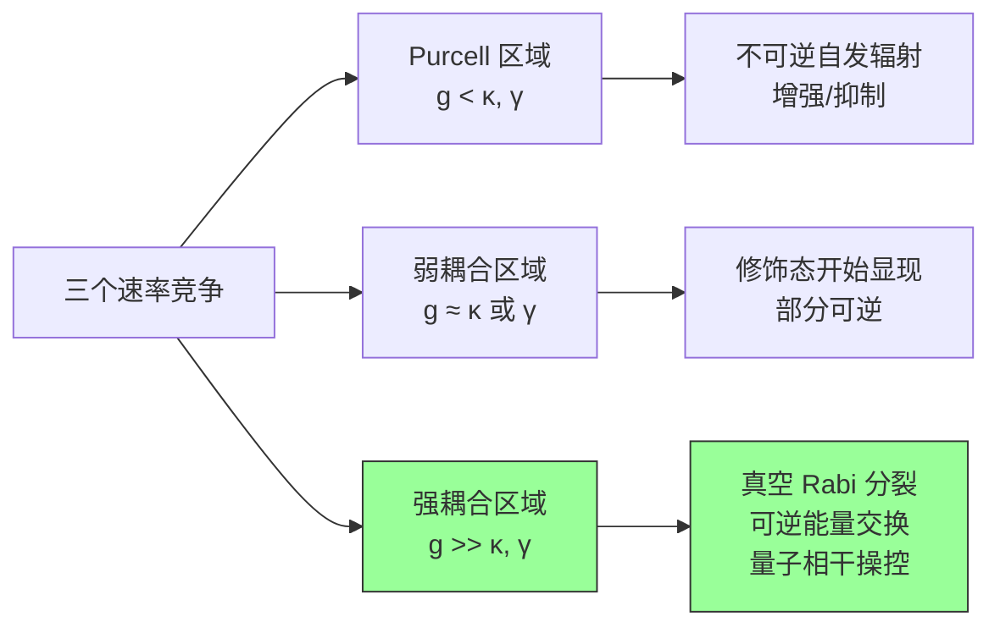
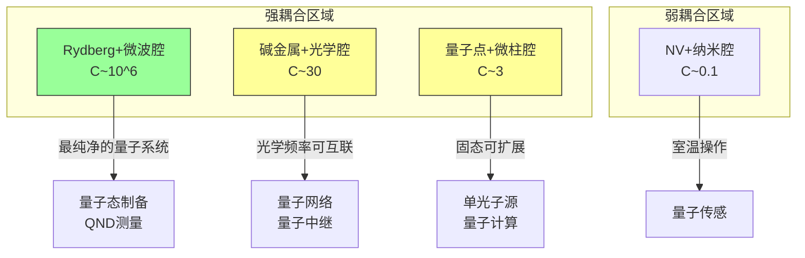

# 腔量子电动力学

## 一句话物理图像

> **腔 QED 回答一个简单问题：把一个原子关在两面镜子之间，光的量子本性会怎样放大？答案是从"原子辐射光子然后忘了它"变成"原子和光子反复交换能量，纠缠在一起"——强耦合 regime**

---

## 一、为什么需要腔？（从自由空间到谐振腔）

### 1.1 自由空间中的自发辐射

原子激发态 $|e\rangle$ 在自由空间中自发辐射，速率由 Fermi 黄金规则给出：

$$\Gamma_{\text{free}} = \frac{\omega_0^3 |d|^2}{3\pi\varepsilon_0\hbar c^3}$$

关键：原子向**连续的真空模式**辐射，一旦光子发射就无法"找回"——不可逆过程。

### 1.2 Purcell 效应（1946）

把原子放进**品质因数 $Q$、模体积 $V$ 的谐振腔**，当腔共振频率 $\omega_c \approx \omega_0$ 时：

$$\Gamma_{\text{cav}} = \frac{3}{4\pi^2} \left(\frac{\lambda^3}{V}\right) \left(\frac{Q}{1 + 4(\Delta/\kappa)^2}\right) \Gamma_{\text{free}}$$

> **Purcell 因子**：$F_P = \Gamma_{\text{cav}} / \Gamma_{\text{free}}$

| $F_P$ | 物理含义 |
|--------|---------|
| $F_P < 1$ | 腔抑制自发辐射 |
| $F_P = 1$ | 等效自由空间 |
| $F_P \gg 1$ | 腔增强自发辐射（Purcell regime） |

### 1.3 三个参数，三个区域

腔 QED 的物理由三个速率竞争决定：

| 参数 | 符号 | 含义 |
|------|------|------|
| 耦合强度 | $g$ | 单光子-Rabi 频率（原子-腔交换能量的速率） |
| 腔衰减率 | $\kappa$ | 光子从腔逃逸的速率（$\kappa = \omega_c / Q$） |
| 原子衰减率 | $\gamma$ | 原子自发辐射到腔外模式的速率 |

**三个区域**：



**强耦合判据**：$g > \kappa, \gamma$，等价于**单光子 Rabi 频率超过所有耗散速率**。

> **合作参数**（cooperativity）：
> $$C = \frac{g^2}{\kappa \gamma}$$
> - $C \ll 1$：Purcell/弱耦合
> - $C \gg 1$：强耦合

---

## 二、腔中的 Jaynes-Cummings 物理

> 精确的 JC 哈密顿量推导见 [[量子光学]] 第6节。这里只关注腔环境如何改变物理。

### 2.1 真空 Rabi 分裂（实验可观测）

强耦合下，$|g, 1\rangle$ 和 $|e, 0\rangle$ 的简并被打开：

$$E_{\pm} = \hbar\left(\omega_c \pm g\sqrt{n}\right)$$

**单光子情况**（$n=1$）：真空 Rabi 分裂 $= 2g$

$$\hbar\omega_{\pm} = \hbar\left(\frac{\omega_0 + \omega_c}{2} \pm \frac{1}{2}\sqrt{4g^2 + \delta^2}\right)$$

其中 $\delta = \omega_0 - \omega_c$ 是失谐量。

> [!tip]+ 物理直觉
> 想象原子和腔模式像两个耦合的弹簧。强耦合 = 弹簧足够硬，能量在两个弹簧之间来回振荡。真空 Rabi 分裂就是耦合系统的**正则模式频率**。

### 2.2 非线性能谱：光子阻塞效应

JC 能级**不等间距**：

$$E_{n,\pm} = n\hbar\omega_c \pm g\sqrt{n}$$

第 $n$ 个激发态的分裂是 $g\sqrt{n}$，而非 $gn$。这意味着：

- 第一个光子共振频率：$\omega_0 - g$
- 第二个光子需要频率：$\omega_0 - g(\sqrt{2} - 1) \neq \omega_0 - g$

**结果**：第一个光子进入腔后，第二个光子被"阻塞"（频率不匹配）→ **单光子源**！

$$g^{(2)}(0) \approx \left(\frac{\kappa}{4g}\right)^4 \to 0 \quad (\text{强耦合极限})$$

### 2.3 真空 Rabi 振荡的耗散

考虑耗散（$\kappa \neq 0, \gamma \neq 0$），JC 系统的主方程：

$$\dot{\rho} = -\frac{i}{\hbar}[H_{JC}, \rho] + \kappa \mathcal{D}[a]\rho + \gamma \mathcal{D}[\sigma^-]\rho$$

其中 Lindblad 超算符：

$$\mathcal{D}[\hat{O}]\rho = \hat{O}\rho\hat{O}^\dagger - \frac{1}{2}\{\hat{O}^\dagger\hat{O}, \rho\}$$

Rabi 振荡被指数衰减包络调制，相干交换持续 $\sim 1/\max(\kappa, \gamma)$ 时间。

---

## 三、Rydberg 原子腔 QED（Raimond-Haroche 方案）

> **[[cite:@Raimond2001]]** — RMP 经典综述，腔 QED 实验方案的权威参考

### 3.1 为什么选 Rydberg 原子？

Rydberg 原子 = 主量子数 $n \sim 50$ 的氢-like 原子，具有：

| 性质 | 公式 | 典型值 |
|------|------|--------|
| 原子半径 | $a_n \propto n^2$ | $\sim 125$ nm（$n=50$） |
| 电偶极矩 | $d \propto n^2$ | $\sim 1000\ e a_0$ |
| 辐射寿命 | $\tau \propto n^3$ | $\sim 30$ ms |
| 跃迁频率 | $\nu \propto 1/n^3$ | $\sim 51$ GHz（微波） |

**关键**：$d \propto n^2$ 使得耦合常数 $g \propto d/\sqrt{V}$ 被放大 ~1000 倍！

### 3.2 超导微波腔

**Fabry-Perot 腔**：两面超导铌镜，品质因数 $Q \sim 10^{10}$

$$\kappa = \frac{\omega_c}{Q} \sim 2\pi \times 1\ \text{Hz} \quad (\text{光子寿命 } \sim 0.1\ \text{s}!)$$

**模体积**：$V \sim 1\ \text{cm}^3$，对应 $V/\lambda^3 \sim 10^6$

### 3.3 实验参数（Haroche 组典型值）

| 参数 | 符号 | 值 |
|------|------|---|
| 耦合强度 | $g/2\pi$ | $\sim 200$ kHz |
| 腔衰减 | $\kappa/2\pi$ | $\sim 1$ Hz |
| 原子衰减 | $\gamma/2\pi$ | $\sim 30$ Hz |
| Rabi 周期 | $1/g$ | $\sim 5\ \mu$s |
| 光子寿命 | $1/\kappa$ | $\sim 0.1$ s |
| **合作参数** | $C = g^2/\kappa\gamma$ | $\sim 10^6$ |

> **$C \sim 10^6$！** 远超强耦合阈值。光子在腔内可以经历 $10^5$ 次 Rabi 振荡才泄漏。

### 3.4 量子非破坏测量（QND）

Haroche 组的标志性实验：**不吸收光子，就能数出腔内有几个光子**。

**原理**：
1. Rydberg 原子（$|g\rangle \to |e\rangle$ 跃迁）与腔**远离共振**（$\delta \gg g$）
2. 原子感受到腔场的 **AC Stark 频移**：
$$\Delta E_g = \frac{g^2}{\delta}\hat{n}$$
3. 频移正比于光子数 $n$，但不改变 $n$（QND！）
4. 通过 Ramsey 干涉测量原子相位 → 推算 $n$

```
Ramsey 区1 → 腔（远离共振）→ Ramsey 区2 → 态检测
     ↑                              ↑
  制备叠加态                    积累相位 φ = g²nT/δ
```

> [!important]+
> 这是量子力学中**"看而不碰"**的极致实现。2022 年诺贝尔奖的核心工作之一。

---

## 四、量子信息处理

### 4.1 量子门

**受控相位门**（原子-腔-原子）：

原子 A 经过腔，与腔场纠缠 → 原子 B 经过腔，相位取决于 A 留下的场态

| 门 | 操作 | 物理实现 |
|----|------|---------|
| 量子相位门 | $|e,0\rangle \to |e,0\rangle$, $|g,1\rangle \to -|g,1\rangle$ | $\pi$ Rabi 脉冲 |
| 量子 SWAP | $\|e,0\rangle \leftrightarrow \|g,1\rangle$ | $\pi/2$ Rabi 脉冲 |
| 量子 $\sqrt{\text{SWAP}}$ | 产生纠缠 | $gT = \pi/4$ |

### 4.2 纠缠生成

**原子-原子纠缠**（通过腔中介）：

1. 原子 A（$|g\rangle + |e\rangle$）与腔作用 $\pi/2$ Rabi 脉冲 → 原子-腔纠缠
2. 原子 B（$|g\rangle$）与腔作用 $\pi$ Rabi 脉冲 → 腔态转移到原子 B
3. 结果：$|\Psi^+\rangle = \frac{1}{\sqrt{2}}(|ge\rangle + |eg\rangle)$

**光子-光子纠缠**（连续变量）：
腔内两个模式通过原子非线性耦合 → 产生压缩纠缠态

### 4.3 量子态制备与重构

**Fock 态制备**：
1. 初始 $|g, n\rangle$ → 共振 $\pi$ 脉冲 → $|e, n-1\rangle$（确定性减少一个光子）
2. 反复操作 → 可以制备 $|0\rangle, |1\rangle, |2\rangle, \ldots$

**Wigner 函数测量**：
通过 QND 测量 + 位移算符扫描，重构腔场的 Wigner 函数

$$W(\alpha) = \frac{2}{\pi}\text{Tr}[\rho \hat{D}(\alpha)\hat{P}\hat{D}^\dagger(\alpha)]$$

其中 $\hat{P} = (-1)^{a^\dagger a}$ 是宇称算符。

---

## 五、退相干与量子测量

### 5.1 腔退相干源

| 来源 | 速率 | 物理机制 |
|------|------|---------|
| 镜面损耗 | $\kappa$ | 光子透射逃逸 |
| 热辐射 | $\bar{n}_{\text{th}}$ | $T > 0$ 时黑体光子注入 |
| 衍射损耗 | $\propto 1/Q$ | 光束几何溢出 |

**超导腔在 $T \sim 0.8$ K 时**：$\bar{n}_{\text{th}} \sim 0.05$（几乎纯真空）

### 5.2 量子 Zeno 效应

频繁测量腔内光子数 → 冻结光子态演化

**条件**：测量间隔 $\Delta t \ll 1/g$

$$P_{\text{survive}}(N\ \text{次测量}) \to 1 \quad (\Delta t \to 0)$$

### 5.3 环境诱导超选择（Einselection）

腔场与环境的耦合使某些态（"指针态"）比其他态更抗退相干

**相干态**是指针态 → 经典态涌现的量子解释

---

## 六、腔 QED 平台对比

| 平台 | $g/2\pi$ | $\kappa/2\pi$ | $\gamma/2\pi$ | $C$ | 温度 |
|------|----------|-------------|-------------|-----|------|
| **Rydberg + 微波腔** | 200 kHz | 1 Hz | 30 Hz | $10^6$ | 0.8 K |
| **碱金属 + 光学腔** | 10 MHz | 1 MHz | 3 MHz | 30 | 室温 |
| **量子点 + 微柱腔** | 10 GHz | 30 GHz | 1 GHz | 3 | 4 K |
| **NV色心 + 纳米腔** | 300 MHz | 10 GHz | 100 MHz | 0.1 | 室温 |



---

## 七、与研究方向的关系

### 7.1 近场 QED

腔 QED 中的"腔"是宏观谐振器。当腔尺寸缩小到亚波长（纳米间隙）时：

- 模体积 $V \to (\lambda/10)^3$ → $g$ 进一步增大
- 但 $\kappa$ 也急剧增大（辐射损耗）
- 对应 [[QED近场量子化文献综述]] 中的研究

### 7.2 超快电子显微术中的腔 QED

电子束经过光学腔时的能量交换（PINEM 效应）本质上也是腔 QED：

$$H_{\text{PINEM}} = \hbar g_{\text{el-ph}} (a^\dagger + a) e^{iqz}$$

区别在于"原子"被替换为"自由电子"，$g_{\text{el-ph}}$ 由电子-光子相互作用决定。

---

## 八、核心公式速查

| 公式 | 名称 | 章节 |
|------|------|------|
| $F_P = \frac{3}{4\pi^2}\frac{\lambda^3}{V}\frac{Q}{1+4\delta^2/\kappa^2}$ | Purcell 因子 | §1 |
| $C = g^2/(\kappa\gamma)$ | 合作参数 | §1 |
| $E_{\pm} = \hbar\omega_c \pm g\sqrt{n}$ | 真空 Rabi 分裂 | §2 |
| $\Delta E_g = g^2\hat{n}/\delta$ | AC Stark 频移（QND） | §3 |
| $W(\alpha) = \frac{2}{\pi}\text{Tr}[\rho D(\alpha)PD^\dagger(\alpha)]$ | Wigner 函数 | §4 |
| $\mathcal{D}[\hat{O}]\rho = \hat{O}\rho\hat{O}^\dagger - \frac{1}{2}\{\hat{O}^\dagger\hat{O},\rho\}$ | Lindblad 超算符 | §2 |

---

## 延伸阅读

- **父话题**: [[量子光学]] — 电磁场量子化、JC 模型基础推导
- **交叉话题**: [[QED近场量子化文献综述]] — 亚波长尺度的量子电动力学
- **参考文献**:
  - **[[cite:@Raimond2001]]** — "Manipulating quantum entanglement with atoms and photons in a cavity", RMP 73, 565 (2001). ~3000 citations.
  - **[[cite:@Hood2000]]** — "The Atom-Cavity Microscope", Nature
  - **[[cite:@Haroche2006]]** — "Exploring the Quantum: Atoms, Cavities, and Photons", Oxford (教科书)

---

*最后更新：2026-05-20*
*版本：v1.0*
