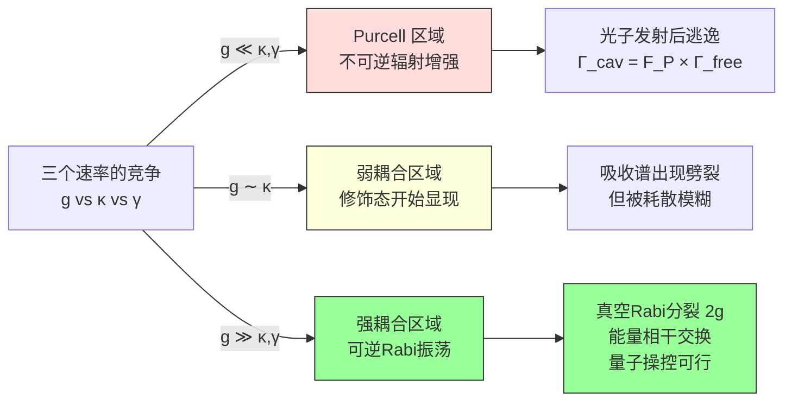
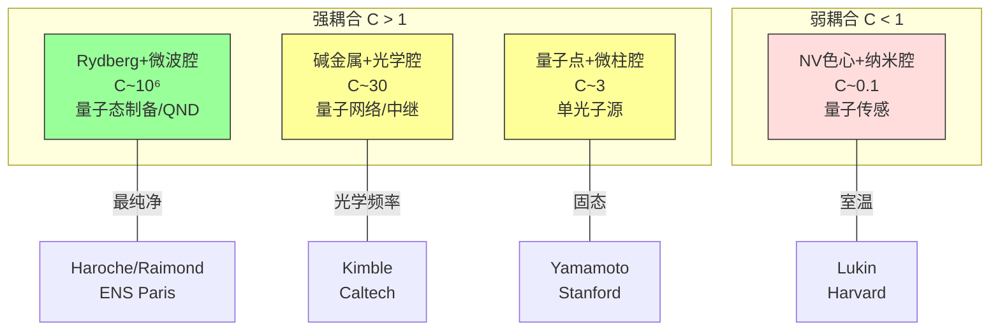

# 腔量子电动力学

## 一句话物理图像

> [!concept]+ 腔 QED 的核心问题
> **把一个原子关在两面镜子之间，光的量子本性会怎样放大？**
> 答案：从"原子辐射光子然后忘了它"变成"原子和光子反复交换能量，纠缠在一起"——强耦合 *regime*。
> 这不是量子的微小修正，而是**量子效应从微扰变成了主导物理**。

---

## 一、为什么需要腔？（从自由空间到受限空间）

### 1.1 自由空间的困境：自发辐射不可逆

原子激发态 $|e\rangle$ 在自由空间自发辐射，速率由 Fermi 黄金规则给出：

$$\Gamma_{\text{free}} = \frac{2\pi}{\hbar^2} \sum_{\mathbf{k},\lambda} |g_{\mathbf{k}\lambda}|^2 \delta(\omega_k - \omega_0)$$

对连续模式求和后：

> [!formula]+ Fermi 黄金规则 → 自发辐射率
> $$\Gamma_{\text{free}} = \frac{\omega_0^3 |d|^2}{3\pi\varepsilon_0\hbar c^3}$$
>
> **推导链**：
> 1. 起点原子-场耦合 $H_{\text{int}} = -\mathbf{d}\cdot\mathbf{E}(\mathbf{r}_0)$
> 2. 模式密度 $\rho(\omega) = \frac{\omega^2 V}{\pi^2 c^3}$（自由空间连续态密度）
> 3. Fermi 黄金规则 $\Gamma = 2\pi |g|^2 \rho(\omega_0)$
> 4. 代入 $|g|^2 = \frac{\omega_0 |d|^2}{2\hbar\varepsilon_0 V}$ → 得最终公式
>
> **关键物理**：原子向**连续的真空模式**辐射。一旦光子发射，它以光速飞离，原子无法"找回"这个光子。这就是为什么自发辐射是**不可逆的**——不是因为量子力学本身不可逆，而是因为环境（连续模式）充当了巨大的热库。

**那如果我们能控制环境呢？** 如果把连续模式变成离散模式？

> [!tip]+ 物理直觉
> 自由空间 = 大海，光子 = 水滴。原子辐射就像往大海滴水，水滴融入大海无法找回。
> 腔 = 桶，光子 = 桶里的水。水滴进桶后可以被舀回来——过程可逆了。

### 1.2 Purcell 效应（1946）：腔改变自发辐射率

**问题**：把原子放进腔后，自发辐射率怎么变？

**推导链**：

从 Fermi 黄金规则出发，腔改变了模式密度。单模腔的模式密度是离散的 $\delta$ 函数，只有当腔模频率 $\omega_c \approx \omega_0$ 时才有贡献：

$$\rho_{\text{cav}}(\omega) = \frac{2}{\pi} \frac{\kappa}{(\omega - \omega_c)^2 + \kappa^2}$$

其中 $\kappa = \omega_c / Q$ 是腔线宽（*FWHM*）。代入 Fermi 黄金规则：

$$\Gamma_{\text{cav}} = 2\pi |g|^2 \rho_{\text{cav}}(\omega_0) = 2\pi \cdot \frac{\omega_0 |d|^2}{2\hbar\varepsilon_0 V} \cdot \frac{2Q}{\pi\omega_c}$$

> [!formula]+ Purcell 因子
> $$F_P = \frac{\Gamma_{\text{cav}}}{\Gamma_{\text{free}}} = \frac{3}{4\pi^2} \left(\frac{\lambda^3}{V}\right) \left(\frac{Q}{1 + 4\delta^2/\kappa^2}\right)$$
>
> **物理解读**：
> - $\lambda^3/V$：腔体积包含几个波长立方？越小 = 模式越集中 = 增强越大
> - $Q$：光子在腔中来回反射多少次？越大 = 光子停留越久 = 增强越大
> - 分母 $1+4\delta^2/\kappa^2$：失谐 $\delta = \omega_0 - \omega_c$ 的 Lorentzian 衰减
>
> **近似条件**：
> - 原子处于腔模最大值处（$g$ 取最大值）
> - 单模近似（只考虑一个腔模，其他模式被忽略）
> - 弱激发（原子不被驱动到饱和）
>
> **何时失效**：当腔体积 $V \lesssim \lambda^3$（亚波长腔），单模近似破缺，需要全模量子化——这正是 [[QED近场量子化文献综述]] 讨论的范围。

| $F_P$ | 物理含义 | 典型系统 |
|--------|---------|---------|
| $F_P < 1$ | 腔**抑制**自发辐射 | 光子晶体缺陷腔 ($V \sim (\lambda/2)^3$, $Q \sim 100$) |
| $F_P = 1$ | 等效自由空间 | 无腔 |
| $F_P \gg 1$ | 腔**增强**自发辐射 | 微柱腔 ($F_P \sim 100$) |

> [!warning]+ 局限性
> Purcell 效应虽然能改变辐射速率，但**仍然是不可逆过程**——光子最终还是会从腔泄漏。要实现真正的可逆量子交换，需要进入强耦合区域（下一节）。

---

## 二、强耦合如何实现？（从 Purcell 到 Rabi 振荡）

### 2.1 三个速率的竞争

腔 QED 的物理由三个速率决定：

| 参数 | 符号 | 含义 | 量纲 |
|------|------|------|------|
| **耦合强度** | $g$ | 单光子 Rabi 频率——原子吸收/发射一个光子的速率 | 频率 |
| **腔衰减率** | $\kappa$ | 光子从腔逃逸的速率 | 频率 |
| **原子衰减率** | $\gamma$ | 原子自发辐射到腔外模式的速率 | 频率 |

**$g$ 的来源**（推导）：

从电偶极相互作用 $H_{\text{int}} = -\mathbf{d}\cdot\mathbf{E}$，腔内单光子电场振幅：

$$E_1 = \sqrt{\frac{\hbar\omega_c}{2\varepsilon_0 V}}$$

所以：

$$g = \frac{|d| \cdot E_1}{\hbar} = \frac{|d|}{\hbar}\sqrt{\frac{\hbar\omega_c}{2\varepsilon_0 V}}$$

> [!concept]+ 为什么 $g$ 取决于 $V$？
> 模体积 $V$ 越小 = 同一个光子的能量被压缩到更小的空间 = 电场越强 = 耦合越强。
> 这就是为什么纳米腔、等离激元腔追求极小的模体积——但代价是 $\kappa$ 也急剧增大（见第六节平台对比）。



**强耦合判据**：$g > \kappa, \gamma$

等价于：**单光子 Rabi 周期 $1/g$ 短于所有耗散时间 $1/\kappa$ 和 $1/\gamma$**

> [!formula]+ 合作参数 (*Cooperativity*)
> $$C = \frac{g^2}{\kappa\gamma}$$
>
> - $C \ll 1$：Purcell/弱耦合——耗散主导
> - $C \sim 1$：弱耦合边界——量子修饰开始显现
> - $C \gg 1$：强耦合——相干交换主导
>
> **物理含义**：一个光子在腔中的寿命 $1/\kappa$ 内，经历了 $g/\kappa$ 次 Rabi 振荡；一个原子在退激发前的寿命 $1/\gamma$ 内，经历了 $g/\gamma$ 次振荡。$C = (g/\kappa) \times (g/\gamma)$ 是这两个无量纲比的乘积。

### 2.2 Jaynes-Cummings 物理：从哈密顿量到真空 Rabi 分裂

> 完整的 JC 哪密顿量推导见 [[量子光学]] 第六章。这里追踪腔如何改变物理。

**起点**：二能级原子 + 单模腔场

$$H = \frac{\hbar\omega_0}{2}\sigma_z + \hbar\omega_c a^\dagger a + \hbar g(\sigma^+ a + \sigma^- a^\dagger)$$

在共振条件 $\omega_0 = \omega_c$ 下，$|g,1\rangle$ 和 $|e,0\rangle$ 是简并的（能量都是 $\hbar\omega_0/2 + \hbar\omega_c$）。JC 耦合项打开这个简并：

> [!formula]+ 真空 Rabi 分裂（JC 本征态）
> $$E_{n,\pm} = n\hbar\omega_c \pm g\sqrt{n}$$
>
> **推导链**：
> 1. 在 $|g,n\rangle \leftrightarrow |e,n-1\rangle$ 子空间中写 $2\times 2$ 矩阵
> 2. 非对角元 = $g\sqrt{n}$（$\sqrt{n}$ 来自 $a|n\rangle = \sqrt{n}|n-1\rangle$）
> 3. 对角化 → 本征值分裂 $= 2g\sqrt{n}$
>
> **单光子**（$n=1$）：分裂 $= 2g$
>
> **含失谐** $\delta = \omega_0 - \omega_c$：
> $$\hbar\omega_{\pm} = \hbar\left(\frac{\omega_0 + \omega_c}{2} \pm \frac{1}{2}\sqrt{4g^2 + \delta^2}\right)$$

> [!tip]+ 物理直觉
> 原子和腔模式像两个耦合的摆。$g$ = 弹簧刚度。强耦合 = 弹簧够硬，能量在两个摆之间来回振荡。
>
> 真空 Rabi 分裂 = 耦合双摆的**两个正则模式频率**之差。
>
> "$2g$" 这个数值直接可测——在透射谱上看到双峰，峰间距就是 $2g$。

### 2.3 非线性能谱 → 光子阻塞效应

JC 能级**不等间距**：第 $n$ 个激发态的分裂是 $g\sqrt{n}$，不是 $gn$。

这意味着：
- 吸收第一个光子的共振频率：$\omega_0 - g$
- 吸收第二个光子需要：$\omega_0 - g(\sqrt{2} - 1) \neq \omega_0 - g$

**第一个光子进入后，腔的共振频率偏移了——第二个光子被"阻塞"**。

> [!formula]+ 光子阻塞 → 单光子源
> 二阶关联函数：
> $$g^{(2)}(0) \approx \left(\frac{\kappa}{4g}\right)^4 \to 0 \quad (\text{强耦合极限})$$
>
> **物理**：$g^{(2)}(0) = 0$ 意味着两个光子同时到达的概率为零——完美的单光子源。
>
> **局限**：
> - 要求 $g \gg \kappa$（否则阻塞不完整）
> - 光子提取效率受限于 $\kappa$ 与收集立体角的匹配
> - 实际系统 $g^{(2)}(0) \sim 0.01\text{-}0.1$，达不到严格零
>
> **竞争方案**：量子点 ($g^{(2)}(0) \sim 0.02$) 无需强耦合即可产生单光子，但腔 QED 方案的优势在于**确定性**（按需触发）。

### 2.4 耗散下的 JC 物理：主方程

实际系统总有耗散。密度矩阵演化由 Lindblad 主方程描述：

$$\dot{\rho} = -\frac{i}{\hbar}[H_{JC}, \rho] + \kappa \mathcal{D}[a]\rho + \gamma \mathcal{D}[\sigma^-]\rho$$

其中 Lindblad 超算符：

$$\mathcal{D}[\hat{O}]\rho = \hat{O}\rho\hat{O}^\dagger - \frac{1}{2}\{\hat{O}^\dagger\hat{O}, \rho\}$$

> [!warning]+ 耗散的后果
> Rabi 振荡被指数衰减包络 $\sim e^{-(\kappa+\gamma)t/2}$ 调制。
>
> **临界合作参数**：当 $C > 1$ 时，Rabi 振荡在衰减前至少可见一个完整周期。这是实验上判断强耦合的标准——不是看公式，是看**时域振荡是否可分辨**。
>
> **该方程的局限**：假设马尔可夫近似（环境记忆时间 $\to 0$）。在超高品质腔（$Q \sim 10^{10}$）中，记忆效应可能变得重要——非马尔可夫修正见 [[cite:@Raimond2001]] §IV.B。

---

## 三、实验实现：如何达到强耦合？

### 3.1 Rydberg 原子 + 超导微波腔（Haroche 方案）

> **[[cite:@Raimond2001]]** — RMP 经典综述，~3000 引用

**为什么选 Rydberg 原子？**

主量子数 $n \sim 50$ 的 Rydberg 原子有异常大的电偶极矩：

$$d \propto n^2 a_0 e \sim 1000\ e a_0$$

因为 $g \propto d/\sqrt{V}$，这使耦合常数被放大约 1000 倍。

> [!concept]+ 为什么 $d \propto n^2$？
> Rydberg 原子的波函数扩展到 $r \propto n^2 a_0$。电偶极矩 $d \sim e \times r \propto n^2$。
> 物理图像：把电子的"轨道半径"放大了 2500 倍（$n=50$），偶极矩自然成比例增大。

**Haroche 组的实验参数**（1996-2006 系列）：

| 参数 | 符号 | 值 | 含义 |
|------|------|---|------|
| 耦合强度 | $g/2\pi$ | $\sim 200$ kHz | 原子-光子交换能量速率 |
| 腔衰减 | $\kappa/2\pi$ | $\sim 1$ Hz | 光子寿命 $\sim 0.1$ s |
| 原子衰减 | $\gamma/2\pi$ | $\sim 30$ Hz | Rydberg 态寿命 $\sim 30$ ms |
| Rabi 周期 | $1/g$ | $\sim 5\ \mu$s | 一次能量交换时间 |
| 光子寿命 | $1/\kappa$ | $\sim 0.1$ s | 光子在腔中存在时间 |
| **合作参数** | $C$ | $\sim 10^6$ | 远超强耦合阈值 |

> [!key-point]+ $C \sim 10^6$ 意味着什么？
> 光子在腔内可以经历 $g/\kappa \sim 2\times 10^5$ 次 Rabi 振荡才泄漏。
> 等价地，一个光子"来回"在原子和腔之间交换能量 $10^5$ 次——这是人类能制造的最"纯净"的量子系统之一。

**但代价是什么？**

- **微波频率**（$\sim 51$ GHz）：无法用光学手段直接探测，只能通过原子的状态间接读出
- **超低温**（$T \sim 0.8$ K）：需要液氦制冷以抑制热光子（$\bar{n}_{\text{th}} \sim 0.05$）
- **原子不固定**：Rydberg 原子飞过腔（速度 $\sim 300$ m/s），作用时间有限

### 3.2 量子非破坏测量（QND）：不吸收光子，数出有几个

Haroche 组的标志性实验：**看而不碰——量子测量的极致**。

**问题**：如何知道腔里有几个光子，但不吸收它们？

**思路**：利用远失谐的 AC Stark 效应。

> [!formula]+ QND 测量原理
>
> **推导链**：
> 1. 原子（$|g\rangle \to |e\rangle$ 跃迁）与腔**远失谐** $\delta \gg g$
> 2. 二阶微扰给出 AC Stark 频移：$\Delta E_g = \frac{g^2}{\delta}\hat{n}$
> 3. 频移正比于光子数 $n$，但不改变 $n$（能量交换是虚过程）
> 4. 原子穿过腔的时间 $T$ 内积累相位：$\phi = \frac{g^2 T}{\delta} n$
>
> **读出**：Ramsey 干涉
> ```
> Ramsey区1 → 腔（远失谐）→ Ramsey区2 → 态检测
>      ↑                              ↑
>   制备 (|g⟩+|e⟩)/√2          积累相位 φ ∝ n
> ```
>
> 通过检测原子最后处于 $|g\rangle$ 还是 $|e\rangle$ 的概率，反推相位 $\phi$，从而得到 $n$。
>
> **关键**：整个过程不吸收光子——$n$ 不变。这就是"量子非破坏"。

> [!warning]+ QND 的局限
> - 精度受限于 Ramsey 干涉的相位灵敏度（$\Delta n \sim \delta/(g^2 T)$）
> - 热光子噪声：$T > 0$ 时黑体辐射注入虚假光子
> - 需要多次原子通过才能精确确定 $n$——不是"一次测量一个数"
> - 2022 年诺贝尔奖授予 Aspect、Clauser、Zeilinger，但 Haroche 的 QND 工作同样是该领域的里程碑

### 3.3 光学腔 QED：碱金属原子 + Fabry-Perot

微波腔的局限：无法光学探测、需要低温。**光学腔**方案解决这些问题。

**Kimble 组的典型参数**（Caltech, 1990s-2000s）：

| 参数 | 值 | 对比 Haroche |
|------|---|-------------|
| $g/2\pi$ | $\sim 10$ MHz | 高 50 倍（光学频率 = 更大 $\omega$） |
| $\kappa/2\pi$ | $\sim 1$ MHz | 高 $10^6$ 倍！ |
| $\gamma/2\pi$ | $\sim 3$ MHz | 高 $10^5$ 倍 |
| $C$ | $\sim 30$ | 低 $10^4$ 倍 |
| 温度 | 室温 | 不需液氦 |

> [!tip]+ 关键 trade-off
> 光学腔 $g$ 大了，但 $\kappa$ 大了更多。合作参数 $C$ 反而下降。
>
> 原因：光学腔的 $Q$ 值远低于超导微波腔（$Q \sim 10^5$ vs $Q \sim 10^{10}$）。
>
> 但光学频率的优势在于：可以用标准光学元件（透镜、光纤）操作和传输光子——**量子网络**的基础。

---

## 四、腔 QED 能做什么？（量子信息处理）

### 4.1 量子门：原子-腔-原子

**受控相位门**：原子 A 经过腔，与腔场纠缠 → 原子 B 经过腔，相位取决于 A 留下的场态。

> [!formula]+ 核心门操作
>
> | 门 | 操作 | 物理条件 | 作用时间 |
> |----|------|---------|---------|
> | 量子相位门 | $\|e,0\rangle \to \|e,0\rangle$, $\|g,1\rangle \to -\|g,1\rangle$ | $\pi$ Rabi 脉冲 ($gT = \pi$) | $T = \pi/g$ |
> | 量子 SWAP | $\|e,0\rangle \leftrightarrow \|g,1\rangle$ | $\pi/2$ Rabi 脉冲 ($gT = \pi/2$) | $T = \pi/2g$ |
> | $\sqrt{\text{SWAP}}$ | 产生纠缠 | $gT = \pi/4$ | $T = \pi/4g$ |
>
> **局限**：
> - 门保真度受限于 $\kappa$ 和 $\gamma$：$F \approx 1 - \mathcal{O}(\kappa/g) - \mathcal{O}(\gamma/g)$
> - 实验最好保真度 $\sim 95\%$（离容错量子计算要求的 $99.9\%$ 还有距离）
> - Rydberg 方案中原子飞行导致 timing jitter

### 4.2 纠缠生成

**原子-原子纠缠**（腔作为中介）：

1. 原子 A（$(|g\rangle + |e\rangle)/\sqrt{2}$）与腔作用 $\pi/2$ Rabi 脉冲 → 原子-腔纠缠
2. 原子 B（$|g\rangle$）与腔作用 $\pi$ Rabi 脉冲 → 腔态转移到 B
3. 结果：$|\Psi^+\rangle = (|ge\rangle + |eg\rangle)/\sqrt{2}$

**光子-光子纠缠**：腔内两个模式通过原子非线性耦合 → 产生压缩纠缠态

> [!warning]+ 与固态量子计算的对比
> 腔 QED 量子门的优势：天然量子态（原子和光子）、长相干时间。
> 腔 QED 量子门的劣势：**难以扩展**——每个门需要一个原子穿过腔，无法像超导量子比特那样平面集成。
> 当前共识：腔 QED 更适合做**量子中继**（连接远距离量子节点），而非通用量子计算。

### 4.3 量子态制备与重构

**Fock 态制备**（确定性地制备 $|n\rangle$ 态）：

1. 初始 $|g, n\rangle$ → 共振 $\pi$ 脉冲 → $|e, n-1\rangle$（确定性减少一个光子）
2. 反复操作 → 可制备 $|0\rangle, |1\rangle, |2\rangle, \ldots$

**Wigner 函数测量**（重构腔场的量子态）：

$$W(\alpha) = \frac{2}{\pi}\text{Tr}[\rho \hat{D}(\alpha)\hat{P}\hat{D}^\dagger(\alpha)]$$

其中 $\hat{P} = (-1)^{a^\dagger a}$ 是宇称算符，$\hat{D}(\alpha) = e^{\alpha a^\dagger - \alpha^* a}$ 是位移算符。

> [!tip]+ Wigner 函数的物理含义
> $W(\alpha)$ 是相空间（$re\text{-}\alpha$ 平面）上的准概率分布。
> - $W > 0$：经典区域
> - $W < 0$：**非经典特征**——只有量子态才会出现负值
>
> 实验测到 $W(\alpha) < 0$ 就直接证明了腔场是非经典的（例如 Fock 态、Schrödinger 猫态）。
>
> **局限**：Wigner 函数测量需要大量重复实验（统计采样），单次实验无法重构完整的 $W$。

---

## 五、退相干从哪里来？（量子态如何死亡）

### 5.1 腔退相干源

| 来源 | 速率 | 物理机制 | 抑制方法 |
|------|------|---------|---------|
| 镜面损耗 | $\kappa$ | 光子透射/散射逃逸 | 超导镜（$Q \sim 10^{10}$） |
| 热辐射 | $\bar{n}_{\text{th}} \propto e^{-\hbar\omega/k_BT}$ | $T > 0$ 时黑体光子注入 | 液氦制冷（$T \sim 0.8$ K） |
| 衍射损耗 | $\propto 1/Q$ | 光束几何溢出腔镜 | 大曲率半径镜 |
| 原子运动 | $\sim v/L$ | 原子穿过腔的有限时间 | 冷原子/原子阱 |

**超导腔在 $T \sim 0.8$ K 时**：$\bar{n}_{\text{th}} \sim 0.05$——几乎纯真空。但即使这个"0.05 个热光子"也是退相干的终极来源。

> [!warning]+ 退相干时间的工程意义
> 量子信息操作必须在退相干时间内完成。
>
> Haroche 系统：$1/\kappa \sim 0.1$ s，足够完成 $10^4\text{-}10^5$ 次门操作。
> 光学腔系统：$1/\kappa \sim 1\ \mu$s，只有 $\sim 10$ 次门操作的时间窗口。
>
> 这就是为什么 Haroche 的 QND 实验能成功，而光学腔的量子信息实验更困难——**不是物理不同，是时间窗口不同**。

### 5.2 量子 Zeno 效应

频繁测量腔内光子数 → 冻结光子态演化。

**条件**：测量间隔 $\Delta t \ll 1/g$

$$P_{\text{survive}}(N\ \text{次测量}) \to 1 \quad (\Delta t \to 0)$$

> [!concept]+ Zeno 效应的物理
> 每次测量把态"投影"回本征态。如果测量足够频繁，系统没有时间演化——被"看"住不动了。
>
> 这不是实验技术问题，而是量子力学的基本特征。
>
> **反 Zeno 效应**：如果测量间隔 $\Delta t$ 落在某个窗口内，反而**加速**衰变。这取决于系统谱密度的形状。

### 5.3 环境诱导超选择（Einselection）

腔场与环境的耦合使某些态比其他态更抗退相干。

**相干态** $|\alpha\rangle$ 是腔场的"指针态"——它们在耗散过程中只经历阻尼振幅，不发生正交跳变。

> [!tip]+ 为什么相干态是"经典"的？
> 相干态在自由空间传播中保持相干态形态（只改变 $\alpha$），Wigner 函数始终非负，最小不确定度。
> 这就是"经典态"从量子力学中涌现的过程——不是近似，而是环境选择的结果。

---

## 六、不同平台如何选择？（工程对比）

| 平台 | $g/2\pi$ | $\kappa/2\pi$ | $\gamma/2\pi$ | $C$ | 温度 | 优势 | 劣势 |
|------|----------|-------------|-------------|-----|------|------|------|
| **Rydberg + 微波腔** | 200 kHz | 1 Hz | 30 Hz | $10^6$ | 0.8 K | 最纯净量子系统 | 微波频率、固定腔 |
| **碱金属 + 光学腔** | 10 MHz | 1 MHz | 3 MHz | 30 | 室温 | 光学互联 | $C$ 低 |
| **量子点 + 微柱腔** | 10 GHz | 30 GHz | 1 GHz | 3 | 4 K | 固态可扩展 | 非均匀展宽 |
| **NV色心 + 纳米腔** | 300 MHz | 10 GHz | 100 MHz | 0.1 | 室温 | 室温操作 | 未达强耦合 |



> [!warning]+ 平台选择的 trade-off
> **核心矛盾**：$g$ 与 $\kappa$ 通常同步增大。
>
> - Rydberg 方案：$g$ 不大但 $\kappa$ 极小 → $C$ 最大，但只能做微波
> - 纳米腔方案：$g$ 巨大（$V \to (\lambda/10)^3$）但 $\kappa$ 更大 → $C$ 反而 $< 1$
>
> **前沿方向**：用等离激元纳米腔实现 $V \sim 10^{-3}\lambda^3$，同时通过 Purcell 效应增强辐射通道以提高收集效率。但品质因数 $Q \sim 10\text{-}100$，远低于 Fabry-Perot 腔。
> 详见 [[QED近场量子化文献综述]]。

---

## 七、与我的研究方向有什么关系？

### 7.1 近场 QED：从宏观腔到亚波长间隙

腔 QED 中的"腔"是宏观谐振器（$V \sim \text{cm}^3$ 或 $\sim \lambda^3$）。当腔缩小到亚波长：

- 模体积 $V \to (\lambda/10)^3 \sim 10^{-3}\lambda^3$ → $g$ 增大 $\sim 30$ 倍
- 但 $Q$ 急剧下降（辐射损耗）→ $\kappa$ 增大 $\sim 10^3$ 倍
- **结果**：$C$ 不一定增大，反而可能减小

这打开了新问题：**亚波长尺度下，量子电动力学的基本框架是否还适用？**

- 标准量子化假设模体积 $\gg \lambda^3$，可用平面波展开
- 近场中，倏逝波和辐射模式耦合 → 需要**全电磁场量子化**
- 对应 [[QED近场量子化文献综述]] 中的核心议题

### 7.2 超快电子显微术中的腔 QED（PINEM）

电子束经过光学腔时与腔模交换能量——本质上也是腔 QED：

$$H_{\text{PINEM}} = \hbar g_{\text{el-ph}} (a^\dagger + a) e^{iqz}$$

区别在于"原子"被替换为"自由电子"。

> [!concept]+ PINEM 与腔 QED 的类比
> | 腔 QED | PINEM |
> |--------|-------|
> | 二能级原子 $|g\rangle, |e\rangle$ | 自由电子（连续能级 $E_k = \hbar^2 k^2/2m$） |
> | 偶极跃迁 $\sigma^\pm$ | 动量转移 $e^{\pm iqz}$ |
> | Rabi 振荡 $g/\Delta$ | PINEM 耦合 $|g_{\text{el-ph}}|$ |
> | 光子阻塞 | 电子能量边带 |
>
> **关键差异**：原子有分立能级（Rabi 振荡在 $|g\rangle \leftrightarrow |e\rangle$ 间振荡），电子有连续能级（能量交换后电子进入新的动量态，不可逆）。
>
> 因此 PINEM 不会出现真空 Rabi 分裂——但可以出现电子能谱的离散边带结构，间距恰好等于光子能量 $\hbar\omega$。

---

## 八、核心公式速查

| 公式 | 名称 | 近似条件 | 章节 |
|------|------|---------|------|
| $F_P = \frac{3}{4\pi^2}\frac{\lambda^3}{V}\frac{Q}{1+4\delta^2/\kappa^2}$ | Purcell 因子 | 单模近似，原子在腔模最大处 | §1 |
| $C = g^2/(\kappa\gamma)$ | 合作参数 | 马尔可夫近似 | §2 |
| $g = \frac{|d|}{\hbar}\sqrt{\frac{\hbar\omega_c}{2\varepsilon_0 V}}$ | 单光子 Rabi 频率 | 电偶极近似 | §2 |
| $E_{n,\pm} = n\hbar\omega_c \pm g\sqrt{n}$ | JC 本征能量 | 旋波近似 | §2 |
| $\hbar\omega_{\pm} = \frac{\hbar}{2}(\omega_0+\omega_c \pm \sqrt{4g^2+\delta^2})$ | 含失谐 Rabi 分裂 | 旋波近似 | §2 |
| $g^{(2)}(0) \approx (\kappa/4g)^4$ | 光子阻塞 | $g \gg \kappa$ | §2 |
| $\Delta E_g = g^2\hat{n}/\delta$ | AC Stark 频移 (QND) | $\delta \gg g$，二阶微扰 | §3 |
| $W(\alpha) = \frac{2}{\pi}\text{Tr}[\rho D(\alpha)PD^\dagger(\alpha)]$ | Wigner 函数 | 精确（无近似） | §4 |

---

## 延伸阅读

- **父话题**: [[量子光学]] — 电磁场量子化、JC 模型完整推导、Lindblad 主方程
- **交叉话题**: [[QED近场量子化文献综述]] — 亚波长尺度的量子电动力学
- **参考文献**:
  - **[[cite:@Raimond2001]]** — "Manipulating quantum entanglement with atoms and photons in a cavity", RMP 73, 565 (2001). ~3000 citations. 腔 QED 实验方案的权威参考。
  - **[[cite:@Hood2000]]** — "The Atom-Cavity Microscope", Nature 408, 1027 (2000). Kimble 组光学腔 QED 标志性实验。
  - **[[cite:@Haroche2006]]** — "Exploring the Quantum: Atoms, Cavities, and Photons", Oxford. 研究生教科书级参考。

---

*最后更新：2026-05-20*
*版本：v2.0 — 按 top-journal rubric 重写，增加推导链、批判分析、工程细节*
