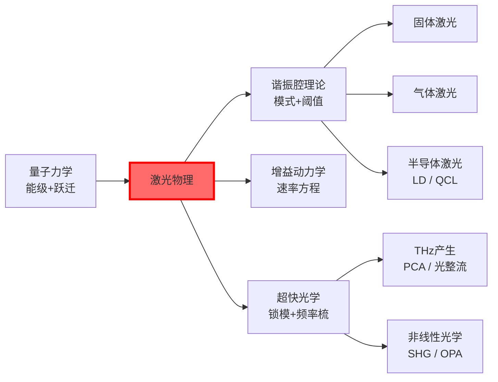
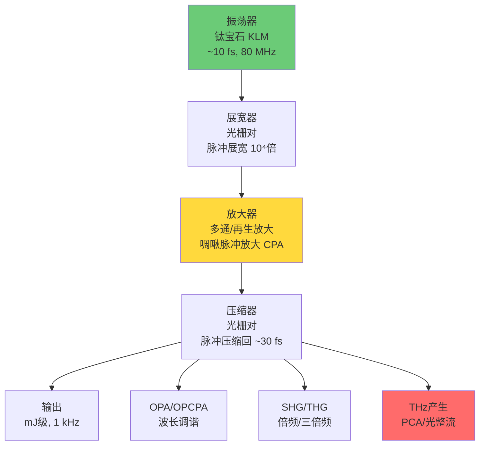

# 激光物理

## 一句话物理图像

> 激光的本质是**受激发射的正反馈放大**——光子在增益介质中被"克隆"，在谐振腔中被"回放"，直到增益与损耗精确平衡。量子力学的必然结果：$B_{12} = B_{21}$ 意味着只要有反转，光就必然被放大。

## 零、动机与全景

### 为什么光学博士必须精通激光物理？

激光不是"另一种光源"——它是连接量子力学（能级跃迁）、经典电磁学（谐振腔模式）、非线性光学（超短脉冲产生）和半导体物理（LD/LED）的**枢纽学科**。对你的研究方向（THz/超表面）尤其关键：

| 研究方向 | 激光物理关联 |
|---------|------------|
| THz时域光谱 | 飞秒激光泵浦PCA/光整流 → THz产生与探测 |
| 超表面设计 | 需要理解光场的时间相干性与空间相干性 |
| 非线性频率转换 | 超短脉冲的峰值功率驱动非线性过程 |
| QCL/THz源 | 子带间跃迁 → 级联放大 → 直接电泵浦THz |



---

## 一、爱因斯坦系数与三种跃迁

### 1.1 物理图像：为什么受激发射必然存在？

1917年，爱因斯坦从热力学出发证明：如果只有自发辐射和受激吸收，黑体辐射公式（Planck公式）无法满足热平衡条件。**受激发射不是"可有可无"的量子效应，而是热力学自洽性的必然要求**。

> [!concept] 深层图像
> 跃迁概率的对称性根源：$B_{12} = B_{21}$ 来自 Fermi golden rule 的矩阵元对称性——吸收 $|1\rangle \to |2\rangle$ 和发射 $|2\rangle \to |1\rangle$ 的电偶极矩阵元 $\langle 2|\hat{d}|1\rangle$ 是同一个复数，模方相等。这不是巧合，是时间反演对称性的体现。

### 1.2 三种跃迁

| 过程 | 速率 | 物理机制 | 光子特性 |
|------|------|---------|---------|
| 自发辐射 $A_{21}$ | $N_2 A_{21}$ | 真空涨落诱发 | 随机相位/偏振/方向 |
| 受激吸收 $B_{12}$ | $N_1 B_{12}\rho(\nu)$ | 共振吸收 | 消耗入射光子 |
| 受激发射 $B_{21}$ | $N_2 B_{21}\rho(\nu)$ | 入射光诱发 | **克隆**入射光子 |

### 1.3 爱因斯坦系数关系推导

**目标**：从热平衡条件出发，推导 $A_{21}/B_{21}$ 和 $B_{12}/B_{21}$ 的关系。

**步骤1：平衡条件**

热平衡时，向上跃迁（吸收）= 向下跃迁（自发+受激发射）：

$$N_1 B_{12}\rho(\nu) = N_2 B_{21}\rho(\nu) + N_2 A_{21}$$

**步骤2：解出能量密度**

$$\rho(\nu) = \frac{A_{21}}{B_{12}\frac{N_1}{N_2} - B_{21}}$$

**步骤3：代入 Boltzmann 分布**

$$\frac{N_2}{N_1} = \frac{g_2}{g_1}e^{-h\nu/k_BT}$$

其中 $g_1, g_2$ 是简并度。代入：

$$\rho(\nu) = \frac{A_{21}/B_{21}}{\frac{B_{12}}{B_{21}}\frac{g_1}{g_2}e^{h\nu/k_BT} - 1}$$

**步骤4：与 Planck 公式比较**

$$\rho_{Planck}(\nu) = \frac{8\pi h\nu^3}{c^3}\frac{1}{e^{h\nu/k_BT} - 1}$$

两式对比，必须满足：

$$\boxed{B_{12}g_1 = B_{21}g_2}$$

$$\boxed{\frac{A_{21}}{B_{21}} = \frac{8\pi h\nu^3}{c^3}}$$

**物理含义**：
- $B_{12}g_1 = B_{21}g_2$：考虑简并度后，吸收和受激发射概率**严格相等**
- $A_{21}/B_{21} \propto \nu^3$：频率越高，自发辐射越强 → **X射线极难实现激光**（自发辐射抢走反转粒子）

> [!example] 数值：自发辐射 vs 受激发射速率比
> He-Ne 激光（$\lambda = 632.8$ nm, $\nu = 4.74\times10^{14}$ Hz）：
> $$\frac{A_{21}}{B_{21}} = \frac{8\pi \times 6.626\times10^{-34} \times (4.74\times10^{14})^3}{(3\times10^8)^3} = 1.57\times10^{-14}\,\text{J}\cdot\text{m}^{-3}$$
> 自发辐射系数 $A_{21} \approx 6.56\times10^6\,\text{s}^{-1}$（Ne 原子 3s→2p 跃迁）
> 受激发射系数 $B_{21} = A_{21}c^3/(8\pi h\nu^3) = 4.18\times10^{20}\,\text{m}^3/(\text{J}\cdot\text{s})$
> 在热平衡辐射场 $\rho(\nu = 632.8\text{nm}, T=300\text{K})$ 中：$B_{21}\rho \approx 10^{-27}\,\text{s}^{-1}$（完全可忽略）
> **结论**：在室温黑体辐射中，可见光波段自发辐射完全主导。激光需要人工创造极强的 $\rho(\nu)$。

---

## 二、粒子数反转与泵浦机制

### 2.1 热平衡下激光不可能

Boltzmann 分布给出 $N_2/N_1 = (g_2/g_1)\exp(-h\nu/k_BT) < g_2/g_1$。对二能级系统，即使 $T \to \infty$，最多 $N_2/N_1 \to g_2/g_1$，**永远无法实现** $N_2 > N_1$（若 $g_1 = g_2$）。

**关键洞察**：必须利用**多能级系统**，通过选择性布居实现特定能级对的反转。

### 2.2 三能级系统（红宝石 Cr³⁺:Al₂O₃）

```
    ⁴F₂, ⁴F₁  ← 宽带泵浦带 (~550 nm)
        │  τ₃ ~ 50 ns（快速非辐射衰减）
        ▼
    ²E (⁴A₂)   ← 激光上能级（亚稳态，τ₂ ~ 3 ms）
        │  受激发射 λ = 694.3 nm
        ▼
    ⁴A₂         ← 基态（= 激光下能级）
```

**反转条件**：$N_2 > N_1 = N_{tot} - N_2$，即 $N_2 > N_{tot}/2$。

**困难**：必须把超过一半的粒子泵到激发态。泵浦阈值高，效率低（~0.1%）。

### 2.3 四能级系统（Nd:YAG、He-Ne）

```
    E₃ ← 泵浦带（宽带吸收）
        │  快速非辐射衰减 τ₃₂ ~ ns
        ▼
    E₂ ← 激光上能级（亚稳态，τ₂ ~ 230 μs for Nd:YAG）
        │  受激发射
        ▼
    E₁ ← 激光下能级（τ₁ ~ ns，快速排空）
        │  非辐射衰减
        ▼
    E₀ ← 基态
```

**优势**：$E_1$ 远高于 $E_0$，热平衡时 $N_1 \approx 0$。只要泵入少量粒子到 $E_2$，立即 $N_2 > N_1 \approx 0$。

**阈值反转密度对比**：

| 系统 | 阈值 $N_2 - N_1$ | 泵浦效率 |
|------|-----------------|---------|
| 三能级（红宝石） | $\sim N_{tot}/2 \approx 10^{19}\,\text{cm}^{-3}$ | ~0.1% |
| 四能级（Nd:YAG） | $\sim 10^{16}\,\text{cm}^{-3}$ | ~1-3% |

### 2.4 泵浦机制全景

| 泵浦方式 | 原理 | 典型激光器 | 效率 |
|---------|------|-----------|------|
| 光泵浦（闪光灯） | 宽带吸收 → 非辐射弛豫 | 红宝石、Nd:YAG | <1% |
| 光泵浦（LD） | 波长匹配吸收峰 | Nd:YVO₄、光纤激光 | 30-50% |
| 电泵浦（放电） | 电子碰撞激发 | He-Ne、CO₂、Ar⁺ | 0.01-20% |
| 电泵浦（注入） | pn结载流子注入 | LD、QCL | 30-70% |
| 化学泵浦 | 化学反应释放能量 | HF/DF化学激光 | 高 |
| 核泵浦 | 核裂变碎片激发 | He-Xe（实验） | 极低 |

> [!concept] 与THz研究的连接
> **THz量子级联激光器(QCL)** 采用电泵浦方式，但机制不同于普通LD：不是导带-价带复合，而是**子带间跃迁**（intersubband transition）。量子阱设计使上子带寿命 > 下子带寿命 → 子带间反转 → THz光子发射。多个量子阱级联 → 一个电子产生多个THz光子。参见[[半导体物理]]子带工程。

---

## 三、光学谐振腔

### 3.1 为什么需要谐振腔？

单程增益极小（$G\ell \sim 10^{-2}$ 量级），光一次通过增益介质产生的放大远不够。谐振腔提供**正反馈**：光在两面镜之间来回反射，多次通过增益介质，总增益 $= e^{G\ell \cdot N_{roundtrip}}$。

### 3.2 纵模条件推导

**模型**：两平行平面镜，间距 $L$，腔内折射率 $n$。

**驻波条件**：光在腔内往返一次，相位变化必须是 $2\pi$ 的整数倍（否则干涉相消）：

$$2kL = 2m\pi, \quad m = 1,2,3,\ldots$$

代入 $k = 2\pi n\nu/c$：

$$\boxed{\nu_m = m\frac{c}{2nL}, \quad m = 1,2,3,\ldots}$$

**纵模间隔**：

$$\Delta\nu = \frac{c}{2nL}$$

### 3.3 腔内光子寿命与Q因子

光在腔内每次往返损耗分数 $\delta_{rt} = \delta_{mirror} + \delta_{diff} + \delta_{abs}$，则功率衰减：

$$P(t) = P_0 e^{-t/\tau_c}$$

**腔内光子寿命**：

$$\boxed{\tau_c = \frac{2nL}{c\,\delta_{rt}}}$$

**品质因子Q**：

$$Q = 2\pi\nu\tau_c = \frac{4\pi n L \nu}{c\,\delta_{rt}}$$

**腔线宽（FWHM）**：

$$\Delta\nu_c = \frac{1}{2\pi\tau_c} = \frac{c\,\delta_{rt}}{4\pi nL}$$

> [!example] 数值：He-He 腔参数
> $L = 30$ cm，$n = 1$，$R_1 = 0.999$，$R_2 = 0.990$，内部损耗 $\alpha_i = 0.001\,\text{cm}^{-1}$：
>
> 单程损耗：$\delta = -\ln(R_1 R_2) + 2\alpha_i L = -\ln(0.989) + 0.0006 = 0.0111 + 0.0006 = 0.0117$
>
> $\tau_c = 2 \times 0.3/(3\times10^8 \times 0.0117) = 1.71\times10^{-7}\,\text{s} = 171\,\text{ns}$
>
> $Q = 2\pi \times 4.74\times10^{14} \times 1.71\times10^{-7} = 5.1\times10^8$
>
> 腔线宽 $\Delta\nu_c = 1/(2\pi \times 1.71\times10^{-7}) = 931\,\text{kHz}$
>
> 纵模间隔 $\Delta\nu = 3\times10^8/(2\times0.3) = 500\,\text{MHz}$
>
> **纵模间隔 >> 腔线宽**：每个纵模非常"锐"，Q极高。

### 3.4 稳定性条件（ABCD矩阵方法）

谐振腔稳定的条件是光束在腔内多次往返不发散，由往返ABCD矩阵的本征值给出：

$$\boxed{0 \le g_1 g_2 \le 1, \quad g_i = 1 - \frac{L}{R_i}}$$

| 腔型 | $g_1 g_2$ | 特点 |
|------|----------|------|
| 平面-平面 | $g_1 = g_2 = 1$ | 临界稳定，对准极其困难 |
| 共焦腔 | $g_1 = g_2 = 0$（$R_1 = R_2 = L$） | 稳定，模体积大 |
| 半共焦 | $g_1 = 1, g_2 = 0$ | 稳定，常用 |
| 凹-凹稳定 | $0 < g_1 g_2 < 1$ | 通用稳定腔 |
| 凹-凸不稳 | $g_1 g_2 < 0$ 或 $> 1$ | 高功率，衍射耦合输出 |

> [!concept] 不稳定腔的用途
> 高功率激光器（如CO₂、化学激光）故意用不稳定腔：模体积大→提取更多能量，衍射耦合输出→损伤阈值高。代价是输出光束为环形（annular），光束质量差。

### 3.5 横模（Hermite-Gaussian 模式）

在稳定腔中，横场分布是 Hermite-Gaussian 函数（矩形截面）或 Laguerre-Gaussian（圆形截面）：

$$TEM_{mn}: \quad I(x,y) \propto |H_m(\sqrt{2}x/w)|^2|H_n(\sqrt{2}y/w)|^2 e^{-2(x^2+y^2)/w^2}$$

基模 $TEM_{00}$ 是高斯光束（下一节）。高阶横模的光束质量因子 $M^2 > 1$：

$$M^2 = \frac{\pi w_0 \theta}{\lambda} \geq 1$$

$M^2 = 1$ 仅对 $TEM_{00}$ 成立。

---

## 四、增益、阈值与速率方程

### 4.1 增益系数推导

**出发点**：受激发射率 - 吸收率 = 净发射率。

在频率 $\nu$ 处，考虑谱线形状 $g(\nu)$（归一化 $\int g(\nu)d\nu = 1$）：

$$\frac{dI_\nu}{dz} = h\nu\left[N_2 B_{21} - N_1 B_{12}\right]g(\nu)\frac{I_\nu}{c}$$

利用 $B_{12}g_1 = B_{21}g_2$ 和发射截面 $\sigma_e(\nu) = \frac{h\nu}{c}B_{21}g(\nu)$：

$$\boxed{\frac{dI_\nu}{dz} = \sigma_e(\nu)(N_2 - \frac{g_2}{g_1}N_1) \cdot I_\nu}$$

对 $g_1 = g_2$（非简并能级）：$G(\nu) = \sigma_e(\nu)\Delta N$，其中 $\Delta N = N_2 - N_1$。

### 4.2 均匀展宽与非均匀展宽

增益谱线的形状决定激光的单模/多模行为：

| 展宽类型 | 机制 | 线型函数 | 激光行为 |
|---------|------|---------|---------|
| 均匀展宽 | 碰撞（气体）、声子（固体） | Lorentzian：$g(\nu) = \frac{\Delta\nu/2\pi}{(\nu-\nu_0)^2+(\Delta\nu/2)^2}$ | 单模振荡（模式竞争） |
| 非均匀展宽 | Doppler（气体）、晶格缺陷（固体） | Gaussian：$g(\nu) = \frac{2}{\Delta\nu}\sqrt{\frac{\ln 2}{\pi}}e^{-4\ln 2(\nu-\nu_0)^2/\Delta\nu^2}$ | 多模振荡（烧孔效应） |

> [!concept] 烧孔效应（Hole Burning）
> 非均匀展宽中，不同原子有不同的共振频率。强激光场将特定频率的原子"烧穿"（反转被消耗），形成增益曲线上的"凹陷"。其他频率的原子仍保有反转 → 多个纵模同时振荡。He-Ne 激光器（Doppler展宽 ~1.5 GHz）的典型行为。

### 4.3 增益饱和

均匀展宽下的增益饱和：

$$\boxed{G(\nu, I) = \frac{G_0(\nu)}{1 + \frac{I}{I_s}\frac{g(\nu)}{g(\nu_0)}}}$$

**饱和强度** $I_s$：增益降为中心值一半时的光强。

$$I_s = \frac{h\nu}{\sigma_e \tau_2}$$

其中 $\tau_2$ 是上能级寿命。

> [!example] 数值：Nd:YAG 增益饱和
> $\sigma_e = 6.5\times10^{-19}\,\text{cm}^2$，$\tau_2 = 230\,\mu\text{s}$，$\lambda = 1064\,\text{nm}$：
> $$I_s = \frac{hc/\lambda}{\sigma_e \tau_2} = \frac{1.87\times10^{-19}}{6.5\times10^{-23}\times2.3\times10^{-4}} = 1.25\times10^{7}\,\text{W/m}^2 = 1.25\,\text{kW/cm}^2$$
> 典型运转光强 ~$10 I_s$，增益被深度饱和。

### 4.4 四能级速率方程

设四能级系统（$N_3$ 泵浦带，$N_2$ 上能级，$N_1$ 下能级，$N_0$ 基态）：

$$\frac{dN_2}{dt} = R_p N_0 - \frac{N_2}{\tau_{21}} - (N_2 - N_1)W_{stim}$$

$$\frac{dN_1}{dt} = (N_2 - N_1)W_{stim} + \frac{N_2}{\tau_{21}} - \frac{N_1}{\tau_{10}}$$

$$\frac{d\phi}{dt} = (N_2 - N_1)W_{stim} V - \frac{\phi}{\tau_c}$$

其中 $\phi$ 是腔内光子数，$V$ 是模体积，$W_{stim} = \sigma_e c\phi/V_{mode}$。

**稳态解**（令 $d/dt = 0$，假设 $\tau_{10} \ll \tau_{21}$ → $N_1 \approx 0$）：

$$\Delta N_{ss} = \frac{R_p\tau_{21}N_{tot}}{1 + R_p\tau_{21} + I/I_s}$$

**阈值以下**（$I \to 0$）：反转随泵浦线性增长。

**阈值以上**：反转被**钳制**在阈值 $\Delta N_{th}$，多余泵浦能量转化为腔内光子。

### 4.5 阈值条件与输出功率

**阈值条件**：单程增益 = 单程损耗：

$$G_{th} \cdot 2L \geq \delta_{rt} = -\ln(R_1 R_2) + 2\alpha_i L$$

$$\boxed{\Delta N_{th} = \frac{1}{\sigma_e}\left(\alpha_i + \frac{1}{2L}\ln\frac{1}{R_1 R_2}\right)}$$

**输出功率**（阈值以上）：

$$\boxed{P_{out} = \eta_s(P_p - P_{th})}$$

**斜效率**：

$$\eta_s = \frac{T_{out}}{T_{out} + L_i}\cdot\frac{\lambda_p}{\lambda_L}\cdot\eta_q\cdot\eta_{mode}$$

| 参数 | 含义 | 典型值 |
|------|------|--------|
| $T_{out} = -\ln R_2$ | 输出耦合损耗 | 1-10% |
| $L_i$ | 内部往返损耗 | 0.5-5% |
| $\lambda_p/\lambda_L$ | Stokes因子（量子亏损） | 0.8-0.95 |
| $\eta_q$ | 量子效率 | 0.5-0.99 |
| $\eta_{mode}$ | 模匹配效率 | 0.5-0.9 |

> [!example] 数值：Nd:YAG 激光器输出功率
> $\lambda = 1064$ nm, LD泵浦 $\lambda_p = 808$ nm, $P_p = 5$ W, $P_{th} = 0.5$ W
> $\eta_q = 0.95$（4F₃/₂ → ⁴I₁₁/₂），$\eta_{mode} = 0.8$
> 输出耦合 $T_{out} = 5\%$，$L_i = 2\%$：
> $\eta_s = \frac{5}{5+2}\times\frac{808}{1064}\times0.95\times0.8 = 0.714\times0.759\times0.76 = 0.412$
> $P_{out} = 0.412 \times (5 - 0.5) = 1.85$ W（光-光效率 37%）

---

## 五、高斯光束

### 5.1 从波动方程到高斯光束

高斯光束是**傍轴波动方程**的最低阶解。从 Helmholtz 方程出发，傍轴近似（$\partial^2 \tilde{E}/\partial z^2 \ll k\partial\tilde{E}/\partial z$）：

$$\nabla_\perp^2 \tilde{E} + 2ik\frac{\partial\tilde{E}}{\partial z} = 0$$

试解 $\tilde{E}(r,z) = A(z)\exp[-ikr^2/(2q(z))]$，代入得：

$$\frac{dA}{dz} = -\frac{iA}{q}, \quad \frac{dq}{dz} = 1$$

解出 $q(z) = z + iz_R$，分离实部和虚部：

$$\boxed{E(r,z) = E_0\frac{w_0}{w(z)}\exp\!\left[-\frac{r^2}{w^2(z)}\right]\exp\!\left[-i\!\left(kz - \psi(z) + \frac{kr^2}{2R(z)}\right)\right]}$$

| 参数 | 定义 | 表达式 |
|------|------|--------|
| 束腰 $w_0$ | 最小光斑半径 | — |
| 光斑半径 $w(z)$ | 场强降至 $1/e$ | $w_0\sqrt{1+(z/z_R)^2}$ |
| **Rayleigh长度** $z_R$ | $w = \sqrt{2}w_0$ 的距离 | $\pi w_0^2 n/\lambda$ |
| 曲率半径 $R(z)$ | 等相面曲率 | $z[1+(z_R/z)^2]$ |
| **Gouy相位** $\psi(z)$ | 额外相移 | $\arctan(z/z_R)$ |
| 远场发散角 $\theta$ | $z \gg z_R$ 时 $w/z$ | $\lambda/(\pi w_0 n)$ |

### 5.2 Gouy相位的物理含义

高斯光束通过焦点时累积 $\pi$ 的额外相位（从 $-\pi/2$ 到 $+\pi/2$）。这不是数学约定，有**可观测量效应**：

- 模式间隔修正：$\nu_{mnp} = \frac{c}{2L}\left[p + \frac{m+n+1}{\pi}\arccos\sqrt{g_1 g_2}\right]$
- 频率梳的载波-包络相位（CEP）直接关联 Gouy 相位

### 5.3 ABCD定律

高斯光束用复参数 $q(z) = z + iz_R$ 描述。通过ABCD矩阵 $\begin{pmatrix}A&B\\C&D\end{pmatrix}$ 后：

$$\boxed{q' = \frac{Aq + B}{Cq + D}}$$

**常用ABCD矩阵**：

| 光学元件 | ABCD矩阵 |
|---------|---------|
| 自由空间（距离$d$） | $\begin{pmatrix}1&d\\0&1\end{pmatrix}$ |
| 薄透镜（焦距$f$） | $\begin{pmatrix}1&0\\-1/f&1\end{pmatrix}$ |
| 球面反射镜（曲率$R$） | $\begin{pmatrix}1&0\\-2/R&1\end{pmatrix}$ |
| 介质界面（$n_1\to n_2$） | $\begin{pmatrix}1&0\\0&n_1/n_2\end{pmatrix}$ |

> [!example] 数值：透镜聚焦高斯光束
> 钛宝石激光 $\lambda = 800$ nm，$w_0 = 1$ mm，聚焦透镜 $f = 50$ mm：
>
> $z_R = \pi(10^{-3})^2/(800\times10^{-9}) = 3.93$ m
>
> 新束腰 $w_0' \approx f\theta = f\lambda/(\pi w_0) = 0.05 \times 800\times10^{-9}/(\pi\times10^{-3}) = 12.7\,\mu\text{m}$
>
> 新 $z_R' = \pi(12.7\times10^{-6})^2/(800\times10^{-9}) = 0.63\,\text{mm}$
>
> **焦点处光斑面积缩小 $10^{-4}$ 倍，功率密度提升 $10^4$ 倍**——这就是超短脉冲能驱动非线性过程的几何原因。

### 5.4 高斯光束匹配进入谐振腔

激光器要高效运转，泵浦光束必须与腔模匹配。匹配条件：入射光束的 $q$ 参数经腔镜变换后等于腔内本征模的 $q$。

实际操作：用两个透镜组成的**望远镜系统**调节入射光束的 $w_0$ 和 $R$，使其匹配腔的 $TEM_{00}$ 模。

---

## 六、锁模与超短脉冲

### 6.1 从自由运转到锁模

自由运转多模激光器输出：$N$ 个纵模独立振荡，相位随机 → 输出强度随机涨落（时间平均为常数）。

锁模：强制所有纵模相位锁定 $\phi_n = \phi_0$ → 输出变为等间隔超短脉冲序列。

### 6.2 锁模数学推导

$N$ 个等间距纵模，频率 $\nu_n = \nu_0 + n\Delta\nu$，锁定相位 $\phi_n = \phi_0$：

$$E(t) = \sum_{n=0}^{N-1} E_0 e^{i(2\pi\nu_n t + \phi_0)}$$

几何级数求和：

$$E(t) = E_0 e^{i\phi_0}e^{i2\pi\nu_0 t}\cdot\frac{\sin(N\pi\Delta\nu t)}{\sin(\pi\Delta\nu t)}$$

总强度：

$$\boxed{I(t) = I_0\left[\frac{\sin(N\pi\Delta\nu t)}{\sin(\pi\Delta\nu t)}\right]^2}$$

**关键参数**：

| 参数 | 表达式 | 物理含义 |
|------|--------|---------|
| 脉冲重复频率 $f_{rep}$ | $\Delta\nu = c/(2nL)$ | 等于纵模间隔 |
| 脉冲宽度 $\tau_p$ | $\approx 1/(N\Delta\nu) = 1/\Delta\nu_{gain}$ | 增益带宽的倒数 |
| 峰值功率增强 | $N \times \langle P\rangle$ | $N$ 个模的能量集中在短脉冲内 |
| 占空比 | $\tau_p f_{rep} \approx 1/N$ | 脉冲极窄 |

### 6.3 傅里叶变换极限

$$\tau_p \cdot \Delta\nu_{pulse} \geq K$$

其中 $K$ 取决于脉冲形状（Gaussian: $K = 0.441$, sech²: $K = 0.315$）。

**增益带宽决定最短脉冲**：

| 增益介质 | 增益带宽 | 变换极限脉宽 | 典型输出 |
|---------|---------|------------|---------|
| Nd:YAG | ~0.5 THz | ~2 ps | 10-30 ps |
| Nd:YVO₄ | ~0.3 THz | ~3 ps | 10-50 ps |
| Nd:glass | ~5 THz | ~200 fs | 100-500 fs |
| Yb:KGW | ~3 THz | ~300 fs | 200-500 fs |
| Er:fiber | ~5 THz | ~200 fs | 50-200 fs |
| **钛宝石** | **~100 THz** | **~10 fs** | **5-100 fs** |

### 6.4 锁模方法

| 方法 | 机制 | 脉宽 | 优缺点 |
|------|------|------|--------|
| 主动锁模 | AM/FM调制器 @ $f_{rep}$ | 10-100 ps | 稳定，但受调制器带宽限制 |
| **SESAM** | 可饱和吸收：强脉冲→吸收饱和→低损耗 | 100 fs-10 ps | 简单可靠，自启动 |
| **KLM** | Kerr透镜：$n = n_0+n_2I$ + 光阑 | **<10 fs** | 最短脉冲，但难自启动 |
| 色散管理 | GDD补偿（棱镜对/啁啾镜） | 配合KLM | 宽带锁模必需 |

> [!concept] Kerr透镜锁模（KLM）的物理机制
> 强光在介质中引起自相位调制（SPM）：$n = n_0 + n_2 I$。脉冲中心光强大 → 折射率高 → 等价于一个动态聚焦透镜。配合光阑（硬光阑或软光阑），高峰值功率脉冲通过效率高，低功率背景被阻挡 → **正反馈**：脉冲越短越强 → 越容易通过 → 变得更短更强。
>
> 配合色散补偿（棱镜对/chirped mirrors补偿 $n_2$ 引入的啁啾），脉宽可以压缩到几个光学周期。

### 6.5 调Q（Q-Switching）——纳秒脉冲

与锁模不同，调Q产生**纳秒级能量脉冲**（非飞秒）。

**原理**：初始高Q腔 → 积累反转 → 突然切换到低Q → 全部反转能量在短时间释放。

$$\tau_{pulse} \sim \frac{2L/c}{\delta_{out}} \approx \frac{\tau_{rt}}{T_{out}}$$

典型脉宽 1-100 ns，峰值功率 MW-GW。

> [!tip] 调Q vs 锁模
> | 参数 | 调Q | 锁模 |
> |------|------|------|
> | 脉宽 | 1-100 ns | 10 fs - 100 ps |
> | 峰值功率 | MW - GW | kW - MW（但峰值强度高） |
> | 能量/脉冲 | mJ - J | nJ - μJ |
> | 用途 | 加工、测距 | 超快光谱、频率转换 |

### 6.6 Schawlow-Townes 激光线宽

量子极限下的连续激光线宽：

$$\boxed{\Delta\nu_{laser} = \frac{2h\nu(\Delta\nu_c)^2}{P_{out}}\frac{N_{sp}}{N_{stim}}}$$

简化（$N_{sp}/N_{stim} \approx 1$）：

$$\Delta\nu_{laser} = \frac{2h\nu(\Delta\nu_c)^2}{P_{out}}$$

**含义**：输出功率越高 → 自发辐射占比越小 → 线宽越窄。

> [!example] 数值：He-Ne 线宽极限
> $P_{out} = 1$ mW, $\Delta\nu_c = 931$ kHz：
> $\Delta\nu_{laser} = \frac{2\times3.14\times10^{-19}\times(9.31\times10^5)^2}{10^{-3}} \approx 5.5\times10^{-4}$ Hz
>
> 实际受技术噪声限制 ~1 MHz。但**光学频率梳**可实现 Hz 级线宽。

---

## 七、激光类型全景

### 7.1 按增益介质分类

| 类型 | 代表介质 | 波长范围 | 输出模式 | 典型应用 |
|------|---------|---------|---------|---------|
| **固体激光** | Nd:YAG, Yb:YAG, 钛宝石 | 0.7-2.1 μm | CW / 脉冲 | 加工、科研、医疗 |
| **气体激光** | He-Ne, CO₂, Ar⁺, Excimer | UV-IR | CW / 脉冲 | 准直、加工、光刻 |
| **半导体激光（LD）** | GaAs, InP, GaN | 0.4-2 μm | CW / 调制 | 通信、泵浦、显示 |
| **光纤激光** | Yb/Er/Tm掺杂光纤 | 1.0-2.0 μm | CW / 脉冲 | 工业、通信、传感 |
| **化学激光** | HF, DF, COIL | 中IR | CW / 脉冲 | 军事、定向能 |
| **自由电子激光（FEL）** | 相对论电子束 | X射线-THz | 脉冲 | 大科学装置 |

### 7.2 超快激光系统（对你的研究最重要）



**啁啾脉冲放大（CPA）**——2018年诺贝尔物理奖（Mourou & Strickland）：

1. 振荡器产生 fs 种子脉冲
2. 展宽器（光栅对）引入正色散 → 脉冲展宽到 ns → 峰值功率降低 $10^4$ 倍
3. 放大器（Ti:sapphire 等）注入能量 → 峰值功率仍在材料损伤阈值以下
4. 压缩器（光栅对）补偿色散 → 脉冲压缩回 fs → 峰值功率达到 TW-PW

> [!concept] 为什么 CPA 是超快激光的革命？
> 直接放大 fs 脉冲 → 峰值功率 GW/cm² → 瞬间烧毁光学元件。CPA "时间换空间"：先展宽、再放大、后压缩。当前最先进的 Ti:sapphire CPA 系统可达 ~20 fs、数 J/脉冲、PW峰值功率。

---

## 八、太赫兹产生方法全景

> [!important] 与你研究方向的直接连接
> THz波段（0.1-10 THz）的激光器发展远落后于光学波段。原因：爱因斯坦系数比 $A/B \propto \nu^3$，THz频率低 → 自发辐射弱 → 反转容易；但室温下 $k_BT \gg h\nu_{THz}$ → 热激发严重破坏反转。下表对比主要THz产生方法。

| 方法 | 原理 | 频率范围 | 平均功率 | 脉冲/连续 | 优缺点 |
|------|------|---------|---------|----------|--------|
| **光导天线（PCA）** | 飞秒激光激发光电流 → THz脉冲辐射 | 0.1-5 THz | μW-mW | 脉冲 | 宽带，但需超快激光，功率低 |
| **光整流** | $\chi^{(2)}$ 非线性 → 差频产生THz | 0.5-10 THz | μW | 脉冲 | 宽带可调，需要相位匹配 |
| **THz-QCL** | 子带间级联跃迁 | 1-5 THz | mW级 | 连续/脉冲 | 紧凑，但需低温（<200K） |
| **光电混频** | 两束CW激光差频 → THz | 0.05-2 THz | μW | 连续 | 频率精确可调，功率极低 |
| **光学参量（TPO）** | MgO:LiNbO₃中参量振荡 | 0.5-3 THz | μW | 脉冲 | 室温运转，体积大 |
| **气体激光（Far-IR）** | 分子转动跃迁 | 0.3-10 THz | mW-W | 连续 | 固定频率，笨重 |
| **电子加速器（FEL）** | 相对论电子摆动辐射 | 0.1-100 THz | kW | 脉冲 | 极高功率，设施级 |
| **空气等离子体** | 飞秒激光击穿空气 → THz | 0.1-20 THz | μW | 脉冲 | 超宽带，需强激光 |

**THz产生效率的瓶颈**：Manley-Rowe关系限制非线性转换效率 $\eta \propto \nu_{THz}/\nu_{pump}$（量子效率），THz频率仅为泵浦光频率的 ~1/100 → 即使完美相位匹配，单光子效率上限也很低。

---

## 九、激光应用全景

| 应用领域 | 所需激光特性 | 代表激光器 |
|---------|------------|-----------|
| 工业加工 | 高功率、高峰值 | CO₂, 光纤, Nd:YAG |
| 光通信 | 高速调制、窄线宽 | DFB-LD, 外腔LD |
| 医疗 | 特定吸收波长 | Excimer(眼科), Ho:YAG(碎石) |
| 计量/频率梳 | 超窄线宽、频率稳定 | 锁模飞秒激光 |
| 量子信息 | 单光子/纠缠光子 | 参量下转换, QD |
| 光谱分析 | 宽可调谐 | OPA, 钛宝石, QCL |
| THz光谱 | 鷹秒泵浦 | 钛宝石CPA → PCA |
| 显示 | 蓝/绿/红 | GaN(蓝), InGaN(绿), AlGaInP(红) |

---

## 十、知识树

```mermaid
graph TD
    A["激光物理"] --> B["爱因斯坦系数<br/>A/B关系推导"]
    A --> C["粒子数反转<br/>三/四能级系统"]
    A --> D["光学谐振腔<br/>纵模·横模·稳定性"]
    A --> E["增益与速率方程<br/>阈值·饱和·功率"]
    A --> F["高斯光束<br/>ABCD定律·聚焦"]
    A --> G["锁模与超短脉冲<br/>CPA·频率梳"]
    A --> H["激光类型"]
    A --> I["THz产生方法"]

    B --> B1["B₁₂=B₂₁<br/>热力学必然性"]
    B --> B2["A/B ∝ ν³<br/>高频激光困难"]

    C --> C1["泵浦机制<br/>光/电/化学"]
    C --> C2["子带间跃迁<br/>QCL"]

    D --> D1["腔Q·τc"]
    D --> D2["g参数稳定性"]
    D --> D3["Hermite-Gaussian模式"]

    E --> E1["均匀/非均匀展宽"]
    E --> E2["烧孔效应"]
    E --> E3["斜效率·量子亏损"]

    F --> F1["Rayleigh长度·Gouy相位"]
    F --> F2["模匹配"]

    G --> G1["调Q: ns脉冲"]
    G --> G2["锁模: fs脉冲"]
    G --> G3["Schawlow-Townes线宽"]

    H --> H1["固体/气体/光纤"]
    H --> H2["半导体LD"]
    H --> H3["超快CPA系统"]

    I --> I1["PCA / 光整流"]
    I --> I2["THz-QCL"]
    I --> I3["空气等离子体"]

    style A fill:#FF6B6B,stroke:#FF0000,stroke-width:3px
    style G fill:#4D96FF,stroke:#0000CD
    style I fill:#FFD93D,stroke:#FF8C00
    style F fill:#6BCB77,stroke:#228B22
```



---

## 十一、延伸阅读

- [[电磁场理论基础]] — 波动方程与边界条件是谐振腔理论的数学基础
- [[量子光学]] — 场量子化给出 Schawlow-Townes 线宽的量子推导
- [[波动光学]] — 干涉/衍射是谐振腔模式选择和锁模的物理基础
- [[半导体物理]] — LD和QCL的能带/子带工程
- [[超表面与超材料]] — 超构表面对激光光束的波前调控

---

## 参考文献

1. **[[cite:@Svelto2010]]** — "Principles of Lasers" (5th ed.), 激光物理标准教材，速率方程与谐振腔理论最清晰
2. **[[cite:@Siegman1986]]** — "Lasers", 最全面的激光物理参考书，高斯光束与谐振腔模式理论的权威
3. **[[cite:@Saleh2007]]** — "Fundamentals of Photonics" (2nd ed.), 高斯光束ABCD定律、光波导
4. **[[cite:@Haus2000]]** — "Mode-locking of Lasers", 锁模技术理论综述
5. **[[cite:@Diels2006]]** — "Ultrashort Laser Pulse Phenomena", 超快光学与CPA技术
6. **[[cite:@Tonouchi2007]]** — "Cutting-edge terahertz technology", THz产生方法综述
7. **[[cite:@Köhler2002]]** — "Terahertz quantum-cascade laser", 首个THz-QCL实验报告, Nature 2002
