# 激光物理

## 一句话物理图像

> 激光是"光的克隆工厂"——通过受激发射，让每一个新光子都与"母光子"完全一样：相同频率、相同方向、相同偏振

## 一、为什么需要激光？

### 1.1 普通光源的问题

| 光源 | 特点 | 问题 |
|------|------|------|
| 白炽灯 | 各种频率混杂 | 不相干 |
| LED | 频率较纯，但方向混乱 | 空间不相干 |
| **激光** | 频率纯、方向一致、偏振统一 | **完美光源** |

### 1.2 激光 vs 普通光

| 性质 | 普通光 | 激光 |
|------|--------|------|
| **相干长度** | μm 级 | km 级 |
| **方向性** | 向各方向发射 | 近乎平行光束 |
| **亮度** | 低 | 极高（能量汇聚） |
| **光谱宽度** | 宽 | 极窄 |

> [!concept]+ 物理图像：军队 vs 乌合之众
> 普通光像一群随意走动的人，方向杂乱。激光像一支纪律严明的军队，步伐一致（相干）、排成方阵（方向性）、目标明确（单色性）。

---

## 二、爱因斯坦的洞察：三种跃迁

### 2.1 背景：量子力学建立前的困惑

1917年，爱因斯坦尚未见到薛定谔方程，却凭物理直觉预言了激光的物理基础。

**问题**：为什么某些物质能发出"完美"的光子？

### 2.2 三种光子-原子相互作用

**（1）自发辐射（Spontaneous Emission）**

$$|E_2\rangle \xrightarrow{\text{随机}} |E_1\rangle + \gamma_{\text{spont}}$$

- 激发态原子自发跃迁，发射光子
- 光子能量：$h\nu = E_2 - E_1$
- 方向、偏振、相位**完全随机**
- 速率：$W_{\text{spont}} = A_{21}$（爱因斯坦A系数）

> [!concept]+ 物理图像：随机烟花
> 想象庆祝活动中随机燃放的烟花——每个原子"爆"一次，没有任何协调。这种"各自为战"的光是非相干的。

**（2）受激吸收（Stimulated Absorption）**

$$|E_1\rangle + \gamma \xrightarrow{\text{共振}} |E_2\rangle$$

- 基态原子吸收光子，跃迁到激发态
- 要求：光子能量 = 原子能级差
- 速率：$W_{\text{abs}} = B_{12} \rho(\nu)$

> [!concept]+ 物理图像：共振传递
> 想象荡秋千：推的人（光子）节奏必须与秋千（原子）一致，才能有效传递能量。

**（3）受激发射（Stimulated Emission）** ← 激光的核心！

$$|E_2\rangle + \gamma \xrightarrow{\text{感应}} |E_1\rangle + 2\gamma$$

- 入射光子"诱发"激发态原子发射一个光子
- **新光子与原光子完全相同**：频率、相位、偏振、传播方向
- 速率：$W_{\text{stim}} = B_{21} \rho(\nu)$

> [!concept]+ 物理图像：光的克隆
> 就像多米诺骨牌——第一张倒下（自发辐射），碰撞第二张（受激发射），第二张以完全相同的姿态撞倒第三张，以此类推。一张牌可以"克隆"出完全相同的连锁反应。

### 2.3 爱因斯坦系数详细推导

在热平衡下，爱因斯坦证明三种跃迁的概率系数满足关系：

$$B_{12} = B_{21} \equiv B$$

且：

$$\frac{A_{21}}{B_{21}} = \frac{8\pi h \nu^3}{c^3}$$

**推导思路**：

1. 设频率为 $\nu$ 的光场能量密度 $\rho(\nu)$
2. 平衡时：吸收率 = 发射率
3. $N_1 B \rho(\nu) = N_2 B \rho(\nu) + N_2 A_{21}$
4. 解得：$N_2/N_1 = \frac{B\rho}{A_{21} + B\rho}$
5. 与玻尔兹曼分布比较：$N_2/N_1 = e^{-(E_2-E_1)/kT}$
6. 由此推出上述关系

---

## 三、粒子数反转——激光的前提

### 3.1 热平衡的困难

**问题**：在热平衡下，大多数原子处于基态（$N_1 > N_2$）。这意味着**受激吸收 > 受激发射**，光被净吸收而非放大。

**解决方案**：打破热平衡，创造**粒子数反转**（$N_2 > N_1$）。

> [!concept]+ 物理图像：水库比喻
> 正常情况（热平衡）：上游水位低（基态原子多），下游水位高（激发态原子少），水往低处流（吸收）。
> 粒子数反转：抽水机把水抽到上游（水库），上游水位高于下游（激发态原子多于基态），水可以往下流（受激发射大于吸收）。

### 3.2 如何实现粒子数反转？

需要**抽运（Pumping）**——向系统输入能量：

| 抽运方式 | 原理 | 例子 |
|----------|------|------|
| **光泵浦** | 用强光把电子从基态"抽"到激发态 | 红宝石激光器 |
| **电泵浦** | 用电流碰撞把电子"撞"到激发态 | 半导体激光器 |
| **化学泵浦** | 化学反应释放能量抽运 | 化学激光器 |

### 3.3 三能级 vs 四能级系统

**三能级系统**（如红宝石激光器）：

```
能级 E₃ ← 光泵浦
        ↓ 自发衰减
能级 E₂ ← 激光上能级（亚稳态，寿命长）
        ↓ 受激发射
能级 E₁ ← 激光下能级（也是基态）
        ↓ 
能级 E₀ ← 基态
```

**问题**：需要把超过一半的原子抽到 E₂ 才能实现反转（因为 E₁ 是基态）

**四能级系统**（如 He-Ne 激光器）：

```
能级 E₄ ← 抽运
        ↓
能级 E₃ ← 激光上能级
        ↓ 受激发射
能级 E₂ ← 激光下能级（很快衰减到 E₁）
        ↓
能级 E₁ ← 中间能级
        ↓
能级 E₀ ← 基态
```

**优势**：激光下能级 E₁ 接近基态，原子很容易从这里衰减回基态，所以更容易实现反转。

> [!tip]+ 实用价值
> He-Ne 激光器（632.8 nm）是四能级系统，效率比红宝石高三能级系统高很多。

---

## 四、光的放大与增益

### 4.1 增益介质

当粒子数反转的介质中通过光时：

- 受激发射产生的新光子与原光子相同
- 每一个新光子又引发更多受激发射
- 光强指数增长：$I(z) = I_0 e^{Gz}$

其中 $G$ 是**增益系数**。

### 4.2 增益系数公式（详细推导）

**出发点**：受激发射速率 - 吸收速率

$$R_{\text{stim}} - R_{\text{abs}} = (N_2 B_{21} - N_1 B_{12}) \rho(\nu)$$

由于 $B_{21} = B_{12} = B$：

$$= B \rho(\nu) (N_2 - N_1)$$

**光强变化**：

$$\frac{dI}{dz} = h\nu (N_2 - N_1) B \rho(\nu)$$

而 $\rho(\nu) = \frac{I}{c}$（能量密度与光强关系），$B = \frac{\sigma}{h\nu}$（截面形式）

最终得到：

$$\frac{dI}{dz} = \sigma (N_2 - N_1) I$$

**增益系数**：

$$G = \sigma (N_2 - N_1)$$

### 4.3 增益饱和

**问题**：当光强非常大时，增益会"饱和"——不再指数增长。

**物理原因**：强光把大量原子从 E₂ 抽到 E₁，反转程度降低。

**饱和增益公式**：

$$G(I) = \frac{G_0}{1 + I/I_s}$$

其中 $I_s$ 是饱和强度，$G_0$ 是小信号增益。

> [!example]+ 日常理解
> 就像海绵吸水：一开始干海绵（高增益）吸水很快（光放大强）。当海绵湿了（增益饱和），吸水速度变慢。

---

## 五、光学谐振腔——激光的心脏

### 5.1 为什么需要谐振腔？

仅有增益介质，光会向各个方向传播（自发辐射主导）。需要**正反馈**让光来回反射，多次通过增益介质。

**解决方案**：两面镜子组成谐振腔。

```
一面高反射镜 (R ≈ 99.9%)
        ↓
    [增益介质]
        ↓
一面部分透射镜 (R ≈ 98%) → 激光输出
```

### 5.2 纵模条件

光在两镜之间来回传播时，只有形成**驻波**的模式才能稳定存在：

$$L = m \frac{\lambda}{2}, \quad m = 1, 2, 3, \ldots$$

其中 $L$ 是腔长，$\lambda$ 是波长。

**推导**：
- 光从镜子反射，相位反转
- 往返光程 $2L$ 必须是波长的整数倍才能相长干涉
- 所以 $2L = m\lambda$，即 $L = m\lambda/2$

### 5.3 纵模间隔

相邻纵模的频率差：

$$\Delta\nu = \frac{c}{2L}$$

> [!example]+ 计算
> He-Ne 激光器，腔长 $L = 30$ cm：
> $$\Delta\nu = \frac{3 \times 10^8}{2 \times 0.3} = 500 \text{ MHz}$$
>
> 而 He-Ne 的自然线宽约 1.5 GHz，所以大约有 3 个纵模同时振荡。

### 5.4 横模（TEM模式）

除了纵向，还有横向电磁场分布：

$$TEM_{mnp}$$

- $m, n$：横向模式指数
- $p$：纵向模式指数
- 基横模 $TEM_{00}$：高斯光束，质量最高

> [!concept]+ 横模图像
> $TEM_{00}$ 就像一个完美的圆形光斑。$TEM_{01}$ 像条状光斑。横模越复杂，光束质量越差。

---

## 六、激光器类型

### 6.1 按增益介质分类

| 类型 | 介质 | 波长 | 特点 |
|------|------|------|------|
| **固体激光** | 红宝石 (Al₂O₃:Cr³⁺) | 694 nm | 三能级，脉冲 |
| **气体激光** | He-Ne | 632.8 nm | 连续，低功率 |
| **气体激光** | CO₂ | 10.6 μm | 连续，高功率 |
| **半导体激光** | GaAs | 800-900 nm | 小型，高效 |
| **光纤激光** | 掺铒光纤 | 1550 nm | 通信波段 |

### 6.2 半导体激光器（LD）

**工作原理**：电注入产生电子-空穴复合，发光。

```
P型半导体 ──────|────── N型半导体
                 ↓
            电子-空穴复合区
                 ↓
            产生光子 (hν ≈ Eg)
```

**特点**：
- 体积小（mm级）
- 效率高（>50%）
- 直接调制（通信用）
- 需要散热

> [!example]+ CD/DVD播放器中的激光
> CD播放器用GaAs半导体激光，780 nm。DVD用650 nm（红色）。蓝光DVD用GaN，405 nm。

### 6.3 气体激光器（He-Ne）

**能级结构**：
1. 电子碰撞把 He 激发到亚稳态
2. He 与 Ne 碰撞，能量转移
3. Ne 产生受激发射（632.8 nm）
4. Ne 快速衰减到基态

**特点**：
- 单纵模输出
- 线宽极窄（kHz级）
- 相干长度可达公里

---

## 七、激光特性与应用

### 7.1 激光的四大特性

| 特性 | 含义 | 应用 |
|------|------|------|
| **高相干性** | 相干长度长 | 干涉仪、全息 |
| **高方向性** | 光束发散角小 | 准直、雷达 |
| **高单色性** | 谱线宽度窄 | 光谱分析 |
| **高亮度** | 能量密度高 | 切割、焊接 |

### 7.2 时间特性

| 模式 | 脉冲宽度 | 峰值功率 | 例子 |
|------|----------|----------|------|
| 连续波 (CW) | 连续 | kW级 | He-Ne |
| 调Q脉冲 | ns | MW级 | 红宝石 |
| 锁模脉冲 | fs-ps | GW级 | 钛宝石 |

### 7.3 THz激光器

| 类型 | 原理 | 频率 | 特点 |
|------|------|------|------|
| **CH₃OH激光** | 远红外跃迁 | 2.5 THz | 气体激光，笨重 |
| **QCL** | 量子级联跃迁 | 1-5 THz | 半导体，可调 |
| **光纤激光泵浦** | 非线性光学 | 可调 | 灵活 |

> [!tip]+ 太赫兹激光的挑战
> 传统激光（光学泵浦）效率低，体积大。QCL在THz波段效率仍需提高（<10%）。

---

## 八、激光速率方程——定量描述激光动力学

### 8.1 四能级系统速率方程

设四能级系统的粒子数：基态 $N_0$，泵浦能级 $N_3$，激光上能级 $N_2$，激光下能级 $N_1$。

$$\frac{dN_2}{dt} = R_p N_0 - \frac{N_2}{\tau_2} - (N_2 - N_1) W_{stim}$$

$$\frac{dN_1}{dt} = (N_2 - N_1) W_{stim} + \frac{N_2}{\tau_2} - \frac{N_1}{\tau_1}$$

$$\frac{dN_p}{dt} = (N_2 - N_1) W_{stim} - \frac{N_p}{\tau_c}$$

其中 $N_p$ 是腔内光子数，$\tau_c$ 是腔内光子寿命，$R_p$ 是泵浦速率。

> [!formula]+ 稳态解推导
> 令 $d/dt = 0$，并假设 $\tau_1 \ll \tau_2$（下能级快速排空，$N_1 \approx 0$）：
>
> $$0 = R_p(N_{tot} - N_2) - \frac{N_2}{\tau_2} - N_2 W_{stim}$$
> $$N_2 = \frac{R_p N_{tot}}{R_p + 1/\tau_2 + W_{stim}}$$
>
> 当 $W_{stim} = 0$（阈值以下）：$N_2^{(0)} = R_p N_{tot}\tau_2/(1 + R_p\tau_2)$
> 当 $W_{stim}$ 很大（远超阈值）：$N_2$ 被钳制在阈值反转 $\Delta N_{th}$

### 8.2 阈值条件

激光起振条件 = 增益 ≥ 总损耗：

$$G_{th} = \alpha_{int} + \frac{1}{2L}\ln\frac{1}{R_1 R_2}$$

| 参数 | 含义 |
|------|------|
| $\alpha_{int}$ | 内部损耗（散射、吸收） |
| $R_1, R_2$ | 两面镜的反射率 |
| $L$ | 腔长 |

阈值反转粒子数：

$$\Delta N_{th} = \frac{G_{th}}{\sigma} = \frac{1}{\sigma}\left(\alpha_{int} + \frac{1}{2L}\ln\frac{1}{R_1 R_2}\right)$$

> [!example]+ 阈值计算
> Nd:YAG 激光器（$\lambda = 1064$ nm），$\sigma = 6.5 \times 10^{-19}$ cm²，腔长 $L = 10$ cm，$R_1 = 0.999$，$R_2 = 0.95$：
> $$G_{th} = 0 + \frac{1}{0.2}(-\ln(0.999 \times 0.95)) = 5 \times 0.051 = 0.256\,\text{cm}^{-1}$$
> $$\Delta N_{th} = \frac{0.256}{6.5 \times 10^{-19}} = 3.9 \times 10^{17}\,\text{cm}^{-3}$$

### 8.3 输出功率

稳态输出功率：

$$P_{out} = \frac{T_2}{T_2 + L_i} \cdot (P_p - P_{th}) \cdot \frac{h\nu}{h\nu_p}$$

其中 $T_2 = 1 - R_2$ 是输出耦合透过率，$L_i$ 是内部损耗，$P_p$ 是泵浦功率，$P_{th}$ 是阈值泵浦功率。

**斜效率**（输出功率 vs 泵浦功率的斜率）：

$$\eta_s = \frac{T_2}{T_2 + L_i} \cdot \frac{h\nu}{h\nu_p} \cdot \eta_q$$

$\eta_q$ 是量子效率（上能级到激光跃迁的效率）。

---

## 九、高斯光束——激光的空间模式

### 9.1 为什么激光不是完美平面波？

激光从有限口径的谐振腔输出，衍射效应使光束在传播中展宽。最低阶横模 $TEM_{00}$ 是**高斯光束**。

### 9.2 高斯光束的基本参数

$$E(r,z) = E_0 \frac{w_0}{w(z)} \exp\left[-\frac{r^2}{w^2(z)}\right] \exp\left[-i\left(kz - \arctan\frac{z}{z_R} + \frac{kr^2}{2R(z)}\right)\right]$$

| 参数 | 定义 | 表达式 |
|------|------|--------|
| 束腰 $w_0$ | 最小光斑半径（$z=0$处） | — |
| 光斑半径 $w(z)$ | 场强降至 $1/e$ 的半径 | $w(z) = w_0\sqrt{1+(z/z_R)^2}$ |
| Rayleigh长度 $z_R$ | 光斑半径扩到 $\sqrt{2}w_0$ 的距离 | $z_R = \pi w_0^2/\lambda$ |
| 曲率半径 $R(z)$ | 等相面的曲率 | $R(z) = z[1+(z_R/z)^2]$ |
| Gouy相位 $\psi(z)$ | 额外相位积累 | $\psi(z) = \arctan(z/z_R)$ |

> [!formula+] Rayleigh长度推导
> $w(z_R) = w_0\sqrt{1+1} = \sqrt{2}w_0$
> 远场发散角：$\theta = \lim_{z\to\infty}\frac{w(z)}{z} = \frac{w_0}{z_R} = \frac{\lambda}{\pi w_0}$
>
> 关键关系：**束腰越细，发散越快**（衍射极限的体现）

### 9.3 高斯光束的数值示例

| 参数 | Nd:YAG (1064nm) | He-Ne (633nm) | 钛宝石 (800nm) |
|------|----------------|---------------|---------------|
| $w_0$ | 0.5 mm | 0.3 mm | 1 mm |
| $z_R$ | 738 mm | 446 mm | 3.93 m |
| $\theta$ | 0.68 mrad | 0.67 mrad | 0.25 mrad |

> [!concept]+ 高斯光束 vs 平面波
> 平面波：$w_0 = \infty$，$z_R = \infty$，$\theta = 0$——完美平行但需要无限能量。
> 高斯光束：有限 $w_0$ → 有限 $z_R$ → 非零发散角。这是衍射的必然结果：你不可能把一束光聚焦到无穷小又不让它发散。

### 9.4 ABCD定律——高斯光束通过光学系统

高斯光束的**复光束参数**：

$$q(z) = z + iz_R$$

通过ABCD矩阵 $\begin{pmatrix}A&B\\C&D\end{pmatrix}$ 后：

$$q' = \frac{Aq + B}{Cq + D}$$

> [!formula]+ 透镜聚焦高斯光束
> 初始 $q_1 = iz_{R1} = i\pi w_0^2/\lambda$
> 通过焦距 $f$ 的透镜：$M = \begin{pmatrix}1&0\\-1/f&1\end{pmatrix}$
>
> $q' = \frac{iz_{R1}}{-iz_{R1}/f + 1} = \frac{z_{R1}^2/f + i z_{R1}}{1 + z_{R1}^2/f^2}$
>
> 新束腰位置（$R \to \infty$）：$z' = \frac{f}{1+(f/z_{R1})^2}$
> 新束腰大小：$w_0' = \frac{f\lambda}{\pi w_0}\frac{1}{\sqrt{1+(f/z_{R1})^2}}$
>
> 当 $f \ll z_{R1}$（强聚焦）：$w_0' \approx f\lambda/(\pi w_0)$ = $f\theta$（焦距 × 远场发散角）

---

## 十、锁模技术——产生超短脉冲

### 10.1 为什么需要锁模？

自由运转的多模激光器，各纵模的相位随机 → 输出强度随机涨落。锁定所有模式的相位 → 脉冲序列。

### 10.2 锁模原理（数学推导）

$N$ 个等间距纵模，频率 $\nu_n = \nu_0 + n\Delta\nu$，锁定相位 $\phi_n = \phi_0$：

$$E(t) = \sum_{n=0}^{N-1} E_0 e^{i(2\pi\nu_n t + \phi_0)} = E_0 e^{i\phi_0}e^{i2\pi\nu_0 t}\sum_{n=0}^{N-1} e^{i2\pi n\Delta\nu t}$$

几何级数求和：

$$\sum_{n=0}^{N-1} e^{i2\pi n\Delta\nu t} = \frac{\sin(N\pi\Delta\nu t)}{\sin(\pi\Delta\nu t)} e^{i(N-1)\pi\Delta\nu t}$$

**总强度**：

$$I(t) = I_0\left[\frac{\sin(N\pi\Delta\nu t)}{\sin(\pi\Delta\nu t)}\right]^2$$

| 参数 | 表达式 | 物理含义 |
|------|--------|---------|
| 脉冲重复周期 | $T_{rep} = 1/\Delta\nu = 2L/c$ | 光在腔内往返时间 |
| 脉冲宽度 | $\tau_p \approx T_{rep}/N = 1/(N\Delta\nu)$ | ≈ 增益带宽的倒数 |
| 峰值功率 | $N \times \langle P \rangle$ | 峰值功率是平均功率的 $N$ 倍 |

> [!formula]+ 脉冲宽度与增益带宽的关系
> $N$ 个纵模占据的总带宽：$\Delta\nu_{gain} = N\Delta\nu$
> 脉冲宽度：$\tau_p \approx 1/\Delta\nu_{gain}$
>
> 这就是**傅里叶变换极限**：脉冲越短，所需带宽越大。
>
> | 激光介质 | 增益带宽 | 最短脉冲 (变换极限) |
> |---------|---------|-------------------|
> | Nd:YAG | ~0.5 THz | ~2 ps |
> | Nd:glass | ~5 THz | ~200 fs |
> | 钛宝石 | ~100 THz | ~10 fs |
> | 光纤 | ~50 THz | ~20 fs |

### 10.3 锁模方法

| 类型 | 原理 | 典型脉冲宽度 |
|------|------|------------|
| **主动锁模** | 声光/电光调制器，频率 = $\Delta\nu$ | 10-100 ps |
| **被动锁模（SESAM）** | 可饱和吸收体，强脉冲衰减少 | 100 fs - 10 ps |
| **Kerr透镜锁模 (KLM)** | 自相位调制 + 光阑 | < 10 fs |
| **锁相锁模 (f-2f)** | 载波-包络相位锁定 | 5-10 fs |

> [!concept]+ Kerr透镜锁模的物理机制
> 强光在介质中引起折射率变化 $n = n_0 + n_2 I$（Kerr效应）。脉冲中心（高强度）的折射率比边缘大，等价于一个"动态透镜"。配合光阑，只有高峰值功率的脉冲才能通过——这是一个正反馈：越短的脉冲越强 → 越容易通过 → 变得更短。

### 10.4 Schawlow-Townes 激光线宽

量子极限下的激光线宽：

$$\Delta\nu_{laser} = \frac{2h\nu(\Delta\nu_c)^2}{P_{out}}$$

其中 $\Delta\nu_c = 1/(2\pi\tau_c)$ 是腔线宽。

> [!example]+ 线宽计算
> He-Ne 激光器，$\nu = 4.74 \times 10^{14}$ Hz，$P_{out} = 1$ mW，$\tau_c = 3 \times 10^{-7}$ s：
> $$\Delta\nu_c = \frac{1}{2\pi \times 3\times10^{-7}} = 531\,\text{kHz}$$
> $$\Delta\nu_{laser} = \frac{2 \times 6.6\times10^{-34} \times 4.74\times10^{14} \times (5.31\times10^5)^2}{10^{-3}} \approx 0.002\,\text{Hz}$$
> 实际受环境噪声（振动、温度）限制，典型 ~1 MHz。但稳频后可接近量子极限。

---

## 十一、知识树

```mermaid
graph TD
    A["激光物理"] --> B["三种跃迁"]
    A --> C["粒子数反转"]
    A --> D["光学谐振腔"]
    A --> E["激光类型"]
    A --> F["速率方程"]
    A --> G["高斯光束"]
    A --> H["锁模技术"]

    B --> B1["自发辐射"]
    B --> B2["受激吸收"]
    B --> B3["受激发射"]

    C --> C1["光泵浦"]
    C --> C2["电泵浦"]
    C --> C3["三能级系统"]
    C --> C4["四能级系统"]

    D --> D1["纵模条件"]
    D --> D2["横模TEM"]
    D --> D3["增益饱和"]
    D --> D4["阈值条件"]

    F --> F1["四能级速率方程"]
    F --> F2["阈值反转"]
    F --> F3["输出功率"]

    G --> G1["束腰w₀/Rayleigh长度"]
    G --> G2["ABCD定律"]
    G --> G3["远场发散角"]

    H --> H1["主动锁模"]
    H --> H2["被动锁模/SESAM"]
    H --> H3["Kerr透镜锁模"]
    H --> H4["Schawlow-Townes线宽"]

    E --> E1["固体激光"]
    E --> E2["气体激光"]
    E --> E3["半导体激光"]

    style A fill:#FF6B6B,stroke:#FF0000,stroke-width:3px
    style F fill:#FFD93D,stroke:#FF8C00
    style G fill:#6BCB77,stroke:#228B22
    style H fill:#4D96FF,stroke:#0000CD
```



---

## 十二、延伸阅读

- [[量子光学]] - 光的量子描述（相干态、压缩态、Fock态）
- [[太赫兹光电子学]] - THz激光技术
- [[半导体物理]] - 半导体激光器原理
- [[微波工程]] - 腔体设计与模式分析

---

## 参考文献

1. **[[cite:@Svelto2010]]** — "Principles of Lasers", 激光物理标准教材
2. **[[cite:@Yariv2013]]** — "Quantum Electronics", 量子电子学经典
3. **[[cite:@Scully1997]]** — "Quantum Optics", 激光量子理论。**RAG 库收录** — 含激光密度矩阵方程、腔模量子化、阈值行为图
4. **[[cite:@Saleh2007]]** — "Fundamentals of Photonics", 高斯光束与ABCD定律详解