# 半导体物理

## 一句话物理图像

> 半导体是"可调的电子门"——通过掺杂在纯净晶格中引入"开关"，控制电子流是否通行；光照射或加热能让电子跨越能量的"围墙"（带隙），形成电流

## 一、为什么需要半导体物理？

### 1.1 导体、绝缘体、半导体的区别

**问题**：为什么有些材料导电，有些不导电？

**经典答案**：电子多少的问题。

**量子答案**：能带结构决定了电子能否自由移动。

> [!concept]+ 物理图像：能带像"电子的阶梯"
> 想象电子要在"楼梯"上走。导体：楼梯已经连在一起，电子随便走。绝缘体：楼梯之间有高墙，翻不过去。半导体：有墙但不太高，有办法翻过去（加热或光照）。

### 1.2 能带理论的基本图像

**原子的离散能级**：

```
单个原子：          电子只能在特定能量上
        E₃ ────
        E₂ ────
        E₁ ────
```

**固体中 N 个原子相互作用**：

```
能带（允带）：      N个原子轨道重叠，形成连续带
    ────────────
    ────────────  导带（可导电）
    ────────────
    ────────────  禁带（Eg）
    ────────────
    ────────────  价带（满，不导电）
```

### 1.3 导体 vs 绝缘体 vs 半导体

| 类型 | 价带 | 导带 | 禁带宽度 |
|------|------|------|----------|
| **导体** | 部分填充 | 有电子 | 0（重叠） |
| **绝缘体** | 全满 | 全空 | > 4 eV |
| **半导体** | 全满 | 全空 | ~1 eV |

> [!example]+ 常见半导体带隙
> | 材料 | 带隙 $E_g$ | 波长对应 |
> |------|-----------|----------|
> | Si | 1.12 eV | 1.1 μm |
> | GaAs | 1.42 eV | 0.87 μm |
> | InP | 1.35 eV | 0.92 μm |
> | Ge | 0.66 eV | 1.9 μm |

---

## 二、量子力学基础：能带论

### 2.1 布洛赫定理（详细推导）

**问题**：固体中有 N~10²³ 个原子，电子运动方程如何解？

**思路**：利用晶格的周期性。

**布洛赫定理**：

在周期势场中，电子波函数具有形式：

$$\psi_n(\mathbf{r}) = e^{i\mathbf{k} \cdot \mathbf{r}} u_n(\mathbf{r})$$

其中 $u_n(\mathbf{r}) = u_n(\mathbf{r} + \mathbf{R})$（晶格周期），$n$ 是能带指数。

> [!formula]+ 推导轮廓
> 1. 晶格势场 $V(\mathbf{r}) = V(\mathbf{r} + \mathbf{R})$（$\mathbf{R}$ 是晶格矢量）
> 2. 薛定谔方程：$[-\frac{\hbar^2}{2m}\nabla^2 + V(\mathbf{r})]\psi = E\psi$
> 3. 由于势场周期性，可设 $\psi(\mathbf{r}) = e^{i\mathbf{k}\cdot\mathbf{r}} u(\mathbf{r})$
> 4. 代入方程，得到 $u(\mathbf{r})$ 的本征值方程
> 5. 解得能量 $E_n(\mathbf{k})$ — 能带结构

### 2.2 能带的形成（紧束缚近似）

**物理图像**：每个原子有一个价电子。当原子靠得很近时：
1. 原子轨道重叠
2. 电子可以在原子间"跳跃"
3. 离散能级扩展成能带

**紧束缚模型**：

$$E_n(\mathbf{k}) = E_n^{(0)} - J - \sum_{\mathbf{R} \neq 0} J(\mathbf{R}) e^{i\mathbf{k}\cdot\mathbf{R}}$$

其中 $J$ 是跳跃积分，$\mathbf{R}$ 是近邻晶格矢量。

### 2.3 有效质量（能带曲率）

**问题**：电子在能带中运动，如何描述？

**解决**：有效质量 $m^*$。

$$E(\mathbf{k}) = E_0 + \frac{\hbar^2 k^2}{2m^*}$$

其中 $m^* = \hbar^2 / (\partial^2E/\partial k^2)$。

**物理含义**：
- 能带底部：$\partial^2E/\partial k^2 > 0$，$m^* > 0$
- 能带顶部：$\partial^2E/\partial k^2 < 0$，$m^* < 0$（空穴）

> [!concept]+ 物理图像：有效质量像什么？
> 电子在晶格中运动，会与晶格碰撞、与声子相互作用。有效质量把这一切复杂效应综合成一个"表观质量"——就像把空气阻力综合成一个阻力系数。

---

## 三、费米-狄拉克统计

### 3.1 分布函数推导

**问题**：大量电子（10²³个）占据能带中的能级，如何计算？

**方法**：统计物理。

**费米-狄拉克分布**：

$$f(E) = \frac{1}{e^{(E-E_F)/k_BT} + 1}$$

**性质**：
- $E = E_F$ 时，$f = 1/2$
- $E \gg E_F$ 时，$f \approx e^{-(E-E_F)/k_BT}$（经典近似）
- $E \ll E_F$ 时，$f \approx 1$（简并）

> [!tip]+ 费米能级的物理含义
> $E_F$ 是"化学势"——在此能量下，找到电子的概率恰好是 50%。在绝对零度，$E_F$ 以下所有状态填满，以上全部空。

### 3.2 电子浓度计算

**态密度**：能量 $E$ 到 $E+dE$ 间的量子态数

$$g(E) = \frac{1}{2\pi^2} \left( \frac{2m^*}{\hbar^2} \right)^{3/2} \sqrt{E - E_c}$$

其中 $E_c$ 是导带底能量。

**电子浓度**：

$$n = \int_{E_c}^{\infty} f(E) g(E) dE = N_c F_{1/2}\left( \frac{E_F - E_c}{k_BT} \right)$$

其中 $N_c = 2\left( \frac{m^* k_BT}{2\pi\hbar^2} \right)^{3/2}$ 是有效态密度，$F_{1/2}$ 是费米-狄拉克积分。

**非简并近似**（$E_F - E_c \gg k_BT$）：

$$n = N_c e^{-(E_F - E_c)/k_BT}$$

### 3.3 本征半导体

**本征载流子浓度** $n_i$：

电荷中性：$n = p$（电子浓度 = 空穴浓度）

$$n_i = \sqrt{np} = N_c e^{-(E_F - E_c)/k_BT} \cdot N_v e^{-(E_v - E_F)/k_BT}$$

其中 $N_v$ 是价带有效态密度。

**能带中央的费米能级**：

$$E_F = \frac{E_c + E_v}{2} + \frac{k_BT}{2} \ln\frac{N_v}{N_c}$$

**温度依赖**：

$$n_i \propto T^{3/2} e^{-E_g/2k_BT}$$

> [!example]+ 硅的本征载流子浓度
> $T = 300$ K 时，Si 的 $n_i \approx 10^{10}$ cm⁻³
> （相比掺杂浓度 $10^{15}$-$10^{18}$ cm⁻³，本征浓度可忽略）

---

## 四、掺杂半导体

### 4.1 为什么要掺杂？

本征半导体导电性太弱。通过引入杂质（掺杂），可以：
- 增加电子浓度（N型）
- 增加空穴浓度（P型）

> [!concept]+ 物理图像：掺杂像"掺杂剂"
> 纯硅像纯净的水。掺磷（P）就像在水中加盐——磷多一个电子，很容易成为自由电子。掺硼（B）就像在水中加酸——硼少一个电子，容易接受电子形成空穴。

### 4.2 N型半导体（磷掺杂 Si）

```
Si: [Ne]3s²3p²
P: [Ne]3s²3p³  → 多一个电子
```

**磷原子有5个价电子**：
- 4个与周围Si形成共价键
- 1个成为"多余"电子，很弱束缚

**电离能**：

$$E_d \approx \frac{m^*}{m_0} \cdot 13.6 \text{ eV} \approx 0.045 \text{ eV} \ll E_g$$

（室温 $k_BT \approx 0.026$ eV，所以掺杂原子几乎全部电离）

**多子**：电子，浓度 $\approx N_d$（掺杂浓度）

**少子**：空穴，由本征激发产生

### 4.3 P型半导体（硼掺杂 Si）

```
Si: [Ne]3s²3p²
B: [Ne]3s²3p¹  → 少一个电子
```

**硼原子只有3个价电子**：
- 与周围Si形成共价键时，缺少一个电子
- 形成"空位"——空穴

**电离能**：

$$E_a \approx 0.045 \text{ eV}$$

**多子**：空穴，浓度 $\approx N_a$（受主浓度）

### 4.4 费米能级的移动

| 类型 | 掺杂 | 费米能级位置 |
|------|------|-------------|
| 本征 Si | - | $E_i \approx E_F$（带隙中央） |
| N型 | 电子浓度高 | $E_F$ 靠近导带底 $E_c$ |
| P型 | 空穴浓度高 | $E_F$ 靠近价带顶 $E_v$ |

**计算**（N型）：

$$E_c - E_F = k_BT \ln\frac{N_c}{n}$$

由于 $n \approx N_d$，$E_c - E_F \approx k_BT \ln(N_c/N_d)$。

> [!example]+ 数值估算
> Si 中 $N_c \approx 10^{19}$ cm⁻³，掺杂 $N_d = 10^{17}$ cm⁻³：
> $E_c - E_F \approx 0.026 \times \ln(10^2) \approx 0.12$ eV

---

## 五、载流子输运

### 5.1 电导率公式推导

**电流密度**：

$$\mathbf{J} = q(n \mu_n + p \mu_p) \mathbf{E}$$

**推导**：
1. 电子漂移速度：$v_d = \mu_n E$
2. 电子电流：$J_n = q n v_d = q n \mu_n E$
3. 空穴电流：$J_p = q p \mu_p E$
4. 总电流：$J = J_n + J_p$

**电导率**：

$$\sigma = q(n \mu_n + p \mu_p)$$

其中 $\mu$ 是迁移率（单位场下的漂移速度）。

### 5.2 迁移率的物理机制

**问题**：为什么迁移率有限？

**原因**：载流子与晶格振动（声子）、杂质、缺陷碰撞。

** Matthiessen 法则**：

$$\frac{1}{\mu} = \frac{1}{\mu_{ph}} + \frac{1}{\mu_{imp}}$$

其中 $\mu_{ph}$ 是声子散射限制，$\mu_{imp}$ 是杂质散射限制。

| 散射机制 | 温度依赖 | 主导条件 |
|----------|----------|----------|
| 声子散射 | $\mu \propto T^{-3/2}$ | 高温 |
| 杂质散射 | $\mu \propto T^{3/2}$ | 低温 |

### 5.3 霍尔效应

**现象**：在磁场 $\mathbf{B}$ 中，电流 $\mathbf{J}$ 产生横向电压 $V_H$。

**物理原因**：洛伦兹力 $q\mathbf{v} \times \mathbf{B}$ 使载流子偏转，在横向积累。

**霍尔系数**：

$$R_H = \frac{E_y}{J_x B} = \frac{1}{q(p - n)}$$

**应用**：
- 判断半导体类型（N或P）
- 测量载流子浓度

> [!example]+ 霍尔效应判断N型/P型
> 若 $R_H < 0$（负），则是N型（电子导电）
> 若 $R_H > 0$（正），则是P型（空穴导电）

---

## 六、pn结

### 6.1 pn结的形成

**物理过程**：

1. **扩散**：P区的空穴向N区扩散，N区的电子向P区扩散
2. **复合**：扩散的载流子与多子复合
3. **空间电荷区**：留下电离杂质形成电场
4. **平衡**：内建电场阻止进一步扩散

```
P区                 耗尽区                 N区
──────────────────┼──────────────────
   [  空穴  ] ──→  │  ←── [  电子  ]
   [  受主- ]      │      [  施主+ ]
   ────────────────┼───────────────────
      负电荷        │        正电荷
                   ↓ E
```

### 6.2 内建电势

**泊松方程**：

$$\frac{d^2\phi}{dx^2} = -\frac{\rho}{\epsilon}$$

在耗尽区近似下：

$$\phi(x) = \begin{cases} \frac{q N_a}{2\epsilon}(x + x_p)^2, & x < 0 \\ \frac{q N_d}{2\epsilon}(x - x_n)^2, & x > 0 \end{cases}$$

**内建电势** $V_{bi}$：

$$V_{bi} = \frac{k_BT}{q} \ln\frac{N_a N_d}{n_i^2}$$

> [!formula]+ 推导
> 平衡时，费米能级统一。P区费米能级靠近价带，N区靠近导带。
> 能量差 $= qV_{bi}$。
> 从载流子浓度公式：$n_i^2 = n p = N_c N_v e^{-E_g/k_BT}$
> 加上 $N_a$ 的受主浓度，$N_d$ 的施主浓度，推导出对数关系。

### 6.3 能带图

```
        E
        ↑
   Ec ────┐                      ↑ 内建电场方向
          │    弯曲              ↓
   Ei ────┼──────────────────────
          │        耗尽区
   Ev ────┘                      ↑
                                  ↓
        |________|________|________|
        P区      x=0      N区
```

**弯曲量** $= qV_{bi}$。

### 6.4 正向/反向偏置

| 偏置 | 外加电压 | 效应 |
|------|----------|------|
| 正向 | $V > 0$（P接正） | 势垒降低，电流通过 |
| 反向 | $V < 0$（P接负） | 势垒升高，电流几乎为零 |

**正向电流公式**（肖克利二极管方程）：

$$I = I_S \left( e^{qV/k_BT} - 1 \right)$$

其中 $I_S$ 是反向饱和电流。

---

## 七、光电导效应（光生载流子）

### 7.1 光吸收与载流子产生

**条件**：光子能量 $h\nu > E_g$

**过程**：

1. 电子吸收光子，从价带跃迁到导带
2. 产生电子-空穴对
3. 载流子浓度增加 → 电导率增加

**吸收系数** $\alpha$：

$$I(z) = I_0 e^{-\alpha z}$$

$\alpha$ 取决于材料特性和光波长。

### 7.2 光电导公式推导

**载流子浓度变化**：

$$\frac{dn}{dt} = G - R$$

稳态时 $dn/dt = 0$：

- 产生率 $G$（光激发）
- 复合率 $R$（载流子消失）

**复合率模型**：

$$R = \frac{n}{\tau}$$

其中 $\tau$ 是载流子寿命。

**光生载流子浓度**：

$$\Delta n = G \tau = \eta \alpha \frac{I}{h\nu} \tau$$

其中 $\eta$ 是量子效率。

### 7.3 光电导率变化

$$\Delta \sigma = q(\mu_n \Delta n + \mu_p \Delta p)$$

> [!example]+ 光电导天线的原理
> THz光电导天线：GaAs 作为光电导材料，禁带宽度 $E_g = 1.42$ eV，对应波长 870 nm。用飞秒激光（~800 nm）照射，产生电子-空穴对，形成瞬态电流，辐射 THz 波。

---

## 八、能带工程与异质结

### 8.1 直接带隙 vs 间接带隙

| 类型 | 能带极值位置 | 例子 | 光学跃迁 |
|------|-------------|------|----------|
| **直接带隙** | $k=0$ 相同 | GaAs, InP | 容易（发光效率高） |
| **间接带隙** | $k$ 不同 | Si, Ge | 难（需要声子参与） |

> [!tip]+ 发光材料的选择
> 发光二极管（LED）和激光器必须用直接带隙半导体（GaAs），不能用 Si（间接带隙，发光效率极低）。

### 8.2 异质结

两种不同半导体材料的结：

```
GaAs (Eg=1.42 eV) | AlGaAs (Eg=1.9 eV)
   N               |    P
```

**能带不连续**：
- $\Delta E_c$：导带偏移
- $\Delta E_v$：价带偏移

**应用**：
- 量子阱结构
- 激光器
- 太阳能电池

### 8.3 量子阱

把薄层窄带隙半导体夹在宽带隙半导体之间：

```
宽带隙 AlGaAs
    ↓
窄带隙 GaAs (10 nm)
    ↓
宽带隙 AlGaAs
```

电子在垂直方向的运动被量子化，形成分立能级（子带）。

---

## 九、能带理论推导：Kronig-Penney 模型

> [!concept]+ 物理直觉：能带 = 电子在周期势中的"交通规则"
> 晶格像一排等距的路障。低能电子被完全反射（带隙 = 禁行区），高能电子像波一样穿过去但被周期性调制（允带 = 限速通行）。Kronig-Penney 模型用最简单的数学揭示了这个波-周期势相互作用的本质。

### 9.1 一维周期势的薛定谔方程

考虑一维周期势场 $V(x) = V(x + a)$，其中 $a$ 是晶格常数。薛定谔方程为：

$$-\frac{\hbar^2}{2m}\frac{d^2\psi}{dx^2} + V(x)\psi = E\psi$$

由 Bloch 定理，解具有形式 $\psi_k(x) = u_k(x) e^{ikx}$，其中 $u_k(x+a) = u_k(x)$。

### 9.2 Kronig-Penney 模型（δ 函数简化）

**模型设定**：将周期势简化为 Dirac δ 函数阵列：

$$V(x) = \frac{\hbar^2 \Omega}{m}\sum_n \delta(x - na)$$

其中 $\Omega$ 是势垒强度参数。在每个区间 $0 < x < a$ 内势能为零，薛定谔方程化为自由粒子方程：

$$\frac{d^2\psi}{dx^2} + \beta^2 \psi = 0, \quad \beta = \frac{\sqrt{2mE}}{\hbar}$$

> [!formula]+ 推导步骤
> 1. 在 $0 < x < a$ 内：$\psi(x) = A e^{i\beta x} + B e^{-i\beta x}$
> 2. 在 $x = 0$ 处应用 δ 函数边界条件：$\psi$ 连续，但导数不连续
>    $$\psi'(0^+) - \psi'(0^-) = \frac{2m\Omega}{\hbar^2}\psi(0)$$
> 3. 利用 Bloch 条件 $\psi(a) = e^{ika}\psi(0)$ 和 $\psi'(a) = e^{ika}\psi'(0)$
> 4. 匹配边界条件，得到传输矩阵方程
> 5. 行列式条件给出色散关系

### 9.3 色散关系

经推导得到 Kronig-Penney 色散关系：

$$\cos(Ka) = \cos(\beta a) + \frac{\Omega}{\beta}\sin(\beta a)$$

其中 $K$ 是 Bloch 波矢，$\beta = \sqrt{2mE}/\hbar$。

**能带条件**：右端 $|\cos(\beta a) + \frac{\Omega}{\beta}\sin(\beta a)| \leq 1$ 时，$K$ 有实数解 → **允带**

**带隙条件**：右端绝对值 $> 1$ 时，$K$ 为复数 → **禁带（带隙）**

> [!concept]+ 物理含义：Bragg 反射
> 带隙的物理起源是**Bragg 反射**。当电子波矢满足 $k = n\pi/a$（Bragg 条件）时，前行波与反射波干涉形成驻波。两个驻波态的能量差即为带隙宽度。这与 X 射线衍射的 Bragg 条件完全等价——只是把光子换成电子。

### 9.4 E-k 色散图：直接带隙 vs 间接带隙

```
E ↑
  │     ·  ·  ·  ·            导带 (CB)
  │   ·              ·
  │  ·    Eg         ·
  │ ·   ←───→         ·
  │ ·                  ·
  │  ·              ·
  │   ·  ·  ·  ·        价带 (VB)
  │──────────────────────→ k
  -π/a      0      π/a
```

**直接带隙**（GaAs, InP）：导带底和价带顶都在 $k = 0$（Γ 点）。电子跃迁不需要动量改变，光学跃迁概率大。

**间接带隙**（Si, Ge）：导带底在 $k \neq 0$（如 X 点或 L 点）。跃迁需要声子参与（动量守恒），光学跃迁概率小。

| 类型 | E-k 特征 | 代表材料 | 光学性质 |
|------|----------|----------|----------|
| 直接带隙 | CB 底和 VB 顶在同一 k | GaAs, InP, InAs | 发光效率高，适合 LED/LD |
| 间接带隙 | CB 底和 VB 顶在不同 k | Si, Ge, SiC | 发光效率低，适合电子学 |

### 9.5 有效质量的能带解释

$$m^* = \frac{\hbar^2}{d^2E/dk^2}$$

- 能带底部：$d^2E/dk^2 > 0$，$m^* > 0$（电子有效质量，如 GaAs $m_e^* = 0.067m_0$）
- 能带顶部：$d^2E/dk^2 < 0$，$m^* < 0$（空穴有效质量，如 GaAs $m_h^* = 0.45m_0$）
- 带边附近有效质量越小，能带曲率越大，载流子迁移率越高

> [!example]+ GaAs 有效质量的数值
> GaAs 导带底 $m_e^* = 0.067m_0$，意味着 GaAs 中电子"很轻"，容易加速。
> 这就是为什么 GaAs 的电子迁移率（~8500 cm²/V·s）远高于 Si（~1500 cm²/V·s）。
> 对于 THz 光电导天线，高迁移率意味着更大的瞬态电流和更强的 THz 辐射。

---

## 十、PN 结详细推导

### 10.1 耗尽层宽度推导（Poisson 方程）

**耗尽近似**：在耗尽区内，载流子完全耗尽，只留下电离杂质。

Poisson 方程：

$$\frac{d^2\phi}{dx^2} = -\frac{\rho(x)}{\epsilon_s}$$

其中电荷密度 $\rho(x)$ 在突变结近似下：

$$\rho(x) = \begin{cases} -qN_A, & -x_p < x < 0 \quad \text{(P 侧)} \\ +qN_D, & 0 < x < x_n \quad \text{(N 侧)} \end{cases}$$

> [!formula]+ 推导步骤
> **P 侧**（$-x_p < x < 0$）：
> 1. $\frac{d^2\phi}{dx^2} = \frac{qN_A}{\epsilon_s}$
> 2. 积分：$E(x) = -\frac{qN_A}{\epsilon_s}(x + x_p)$
> 3. 再积分：$\phi(x) = \frac{qN_A}{2\epsilon_s}(x + x_p)^2$
>
> **N 侧**（$0 < x < x_n$）：
> 1. $\frac{d^2\phi}{dx^2} = -\frac{qN_D}{\epsilon_s}$
> 2. 积分：$E(x) = -\frac{qN_D}{\epsilon_s}(x_n - x)$
> 3. 再积分：$\phi(x) = \phi(0) + \frac{qN_D}{2\epsilon_s}(x_n^2 - (x_n - x)^2)$
>
> **边界条件**：$E(x)$ 在 $x = 0$ 连续 → $N_A x_p = N_D x_n$（电荷守恒）

### 10.2 内建电势

$$V_{bi} = \frac{kT}{q}\ln\frac{N_A N_D}{n_i^2}$$

> [!formula]+ 推导
> 平衡时 P 区和 N 区费米能级统一（$E_{F,p} = E_{F,n}$），因此能带弯曲量 = 内建电势：
> $$qV_{bi} = E_{F,n} - E_{F,p} = (E_c - E_{F,n}) + (E_{F,p} - E_v) - E_g$$
> 用 $n = N_c e^{-(E_c-E_F)/k_BT}$ 和 $p = N_v e^{-(E_F-E_v)/k_BT}$ 替换，结合 $n \approx N_D$，$p \approx N_A$，得到：
> $$V_{bi} = \frac{kT}{q}\ln\frac{N_A N_D}{n_i^2}$$

### 10.3 耗尽层宽度

总耗尽宽度 $W = x_p + x_n$：

$$W = \sqrt{\frac{2\epsilon_s}{q}\left(\frac{1}{N_A} + \frac{1}{N_D}\right)(V_{bi} - V)}$$

**单边突变结**（$N_A \gg N_D$ 或 $N_D \gg N_A$）简化为：

$$W = \sqrt{\frac{2\epsilon_s(V_{bi} - V)}{qN}}$$

其中 $N$ 是轻掺杂一侧的浓度。

> [!example]+ Si pn 结耗尽层计算
> $N_D = 10^{16}$ cm⁻³，$N_A = 10^{18}$ cm⁻³（单边突变结），$V_{bi} \approx 0.8$ V，$\epsilon_{Si} = 11.7\epsilon_0$：
> $$W = \sqrt{\frac{2 \times 11.7 \times 8.85 \times 10^{-14} \times 0.8}{1.6 \times 10^{-19} \times 10^{16}}} \approx 0.32 \text{ μm}$$

### 10.4 电场分布

**最大电场**（在 $x = 0$ 处）：

$$E_{max} = -\frac{qN_D x_n}{\epsilon_s} = -\frac{qN_A x_p}{\epsilon_s}$$

电场在耗尽区内线性分布，$x = 0$ 处最大，两侧边界为零。

### 10.5 I-V 特性（Shockley 方程）

$$J = J_s\left(e^{qV/k_BT} - 1\right)$$

其中反向饱和电流密度：

$$J_s = qn_i^2\left(\frac{D_n}{L_n N_A} + \frac{D_p}{L_p N_D}\right)$$

$D_n, D_p$ 是扩散系数，$L_n, L_p$ 是扩散长度。

### 10.6 反向击穿

| 击穿机制 | 条件 | 物理过程 | 典型电压 |
|----------|------|----------|----------|
| **雪崩击穿** | 轻掺杂，$V_{BD} > 6E_g/q$ | 高能载流子碰撞电离，产生级联倍增 | $> 6$ V |
| **齐纳击穿** | 重掺杂，$V_{BD} < 6E_g/q$ | 强电场直接将电子从价带"拉"到导带（量子隧穿） | $< 6$ V |

> [!concept]+ 物理直觉
> **雪崩击穿**像多米诺骨牌：一个高速电子撞击原子，打出两个电子，两个变四个……级联放大。
> **齐纳击穿**像量子穿墙：耗尽层极薄，电场极强，电子直接"隧穿"到导带。

---

## 十一、载流子输运详细推导

### 11.1 漂移电流

在电场 $\mathbf{E}$ 中，载流子以漂移速度 $v_d = \mu \mathbf{E}$ 运动，漂移电流密度：

$$\mathbf{J}_{drift} = qn\mu_n\mathbf{E} + qp\mu_p\mathbf{E} = q(n\mu_n + p\mu_p)\mathbf{E}$$

> [!formula]+ 漂移速度的推导
> 从 Drude 模型出发：
> 1. 电子在两次碰撞间被电场加速：$v_{drift} = -\frac{qE\tau}{m^*}$
> 2. 其中 $\tau$ 是平均散射时间（弛豫时间）
> 3. 迁移率定义：$\mu = \frac{q\tau}{m^*}$
> 4. 因此 $v_{drift} = \mu E$

### 11.2 扩散电流

载流子浓度不均匀时产生扩散。Fick 第一定律给出扩散电流：

$$\mathbf{J}_{diff} = qD_n\frac{dn}{dx} - qD_p\frac{dp}{dx}$$

注意符号：电子带负电，扩散方向与浓度梯度相反。

### 11.3 Einstein 关系

**漂移**和**扩散**是同一热力学过程的两种表现：

$$\frac{D}{\mu} = \frac{k_BT}{q}$$

> [!formula]+ Einstein 关系的推导
> 平衡时漂移电流 = 扩散电流：
> $$qn\mu E = qD\frac{dn}{dx}$$
> 代入 $n = n_0 e^{-q\phi/k_BT}$ 和 $E = -d\phi/dx$：
> $$\mu(-q\frac{d\phi}{dx}) = D\left(\frac{q}{k_BT}\right)(-\frac{d\phi}{dx})$$
> 两边消去 $d\phi/dx$：$D/\mu = k_BT/q$

> [!example]+ Einstein 关系数值
> $T = 300$ K 时，$k_BT/q \approx 26$ mV。
> GaAs 电子迁移率 $\mu_n \approx 8500$ cm²/V·s：
> $D_n = \mu_n \times 0.026 \approx 221$ cm²/s

### 11.4 连续性方程

综合考虑产生、复合、漂移和扩散，载流子浓度随时间和空间的变化遵循：

$$\frac{\partial n}{\partial t} = \frac{1}{q}\frac{\partial J_n}{\partial x} + G - R$$

$$\frac{\partial p}{\partial t} = -\frac{1}{q}\frac{\partial J_p}{\partial x} + G - R$$

其中总电流包含漂移和扩散：

$$J_n = qn\mu_n E + qD_n\frac{dn}{dx}$$

$$J_p = qp\mu_p E - qD_p\frac{dp}{dx}$$

### 11.5 少子寿命与扩散长度

**少子寿命** $\tau$：少数载流子从产生到复合的平均时间。

**扩散长度** $L$：少子在寿命 $\tau$ 内因扩散走过的平均距离：

$$L = \sqrt{D\tau}$$

> [!example]+ 扩散长度计算
> Si 中少子电子（P 区）：$D_n \approx 25$ cm²/s，$\tau_n \approx 10$ μs：
> $$L_n = \sqrt{25 \times 10^{-5}} = 160 \text{ μm}$$
> GaAs 中少子电子：$D_n \approx 200$ cm²/s，$\tau_n \approx 1$ ns：
> $$L_n = \sqrt{200 \times 10^{-9}} \approx 4.5 \text{ μm}$$
> GaAs 扩散长度远小于 Si，这是 GaAs 器件设计中需要特别考虑的。

---

## 十二、量子阱与超晶格

> [!concept]+ 物理直觉：量子阱 = 电子的"纳米游泳池"
> 把电子关在一个极窄的空间（宽度 $L$ 可与 de Broglie 波长相比），电子能量被量子化为离散能级。阱越窄，能级间距越大——就像吉他弦越短，频率越高。这就是**量子限制效应**。

### 12.1 量子阱：有限深势阱的能级

考虑宽度 $L$、深度 $V_0$ 的有限深势阱。在阱内（$|x| < L/2$）：

$$-\frac{\hbar^2}{2m^*}\frac{d^2\psi}{dx^2} = E\psi$$

在阱外（$|x| > L/2$）：

$$-\frac{\hbar^2}{2m^*}\frac{d^2\psi}{dx^2} + V_0\psi = E\psi$$

**无限深势阱近似**（$V_0 \to \infty$）：

$$E_n = \frac{\hbar^2\pi^2 n^2}{2m^* L^2}, \quad n = 1, 2, 3, \ldots$$

$$\psi_n(x) = \sqrt{\frac{2}{L}}\sin\left(\frac{n\pi x}{L}\right)$$

> [!formula]+ 有限深势阱的超越方程
> 对于有限深 $V_0$，能级由超越方程决定：
>
> 偶宇称态：$k\tan(kL/2) = \kappa$
> 奇宇称态：$-k\cot(kL/2) = \kappa$
>
> 其中 $k = \sqrt{2m^*E}/\hbar$（阱内波矢），$\kappa = \sqrt{2m^*(V_0 - E)}/\hbar$（阱外衰减常数）。
> 阱越浅，束缚态越少；$V_0$ 必须大于 $E_1$ 才至少存在一个束缚态。

### 12.2 量子限制效应

**关键结论**：阱宽 $L$ 越小，子带间距 $\Delta E$ 越大。

$$\Delta E_{12} = E_2 - E_1 = \frac{3\hbar^2\pi^2}{2m^* L^2}$$

- $L \sim 100$ nm：$\Delta E \sim$ meV 量级（经典极限，能级近似连续）
- $L \sim 10$ nm：$\Delta E \sim 10$ meV（量子限制效应显著）
- $L \sim 1$ nm：$\Delta E \sim$ eV 量级（强量子限制）

### 12.3 量子级联激光器（QCL）原理

量子级联激光器利用**子带间跃迁**（intersubband transition）实现受激辐射：

```
         ┌──── E₃ (上子带)
  阱  │  │  ← 垒
      │  │  ← 注入
         ├──── E₂ (下子带)
         │     ↓ 辐射跃迁: hν = E₃ - E₂
         ├──── E₁ (基态)
      │        ↓ 快速弛豫 (LO 声子)
  阱  │  │  ← 注入到下一级
```

**每级结构**：注入区 → 有源区（量子阱 + 势垒）→ 注入区 → …（~30-100 级串联）

**特点**：
- 波长由量子阱设计决定（$\lambda = hc/(E_3 - E_2)$），不受材料带隙限制
- 中红外至 THz 波段覆盖（3-300 μm）
- 每个电子经过每级辐射一个光子（级联），量子效率可超过 100%（每电子每级多光子）
- 只需一种载流子（电子），不需要 PN 结

> [!example]+ GaAs/AlGaAs QCL 的 THz 辐射
> 工作波长 $\lambda = 100$ μm（3 THz）：
> - 子带间距 $\Delta E = hc/\lambda = 12.4$ meV
> - 阱宽设计 $L \approx 15$ nm（根据有效质量和目标能级确定）
> - GaAs/Al₀.₃Ga₀.₇As 势垒高度 $\Delta E_c \approx 0.25$ eV

### 12.4 超晶格

将量子阱周期性排列（周期 $d = L_{well} + L_{barrier}$），相邻阱的波函数重叠形成**微带（miniband）**：

$$E(k) = \frac{\Delta}{2}(1 - \cos(kd))$$

其中 $\Delta$ 是微带宽度，取决于势垒厚度和高度。

**应用**：
- QCL 的注入区设计
- 超晶格红外探测器
- THz 频段的 Bloch 振荡

> [!example]+ GaAs 量子阱数值计算
> GaAs 量子阱，$L = 10$ nm，$m^* = 0.067m_0$：
>
> 基态能量：$E_1 = \frac{\hbar^2\pi^2}{2 \times 0.067m_0 \times (10^{-8})^2}$
> $$E_1 = \frac{(1.055 \times 10^{-34})^2 \times \pi^2}{2 \times 0.067 \times 9.11 \times 10^{-31} \times 10^{-16}} = \frac{1.097 \times 10^{-67} \times 9.87}{1.222 \times 10^{-47}} \approx 56 \text{ meV}$$
>
> 第一激发态：$E_2 = 4E_1 = 224$ meV
> 子带间距：$\Delta E_{12} = 3E_1 = 168$ meV
>
> 对应波长：$\lambda = hc/\Delta E_{12} = 1240/168 \approx 7.4$ eV × 1000 / 168 ≈ 7.4 μm（中红外）

---

## 十三、知识树

```mermaid
graph TD
    A["半导体物理"] --> B["能带理论"]
    A --> C["载流子统计"]
    A --> D["掺杂半导体"]
    A --> E["输运现象"]
    A --> F["pn结"]
    A --> G["光电效应"]
    A --> H["能带推导<br/>Kronig-Penney"]
    A --> I["量子阱与超晶格"]

    B --> B1["布洛赫定理"]
    B --> B2["有效质量"]
    B --> B3["能带结构"]

    C --> C1["费米-狄拉克分布"]
    C --> C2["态密度"]
    C --> C3["本征载流子"]

    D --> D1["N型半导体"]
    D --> D2["P型半导体"]
    D --> D3["费米能级移动"]

    E --> E1["漂移电流"]
    E --> E2["扩散电流"]
    E --> E3["Einstein关系"]
    E --> E4["连续性方程"]
    E --> E5["少子寿命与扩散长度"]

    F --> F1["内建电势推导"]
    F --> F2["耗尽层宽度"]
    F --> F3["Shockley方程"]
    F --> F4["反向击穿<br/>雪崩/齐纳"]

    G --> G1["光吸收"]
    G --> G2["光生载流子"]
    G --> G3["光电导"]

    H --> H1["δ函数周期势"]
    H --> H2["色散关系<br/>cos Ka = f β"]
    H --> H3["Bragg反射与带隙"]
    H --> H4["直接/间接带隙"]

    I --> I1["量子阱能级"]
    I --> I2["量子限制效应"]
    I --> I3["量子级联激光器"]
    I --> I4["超晶格与微带"]

    style A fill:#FF6B6B,stroke:#FF0000,stroke-width:3px
    style H fill:#4ECDC4,stroke:#008B8B,stroke-width:2px
    style I fill:#45B7D1,stroke:#0077B6,stroke-width:2px
```



---

## 十四、延伸阅读

- [[光电导天线]] - 光电导效应的THz应用
- [[太赫兹光电子学]] - 半导体THz辐射源
- [[半导体工艺]] - 器件制造基础

---

## 参考文献

1. **[[cite:@Sze2006]]** - Sze, S.M. & Ng, K.K., "Physics of Semiconductor Devices", 3rd ed., Wiley, 2006. 半导体器件物理权威参考，PN结、击穿、输运的完整推导
2. **[[cite:@Chuang2009]]** - Chuang, S.L., "Physics of Photonic Devices", 2nd ed., Wiley, 2009. 能带理论、量子阱、半导体激光器物理
3. **[[cite:@Davies1998]]** - Davies, J.H., "The Physics of Low-Dimensional Semiconductors", Cambridge, 1998. 量子阱、超晶格、低维系统的经典教材
4. **[[cite:@Kittel2004]]** - Kittel, C., "Introduction to Solid State Physics", 8th ed., Wiley, 2004. 固体物理基础，能带论、Bloch定理
5. **[[cite:@Sze2007]]** - Sze, S.M., "Physics of Semiconductor Devices", 旧版引用保留