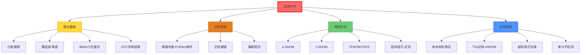

# 近场光学

## 一句话物理图像

> 把"天线"缩到纳米尺度——光学天线将自由传播的光局域到纳米体积内，在远场的"盲区"里捕获看不见的亚波长信息

## 核心问题：衍射极限

传统光学显微镜受限于 Abbe 衍射极限 $\delta = \lambda/(2\text{NA})$：

| 波长 | NA | 理论极限分辨率 |
|------|-----|----------------|
| 可见光 ~500 nm | 1.4 | ~180 nm |
| 近红外 ~1 μm | 0.8 | ~625 nm |
| 中红外 ~10 μm | 0.5 | ~10 μm |
| THz ~300 μm | 0.5 | ~300 μm |

**近场突破原理**：探测倏逝波分量（$k_\parallel > k_0$），可达 $\lambda/100$ 甚至 nm 级分辨率。

### Abbe 衍射极限的物理根源

远场成像只收集传播波（$k_z = \sqrt{k_0^2 - k_\parallel^2}$ 为实数），丢失 $k_\parallel > k_0$ 的倏逝波分量。这些高频空间分量携带亚波长细节信息。

$$k_\parallel > k_0 \Rightarrow k_z = i\sqrt{k_\parallel^2 - k_0^2} \quad \text{(虚数→倏逝波)}$$

> [!concept]+ 物理图像
> 远场成像就像"只听低音"的音响——丢失所有高频细节。近场方法把"耳朵"贴到声源旁边，直接接收全频谱信息。

---

## 倏逝波 (Evanescent Wave)

### 全内反射产生倏逝波

光从光密介质($n_1$)射向光疏介质($n_2$)，入射角 $\theta > \theta_c = \arcsin(n_2/n_1)$ 时发生全反射。光疏介质一侧存在指数衰减的倏逝场：

$$E_{ev}(z) = E_0 \, e^{-z/\delta}$$

穿透深度：

$$\delta = \frac{\lambda}{2\pi\sqrt{n_1^2\sin^2\theta - n_2^2}}$$

| 条件 | $\delta$ 量级 |
|------|-------------|
| $\theta \approx \theta_c$ | 很大（数百 nm） |
| $\theta \gg \theta_c$ | 很小（< 50 nm） |
| $n_1/n_2 = 1.5$, $\lambda = 633$ nm | ~100-300 nm |

### 角谱表示 (Angular Spectrum Representation)

任意电磁场可分解为平面波的叠加：

$$\mathbf{E}(\mathbf{r}) = \int\!\!\int \tilde{\mathbf{E}}(k_x, k_y) \, e^{i(k_x x + k_y y + k_z z)} \, dk_x \, dk_y$$

其中 $k_z = \sqrt{k_0^2 - k_x^2 - k_y^2}$：
- $k_x^2 + k_y^2 \leq k_0^2$：传播波分量（到达远场）
- $k_x^2 + k_y^2 > k_0^2$：倏逝波分量（$k_z$ 为虚数，指数衰减）

> [!formula]+ 关键结论
> 远场探测只接收 $k_\parallel \leq k_0$ 的传播波。要获取亚波长信息（$k_\parallel > k_0$），必须在近场（$z \ll \lambda$）用亚波长探针直接耦合倏逝波。

---

## 光学天线 (Optical Antenna)

> 以下内容基于 RAG 库中的 [[cite:@Bharadwaj2009]] (Novotny 组, "Optical Antennas", 2009)

### 概念：从射频天线到光学天线

射频天线将自由空间电磁波转换为局域电流（接收），或反之（发射）。光学天线做同样的事，但尺度缩到光学波长：

| 对比 | 射频天线 | 光学天线 |
|------|---------|---------|
| 波长 | cm - m | 400 - 800 nm |
| 材料 | 完美导体 | Au, Ag (Drude 模型) |
| 天线长度 | $\lambda/2$ | $\lambda_{eff}/2$ (受色散修正) |
| 阻抗匹配 | 传输线 | 自由空间 ↔ 纳米局域场 |

**核心功能**：将自由空间传播的光（$\sim \lambda^2$ 截面）高效耦合到纳米尺度（$\sim \lambda^2/100$）局域场。

### 天线的近场增强

金属纳米颗粒/针尖在共振时产生强烈局域场增强。根据 [[cite:@Bharadwaj2009]]：

> "...the field confinement becomes comparable with quantum confinement, the boundary between classical and quantum descriptions becomes blurred."

对于半径 $a$ 的金属纳米颗粒，在偶极共振下的有效极化率：

$$\alpha = 4\pi a^3 \frac{\epsilon(\omega) - \epsilon_m}{\epsilon(\omega) + 2\epsilon_m}$$

共振条件：$\text{Re}[\epsilon(\omega)] = -2\epsilon_m$（Fröhlich 条件）

**近场强度增强因子**：

$$\frac{|E_{near}|^2}{|E_0|^2} \propto \left|\frac{\alpha}{a^3}\right|^2$$

> [!concept]+ 物理图像
> 光学天线是"纳米级光漏斗"——把大面积的光汇聚到一个纳米点。就像卫星抛物面天线把微弱信号聚焦到馈源喇叭，但尺度小了一亿倍。

### 辐射阻抗

与射频不同，光学天线有显著的辐射阻抗 [[cite:@Bharadwaj2009]]：

对于半波天线 $L = \lambda/2$，有效辐射阻抗 $R_{rad}^{eff} \approx 30/\pi^2$ Ω（归一化值）。

---

## Bethe 小孔衍射理论 (1944)

半径 $a \ll \lambda$ 的小孔透射光强：

$$I \propto \left(\frac{a}{\lambda}\right)^4$$

Bethe 利用 Hertz 矢量势对理想导体屏上小孔的精确解：

| 参数 | 表达式 |
|------|--------|
| 透射功率 | $P \sim (ka)^4 E_0^2 / (4\pi)$ |
| 远场辐射方向图 | 类电偶极子 + 类磁偶极子 |
| 有效偶极矩 | $p = \epsilon_0 \alpha_E E_0$, $m = \alpha_M H_0$ |

> [!tip]+ Bouwkamp 修正 (1950)
> Bethe 的解在孔平面处不满足边界条件。Bouwkamp 给出了精确修正，额外项量级 $(ka)^6$，对小孔可忽略。

### 亚波长小孔的异常透射 (EOT)

1998 年 Ebbesen 发现：周期性排列的亚波长小孔在特定波长下透射率远超 Bethe 理论预言 [[cite:@Ebbesen1998]]。

$$T_{EOT} > 1 \quad \text{(归一化透射率超过小孔面积占比)}$$

物理机制：表面等离激元 (SPP) 共振增强。

$$k_{SPP} = k_0 \sqrt{\frac{\epsilon_m \epsilon_d}{\epsilon_m + \epsilon_d}}$$

EOT 峰值条件：$k_{SPP} = k_0 \sin\theta + m\frac{2\pi}{P_x} + n\frac{2\pi}{P_y}$（$P$ 为周期）

---

## 近场光学显微镜技术

### 技术路线对比

| 方法 | 原理 | 分辨率 | 探针类型 | 优缺点 |
|------|------|--------|----------|--------|
| a-SNOM | 孔径近场扫描 | 50-100 nm | 金属镀膜光纤 | 光通量低，分辨率受孔径限制 |
| s-SNOM | 散射式近场 | 10-30 nm | 金属针尖 | 分辨率高，需解调 |
| TENOM | 针尖增强近场 | 10-20 nm | 等离激元针尖 | 增强因子大，探针寿命短 |
| TERS | 针尖增强拉曼 | ~10 nm | Au/Ag 针尖 | 化学信息，信号弱 |
| THz-SNOM | THz 近场 | ~μm | 金属针尖 | 频段独特，系统复杂 |

### 孔径 SNOM (a-SNOM)

探针：金属镀膜光纤尖端开 $\sim 100$ nm 孔径。

光通量限制（Bethe 小孔理论限制）：

$$I_{aperture} \propto \left(\frac{a}{\lambda}\right)^4 \cdot I_0$$

$a = 100$ nm, $\lambda = 633$ nm 时，透射率 $\sim 6 \times 10^{-4}$。

> [!warning]+ 分辨率-光通量矛盾
> 孔径越小→分辨率越高，但光通量按 $(a/\lambda)^4$ 急剧下降。这就是 a-SNOM 分辨率被限制在 ~50 nm 的根本原因——不是技术问题，是物理极限。

### 散射式 SNOM (s-SNOM)

利用金属针尖散射近场信号，通过外差或伪外差检测提取近场信息。

**信号解调原理**：

针尖以频率 $\Omega$ 敲击（tapping mode），散射信号含高阶谐波：

$$E_{det} \propto \sum_{n=1}^{\infty} \sigma_n \, e^{in\Omega t}$$

高阶谐波（$n \geq 2$）主要来自近场（$z^{-3}$ 衰减），有效抑制远场背景。

**介电函数成像**：

s-SNOM 信号 $\sigma_n$ 与样品介电函数 $\epsilon$ 相关。通过 tip-dipole 模型反演 [[cite:@Keilmann2009]]：

$$\alpha_{eff}(\omega) = \alpha_{tip} + \frac{\alpha_{tip}^2 \beta(\omega)}{16\pi(a+d)^3}$$

其中 $\beta = (\epsilon - 1)/(\epsilon + 1)$ 是镜像偶极响应函数。

> [!concept]+ 物理图像
> 针尖像"纳米天线"——把局域的近场信息"转发"到远场。敲击运动的非线性耦合使近场信号出现在高次谐波，自然过滤远场背景。正如 [[cite:@Bharadwaj2009]] 指出的：光学天线的核心功能就是自由空间传播模式↔纳米局域场的双向转换。

---

## THz 近场光谱与成像

> 基于 RAG 库中的 [[cite:@THzRoadmap2017]] (2017 THz Science and Technology Roadmap)

THz 频段（0.1-10 THz）波长 30 μm - 3 mm，衍射极限最严重。近场方法可将分辨率从 ~300 μm 提升至 μm 级。

**散射式 THz 近场扫描显微镜 (THz-sSNOM)**：

根据 [[cite:@THzRoadmap2017]] Figure 15 的描述：

> "THz pulses from a photoconductive antenna are focused onto a metallic tip that scatters the near-field signal, which is then detected in the far field."

![[fa8088acbae42ed0_p23_f11.png]]
*Figure 12 from [[cite:@THzRoadmap2017]]: THz 时域光谱系统。飞秒激光驱动光导天线产生 THz 脉冲，抛物面镜引导传输。*

**等离子体增强光导开关**：

![[fa8088acbae42ed0_p13_f05.png]]
*Figure 6 from [[cite:@THzRoadmap2017]]: 纳米图案化电极的光导开关。纳米"手指"结构使激光光子通过等离子体耦合进入半导体，显著提升器件性能。(Courtesy of M Jarrahi, UCLA)*

### THz 近场技术对比

| 技术 | 分辨率 | THz 源 | 典型应用 |
|------|--------|--------|---------|
| THz-sSNOM | ~μm | 光导天线/光整流 | 半导体载流子分布 |
| THz 孔径近场 | ~μm | TPO/QCL | 生物组织成像 |
| THz 光导天线近场 | ~μm | 飞秒激光 | 超材料表征 |

分辨率提升倍数：$\lambda/a \sim 300\,\mu\text{m}/1\,\mu\text{m} = 300\times$

---

## 超快电子与近场光学

> 基于 RAG 库中的 [[cite:@Feist2016]] (Feist et al., "Quantum coherent optical phase modulation in an ultrafast transmission electron microscope")

近场光学与超快电子显微术的交叉：电子束作为近场探测器。

**原理**：高速电子穿过光学近场时，通过弹性散射获得/失去光子能量 (PINEM 效应)。

> "coherent inelastic electron scattering by optical near-fields" — 电子与近场的相干非弹性散射

![[fa8088acbae42ed0_p13_f05.png]]

**关键参数**：

| 参数 | 值 | 含义 |
|------|------|------|
| 电子能量 | 200 keV | TEM 能量 |
| 光子能量 | ~1 eV (近红外) | 驱动激光 |
| 相互作用时间 | ~fs | 穿过近场的时间 |
| 空间分辨率 | ~nm | 电子束斑 |

---

## 针尖增强近场光学 (TENOM / TERS)

### 电磁增强机制

金属针尖在激光照射下产生局域表面等离激元 (LSP)，尖端处场增强 [[cite:@Bharadwaj2009]]：

$$|E_{tip}|^2 / |E_0|^2 \sim 10^2 - 10^4$$

增强因子与针尖形状、材料、激发波长相关：

| 材料 | 最佳波长范围 | 典型增强因子 |
|------|-------------|-------------|
| Au | 600-800 nm | ~$10^3$ |
| Ag | 400-600 nm | ~$10^4$ |
| Pt | 宽带 | ~$10^2$ |
| W | 宽带（无等离激元） | ~$10^1$ |

### TERS (Tip-Enhanced Raman Spectroscopy)

拉曼信号增强正比于场增强的四次方 [[cite:@Stöckle2000]]：

$$EF_{TERS} = \left(\frac{|E_{tip}|}{|E_0|}\right)^4 \sim 10^{8} - 10^{10}$$

$$EF = \frac{I_{TERS}/N_{TERS}}{I_{NRS}/N_{NRS}}$$

---

## 近场探测的定量分析

### 分辨率与探针-样品间距

| 间距 $d$ | 近场信号强度 | 远场背景 | 适用技术 |
|----------|-------------|---------|---------|
| $d < 5$ nm | 极强 | 完全抑制 | TERS, TENOM |
| $5 < d < 20$ nm | 强 | 抑制好 | s-SNOM |
| $20 < d < 50$ nm | 中等 | 中等 | a-SNOM |
| $d > \lambda/10$ | 弱 | 强 | 不适用 |

### 从天线理论看探针设计

[[cite:@Bharadwaj2009]] 将近场探针统一到天线框架：

| 探针类型 | 天线类比 | 关键参数 |
|----------|---------|---------|
| 孔径 SNOM | 小孔天线 | 孔径 $a$, Bethe $(a/\lambda)^4$ 限制 |
| s-SNOM 针尖 | 单极天线 | 敲击幅度, 谐波阶数 |
| 纳米颗粒 | 偶极天线 | 极化率 $\alpha$, Fröhlich 共振 |
| Bow-tie | 对数周期天线 | 间隙间距, 场增强 |

---

## 知识树

---

## 参考文献

1. **[[cite:@Bharadwaj2009]]** — Bharadwaj, Deutsch & Novotny, "Optical Antennas", *Adv. Opt. Photon.* 1, 438 (2009). **RAG 库收录** — 光学天线统一框架
2. **[[cite:@Novotny2012]]** — Novotny & Hecht, "Principles of Nano-Optics", 近场光学标准教材
3. **[[cite:@Bethe1944]]** — "Theory of Diffraction by Small Holes", 小孔衍射精确解
4. **[[cite:@Ebbesen1998]]** — "Extraordinary Optical Transmission through Sub-wavelength Hole Arrays", EOT 发现
5. **[[cite:@Keilmann2009]]** — "Near-field microscopy by elastic light scattering from a tip", s-SNOM 综述
6. **[[cite:@THzRoadmap2017]]** — "The 2017 terahertz science and technology roadmap", *J. Phys. D* 50, 043001 (2017). **RAG 库收录** — THz 近场方法
7. **[[cite:@Feist2016]]** — Feist et al., "Quantum coherent optical phase modulation in an ultrafast TEM", *Nature* 521, 200 (2016). **RAG 库收录** — 电子-近场相互作用
8. **[[cite:@Stöckle2000]]** — "Nanoscale chemical analysis by tip-enhanced Raman spectroscopy", TERS 原理

---

## 延伸阅读

- [[纳米光学]] — 纳米尺度光与物质相互作用
- [[超表面与超材料]] — 超材料中的近场效应
- [[太赫兹近场光谱]] — THz 近场应用
