# 近场光学

## 一句话物理图像

> 把"天线"缩到纳米尺度——光学天线将自由传播的光局域到纳米体积内，在远场的"盲区"里捕获看不见的亚波长信息。近场光学的核心数学是**角谱表示**中的倏逝波分量，核心物理是**亚波长结构与倏逝波的耦合**。

---

## 零、动机：为什么需要近场光学？

### 衍射极限——远场光学的天花板

传统光学显微镜受限于 Abbe 衍射极限 $\delta = \lambda/(2\text{NA})$：

| 波长 | NA | 理论极限分辨率 |
|------|-----|----------------|
| 可见光 ~500 nm | 1.4 | ~180 nm |
| 近红外 ~1 μm | 0.8 | ~625 nm |
| 中红外 ~10 μm | 0.5 | ~10 μm |
| THz ~300 μm | 0.5 | ~300 μm |

**突破原理**：探测倏逝波分量（$k_\parallel > k_0$），可达 $\lambda/100$ 甚至 nm 级分辨率。

| 对比 | 远场成像 | 近场成像 |
|------|---------|---------|
| 收集的信息 | 传播波 ($k_\parallel < k_0$) | 传播波 + 倏逝波 |
| 分辨率极限 | $\lambda/2$ | 探针尺寸（~nm） |
| 探测距离 | 任意远 | $z \ll \lambda$ |
| 信息完整性 | 低（丢失高频分量） | 高 |

---

## 一、倏逝波 (Evanescent Wave)

### 1.1 全内反射产生倏逝波

光从光密介质($n_1$)射向光疏介质($n_2$)，入射角 $\theta > \theta_c = \arcsin(n_2/n_1)$ 时发生全反射。光疏介质一侧存在指数衰减的倏逝场：

$$E_{ev}(z) = E_0 \, e^{-z/\delta}$$

穿透深度（$1/e$ 衰减距离）：

$$\boxed{\delta = \frac{\lambda}{2\pi\sqrt{n_1^2\sin^2\theta - n_2^2}}}$$

**数值示例**——玻璃/空气界面 ($n_1=1.5$, $n_2=1.0$, $\lambda=633$ nm)：

| 入射角 | $\delta$ |
|--------|---------|
| $\theta_c = 41.8°$ | $\to\infty$（临界角处） |
| 45° | 312 nm |
| 60° | 136 nm |
| 80° | 86 nm |

> [!concept]+ 倏逝波的物理图像
> 全反射时，电磁场并非在界面突然消失——它在光疏介质中以指数衰减渗透，形成一个"消失的尾巴"。这个尾巴携带了界面两侧的亚波长信息。
>
> **极限**：当 $z > 3\delta$ 时，场强衰减到 $e^{-3} \approx 5\%$，基本不可探测。因此近场探测必须在 $z \lesssim \delta$ 距离内进行。

### 1.2 Goos-Hänchen 位移

全反射光束并非在入射点精确反射——它在界面处沿平行方向偏移了一个微小距离 $D_{GH}$：

$$D_{GH} \approx \frac{\lambda}{\pi}\frac{\sin\theta}{\sqrt{\sin^2\theta - (n_2/n_1)^2}}$$

| 条件 | $D_{GH}$ 量级 |
|------|-------------|
| $\theta \to \theta_c$ | $\to\infty$（发散） |
| $\theta = 50°$（玻璃/空气） | ~1 μm |
| $\theta = 70°$ | ~0.3 μm |

> **物理含义**：反射光束先"潜入"光疏介质（成为倏逝波），再被反射回来。$D_{GH}$ 就是这段"潜水"的水平距离。

### 1.3 角谱表示 (Angular Spectrum Representation)

任意电磁场可分解为平面波的叠加：

$$\mathbf{E}(\mathbf{r}) = \int\!\!\int \tilde{\mathbf{E}}(k_x, k_y) \, e^{i(k_x x + k_y y + k_z z)} \, dk_x \, dk_y$$

其中 $k_z = \sqrt{k_0^2 - k_x^2 - k_y^2}$：
- $k_x^2 + k_y^2 \leq k_0^2$：传播波分量（到达远场）
- $k_x^2 + k_y^2 > k_0^2$：倏逝波分量（$k_z = i\kappa$，虚数，指数衰减）

$$k_z = \begin{cases} +\sqrt{k_0^2 - k_\parallel^2} & k_\parallel \leq k_0 \quad \text{(传播波)} \\ +i\sqrt{k_\parallel^2 - k_0^2} & k_\parallel > k_0 \quad \text{(倏逝波)} \end{cases}$$

> [!formula]+ 近场方法的数学本质
> 空间频率 $k_\parallel$ 越大→携带的细节越精细→倏逝衰减越快：
>
> $$E_{ev} \sim e^{-\sqrt{k_\parallel^2 - k_0^2}\,z}$$
>
> 要分辨 $\Delta x$ 的特征，需要 $k_\parallel \sim 1/\Delta x$ 的分量，它衰减的特征长度 $z_c \sim \Delta x$。因此**分辨率越高，探针必须越近**——这是近场光学的基本约束。

---

## 二、表面等离激元 (SPP)

### 2.1 SPP 色散关系推导

在金属($\epsilon_m$)/介质($\epsilon_d$)界面上，TM 偏振的表面波满足：

$$k_{SPP} = k_0\sqrt{\frac{\epsilon_m(\omega)\,\epsilon_d}{\epsilon_m(\omega) + \epsilon_d}}$$

**推导**（3步）：

**Step 1**：假设 TM 波在界面两侧分别为 $E \sim e^{-\kappa_d z}$ ($z>0$) 和 $E \sim e^{+\kappa_m z}$ ($z<0$)，代入 Maxwell 方程得 $\kappa_d^2 = k_{SPP}^2 - \epsilon_d k_0^2$，$\kappa_m^2 = k_{SPP}^2 - \epsilon_m k_0^2$。

**Step 2**：由 $E_\parallel$ 和 $D_\perp$ 连续的边界条件，得

$$\frac{\kappa_d}{\epsilon_d} + \frac{\kappa_m}{\epsilon_m} = 0$$

**Step 3**：代入 $\kappa$ 表达式并求解，得到 SPP 色散关系。

### 2.2 SPP 的关键参数

| 参数 | 公式 | 物理含义 |
|------|------|---------|
| 传播长度 $L_{SPP}$ | $1/(2\,\text{Im}[k_{SPP}])$ | 场强衰减到 $1/e$ 的传播距离 |
| 穿透深度（介质侧）$\delta_d$ | $1/\text{Re}[\kappa_d]$ | 场渗透进介质的深度 |
| 穿透深度（金属侧）$\delta_m$ | $1/\text{Re}[\kappa_m]$ | 场渗透进金属的深度 |

**数值示例**——Au/空气界面 ($\lambda = 800$ nm)：

| 参数 | 数值 |
|------|------|
| $\epsilon_{Au}$ | $-24.1 + 1.5i$ (Drude) |
| $k_{SPP}$ | $1.015\,k_0$ |
| $L_{SPP}$ | ~60 μm |
| $\delta_d$（空气侧） | ~600 nm |
| $\delta_m$（金属侧） | ~25 nm |

> [!concept]+ SPP 与近场的关系
> SPP 是束缚在界面的电磁模式——它的场在垂直方向指数衰减，是典型的近场。SPP 的 $k_{SPP} > k_0$ 意味着它无法直接耦合到自由空间传播波，需要棱镜耦合（Kretschmann/Otto）或光栅耦合。
>
> **连接**：→ [[纳米光学]] 中 SPP 在纳米结构中的局域化；→ [[超表面与超材料]] 中等离激元超表面的设计。

### 2.3 局域表面等离激元 (LSP)

金属纳米颗粒（尺度 $\ll \lambda$）中，等离激元被局域在颗粒周围，形成离散共振模式。

**Mie 理论（球形颗粒）**——偶极近似下的极化率：

$$\alpha = 4\pi a^3 \frac{\epsilon(\omega) - \epsilon_m}{\epsilon(\omega) + 2\epsilon_m}$$

**Fröhlich 共振条件**：$\text{Re}[\epsilon(\omega)] = -2\epsilon_m$

**数值示例**——Au 纳米球 ($a = 50$ nm) 在水中 ($\epsilon_m = 1.77$)：

| 参数 | 数值 |
|------|------|
| 共振波长 | ~520 nm |
| $|\alpha|^2/a^6$ (增强因子) | ~30 |
| 近场增强 $|E/E_0|^2$ (表面) | ~10² |
| 散射截面 / 几何截面 | ~3 |

---

## 三、光学天线 (Optical Antenna)

> 基于 RAG 库中的 [[cite:@Bharadwaj2009]] (Novotny 组, "Optical Antennas", 2009)

### 3.1 从射频天线到光学天线

射频天线将自由空间电磁波转换为局域电流（接收），或反之（发射）。光学天线做同样的事，但尺度缩到光学波长：

| 对比 | 射频天线 | 光学天线 |
|------|---------|---------|
| 波长 | cm - m | 400 - 800 nm |
| 材料 | 完美导体 | Au, Ag (Drude 模型) |
| 天线长度 | $\lambda/2$ | $\lambda_{eff}/2$ (受色散修正) |
| 阻抗匹配 | 传输线 | 自由空间 ↔ 纳米局域场 |
| 欧姆损耗 | 可忽略 | 显著（金属趋肤效应） |

**核心功能**：将自由空间传播的光（$\sim \lambda^2$ 截面）高效耦合到纳米尺度（$\sim \lambda^2/100$）局域场。

### 3.2 天线的近场增强

金属纳米颗粒/针尖在共振时产生强烈局域场增强：

近场强度增强因子：

$$\frac{|E_{near}|^2}{|E_0|^2} \propto \left|\frac{\alpha}{a^3}\right|^2$$

> [!concept]+ 物理图像
> 光学天线是"纳米级光漏斗"——把大面积的光汇聚到一个纳米点。就像卫星抛物面天线把微弱信号聚焦到馈源喇叭，但尺度小了一亿倍。
>
> 当场局域尺度与量子力学尺度（~nm）可比时，经典描述开始失效。→ [[纳米光学]] 量子修正。

### 3.3 Bow-tie 天线与纳米间隙

Bow-tie 天线在间隙处产生极强的场增强：

$$E_{gap} \approx E_0 \cdot \frac{L}{d}$$

其中 $L$ 是天线长度，$d$ 是间隙宽度。

| 设计参数 | 典型值 | 增强效果 |
|----------|--------|---------|
| $L$ | 100-200 nm | 决定共振波长 |
| $d$ | 5-20 nm | 越小增强越大 |
| 材料 | Au, Ag | Ag增强更强但易氧化 |
| 基底 | 玻璃/Si | 影响有效折射率 |

**极限**：当 $d < 2$ nm 时，电子隧穿效应使场增强饱和甚至下降。这是经典天线理论的量子极限。

---

## 四、Bethe 小孔衍射理论 (1944)

### 4.1 理想导体屏上的亚波长小孔

半径 $a \ll \lambda$ 的小孔透射光强：

$$I \propto \left(\frac{a}{\lambda}\right)^4$$

Bethe 利用 Hertz 矢量势对理想导体屏上小孔的精确解：

| 参数 | 表达式 | 物理含义 |
|------|--------|---------|
| 透射功率 | $P \sim (ka)^4 E_0^2 / (4\pi)$ | 随孔径四次方衰减 |
| 远场方向图 | 电偶极 + 磁偶极 | 类 Hertz 偶极辐射 |
| 有效电偶极矩 | $p = \epsilon_0 \alpha_E E_0$ | 垂直分量极化 |
| 有效磁偶极矩 | $m = \alpha_M H_0$ | 平行分量磁极化 |

> [!tip]+ Bouwkamp 修正 (1950)
> Bethe 的解在孔平面处不满足边界条件。Bouwkamp 给出了精确修正，额外项量级 $(ka)^6$，对小孔可忽略。

**数值示例**——$a = 50$ nm 小孔，$\lambda = 633$ nm：

$$\frac{P}{P_0} \sim (ka)^4 = \left(\frac{2\pi \times 50}{633}\right)^4 \approx (0.496)^4 \approx 6.1 \times 10^{-2}$$

（Bethe 理论已考虑归一化因子，实际透射率更低）

### 4.2 异常透射 (EOT)

1998 年 Ebbesen 发现：周期性排列的亚波长小孔在特定波长下透射率远超 Bethe 理论预言 [[cite:@Ebbesen1998]]。

$$T_{EOT} > 1 \quad \text{(归一化透射率超过小孔面积占比)}$$

**物理机制**：表面等离激元 (SPP) 共振增强——入射光通过 SPP 模式"绕过"Bethe 限制。

EOT 峰值条件（光栅耦合）：

$$k_{SPP} = k_0 \sin\theta + m\frac{2\pi}{P_x} + n\frac{2\pi}{P_y}$$

| 参数 | 含义 |
|------|------|
| $P_x, P_y$ | 孔阵列周期 |
| $(m, n)$ | SPP 模式阶数 |
| $\theta$ | 入射角 |

> [!concept]+ EOT 的机制解释
> 单个小孔：Bethe 限制 $\propto (a/\lambda)^4$。周期阵列：相邻小孔通过 SPP 耦合，每个小孔的透射被 SPP 共振"放大"。本质是**集体效应**克服了单孔的 Bethe 限制。
>
> **连接**：→ [[超表面与超材料]] 中超构表面的广义 Snell 定律是 EOT 概念的推广。

---

## 五、近场光学显微镜技术

### 5.1 技术路线对比

| 方法 | 原理 | 分辨率 | 探针类型 | 优缺点 |
|------|------|--------|----------|--------|
| a-SNOM | 孔径近场扫描 | 50-100 nm | 金属镀膜光纤 | 光通量低，分辨率受孔径限制 |
| s-SNOM | 散射式近场 | 10-30 nm | 金属针尖 | 分辨率高，需解调 |
| TENOM | 针尖增强近场 | 10-20 nm | 等离激元针尖 | 增强因子大，探针寿命短 |
| TERS | 针尖增强拉曼 | ~10 nm | Au/Ag 针尖 | 化学信息，信号弱 |
| THz-SNOM | THz 近场 | ~μm | 金属针尖 | 频段独特，系统复杂 |

### 5.2 孔径 SNOM (a-SNOM)

探针：金属镀膜光纤尖端开 $\sim 100$ nm 孔径。

光通量限制（Bethe 小孔理论限制）：

$$I_{aperture} \propto \left(\frac{a}{\lambda}\right)^4 \cdot I_0$$

**数值示例**：$a = 100$ nm, $\lambda = 633$ nm → 透射率 $\sim 6 \times 10^{-4}$

> [!warning]+ 分辨率-光通量矛盾
> 孔径越小→分辨率越高，但光通量按 $(a/\lambda)^4$ 急剧下降。a-SNOM 分辨率被限制在 ~50 nm 的根本原因——不是技术问题，是物理极限。

### 5.3 散射式 SNOM (s-SNOM)

利用金属针尖散射近场信号，通过外差或伪外差检测提取近场信息。

**信号解调原理**：

针尖以频率 $\Omega$ 敲击（tapping mode，振幅 $A$），针尖-样品距离 $z(t) = d_0 + A(1 + \cos\Omega t)$。散射信号含高阶谐波：

$$E_{det}(t) \propto \sum_{n=0}^{\infty} \sigma_n \, e^{in\Omega t}$$

近场散射率 $\sigma_n$ 的 tip-dipole 模型 [[cite:@Keilmann2009]]：

$$\sigma_n = \frac{1}{2\pi}\int_0^{2\pi}\alpha_{eff}(z(t))\,e^{-in\Omega t}\,d(\Omega t)$$

其中有效极化率：

$$\alpha_{eff}(\omega) = \frac{\alpha_{tip}(1+\beta)}{1 - \frac{\alpha_{tip}\beta}{16\pi(a+d)^3}}$$

$\beta = (\epsilon - 1)/(\epsilon + 1)$ 是镜像偶极响应函数，$a$ 是针尖曲率半径。

> [!concept]+ 高次谐波为什么能提取近场
> 近场散射率 $\sigma(z) \sim 1/(a+z)^3$（偶极-偶极耦合），这是一个关于 $z$ 的非线性函数。当针尖以频率 $\Omega$ 振动时，这个非线性映射将近场信号"编码"到高次谐波中。远场背景几乎不随 $z$ 变化，只出现在 $n=0$ 和 $n=1$。因此 $n \geq 2$ 的信号几乎纯粹来自近场。

### 5.4 介电函数成像

s-SNOM 信号 $\sigma_n$ 与样品介电函数 $\epsilon$ 通过 $\beta$ 函数关联：

$$\beta(\epsilon) = \frac{\epsilon - 1}{\epsilon + 1}$$

| 材料 | $\epsilon$ | $\beta$ | 信号特征 |
|------|-----------|---------|---------|
| Au (@633 nm) | $-11.7 + 1.3i$ | $-1.18 + 0.01i$ | 强振幅，特征相位 |
| Si (@633 nm) | $15.1 + 0.02i$ | $0.87$ | 高振幅 |
| SiO₂ (@633 nm) | $2.1$ | $0.36$ | 低振幅 |
| VO₂ (金属态) | $-8 + 20i$ | $-1.17 + 0.34i$ | 可区分相变 |

通过测量振幅 $|\sigma_n|$ 和相位 $\arg(\sigma_n)$，可以反演出 $\epsilon(\omega)$。

---

## 六、THz 近场光谱与成像

> 基于 RAG 库中的 [[cite:@THzRoadmap2017]] (2017 THz Science and Technology Roadmap)

THz 频段（0.1-10 THz）波长 30 μm - 3 mm，衍射极限最严重。近场方法可将分辨率从 ~300 μm 提升至 μm 级。

### 6.1 THz-sSNOM 技术

> "THz pulses from a photoconductive antenna are focused onto a metallic tip that scatters the near-field signal, which is then detected in the far field." — [[cite:@THzRoadmap2017]]

| 参数 | THz-sSNOM | 可见 s-SNOM |
|------|-----------|------------|
| 波长 | 30-3000 μm | 0.4-0.8 μm |
| 分辨率 | ~μm（针尖限制） | ~20 nm |
| 分辨率/波长比 | $\lambda/300$ | $\lambda/30$ |
| 探测模式 | 时域（THz-TDS） | 频域 |
| 信息量 | 振幅+相位 vs 频率 | 振幅+相位 |

### 6.2 THz 近场技术对比

| 技术 | 分辨率 | THz 源 | 典型应用 |
|------|--------|--------|---------|
| THz-sSNOM | ~μm | 光导天线/光整流 | 半导体载流子分布 |
| THz 孔径近场 | ~10 μm | TPO/QCL | 生物组织成像 |
| THz 光导天线近场 | ~μm | 飞秒激光 | 超材料表征 |

分辨率提升倍数：$\lambda/a \sim 300\,\mu\text{m}/1\,\mu\text{m} = 300\times$

> [!tip]+ THz 近场的独特优势
> THz 光子能量 (~4 meV @1 THz) 与半导体带内跃迁、声子、超导能隙匹配。近场 THz 可以在 nm 尺度上探测载流子浓度、迁移率、极化激元的分布——这是远场 THz 无法实现的。

---

## 七、针尖增强近场光学 (TENOM / TERS)

### 7.1 电磁增强机制

金属针尖在激光照射下产生局域表面等离激元 (LSP)，尖端处场增强 [[cite:@Bharadwaj2009]]：

$$|E_{tip}|^2 / |E_0|^2 \sim 10^2 - 10^4$$

| 材料 | 最佳波长范围 | 典型增强因子 |
|------|-------------|-------------|
| Au | 600-800 nm | ~$10^3$ |
| Ag | 400-600 nm | ~$10^4$ |
| Pt | 宽带 | ~$10^2$ |
| W | 宽带（无等离激元） | ~$10^1$ |

### 7.2 TERS (Tip-Enhanced Raman Spectroscopy)

拉曼信号增强正比于场增强的四次方 [[cite:@Stöckle2000]]：

$$\boxed{EF_{TERS} = \left(\frac{|E_{tip}|}{|E_0|}\right)^4 \sim 10^{8} - 10^{10}}$$

这是因为拉曼过程涉及**入射场增强**和**散射场增强**（Stokes 过程的发射也被针尖增强），各贡献一次 $|E/E_0|^2$。

$$EF = \frac{I_{TERS}/N_{TERS}}{I_{NRS}/N_{NRS}}$$

| 参数 | 含义 |
|------|------|
| $I_{TERS}$ | TERS 信号强度 |
| $N_{TERS}$ | TERS 有效分子数（~100） |
| $I_{NRS}$ | 常规拉曼信号强度 |
| $N_{NRS}$ | 常规拉曼分子数（~$10^{10}$） |

### 7.3 化学增强 vs 电磁增强

TERS 增强 = 电磁增强 + 化学增强：

| 增强机制 | 来源 | 量级 |
|----------|------|------|
| 电磁增强 | LSP 局域场 + 天线辐射增强 | $10^6 - 10^8$ |
| 化学增强 | 分子-金属电荷转移共振 | $10 - 10^2$ |
| 总增强 | 两者相乘 | $10^8 - 10^{10}$ |

> **极限**：单分子 TERS 需要增强 $\sim 10^{14}$，仅在"hot spot"（针尖-颗粒间隙 < 2 nm）中可实现。

---

## 八、超快电子与近场光学

> 基于 RAG 库中的 [[cite:@Feist2016]] (Feist et al., Nature 521, 200, 2016)

近场光学与超快电子显微术的交叉：电子束作为近场探测器。

### 8.1 PINEM 效应

高速电子穿过光学近场时，通过相干非弹性散射获得/失去光子能量：

$$E_{final} = E_0 \pm n\hbar\omega$$

电子能谱呈现等间距的边带，强度服从 Poisson 分布：

$$P_n = e^{-|g|^2}\frac{|g|^{2n}}{n!}$$

其中 $g$ 是耦合参数，正比于近场强度和相互作用时间。

### 8.2 应用前景

| 方向 | 分辨率 | 优势 |
|------|--------|------|
| 纳米光子学表征 | ~nm | 电子束分辨率不受衍射极限限制 |
| 超快动力学 | ~fs | 电子脉冲的时间分辨 |
| 近场相位测量 | nm | PINEM 保持相位信息 |

---

## 九、近场探测的定量分析

### 9.1 分辨率与探针-样品间距

| 间距 $d$ | 近场信号强度 | 远场背景 | 适用技术 |
|----------|-------------|---------|---------|
| $d < 5$ nm | 极强 | 完全抑制 | TERS, TENOM |
| $5 < d < 20$ nm | 强 | 抑制好 | s-SNOM |
| $20 < d < 50$ nm | 中等 | 中等 | a-SNOM |
| $d > \lambda/10$ | 弱 | 强 | 不适用 |

### 9.2 从天线理论看探针设计

[[cite:@Bharadwaj2009]] 将近场探针统一到天线框架：

| 探针类型 | 天线类比 | 关键参数 |
|----------|---------|---------|
| 孔径 SNOM | 小孔天线 | 孔径 $a$, Bethe $(a/\lambda)^4$ 限制 |
| s-SNOM 针尖 | 单极天线 | 敲击幅度, 谐波阶数 |
| 纳米颗粒 | 偶极天线 | 极化率 $\alpha$, Fröhlich 共振 |
| Bow-tie | 对数周期天线 | 间隙间距, 场增强 |

---

## 十、知识树

```mermaid
graph TD
    A["近场光学"] --> B["理论基础"]
    A --> C["SPP/等离激元"]
    A --> D["光学天线"]
    A --> E["探测方法"]
    A --> F["应用领域"]

    B --> B1["衍射极限<br/>Abbe δ=λ/2NA"]
    B --> B2["倏逝波<br/>全反射+GH位移"]
    B --> B3["角谱表示<br/>k∥>k₀ 衰减"]
    B --> B4["Bethe小孔<br/>(a/λ)⁴"]

    C --> C1["SPP色散<br/>kSPP推导"]
    C --> C2["LSP共振<br/>Fröhlich条件"]
    C --> C3["穿透/传播长度"]

    D --> D1["天线类比<br/>射频→光学"]
    D --> D2["Bow-tie间隙<br/>E∝L/d"]
    D --> D3["量子极限<br/>隧穿效应"]

    E --> E1["a-SNOM<br/>孔径限制"]
    E --> E2["s-SNOM<br/>谐波解调"]
    E --> E3["TENOM/TERS<br/>E⁴增强"]
    E --> E4["超快电子-PINEM"]

    F --> F1["THz近场<br/>λ/300分辨率"]
    F --> F2["纳米材料表征"]
    F --> F3["单分子检测"]
    F --> F4["EOT异常透射"]

    style A fill:#FF6B6B,stroke:#FF0000,stroke-width:3px
    style B fill:#FFD93D,stroke:#FF8C00
    style C fill:#E67E22,stroke:#D35400
    style D fill:#9B59B6,stroke:#6C3483
    style E fill:#6BCB77,stroke:#228B22
    style F fill:#4D96FF,stroke:#0000CD
```

---

## 参考文献

1. **[[cite:@Bharadwaj2009]]** — Bharadwaj, Deutsch & Novotny, "Optical Antennas", *Adv. Opt. Photon.* 1, 438 (2009). **RAG 库收录** — 光学天线统一框架
2. **[[cite:@Novotny2012]]** — Novotny & Hecht, "Principles of Nano-Optics", 近场光学标准教材
3. **[[cite:@Bethe1944]]** — "Theory of Diffraction by Small Holes", 小孔衍射精确解
4. **[[cite:@Ebbesen1998]]** — "Extraordinary Optical Transmission through Sub-wavelength Hole Arrays", EOT 发现
5. **[[cite:@Keilmann2009]]** — "Near-field microscopy by elastic light scattering from a tip", s-SNOM 综述
6. **[[cite:@THzRoadmap2017]]** — "The 2017 terahertz science and technology roadmap", *J. Phys. D* 50, 043001 (2017). **RAG 库收录**
7. **[[cite:@Feist2016]]** — Feist et al., "Quantum coherent optical phase modulation in an ultrafast TEM", *Nature* 521, 200 (2016). **RAG 库收录**
8. **[[cite:@Stöckle2000]]** — "Nanoscale chemical analysis by tip-enhanced Raman spectroscopy", TERS 原理

---

## 延伸阅读

- [[纳米光学]] — 纳米尺度光与物质相互作用，SPP 深入讨论
- [[超表面与超材料]] — 超材料中的近场效应，EOT 的推广
- [[太赫兹近场光谱]] — THz 近场应用
- [[电磁场理论基础]] — Maxwell 方程、边界条件、Green 函数

---

*最后更新：2026-06-05*
