# 纳米光学

## 一句话物理图像

> 当光遇到比波长还小的结构时，会产生"近场触觉"——光的"感受器"能探测到纳米尺度的细节，就像用细针触摸微小坑洼

## 一、为什么需要纳米光学？

### 1.1 衍射极限的挑战

**问题**：传统光学显微镜的分辨率受 $\lambda/2$ 限制，无法看到纳米尺度的结构。

| 波长 | 衍射极限 | 无法看到 |
|------|----------|----------|
| 可见光 500 nm | 250 nm | 病毒（~100 nm）、蛋白质（~10 nm） |
| 红外 10 μm | 5 μm | 细胞器（~μm 级） |
| THz 300 μm | 150 μm | 微电子器件（~10 μm） |

**解决方案**：利用倏逝波的**近场探测**。

### 1.2 纳米光学的研究对象

当结构尺寸 $d \ll \lambda$ 时：

| 现象 | 特征 | 应用 |
|------|------|------|
| **倏逝波** | 局限在近场，指数衰减 | SNOM |
| **局域场增强** | 尖端/缝隙处场增强 | SERS |
| **等离激元** | 金属自由电子振荡 | 纳米天线 |
| **量子效应** | 电子波动性显现 | 量子点 |

> [!concept]+ 物理图像：筷子在水中的折射
> 传统光学看"水面以上"的部分（传播波），纳米光学看"水面以下"的部分（倏逝波）——那才是纳米尺度信息的所在。

---

## 二、倏逝波的物理原理

### 2.1 全内反射产生的倏逝波（详细推导）

**条件**：光从光密介质 ($n_1$) 到光疏介质 ($n_2 < n_1$)，入射角 $\theta > \theta_c$

**全内反射临界角**：

$$\sin\theta_c = \frac{n_2}{n_1}$$

**推导**：当折射角 $\theta_2 = 90°$ 时，$n_1 \sin\theta_c = n_2$

### 2.2倏逝波数学形式

在全内反射时，透射波不是平面波，而是倏逝波：

$$E_t(x,z) = E_0 e^{i(k_x x - k_z z)}$$

其中：

$$k_x = n_1 k_0 \sin\theta > n_2 k_0$$
$$k_z = \sqrt{n_2^2 k_0^2 - k_x^2} = i\kappa$$

所以：

$$E_t(x,z) = E_0 e^{i k_x x} e^{-\kappa z}$$

其中 $\kappa = \sqrt{k_x^2 - n_2^2 k_0^2} = \frac{2\pi}{\lambda} \sqrt{\sin^2\theta - \sin^2\theta_c}$

**穿透深度**（场降到 1/e）：

$$\delta = \frac{1}{\kappa} = \frac{\lambda}{2\pi n_2 \sqrt{\sin^2\theta - \sin^2\theta_c}}$$

> [!tip]+ 物理含义
> 倏逝波的穿透深度通常只有 $\lambda/2$ 到 $\lambda$ 量级。它携带了全内反射界面附近的亚波长信息，但无法传播到远场。

### 2.3 倏逝波 vs 传播波

| 性质 | 倏逝波 | 传播波 |
|------|--------|--------|
| 波前 | 平面 | 平面 |
| 振幅随距离 | 指数衰减 | 不变（理想） |
| 能量流 | 沿界面 | 垂直界面 |
| 携带信息 | 亚波长 | 远场 |
| 可探测 | 近场（< λ） | 远场 |

---

## 三、局域场增强

### 3.1 尖端增强效应

**问题**：为什么金属尖端的场会增强？

**解释**：尖端曲率半径 $R$ 很小，类似"电荷密度放大器"。

**电场增强因子**（球形尖端）：

$$\frac{E_{\text{尖端}}}{E_0} \approx \frac{C}{\sqrt{R}}$$

其中 $C$ 是常数，取决于尖端几何形状。

> [!concept]+ 物理图像：高压输电线
> 高压线表面电荷密度在弯曲处（曲率大）更高。尖端处曲率最大，电荷密度最高，周围的电场也最强。

### 3.2 纳米间隙的耦合效应

**问题**：两个纳米结构靠得很近时，场如何变化？

**耦合机制**：两个等离激元模式相互作用。

**近场耦合强度**：

$$g \propto \frac{1}{d^n}$$

其中 $n \approx 3-5$，$d$ 是间隙距离。

> [!example]+ SERS（表面增强拉曼散射）
> 当分子位于两个金属纳米颗粒之间的"热点"（d < 5 nm）时，拉曼信号可以增强 $10^6$-$10^{10}$ 倍！
> 这使得单分子水平的检测成为可能。

### 3.3 针尖增强光学显微镜（SNOM / TEPL）

**工作原理**：

```
样品
  │
  │ 倏逝波
  ↓
针尖 (曲率 ~ 10 nm)
  │
  │ 近场耦合
  ↓
光纤/探测器
```

**分辨率**：约 50-100 nm（受针尖曲率限制）

---

## 四、等离激元（纳米尺度的光）

### 4.1 金属的等离激元

**定义**：金属中自由电子的集体振荡。

**类型**：

| 类型 | 传播特性 | 典型尺寸 |
|------|----------|----------|
| **体等离激元** | 体内传播，3D | 块材 |
| **表面等离激元（SPP）** | 沿界面传播，2D | 平面 |
| **局域等离激元（LSPR）** | 局限在纳米结构 | < 100 nm |

### 4.2 表面等离激元 (SPP) 详细推导

> [!concept]+ 物理直觉：SPP是什么？
> SPP 是束缚在金属-介质界面上的电磁波与自由电子集体振荡的**耦合模式**。它沿界面传播（2D波），但在垂直界面方向指数衰减——就像"贴着地面的滚浪"，永远不离开界面。

#### 4.2.1 色散关系的推导

**出发点**：在金属-介质界面（z = 0平面），求解 Maxwell 方程，要求场在 z → ±∞ 时衰减。

> [!formula]+ 推导步骤
>
> **Step 1**：假设 p-偏振（TM模），界面法线沿 z 方向
>
> 金属侧 (z < 0)：介电常数 $\epsilon_m(\omega)$，Drude 模型描述
>
> $$\epsilon_m(\omega) = 1 - \frac{\omega_p^2}{\omega(\omega + i\gamma)}$$
>
> 介质侧 (z > 0)：介电常数 $\epsilon_d$（实常数）
>
> **Step 2**：写出两侧的 TM 场分量
>
> 介质侧 (z > 0)：
> $$H_y = A \, e^{i k_x x} \, e^{-k_d z}$$
> $$E_x = \frac{i k_d}{\omega \epsilon_0 \epsilon_d} A \, e^{i k_x x} \, e^{-k_d z}$$
>
> 金属侧 (z < 0)：
> $$H_y = B \, e^{i k_x x} \, e^{k_m z}$$
> $$E_x = \frac{-i k_m}{\omega \epsilon_0 \epsilon_m} B \, e^{i k_x x} \, e^{k_m z}$$
>
> 其中 $k_d, k_m > 0$ 是两侧的衰减常数。
>
> **Step 3**：由波方程得到横向波矢关系
>
> $$k_d^2 = k_x^2 - \epsilon_d k_0^2$$
> $$k_m^2 = k_x^2 - \epsilon_m k_0^2$$
>
> 要求 $k_d, k_m > 0$（即 $k_x > k_0\sqrt{\epsilon_d}$，SPP 波矢大于光波矢）。
>
> **Step 4**：施加边界条件（z = 0 处 $H_y$ 和 $E_x$ 连续）
>
> $A = B$（$H_y$ 连续）
>
> $\frac{k_d}{\epsilon_d} = -\frac{k_m}{\epsilon_m}$（$E_x$ 连续）
>
> **Step 5**：联立消去 $k_d, k_m$，得到**SPP 色散关系**
>
> $$\boxed{k_{spp} = k_0 \sqrt{\frac{\epsilon_m \cdot \epsilon_d}{\epsilon_m + \epsilon_d}}}$$
>
> 其中 $k_0 = \omega/c$。

#### 4.2.2 SPP 存在条件

从色散关系可知，SPP 存在需要两个条件同时满足：

**条件1**：$k_d^2 > 0$（介质侧场衰减）→ $k_{spp} > k_0\sqrt{\epsilon_d}$ → 倏逝波条件

**条件2**：$k_m^2 > 0$（金属侧场衰减）→ $\epsilon_m < 0$

**条件3**：$\epsilon_m + \epsilon_d \neq 0$（避免奇点）且分母中的虚部不导致过强阻尼

> [!tip]+ 精简条件
> SPP 存在的核心条件：**$\text{Re}(\epsilon_m) < 0$ 且 $|\text{Re}(\epsilon_m)| > \epsilon_d$**
>
> 这解释了为什么 SPP 只存在于金属-介质界面——只有金属在光频段有负的介电常数。

#### 4.2.3 穿透深度

SPP 场在界面两侧指数衰减：

$$E(z) \propto e^{i k_{spp} x} \cdot e^{-\text{Re}(k_z)|z|}$$

**介质侧穿透深度** $\delta_d$（场衰减到 $1/e$）：

$$\delta_d = \frac{1}{\text{Re}(k_d)} = \frac{\lambda}{2\pi} \left( \frac{\epsilon_m' + \epsilon_d}{\epsilon_d^2} \right)^{1/2}$$

**金属侧穿透深度** $\delta_m$：

$$\delta_m = \frac{1}{\text{Re}(k_m)} = \frac{\lambda}{2\pi} \left( \frac{\epsilon_m' + \epsilon_d}{\epsilon_m'^2} \right)^{1/2}$$

其中 $\epsilon_m' = \text{Re}(\epsilon_m)$。

**关键特征**：$\delta_m \ll \delta_d$，因为 $|\epsilon_m'| \gg \epsilon_d$。SPP 场主要"伸入"介质侧。

#### 4.2.4 传播长度

SPP 因金属的吸收（$\text{Im}(\epsilon_m) > 0$）而衰减。传播长度定义为场强降到 $1/e$ 的距离：

$$\delta_{spp} = \frac{1}{2 \, \text{Im}(k_{spp})}$$

在无损耗极限（$\text{Im}(\epsilon_m) \to 0$）附近：

$$\delta_{spp} \approx \frac{\lambda}{2\pi} \cdot \frac{(\epsilon_m')^2}{\epsilon_m''} \cdot \left( \frac{\epsilon_m' + \epsilon_d}{\epsilon_m' \cdot \epsilon_d} \right)^{3/2}$$

> [!example]+ 数值示例：Au/Air 界面（$\lambda = 800$ nm）
>
> 金在 800 nm 的光学常数：$\epsilon_m \approx -24.1 + 1.5i$，空气 $\epsilon_d = 1$
>
> | 参数 | 公式 | 数值 |
> |------|------|------|
> | $k_{spp}$ | $k_0\sqrt{\epsilon_m \epsilon_d / (\epsilon_m + \epsilon_d)}$ | $1.015 \, k_0 + 0.00032 \, k_0 \, i$ |
> | 介质侧穿透深度 $\delta_d$ | $\lambda/(2\pi) \cdot \sqrt{(\epsilon_m'+1)/\epsilon_d^2}$ | $\approx 780$ nm |
> | 金属侧穿透深度 $\delta_m$ | $\lambda/(2\pi) \cdot \sqrt{(\epsilon_m'+1)/\epsilon_m'^2}$ | $\approx 26$ nm |
> | 传播长度 $\delta_{spp}$ | $1/(2\text{Im}(k_{spp}))$ | $\approx 200$ μm |
>
> **物理含义**：SPP 在金表面可以传播约 200 μm（约 250 个波长），但穿透深度极浅——介质侧约 $\lambda$，金属侧仅约 $\lambda/30$。

#### 4.2.5 SPP 的激发方式

由于 $k_{spp} > k_0$，自由空间光无法直接激发 SPP（动量不匹配）。需要额外的动量补偿：

> [!formula]+ 三种主要耦合方式
>
> **(1) 棱镜耦合（Kretschmann 配置）**
>
> ```
>    棱镜 (n_p)
>    ═══════════
>    金属薄膜 (~50 nm)
>    ───────────
>    介质 (n_d < n_p)
> ```
>
> 光在棱镜中传播，波矢分量为 $k_x = n_p k_0 \sin\theta$。当 $\theta > \theta_c$ 时，$k_x$ 可以匹配 $k_{spp}$。
>
> 匹配条件：$n_p k_0 \sin\theta = \text{Re}(k_{spp})$
>
> **(2) 棱镜耦合（Otto 配置）**
>
> ```
>    棱镜 (n_p)
>    ═══════════
>    间隙 (空气, d ~ λ)
>    ───────────
>    金属基底
> ```
>
> 全内反射产生倏逝波，通过空气间隙耦合到金属表面的 SPP。
> 适用于**厚金属块**（不透明样品）。
>
> **(3) 光栅耦合**
>
> 金属表面刻有周期性光栅（周期 $a$）：
> $$k_{spp} = k_0 \sin\theta + m \frac{2\pi}{a}$$
>
> 光栅衍射提供额外的 $G = 2\pi/a$ 动量。

| 耦合方式 | 适用场景 | 优点 | 缺点 |
|----------|----------|------|------|
| Kretschmann | 薄膜样品 | 结构简单，效率高 | 需要棱镜 |
| Otto | 厚金属块 | 不需要薄膜 | 间隙精度要求高 |
| 光栅耦合 | 集成器件 | 无棱镜，可集成 | 带宽受限 |

### 4.3 局域表面等离激元共振 (LSPR) 详解

> [!concept]+ 物理直觉：LSPR 与 SPP 的区别
> **SPP** 是沿金属表面传播的行波（2D传播）；**LSPR** 是束缚在纳米颗粒上的驻波（0D局域）。LSPR 没有传播波矢，共振频率完全由颗粒的形状、材料和周围介质决定。

#### 4.3.1 Mie 理论与小粒子近似

**严格解**（Mie 理论）：球形颗粒对平面波的散射/吸收有严格解析解，用球谐函数展开。但在小粒子极限下（$a \ll \lambda$），只需保留电偶极项。

> [!formula]+ 准静态近似（Quasi-static Approximation）
>
> 当颗粒半径 $a \ll \lambda$ 时（通常 $a < \lambda/20$），可忽略延迟效应（retardation）：
>
> 1. 外加均匀电场 $\mathbf{E}_0$ 作用下，球形颗粒内部的场：
>
> $$\mathbf{E}_{in} = \frac{3\epsilon_d}{\epsilon_m(\omega) + 2\epsilon_d} \mathbf{E}_0$$
>
> 2. 颗粒等效于一个偶极矩：
>
> $$\mathbf{p} = 4\pi \epsilon_0 \epsilon_d a^3 \frac{\epsilon_m(\omega) - \epsilon_d}{\epsilon_m(\omega) + 2\epsilon_d} \mathbf{E}_0$$
>
> 3. **极化率**（polarizability）：
>
> $$\alpha = 4\pi a^3 \frac{\epsilon_m(\omega) - \epsilon_d}{\epsilon_m(\omega) + 2\epsilon_d}$$
>
> 分母 $\epsilon_m + 2\epsilon_d = 0$ 时极化率发散 → **LSPR 共振条件**。

#### 4.3.2 消光截面

**消光 = 吸收 + 散射**。在偶极近似下：

$$\sigma_{ext} = \sigma_{abs} + \sigma_{sca}$$

**吸收截面**：

$$\sigma_{abs} = 4\pi k_0 \, \text{Im}(\alpha) = 12\pi k_0 \, a^3 \, \epsilon_d \, \text{Im}\left( \frac{\epsilon_m - \epsilon_d}{\epsilon_m + 2\epsilon_d} \right)$$

**散射截面**：

$$\sigma_{sca} = \frac{k_0^4}{6\pi} |\alpha|^2 = \frac{8\pi}{3} k_0^4 a^6 \epsilon_d^2 \left| \frac{\epsilon_m - \epsilon_d}{\epsilon_m + 2\epsilon_d} \right|^2$$

> [!formula]+ 合并为消光截面公式
>
> $$\boxed{\sigma_{ext} = \frac{24\pi^2 a^3 \epsilon_d^{3/2}}{\lambda} \cdot \frac{\epsilon_m''}{(\epsilon_m' + 2\epsilon_d)^2 + (\epsilon_m'')^2}}$$
>
> 其中 $\epsilon_m = \epsilon_m' + i\epsilon_m''$。
>
> 共振时 $\epsilon_m' = -2\epsilon_d$（分母最小），消光截面达到峰值。

#### 4.3.3 Fröhlich 条件与共振频率

**Fröhlich 条件**（球形颗粒偶极共振）：

$$\boxed{\text{Re}(\epsilon_m(\omega_{LSPR})) = -2\epsilon_d}$$

代入 Drude 模型（忽略阻尼 $\gamma = 0$）：

$$1 - \frac{\omega_p^2}{\omega_{LSPR}^2} = -2\epsilon_d \implies \omega_{LSPR} = \frac{\omega_p}{\sqrt{1 + 2\epsilon_d}}$$

> [!example]+ 不同介质中 LSPR 波长的红移
>
> | 介质 | $\epsilon_d$ | Au LSPR 波长 | 红移量 |
> |------|-------------|-------------|--------|
> | 空气 | 1.0 | ~520 nm | 基准 |
> | 水 | 1.77 | ~520 nm → ~525 nm | +5 nm |
> | 玻璃 | 2.25 | ~530 nm → ~540 nm | +20 nm |
> | 油 ($n = 1.5$) | 2.25 | ~540 nm | +20 nm |
>
> $\epsilon_d$ 增大 → Fröhlich 条件需要 $\epsilon_m'$ 更负 → 需要更低的 $\omega$（更长波长）→ **红移**。
> 这就是 LSPR 传感器的物理基础：介质折射率变化 → 光谱位移。

#### 4.3.4 品质因子 Q

LSPR 共振的**品质因子**定义为：

$$\boxed{Q_{LSPR} = -\frac{\text{Re}(\epsilon_m)}{\text{Im}(\epsilon_m)} = \frac{|\epsilon_m'|}{\epsilon_m''}}$$

物理含义：$Q$ 越高 → 共振峰越窄 → 场增强越强。

#### 4.3.5 不同金属的 LSPR 特性比较

| 金属 | $\omega_p$ (eV) | LSPR 波长 (球形, 空气) | $Q$ @ 600 nm | $Q$ @ 800 nm | 优势 | 劣势 |
|------|----------------|------------------------|-------------|-------------|------|------|
| **Au** | 9.0 | ~520 nm | ~3 | ~10 | 化学稳定，生物兼容 | 可见光Q低 |
| **Ag** | 9.2 | ~350 nm | ~15 | ~30 | Q最高，最强增强 | 易氧化，不稳定 |
| **Al** | 15.0 | ~200 nm (UV) | ~5 @ UV | — | UV共振 | 可见/红外无共振 |
| **Cu** | 8.9 | ~530 nm | ~2 | ~8 | 成本低 | 氧化问题严重 |

> [!tip]+ 金属选择指南
> - **SERS 传感器**：首选 Ag（Q 最高），需要保护涂层防氧化
> - **生物医学**：首选 Au（化学稳定，无毒）
> - **UV 等离激元**：首选 Al
> - **红外等离激元**：Au 或 Cu

**光谱特性总结**：
- 金纳米颗粒（60 nm）：~530 nm（红色散射）
- 银纳米颗粒（60 nm）：~400 nm（蓝色散射）
- 纳米棒：随长宽比可调（520 nm → 1000+ nm）
- 纳米壳层：随壳层厚度可调

> [!example]+ 金溶胶的颜色
> 金溶胶是红色的，因为金纳米颗粒的 LSPR 在 520-560 nm（绿-黄）被吸收，透过的是红光。银溶胶是黄色的（吸收蓝光 ~400 nm）。

### 4.4 等离激元纳米天线

**原理**：像射频天线一样，光学天线把自由空间的光聚焦到纳米尺度的"馈源"。

**基本结构**：

```
纳米偶极子天线
   |
   | ← 长度 L ≈ λ/(2n_eff)
   |
   |  ← 纳米间隙 (能量汇聚点)
```

**共振条件**（半波偶极子）：

$$L = \frac{\lambda}{2n_{\text{eff}}}$$

其中 $n_{\text{eff}}$ 是等离激元的有效折射率。

**功能**：
- **光收集**：把自由空间光聚焦到纳米间隙
- **光发射**：把纳米光源的光耦合到自由空间

#### 4.4.1 光学天线理论详解

> [!concept]+ 物理直觉：射频天线 vs 光学天线
> 射频天线（几十cm）和光学天线（~100 nm）的原理相同——将自由空间辐射与局域源/探测器耦合。关键区别：光学频段金属不是完美导体，等离激元效应使有效波长缩短。

**半波天线谐振条件**：

$$L = \frac{\lambda_{eff}}{2} = \frac{\lambda_0}{2 n_{eff}}$$

其中有效折射率 $n_{eff}$ 取决于金属介电常数和天线几何。对于偶极子天线：

$$\lambda_{eff} \approx \lambda_0 \left( n_1 + n_2 \frac{\lambda_0}{L} \right)$$

经验关系（Novotny 2009）：$n_1 \approx 1$, $n_2 \approx 0.2$，因此纳米天线的有效波长约为自由空间波长的 **1/2 到 1/3**。

**天线辐射方向图**：

偶极子天线在远场的辐射功率角分布：

$$P(\theta) \propto \sin^2\theta \left| \frac{\cos(kL\cos\theta/2) - \cos(kL/2)}{\sin\theta} \right|^2$$

半波天线的主瓣方向为垂直天线轴方向（$\theta = 90°$）。

**天线增益和辐射效率**：

| 参数 | 定义 | 典型值（Au, $\lambda = 800$ nm） |
|------|------|----------------------------------|
| 方向性 $D$ | $4\pi P_{max}/P_{total}$ | 1.5 - 3.0 |
| 辐射效率 $\eta_{rad}$ | $P_{rad}/P_{total}$ | 30% - 70% |
| 增益 $G = \eta_{rad} \cdot D$ | — | 0.5 - 2.0 |

> [!example]+ 光学天线 vs 射频天线的关键差异
>
> | 特性 | 射频天线 | 光学天线 |
> |------|----------|----------|
> | 金属损耗 | 极低 ($\eta > 95\%$) | 显著 ($\eta \sim 50\%$) |
> | 有效波长 | $\lambda_0/2$ | $\lambda_0/3$ 到 $\lambda_0/5$ |
> | 尺寸 | cm - m | 50 - 300 nm |
> | 工作原理 | 电流振荡 | 等离激元振荡 |
> | 近场增强 | 弱 | 强（$|E/E_0| \sim 100$） |

**Bow-tie 天线**（宽带光学天线）：

```
    ╲         ╱
     ╲       ╱
      ╲     ╱
       ╲   ╱
        ╲ ╱  ← 间隙（热点）
        ╱ ╲
       ╱   ╲
      ╱     ╲
     ╱       ╲
    ╱         ╲
```

特点：三角形尖端相对，间隙处场增强极强。宽带响应（两个三角形之间的电容耦合降低Q值）。

参考：**[[cite:@Novotny2009]]** — "Antennas for Light"，光学天线的奠基性综述。

---

## 四A、近场增强理论

### 4A.1 球形粒子的近场增强因子

当光照射金属纳米球时，表面附近的总电场为入射场与感应偶极矩场的叠加。

> [!formula]+ 推导：近场增强因子
>
> 在球表面 ($r = a$)，沿入射场方向：
>
> 外加场 $\mathbf{E}_0$ + 偶极矩场 $\mathbf{E}_{dip}$
>
> 偶极矩 $\mathbf{p} = 4\pi\epsilon_0\epsilon_d a^3 \frac{\epsilon_m - \epsilon_d}{\epsilon_m + 2\epsilon_d} \mathbf{E}_0$
>
> 偶极矩在球表面产生的场（沿偶极矩方向）：
>
> $$\mathbf{E}_{dip}(r=a) = \frac{2p}{4\pi\epsilon_0\epsilon_d a^3} = \frac{2(\epsilon_m - \epsilon_d)}{\epsilon_m + 2\epsilon_d} \mathbf{E}_0$$
>
> 总场（球外表面，沿极轴）：
>
> $$\boxed{\frac{E_{near}}{E_0} = 1 + \frac{2(\epsilon_m - \epsilon_d)}{\epsilon_m + 2\epsilon_d} = \frac{3\epsilon_d}{\epsilon_m + 2\epsilon_d}}$$
>
> 共振时 $\epsilon_m' = -2\epsilon_d$，分母趋近 $i\epsilon_m''$（纯虚数），增强因子：
>
> $$\left| \frac{E_{near}}{E_0} \right|_{res} \approx \frac{3\epsilon_d}{\epsilon_m''}$$

> [!example]+ 数值示例：Au 纳米球（$a = 25$ nm）在水中
>
> $\lambda = 530$ nm，$\epsilon_m = -5.3 + 2.6i$，$\epsilon_d = 1.77$
>
> | 位置 | 增强因子 $|E/E_0|$ |
> |------|-------------------|
> | 球面（沿E方向） | $\approx 3 \times 1.77 / 2.6 \approx 2.0$ |
> | 球面（沿E方向，Ag） | $\approx 3 \times 1.77 / 0.4 \approx 13$ |
>
> **Ag 的增强远大于 Au**，因为 $\epsilon_m''$ 小得多。
>
> 对于**二聚体间隙**（两个颗粒相距 $d = 2$ nm），增强因子可达 $|E/E_0| \sim 100$。

### 4A.2 SERS 增强机制

表面增强拉曼散射（SERS）的增强来自两个机制的乘积：

$$\text{SERS 增强因子} = G_{EM} \times G_{chem}$$

**电磁增强** $G_{EM}$：

$$G_{EM} \approx \left| \frac{E_{near}}{E_0} \right|^4$$

$\propto |E/E_0|^4$ 的原因：激发光增强 $|E/E_0|^2$ × 散射光增强 $|E/E_0|^2$（发射过程同样被增强）。

| 结构 | $|E/E_0|$ | $G_{EM}$ | 说明 |
|------|-----------|----------|------|
| 单个 Au 球 | ~2 | ~16 | 增强有限 |
| 单个 Ag 球 | ~13 | ~$3 \times 10^4$ | 较强 |
| Ag 二聚体（d=2nm） | ~100 | ~$10^8$ | 热点 |
| Ag 纳米缝隙（d<1nm） | ~300 | ~$10^{10}$ | 单分子SERS |

**化学增强** $G_{chem}$：

$$G_{chem} \sim 10 - 10^3$$

机制：分子与金属表面的化学键合导致拉曼极化率改变（电荷转移共振、共振拉曼等）。

> [!tip]+ SERS 增强的关键结论
> - **电磁增强是主导**（$10^4$ - $10^{10}$），化学增强是辅助（$10^1$ - $10^3$）
> - **"热点"至关重要**：二聚体间隙、尖锐尖端、纳米缝隙
> - **Ag > Au > Cu**：金属的 $\epsilon_m''$ 决定增强强度
> - **单分子检测**需要 $G > 10^8$，只有精心设计的热点才能达到

---

## 五、纳米尺度光与物质的相互作用

### 5.1 纳米颗粒的光散射（Mie 理论）

**Mie 散射**：球形纳米颗粒对光的散射（尺寸 ~ 波长）。

**散射截面**：

| 尺寸 | 近似公式 | 物理机制 |
|------|----------|----------|
| $d \ll \lambda$ (Rayleigh) | $C_{\text{sca}} \propto d^6 / \lambda^4$ | 电偶极子主导 |
| $d \sim \lambda$ (Mie) | 完整解 | 多极子贡献 |
| $d \gg \lambda$ (几何光学) | $C_{\text{sca}} \propto d^2$ | 镜面反射 |

> [!tip]+ 瑞利散射的 $\lambda^{-4}$ 依赖
> 为什么天空是蓝色？因为蓝光 (λ~450 nm) 比红光 (λ~650 nm) 散射强 (~4倍)。这就是瑞利散射的 $\lambda^{-4}$ 效应。

### 5.2 纳米颗粒的光吸收

**吸收 vs 散射**：小颗粒以吸收为主，大颗粒以散射为主。

**临界尺寸**（金）：

| 尺寸 | 主要机制 |
|------|----------|
| < 20 nm | 吸收为主 |
| 20-50 nm | 吸收与散射相当 |
| > 50 nm | 散射为主 |

### 5.3 近场光学显微镜

| 类型 | 分辨率 | 原理 |
|------|--------|------|
| **收集型 SNOM** | 50-100 nm | 针尖收集倏逝波 |
| **散射型 s-SNOM** | 10-50 nm | 针尖散射倏逝波 |
| **TERS（针尖增强）** | 1-10 nm | SERS + 针尖 |

---

## 六、量子效应（强耦合）

### 6.1 纳米尺度的量子效应

当结构尺寸 < 10 nm 时，电子的波动性显著：

| 效应 | 尺寸 | 现象 |
|------|------|------|
| **量子限域** | < 10 nm | 能级分立（量子点发光可调） |
| **隧穿** | < 1 nm | 电子穿越势垒（STM） |
| **库仑阻塞** | < 10 nm | 单电子器件 |

### 6.2 量子点

**定义**：尺寸 < 10 nm 的半导体纳米晶体。

**物理原理**：量子限域效应 → 能级分立

**尺寸依赖发光**：

| 尺寸 (nm) | CdSe 发光颜色 |
|-----------|---------------|
| 2 | 蓝色 |
| 4 | 绿色 |
| 6 | 黄色 |
| 8 | 橙色 |
| 10 | 红色 |

> [!concept]+ 物理图像：盒子中的电子
> 电子被关在量子点"盒子"里，能量不再连续。盒子越小，能级间距越大，发光波长越短（蓝移）。

---

## 七、THz 纳米光学

### 7.1 THz 近场探测的特殊性

THz 波段的 $\lambda \approx 300$ μm：

| 传统光学 | THz 近场 |
|----------|----------|
| 需要极小针尖 | 针尖尺寸 ~ μm 级即可 |
| 纳米尺度天然满足 | 需要微米级加工即可突破衍射极限 |

**优势**：THz 纳米光学相对容易实现！

### 7.2 THz 等离激元

金属亚波长结构在 THz 波段：

- 几乎所有金属都表现为完美导体
- 等离激元共振需要特殊结构（高折射率介质加载）

| 结构 | 特点 |
|------|------|
| 金属狭缝阵列 | 透射增强（~10×） |
| 金属网栅 | 可作 THz 偏振片 |
| 高阻硅孔阵 | THz 滤波器 |

---

## 八、知识树

```mermaid
graph TD
    A["纳米光学"] --> B["倏逝波"]
    A --> C["局域场增强"]
    A --> D["等离激元"]
    A --> E["光与物质作用"]
    A --> F["量子效应"]
    A --> G["THz纳米光学"]

    B --> B1["全内反射"]
    B --> B2["穿透深度"]
    B --> B3["SNOM原理"]

    C --> C1["尖端增强"]
    C --> C2["纳米间隙耦合"]
    C --> C3["SERS增强机制"]

    D --> D1["SPP色散推导"]
    D1 --> D1a["存在条件"]
    D1 --> D1b["穿透深度δ"]
    D1 --> D1c["传播长度"]
    D1 --> D1d["棱镜耦合"]
    D --> D2["LSPR详解"]
    D2 --> D2a["Mie理论/偶极近似"]
    D2 --> D2b["消光截面"]
    D2 --> D2c["Fröhlich条件"]
    D2 --> D2d["品质因子Q"]
    D2 --> D2e["金属比较表"]
    D --> D3["光学天线"]
    D3 --> D3a["半波谐振"]
    D3 --> D3b["辐射方向图"]
    D3 --> D3c["增益与效率"]
    D3 --> D3d["Bow-tie天线"]

    A --> H["近场增强理论"]
    H --> H1["增强因子推导"]
    H --> H2["SERS电磁增强"]
    H --> H3["化学增强"]

    E --> E1["Mie散射"]
    E --> E2["吸收截面"]
    E --> E3["近场显微镜"]

    F --> F1["量子限域"]
    F --> F2["量子点"]
    F --> F3["强耦合"]

    G --> G1["THz近场特殊性"]
    G --> G2["THz等离激元"]

    style A fill:#FF6B6B,stroke:#FF0000,stroke-width:3px
```



---

## 九、延伸阅读

- [[近场光学]] - 倏逝波理论基础
- [[超表面与超材料]] - 人工纳米结构
- [[太赫兹近场成像]] - THz近场应用
- [[量子光学]] - 单光子与纳米结构的耦合

---

## 参考文献

1. **[[cite:@Novotny2012]]** - "Principles of Nano-Optics", 纳米光学标准教材
2. **[[cite:@Maier2007]]** - "Plasmonics: Fundamentals and Applications", 等离激元入门
3. **[[cite:@Novotny2009]]** - "Antennas for Light", Nature Photonics 3, 纳米光学天线理论
4. **[[cite:@Raether1988]]** - "Surface Plasmons on Smooth and Rough Surfaces and on Gratings", SPP 经典专著
5. **[[cite:@Bohren1983]]** - "Absorption and Scattering of Light by Small Particles", Mie 理论标准教材
6. **[[cite:@Stiles2008]]** - "Surface-Enhanced Raman Spectroscopy", SERS 增强机制综述
7. **[[cite:@Schuller2010]]** - "Plasmonics for Extreme Light Concentration and Manipulation", 等离激元综述
8. **[[cite:@Kneipp1997]]** - "Single Molecule Detection Using Surface-Enhanced Raman Scattering (SERS)", 单分子 SERS