# 超表面与超材料

## 一句话物理图像

> 天然材料的电磁响应（折射、吸收、偏振）受限于原子特性；而超材料用"人工原子"——在亚波长尺度上排列金属或介质结构——实现自然界不存在的奇异电磁响应

## 一、为什么需要超材料？

### 1.1 天然材料的局限

| 材料属性 | 天然取值 | 受限于 |
|----------|----------|---------|
| 介电常数 $\epsilon$ | 正，通常 > 1 | 电子极化 |
| 磁导率 $\mu$ | 正，通常 ≈ 1 | 轨道磁矩 |
| 折射率 $n$ | 正 | 因果律 |

**问题**：能否突破这些限制？

### 1.2 负折射率的诱惑

**1968年，Veselago** 理论预言：

若 $\epsilon < 0$ 且 $\mu < 0$，则 $n = -\sqrt{\epsilon\mu}$（负折射率）

**奇异性质**：
- 光从正折射率进入负折射率材料，折射光在法线**同侧**
- 多普勒效应反向
- 契伦科夫辐射反向

> [!concept]+ 物理图像：负折射像"镜子中的世界"
> 想象你扔石子到水中。如果水的折射率是负的，石子进入水面时会向"错误方向"弯折——仿佛水面是一个镜像。负折射材料就是"光的镜子"。

### 1.3 Pendry 的突破（1999）

**关键idea**：用细导线阵列实现负介电常数，用开口环阵列实现负磁导率。

2001年，Shelby 等人在实验室制造出第一个负折射率材料（微波段）。

---

## 二、超材料的电磁理论

### 2.1 等效介质理论（详细推导）

**问题**：周期性结构远小于波长时，如何描述？

**解决**：等效介质理论——把周期性结构当作均匀介质。

**有效介电常数** $\epsilon_{\text{eff}}$：

$$\epsilon_{\text{eff}} = \frac{\epsilon_m (1 + f)}{1 + f \frac{\epsilon_m - 1}{\epsilon_m + L}}$$

其中：
- $\epsilon_m$ 是金属的介电常数
- $f$ 是金属体积分数
- $L$ 是几何因子（与结构形状有关）

**推导思路**：
1. 电场作用下，金属纳米结构产生极化
2. 极化场与外场叠加
3. 用 Clausius-Mossotti 关系（或洛伦兹有效场）得到等效常数

### 2.2 金属的 Drude 模型

**前提**：金属中自由电子的集合行为。

**运动方程**：

$$m \frac{d^2\mathbf{r}}{dt^2} + m\gamma \frac{d\mathbf{r}}{dt} = -e\mathbf{E}$$

**解**：极化率 $\chi = -\frac{\omega_p^2}{\omega^2 + i\gamma\omega}$

**介电常数**（Drude 模型）：

$$\epsilon(\omega) = 1 - \frac{\omega_p^2}{\omega(\omega + i\gamma)}$$

其中 $\omega_p = \sqrt{n e^2 / (\epsilon_0 m)}$ 是等离子体频率。

> [!example]+ 金属银的等离子体频率
> $\omega_p \approx 1.4 \times 10^{16}$ Hz（对应紫外波段）
> 所以在可见光和红外波段，$\epsilon < 0$（负介电常数）

### 2.3 等离激元共振

**局域表面等离激元**（金属纳米颗粒）：

当光照射金属纳米颗粒时，自由电子集体振荡：

$$\omega_{LSPR} \approx \omega_p \sqrt{\frac{\epsilon_\infty - \epsilon_m}{2\epsilon_\infty + \epsilon_m}}$$

**物理原因**：
- 入射光场的电场驱动电子振荡
- 电子与离子实之间的恢复力
- 特定频率（共振频率）下，响应最强

> [!concept]+ 物理图像：弹簧上的小球
> 电子像被弹簧拴住的小球。外界力（光场）驱动它振荡。当驱动频率等于固有频率时，振幅最大（共振）。

### 2.4 等效磁导率（开口环谐振器 SRR）

**开口环谐振器**（Split Ring Resonator, SRR）：

```
    ┌─────────┐
    │         │
    └─────────┘
    ↑ 间隙 g
```

**等效电路**：LC 谐振电路
- 电感 $L$：环的电流感生
- 电容 $C$：间隙的电容

**共振频率**：

$$\omega_{m} = \frac{1}{\sqrt{LC}}$$

**等效磁导率**（在共振附近）：

$$\mu_{\text{eff}}(\omega) = 1 - \frac{F \omega^2}{\omega^2 - \omega_m^2 + i\gamma\omega}$$

其中 $F$ 是填充因子。

---

## 三、超表面的相位调控原理

### 3.1 广义斯涅尔定律（详细推导）

> [!concept]+ 物理直觉：超表面作为"相位台阶"
> 传统折射定律假设界面是平滑的，光在界面上获得的相位是连续的。超表面打破了这个假设——它在界面上人为制造一个**相位梯度** $d\Phi/dx$，就像给光子额外踢了一脚（额外的横向动量 $\Delta k_x$），使折射角偏离传统定律的预测。

#### 3.1.1 推导出发点

**问题**：传统折射 $n_1 \sin\theta_i = n_2 \sin\theta_t$ 假设界面相位连续。

**新思路**：如果界面本身引入**相位突变** $\Phi(x)$ 呢？

#### 3.1.2 完整推导

> [!formula]+ 推导步骤
>
> **Step 1**：考虑宽度为 $dx$ 的界面元
>
> 沿界面方向，入射光的相位贡献：$k_0 n_i \sin\theta_i \, dx$
>
> 界面相位突变贡献：$\Phi(x) - \Phi(x + dx) = -\frac{d\Phi}{dx} dx$
>
> 折射光的相位：$k_0 n_t \sin\theta_t \, dx$
>
> **Step 2**：相位匹配条件（稳相条件，Fermat 原理的推广）
>
> 所有路径的相位差为零（相长干涉条件）：
>
> $$k_0 n_i \sin\theta_i \, dx + \Phi(x) - \Phi(x+dx) - k_0 n_t \sin\theta_t \, dx = 0$$
>
> 取极限 $dx \to 0$：
>
> $$k_0 n_i \sin\theta_i - k_0 n_t \sin\theta_t + \frac{d\Phi}{dx} = 0$$
>
> **Step 3**：整理得到**广义折射定律**
>
> $$\boxed{n_t \sin\theta_t - n_i \sin\theta_i = \frac{\lambda}{2\pi} \frac{d\Phi}{dx}}$$
>
> 其中 $\lambda$ 为真空波长，$d\Phi/dx$ 为沿界面的相位梯度。
>
> **Step 4**：同理得到**广义反射定律**
>
> 在反射侧（$n_i$ 介质内），类似推导：
>
> $$\boxed{\sin\theta_r - \sin\theta_i = \frac{\lambda}{2\pi n_i} \frac{d\Phi}{dx}}$$

#### 3.1.3 物理含义

> [!tip]+ 广义 Snell 定律的关键推论
>
> 1. **异常折射**：即使 $\theta_i = 0$（正入射），只要 $d\Phi/dx \neq 0$，就有 $\theta_t \neq 0$
>
> 2. **相位梯度的角色**：$d\Phi/dx$ 等效于给光子额外的横向动量 $\Delta k_x = d\Phi/dx$
>
> 3. **全内反射的突破**：传统定律要求 $n_i \sin\theta_i \leq n_t$，但 $d\Phi/dx$ 可以补偿
>
> 4. **负折射的可能**：当 $d\Phi/dx$ 足够大时，$\theta_t$ 可以在法线同侧

#### 3.1.4 相位梯度的实现

要实现 $d\Phi/dx$，超表面单元需要在 $0$ 到 $2\pi$ 范围内控制出射相位：

| 相位控制方法 | 相位范围 | 色散特性 | 偏振依赖 |
|-------------|---------|---------|---------|
| **共振相位**（棒状天线） | $0$ - $\pi$ | 强色散 | 有 |
| **传输相位**（介质柱） | $0$ - $2\pi$ | 弱色散 | 弱 |
| **几何相位**（PB相位） | $0$ - $2\pi$ | 无色散 | 仅对圆偏振 |

> [!example]+ 数值示例：异常折射角
>
> 超表面在 $\lambda = 633$ nm 处，单元周期 $p = 400$ nm，8 个单元覆盖 $2\pi$ 相位
>
> 相位梯度：$d\Phi/dx = 2\pi / (8 \times 400 \text{nm}) = 2\pi / 3200 \text{nm}$
>
> 空气到玻璃（$n_t = 1.5$），正入射（$\theta_i = 0$）：
>
> $\sin\theta_t = \frac{633}{2\pi \times 1.5} \times \frac{2\pi}{3200} = \frac{633}{4800} = 0.132$
>
> $\theta_t = 7.6°$ — 正入射也能折射！

### 3.2 传统超表面 vs 惠更斯超表面

| 类型 | 调控机制 | 等效阻抗 |
|------|----------|----------|
| **传统超表面** | 振幅+相位调制 | $Z \neq Z_0$（阻抗不匹配） |
| **惠更斯超表面** | 电/磁偶极子双重响应 | $Z = Z_0$（完美匹配） |

**惠更斯超表面的优势**：无反射，因为阻抗匹配真空。

### 3.3 几何相位（Pancharatnam-Berry 相位）

**原理**：当电磁波经过旋转的亚波长天线时，出射波的相位与天线旋转角 $\theta$ 相关。

**几何相位值**：

$$\phi = 2\sigma\theta$$

其中 $\sigma = \pm 1$ 是圆偏振态的手性。

**物理原因**：
1. 线偏振光经过天线，变成圆偏振
2. 圆偏振的旋向与天线旋转耦合
3. 出射时，不同旋转角对应不同相位延迟

> [!concept]+ 物理图像：旋转门
> 想象光线通过一扇旋转的门。门旋转角度不同，光线"迟到"的时间不同——产生相位差。几何相位就是"旋转门"效应。

---

## 四、超材料的关键效应

### 4.1 负折射（左手材料）

**能带结构**：当 $\epsilon_{\text{eff}} < 0$ 且 $\mu_{\text{eff}} < 0$ 时：

$$n(\omega) = -\sqrt{|\epsilon_{\text{eff}} \mu_{\text{eff}}|}$$

**折射方向**：$\theta_t$ 与 $\theta_i$ 在法线**同侧**

```
常规材料：          负折射材料：
    ╲                   ╱
     ╲ θi              ╱ θi
      ╲               ╱
   ═══╧══         ═══╧══  界面
       ╲             ╱
        ╲ θt        ╱
                     ╱ θt
```

**实验验证**（Shelby 2001）：
- 微波段（10 GHz）
- 用铜开口环和铜线
- 测得负折射

### 4.2 完美透镜（Pendry, 2000）

**问题**：传统透镜的分辨率受限于 $\lambda/2$ （衍射极限）

**解决方案**：用负折射率材料制作的"超级透镜"

**原理**：
- 常规透镜：只传输传播波（倏逝波衰减）
- 超级透镜：把倏逝波**放大**（因为 $\epsilon = -1$）

**放大倏逝波**：

对于银膜（$\epsilon \approx -1$ 在可见光）：
$$E_{\text{out}} = E_{\text{in}} e^{kd}$$

其中 $k$ 是倏逝波的波矢，$d$ 是膜厚。

> [!tip]+ 理想超级透镜
> 理论上可达到 $\lambda/10$ 级分辨率（突破衍射极限）
> 但实际受限于材料的非理想性

### 4.3 电磁隐身（隐身衣）

**2006年，Pendry 和 Schurig** 理论设计：
用梯度折射率材料把光"弯曲"绕过目标区域。

**工作原理**：

```
光线沿弯曲路径 → 不进入目标区域
           ↓
       观察者看到背景（像没有目标）
```

**关键参数**：坐标变换

$$r' = R_1 + (r - R_1) \frac{R_2}{R_2 - R_1}$$

其中 $R_1$ 是内半径，$R_2$ 是外半径。

**隐身条件**：$\epsilon_r = \mu_r = (r - R_1)/(r + R_1)$

---

## 四A、超原子（Meta-atom）设计

### 4A.1 超原子概述

> [!concept]+ 物理直觉：超原子 = 人工原子
> 天然材料的光学性质由原子（~0.1 nm）决定。超材料的"原子"是亚波长结构单元（~100 nm），相当于把原子放大了 1000 倍。通过设计这些"人工原子"的几何形状和排列方式，可以按需定制材料的电磁响应。

超原子是超表面的基本构成单元，其尺寸 $p$ 需满足亚波长条件：

$$p < \lambda / n_{substrate}$$

通常 $p \approx \lambda/2$ 到 $\lambda/3$，以避免高阶衍射。

### 4A.2 常见超原子结构

| 结构类型 | 几何形状 | 相位调控机制 | 工作波段 | 特点 |
|----------|----------|-------------|---------|------|
| **棒状天线** | 金属纳米棒 | 共振相位（长度变化） | 可见-红外 | 结构简单，带宽窄 |
| **V形天线** | 两臂不等长V形 | 共振相位 + 偏振转换 | 可见-红外 | 正交偏振调控（Yu 2011） |
| **H形天线** | H形金属结构 | 共振相位 | 微波-THz | 双谐振 |
| **椭圆/椭柱** | 椭圆截面介质柱 | 传输相位（形状各向异性） | 可见-红外 | 高效率，低损耗 |
| **矩形介质柱** | Si/TiO₂ 矩形柱 | 传输相位（宽度变化） | 可见-红外 | 高Q，高透过率 |
| **纳米柱阵列** | 圆柱/方柱 | 传输相位（直径变化） | 可见-红外 | 最简单的介质超原子 |

### 4A.3 传输相位 vs 几何相位

> [!formula]+ 两种相位调控机制对比
>
> **传输相位（Propagation Phase）**：
>
> 光通过介质柱时，等效光程随柱的截面尺寸变化：
>
> $$\Phi = k_0 n_{eff}(w) h$$
>
> 其中 $w$ 是柱宽度，$h$ 是柱高度，$n_{eff}(w)$ 是等效折射率（由波导模式决定）。
>
> 优点：偏振无关（若截面旋转对称），色散较弱
> 缺点：需要精确控制加工尺寸
>
> **几何相位（Pancharatnam-Berry Phase）**：
>
> 旋转各向异性结构的角度 $\theta$，对圆偏振光引入相位：
>
> $$\Phi_{PB} = \pm 2\theta$$
>
> "+"号对应同旋向圆偏振分量，"−"号对应反旋向。
>
> 优点：相位与波长无关（无色散），加工简单（只需旋转角度）
> 缺点：只对圆偏振有效，效率理论上限 50%（同旋向分量）

### 4A.4 相位量化与效率

实际加工中，相位不能连续变化，只能取有限个离散值（N-bit 量化）。

**N-bit 量化的衍射效率**：

$$\eta_N = \left| \text{sinc}\left(\frac{1}{2^N}\right) \right|^2 = \left| \frac{\sin(\pi / 2^N)}{\pi / 2^N} \right|^2$$

| 量化位数 N | 相位台阶数 $2^N$ | 衍射效率 $\eta$ | 残余相位误差 |
|-----------|----------------|----------------|-------------|
| 1 | 2 | 40.5% | $\pi$ |
| 2 | 4 | 81.1% | $\pi/2$ |
| 3 | 8 | **95.0%** | $\pi/4$ |
| 4 | 16 | 98.7% | $\pi/8$ |
| 6 | 64 | 99.9% | $\pi/32$ |
| 连续 | $\infty$ | 100% | 0 |

> [!tip]+ 实际设计的选择
> **3-bit（8个相位台阶）** 是最常见的折中方案，效率 95%，且加工可行性好。更高位数带来的增益有限（从 3-bit 到 4-bit 仅增加 3.7%）。

### 4A.5 工作波长与单元尺寸的关系

$$p \approx \frac{\lambda}{n_{sub}} \cdot f$$

其中 $f \approx 0.3 - 0.5$（占空比因子），确保只存在零级衍射。

| 工作波长 | 单元周期 $p$ | 柱高 $h$ | 典型材料 |
|---------|-------------|---------|---------|
| 可见 532 nm | 250 - 350 nm | 400 - 600 nm | TiO₂, GaN |
| 近红外 800 nm | 400 - 500 nm | 600 - 1000 nm | a-Si, Si₃N₄ |
| 中红外 10 μm | 3 - 5 μm | 5 - 10 μm | Si, Ge |
| THz 300 μm | 50 - 100 μm | 50 - 200 μm | Au, SU-8 |

---

## 四B、超透镜（Metalens）设计

### 4B.1 相位分布与焦距

> [!concept]+ 物理直觉
> 普通透镜通过厚度变化（曲面）实现相位延迟；超透镜通过超原子排列实现相位突变——"平坦的透镜"。

聚焦所需的径向相位分布（$r$ 为到透镜中心的距离）：

$$\boxed{\Phi(r) = -\frac{2\pi}{\lambda} \left( \sqrt{r^2 + f^2} - f \right)}$$

其中 $f$ 是焦距，$\lambda$ 是设计波长。

> [!formula]+ 推导
>
> 目标：所有路径的光程相等（等光程条件）。
>
> 轴上光程：$f$（直接到达焦点）
>
> 离轴光程：$\sqrt{r^2 + f^2}$（先经过 $r$ 处的超原子，再到焦点）
>
> 光程差：$\Delta = \sqrt{r^2 + f^2} - f$
>
> 需要超表面补偿的相位：$\Phi(r) = -k_0 \cdot \Delta = -\frac{2\pi}{\lambda}(\sqrt{r^2+f^2} - f)$

**近轴近似**（$r \ll f$）：

$$\Phi(r) \approx -\frac{\pi r^2}{\lambda f}$$

这与传统薄透镜的相位分布一致。

### 4B.2 数值孔径与分辨率

**数值孔径**：

$$NA = n \sin\theta_{max} = n \sin\left( \tan^{-1}\frac{R}{f} \right) = \frac{nR}{\sqrt{R^2 + f^2}}$$

其中 $R$ 是透镜半径，$n$ 是工作介质折射率。

**衍射极限焦点大小**（PSF 半宽）：

$$\boxed{PSF \approx \frac{\lambda}{2 \cdot NA}}$$

| 参数 | 典型值 | 说明 |
|------|--------|------|
| 焦距 $f$ | 0.1 - 10 mm | 取决于应用 |
| 直径 $2R$ | 0.1 - 5 mm | 受加工面积限制 |
| NA | 0.1 - 0.8 | 大NA需要大R/f比 |
| PSF | 0.5λ - 5λ | NA越大，焦点越小 |

### 4B.3 色差与消色差设计

**色差来源**：相位分布 $\Phi(r, \lambda)$ 对波长有依赖：

$$\Phi(r, \lambda) = -\frac{2\pi}{\lambda}\left(\sqrt{r^2+f^2} - f\right)$$

不同 $\lambda$ → 焦距 $f$ 变化 → 色差。

**消色差条件**：同时满足

$$\frac{\partial \Phi}{\partial \lambda} = 0 \quad \text{（相位对波长不敏感）}$$

> [!tip]+ 消色差方法对比
>
> | 方法 | 原理 | 带宽 | 效率 | 复杂度 |
> |------|------|------|------|--------|
> | **色散工程** | 利用超原子色散补偿 | 窄（~10%） | 高 | 中 |
> | **多层堆叠** | 多个超表面组合 | 宽（~30%） | 中 | 高 |
> | **大面积优化** | 全局优化整个相位分布 | 宽（~50%） | 中 | 很高 |
> | **介质柱+PB相位** | 利用几何相位的无色散性 | 宽 | 偏振受限 | 中 |

> [!example]+ 数值示例：可见光消色差超透镜
>
> 设计目标：$f = 5$ mm，工作波段 450 - 700 nm
>
> - 3 层 Si₃N₄ 超表面堆叠
> - 每层厚度 600 nm，间隔 1 μm
> - 总厚度 < 3 μm（比传统透镜薄 1000 倍以上）
> - 效率 > 50%（全波段平均）

---

## 四C、超表面应用总览

### 4C.1 超表面应用分类表

| 应用领域 | 相位调控类型 | 关键指标 | 代表工作 | 波段 |
|----------|-------------|---------|---------|------|
| **超透镜（Metalens）** | 传输相位/几何相位 | NA, 效率, 焦距 | Khorasaninejad 2016 | 可见-红外 |
| **涡旋光束产生** | 几何相位 | 拓扑荷数纯度, 效率 | Yu 2012 | 宽带 |
| **全息显示** | 传输相位/振幅 | 视角, 信噪比 | Zheng 2015 | 可见 |
| **偏振控制** | 几何相位 | 消光比, 透过率 | Chen 2017 | 宽带 |
| **波束偏转** | 共振相位 | 偏转效率, 带宽 | Yu 2011 | 窄带 |
| **完美吸收器** | 振幅调控 | 吸收率, 带宽 | Liu 2010 | 可调 |
| **隐身衣** | 梯度相位 | 散射抑制比 | Ni 2015 | 红外 |
| **THz 调制器** | 共振相位 | 调制深度, 速度 | Chen 2018 | THz |
| **结构色** | 传输相位 | 色纯度, 亮度 | Yang 2019 | 可见 |
| **光谱仪芯片** | 传输相位 | 光谱分辨率, 尺寸 | Khorasaninejad 2016 | 可见-近红外 |
| **光耦合器（端面/光栅）** | 传输相位 | 耦合效率, 带宽 | 参考光子集成 | 通信波段 |
| **AR/VR 光学** | 传输相位 | FOV, 透过率, 厚度 | 多组工作 | 可见 |

### 4C.2 超表面 vs 传统光学元件

| 特性 | 超表面 | 传统透镜 |
|------|--------|---------|
| 厚度 | < 1 μm | mm - cm |
| 重量 | 极轻 | 较重 |
| 像差校正 | 多自由度 | 需要多片组合 |
| 集成性 | 可芯片集成 | 分立元件 |
| 成本（量产） | 低（CMOS兼容） | 中 |
| 效率 | 70-95% | > 99% |
| 带宽 | 通常窄 | 宽 |

---

## 五、太赫兹超表面应用

### 5.1 THz 调制器

**需求**：THz 波段缺乏有效调制器

**解决方案**：超表面 + 可调材料

| 调制方式 | 材料 | 调制深度 |
|----------|------|----------|
| 热调 | VO₂ | > 30 dB |
| 光调 | GaAs | > 20 dB |
| 电调 | 液晶 | > 15 dB |

**工作原理**：改变超表面单元的谐振状态

### 5.2 可编程超表面（数字编码）

** Idea**：用"0"和"1"状态的单元构成超表面

| 状态 | 反射相位 | 单元设计 |
|------|----------|----------|
| "0" | $0°$ | 短路 |
| "1" | $180°$ | 开路 |

**波束控制**：改变编码序列，控制反射/透射方向

**优势**：实时可调，无需物理移动

### 5.3 宽带吸收器

**结构**：金属-介质-金属三层

```
上层：金属纳米阵列（吸收层）
中层：介质（λ/4 厚度）
下层：金属薄膜（反射镜）
```

**原理**：
1. 上层金属与下层金属形成法布里-谐振腔
2. 特定频率下，腔内电磁场完全耗散在介质中
3. 无反射（完美吸收）

### 5.4 涡旋光束产生

**需求**：轨道角动量（OAM）复用通信

**方法**：几何相位超表面

当圆偏振光通过旋转 $\alpha$ 角的相位板：

$$E_{\text{out}} = E_{\text{in}} \cdot e^{i 2\sigma\alpha}$$

**相位奇点**：中心处相位不确定 → 暗核（光学涡旋）

**拓扑荷数** $l$：

$$\phi = l \phi_{\text{azimuthal}}$$

> [!example]+ 涡旋光束通信
> 不同 $l$ 的涡旋光束可以承载不同信息（相互正交）
> 理论上无限维度的自由度 → 高容量通信

---

## 六、 超表面的设计方法

### 6.1 参数扫描法

**思路**：暴力枚举所有可能的几何参数组合

**步骤**：
1. 定义参数范围（长度、宽度、旋转角、周期）
2. 全部分立组合
3. 电磁仿真计算响应
4. 找到最优组合

**优点**：简单，稳健
**缺点**：计算量大（维度灾难）

### 6.2 逆向设计（深度学习/优化算法）

**思路**：从目标响应出发，反推结构参数

**方法**：
1. 训练神经网络：结构参数 → 响应
2. 逆训练：响应 → 结构参数
3. 或者：用遗传算法/梯度优化搜索

**优点**：跳出人类直觉，找到非平凡结构
**缺点**：需要大量训练数据，可解释性差

### 6.3 拓扑优化

**思路**：把结构当作可优化的"材料分布"

**方法**：
1. 定义目标函数（反射相位、吸收等）
2. 计算梯度 $\partial F / \partial \rho$
3. 迭代优化材料分布 $\rho(x, y)$

**结果**：可得到最优的"不可能形状"

---

## 七、知识树

```mermaid
graph TD
    A["超表面与超材料"] --> B["基础理论"]
    A --> C["相位调控"]
    A --> D["关键效应"]
    A --> E["THz应用"]
    A --> F["设计方法"]
    A --> G["超原子设计"]
    A --> H["超透镜设计"]
    A --> I["应用总览"]

    B --> B1["等效介质理论"]
    B --> B2["Drude模型"]
    B --> B3["等离激元共振"]

    C --> C1["广义Snell定律推导"]
    C1 --> C1a["折射定律推广"]
    C1 --> C1b["反射定律推广"]
    C1 --> C1c["相位梯度实现"]
    C --> C2["几何相位PB"]
    C --> C3["惠更斯超表面"]

    D --> D1["负折射率"]
    D --> D2["完美透镜"]
    D --> D3["电磁隐身"]

    G --> G1["天线类型表"]
    G --> G2["传输vs几何相位"]
    G --> G3["相位量化效率"]
    G --> G4["波长-尺寸关系"]

    H --> H1["相位分布公式"]
    H --> H2["NA与PSF"]
    H --> H3["色差与消色差"]

    I --> I1["超透镜"]
    I --> I2["涡旋光束"]
    I --> I3["全息显示"]
    I --> I4["偏振控制"]
    I --> I5["THz调制"]
    I --> I6["结构色"]
    I --> I7["AR/VR光学"]

    E --> E1["THz调制器"]
    E --> E2["可编程超表面"]
    E --> E3["吸收器"]

    F --> F1["参数扫描"]
    F --> F2["逆向设计"]
    F --> F3["拓扑优化"]

    style A fill:#FF6B6B,stroke:#FF0000,stroke-width:3px
```



---

## 八、延伸阅读

- [[纳米光学]] - 亚波长光学的基础
- [[近场光学]] - 倏逝波与近场物理
- [[量子光学]] - 量子超材料的前沿

---

## 参考文献

1. **[[cite:@Pendry2000]]** - "Negative Refraction Makes a Perfect Lens", Phys. Rev. Lett. 2000
2. **[[cite:@Yu2011]]** - "Light Propagation with Phase Discontinuities: Generalized Laws of Reflection and Refraction", Science 2011
3. **[[cite:@Yu2014]]** - "Flat Optics with Metasurfaces", Science 2014, 超表面综述
4. **[[cite:@Khorasaninejad2016]]** - "Metalenses at Visible Wavelengths: Diffraction-Limited Focusing and Subwavelength Resolution", Science 2016
5. **[[cite:@Chen2017]]** - "A Broadband Achroamtic Metalens for Focusing and Imaging in the Visible", Nature Nanotech 2017
6. **[[cite:@Zheng2015]]** - "Metasurface Holograms Reaching 80% Efficiency", Nature Nanotech 2015
7. **[[cite:@Shelby2001]]** - "Experimental Verification of a Negative Index of Refraction", Science 2001
8. **[[cite:@Schurig2006]]** - "Metamaterial Electromagnetic Cloak at Microwave Frequencies", Science 2006
9. **[[cite:@Cui2014]]** - "Coding Metamaterials, Digital Metamaterials and Programmable Metamaterials", Light: Science & Applications 2014
10. **[[cite:@Liu2010]]** - "Infrared Perfect Absorber and Its Application as Plasmonic Sensor", Nano Lett. 2010