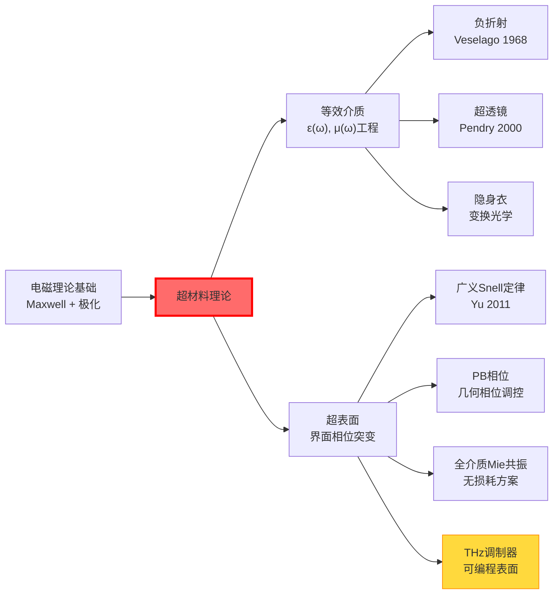
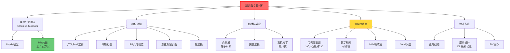

# 超表面与超材料

## 一句话物理图像

> 超材料的本质是**亚波长结构对电磁波的多极响应工程**：将原子尺度的极化/磁化机制（电子云畸变、轨道磁矩）替换为人工结构尺度的电偶极、磁偶极、电四极…响应，从而在宏观等效介质层面上实现自然界不存在的 $\epsilon(\omega)$ 和 $\mu(\omega)$。

## 零、动机与全景

### 为什么超材料是光学的"第二次革命"？

| 维度 | 传统光学 | 超材料/超表面 |
|------|---------|-------------|
| 响应来源 | 原子极化（~0.1 nm） | 人工结构极化（~λ/3） |
| 可调参数 | 材料种类、掺杂 | 结构几何 + 材料 + 排列 |
| 可实现 $\epsilon, \mu$ | 正值为主 | 任意值（含负、近零、梯度） |
| 器件厚度 | mm-cm（曲面） | 亚μm（平面） |
| 波前调控 | 依赖光程积累 | 界面相位突变 |



---

## 一、等效介质理论

### 1.1 物理基础：为什么亚波长结构等效于均匀介质？

当结构周期 $p \ll \lambda$ 时，电磁波"看不到"结构细节，只感受到平均极化响应。这就是等效介质的物理条件——**只有零级衍射存在**（高阶衍射波为倏逝波）。

### 1.2 Clausius-Mossotti 关系推导

**出发点**：一个极化率为 $\alpha$ 的球形粒子置于外场 $E_0$ 中。

**步骤1：局域场修正**

粒子感受到的不是 $E_0$，而是外场减去自身极化产生的退极化场：

$$E_{loc} = E_0 - \frac{P}{3\epsilon_0}$$

**步骤2：极化密度**

单位体积有 $N$ 个粒子，每个极化率 $\alpha$：

$$P = N\alpha\epsilon_0 E_{loc}$$

**步骤3：解出等效介电常数**

$$P = N\alpha\epsilon_0\left(E_0 - \frac{P}{3\epsilon_0}\right)$$

$$P = \frac{N\alpha}{1 - N\alpha/3}\epsilon_0 E_0$$

与 $P = \epsilon_0(\epsilon_r - 1)E_0$ 比较：

$$\boxed{\frac{\epsilon_r - 1}{\epsilon_r + 2} = \frac{N\alpha}{3}}$$

**物理含义**：知道单个粒子的极化率 $\alpha$，就能预测宏观 $\epsilon_r$。超材料设计的核心逻辑：**通过改变 $\alpha$（即结构几何）来定制 $\epsilon_r$**。

> [!concept] 超越Clausius-Mossotti
> CM关系假设粒子间距远小于波长且粒子间偶极-偶极相互作用弱。当粒子间距接近 $p \sim \lambda/3$ 时，需要考虑**多重散射**和**近场耦合**，等效介质模型需要高阶修正（如Maxwell-Garnett, Bruggeman公式）。

### 1.3 Drude模型：金属的色散响应

自由电子在外场中的运动方程：

$$m_e\ddot{x} + m_e\gamma\dot{x} = -eE_0 e^{-i\omega t}$$

稳态解 $x = x_0 e^{-i\omega t}$：

$$x_0 = \frac{eE_0}{m_e(\omega^2 + i\gamma\omega)}$$

极化率 $\chi = -n_e e x_0/(\epsilon_0 E_0) = -\omega_p^2/(\omega^2 + i\gamma\omega)$：

$$\boxed{\epsilon(\omega) = 1 - \frac{\omega_p^2}{\omega^2 + i\gamma\omega} = 1 - \frac{\omega_p^2}{\omega^2 + \gamma^2} + i\frac{\omega_p^2\gamma}{\omega(\omega^2+\gamma^2)}}$$

| 频率区间 | $\text{Re}(\epsilon)$ | 行为 |
|---------|----------------------|------|
| $\omega \ll \omega_p$ | 负，大 | 反射（金属光泽） |
| $\omega = \omega_p$ | $\approx 0$ | 等离子体振荡 |
| $\omega \gg \omega_p$ | $\to 1$ | 透明 |

> [!example] 数值：常见金属的等离子体频率
> | 金属 | $\omega_p$ (eV) | $\lambda_p$ (nm) | 可见光区 $\epsilon$ |
> |------|----------------|------------------|-------------------|
> | Au | 9.0 | 138 | 负（红外反射，可见有带间跃迁） |
> | Ag | 9.2 | 135 | 负（可见/红外反射） |
> | Al | 15.0 | 83 | 负（紫外反射） |
> 在 $\omega < \omega_p$ 的频率，$\text{Re}(\epsilon) < 0$ → 金属不支持传播模，光被反射。

---

## 二、超表面的相位调控原理

### 2.1 广义斯涅尔定律推导

**核心思想**：传统折射定律假设界面相位连续。超表面引入界面相位突变 $\Phi(x)$，等价于给光子额外的横向动量。

**推导**：

考虑界面上一段 $dx$ 的相位匹配。入射光沿界面的相位贡献 $k_0 n_i \sin\theta_i\,dx$，超表面引入相位突变 $\Phi(x) - \Phi(x+dx) = -(d\Phi/dx)\,dx$，折射光的相位 $k_0 n_t \sin\theta_t\,dx$。稳相条件（Fermat原理推广）：

$$k_0 n_i\sin\theta_i - k_0 n_t\sin\theta_t + \frac{d\Phi}{dx} = 0$$

$$\boxed{n_t\sin\theta_t - n_i\sin\theta_i = \frac{\lambda}{2\pi}\frac{d\Phi}{dx}}$$

**广义反射定律**：

$$\boxed{\sin\theta_r - \sin\theta_i = \frac{\lambda}{2\pi n_i}\frac{d\Phi}{dx}}$$

**关键推论**：

1. **异常折射**：正入射 $\theta_i = 0$ + 相位梯度 $d\Phi/dx \neq 0$ → $\theta_t \neq 0$
2. **全内反射突破**：$d\Phi/dx$ 可补偿 $n_i\sin\theta_i > n_t$ 的限制
3. **负折射可能**：$d\Phi/dx$ 足够大时 $\theta_t$ 可在法线同侧

> [!example] 数值：异常折射角
> $\lambda = 633$ nm，超表面周期 $p = 3200$ nm（8个单元 × 400 nm周期），覆盖 $2\pi$ 相位：
> $d\Phi/dx = 2\pi/3200\,\text{nm}^{-1}$
> 空气→玻璃（$n_t = 1.5$），正入射：
> $\sin\theta_t = 633/(2\pi\times1.5)\times2\pi/3200 = 0.132$，$\theta_t = 7.6°$

### 2.2 三种相位调控机制

| 机制 | 原理 | 相位范围 | 色散 | 偏振依赖 | 效率上限 |
|------|------|---------|------|---------|---------|
| **共振相位** | 天线长度/宽度改变谐振频率 | 0–π | 强（Lorentzian） | 有 | ~70% |
| **传输相位** | 介质柱有效光程 $k_0 n_{eff}(w)h$ | 0–2π | 弱 | 弱（若旋转对称则无） | ~95% |
| **几何相位（PB）** | 旋转各向异性结构角 $\theta$ → $\Phi = \pm 2\theta$ | 0–2π | **无色散** | 仅圆偏振 | ~50%（单层） |

**传输相位推导**：光通过高度 $h$、宽度 $w$ 的介质柱：

$$\Phi = k_0 n_{eff}(w) \cdot h$$

$n_{eff}(w)$ 由介质柱作为亚波长波导的基模决定——柱越宽，$n_{eff}$ 越接近柱材料折射率。

**PB相位推导**：各向异性结构（如椭圆柱）的Jones矩阵：

$$J(\theta) = R(-\theta)\begin{pmatrix}t_x&0\\0&t_y\end{pmatrix}R(\theta)$$

对圆偏振入射 $\mathbf{E}_{in} = \frac{1}{\sqrt{2}}\begin{pmatrix}1\\i\sigma\end{pmatrix}$（$\sigma = \pm 1$）：

$$J(\theta)\mathbf{E}_{in} = \frac{t_x+t_y}{2}\mathbf{E}_{in} + \frac{t_x-t_y}{2}e^{i2\sigma\theta}\begin{pmatrix}1\\-i\sigma\end{pmatrix}$$

第二项是**反旋圆偏振**，携带几何相位 $\Phi_{PB} = 2\sigma\theta$。第一项是同旋分量（无相位调控，构成噪声）。

> [!concept] 为什么PB相位无色散？
> $\Phi_{PB} = 2\sigma\theta$ 只取决于旋转角 $\theta$，与波长无关。这是**几何性质**（类似Berry相位），不是动力学性质。但注意：效率仍受 $t_x, t_y$ 的波长依赖性影响。

### 2.3 惠更斯超表面

传统超表面只调控电偶极响应 → 阻抗不匹配 → 反射。**惠更斯超表面**同时激发电偶极和磁偶极响应，实现阻抗匹配：

**条件**：$a_e = a_m$（电和磁极化率相等）

**Jones矩阵**（正入射）：

$$t = 1 + \frac{ik_0}{2\epsilon_0}(a_e + a_m), \quad r = \frac{ik_0}{2\epsilon_0}(a_e - a_m)$$

当 $a_e = a_m$：$r = 0$（零反射），$t = 1 + ik_0 a_e/\epsilon_0$（全透射 + 相位调控）。相位覆盖范围 $0$–$2\pi$ 需要极化率的模足够大。

### 2.4 全介质Mie共振超表面

金属超表面的根本问题是 **Ohmic损耗**。替代方案：高折射率介质柱利用 **Mie共振** 实现电/磁偶极响应。

**Mie共振条件**（介质球，半径 $a$，折射率 $n_s$）：

电偶极：$n_s k_0 a \approx \pi$（基模）

磁偶极：$n_s k_0 a \approx 2.74$（第一个磁模）

**关键**：通过调节介质柱的几何参数（直径 $d$、高度 $h$），可以独立调控电偶极和磁偶极共振的频率和强度 → 实现惠更斯条件。

| 材料 | 折射率 | 损耗 | 适用波段 |
|------|--------|------|---------|
| Si | 3.4–3.5 (IR) | 低 | 近红外-中红外 |
| TiO₂ | 2.4–2.6 (vis) | 极低 | 可见光 |
| GaN | 2.3–2.5 (vis) | 极低 | 可见光 |
| a-Si | 3.5–4.0 (NIR) | 中等 | 近红外 |

> [!example] 数值：Si纳米柱 Mie共振超表面
> $\lambda = 1550$ nm，Si柱高度 $h = 600$ nm，周期 $p = 800$ nm：
> - 直径 $d = 300$ nm：电偶极共振 @ 1500 nm
> - 直径 $d = 450$ nm：磁偶极共振 @ 1500 nm
> - 选择 $d = 380$ nm：电/磁偶极同时共振 → 惠更斯条件 → 透射率 > 95%，相位覆盖 0–2π

---

## 三、超透镜（Metalens）

### 3.1 相位分布推导

目标：平面波聚焦到焦距 $f$。等光程条件——所有路径光程相等：

$$\Phi(r) + k_0\sqrt{r^2 + f^2} = k_0 f + \Phi(0)$$

$$\boxed{\Phi(r) = -\frac{2\pi}{\lambda}\left(\sqrt{r^2 + f^2} - f\right)}$$

**近轴近似**（$r \ll f$）：$\Phi(r) \approx -\pi r^2/(\lambda f)$，与传统薄透镜一致。

### 3.2 数值孔径与衍射极限

$$NA = \frac{R}{\sqrt{R^2 + f^2}}$$

$$\boxed{\text{PSF} \approx \frac{\lambda}{2\,NA}}$$

> [!example] 数值：可见光超透镜
> $f = 3$ mm，直径 $2R = 2$ mm（$NA = 0.32$），$\lambda = 532$ nm：
> $\text{PSF} = 532/(2\times0.32) = 831$ nm ≈ $1.56\lambda$
>
> 同参数传统透镜 PSF 相同——超透镜的分辨率受限于 NA，不优于传统透镜。**优势在厚度、重量和集成性**。

### 3.3 色差与消色差

色差根源：$\Phi(r, \lambda) \propto 1/\lambda$，不同波长焦距不同。

**消色差条件**（宽带）：对 $\lambda_1$ 和 $\lambda_2$ 同时满足聚焦：

$$\Phi(r, \lambda_1) = -\frac{2\pi}{\lambda_1}(\sqrt{r^2+f^2}-f)$$
$$\Phi(r, \lambda_2) = -\frac{2\pi}{\lambda_2}(\sqrt{r^2+f^2}-f)$$

要求每个位置的超原子对两个波长提供**不同相位**——需要**色散工程**。

| 消色差方法 | 原理 | 带宽 | 效率 |
|-----------|------|------|------|
| 单层色散工程 | 选择具有特定色散的超原子 | 窄（~10%） | 高 |
| 多层堆叠 | 多超表面组合补偿色散 | 宽（~30%） | 中 |
| PB + 传输相位混合 | 几何相位无色散 + 传输相位调色散 | 宽 | 中 |
| 逆向设计 | 全局优化所有单元 | 宽（~50%） | 中 |

---

## 四、超材料的关键效应

### 4.1 负折射率（左手材料）

**Veselago 理论（1968）**：若 $\epsilon < 0$ 且 $\mu < 0$ 同时满足，则 $n = -\sqrt{|\epsilon\mu|}$。

**左手性**：$\vec{E}, \vec{H}, \vec{k}$ 构成左手系（而非通常的右手系）→ Poynting矢量 $\vec{S} = \vec{E}\times\vec{H}$ 与波矢 $\vec{k}$ **反向**。

**负折射的实现**：
- 负 $\epsilon$：细导线阵列（Drude模型，$\omega < \omega_p$）
- 负 $\mu$：开口环谐振器（SRR），等效 LC 回路，共振频率附近 $\mu$ 过零变负

**SRR等效磁导率**：

$$\mu_{eff}(\omega) = 1 - \frac{F\omega^2}{\omega^2 - \omega_m^2 + i\Gamma\omega}$$

在 $\omega_m < \omega < \omega_m/\sqrt{1-F}$ 区间：$\text{Re}(\mu_{eff}) < 0$。

**实验验证**：Shelby et al., Science 2001 — 微波10 GHz，铜SRR + 铜线，观测到负折射。

### 4.2 完美透镜（Pendry 2000）

传统透镜只收集**传播波**（$k_x < k_0$），**倏逝波**（$k_x > k_0$）在传播中指数衰减 → 分辨率极限 $\Delta \sim \lambda/2$。

负折射率平板（$n = -1$）能**恢复倏逝波**：界面处表面等离激元共振将倏逝波放大，补偿传播衰减。

$$E_{trans}(k_x, z) = E_0(k_x) e^{-|k_x|(z-d)}$$

$d$ 是板厚。当 $\epsilon = \mu = -1$ 时，所有 $k_x$ 分量完全恢复 → **理论上无限分辨率**。

实际限制：材料损耗（$\epsilon'' \neq 0$）将分辨率限制在 $\Delta \sim \lambda/20$ 量级。

### 4.3 变换光学与隐身衣

**变换光学**（Transformation Optics）：通过坐标变换 $x' = f(x)$ 设计空间变化的 $\epsilon(\vec{r}), \mu(\vec{r})$，引导光线沿弯曲路径传播。

**球形隐身衣**：将原点映射到 $r \in [0, R_1]$ 的区域（光线绕行区域）：

$$r' = R_1 + r\frac{R_2 - R_1}{R_2}$$

所需材料参数：

$$\epsilon_r = \mu_r = \frac{r - R_1}{r}, \quad \epsilon_\theta = \mu_\theta = \frac{r}{r - R_1}$$

实验验证：Schurig et al., Science 2006 — 微波段铜结构隐身衣。

---

## 五、太赫兹超表面

> [!important] 与你研究方向的直接连接
> THz波段（0.1-10 THz）是超表面的重要应用场景。THz波长 30 μm–3 mm，结构单元尺寸 ~10–500 μm → **加工精度要求低**（光刻甚至3D打印即可）。但THz波段缺乏天然功能材料 → 超表面几乎是唯一可行的波前调控方案。

### 5.1 THz波段超原子的特殊性

| 特征 | 光学波段 | THz波段 |
|------|---------|---------|
| 波长 | 400 nm – 2 μm | 30 μm – 3 mm |
| 单元尺寸 | 100-500 nm（EBL） | 10-500 μm（光刻/3D打印） |
| 常用材料 | Au/Ag, Si, TiO₂ | Au, ITO, graphene, VO₂, Si |
| 损耗来源 | 金属Ohmic + 辐射 | 金属Ohmic为主 |
| 调制手段 | 很少 | **丰富**（光/电/热/相变） |

### 5.2 可调/可编程THz超表面

**核心思路**：将THz超原子与可调材料（VO₂、石墨烯、半导体、液晶）结合，动态改变共振特性。

| 调制机制 | 材料 | 调制深度 | 速度 | 持久性 |
|---------|------|---------|------|--------|
| 热致相变 | VO₂（绝缘→金属，~68°C） | > 30 dB | ms | 可逆 |
| 光激发载流子 | Si/GaAs（飞秒光泵浦） | > 20 dB | ps-ns | 瞬态 |
| 电调控载流子 | 石墨烯（栅压调Fermi能级） | ~10 dB | ns-μs | 可逆 |
| 液晶旋向 | LC（电场调折射率） | ~15 dB | ms | 可逆 |
| 相变存储 | GST（非晶↔晶态） | > 20 dB | ns | 非易失 |

**数字编码超表面**（Cui 2014）：

将单元的反射相位量化为 $N$ bit。1-bit（2态：0°/180°），2-bit（4态：0°/90°/180°/270°）。通过FPGA控制每个单元的状态 → 实时编程波束方向、聚焦、散射模式。

### 5.3 THz宽带吸收器

经典结构：**金属-介质-金属（MIM）三层**

```
上层：亚波长金属结构（阻抗匹配层，调控等效Z）
中层：损耗介质（ε'' > 0，吸收层）
下层：连续金属膜（反射镜，阻止透射）
```

**完美吸收条件**：等效阻抗 $Z_{eff} = Z_0$（自由空间阻抗匹配）→ 零反射。光进入后被下层反射，在MIM腔内共振 → 能量完全耗散在介质层。

> [!example] 数值：THz MIM吸收器
> $f = 1$ THz（$\lambda = 300\,\mu$m），Au上层方环 $80\times80\,\mu$m，介质层聚酰亚胺 $d = 10\,\mu$m：
> 等效电路：$R_{rad} + j\omega L + 1/(j\omega C)$ 与自由空间阻抗 $Z_0 = 377\,\Omega$ 匹配
> 吸收率 > 99% @ 1 THz，带宽 ~20%（相对）

### 5.4 THz涡旋光束与OAM复用

超表面可产生携带轨道角动量（OAM）的涡旋光束。方位角方向线性相位梯度：

$$\Phi(\phi) = l\phi, \quad l = 0, \pm 1, \pm 2, \ldots$$

$l$ 是拓扑荷数。中心处相位奇点 → 暗核（零强度），环形强度分布。

**THz通信应用**：不同 $l$ 的涡旋光束相互正交 → 频分 + OAM分 → 信道容量倍增。超表面作为OAM复用/解复用器，体积远小于螺旋相位板。

---

## 六、BIC与高Q超表面

### 6.1 连续域束缚态（Bound States in the Continuum）

**问题**：超表面共振的Q因子通常 < 100（辐射损耗大）。如何实现超高Q？

**BIC**：在连续谱（辐射模）中存在的**局域束缚态**，不与辐射通道耦合 → $Q \to \infty$（理想情况）。

**对称保护BIC（symmetry-protected BIC）**：当超原子结构具有面内对称性（如 $C_2$ 或 $C_{2v}$）时，某些共振模式的辐射积分恰好为零：

$$\int \mathbf{E}_{res} \cdot \mathbf{E}_{rad}^* \, dV = 0$$

打破对称性（如微扰单元结构）→ BIC → 准BIC（quasi-BIC）→ 有限但极高的Q因子。

> [!example] 数值：全介质BIC超表面
> Si柱阵列，周期 $p = 600$ nm，柱高 $h = 200$ nm，$\lambda_{BIC} \approx 780$ nm：
> - 完美 $C_2$ 对称：Q > $10^6$（理论）
> - 引入 5% 非对称：Q ~ $10^4$
> - 引入 10% 非对称：Q ~ $10^3$
> 实验已实现 Q > 2000（可见光波段），用于传感和低阈值激光。

---

## 七、超表面设计方法

### 7.1 正向设计：参数扫描

**流程**：定义结构参数范围 → FDTD/FEM仿真 → 建立响应数据库 → 选择最优组合。

**限制**：高维参数空间 → 维度灾难。4个参数各10个取值 = $10^4$ 次仿真。

### 7.2 逆向设计

| 方法 | 原理 | 优势 | 劣势 |
|------|------|------|------|
| 深度学习 | 训练NN：结构→响应，逆映射 | 极快（推理ms级） | 泛化性差，需大量训练数据 |
| 遗传算法 | 适应性随机搜索 | 全局搜索 | 慢，不保证最优 |
| 拓扑优化 | 目标函数梯度驱动材料分布 | 可发现反直觉结构 | 需要adjoint method |

### 7.3 相位量化与效率

实际加工中相位取离散值（N-bit量化），衍射效率：

$$\eta_N = \left|\text{sinc}\left(\frac{1}{2^N}\right)\right|^2$$

| N-bit | 台阶数 | $\eta$ |
|-------|--------|--------|
| 1 | 2 | 40.5% |
| 2 | 4 | 81.1% |
| **3** | **8** | **95.0%** |
| 4 | 16 | 98.7% |

3-bit（8台阶）是工程折中标准。

---

## 八、应用全景

| 应用 | 相位机制 | 关键指标 | 代表工作 |
|------|---------|---------|---------|
| 超透镜 | 传输/PB | NA, 效率 | Khorasaninejad 2016 |
| 涡旋光束 | PB | OAM纯度 | Yu 2012 |
| 全息 | 传输 | SNR, 视角 | Zheng 2015 |
| 偏振控制 | PB | 消光比 | Chen 2017 |
| 波束偏转 | 共振 | 效率, 带宽 | Yu 2011 |
| 完美吸收 | 振幅 | 吸收率 | Liu 2010 |
| 隐身衣 | 梯度相位 | 散射抑制 | Ni 2015 |
| THz调制 | 可调材料 | MD, 速度 | 多组 |
| 结构色 | 传输 | 色纯度 | Yang 2019 |
| 光谱仪芯片 | 传输 | 分辨率 | Khorasaninejad 2016 |
| AR/VR | 传输 | FOV | 多组 |

---

## 九、知识树



---

## 十、延伸阅读

- [[电磁场理论基础]] — Maxwell方程 + Fresnel公式是广义Snell定律的出发点
- [[波动光学]] — 衍射理论限定超透镜分辨率
- [[纳米光学]] — 等离激元共振是金属超原子的物理基础
- [[近场光学]] — 倏逝波放大是完美透镜的机制
- [[半导体物理]] — 载流子调控用于可调THz超表面

---

## 参考文献

1. **[[cite:@Yu2011]]** — "Light Propagation with Phase Discontinuities: Generalized Laws of Reflection and Refraction", Science 2011 — 广义Snell定律
2. **[[cite:@Yu2014]]** — "Flat Optics with Metasurfaces", Science 2014 — 超表面综述
3. **[[cite:@Pendry2000]]** — "Negative Refraction Makes a Perfect Lens", PRL 2000 — 完美透镜理论
4. **[[cite:@Khorasaninejad2016]]** — "Metalenses at Visible Wavelengths", Science 2016 — 可见光超透镜
5. **[[cite:@Chen2017]]** — "A Broadband Achromatic Metalens for Focusing and Imaging in the Visible", Nature Nanotech 2017 — 消色差超透镜
6. **[[cite:@Cui2014]]** — "Coding Metamaterials, Digital Metamaterials and Programmable Metamaterials", Light: Sci. Appl. 2014 — 可编程超表面
7. **[[cite:@Shelby2001]]** — "Experimental Verification of a Negative Index of Refraction", Science 2001 — 负折射实验
8. **[[cite:@Schurig2006]]** — "Metamaterial Electromagnetic Cloak at Microwave Frequencies", Science 2006 — 隐身衣实验
9. **[[cite:@Kivshar2018]]** — "From Mie Theory to Mie Resonances", in "Nanoplasmonics", 全介质Mie共振综述
10. **[[cite:@Hsu2016]]** — "Bound states in the continuum", Nature Reviews Materials 2016 — BIC理论综述
