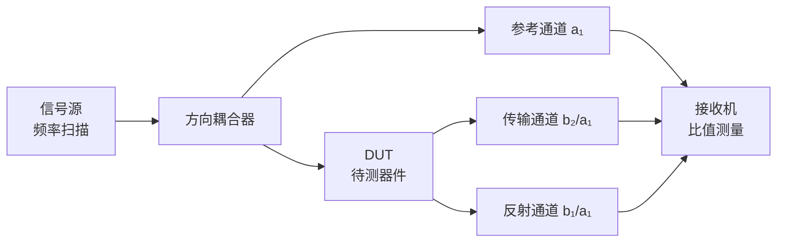
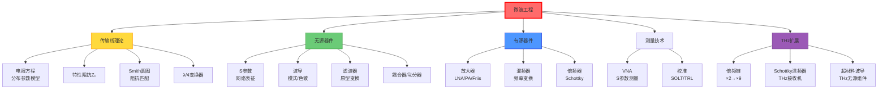

# 微波工程

## 一句话物理图像

> 微波工程是"用场而非路"处理高频电磁信号的技术——当电路尺寸与波长相当时，集总参数模型失效，必须用**分布参数模型**和**S参数**描述信号传输、反射与匹配。THz 技术是微波工程的自然延伸。

---

## 零、为什么微波需要专门的工程学？

### 频率范围与波段划分

| 频段 | 频率 | 波长 | 典型应用 |
|------|------|------|----------|
| L | 1-2 GHz | 30-15 cm | GPS, 4G |
| S | 2-4 GHz | 15-7.5 cm | WiFi, 雷达 |
| C | 4-8 GHz | 7.5-3.75 cm | 卫星通信 |
| X | 8-12 GHz | 3.75-2.5 cm | 雷达, 射电天文 |
| Ku | 12-18 GHz | 2.5-1.67 cm | 卫星电视 |
| K | 18-27 GHz | 16.7-11.1 mm | 5G mmWave |
| Ka | 27-40 GHz | 11.1-7.5 mm | 5G, 卫星 |
| V | 40-75 GHz | 7.5-4 mm | 60GHz WiFi |
| W | 75-110 GHz | 4-2.7 mm | 汽车雷达 |
| mmWave | 30-300 GHz | 10-1 mm | THz前端, 6G |
| Sub-THz | 0.1-1 THz | 3-0.3 mm | THz光谱/通信 |

### 集总 vs 分布——微波的分界线

**判断准则**：当电路尺寸 $l > \lambda/10$ 时，信号在电路上的传播延迟不可忽略，集总参数模型失效。

| 频率 | $\lambda$ | 集总模型有效的最大尺寸 |
|------|-----------|----------------------|
| 1 GHz | 30 cm | 3 cm |
| 10 GHz | 3 cm | 3 mm |
| 100 GHz | 3 mm | 0.3 mm |
| 1 THz | 300 μm | 30 μm |

> [!concept]+ 物理含义
> 低频电路中，整个电路在同一时刻处于同一电压——信号"瞬间"传遍。微波电路中，信号是**波**，不同位置有不同相位。这就是为什么微波工程必须从"路"切换到"场"的思维。
>
> **连接**：→ [[超表面与超材料]] 中超构单元的设计同样需要考虑相位累积。

---

## 一、传输线理论

### 1.1 分布参数模型

传输线用单位长度的 RLCG 参数建模：

```
  R/Δz   L/Δz       R/Δz   L/Δz
 ─┤├──┤├──┬──┤├──┤├──┬──┤├──┤├──
 │       │  │       │  │       │
 ─┤├──┤├──┴──┤├──┤├──┴──┤├──┤├──
  G/Δz   C/Δz       G/Δz   C/Δz
```

对长度 $\Delta z$ 取极限，得到**电报方程 (Telegrapher's Equations)**：

$$\boxed{\frac{\partial V}{\partial z} = -(R + j\omega L)\,I}$$

$$\boxed{\frac{\partial I}{\partial z} = -(G + j\omega C)\,V}$$

对 $z$ 再求导，消去 $I$（或 $V$），得到波动方程：

$$\frac{\partial^2 V}{\partial z^2} = \gamma^2 V, \quad \gamma = \sqrt{(R+j\omega L)(G+j\omega C)}$$

**一般解**（正反向行波叠加）：

$$V(z) = V_0^+ e^{-\gamma z} + V_0^- e^{+\gamma z}$$

$$I(z) = \frac{V_0^+}{Z_0} e^{-\gamma z} - \frac{V_0^-}{Z_0} e^{+\gamma z}$$

### 1.2 特性阻抗

$$Z_0 = \sqrt{\frac{R + j\omega L}{G + j\omega C}}$$

低损耗近似 ($R \ll \omega L$, $G \ll \omega C$)：

$$Z_0 \approx \sqrt{\frac{L}{C}}$$

| 传输线类型 | $Z_0$ 公式 | 典型值 | 频率上限 |
|-----------|-----------|--------|---------|
| 同轴线 | $\frac{1}{2\pi}\sqrt{\mu/\epsilon}\ln(b/a)$ | 50/75 Ω | ~50 GHz |
| 微带线 | $\frac{60}{\sqrt{\epsilon_{eff}}}\ln(8h/w + w/4h)$ | 25-120 Ω | ~100 GHz |
| 共面波导 | 数值计算 | 20-100 Ω | ~200 GHz |
| 矩形波导 | 模式依赖 | 几百 Ω | >300 GHz |

**数值示例**——同轴线 ($Z_0 = 50\,\Omega$)：

$$\frac{b}{a} = e^{2\pi \times 50\sqrt{\epsilon_r}/60}$$

$\epsilon_r = 2.2$ (PTFE) → $b/a \approx 3.38$ → 若外径 $2b = 2.2$ mm，则内径 $2a = 0.65$ mm。

### 1.3 传播常数

$$\gamma = \alpha + j\beta = \sqrt{(R + j\omega L)(G + j\omega C)}$$

低损耗近似：

$$\alpha \approx \frac{R}{2Z_0} + \frac{GZ_0}{2}, \quad \beta \approx \omega\sqrt{LC}$$

| 参数 | 含义 | 单位 |
|------|------|------|
| $\alpha$ | 衰减常数 | Np/m（或 dB/m，$1\,\text{Np} = 8.686\,\text{dB}$） |
| $\beta = 2\pi/\lambda_g$ | 相位常数 | rad/m |
| $\lambda_g$ | 导波波长 | m |

### 1.4 反射系数与驻波

负载 $Z_L$ 处的反射系数：

$$\boxed{\Gamma_L = \frac{Z_L - Z_0}{Z_L + Z_0}}$$

沿线任意位置的反射系数：$\Gamma(z) = \Gamma_L e^{-2\gamma z}$

输入阻抗（距离负载 $d$ 处）：

$$Z_{in} = Z_0\frac{Z_L + jZ_0\tan\beta d}{Z_0 + jZ_L\tan\beta d}$$

| $|\Gamma|$ | VSWR | 回波损耗 | 状态 |
|-----------|------|---------|------|
| 0 | 1.0 | ∞ dB | 完美匹配 |
| 0.1 | 1.22 | 20 dB | 良好 |
| 0.2 | 1.50 | 14 dB | 可接受 |
| 0.5 | 3.0 | 6 dB | 差 |
| 1.0 | ∞ | 0 dB | 全反射 |

**数值示例**——$Z_L = 75\,\Omega$ 接到 $Z_0 = 50\,\Omega$ 传输线：

$$\Gamma = \frac{75-50}{75+50} = 0.2, \quad \text{VSWR} = 1.5, \quad \text{回波损耗} = 14\,\text{dB}$$

14% 的功率被反射——对精密系统来说太差，需要阻抗匹配。

---

## 二、Smith 圆图

### 2.1 基本映射

将复阻抗平面 $z = r + jx$ 映射到反射系数平面 $\Gamma = u + jv$：

$$\Gamma = \frac{z - 1}{z + 1}$$

| 曲线 | 方程 | 含义 |
|------|------|------|
| 等电阻圆 | $\left(u - \frac{r}{r+1}\right)^2 + v^2 = \frac{1}{(r+1)^2}$ | 恒定 $r$ |
| 等电抗圆 | $(u-1)^2 + \left(v - \frac{1}{x}\right)^2 = \frac{1}{x^2}$ | 恒定 $x$ |
| 等 VSWR 圆 | $u^2 + v^2 = |\Gamma|^2$ | 恒定 $|\Gamma|$ |

> [!tip]+ Smith 圆图的用法
> 1. 找到归一化负载阻抗 $z_L = Z_L/Z_0$ 对应的点
> 2. 沿等 $|\Gamma|$ 圆（顺时针=向源方向）移动
> 3. 每移动一圈 = $\lambda/2$，半圈 = $\lambda/4$
> 4. 读出新的 $z_{in}$

### 2.2 阻抗匹配方法

| 方法 | 原理 | 带宽 | 适用场景 |
|------|------|------|----------|
| 单枝节匹配 | 一段开路/短路枝节提供电抗补偿 | 窄 | 固定频率 |
| 双枝节匹配 | 两段可调枝节 | 中 | 可调频率 |
| $\lambda/4$ 变换器 | $Z_T = \sqrt{Z_0 Z_L}$ | 窄 | 实阻抗匹配 |
| 渐变线 | 阻抗连续渐变 | 宽带 | 宽频带 |
| 多节 $\lambda/4$ | 多级变换 | 宽带 | 高性能 |

**$\lambda/4$ 变换器推导**：

$$Z_{in} = Z_T\frac{Z_L + jZ_T\tan(\beta\lambda/4)}{Z_T + jZ_L\tan(\beta\lambda/4)}$$

当 $d = \lambda/4$ 时，$\beta d = \pi/2$，$\tan(\pi/2) \to \infty$：

$$Z_{in} = \frac{Z_T^2}{Z_L}$$

匹配条件 $Z_{in} = Z_0$：

$$\boxed{Z_T = \sqrt{Z_0 Z_L}}$$

**数值示例**——匹配 $Z_L = 100\,\Omega$ 到 $Z_0 = 50\,\Omega$：

$$Z_T = \sqrt{50 \times 100} = 70.7\,\Omega$$

---

## 三、S 参数 (Scattering Parameters)

### 3.1 定义

微波网络用入射波 $a_i$ 和反射波 $b_i$ 表征：

$$\begin{pmatrix} b_1 \\ b_2 \end{pmatrix} = \begin{pmatrix} S_{11} & S_{12} \\ S_{21} & S_{22} \end{pmatrix} \begin{pmatrix} a_1 \\ a_2 \end{pmatrix}$$

其中 $a_i = V_i^+/\sqrt{Z_0}$，$b_i = V_i^-/\sqrt{Z_0}$，$|a_i|^2$ 和 $|b_i|^2$ 是功率。

### 3.2 二端口 S 参数的物理意义

| 参数 | 定义 | 物理含义 | 理想值 |
|------|------|----------|--------|
| $S_{11}$ | $b_1/a_1 \|_{a_2=0}$ | 输入反射系数 | 0（无反射） |
| $S_{21}$ | $b_2/a_1 \|_{a_2=0}$ | 正向传输系数 | 1（无损传输） |
| $S_{12}$ | $b_1/a_2 \|_{a_1=0}$ | 反向传输系数（隔离度） | 0（单向）或1（互易） |
| $S_{22}$ | $b_2/a_2 \|_{a_1=0}$ | 输出反射系数 | 0 |

### 3.3 常见组件的 S 参数

| 组件 | $S_{11}$ | $S_{21}$ | $S_{12}$ | $S_{22}$ |
|------|---------|---------|---------|---------|
| 理想传输线 | 0 | $e^{-j\beta l}$ | $e^{-j\beta l}$ | 0 |
| 衰减器 (A dB) | 0 | $10^{-A/20}$ | $10^{-A/20}$ | 0 |
| 理想放大器 | 0 | $G$ (增益) | 0 | 0 |
| 理想隔离器 | 0 | 1 | 0 | 0 |

### 3.4 ABCD 参数与级联

$$\begin{pmatrix} V_1 \\ I_1 \end{pmatrix} = \begin{pmatrix} A & B \\ C & D \end{pmatrix} \begin{pmatrix} V_2 \\ -I_2 \end{pmatrix}$$

常用组件的 ABCD 矩阵：

| 组件 | ABCD 矩阵 |
|------|-----------|
| 串联阻抗 $Z$ | $\begin{pmatrix}1&Z\\0&1\end{pmatrix}$ |
| 并联导纳 $Y$ | $\begin{pmatrix}1&0\\Y&1\end{pmatrix}$ |
| 传输线 (长 $l$) | $\begin{pmatrix}\cos\beta l & jZ_0\sin\beta l \\ j\sin\beta l/Z_0 & \cos\beta l\end{pmatrix}$ |
| 变压器 (n:1) | $\begin{pmatrix}n&0\\0&1/n\end{pmatrix}$ |

**级联规则**：$[ABCD]_{total} = [ABCD]_1 \times [ABCD]_2 \times \cdots$

> [!concept]+ 为什么用 S 参数而非 Z 参数
> 高频下开路/短路条件难以实现（开路线在 $\lambda/4$ 处短路，短路线在高频有寄生电感）。S 参数以**匹配负载**为参考条件（$a_2=0$ 意味着端口2接 $Z_0$），这在微波测量中容易实现——这就是 VNA 的工作原理。

---

## 四、波导理论

### 4.1 矩形波导模式

波导截面 $a \times b$ ($a > b$)，截止频率：

$$f_{c,mn} = \frac{c}{2}\sqrt{\left(\frac{m}{a}\right)^2 + \left(\frac{n}{b}\right)^2}$$

| 模式 | 截止频率 | 应用 |
|------|---------|------|
| TE₁₀ | $c/(2a)$ | **主模**，最常用 |
| TE₂₀ | $c/a$ | 高阶模 |
| TE₀₁ | $c/(2b)$ | 高阶模 |
| TE₁₁/TM₁₁ | $\frac{c}{2}\sqrt{1/a^2+1/b^2}$ | 混合模 |

**数值示例**——WR-10 波导 ($a = 2.54$ mm, $b = 1.27$ mm)：

$$f_{c,10} = \frac{3\times10^{11}}{2\times2.54} = 59.05\,\text{GHz}$$

工作频率 75-110 GHz，TE₁₀ 单模传输（$f_{c,20} = 118$ GHz 不激发）。

### 4.2 导波波长与色散

$$\lambda_g = \frac{\lambda_0}{\sqrt{1-(f_c/f)^2}}$$

$$v_p = \frac{c}{\sqrt{1-(f_c/f)^2}} > c, \quad v_g = c\sqrt{1-(f_c/f)^2} < c, \quad v_p \cdot v_g = c^2$$

> [!concept]+ 物理图像
> 波导中的波像"弹球"在壁间反射前进。反射使等效路径变长，相速度"看起来"超光速，但能量传播速度（群速度）小于 $c$。$v_p v_g = c^2$ 是这个弹球模型的直接推论。
>
> **极限**：当 $f \to f_c$ 时，$v_p \to \infty$，$v_g \to 0$——波"停止"传播，截止。

### 4.3 常用矩形波导标准

| 波导型号 | 频率范围 (GHz) | 截面 (mm) | $f_c$ (GHz) |
|----------|--------------|-----------|------------|
| WR-90 | 8.2-12.4 | 22.86×10.16 | 6.56 |
| WR-62 | 12.4-18.0 | 15.80×7.90 | 9.49 |
| WR-28 | 26.5-40.0 | 7.11×3.56 | 21.08 |
| WR-15 | 50-75 | 3.76×1.88 | 39.87 |
| WR-10 | 75-110 | 2.54×1.27 | 59.05 |
| WR-6.5 | 110-170 | 1.65×0.83 | 90.90 |
| WR-3 | 220-330 | 0.86×0.43 | 174 |

---

## 五、微波滤波器

### 5.1 滤波器类型

| 类型 | 频率响应 | 特点 |
|------|---------|------|
| Butterworth | 最平坦通带 | 群延迟变化小 |
| Chebyshev (Type I) | 通带等波纹 | 过渡带最陡 |
| Elliptic | 通带+阻带等波纹 | 过渡带最陡，结构复杂 |
| Bessel | 最平坦群延迟 | 脉冲保形好 |

### 5.2 低通原型到带通变换

| 变换 | 频率映射 |
|------|----------|
| 低通→高通 | $\omega \to 1/\omega$ |
| 低通→带通 | $\omega \to (\omega^2 - \omega_0^2)/(B\omega)$ |
| 低通→带阻 | $\omega \to B\omega/(\omega^2 - \omega_0^2)$ |

$B$ = 带宽，$\omega_0$ = 中心频率。

### 5.3 微波滤波器实现

| 结构 | 频段 | Q值 | 特点 |
|------|------|-----|------|
| 微带线枝节 | <20 GHz | ~100 | 平面工艺，集成 |
| 介质谐振器 | 1-30 GHz | ~5000 | 高Q，体积小 |
| 波导腔体 | 1-100 GHz | ~10000 | 最高Q |
| SIW | 10-60 GHz | ~500 | 平面波导 |

---

## 六、耦合器与功分器

### 6.1 定向耦合器

四端口器件，用耦合度 $C$、方向性 $D$、隔离度 $I$ 表征：

| 参数 | 定义 | 典型值 |
|------|------|--------|
| 耦合度 $C$ | $-20\log|S_{31}|$ | 3-30 dB |
| 方向性 $D$ | $-20\log|S_{31}/S_{32}|$ | 20-40 dB |
| 隔离度 $I$ | $-20\log|S_{41}|$ | 20-50 dB |

### 6.2 常见功分器

| 类型 | 原理 | 带宽 | 隔离 |
|------|------|------|------|
| Wilkinson | $\lambda/4$ 变换 + 隔离电阻 | 窄 | 好（>20 dB） |
| T型结 | 简单分叉 | 宽 | 无 |
| Gysel | 多 $\lambda/4$ + 负载电阻 | 宽 | 好 |
| Rat-race | 环形混合网络 | 中 | 好 |

---

## 七、微波有源器件

### 7.1 放大器

| 类型 | 关键指标 | 典型参数 |
|------|---------|---------|
| LNA | 噪声系数 NF | 0.5-3 dB @ 10 GHz |
| PA | 输出功率, PAE | 1-100 W, 30-60% |
| 宽带放大器 | 带宽 | DC-40 GHz |

噪声系数与 Friis 公式：

$$F = 1 + \frac{T_e}{T_0} = \frac{SNR_{in}}{SNR_{out}}$$

$$\boxed{F_{total} = F_1 + \frac{F_2-1}{G_1} + \frac{F_3-1}{G_1 G_2} + \cdots}$$

> [!tip]+ 设计启示
> 第一级放大器的噪声系数对整体影响最大。LNA 设计核心：最小噪声匹配（$\Gamma_{opt}$）而非最大功率匹配。

### 7.2 混频器

频率变换：$f_{IF} = |f_{RF} \pm f_{LO}|$

| 类型 | 变频损耗 | 隔离度 | 应用 |
|------|---------|--------|------|
| 单端混频器 | ~6 dB | 差 | 简单系统 |
| 单平衡 | ~6 dB | 好 | 通用 |
| 双平衡 | ~6 dB | 很好 | 高性能 |
| 次谐波混频器 | ~8 dB | 好 | THz 频段 |

### 7.3 THz 倍频器

利用半导体非线性（Schottky 二极管）产生谐波：

| 倍频次数 | 典型效率 | 输出功率 |
|----------|---------|---------|
| ×2 | 10-30% | mW @ 200 GHz |
| ×3 | 5-15% | μW-mW @ 300 GHz |
| ×6 | 1-5% | μW @ 600 GHz |
| ×9+ | <1% | μW 以下 @ 1 THz |

小信号近似：$P_{out}(Nf_0) \propto P_{in}^N$

---

## 八、VNA 测量原理

### 8.1 矢量网络分析仪结构

VNA 是微波测量的核心工具，测量 S 参数的**幅度和相位**：



### 8.2 校准方法

| 校准方法 | 步骤 | 消除误差 | 精度 |
|----------|------|---------|------|
| SOLT | 短路-开路-负载-直通 | 12项系统误差 | 高（同轴） |
| TRL | 直通-反射-线 | 8项误差 | 高（波导/在片） |
| SOL | 短路-开路-负载 | 6项误差 | 中 |

> [!tip]+ 为什么需要校准
> VNA 测量的是测试端口到 DUT 之间**整个路径**的 S 参数，包括电缆、连接器、探针的损耗和反射。校准通过已知标准件建立参考面，数学上消除这些系统误差。

---

## 九、THz 频段的微波工程实践

> 基于 RAG 库中的 [[cite:@THzRoadmap2017]] (2017 THz Science and Technology Roadmap)

### 9.1 Schottky 二极管混频器 — THz 接收机核心

**Schottky 混频器性能数据** (来自 [[cite:@THzRoadmap2017]] Figure 25)：

| 频率 (GHz) | DSB 噪声温度 (K) | 本振功率 (mW) | 倍频次数 |
|------------|-----------------|--------------|---------|
| 100-200 | 300-800 | 1-5 | ×6 |
| 200-500 | 800-3000 | 5-20 | ×9 |
| 500-1000 | 3000-15000 | 10-50 | ×18 |
| 1000-2500 | >15000 | >50 | ×27 |

> [!concept]+ 关键洞察
> DSB 噪声温度随频率近似线性增长（~50× 量子极限），这是 Schottky 混频器在超高频下的根本瓶颈。[[cite:@THzRoadmap2017]]

### 9.2 THz 无源波导组件

| 组件 | 频率 | 插入损耗 | 特点 |
|------|------|---------|------|
| 金属管波导 | 1-3 THz | <1 dB/cm | 表面微加工 |
| 超材料 CP 波导 | 0.3-1 THz | ~2 dB/cm | 集成极化控制 |
| 弯曲波导 | 2-3 THz | ~3 dB/弯 | meandered 结构 |

---

## 十、知识树



---

## 参考文献

1. **[[cite:@Pozar2011]]** — "Microwave Engineering", 4th ed., 微波工程标准教材
2. **[[cite:@Collin2000]]** — "Foundations for Microwave Engineering", 经典教材
3. **[[cite:@Maas1993]]** — "Microwave Mixers", 混频器设计
4. **[[cite:@Maas2003]]** — "Nonlinear Microwave and RF Circuits", 非线性电路
5. **[[cite:@THzRoadmap2017]]** — "The 2017 terahertz science and technology roadmap", *J. Phys. D* 50, 043001 (2017). **RAG 库收录**
6. **[[cite:@Nanni2015]]** — Nanni et al., "Terahertz-driven linear electron acceleration", *Nature Commun.* 6, 1 (2015). **RAG 库收录**

---

## 延伸阅读

- [[无线通信原理]] — 微波通信系统
- [[半导体工艺]] — 微波器件制造
- [[超表面与超材料]] — 超构表面的阻抗匹配与 S 参数设计
- [[电磁场理论基础]] — Maxwell 方程与边界条件

---

*最后更新：2026-06-05*
