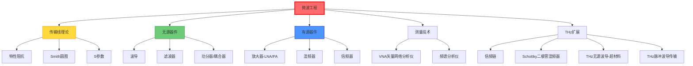

# 微波工程

## 一句话物理图像

> 微波是"看不见的尺子"——用 GHz 频率的电磁波测量距离、传输数据，像无线电的精密升级版

## 频率范围与波段划分

| 频段 | 频率 | 波长 | 典型应用 |
|------|------|------|----------|
| L | 1-2 GHz | 30-15 cm | GPS, 4G |
| S | 2-4 GHz | 15-7.5 cm | WiFi, 雷达 |
| C | 4-8 GHz | 7.5-3.75 cm | 卫星通信 |
| X | 8-12 GHz | 3.75-2.5 cm | 雷达, 射电天文 |
| Ku | 12-18 GHz | 2.5-1.67 cm | 卫星电视 |
| K | 18-27 GHz | 16.7-11.1 mm | 5G mmWave |
| Ka | 27-40 GHz | 11.1-7.5 mm | 5G, 卫星 |
| V | 40-75 GHz | 7.5-4 mm | 60GHz WiFi |
| W | 75-110 GHz | 4-2.7 mm | 汽车雷达 |
| mmWave | 30-300 GHz | 10-1 mm | THz前端, 6G |
| Sub-THz | 0.1-1 THz | 3-0.3 mm | THz光谱/通信 |

> [!tip]+ 微波→THz的连续性
> THz技术是微波工程的自然延伸。倍频链从几十 GHz 倍频到 THz，功放和混频器设计方法一脉相承。

---

## 传输线理论

### 传输线方程 (Telegrapher's Equations)

分布参数模型：单位长度电阻 $R$，电感 $L$，电导 $G$，电容 $C$。

$$\frac{\partial V}{\partial z} = -(R + j\omega L) \, I$$

$$\frac{\partial I}{\partial z} = -(G + j\omega C) \, V$$

### 特性阻抗

$$Z_0 = \sqrt{\frac{R + j\omega L}{G + j\omega C}}$$

对于低损耗线 ($R \ll \omega L$, $G \ll \omega C$)：

$$Z_0 \approx \sqrt{\frac{L}{C}}$$

常用传输线的 $Z_0$：

| 传输线类型 | 典型 $Z_0$ | 频率上限 |
|-----------|-----------|---------|
| 同轴线 | 50 Ω / 75 Ω | ~50 GHz |
| 微带线 | 25-120 Ω | ~100 GHz |
| 带状线 | 30-150 Ω | ~100 GHz |
| 共面波导 | 20-100 Ω | ~200 GHz |
| 矩形波导 | 几百 Ω (模式依赖) | >300 GHz |

### 传播常数

$$\gamma = \alpha + j\beta = \sqrt{(R + j\omega L)(G + j\omega C)}$$

| 参数 | 含义 |
|------|------|
| $\alpha$ | 衰减常数 (Np/m) |
| $\beta = 2\pi/\lambda_g$ | 相位常数 (rad/m) |
| $\lambda_g$ | 导波波长 |

### 反射系数与驻波

$$\Gamma(z) = \frac{Z_L - Z_0}{Z_L + Z_0} \, e^{-2\gamma z}$$

| 参数 | 公式 | 含义 |
|------|------|------|
| VSWR | $\frac{1+|\Gamma|}{1-|\Gamma|}$ | 驻波比 |
| 回波损耗 | $-20\log_{10}|\Gamma|$ (dB) | 反射功率 |
| 插入损耗 | $-20\log_{10}|S_{21}|$ (dB) | 传输损耗 |

| $|\Gamma|$ | VSWR | 回波损耗 | 状态 |
|-----------|------|---------|------|
| 0 | 1.0 | ∞ dB | 完美匹配 |
| 0.1 | 1.22 | 20 dB | 良好 |
| 0.2 | 1.50 | 14 dB | 可接受 |
| 0.5 | 3.0 | 6 dB | 差 |
| 1.0 | ∞ | 0 dB | 全反射 |

---

## Smith 圆图

阻抗匹配的核心工具，将复阻抗平面映射到单位圆。

$$\Gamma = \frac{Z - Z_0}{Z + Z_0} = \frac{z - 1}{z + 1}$$

其中 $z = Z/Z_0 = r + jx$ 是归一化阻抗。

### Smith 圆图上的关键曲线

| 曲线 | 方程 | 含义 |
|------|------|------|
| 等电阻圆 | $\left(u - \frac{r}{r+1}\right)^2 + v^2 = \frac{1}{(r+1)^2}$ | 恒定 $r$ |
| 等电抗圆 | $(u-1)^2 + \left(v - \frac{1}{x}\right)^2 = \frac{1}{x^2}$ | 恒定 $x$ |
| 等 VSWR 圆 | $u^2 + v^2 = |\Gamma|^2$ | 恒定 $|\Gamma|$ |

### 阻抗匹配方法

| 方法 | 原理 | 带宽 | 适用场景 |
|------|------|------|----------|
| 单枝节匹配 | 一段开路/短路枝节 | 窄 | 固定频率 |
| 双枝节匹配 | 两段可调枝节 | 中 | 可调频率 |
| 四分之一波长变换器 | $\lambda/4$ 传输线段 | 窄 | 实阻抗匹配 |
| 渐变线 | 阻抗连续渐变 | 宽带 | 宽频带 |
| 多节匹配网络 | 多级 $\lambda/4$ 变换 | 宽带 | 高性能 |

---

## S 参数 (Scattering Parameters)

微波网络的标准化表征方法，基于入射波 $a_i$ 和反射波 $b_i$：

$$\begin{pmatrix} b_1 \\ b_2 \end{pmatrix} = \begin{pmatrix} S_{11} & S_{12} \\ S_{21} & S_{22} \end{pmatrix} \begin{pmatrix} a_1 \\ a_2 \end{pmatrix}$$

### 二端口 S 参数物理意义

| 参数 | 定义 | 物理含义 |
|------|------|----------|
| $S_{11}$ | $b_1/a_1 \|_{a_2=0}$ | 输入反射系数 |
| $S_{21}$ | $b_2/a_1 \|_{a_2=0}$ | 正向传输系数 |
| $S_{12}$ | $b_1/a_2 \|_{a_1=0}$ | 反向传输系数 |
| $S_{22}$ | $b_2/a_2 \|_{a_1=0}$ | 输出反射系数 |

### 与其他参数的转换

| 参数组 | 变量对 | 适用场景 |
|--------|--------|----------|
| S 参数 | 入射/反射波功率 | 高频测量 |
| Z 参数 | 开路电压/电流 | 理论分析 |
| Y 参数 | 短路电流/电压 | 并联电路 |
| ABCD 参数 | 级联分析 | 级联网络 |
| T 参数 | 波传输 | 级联网络 |

ABCD 矩阵级联：

$$\begin{pmatrix} V_1 \\ I_1 \end{pmatrix} = \begin{pmatrix} A & B \\ C & D \end{pmatrix} \begin{pmatrix} V_2 \\ -I_2 \end{pmatrix}$$

总矩阵 = 各级矩阵之积：$[ABCD]_{total} = [ABCD]_1 \times [ABCD]_2 \times \cdots$

---

## 波导理论

### 矩形波导模式

波导截面 $a \times b$ ($a > b$)，传播条件：$f > f_c$。

截止频率：

$$f_{c,mn} = \frac{c}{2}\sqrt{\left(\frac{m}{a}\right)^2 + \left(\frac{n}{b}\right)^2}$$

| 模式 | 截止频率 | 应用 |
|------|---------|------|
| TE₁₀ | $c/(2a)$ | 主模，最常用 |
| TE₂₀ | $c/a$ | 高阶模 |
| TE₀₁ | $c/(2b)$ | 高阶模 |
| TE₁₁/TM₁₁ | $\frac{c}{2}\sqrt{1/a^2 + 1/b^2}$ | 混合模 |

常用矩形波导标准：

| 波导型号 | 频率范围 (GHz) | 截面 (mm) | $f_c$ (GHz) |
|----------|--------------|-----------|------------|
| WR-90 | 8.2-12.4 | 22.86×10.16 | 6.56 |
| WR-62 | 12.4-18.0 | 15.80×7.90 | 9.49 |
| WR-28 | 26.5-40.0 | 7.11×3.56 | 21.08 |
| WR-15 | 50-75 | 3.76×1.88 | 39.87 |
| WR-10 | 75-110 | 2.54×1.27 | 59.05 |
| WR-6.5 | 110-170 | 1.65×0.83 | 90.90 |

### 波导中的传播特性

导波波长：

$$\lambda_g = \frac{\lambda_0}{\sqrt{1-(f_c/f)^2}}$$

相速度与群速度：

$$v_p = \frac{c}{\sqrt{1-(f_c/f)^2}} > c \quad (\text{超光速，不传信息})$$

$$v_g = c\sqrt{1-(f_c/f)^2} < c \quad (\text{能量传播速度})$$

$$v_p \cdot v_g = c^2$$

> [!concept]+ 物理图像
> 波导中的波像"弹球"一样在壁间反射前进。反射使等效路径变长，相速度"看起来"超光速，但能量沿波导方向的实际传播速度（群速度）小于 $c$。

---

## 微波滤波器

### 滤波器类型

| 类型 | 频率响应 | 特点 |
|------|---------|------|
| Butterworth | 最平坦通带 | 群延迟变化小 |
| Chebyshev (Type I) | 通带等波纹 | 过渡带最陡 |
| Elliptic | 通带+阻带等波纹 | 过渡带最陡，结构复杂 |
| Bessel | 最平坦群延迟 | 脉冲保形好 |

### 低通原型到带通变换

归一化低通原型 $\to$ 实际滤波器：

| 变换 | 目标 | 频率映射 |
|------|------|----------|
| 低通→高通 | 高通滤波器 | $\omega \to 1/\omega$ |
| 低通→带通 | 带通滤波器 | $\omega \to (\omega^2 - \omega_0^2)/(B\omega)$ |
| 低通→带阻 | 带阻滤波器 | $\omega \to B\omega/(\omega^2 - \omega_0^2)$ |

$B$ = 带宽，$\omega_0$ = 中心频率。

### 微波滤波器实现

| 结构 | 频段 | Q值 |
|------|------|-----|
| 微带线枝节 | <20 GHz | ~100 |
| 介质谐振器 | 1-30 GHz | ~5000 |
| 波导腔体 | 1-100 GHz | ~10000 |
| SIW | 10-60 GHz | ~500 |

---

## 微波有源器件

### 放大器

| 类型 | 关键指标 | 典型参数 |
|------|---------|---------|
| LNA (低噪声放大器) | 噪声系数 NF | 0.5-3 dB @ 10 GHz |
| PA (功率放大器) | 输出功率, PAE | 1-100 W, 30-60% PAE |
| 宽带放大器 | 带宽 | DC-40 GHz |

噪声系数：

$$F = 1 + \frac{T_e}{T_0} = \frac{SNR_{in}}{SNR_{out}}$$

级联噪声系数 (Friis 公式)：

$$F_{total} = F_1 + \frac{F_2 - 1}{G_1} + \frac{F_3 - 1}{G_1 G_2} + \cdots$$

> [!tip]+ 设计启示
> 第一级放大器的噪声系数对整体影响最大。LNA 设计核心：最小噪声匹配（$\Gamma_{opt}$）而非最大功率匹配。

### 混频器

频率变换：$f_{IF} = |f_{RF} \pm f_{LO}|$

| 类型 | 变频损耗 | 隔离度 | 应用 |
|------|---------|--------|------|
| 单端混频器 | ~6 dB | 差 | 简单系统 |
| 单平衡 | ~6 dB | 好 | 通用 |
| 双平衡 | ~6 dB | 很好 | 高性能 |
| 次谐波混频器 | ~8 dB | 好 | THz 频段 |

### THz 倍频器

利用半导体非线性（Schottky 二极管）产生谐波：

| 倍频次数 | 典型效率 | 输出功率 |
|----------|---------|---------|
| ×2 (倍频) | 10-30% | mW 级 @ 200 GHz |
| ×3 (三倍频) | 5-15% | μW-mW @ 300 GHz |
| ×6 (六倍频) | 1-5% | μW @ 600 GHz |
| ×9+ | <1% | μW 以下 @ 1 THz |

串联/并联拓扑：

$$P_{out}(Nf_0) \propto P_{in}^N \quad (\text{小信号近似})$$

---

## THz 频段的微波工程实践

> 以下内容基于 RAG 库中的 [[cite:@THzRoadmap2017]] (2017 THz Science and Technology Roadmap)

### Schottky 二极管混频器 — THz 接收机核心

根据 [[cite:@THzRoadmap2017]] Section 16，Schottky 二极管混频器是当前 THz 频段最成熟的检测技术：

![[fa8088acbae42ed0_p43_f25.png]]
*Figure 25 from [[cite:@THzRoadmap2017]]: THz 频段 Schottky 混频器系统。(a) 光子集成电路集成 MMI 耦合器、SOA、2×2 调制器；(b) 双 DBR 激光器集成在 4.1 mm 芯片上；(c) OPLL 系统中 Schottky 二极管混频器与梳状发生器和相位检测器集成。*

**Schottky 混频器性能数据** (来自 [[cite:@THzRoadmap2017]] Figure 25)：

| 频率 (GHz) | DSB 噪声温度 (K) | 本振功率 (mW) | 倍频次数 |
|------------|-----------------|--------------|---------|
| 100-200 | 300-800 | 1-5 | ×6 |
| 200-500 | 800-3000 | 5-20 | ×9 |
| 500-1000 | 3000-15000 | 10-50 | ×18 |
| 1000-2500 | >15000 | >50 | ×27 |

> [!concept]+ 关键洞察
> DSB 噪声温度随频率近似线性增长（~50× 量子极限），这是 Schottky 混频器在超高频下的根本瓶颈。[[cite:@THzRoadmap2017]] 指出：空气桥结构的反平行 Schottky 二极管对和典型波导块体组件在 1-2 THz 仍可工作，但效率急剧下降。

### THz 无源波导组件

THz 频段波导加工面临独特挑战——尺寸缩小到亚毫米级，传统加工无法实现。[[cite:@THzRoadmap2017]] Section 7 介绍了基于超材料的解决方案：

![[fa8088acbae42ed0_p21_f10.png]]
*Figure 10 from [[cite:@THzRoadmap2017]]: THz 无源波导组件。(a) 表面微加工 3 THz 弯曲金属管波导；(b) 超材料阵列实现的圆极化波导，包含 RCP/LCP 螺旋切换机制。*

**关键技术指标**：

| 组件 | 频率 | 插入损耗 | 特点 |
|------|------|---------|------|
| 金属管波导 | 1-3 THz | <1 dB/cm | 表面微加工，高深宽比 |
| 超材料 CP 波导 | 0.3-1 THz | ~2 dB/cm | 集成极化控制 |
| 弯曲波导 | 2-3 THz | ~3 dB/弯 | meandered 结构减小损耗 |

> [!concept]+ 物理图像
> 传统波导加工在 THz 频段需要亚毫米精度（WR-3 波导截面仅 0.86×0.43 mm），机械加工接近极限。超材料方案用亚波长结构阵列"模拟"连续介质响应，降低了加工精度要求——就像用乐高积木拼出曲面，而非铸造整体曲面。

### THz 波导中的脉冲传输

> 基于 RAG 库中的 [[cite:@Nanni2015]] (Nanni et al., "Terahertz-driven linear electron acceleration", Nature Commun. 2015)

[[cite:@Nanni2015]] 研究了单周期 THz 脉冲在铜波导中的耦合与色散，为 THz 波导工程提供了定量数据：

**波导参数** (来自 [[cite:@Nanni2015]] Figure 7)：

| 参数 | 值 | 说明 |
|------|------|------|
| 波导长度 | 940 mm | 铜波导 |
| 介质壁厚 | 可调 | 控制耦合 |
| THz 脉冲能量 | 与红外泵浦能量线性相关 | 可扩展性 |
| 模式质量 | 优秀高斯模式 | HFSS 仿真验证 |

关键发现：THz 脉冲能量与红外泵浦能量呈线性标度关系，且高斯模式质量优良，这证明了 THz 波导系统在粒子加速之外的通信与传感应用中也有潜力。

---

## 知识树

---

## 参考文献

1. **[[cite:@Pozar2011]]** — "Microwave Engineering", 4th ed., 微波工程标准教材
2. **[[cite:@Collin2000]]** — "Foundations for Microwave Engineering", 经典教材
3. **[[cite:@Maas1993]]** — "Microwave Mixers", 混频器设计
4. **[[cite:@Maas2003]]** — "Nonlinear Microwave and RF Circuits", 非线性电路
5. **[[cite:@THzRoadmap2017]]** — "The 2017 terahertz science and technology roadmap", *J. Phys. D* 50, 043001 (2017). **RAG 库收录** — THz Schottky 混频器性能、无源波导组件
6. **[[cite:@Nanni2015]]** — Nanni et al., "Terahertz-driven linear electron acceleration", *Nature Commun.* 6, 1 (2015). **RAG 库收录** — THz 波导耦合与色散数据

---

## 延伸阅读

- [[太赫兹电子学]] — THz频段电子技术
- [[太赫兹倍频器技术]] — 倍频链技术
- [[无线通信原理]] — 微波通信系统
- [[半导体工艺]] — 微波器件制造
