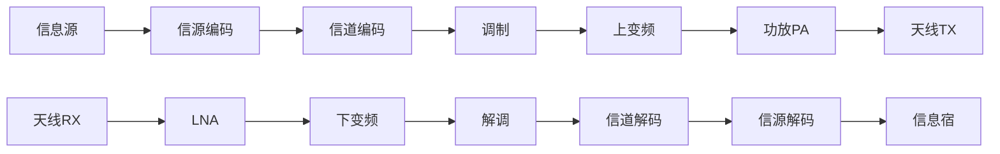

# 无线通信原理

## 一句话物理图像

> 无线通信像"无线电波投递员"——用天线发送和接收载波信号，让信息在空间中自由飞翔

---

## 通信系统架构

### 各模块功能

| 模块 | 功能 | 关键技术 |
|------|------|----------|
| 信源编码 | 压缩冗余，降低比特率 | Huffman, LZW, AAC, H.265 |
| 信道编码 | 添加冗余，纠错保护 | LDPC, Turbo, Polar码 |
| 调制 | 比特→模拟波形映射 | PSK, QAM, OFDM |
| 射频前端 | 频率变换、放大、滤波 | 混频器, LNA, PA |
| 天线 | 电磁波发射/接收 | 阵列天线, MIMO |

---

## Shannon 信道容量定理

### 连续信道容量

$$C = B \cdot \log_2\left(1 + \frac{S}{N}\right) \quad [\text{bit/s}]$$

| 参数 | 含义 |
|------|------|
| $C$ | 信道容量 (最大无差错传输速率) |
| $B$ | 信道带宽 (Hz) |
| $S/N$ | 信噪比 (线性) |

用 dB 表示：

$$C = B \cdot \log_2(1 + 10^{SNR_{dB}/10})$$

### 信道容量极限

$$E_b/N_0 \geq -1.59 \text{ dB} \quad (\text{Shannon极限})$$

$E_b$ = 每比特能量，$N_0$ = 噪声功率谱密度。

### 多天线 (MIMO) 容量

$$C_{MIMO} = B \cdot \log_2\det\left(\mathbf{I}_r + \frac{SNR}{t}\mathbf{H}\mathbf{H}^H\right)$$

$t$ = 发射天线数，$r$ = 接收天线数，$\mathbf{H}$ = 信道矩阵。

理想独立信道（$t = r = N$）：

$$C_{MIMO} \approx N \cdot C_{SISO}$$

> [!concept]+ 物理图像
> Shannon 极限定义了通信的"速度上限"。就像公路限速——你可以低于限速，但绝不可能超过。现代编码（LDPC、Polar码）已逼近这个极限 0.1 dB 以内。

---

## 调制技术

### 模拟调制

| 调制 | 表达式 | 带宽 | 应用 |
|------|--------|------|------|
| AM | $s(t) = [1 + m\,x(t)]\cos\omega_c t$ | $2B$ | 广播(遗留) |
| FM | $s(t) = A\cos(\omega_c t + 2\pi k_f \int x(\tau)d\tau)$ | $2(\Delta f + B)$ | 广播, 模拟电视 |
| PM | $s(t) = A\cos(\omega_c t + k_p x(t))$ | ~FM | 特殊应用 |

### 数字调制

将比特映射到星座点：

| 调制 | 比特/符号 | 频谱效率 | 星座点数 | BER@$E_b/N_0=10$dB |
|------|-----------|---------|---------|-------------------|
| BPSK | 1 | 1 bit/s/Hz | 2 | $\sim 4 \times 10^{-6}$ |
| QPSK | 2 | 2 bit/s/Hz | 4 | $\sim 4 \times 10^{-6}$ |
| 8-PSK | 3 | 3 bit/s/Hz | 8 | $\sim 10^{-3}$ |
| 16-QAM | 4 | 4 bit/s/Hz | 16 | $\sim 10^{-2}$ |
| 64-QAM | 6 | 6 bit/s/Hz | 64 | 需 $>15$ dB |
| 256-QAM | 8 | 8 bit/s/Hz | 256 | 需 $>20$ dB |

### QAM 调制详解

16-QAM 星座：4×4 网格，每符号 4 比特。

$$s(t) = A_I\cos(2\pi f_c t) + A_Q\sin(2\pi f_c t)$$

$A_I, A_Q \in \{-3, -1, 1, 3\} \cdot d/2$（$d$ = 星座点间距）。

AWGN 下的 BER 近似：

$$P_b \approx \frac{4}{\log_2 M}\left(1 - \frac{1}{\sqrt{M}}\right)Q\left(\sqrt{\frac{3\log_2 M}{M-1}\cdot\frac{E_b}{N_0}}\right)$$

---

## 正交频分复用 (OFDM)

### 基本原理

将宽带信号分成 $N$ 个正交子载波，每个子载波带宽 $\Delta f = B/N$。

$$s(t) = \sum_{k=0}^{N-1} X_k \, e^{j2\pi k\Delta f \cdot t}, \quad 0 \leq t \leq T_s$$

IFFT 实现：

$$x[n] = \frac{1}{N}\sum_{k=0}^{N-1} X_k \, e^{j2\pi kn/N}$$

### 关键参数

| 参数 | 符号 | 5G NR 典型值 |
|------|------|-------------|
| 子载波间隔 | $\Delta f$ | 15/30/60/120 kHz |
| FFT 大小 | $N$ | 512-4096 |
| CP 长度 | $T_{CP}$ | 4.7 μs (normal) |
| 符号周期 | $T_s = 1/\Delta f + T_{CP}$ | 71.4 μs |

### 循环前缀 (CP)

在 OFDM 符号前添加尾部副本，消除符号间干扰 (ISI)：

$$T_{CP} > \tau_{max}$$

$\tau_{max}$ = 信道最大时延扩展。

| CP 类型 | 长度 | 应用 |
|---------|------|------|
| Normal CP | ~4.7 μs | 城市环境 |
| Extended CP | ~16.7 μs | 大覆盖/多播 |
| ECP for 60kHz | ~8.3 μs | 高速场景 |

### OFDM 优缺点

| 优点 | 缺点 |
|------|------|
| 抗多径衰落 | 峰均比 (PAPR) 高 |
| 频谱效率高 | 对频偏敏感 |
| 灵活资源分配 | CP 开销 |
| MIMO 友好 | 需精确同步 |

> [!concept]+ 物理图像
> OFDM 像"多车道并行运输"——把大卡车（宽带信号）的货物分到多辆小货车（子载波）上并行跑。每辆小货车速度慢但不容易堵车，总和吞吐量不变。

---

## 信道特性与模型

### 大尺度衰落

自由空间路径损耗：

$$PL(d) = 20\log_{10}\left(\frac{4\pi d}{\lambda}\right) \text{ [dB]}$$

对数距离路径损耗模型：

$$PL(d) = PL(d_0) + 10n\log_{10}(d/d_0) + X_\sigma$$

| 参数 | 含义 |
|------|------|
| $n$ | 路径损耗指数（自由空间 $n=2$） |
| $X_\sigma$ | 阴影衰落（零均值高斯） |

### 小尺度衰落

| 信道模型 | PDF | 适用场景 |
|----------|-----|----------|
| AWGN | 常数 | 理想信道 |
| Rayleigh | $p(r) = \frac{r}{\sigma^2}e^{-r^2/2\sigma^2}$ | NLOS, 多径丰富 |
| Rician | $p(r) = \frac{r}{\sigma^2}e^{-(r^2+A^2)/2\sigma^2}I_0\left(\frac{Ar}{\sigma^2}\right)$ | LOS + 多径 |
| Nakagami-m | 广义模型 | 经验拟合 |

Rician K 因子：

$$K = \frac{A^2}{2\sigma^2} = \frac{\text{LOS功率}}{\text{NLOS功率}}$$

| K 值 | 信道类型 |
|------|---------|
| $K = 0$ | Rayleigh (纯 NLOS) |
| $K \gg 1$ | 接近 AWGN (强 LOS) |
| $K \sim 3-10$ | 典型室内 |

### 多普勒效应

$$f_d = \frac{v}{c} f_c$$

相干时间：

$$T_c \approx \frac{0.423}{f_d}$$

| 移动速度 | $f_c$ = 28 GHz 时 $f_d$ | $T_c$ |
|---------|------------------------|-------|
| 步行 3 km/h | 78 Hz | 5.4 ms |
| 车速 60 km/h | 1.56 kHz | 270 μs |
| 高铁 300 km/h | 7.8 kHz | 54 μs |

---

## MIMO 与波束成形

### 空间复用

$N_t$ 发射天线、$N_r$ 接收天线，最大空间自由度 $\min(N_t, N_r)$。

$$\mathbf{y} = \mathbf{H}\mathbf{x} + \mathbf{n}$$

| 技术 | 原理 | 增益 |
|------|------|------|
| 空间复用 | 并行传输多数据流 | 容量 ×N |
| 空间分集 | 同一数据多路传输 | 可靠性 ↑ |
| 波束成形 | 加权合并信号 | SNR ↑ |
| Massive MIMO | 大规模天线阵列 | 容量 + 能效 |

### 模拟波束成形

用移相器控制每个天线单元的相位：

$$\mathbf{w} = \frac{1}{\sqrt{N}}[1, e^{j\phi_2}, \ldots, e^{j\phi_N}]^T$$

阵列增益：

$$G_{array} = 10\log_{10}(N) \text{ [dB]}$$

| 天线数 $N$ | 阵列增益 |
|-----------|---------|
| 4 | 6 dB |
| 16 | 12 dB |
| 64 | 18 dB |
| 256 | 24 dB |

---

## 链路预算分析

### 基本链路预算

$$P_{rx} = P_{tx} + G_{tx} - PL + G_{rx} - L_{misc} \text{ [dBm]}$$

| 参数 | 含义 |
|------|------|
| $P_{tx}$ | 发射功率 |
| $G_{tx}$, $G_{rx}$ | 发射/接收天线增益 |
| $PL$ | 路径损耗 |
| $L_{misc}$ | 杂散损耗（馈线、雨衰等） |

### 链路余量

$$M = P_{rx} - P_{sensitivity}$$

| 余量 | 可靠性 |
|------|--------|
| 0 dB | 50% 覆盖 |
| 10 dB | ~90% |
| 20 dB | ~99% |
| 30 dB | ~99.9% |

### THz 通信链路预算示例

| 参数 | 值 |
|------|------|
| 频率 | 300 GHz |
| 发射功率 | 0 dBm (1 mW) |
| TX 天线增益 | 25 dBi |
| 距离 | 10 m |
| 自由空间路径损耗 | 102 dB |
| RX 天线增益 | 25 dBi |
| 接收功率 | -52 dBm |
| 接收机灵敏度 | -70 dBm |
| 链路余量 | 18 dB |

> [!concept]+ THz 通信挑战
> 路径损耗正比于 $f^2$（$PL \propto 20\log f$）。300 GHz 比 3 GHz 多 40 dB 路径损耗。需高增益天线 + 短距离 + 波束成形补偿。

---

## THz 无线通信 — 光纤-无线融合系统

> 以下内容基于 RAG 库中的 [[cite:@THzRoadmap2017]] (2017 THz Science and Technology Roadmap) Section 17

### 光子多波段无线光纤系统

THz 无线通信的一个核心挑战是**本振源和信号源的频率稳定性**。[[cite:@THzRoadmap2017]] 描述了光子学解决方案——用光频梳发生器 (OFCG) 和半导体光放大器 (SOA) 实现稳定的多波段载波：

![[fa8088acbae42ed0_p43_f26.png]]
*Figure 26 from [[cite:@THzRoadmap2017]]: 光子多波段无线光纤系统。光频梳发生器 (OFCG) 产生等间距光频线，经半导体放大器 (SOA) 放大后，双 DFB 激光器拍频产生 THz 载波。信号经光纤传输至远端天线单元 (RAU) 进行无线辐射。*

**系统架构解析** (基于 [[cite:@THzRoadmap2017]] 的描述)：

| 组件 | 功能 | 关键参数 |
|------|------|---------|
| OFCG (光频梳发生器) | 产生等间距光频线 | 线间距 = THz 载波频率 |
| SOA (半导体光放大器) | 补偿光纤传输损耗 | 增益 > 20 dB |
| DFB 激光器 | 光拍频产生 THz 本振 | 频率稳定性 < 1 MHz |
| RAU (远端天线单元) | 光-无线转换 + 辐射 | 天线增益 > 25 dBi |
| Schottky 混频器 | 下变频/检测 | 见 [[微波工程]] |

> [!concept]+ 物理图像
> 这个系统的精髓是"光生 THz"——两个波长略有不同的激光在光电探测器上拍频，差频恰好等于 THz 载波频率。就像两个音叉同时敲击，差拍频率等于频率之差。光频梳保证了多条谱线等间距排列，可同时产生多个 THz 载波。

### 单片光子集成 — THz 收发器芯片化

[[cite:@THzRoadmap2017]] Figure 27 展示了 THz 收发器的单片集成方案：

![[fa8088acbae42ed0_p43_f25.png]]
*Figure 25/27 from [[cite:@THzRoadmap2017]]: (a) 单片光子集成电路，集成 MMI 耦合器、SOA 和 2×2 调制器；(b) 4.1 mm 芯片上的双 DBR 激光器，通过 OPGC 输入产生 THz 信号；(c) OPLL 系统集成 Schottky 二极管混频器与梳状发生器。*

**集成化对 THz 通信的意义**：

| 集成层次 | 器件 | 性能提升 |
|----------|------|---------|
| 芯片级 | 双 DFB + MMI + SOA | 频率稳定性提升 10× |
| 模块级 | 光子芯片 + Schottky 混频器 | 系统体积缩小 100× |
| 系统级 | OPLL + 梳状发生器 + 相位检测器 | 相位噪声 < -80 dBc/Hz |

[[cite:@THzRoadmap2017]] 强调：**光子集成的可调谐相干 THz 源** (tuneable coherent THz source) 是实现 THz 通信系统的关键技术路线，利用 SOA、DFB 激光器和 OPGC 的单片集成实现频率可调谐。

### THz 通信性能对比

综合 [[cite:@THzRoadmap2017]] 数据：

| 参数 | 100 GHz | 300 GHz | 600 GHz | 1 THz |
|------|---------|---------|---------|-------|
| 可用带宽 | ~10 GHz | ~30 GHz | ~50 GHz | ~100 GHz |
| 最大数据率 | ~10 Gbps | ~100 Gbps | ~50 Gbps | ~10 Gbps |
| 传输距离 | ~1 km | ~100 m | ~10 m | ~1 m |
| 大气衰减 | ~1 dB/km | ~10 dB/km | ~100 dB/km | ~1000 dB/km |
| 关键瓶颈 | 器件性能 | 天线效率 | 大气吸收 | 源功率 |

> [!tip]+ 频段选择启示
> 300 GHz (0.3 THz) 是 THz 通信的"甜点"——大气衰减相对可接受（~10 dB/km），带宽充足（~30 GHz），支持 100 Gbps 传输。这正是 6G 研究聚焦此频段的原因。

---

## 多址接入技术

| 代际 | 多址方式 | 核心技术 |
|------|---------|---------|
| 1G | FDMA | 频分多址 |
| 2G | TDMA | 时分多址 |
| 3G | CDMA | 码分多址 |
| 4G | OFDMA | 正交频分多址 |
| 5G | OFDMA + NOMA | 非正交多址叠加 |

---

## 知识树

```mermaid
graph TD
    A["无线通信原理"] --> B["信息论基础"]
    A --> C["调制技术"]
    A --> D["信道特性"]
    A --> E["多天线技术"]
    A --> F["多址接入"]

    B --> B1["Shannon容量"]
    B --> B2["信道编码"]

    C --> C1["模拟调制"]
    C --> C2["数字调制-PSK/QAM"]
    C --> C3["OFDM"]

    D --> D1["路径损耗"]
    D --> D2["多径衰落"]
    D --> D3["多普勒效应"]

    E --> E1["空间复用"]
    E --> E2["波束成形"]
    A --> F["多址接入"]
    A --> G["THz无线通信"]

    B --> B1["Shannon容量"]
    B --> B2["信道编码"]

    C --> C1["模拟调制"]
    C --> C2["数字调制-PSK/QAM"]
    C --> C3["OFDM"]

    D --> D1["路径损耗"]
    D --> D2["多径衰落"]
    D --> D3["多普勒效应"]

    E --> E1["空间复用"]
    E --> E2["波束成形"]
    E --> E3["Massive MIMO"]

    G --> G1["光纤-无线融合"]
    G --> G2["光子集成THz源"]
    G --> G3["300GHz通信窗口"]
    F --> F2["OFDMA"]
    F --> F3["NOMA"]

    style A fill:#FF6B6B,stroke:#FF0000,stroke-width:3px
    style B fill:#FFD93D,stroke:#FF8C00
    style C fill:#6BCB77,stroke:#228B22
    style D fill:#4D96FF,stroke:#0000CD
    style E fill:#9B59B6,stroke:#6C3483
```

---

## 参考文献

1. **[[cite:@Goldsmith2005]]** — "Wireless Communications", 无线通信标准教材
2. **[[cite:@Tse2005]]** — "Fundamentals of Wireless Communication", MIMO与衰落信道
3. **[[cite:@Shannon1948]]** — "A Mathematical Theory of Communication", 信息论奠基
4. **[[cite:@Rappaport2002]]** — "Wireless Communications: Principles and Practice"
5. **[[cite:@THzRoadmap2017]]** — "The 2017 terahertz science and technology roadmap", *J. Phys. D* 50, 043001 (2017). **RAG 库收录** — THz 光纤无线融合系统、光子集成收发器

---

## 延伸阅读

- [[太赫兹通信]] — THz 频段通信前沿
- [[微波工程]] — 高频电路与器件
- [[半导体工艺]] — 通信芯片制造
