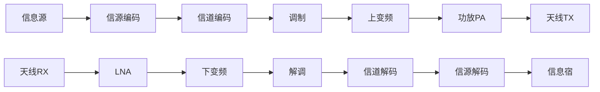

# 无线通信原理

## 一句话物理图像

> 无线通信的核心是**在噪声和衰落中可靠传输信息**——Shannon 定理给出理论极限，调制/编码/多天线技术让我们逼近这个极限。THz 通信是频率扩展到 0.1-1 THz 的自然延伸，受限于大气吸收和器件性能。

---

## 一、通信系统架构

| 模块 | 功能 | 关键技术 |
|------|------|----------|
| 信源编码 | 压缩冗余，降低比特率 | Huffman, LZW, AAC, H.265 |
| 信道编码 | 添加冗余，纠错保护 | LDPC, Turbo, Polar码 |
| 调制 | 比特→模拟波形映射 | PSK, QAM, OFDM |
| 射频前端 | 频率变换、放大、滤波 | 混频器, LNA, PA |
| 天线 | 电磁波发射/接收 | 阵列天线, MIMO |

---

## 二、Shannon 信道容量定理

### 2.1 连续信道容量

Shannon (1948) 证明了 AWGN 信道的最大无差错传输速率：

$$\boxed{C = B \cdot \log_2\left(1 + \frac{S}{N}\right) \quad [\text{bit/s}]}$$

| 参数 | 含义 |
|------|------|
| $C$ | 信道容量（最大无差错传输速率） |
| $B$ | 信道带宽 (Hz) |
| $S/N$ | 信噪比（线性，非 dB） |

**推导思路**（概要）：

1. 将连续信号离散化为 $2B$ 个采样/秒（Nyquist）
2. 每个采样在信号空间中受噪声约束，可分辨的信号电平数 $\sim \sqrt{1 + S/N}$
3. 每个采样可传输 $\log_2\sqrt{1+S/N}$ bit
4. 总速率 $C = 2B \times \frac{1}{2}\log_2(1+S/N) = B\log_2(1+S/N)$

**数值示例**：

| 场景 | $B$ | SNR | $C$ |
|------|-----|-----|-----|
| WiFi 5 GHz | 80 MHz | 20 dB (100) | 532 Mbps |
| 5G mmWave | 400 MHz | 10 dB (10) | 1.38 Gbps |
| THz @300 GHz | 30 GHz | 0 dB (1) | 30 Gbps |

> [!concept]+ 物理图像
> Shannon 极限定义了通信的"速度上限"。就像公路限速——你可以低于限速，但绝不可能超过。现代编码（LDPC、Polar码）已逼近这个极限 0.1 dB 以内。

### 2.2 Shannon 极限

$E_b/N_0 \geq -1.59$ dB（Shannon极限），其中 $E_b$ = 每比特能量，$N_0$ = 噪声功率谱密度。

| 编码方案 | 距 Shannon 极限 |
|----------|---------------|
| 未编码 BPSK | ~10 dB |
| 卷积码 (rate 1/2) | ~5 dB |
| Turbo 码 | ~0.5 dB |
| LDPC 码 | ~0.1 dB |
| Polar 码 | ~0.02 dB |

### 2.3 MIMO 容量

$$C_{MIMO} = B \cdot \log_2\det\left(\mathbf{I}_r + \frac{SNR}{t}\mathbf{H}\mathbf{H}^H\right)$$

理想独立信道（$t = r = N$）时：$C_{MIMO} \approx N \cdot C_{SISO}$

| 配置 | 容量倍增 | 应用 |
|------|---------|------|
| 2×2 MIMO | ~2× | WiFi, 4G |
| 4×4 MIMO | ~4× | 5G |
| 64×64 Massive MIMO | ~64× | 5G 基站 |
| 256×256 | ~256× | 6G 概念 |

---

## 三、调制技术

### 3.1 数字调制

将比特映射到星座点：

| 调制 | 比特/符号 | 频谱效率 | 所需 $E_b/N_0$ (BER=$10^{-5}$) |
|------|-----------|---------|-------------------------------|
| BPSK | 1 | 1 bit/s/Hz | 9.6 dB |
| QPSK | 2 | 2 bit/s/Hz | 9.6 dB |
| 16-QAM | 4 | 4 bit/s/Hz | 13.4 dB |
| 64-QAM | 6 | 6 bit/s/Hz | 17.8 dB |
| 256-QAM | 8 | 8 bit/s/Hz | 22.4 dB |

> [!tip]+ 调制阶数 vs SNR
> 阶数越高→每符号传更多比特→需要更高 SNR。QPSK 和 BPSK 在相同 BER 下需要相同的 $E_b/N_0$（因为 QPSK 是两个正交 BPSK），但频谱效率翻倍。

### 3.2 QAM 信号模型

$$s(t) = A_I\cos(2\pi f_c t) + A_Q\sin(2\pi f_c t)$$

16-QAM：$A_I, A_Q \in \{-3, -1, 1, 3\} \cdot d/2$

AWGN 下的 BER 近似：

$$P_b \approx \frac{4}{\log_2 M}\left(1 - \frac{1}{\sqrt{M}}\right)Q\left(\sqrt{\frac{3\log_2 M}{M-1}\cdot\frac{E_b}{N_0}}\right)$$

---

## 四、正交频分复用 (OFDM)

### 4.1 基本原理

将宽带信号分成 $N$ 个正交子载波，每个子载波带宽 $\Delta f = B/N$：

$$s(t) = \sum_{k=0}^{N-1} X_k \, e^{j2\pi k\Delta f \cdot t}, \quad 0 \leq t \leq T_s$$

IFFT 实现：$x[n] = \frac{1}{N}\sum_{k=0}^{N-1} X_k \, e^{j2\pi kn/N}$

### 4.2 关键参数

| 参数 | 符号 | 5G NR 典型值 |
|------|------|-------------|
| 子载波间隔 | $\Delta f$ | 15/30/60/120 kHz |
| FFT 大小 | $N$ | 512-4096 |
| CP 长度 | $T_{CP}$ | 4.7 μs (normal) |
| 符号周期 | $T_s = 1/\Delta f + T_{CP}$ | 71.4 μs |

### 4.3 循环前缀 (CP)

在 OFDM 符号前添加尾部副本，消除 ISI：$T_{CP} > \tau_{max}$

**数值示例**——5G NR @3.5 GHz，城市环境：

| 参数 | 值 |
|------|-----|
| 时延扩展 $\tau_{max}$ | ~3 μs |
| Normal CP | 4.7 μs > 3 μs ✅ |
| 子载波间隔 | 30 kHz |
| 可抗多径差 | ~1.4 km |

| 优点 | 缺点 |
|------|------|
| 抗多径衰落 | 峰均比 (PAPR) 高 |
| 频谱效率高 | 对频偏敏感 |
| MIMO 友好 | CP 开销（~7%） |

> [!concept]+ 物理图像
> OFDM 像"多车道并行运输"——把大卡车（宽带信号）的货物分到多辆小货车（子载波）上并行跑。每辆小货车速度慢但不容易堵车，总和吞吐量不变。

---

## 五、信道编码

### 5.1 编码的作用

信道编码在数据中**有控制地添加冗余**，使接收端能检测和纠正传输错误。

| 编码类型 | 原理 | 典型码率 | 应用 |
|----------|------|---------|------|
| 卷积码 | 状态机编码 | 1/2, 1/3 | 3G, WiFi |
| Turbo 码 | 并行级联卷积码 | 1/3 | 3G/4G |
| LDPC | 稀疏校验矩阵 | 1/2-5/6 | **5G 数据**, WiFi 6 |
| Polar 码 | 信道极化 | 1/2 | **5G 控制信道** |

### 5.2 LDPC 码

Low-Density Parity-Check 码由稀疏校验矩阵 $\mathbf{H}$ 定义：

$$\mathbf{H}\mathbf{c}^T = \mathbf{0}$$

其中 $\mathbf{c}$ 是码字。解码用**置信传播(Belief Propagation)** 迭代算法。

| 参数 | 5G NR LDPC |
|------|-----------|
| 码长 | 最高 8448 |
| 码率 | 1/3 ~ 5/6 |
| 迭代次数 | 典型 20-50 |
| 距 Shannon 极限 | ~0.1 dB |

### 5.3 Polar 码

Arikan (2009) 发现：通过对信道进行递归分裂，一部分信道变得"完美"（无噪声），另一部分变得"完全噪声"。将信息比特放在"完美"信道上即可实现容量达到。

| 特性 | 说明 |
|------|------|
| 首个**严格证明**达到 Shannon 容量的码 | 理论意义重大 |
| 编码复杂度 | $O(N\log N)$ |
| 解码 | SC/SCL 算法 |
| 5G 应用 | 控制信道（DCI/UCI） |

---

## 六、信道特性与模型

### 6.1 路径损耗

自由空间路径损耗：

$$PL(d) = 20\log_{10}\left(\frac{4\pi d}{\lambda}\right) \text{ [dB]}$$

**数值示例**——300 GHz, d = 10 m：

$$PL = 20\log_{10}\frac{4\pi \times 10}{0.001} = 20\log_{10}(125664) = 102\,\text{dB}$$

### 6.2 小尺度衰落

| 信道模型 | PDF | 适用场景 |
|----------|-----|----------|
| AWGN | 常数 | 理想信道 |
| Rayleigh | $p(r) = \frac{r}{\sigma^2}e^{-r^2/2\sigma^2}$ | NLOS, 多径丰富 |
| Rician | 含 LOS 分量 | LOS + 多径 |
| Nakagami-m | 广义模型 | 经验拟合 |

Rician K 因子：$K = A^2/(2\sigma^2) = \text{LOS功率}/\text{NLOS功率}$

| K 值 | 信道类型 |
|------|---------|
| $K = 0$ | Rayleigh (纯 NLOS) |
| $K \sim 3-10$ | 典型室内 |
| $K \gg 1$ | 接近 AWGN |

### 6.3 多普勒效应

$$f_d = \frac{v}{c} f_c, \quad T_c \approx \frac{0.423}{f_d}$$

| 移动速度 | $f_c$ = 28 GHz 时 $f_d$ | $T_c$ |
|---------|------------------------|-------|
| 步行 3 km/h | 78 Hz | 5.4 ms |
| 车速 60 km/h | 1.56 kHz | 270 μs |
| 高铁 300 km/h | 7.8 kHz | 54 μs |

> [!warning]+ THz 的多普勒挑战
> THz 通信的多普勒频移与载频成正比。300 GHz @ 30 km/h → $f_d = 8.3$ kHz。对子载波间隔 60 kHz 的 OFDM 来说，频偏占 14%——需要精确频偏估计和补偿。

---

## 七、MIMO 与波束成形

### 7.1 空间复用

$\mathbf{y} = \mathbf{H}\mathbf{x} + \mathbf{n}$

$N_t$ 发射天线、$N_r$ 接收天线，最大空间自由度 $\min(N_t, N_r)$。

| 技术 | 原理 | 增益 |
|------|------|------|
| 空间复用 | 并行传输多数据流 | 容量 ×N |
| 空间分集 | 同一数据多路传输 | 可靠性 ↑ |
| 波束成形 | 加权合并信号 | SNR ↑ |
| Massive MIMO | 大规模天线阵列 | 容量 + 能效 |

### 7.2 模拟波束成形

用移相器控制每个天线单元的相位：

$$\mathbf{w} = \frac{1}{\sqrt{N}}[1, e^{j\phi_2}, \ldots, e^{j\phi_N}]^T$$

阵列增益：$G_{array} = 10\log_{10}(N)$ dB

| 天线数 $N$ | 阵列增益 | 阵列尺寸 @300 GHz |
|-----------|---------|-------------------|
| 4 | 6 dB | ~2 mm |
| 16 | 12 dB | ~4 mm |
| 64 | 18 dB | ~8 mm |
| 256 | 24 dB | ~16 mm |

> [!tip]+ THz 天线阵列的优势
> 波长越短→相同口径内可容纳更多天线单元→波束越窄。300 GHz 的 256 元阵列尺寸仅 ~16 mm，却可产生 < 2° 的窄波束——这就是 THz 通信用波束成形对抗路径损耗的物理基础。

---

## 八、链路预算分析

### 8.1 基本链路预算

$$P_{rx} = P_{tx} + G_{tx} - PL + G_{rx} - L_{misc} \text{ [dBm]}$$

### 8.2 THz 通信链路预算示例

| 参数 | 值 | 说明 |
|------|------|------|
| 频率 | 300 GHz | 6G 候选频段 |
| 发射功率 | 0 dBm (1 mW) | Schottky 倍频源 |
| TX 天线增益 | 25 dBi | 透镜天线 |
| 距离 | 10 m | 室内 |
| 自由空间路径损耗 | 102 dB | $20\log(4\pi d/\lambda)$ |
| 大气吸收 | ~1 dB | 300 GHz 窗口 |
| RX 天线增益 | 25 dBi | 透镜天线 |
| 接收功率 | -53 dBm | |
| 接收机灵敏度 | -70 dBm | @10 Gbps |
| 链路余量 | 17 dB | ~99% 可靠性 |

> [!concept]+ THz 通信挑战
> 路径损耗正比于 $f^2$。300 GHz 比 3 GHz 多 40 dB 路径损耗。需高增益天线 + 短距离 + 波束成形补偿。

---

## 九、THz 无线通信

> 基于 RAG 库中的 [[cite:@THzRoadmap2017]] Section 17

### 9.1 光子多波段无线光纤系统

THz 无线通信的核心挑战是**本振源的频率稳定性**。光子学方案用光频梳发生器 (OFCG) 和 SOA 实现稳定载波：

| 组件 | 功能 | 关键参数 |
|------|------|---------|
| OFCG | 产生等间距光频线 | 线间距 = THz 载波频率 |
| SOA | 补偿光纤损耗 | 增益 > 20 dB |
| DFB 激光器 | 光拍频产生 THz 本振 | 稳定性 < 1 MHz |
| RAU | 光-无线转换 + 辐射 | 增益 > 25 dBi |

> "光生 THz"——两个波长略有不同的激光在光电探测器上拍频，差频 = THz 载波频率。

### 9.2 THz 通信性能对比

| 参数 | 100 GHz | 300 GHz | 600 GHz | 1 THz |
|------|---------|---------|---------|-------|
| 可用带宽 | ~10 GHz | ~30 GHz | ~50 GHz | ~100 GHz |
| 最大数据率 | ~10 Gbps | ~100 Gbps | ~50 Gbps | ~10 Gbps |
| 传输距离 | ~1 km | ~100 m | ~10 m | ~1 m |
| 大气衰减 | ~1 dB/km | ~10 dB/km | ~100 dB/km | ~1000 dB/km |
| 关键瓶颈 | 器件性能 | 天线效率 | 大气吸收 | 源功率 |

> 300 GHz 是 THz 通信的"甜点"——大气衰减可接受，带宽充足。6G 研究的核心频段。

### 9.3 多址接入技术演进

| 代际 | 多址方式 | 核心技术 |
|------|---------|---------|
| 1G | FDMA | 频分多址 |
| 2G | TDMA | 时分多址 |
| 3G | CDMA | 码分多址 |
| 4G | OFDMA | 正交频分多址 |
| 5G | OFDMA + NOMA | 非正交多址 |
| 6G (候选) | THz-OFDMA | 超宽带频分 |

---

## 十、知识树

```mermaid
graph TD
    A["无线通信原理"] --> B["信息论基础"]
    A --> C["调制技术"]
    A --> D["信道特性"]
    A --> E["多天线技术"]
    A --> F["信道编码"]
    A --> G["THz通信"]

    B --> B1["Shannon容量<br/>C=B·log₂(1+SNR)"]
    B --> B2["Shannon极限<br/>-1.59 dB"]

    C --> C1["数字调制<br/>PSK/QAM"]
    C --> C2["OFDM<br/>IFFT+CP"]

    D --> D1["路径损耗<br/>自由空间模型"]
    D --> D2["多径衰落<br/>Rayleigh/Rician"]
    D --> D3["多普勒<br/>相干时间"]

    E --> E1["空间复用<br/>容量×N"]
    E --> E2["波束成形<br/>阵列增益"]
    E --> E3["Massive MIMO<br/>5G/6G"]

    F --> F1["LDPC码<br/>5G数据信道"]
    F --> F2["Polar码<br/>5G控制信道"]
    F --> F3["Turbo码<br/>3G/4G"]

    G --> G1["光子学THz源<br/>OFCG+SOA"]
    G --> G2["300GHz窗口<br/>6G甜点"]
    G --> G3["链路预算<br/>102dB@10m"]

    style A fill:#FF6B6B,stroke:#FF0000,stroke-width:3px
    style B fill:#FFD93D,stroke:#FF8C00
    style C fill:#6BCB77,stroke:#228B22
    style D fill:#4D96FF,stroke:#0000CD
    style E fill:#9B59B6,stroke:#6C3483
    style F fill:#E67E22,stroke:#D35400
    style G fill:#FF6B6B,stroke:#C0392B
```

---

## 参考文献

1. **[[cite:@Goldsmith2005]]** — "Wireless Communications", 无线通信标准教材
2. **[[cite:@Tse2005]]** — "Fundamentals of Wireless Communication", MIMO与衰落信道
3. **[[cite:@Shannon1948]]** — "A Mathematical Theory of Communication", 信息论奠基
4. **[[cite:@Rappaport2002]]** — "Wireless Communications: Principles and Practice"
5. **[[cite:@THzRoadmap2017]]** — "The 2017 terahertz science and technology roadmap", *J. Phys. D* 50, 043001 (2017). **RAG 库收录**

---

## 延伸阅读

- [[微波工程]] — 高频电路与器件，S参数与阻抗匹配
- [[半导体工艺]] — 通信芯片制造
- [[超表面与超材料]] — THz天线与波束成形

---

*最后更新：2026-06-05*
