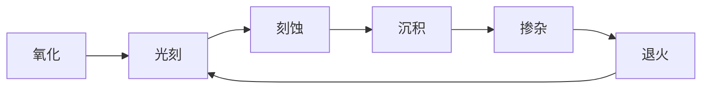
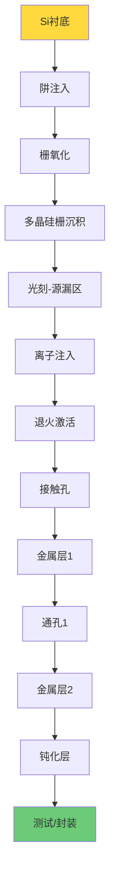
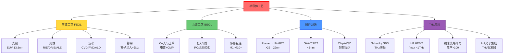

# 半导体工艺

## 一句话物理图像

> 半导体工艺是在硅片上**层层叠加、精密雕刻**纳米结构的过程——光刻定义图形，刻蚀转移图形，沉积铺设材料，掺杂调节电性。每一代工艺节点的缩小都是材料科学、光学工程和精密制造的极限挑战。

---

## 零、摩尔定律与工艺节点演进

### 摧化剂：为什么工艺节点持续缩小？

Moore (1965) 观察到芯片上的晶体管数量每 18-24 个月翻一番。这背后的驱动力是**光刻分辨率的持续提升**：

| 年代 | 节点 | 晶体管/芯片 | 光源 |
|------|------|-----------|------|
| 1971 | 10 μm | ~2300 (4004) | 接触式曝光 |
| 1985 | 1 μm | ~$10^5$ | G-line (436 nm) |
| 1999 | 180 nm | ~$10^7$ | KrF (248 nm) |
| 2006 | 65 nm | ~$10^8$ | ArF (193 nm) |
| 2014 | 14 nm | ~$10^9$ | ArFi (浸没) |
| 2020 | 5 nm | ~$10^{10}$ | EUV (13.5 nm) |
| 2024 | 3 nm | ~$10^{10}+$ | High-NA EUV |

### 物理极限

| 极限 | 来源 | 量级 |
|------|------|------|
| 栅氧化层厚度 | 量子隧穿漏电 | SiO₂ < 1 nm 不可用 → 改用 HfO₂ 高$k$ |
| 沟道长度 | 源漏穿通 | < 10 nm 需多栅结构 |
| 互连间距 | 电阻-电容延迟 | Cu 互连 < 20 nm RC 延迟显著 |
| 光刻分辨 | 衍射极限 | EUV 理论极限 ~8 nm |

> [!concept]+ 超越摩尔定律
> 工艺缩放遇到物理极限后，三条路径并行：
> 1. **3D 集成**：垂直堆叠晶体管（GAA, CFET）
> 2. **Chiplet**：小芯片异构集成，用先进封装替代单片集成
> 3. **新材料**：GaN, SiC, 2D 材料用于特定应用（功率、射频）

---

## 一、核心工艺流程



### CMOS 制造完整流程



---

## 二、光刻 (Photolithography)

### 2.1 光刻工艺步骤

| 步骤 | 操作 | 关键参数 |
|------|------|----------|
| 1. 涂胶 | 旋涂光刻胶 | 厚度 0.5-5 μm |
| 2. 软烘 | 去除溶剂 | 90-120°C, 60-90s |
| 3. 曝光 | UV/DUV/EUV 照射 | 剂量 10-100 mJ/cm² |
| 4. 后烘 | PEB (化学放大胶) | 100-130°C |
| 5. 显影 | 溶解曝光区/未曝光区 | 30-60s |
| 6. 硬烘 | 增强胶稳定性 | 120-150°C |

### 2.2 分辨率公式

$$\boxed{R = k_1 \cdot \frac{\lambda}{NA}}$$

| 参数 | 含义 | 典型值 |
|------|------|--------|
| $k_1$ | 工艺因子 | 0.25-0.5 |
| $\lambda$ | 曝光波长 | 436→13.5 nm |
| $NA$ | 数值孔径 | 0.5-1.35 |

**数值示例**——EUV ($\lambda = 13.5$ nm, $NA = 0.33$, $k_1 = 0.3$)：

$$R = 0.3 \times \frac{13.5}{0.33} = 12.3\,\text{nm}$$

High-NA EUV ($NA = 0.55$)：$R = 7.4$ nm

### 2.3 曝光技术演进

| 曝光技术 | 波长 | 分辨率 | 节点 |
|----------|------|--------|------|
| G-line | 436 nm | ~0.5 μm | >250 nm |
| I-line | 365 nm | ~0.35 μm | 250 nm |
| KrF (DUV) | 248 nm | ~0.13 μm | 130-90 nm |
| ArF (DUV) | 193 nm | ~38 nm (浸没) | 65-14 nm |
| EUV | 13.5 nm | <14 nm | 7-3 nm |
| High-NA EUV | 13.5 nm | <8 nm | 2-1 nm |

> [!concept]+ EUV 光刻的技术挑战
> EUV 光源由 CO₂ 激光轰击 Sn 液滴产生 13.5 nm 等离子体辐射。功率密度要求 >250 W。整套光学系统（反射式 Bragg 镜）必须在真空中运行——空气在 13.5 nm 的吸收长度仅 ~mm。ASML 是当前 EUV 设备唯一供应商，单台售价 >$3 亿。

### 2.4 光刻胶类型

| 类型 | 原理 | 分辨率 | 应用 |
|------|------|--------|------|
| 正胶 | 曝光区溶解 | 高 | 主流工艺 |
| 负胶 | 曝光区交联保留 | 中 | 特殊应用 |
| 化学放大胶 (CAR) | 光致产酸剂催化链反应 | 最高 | DUV/EUV |
| 金属氧化物胶 | SnO₂ 基 | EUV 专用 | High-NA EUV |

---

## 三、刻蚀 (Etching)

### 3.1 刻蚀方法对比

| 方法 | 各向异性 | 选择比 | 优点 | 缺点 |
|------|---------|--------|------|------|
| 湿法腐蚀 | 各向同性 | 高 (>10:1) | 简单、快 | 侧向钻蚀 |
| RIE | 各向异性 | 中 (5-10:1) | 图形好 | 等离子体损伤 |
| ICP-RIE | 各向异性 | 中 | 高密度等离子体 | 设备贵 |
| DRIE (Bosch) | 高各向异性 | 中 | 深槽/高深宽比 | 扇贝纹 |
| ALE | 原子层精度 | 极高 | 精确控制 | 慢 |

### 3.2 RIE 刻蚀参数

| 刻蚀材料 | 气体 | 典型速率 | 选择比 vs 光刻胶 |
|----------|------|---------|----------------|
| Si | SF₆, CF₄ | 100-500 nm/min | 5-10:1 |
| SiO₂ | CHF₃, CF₄ | 50-200 nm/min | 8-15:1 |
| Si₃N₄ | CHF₃/O₂ | 50-150 nm/min | 5-10:1 |
| Al | Cl₂, BCl₃ | 200-1000 nm/min | 3-5:1 |

### 3.3 Bosch DRIE

交替刻蚀和钝化实现高深宽比：

```
循环: 刻蚀(SF₆) → 钝化(C₄F₈) → 刻蚀 → 钝化 → ...
```

| 参数 | 典型值 |
|------|--------|
| 深宽比 | >20:1 |
| 侧壁粗糙度 | ~100 nm (扇贝纹) |
| 刻蚀速率 | 5-20 μm/min |

> [!tip]+ DRIE 在 MEMS/THz 中的应用
> THz 波导需要亚毫米精度的深槽结构。DRIE 可以在 Si 上刻蚀数百 μm 深的沟槽，深宽比 >30:1，用于制造 Si 基 THz 波导和天线。

---

## 四、薄膜沉积

### 4.1 化学气相沉积 (CVD)

| CVD 类型 | 温度 | 压力 | 应用 |
|----------|------|------|------|
| APCVD | 600-900°C | 常压 | SiO₂, 掺杂玻璃 |
| LPCVD | 550-900°C | 0.1-1 Torr | SiO₂, Si₃N₄, 多晶Si |
| PECVD | 200-400°C | 0.1-10 Torr | SiO₂, Si₃N₄ (低温) |
| MOCVD | 500-1100°C | 低压 | III-V 化合物 (GaAs, InP) |

典型反应方程：

$$\text{SiH}_4 + \text{O}_2 \xrightarrow{LPCVD} \text{SiO}_2 + 2\text{H}_2$$

$$3\text{SiH}_4 + 4\text{NH}_3 \xrightarrow{LPCVD} \text{Si}_3\text{N}_4 + 12\text{H}_2$$

### 4.2 物理气相沉积 (PVD)

| 方法 | 原理 | 应用 |
|------|------|------|
| 热蒸发 | 电阻加热熔化 | Au, Al 薄膜 |
| 电子束蒸发 | 高能电子束 | 高纯度薄膜 |
| 溅射 | Ar⁺ 轰击靶材 | 金属, 合金, 化合物 |

### 4.3 原子层沉积 (ALD)

自限制逐层沉积，每循环 ~0.5-1.5 Å：

| 材料 | 前驱体 | 沉积温度 |
|------|--------|---------|
| Al₂O₃ | TMA + H₂O | 100-300°C |
| HfO₂ | TEMAH + H₂O | 200-350°C |
| TiN | TiCl₄ + NH₃ | 300-500°C |

> [!concept]+ ALD 在先进节点中的关键地位
> ALD 的保形性在深宽比 >100:1 的沟槽中仍保持均匀。EUV 时代的高 $k$ 栅介质（HfO₂, $k \approx 25$）几乎全部用 ALD 沉积——因为物理厚度仅 1-2 nm，CVD 无法保证均匀性。

---

## 五、掺杂与退火

### 5.1 离子注入

将杂质离子加速到 10 keV - 5 MeV 注入硅衬底。

射程估算 (LSS 理论)：$R_p \approx E^{2/3}/(N \cdot Z^{1/3})$

| 杂质 | 能量 | $R_p$ (投射射程) | 类型 |
|------|------|-----------------|------|
| B → Si | 50 keV | ~0.2 μm | p型 |
| P → Si | 100 keV | ~0.15 μm | n型 |
| As → Si | 100 keV | ~0.07 μm | n型 |

### 5.2 退火

| 退火方式 | 温度 | 时间 | 特点 |
|----------|------|------|------|
| 炉管退火 | 800-1000°C | 30-60 min | 杂质扩散大 |
| RTA | 1000-1100°C | 10-30 s | 扩散小，主流 |
| 闪光灯退火 | >1200°C | ms | 超浅结 |
| 激光退火 | 局部熔化 | ns | 选择性 |

---

## 六、互连工艺 (BEOL)

### 6.1 Cu 大马士革 (Damascene) 工艺

现代芯片使用 Cu 互连替代 Al，采用大马士革镶嵌工艺：

```
1. 沉积介质层 (SiO₂ 或低k材料)
2. 光刻+刻蚀 → 沟槽/通孔
3. 沉积 TaN/Ta 扩散势垒层 (阻止 Cu 扩散进 Si)
4. Cu 种子层 (PVD)
5. 电镀填铜 (ECP)
6. CMP 平坦化 → 去除多余 Cu
```

| 互连层级 | 线宽 | 材料 | 功能 |
|----------|------|------|------|
| M1-M4 (局部) | 20-50 nm | Cu + 低k介质 | 晶体管间互连 |
| M5-M8 (中间) | 100-400 nm | Cu + SiO₂ | 模块间互连 |
| M9+ (全局) | >1 μm | Cu + SiO₂ | 电源/时钟分配 |

### 6.2 CMP (化学机械抛光)

$$\text{去除速率} = K_p \cdot P \cdot V$$

$K_p$ = Preston 系数，$P$ = 压力，$V$ = 转速。

CMP 是实现多层互连**全局平坦化**的唯一方法——没有 CMP 就没有现代多层金属互连。

---

## 七、MOSFET 制造与器件演进

### 7.1 先进节点器件结构

| 节点 | 结构 | 关键改进 | 栅控能力 |
|------|------|---------|---------|
| >22 nm | Planar MOSFET | 传统平面结构 | 单面栅 |
| 22-7 nm | FinFET | 3D 立体栅 | 三面栅 |
| 5-3 nm | GAA (Nanosheet) | 全环绕栅极 | 四面栅 |
| <3 nm | CFET | N/P 堆叠 | 面积减半 |

### 7.2 射频器件关键参数

$$f_T = \frac{g_m}{2\pi(C_{gs} + C_{gd})}, \quad f_{max} = \sqrt{\frac{f_T}{8\pi R_g C_{gd}}}$$

| 工艺 | $f_T$ (GHz) | $f_{max}$ (GHz) | $BV_{CEO}$ (V) | NF@10GHz (dB) |
|------|------------|----------------|---------------|--------------|
| 130 nm SiGe | ~200 | ~250 | 2.0 | ~0.5 |
| 28 nm CMOS | ~300 | ~350 | 1.0 | ~0.6 |
| 14 nm FinFET | ~350 | ~400 | 0.8 | ~0.5 |
| GaAs mHEMT | ~400 | ~500 | 2.5 | ~0.3 |
| InP HEMT | ~600 | ~1000 | 1.5 | ~0.2 |
| GaN HEMT | ~100 | ~200 | >40 | ~0.5 |

> [!tip]+ 工艺选择逻辑
> - **THz 倍频器**：GaAs Schottky（高击穿 + SBD 工艺成熟）
> - **THz 低噪声放大**：InP HEMT（$f_{max}$ > 500 GHz，NF 最低）
> - **集成 THz SoC**：SiGe BiCMOS（集成度 + 射频性能平衡）
> - **THz 功放**：GaN HEMT（击穿 > 40V）

---

## 八、THz 器件工艺

### 8.1 Schottky 二极管 — THz 倍频核心

$$I = I_s\left(e^{qV/nkT} - 1\right), \quad n \approx 1.05\text{-}1.15$$

| 参数 | GaAs SBD | Si Schottky |
|------|----------|-------------|
| 势垒高度 | 0.6-0.9 eV | 0.5-0.7 eV |
| $f_T$ | >1 THz | ~200 GHz |
| $BV$ | 4-8 V | 3-5 V |
| 结电容 | ~1-5 fF | ~10-50 fF |

### 8.2 等离子体增强光导开关

> 基于 RAG 库中的 [[cite:@THzRoadmap2017]] Section 5

纳米图案化电极将光-THz 转换效率提升 10-100×：

| 光导开关类型 | 光-THz 效率 | 频谱宽度 | 驱动激光 |
|-------------|-----------|---------|---------|
| 传统平面电极 | ~$10^{-4}$ | 0.1-3 THz | 飞秒 |
| 纳米图案化 | ~$10^{-3}$ | 0.1-5 THz | 飞秒 |
| 等离子体增强 | ~$10^{-2}$ | 0.1-7 THz | 纳秒/连续 |

> 纳米"手指"电极本质是**光学天线阵列**——将光局域到半导体表面，吸收率从 ~1% 提升到接近 100%。

### 8.3 InP 基光子集成

| 步骤 | 工艺 | 关键参数 |
|------|------|---------|
| 外延生长 | MOCVD/MBE (InP/InGaAsP) | 量子阱厚度 ±0.1 nm |
| 光栅刻蚀 | 全息/EBL | DFB 周期 ~240 nm |
| 波导定义 | ICP-RIE (CH₄/H₂/Ar) | 侧壁粗糙度 < 10 nm |
| 金属化 | Ti/Pt/Au + 剥离 | 电极 ~μm 级 |

---

## 九、封装与测试

### 9.1 封装类型

| 封装 | 频率适用性 | 特点 |
|------|-----------|------|
| QFN | <10 GHz | 低成本 |
| BGA | <30 GHz | 高引脚密度 |
| 倒装芯片 | <100 GHz | 短互连 |
| 晶圆级封装 (WLP) | <300 GHz | 最短互连 |

### 9.2 射频测试

| 测试类型 | 仪器 | 测量内容 |
|----------|------|----------|
| S参数 | VNA | $S_{11}, S_{21}$, 阻抗 |
| 功率 | 功率计 | 输出功率, 效率 |
| 噪声 | NF 分析仪 | $F_{min}$ |
| 频谱 | 频谱仪 | 谐波, 杂散 |
| 负载牵引 | 调谐器+VNA | 最优负载阻抗 |

---

## 十、知识树



---

## 参考文献

1. **[[cite:@Jaeger2008]]** — "Introduction to Microelectronic Fabrication", 半导体工艺入门
2. **[[cite:@Plummer2000]]** — "Silicon VLSI Technology", 硅VLSI技术
3. **[[cite:@Sze2007]]** — "Physics of Semiconductor Devices", 半导体器件物理
4. **[[cite:@THzRoadmap2017]]** — "The 2017 terahertz science and technology roadmap", *J. Phys. D* 50, 043001 (2017). **RAG 库收录**
5. **[[cite:@Nanni2015]]** — Nanni et al., "Terahertz-driven linear electron acceleration", *Nature Commun.* 6, 1 (2015). **RAG 库收录**
6. **[[cite:@Bharadwaj2009]]** — Bharadwaj, Deutsch & Novotny, "Optical Antennas", *Adv. Opt. Photon.* 1, 438 (2009). **RAG 库收录**

---

## 延伸阅读

- [[半导体物理]] — 器件物理基础（能带、pn结、MOS结构）
- [[微波工程]] — 高频电路应用（S参数、阻抗匹配）
- [[超表面与超材料]] — 纳米加工在光学超构表面中的应用
- [[DFT/TDDFT计算方法]] — 材料模拟指导工艺选择

---

*最后更新：2026-06-05*
