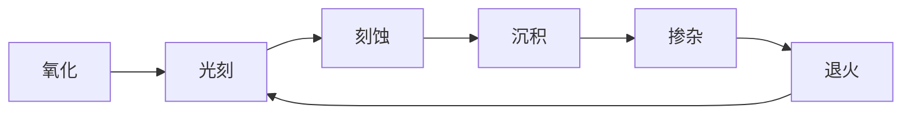
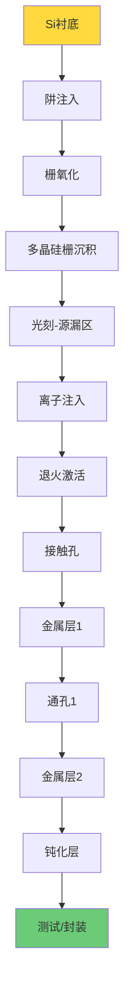
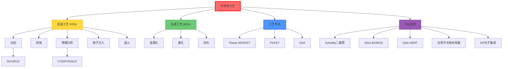

# 半导体工艺

## 一句话物理图像

> 在指甲盖大小的芯片上雕刻纳米电路——用光刻和刻蚀在硅片上建造电子城市

---

## 核心工艺流程



### CMOS 制造完整流程



---

## 光刻 (Photolithography)

### 光刻工艺步骤

| 步骤 | 操作 | 关键参数 |
|------|------|----------|
| 1. 涂胶 | 旋涂光刻胶 | 厚度 0.5-5 μm |
| 2. 软烘 | 去除溶剂 | 90-120°C, 60-90s |
| 3. 曝光 | UV/DUV/EUV 照射 | 剂量 10-100 mJ/cm² |
| 4. 后烘 | PEB (化学放大胶) | 100-130°C |
| 5. 显影 | 溶解曝光区/未曝光区 | 显影时间 30-60s |
| 6. 硬烘 | 增强胶的稳定性 | 120-150°C |

### 光刻胶类型

| 类型 | 原理 | 分辨率 | 应用 |
|------|------|--------|------|
| 正胶 (Positive) | 曝光区溶解 | 高 | 主流工艺 |
| 负胶 (Negative) | 曝光区交联保留 | 中 | 特殊应用 |
| 化学放大胶 (CAR) | 光致产酸剂催化 | 最高 | DUV/EUV |

### 分辨率与曝光技术

分辨率公式：

$$R = k_1 \cdot \frac{\lambda}{NA}$$

| 参数 | 含义 | 典型值 |
|------|------|--------|
| $k_1$ | 工艺因子 | 0.25-0.5 |
| $\lambda$ | 曝光波长 | 见下表 |
| $NA$ | 数值孔径 | 0.5-1.35 |

| 曝光技术 | 波长 | 分辨率 | 节点 |
|----------|------|--------|------|
| G-line | 436 nm | ~0.5 μm | >250 nm |
| I-line | 365 nm | ~0.35 μm | 250 nm |
| KrF (DUV) | 248 nm | ~0.13 μm | 130-90 nm |
| ArF (DUV) | 193 nm | ~38 nm (浸没) | 65-14 nm |
| EUV | 13.5 nm | <14 nm | 7-3 nm |

> [!concept]+ EUV 光刻
> 极紫外光刻使用 13.5 nm 波长，光源由 CO₂ 激光轰击 Sn 液滴产生等离子体辐射。整套光学系统必须在真空中运行（空气强烈吸收 EUV）。ASML 的 EUV 设备是当前最先进光刻的唯一供应商。

---

## 刻蚀 (Etching)

### 刻蚀方法对比

| 方法 | 各向异性 | 选择比 | 优点 | 缺点 |
|------|---------|--------|------|------|
| 湿法腐蚀 | 各向同性 | 高 (>10:1) | 简单、快 | 侧向钻蚀 |
| RIE | 各向异性 | 中 (5-10:1) | 图形好 | 损伤 |
| ICP-RIE | 各向异性 | 中 | 高密度等离子体 | 设备贵 |
| DRIE (Bosch) | 高各向异性 | 中 | 深槽/高深宽比 | 扇贝纹 |
| ALE | 原子层精度 | 极高 | 精确控制 | 慢 |

### RIE 刻蚀参数

$$\text{刻蚀速率} = k \cdot P_{RF}^{1/2} \cdot [gas]^m$$

| 刻蚀材料 | 气体 | 典型速率 |
|----------|------|---------|
| Si | SF₆, CF₄ | 100-500 nm/min |
| SiO₂ | CHF₃, CF₄ | 50-200 nm/min |
| Si₃N₄ | CHF₃/O₂ | 50-150 nm/min |
| Al | Cl₂, BCl₃ | 200-1000 nm/min |
| 光刻胶 | O₂ | 500-2000 nm/min |

### Bosch 深反应离子刻蚀 (DRIE)

交替进行刻蚀和钝化，实现高深宽比结构：

```
循环: 刻蚀(SF₆) → 钝化(C₄F₈) → 刻蚀 → 钝化 → ...
```

| 参数 | 典型值 |
|------|--------|
| 深宽比 | >20:1 |
| 侧壁粗糙度 | ~100 nm (扇贝纹) |
| 刻蚀速率 | 5-20 μm/min |

---

## 薄膜沉积

### 化学气相沉积 (CVD)

| CVD 类型 | 温度 | 压力 | 应用 |
|----------|------|------|------|
| APCVD | 600-900°C | 常压 | SiO₂, 掺杂玻璃 |
| LPCVD | 550-900°C | 0.1-1 Torr | SiO₂, Si₃N₄, 多晶Si |
| PECVD | 200-400°C | 0.1-10 Torr | SiO₂, Si₃N₄ (低温) |
| HPCVD | >1000°C | 高压 | 外延Si |
| MOCVD | 500-1100°C | 低压 | III-V 化合物 |

典型反应方程：

$$\text{SiH}_4 + \text{O}_2 \xrightarrow{LPCVD} \text{SiO}_2 + 2\text{H}_2$$

$$3\text{SiH}_4 + 4\text{NH}_3 \xrightarrow{LPCVD} \text{Si}_3\text{N}_4 + 12\text{H}_2$$

### 物理气相沉积 (PVD)

| 方法 | 原理 | 应用 |
|------|------|------|
| 蒸发 (热蒸发) | 电阻加热/电子束 | 金属层, Au, Al |
| 溅射 | Ar⁺ 轰击靶材 | 金属, 合金, 化合物 |
| 电子束蒸发 | 高能电子束熔化 | 高纯度薄膜 |

### 原子层沉积 (ALD)

自限制的逐层沉积，每循环沉积一个原子层：

$$\text{速率} = \frac{\text{单层厚度}}{\text{循环}} \approx 0.5-1.5\,\text{Å/循环}$$

| 材料 | 前驱体 | 沉积温度 |
|------|--------|---------|
| Al₂O₃ | TMA + H₂O | 100-300°C |
| HfO₂ | TEMAH + H₂O | 200-350°C |
| TiN | TiCl₄ + NH₃ | 300-500°C |
| ZnO | DEZ + H₂O | 100-250°C |

> [!tip]+ ALD 优势
> 保形性极佳——即使是高深宽比沟槽（>100:1），内壁沉积厚度均匀。EUV 时代高 $k$ 栅介质（HfO₂）几乎全部用 ALD 沉积。

---

## 掺杂 (Doping)

### 离子注入

将杂质离子加速到高能（10 keV - 5 MeV），注入硅衬底。

| 参数 | 含义 |
|------|------|
| 注入剂量 | 单位面积离子数 (cm⁻²) |
| 注入能量 | 决定注入深度 |
| 常用杂质 | B (p型), P/As (n型) |

射程估算 (LSS 理论)：

$$R_p \approx \frac{E^{2/3}}{N \cdot Z^{1/3}}$$

| 杂质 | 能量 | $R_p$ (投射射程) |
|------|------|-----------------|
| B → Si | 50 keV | ~0.2 μm |
| P → Si | 100 keV | ~0.15 μm |
| As → Si | 100 keV | ~0.07 μm |

### 退火 (Annealing)

离子注入后损伤晶格，需退火修复并激活杂质。

| 退火方式 | 温度 | 时间 | 特点 |
|----------|------|------|------|
| 炉管退火 | 800-1000°C | 30-60 min | 杂质扩散大 |
| 快速热退火 (RTA) | 1000-1100°C | 10-30 s | 扩散小 |
| 闪光灯退火 | >1200°C | ms | 超浅结 |
| 激光退火 | 局部熔化 | ns | 选择性 |

---

## MOSFET 制造流程

### NMOS 器件关键步骤

```
1. P型Si衬底
2. 浅沟槽隔离 (STI) — 刻蚀+氧化+CMP填充
3. 阱注入 — 调节阈值电压
4. 栅氧化 — 热生长 SiO₂ 或 ALD HfO₂
5. 多晶硅/金属栅沉积
6. 栅图案化 — 光刻+刻蚀
7. LDD 注入 — 轻掺杂漏，减小热载流子效应
8. 侧墙 (Spacer) — 沉积+各向异性刻蚀
9. 源/漏注入 — 重掺杂
10. 退火激活
11. 硅化物 — Ti/Co/Ni → TiSi₂/CoSi₂/NiSi
12. 接触孔+金属化
```

### 先进节点器件结构

| 节点 | 结构 | 关键改进 |
|------|------|---------|
| >22 nm | Planar MOSFET | 传统结构 |
| 22-7 nm | FinFET | 3D栅控制，降低漏电 |
| 5-3 nm | GAA (Nanosheet) | 全环绕栅极 |
| <3 nm | CFET | N/P stacked，面积减半 |

---

## 关键参数

### 射频/微波器件参数

| 参数 | 含义 | 物理意义 |
|------|------|---------|
| $f_T$ | 截止频率 | 电流增益 = 1 时的频率 |
| $f_{max}$ | 最大振荡频率 | 功率增益 = 1 时的频率 |
| $NF_{min}$ | 最小噪声系数 | 器件本征噪声 |
| $BV_{CEO}$ | 击穿电压 | 集电极-发射极耐压 |
| $V_{th}$ | 阈值电压 | 器件开启电压 |

$$f_T = \frac{g_m}{2\pi(C_{gs} + C_{gd})}$$

$$f_{max} = \sqrt{\frac{f_T}{8\pi R_g C_{gd}}}$$

### 各工艺节点参数对比

| 工艺 | $f_T$ (GHz) | $f_{max}$ (GHz) | $BV_{CEO}$ (V) | NF@10GHz (dB) |
|------|------------|----------------|---------------|--------------|
| 130 nm SiGe | ~200 | ~250 | 2.0 | ~0.5 |
| 90 nm SiGe | ~300 | ~350 | 1.7 | ~0.4 |
| 65 nm CMOS | ~200 | ~250 | 1.2 | ~0.8 |
| 28 nm CMOS | ~300 | ~350 | 1.0 | ~0.6 |
| 14 nm FinFET | ~350 | ~400 | 0.8 | ~0.5 |
| GaAs mHEMT | ~400 | ~500 | 2.5 | ~0.3 |
| InP HEMT | ~600 | ~1000 | 1.5 | ~0.2 |
| GaN HEMT | ~100 | ~200 | >40 | ~0.5 |

---

## THz 应用需求

### THz 器件的工艺选择

| 应用 | 需求 | 推荐工艺 | 原因 |
|------|------|---------|------|
| THz 倍频器 | 高 $BV$ + 中 $f_T$ | GaAs Schottky | 击穿电压高，SBD 工艺成熟 |
| THz 检测器 | 低 NF | InP HEMT | $f_T$ 最高，噪声最低 |
| THz 放大器 | 高 $f_{max}$ | InP HBT/HEMT | $f_{max}$ > 500 GHz |
| 集成 THz SoC | 高集成 + 低成本 | SiGe BiCMOS | 集成度 + 射频性能平衡 |
| THz 功放 | 高功率 | GaN HEMT | 击穿电压 > 40V |

### Schottky 二极管 — THz 倍频核心

$$I = I_s\left(e^{qV/nkT} - 1\right)$$

理想因子 $n \approx 1.05-1.15$，结电容 $C_j \sim 1-10$ fF。

| 参数 | GaAs SBD | Si Schottky |
|------|----------|-------------|
| 势垒高度 | 0.6-0.9 eV | 0.5-0.7 eV |
| $f_T$ | >1 THz | ~200 GHz |
| $BV$ | 4-8 V | 3-5 V |

---

## THz 器件的半导体工艺实现

> 以下内容基于 RAG 库中的 [[cite:@THzRoadmap2017]] (2017 THz Science and Technology Roadmap) Section 5

### 等离子体增强光导开关

传统光导天线 (PCA) 的核心瓶颈：半导体中光生载流子的寿命决定了 THz 脉冲的带宽和幅度。[[cite:@THzRoadmap2017]] Section 5 介绍了纳米图案化电极结构解决这一瓶颈：

![[fa8088acbae42ed0_p13_f05.png]]
*Figure 6 from [[cite:@THzRoadmap2017]]: 纳米图案化电极的光导开关示意图。纳米"手指"结构使激光光子通过等离子体耦合进入半导体，显著增强光吸收和载流子收集效率。(Courtesy of M. Jarrahi, UCLA)*

**工艺要点**：

| 工艺步骤 | 参数 | 目的 |
|----------|------|------|
| 衬底 | LT-GaAs 或 SI-GaAs | 短载流子寿命 (<1 ps) |
| 纳米电极图案化 | EBL + 剥离工艺 | 间隙 ~100-200 nm |
| 电极材料 | Au/Ti 或 Au/Ge/Ni | 欧姆接触 |
| 等离子体结构 | 金属纳米"手指"阵列 | 增强光-物质耦合 |

> [!concept]+ 物理图像
> 纳米"手指"电极的本质是**光学天线阵列**——每个金属指条是一个亚波长天线，将入射光局域到半导体表面极近的区域，使光子吸收率从体材料的 ~1% 提升到接近 100%。这就是 [[cite:@Bharadwaj2009]] 描述的光学天线原理的直接应用。

**性能对比** (来自 [[cite:@THzRoadmap2017]])：

| 光导开关类型 | 光-THz 转换效率 | 频谱宽度 | 驱动激光 |
|-------------|----------------|---------|---------|
| 传统平面电极 | ~$10^{-4}$ | 0.1-3 THz | 飞秒激光 |
| 纳米图案化电极 | ~$10^{-3}$ (10×提升) | 0.1-5 THz | 飞秒激光 |
| 等离子体增强 | ~$10^{-2}$ (100×提升) | 0.1-7 THz | 纳秒/连续激光 |

### 光子集成工艺 — THz 收发器芯片化

[[cite:@THzRoadmap2017]] 展示了 III-V 族光子集成电路用于 THz 收发的先进工艺：

![[fa8088acbae42ed0_p43_f25.png]]
*Figure 25/27 from [[cite:@THzRoadmap2017]]: (a) 单片光子集成电路工艺——MMI 耦合器、SOA 光放大器和 2×2 调制器集成在同一 InP 芯片上；(b) 4.1 mm 芯片上的双 DBR 激光器通过 OPGC 输入产生可调谐 THz 信号。*

**InP 基光子集成工艺流程**：

| 步骤 | 工艺 | 关键参数 |
|------|------|---------|
| 外延生长 | MOCVD / MBE (InP/InGaAsP) | 精确控制量子阱厚度 ±0.1 nm |
| 光栅刻蚀 | 全息光刻 / EBL | DFB 光栅周期 ~240 nm (1.55 μm) |
| 波导定义 | ICP-RIE (CH₄/H₂/Ar) | 侧壁粗糙度 < 10 nm |
| 掺杂 | Zn 扩散 (p型) / Si 注入 (n型) | 接触电阻 < $10^{-6}$ Ω·cm² |
| 金属化 | Ti/Pt/Au 蒸发 + 剥离 | 电极尺寸 ~μm 级 |
| 解理/镀膜 | 解理面 + AR/HR 镀膜 | 反射率 0.1-99.9% |

### THz 加速器中的精密加工

> 基于 RAG 库中的 [[cite:@Nanni2015]] (Nanni et al., "Terahertz-driven linear electron acceleration")

[[cite:@Nanni2015]] 展示了 THz 频段精密金属加工的极限能力：

**THz LINAC 关键部件工艺**：

| 部件 | 材料 | 加工方法 | 精度要求 |
|------|------|---------|---------|
| 铜波导 | 无氧铜 CNC | 精密车削 | 内壁粗糙度 < 100 nm |
| 介质加载环 | 石英 / 蓝宝石 | 激光切割 + 抛光 | 同心度 < 10 μm |
| THz 耦合器 | 铜锥形过渡 | 电铸 / SPIRAL | 壁厚精度 ±5 μm |
| 束流管道 | 不锈钢 | 电抛光 | 内径 ±20 μm |

[[cite:@Nanni2015]] 指出：THz 波导的介质壁厚度对耦合效率有决定性影响——壁厚偏差 >5% 会导致 THz 脉冲耦合效率下降 >3 dB。这要求加工精度达到亚微米量级。

---

## 封装与测试

### 封装类型

| 封装 | 频率适用性 | 特点 |
|------|-----------|------|
| QFN | <10 GHz | 低成本，引脚短 |
| BGA | <30 GHz | 高引脚密度 |
| 倒装芯片 (Flip-chip) | <100 GHz | 短互连 |
| 芯片-膜 (Chip-on-film) | <200 GHz | 超短互连 |
| 晶圆级封装 (WLP) | <300 GHz | 最短互连 |

### 射频测试

| 测试类型 | 仪器 | 测量内容 |
|----------|------|----------|
| S参数测量 | VNA | $S_{11}, S_{21}$, 阻抗 |
| 功率测量 | 功率计 | 输出功率, 效率 |
| 噪声测量 | 噪声系数分析仪 | NF, $F_{min}$ |
| 频谱测量 | 频谱分析仪 | 谐波, 杂散 |
| 负载牵引 | 调谐器+VNA | 最优负载阻抗 |

---

## 知识树



---

## 参考文献

1. **[[cite:@Jaeger2008]]** — "Introduction to Microelectronic Fabrication", 半导体工艺入门
2. **[[cite:@Plummer2000]]** — "Silicon VLSI Technology", 硅VLSI技术
3. **[[cite:@Sze2007]]** — "Physics of Semiconductor Devices", 半导体器件物理
4. **[[cite:@Deal2004]]** — "THz sources based on Schottky diode frequency multipliers", THz倍频工艺
5. **[[cite:@THzRoadmap2017]]** — "The 2017 terahertz science and technology roadmap", *J. Phys. D* 50, 043001 (2017). **RAG 库收录** — 光导开关纳米电极工艺、InP 光子集成
6. **[[cite:@Nanni2015]]** — Nanni et al., "Terahertz-driven linear electron acceleration", *Nature Commun.* 6, 1 (2015). **RAG 库收录** — THz 精密金属加工
7. **[[cite:@Bharadwaj2009]]** — Bharadwaj, Deutsch & Novotny, "Optical Antennas", *Adv. Opt. Photon.* 1, 438 (2009). **RAG 库收录** — 纳米天线增强原理

---

## 延伸阅读

- [[半导体物理]] — 器件物理基础
- [[CMOS太赫兹集成电路]] — THz集成电路设计
- [[微波工程]] — 高频电路应用
