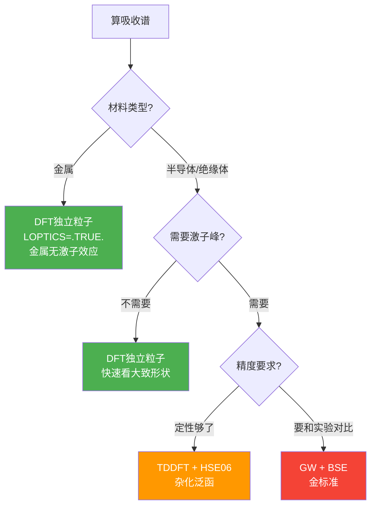
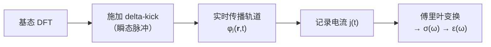

# DFT/TDDFT计算方法

## 一句话物理图像

> DFT把"300个电子的波函数"简化成"一张电子密度图"——用密度 $n(\mathbf{r})$ 代替一切。TDDFT让这张密度图随时间变化，就能算出材料吸收哪些频率的光。

---

## 一、关键术语表（先理解这些，后面才能看懂）

> [!info]+ 遇到不懂的术语，回来查这张表

| 术语 | 英文 | 一句话解释 |
|------|------|-----------|
| **泛函** | Functional | "函数的函数"——输入是一个函数（密度），输出是一个数（能量）。就像"称重机"：输入人（函数），输出体重（数） |
| **交换关联** | Exchange-Correlation (xc) | 量子力学中电子之间的两种多体效应：交换（Pauli不相容→同自旋电子避开）+ 关联（库仑排斥→所有电子互相躲避） |
| **绝热近似** | Adiabatic approximation | 假设电子在每一时刻都"来不及记住过去"——直接用基态的 xc 泛函代入瞬时密度，忽略记忆效应。这是标准TDDFT的做法，但对强场和双重激发失效 |
| **Casida方程** | Casida equation | 线性响应TDDFT的核心方程——解一个矩阵本征值问题，直接得到所有激发能和振子强度。是分子激发态计算的标准方法 |
| **xc核** | xc kernel $f_{xc}$ | 描述 xc 势对密度扰动的响应：$f_{xc} = \delta v_{xc} / \delta n$。它的长程行为决定了能不能描述激子 |
| **激子** | Exciton | 固体中光激发产生的"电子-空穴对"，它们之间有Coulomb束缚。就像氢原子，但一个粒子是空穴。激子效应让吸收谱出现锐利低能峰 |
| **BSE** | Bethe-Salpeter Equation | 多体理论中描述激子的方程。可以理解为"升级版的TDDFT"——显式包含电子-空穴相互作用，精度最高但计算量也最大 |
| **GW** | GW approximation | 多体微扰方法，修正DFT的带隙。G=Green函数，W=屏蔽Coulomb相互作用。是BSE的前置步骤 |
| **独立粒子近似** | Independent particle approx. | 完全忽略电子-空穴相互作用，只算"一个电子从价带跳到导带吸收多少能量"。速度最快但不含激子 |
| **delta-kick** | Delta kick | RT-TDDFT中"踢一脚"的技巧——给系统施加一个瞬时脉冲扰动，然后让电子自由振荡，记录响应做傅里叶分析得吸收谱 |
| **介电函数** | Dielectric function $\varepsilon(\omega)$ | 描述材料对电场的响应。虚部 $\varepsilon_2(\omega)$ 直接正比于吸收系数。实部 $\varepsilon_1$ 给出折射率 |
| **杂化泛函** | Hybrid functional | 把DFT的 xc 势和Hartree-Fock的精确交换"混合"（如PBE0混25%），从而修正带隙。HSE06是屏蔽版本，更适合固体 |

---

## 二、DFT是什么？（从问题出发）

### 2.1 问题：电子太多了算不动

固体中每个原子有几个到几十个电子。1 cm³ 的硅有 ~10²³ 个电子。量子力学说：要解 N 电子的 Schrödinger 方程

$$i\frac{\partial}{\partial t}\Psi(\mathbf{r}_1, ..., \mathbf{r}_N, t) = \hat{H}(t)\Psi$$

但 $\Psi$ 是 3N 维函数——3个电子勉强算，30个就很吃力，300个直接放弃。

### 2.2 Hohenberg-Kohn定理的绝妙想法（1964）

> **外势 $v(\mathbf{r})$ 由基态密度 $n_0(\mathbf{r})$ 唯一确定。**

翻译成大白话：只要知道"空间中每个位置有多少电子"（密度图），就知道了一切——原子核在哪、能量是多少、力有多大。

```
传统量子力学：  Ψ(r₁, r₂, ..., rN)  →  3N维函数，指数爆炸
DFT：          n(r)                   →  3维函数，可以算！
```

### 2.3 Kohn-Sham方程——怎么实际算出来

Kohn和Sham（1965）的方案：把真实的多电子问题映射到**一组假想的无相互作用电子**：

$$\left[-\frac{\nabla^2}{2} + \underbrace{v_{\text{ext}}}_{\text{原子核吸引}} + \underbrace{v_H}_{\text{电子间经典排斥}} + \underbrace{v_{xc}}_{\text{交换关联（唯一的近似）}}\right] \varphi_j = \varepsilon_j \varphi_j$$

> [!important]+ 核心要点
> 前3项都是精确的。**所有误差都来自 $v_{xc}$**——它包含了交换（Pauli不相容）和关联（电子间动态回避）的全部量子多体效应。
>
> **选什么泛函来近似 $v_{xc}$，决定了你的计算准不准。**

### 2.4 泛函的进化——精度vs成本

| 泛函 | 怎么做的 | 带隙精度 | 计算速度 | 适合什么 |
|------|----------|----------|----------|----------|
| **LDA** | 假设每个位置的 xc 势只取决于该点的密度（像"只看局部"） | 低估30-50% | ★★★★★ | 快速预览 |
| **PBE (GGA)** | 在LDA基础上加上密度梯度（"也看邻居"） | 低估30-50% | ★★★★ | VASP默认 |
| **HSE06** | 混入25% Hartree-Fock精确交换（"参考精确方法"） | 误差~10% | ★★★ | **推荐用于吸收谱** |
| **PBE0** | 混入25% HF交换（非屏蔽版） | 误差~10% | ★★ | 更适合分子 |
| **GW** | 多体微扰论（"从头修正准粒子能量"） | <5% | ★ | BSE前置 |

> [!example]+ 为什么PBE带隙总是偏小？
> 根本原因叫**导数不连续(derivative discontinuity)**：当电子数从 N 变到 N+1 时，真实的 $v_{xc}$ 应该有一个跳变，但 PBE 等半局域泛函完全忽略了这一点。杂化泛函通过混入精确交换部分修正了这个问题。[[cite:@Ullrich2025]]

---

## 三、TDDFT——让密度动起来

### 3.1 TDDFT比DFT多了什么？

DFT算基态（静态）。但光照材料时电子被激发——密度随时间变化。Runge和Gross（1984）证明了含时版的 Hohenberg-Kohn 定理：

$$i\frac{\partial}{\partial t}\varphi_j(\mathbf{r},t) = \left[-\frac{\nabla^2}{2} + v_{\text{ext}}(\mathbf{r},t) + v_H(\mathbf{r},t) + v_{xc}(\mathbf{r},t)\right] \varphi_j(\mathbf{r},t)$$

和DFT唯一区别：所有量变成时间依赖的。$v_{xc}$ 理论上应该依赖历史（记忆效应），但实际中**几乎总是用绝热近似**——直接把基态泛函代入瞬时密度。

### 3.2 两条路线：线性响应 vs 实时传播

| | 线性响应 (LR-TDDFT) | 实时传播 (RT-TDDFT) |
|---|---|---|
| **类比** | 先算好吉他弦的所有谐频再弹 | 直接拨弦，录音做频谱分析 |
| **做法** | 解Casida方程 → 直接得到激发能 | 施加delta-kick → 传播轨道 → 傅里叶变换 |
| **适合** | 分子激发态、精确吸收峰 | HHG、超快过程、非线性 |
| **工具** | VASP+WEST, Gaussian | **Octopus** |
| **局限** | Casida矩阵随体系立方增长 | 传播时间长才分辨率高 |

### 3.3 TDDFT到底能算什么？（文献实证）

根据 Ullrich (2025) 综述 [[cite:@Ullrich2025]]，以下应用已有成功案例：

![[c115724664a915a2_p01_f00.png]]
> TDDFT相关论文数量逐年增长，目前每年约2000篇。[[cite:@Ullrich2025]] Fig. 1

![[c115724664a915a2_p11_f07.png]]
> RT-TDDFT在固体中的应用全景：从介电击穿到HHG到超快退磁。左上是Si的介电击穿，右上是Si的HHG，左下是金刚石的非线性响应含离子力，右下是质子穿过Au的电子密度扰动。[[cite:@Ullrich2025]] Fig. 10

| 应用领域 | 具体现象 | 文献证据 |
|----------|----------|----------|
| **线性光学** | 吸收谱、介电函数、折射率 | [[cite:@Tal2020]] Fig.3 系统对比6种材料 |
| **激子效应** | Si/GaAs/LiF中的激子吸收峰 | DDH泛函几乎完美重现BSE [[cite:@Ullrich2025]] Fig.7 |
| **非线性光学** | HHG（Si, 金刚石, hBN） | [[cite:@Ullrich2025]] Sec.IV.2.2 |
| **超快动力学** | 瞬态吸收、时间分辨ARPES | [[cite:@Ullrich2025]] Fig.11 |
| **磁学** | 磁子色散、超快退磁、OISTR | [[cite:@Ullrich2025]] Sec.IV.3 |
| **Floquet工程** | 光驱动拓扑相变 | Na₃Bi: Dirac↔Weyl [[cite:@Ullrich2025]] Fig.11(d) |

### 3.4 TDDFT做不了什么？

> [!danger]+ 绝热近似的硬伤（来自文献的直接证据）
> Ullrich综述用Hubbard三聚体模型清楚展示了绝热近似的失败 [[cite:@Ullrich2025]] Sec.II.3：
>
> **双重激发**：标准TDDFT只能产生**单激发**峰。高阶的双重/三重激发态完全缺失。
>
> **Rabi振荡失败**：在共振驱动下，绝热TDDFT永远无法完成基态→激发态的完全跃迁。原因是激发态密度变化导致xc势偏移，系统失谐。有记忆效应的精确xc势可以保持共振——但标准泛函做不到。

其他局限：
- **强关联体系**（NiO等过渡金属氧化物）：需DFT+U
- **长程电荷转移激发**：标准泛函严重低估，需长程修正
- **激子结合能精确值**：LRC核或DDH泛函只能部分解决

---

## 四、吸收谱怎么算——方法选择

### 4.1 决策树



### 4.2 不同方法的精度对比（来自Tal 2020的benchmark）

![[a7e2ee38bbbfbe37_p03_f01.png]]
> Tal 2020 Fig.3：6种材料（Si、金刚石、SiC、Ar、NaCl、MgO）用不同方法计算的吸收谱对比。黑色实线是实验，红色是DDH泛函（TDDFT），蓝色是BSE。可以看到DDH泛函几乎完美匹配BSE。[[cite:@Tal2020]]

> [!important]+ Tal 2020的核心发现
> **介电依赖杂化泛函(DDH)** 可以用 TDDFT 达到接近 BSE 的精度！关键是混合参数 $\alpha$ 不是经验值，而是从材料本身的介电函数自洽确定：$\alpha = (\varepsilon^{\text{RPA}})^{-1}_{00}(\mathbf{q}=0)$。这意味着对每种材料自动选择最优混合比例。

![[c115724664a915a2_p10_f06.png]]
> Ullrich 2025 Fig.7：LiF的介电函数虚部（左）和Si/GaAs的吸收谱（右）。**DDH泛函（绿色）几乎完美重现BSE（黑色）**，而LDA（红色）完全不包含激子峰。[[cite:@Ullrich2025]]

### 4.3 VASP实操：独立粒子近似（最快）

| 步骤 | WHY | INCAR设置 |
|------|-----|-----------|
| SCF自洽 | 得到收敛电荷密度 | 标准设置 |
| 非SCF加带 | 光学跃迁需要价带→导带矩阵元，空带少了高频截断 | `ICHARG=11; NBANDS=原设定×3` |
| LOPTICS | 计算速度算符矩阵元 $\langle c|\hat{v}|v\rangle$ | `LOPTICS=.TRUE.; CSHIFT=0.1` |
| 后处理 | 提取 $\varepsilon_2(\omega)$ 即吸收谱 | VASPKIT: `vaspkit > 71` |

### 4.4 Octopus实操：RT-TDDFT

Octopus的策略完全不同——**踢一脚，看振荡**：



> 物理类比：静止的钟摆被弹一下，以固有频率振动。录下振动做频谱分析→得到所有共振频率=吸收峰。

**关键参数**（来自Octopus Si教程 [[cite:@Tancogne-Dejean2020]]）：

| 参数 | 教程值 | 含义 | 调参建议 |
|------|--------|------|----------|
| `Spacing` | 0.5 | 实空间网格(a.u.) | 0.3-0.5，越小越准但越慢 |
| `TDPropagationTime` | 1500 | 传播时间(a.u.) | **越长频率分辨率越高** |
| kick强度 | 0.01 | 扰动幅度 | **必须小→保持线性响应** |
| k点 | ≥5×5×5 | BZ采样 | 低k点→假峰+噪声 |

> [!warning]+ Octopus教程的两个重要发现
> 1. **两种方法**：电流法（`oct-conductivity`）和规范场法（`oct-dielectric-function`），结果等价但数值特性不同。规范场法更稳定但需更多k点。
> 2. **Si的三个特征峰**对应带结构的 $E_0$、$E_1$、$E_1'$ 临界点——这是验证计算是否正确的直接判据。

---

## 五、验证吸收谱——实操清单

### 5.1 第一步：肉眼检查

| 看 | 正常 | 异常→原因 |
|----|------|----------|
| 吸收边 | ≈ 你的泛函给出的带隙 | 远低于带隙 → 可能缺陷态 |
| 峰个数 | 和已知实验/文献一致 | 多出尖峰 → k点不够 |
| 光滑度 | 平滑曲线 | 振荡/噪声 → k点不够或传播时间短 |
| 高频尾部 | 逐渐衰减 | 突然截断 → NBANDS不够 |

### 5.2 第二步：泛函选择的影响（有文献数据支撑）

| 泛函 | 吸收谱特点 | 原因（文献解释） |
|------|-----------|-----------------|
| **PBE** | 吸收边偏低0.5-1.5 eV，**无激子峰** | xc核缺乏 $1/|\mathbf{r}-\mathbf{r}'|$ 长程行为 [[cite:@Ullrich2025]] Sec.III.2 |
| **HSE06** | 吸收边改善，可能看到弱激子 | 屏蔽交换引入部分长程修正 |
| **DDH** | **几乎完美重现BSE** | $\alpha$ 从介电函数自洽得出 [[cite:@Tal2020]] |
| **GW+BSE** | 金标准 | 显式包含电子-空穴相互作用 |

> **判断逻辑**：如果你用PBE算Si得到带隙0.6 eV，吸收谱从0.6 eV开始——这是正常的PBE结果，不是错误。问题在泛函，不在你的操作。

### 5.3 第三步：收敛性测试

> "收敛" = 参数变一下，结果不变。

| 参数 | 测试方法 | 收敛判据 |
|------|----------|----------|
| **k点** | 4→6→8→10 逐步加密 | 峰位变化 < 0.05 eV |
| **NBANDS** | 逐步增加（到原设定×3-5） | 高频峰位变化 < 0.1 eV |
| **ENCUT** | 逐步增大 | 总能量变化 < 1 meV/atom |
| **Spacing**(Octopus) | 0.5→0.4→0.3 | 峰位变化 < 0.05 eV |
| **传播时间**(Octopus) | 500→1000→1500 | 峰宽变化可忽略 |

### 5.4 Si的benchmark数值（多文献汇总）

| 特征 | PBE | HSE06 | GW+BSE | 实验 |
|------|-----|-------|--------|------|
| 带隙 | ~0.6 eV | ~1.0 eV | ~1.15 eV | 1.12 eV |
| $E_1$峰位 | 偏低 | ~3.3 eV | ~3.4 eV | 3.4 eV |
| 激子效应 | 无 | 弱 | 有(~15 meV) | 有 |

---

## 六、常见问题速查

| 问题 | 原因 | 解决 |
|------|------|------|
| 吸收谱全为零 | LOPTICS没开或NBANDS太少 | 检查INCAR，NBANDS加到×3 |
| 峰位比实验蓝移 | PBE带隙偏低→吸收边也偏低 | 换HSE06或做GW |
| 有尖刺/噪声 | k点不够 | 加密k网格 |
| 没有激子峰 | 独立粒子近似不含激子 | TDDFT+DDH或BSE |
| Octopus低频发散 | 电流法的数值假象 | 加k点或换规范场法 |

---

## 七、DFT/TDDFT计算能力全景图

![[c115724664a915a2_p04_f01.png]]
> RT-TDDFT应用总览图：涵盖周期固体、分子、多光子过程、Floquet拓扑、自旋动力学、TDDFT+QED等前沿方向。[[cite:@Ullrich2025]] Fig.8

---

## 八、文献索引与阅读建议

| 优先级 | 文献 | 你该看什么 |
|--------|------|-----------|
| ★★★★★ | [[cite:@Tal2020]] | Fig.3（6种材料吸收谱对比），理解DDH泛函为什么接近BSE |
| ★★★★★ | [[cite:@Ullrich2025]] | Sec.III.2（固体激子），Fig.7（DDH vs BSE对比图） |
| ★★★ | [[cite:@Tancogne-Dejean2020]] | Octopus Si教程，跟着跑一遍 |
| ★★★ | VASP BSE Tutorial | 理解GW+BSE三步pipeline |

---

*参考文献：*
- Tancogne-Dejean, N. et al. J. Chem. Phys. **152**, 124119 (2020). DOI: 10.1063/1.5142502
- Tal, A. & Liu, P. Phys. Rev. Research **2**, 032019 (2020). DOI: 10.1103/PhysRevResearch.2.032019
- Ullrich, C. A. arXiv:2509.10745 (2025)

*最后更新：2026-05-21*
