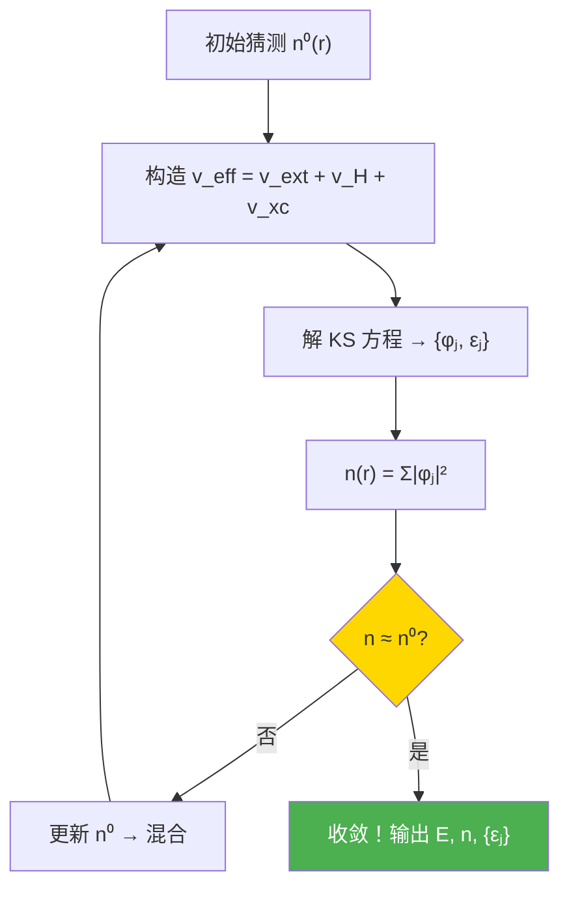
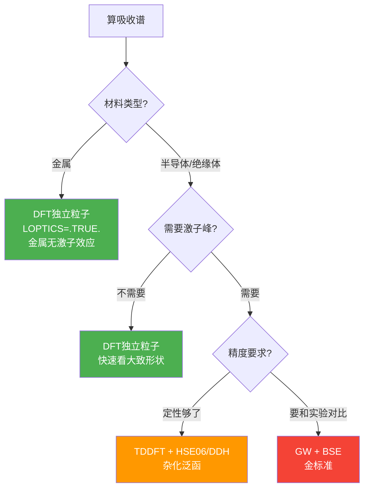
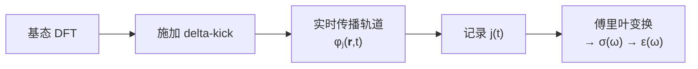
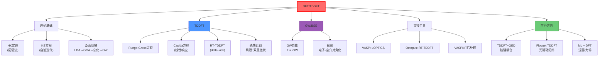

# DFT/TDDFT计算方法

## 一句话物理图像

> DFT把"300个电子的波函数"简化成"一张电子密度图"——用密度 $n(\mathbf{r})$ 代替一切。TDDFT让这张密度图随时间变化，就能算出材料吸收哪些频率的光。

---

## 零、为什么需要 DFT？

### 0.1 多电子问题的指数灾难

固体中每个原子有几个到几十个电子。1 cm³ 的硅有 ~10²³ 个电子。量子力学说：要解 N 电子的 Schrödinger 方程

$$i\frac{\partial}{\partial t}\Psi(\mathbf{r}_1, ..., \mathbf{r}_N, t) = \hat{H}(t)\Psi$$

但 $\Psi$ 是 3N 维函数——3个电子勉强算，30个就很吃力，300个直接放弃。

| 体系 | 电子数 N | $\Psi$ 维度 | 直接求解 |
|------|---------|------------|---------|
| H₂O | 10 | 30维 | 可算 |
| Si 单胞 | 56 | 168维 | 极难 |
| Au 纳米颗粒 (2nm) | ~200 | 600维 | 不可能 |

**关键洞察**：$\Psi$ 有 3N 个自由度，但可观测的电子密度 $n(\mathbf{r})$ 只有 3 个自由度。能否跳过 $\Psi$，直接用 $n(\mathbf{r})$ 计算一切？

### 0.2 DFT 的核心承诺

```
传统量子力学：  Ψ(r₁, r₂, ..., rN)  →  3N维函数，指数爆炸
DFT：          n(r)                   →  3维函数，可以算！
```

代价：必须近似"交换关联泛函"——这是 DFT 所有误差的唯一来源。

---

## 一、关键术语表

> [!info]+ 遇到不懂的术语，回来查这张表

| 术语 | 英文 | 一句话解释 |
|------|------|-----------|
| **泛函** | Functional | "函数的函数"——输入是一个函数（密度），输出是一个数（能量）。就像"称重机"：输入人（函数），输出体重（数） |
| **交换关联** | Exchange-Correlation (xc) | 量子力学中电子之间的两种多体效应：交换（Pauli不相容→同自旋电子避开）+ 关联（库仑排斥→所有电子互相躲避） |
| **绝热近似** | Adiabatic approximation | 假设电子在每一时刻都"来不及记住过去"——直接用基态的 xc 泛函代入瞬时密度，忽略记忆效应 |
| **Casida方程** | Casida equation | 线性响应TDDFT的核心方程——解一个矩阵本征值问题，直接得到所有激发能和振子强度 |
| **xc核** | xc kernel $f_{xc}$ | 描述 xc 势对密度扰动的响应：$f_{xc} = \delta v_{xc} / \delta n$。它的长程行为决定能不能描述激子 |
| **激子** | Exciton | 固体中光激发产生的"电子-空穴对"，Coulomb束缚。就像氢原子，但一个粒子是空穴 |
| **BSE** | Bethe-Salpeter Equation | 多体理论中描述激子的方程。"升级版的TDDFT"——显式包含电子-空穴相互作用 |
| **GW** | GW approximation | 多体微扰方法，修正DFT的带隙。G=Green函数，W=屏蔽Coulomb相互作用 |
| **delta-kick** | Delta kick | RT-TDDFT中"踢一脚"——瞬时脉冲扰动，让系统自由振荡，傅里叶分析得吸收谱 |
| **介电函数** | Dielectric function $\varepsilon(\omega)$ | 虚部 $\varepsilon_2(\omega)$ 正比于吸收系数。实部 $\varepsilon_1$ 给出折射率 |
| **杂化泛函** | Hybrid functional | DFT xc势 + Hartree-Fock精确交换混合（如PBE0混25%），修正带隙 |

---

## 二、DFT 理论基础：从定理到方程

### 2.1 Hohenberg-Kohn 第一定理（1964）

> **定理表述**：外势 $v_{\text{ext}}(\mathbf{r})$ 由基态密度 $n_0(\mathbf{r})$ 唯一确定（至多差一个常数）。

**反证法推导**（4步）：

**Step 1 — 假设反面成立**：假设存在两个不同的外势 $v_1$ 和 $v_2$，产生相同的基态密度 $n_0(\mathbf{r})$。

**Step 2 — 变分原理给出约束**：由变分原理

$$E_1 = \langle\Psi_1|\hat{H}_1|\Psi_1\rangle < \langle\Psi_2|\hat{H}_1|\Psi_2\rangle = E_1[n_0] + \langle\Psi_2|\hat{H}_2 - \hat{H}_1|\Psi_2\rangle$$

因为 $\hat{H}_1 - \hat{H}_2 = v_1 - v_2$（只有外势不同），所以

$$E_1 < E_2 + \int n_0(\mathbf{r})[v_1(\mathbf{r}) - v_2(\mathbf{r})]\,d\mathbf{r}$$

**Step 3 — 交换1和2**：同理

$$E_2 < E_1 + \int n_0(\mathbf{r})[v_2(\mathbf{r}) - v_1(\mathbf{r})]\,d\mathbf{r}$$

**Step 4 — 矛盾**：两式相加

$$E_1 + E_2 < E_2 + E_1$$

矛盾！故假设不成立，$v_{\text{ext}}$ 由 $n_0$ 唯一确定。 $\blacksquare$

> [!concept]+ HK定理的物理意义
> 一旦知道基态密度 $n_0(\mathbf{r})$，就知道了外势 $v_{\text{ext}}$，从而知道了 Hamiltonian $\hat{H}$，从而知道了一切（能谱、力、力常数……）。
>
> **极限**：HK定理说的是"理论上可以"，没说"怎么算"。可计算性由 Kohn-Sham 方程解决。

### 2.2 Hohenberg-Kohn 第二定理（变分原理）

$$E[n] = T_s[n] + \int v_{\text{ext}}(\mathbf{r})n(\mathbf{r})\,d\mathbf{r} + E_H[n] + E_{xc}[n]$$

其中各项含义：

| 项 | 表达式 | 物理含义 |
|----|--------|---------|
| $T_s[n]$ | 非相互作用动能 | Kohn-Sham 轨道的动能（**不等于真实动能**） |
| $E_H[n]$ | $\frac{1}{2}\iint \frac{n(\mathbf{r})n(\mathbf{r}')}{|\mathbf{r}-\mathbf{r}'|}\,d\mathbf{r}\,d\mathbf{r}'$ | 经典 Coulomb 排斥（Hartree能） |
| $E_{xc}[n]$ | 交换+关联+动能修正 | **唯一的近似项**：交换 + 关联 + $(T - T_s)$ |

> [!important] 变分原理
> 对任何试探密度 $\tilde{n}(\mathbf{r}) \geq 0$ 且 $\int\tilde{n} = N$，有
> $$E[\tilde{n}] \geq E_0 = E[n_0]$$
> 即泛函在真实基态密度处取极小值。

### 2.3 Kohn-Sham 方程——从原理到实际计算

**思路**：把真实的多电子问题映射到一组假想的**无相互作用电子**，它们感受到一个等效势场：

$$\boxed{\left[-\frac{\nabla^2}{2} + v_{\text{ext}}(\mathbf{r}) + v_H(\mathbf{r}) + v_{xc}(\mathbf{r})\right] \varphi_j(\mathbf{r}) = \varepsilon_j \varphi_j(\mathbf{r})}$$

各项的推导来源：

| 势 | 定义 | 来源 |
|----|------|------|
| $v_{\text{ext}}$ | 原子核势（+外场） | 直接给出 |
| $v_H(\mathbf{r})$ | $\delta E_H / \delta n = \int \frac{n(\mathbf{r}')}{|\mathbf{r}-\mathbf{r}'|}\,d\mathbf{r}'$ | Hartree能的泛函导数 |
| $v_{xc}(\mathbf{r})$ | $\delta E_{xc} / \delta n$ | **泛函导数，核心近似** |

**自洽求解流程**：



**密度构造**：

$$n(\mathbf{r}) = \sum_{j=1}^{N} |\varphi_j(\mathbf{r})|^2$$

> [!warning]+ KS 轨道能 $\varepsilon_j$ 不是真实的准粒子能量
> 虽然 KS 本征值"长得像"能带，但它只是构造密度的辅助量。严格来说，只有最高占据态 $\varepsilon_{\text{HOMO}}$ 有物理意义（等于电离能的负值，Janak 定理）。带隙 $E_g^{\text{KS}} = \varepsilon_{\text{LUMO}} - \varepsilon_{\text{HOMO}}$ 系统性地**偏低**——这就是为什么 PBE 算 Si 带隙只得 0.6 eV（实验 1.12 eV）。

### 2.4 泛函的进化——精度 vs 成本

| 泛函 | 方法 | 带隙精度 | 计算速度 | 适合什么 |
|------|------|----------|----------|----------|
| **LDA** | 局域密度近似：$v_{xc}(\mathbf{r})$ 只取决于 $n(\mathbf{r})$ | 低估30-50% | ★★★★★ | 快速预览 |
| **PBE (GGA)** | 加上密度梯度 $\nabla n$ | 低估30-50% | ★★★★ | VASP默认 |
| **meta-GGA** | 加上 $\nabla^2 n$ 和动能密度 | 低估20-40% | ★★★ | SCAN泛函 |
| **HSE06** | 屏蔽杂化：混入25% HF交换（短程） | 误差~10% | ★★★ | **推荐用于吸收谱** |
| **PBE0** | 非屏蔽杂化：混入25% HF交换 | 误差~10% | ★★ | 更适合分子 |
| **DDH** | 介电依赖杂化：$\alpha = 1/\varepsilon_\infty$ | 误差~5% | ★★ | 接近BSE精度 |
| **GW** | 多体微扰：修正准粒子能量 | <5% | ★ | BSE前置 |

> [!example]+ 为什么 PBE 带隙总是偏小？
> 根本原因叫**导数不连续(derivative discontinuity)**：当电子数从 N 变到 N+1 时，真实的 $v_{xc}$ 应该有一个跳变 $\Delta_{xc}$，但 PBE 等半局域泛函完全忽略了这一点：
>
> $$E_g^{\text{true}} = \underbrace{(\varepsilon_{\text{LUMO}} - \varepsilon_{\text{HOMO}})}_{\text{KS带隙}} + \underbrace{\Delta_{xc}}_{\text{被PBE忽略}}$$
>
> 杂化泛函通过混入精确交换部分修正了 $\Delta_{xc}$。[[cite:@Ullrich2025]]

**数值示例——Si 的带隙**：

| 泛函 | $E_g$ (eV) | 与实验偏差 |
|------|-----------|-----------|
| LDA | 0.45 | -60% |
| PBE | 0.62 | -45% |
| HSE06 | 1.05 | -6% |
| $G_0W_0$ | 1.12 | <1% |
| 实验 | 1.12 | — |

---

## 三、TDDFT——让密度动起来

### 3.1 Runge-Gross 定理（1984）

含时版的 HK 定理：**含时密度 $n(\mathbf{r},t)$ 唯一确定含时外势 $v_{\text{ext}}(\mathbf{r},t)$**（给定初始态）。

含时 KS 方程：

$$\boxed{i\frac{\partial}{\partial t}\varphi_j(\mathbf{r},t) = \left[-\frac{\nabla^2}{2} + v_{\text{ext}}(\mathbf{r},t) + v_H[n](\mathbf{r},t) + v_{xc}[n](\mathbf{r},t)\right] \varphi_j(\mathbf{r},t)}$$

和DFT唯一区别：所有量变成时间依赖的。$v_{xc}$ 理论上应该依赖历史（记忆效应），但实际中**几乎总是用绝热近似**——直接把基态泛函代入瞬时密度：

$$v_{xc}^{\text{adiabatic}}[n](\mathbf{r},t) = v_{xc}^{\text{ground-state}}\big[n(t)\big](\mathbf{r})$$

> [!concept]+ 绝热近似的物理含义
> "绝热"假设电子在每一时刻都处于瞬时密度的基态——它们"来不及记住过去"。对弱扰动（线性光学）这足够好；对强场（HHG）和双重激发会失败。

### 3.2 线性响应 TDDFT：Casida 方程

**目标**：给定基态 KS 轨道 $\{\varphi_i\}$，求所有激发能 $\Omega_n$ 和振子强度 $f_n$。

**推导思路**（5步概要）：

**Step 1**：对基态施加弱外场 $\delta v_{\text{ext}}(\omega)$，密度产生线性响应 $\delta n(\mathbf{r},\omega)$。

**Step 2**：密度响应通过响应函数联系：

$$\delta n = \chi(\omega) \cdot \delta v_{\text{ext}}$$

**Step 3**：Dyson 方程连接非相互作用响应函数 $\chi_0$ 和真实响应函数 $\chi$：

$$\chi(\omega) = \chi_0(\omega) + \chi_0(\omega) \cdot (v_c + f_{xc}) \cdot \chi(\omega)$$

其中 $v_c = 1/|\mathbf{r}-\mathbf{r}'|$ 是Coulomb核，$f_{xc} = \delta v_{xc}/\delta n$ 是xc核。

**Step 4**：$\chi$ 的极点（发散条件）对应激发态。将方程转化为矩阵本征值问题——**Casida 方程**：

$$\boxed{\sum_{jb}\left[(\varepsilon_a - \varepsilon_i)\delta_{ia}\delta_{jb} + K_{ia,jb}\right] X_{jb}^{(n)} = \Omega_n X_{ia}^{(n)}}$$

其中 $ia$ 表示占据-未占据轨道对（$i$=占据, $a$=未占据），$K_{ia,jb}$ 是耦合矩阵：

$$K_{ia,jb} = \int\!\!\int \varphi_i^*(\mathbf{r})\varphi_a(\mathbf{r})\left[\frac{1}{|\mathbf{r}-\mathbf{r}'|} + f_{xc}(\mathbf{r},\mathbf{r}',\omega)\right]\varphi_j(\mathbf{r}')\varphi_b^*(\mathbf{r}')\,d\mathbf{r}\,d\mathbf{r}'$$

**Step 5**：解出 $\Omega_n$ 即为激发能，$X^{(n)}$ 给出每个激发态的轨道组成。

> [!tip]+ Casida 方程的直观理解
> 无耦合（$K=0$）时，$\Omega_n = \varepsilon_a - \varepsilon_i$ 就是 KS 轨道能差——单粒子激发。耦合矩阵 $K$ 包含：
> - **Coulomb项** $1/|\mathbf{r}-\mathbf{r}'|$：产生局域激子效应
> - **xc项** $f_{xc}$：修正交换关联对激发的影响
>
> 对于金属，$K$ 项很小（屏蔽强），独立粒子近似就够。对于绝缘体，$K$ 项大，产生激子峰。

### 3.3 两条路线：线性响应 vs 实时传播

| | 线性响应 (LR-TDDFT) | 实时传播 (RT-TDDFT) |
|---|---|---|
| **类比** | 先算好吉他弦的所有谐频再弹 | 直接拨弦，录音做频谱分析 |
| **做法** | 解Casida方程 → 激发能+振子强度 | 施加delta-kick → 传播轨道 → 傅里叶变换 |
| **适合** | 分子激发态、吸收谱 | HHG、超快过程、非线性光学 |
| **工具** | VASP+WEST, Gaussian, Q-Chem | **Octopus** |
| **局限** | Casida矩阵随体系立方增长 | 传播时间长才分辨率高 |
| **精度** | 对单激发精确，双重激发缺失 | 原则上可处理多重激发 |

### 3.4 RT-TDDFT 的 delta-kick 方法

**物理原理**：对处于基态的系统施加一个瞬时脉冲 $\mathbf{E}(t) = \mathbf{e}_0 \delta(t)$（delta-kick），系统被"弹一下"后以固有频率振荡。记录电流 $\mathbf{j}(t)$ 做傅里叶变换：

$$\sigma_{\alpha\beta}(\omega) = \frac{1}{\omega}\int_0^T e^{i\omega t}\, j_\alpha(t)\, dt$$

$$\varepsilon_{\alpha\beta}(\omega) = \delta_{\alpha\beta} + \frac{4\pi i}{\omega}\sigma_{\alpha\beta}(\omega)$$

**kick 强度必须足够小**（典型 0.01 a.u.），保证响应在线性范围内。

### 3.5 TDDFT 的应用全景（文献实证）

根据 Ullrich (2025) 综述 [[cite:@Ullrich2025]]：

| 应用领域 | 具体现象 | 文献证据 |
|----------|----------|----------|
| **线性光学** | 吸收谱、介电函数、折射率 | [[cite:@Tal2020]] Fig.3 系统对比6种材料 |
| **激子效应** | Si/GaAs/LiF中的激子吸收峰 | DDH泛函几乎完美重现BSE [[cite:@Ullrich2025]] Fig.7 |
| **非线性光学** | HHG（Si, 金刚石, hBN） | [[cite:@Ullrich2025]] Sec.IV.2.2 |
| **超快动力学** | 瞬态吸收、时间分辨ARPES | [[cite:@Ullrich2025]] Fig.11 |
| **磁学** | 磁子色散、超快退磁、OISTR | [[cite:@Ullrich2025]] Sec.IV.3 |
| **Floquet工程** | 光驱动拓扑相变 | Na₃Bi: Dirac↔Weyl [[cite:@Ullrich2025]] Fig.11(d) |

### 3.6 TDDFT 的局限

> [!danger]+ 绝热近似的硬伤
> 1. **双重激发**：标准TDDFT只能产生**单激发**峰。高阶的双重/三重激发态完全缺失。
> 2. **Rabi振荡失败**：共振驱动下，绝热TDDFT无法完成基态→激发态的完全跃迁——xc势偏移导致系统失谐。
> 3. **强关联体系**（NiO等过渡金属氧化物）：需DFT+U。
> 4. **长程电荷转移激发**：标准泛函严重低估，需长程修正。
>
> 根本原因：绝热近似忽略了 $f_{xc}$ 的频率依赖性和记忆效应。[[cite:@Ullrich2025]] Sec.II.3

---

## 四、GW 近似与 BSE

### 4.1 为什么需要 GW？

DFT 的 KS 带隙系统性偏低。GW 近似通过引入**准粒子自能**修正这一问题。

### 4.2 GW 自能

单粒子 Green 函数 $G$ 描述在 $(\mathbf{r}, t)$ 添加/移除一个电子的概率幅。准粒子能量满足：

$$\left[-\frac{\nabla^2}{2} + v_{\text{ext}} + v_H\right]\psi_n + \int \Sigma(\mathbf{r},\mathbf{r}';E_n)\psi_n(\mathbf{r}')\,d\mathbf{r}' = E_n\psi_n(\mathbf{r})$$

其中 $\Sigma$ 是**自能**，GW 近似中：

$$\Sigma(\mathbf{r},\mathbf{r}',\omega) = \frac{i}{2\pi}\int G(\mathbf{r},\mathbf{r}',\omega+\omega')W(\mathbf{r},\mathbf{r}',\omega')\,d\omega'$$

| 量 | 含义 |
|----|------|
| $G$ | 单粒子 Green 函数（传播子） |
| $W = \varepsilon^{-1} v_c$ | 屏蔽 Coulomb 相互作用 |
| $\varepsilon$ | 介电函数（RPA 近似） |

**常用 GW 变体**：

| 方法 | 做法 | 精度 | 成本 |
|------|------|------|------|
| $G_0W_0$ | 单次修正，从DFT出发 | 依赖起点泛函 | ★★ |
| $GW_0$ | 自洽更新G，固定W | 更稳定 | ★★★ |
| scGW | G和W都自洽 | 最高 | ★★★★ |

**数值示例**——Si 带隙修正：

$$E_g^{\text{PBE}} = 0.62\,\text{eV} \xrightarrow{G_0W_0@\text{PBE}} E_g^{GW} = 1.12\,\text{eV} \approx E_g^{\text{exp}} = 1.12\,\text{eV}$$

### 4.3 BSE——描述激子

GW 修正了准粒子能量，但没有描述电子-空穴的**束缚效应**。Bethe-Salpeter 方程显式处理这种关联：

$$\sum_{v'c'\mathbf{k}'} H^{(\text{BSE})}_{vc\mathbf{k},v'c'\mathbf{k}'} A_{v'c'\mathbf{k}'}^{(n)} = E_n^{\text{exc}} A_{vc\mathbf{k}}^{(n)}$$

BSE Hamiltonian 的三项结构：

$$H^{(\text{BSE})} = \underbrace{(\varepsilon_c^{GW} - \varepsilon_v^{GW})}_{\text{准粒子带隙}} \delta - \underbrace{K^{\text{dir}}}_{\text{直接项(吸引)}} + \underbrace{K^{\text{exch}}}_{\text{交换项(排斥)}}$$

| 项 | 物理效应 | 大小 |
|----|---------|------|
| 准粒子带隙 | 单粒子激发能量 | 最大 |
| 直接项（吸引） | 屏蔽Coulomb吸引：电子-空穴束缚→激子 | 中等 |
| 交换项（排斥） | 裸Coulomb交换 | 小（金属中可忽略） |

> [!concept]+ GW+BSE 的地位
> GW+BSE 是当前计算固体光学性质的**金标准**——精度最高但计算量也最大（$\sim N^5$）。对大体系（>100原子），TDDFT+DDH 是更实际的选择，精度接近BSE。
>
> **连接**：TDDFT 的 Casida 方程和 BSE 形式上等价——区别在于 TDDFT 用 $f_{xc}$ 近似电子-空穴相互作用，BSE 用屏蔽Coulomb显式计算。

---

## 五、吸收谱计算：方法选择与实操

### 5.1 决策树



### 5.2 不同方法的精度对比

来自 Tal 2020 的 benchmark [[cite:@Tal2020]]：

| 材料 | PBE带隙 | HSE06带隙 | $G_0W_0$带隙 | 实验 |
|------|---------|----------|-------------|------|
| Si | 0.62 | 1.05 | 1.12 | 1.12 |
| C(金刚石) | 4.15 | 5.42 | 5.76 | 5.48 |
| SiC | 1.38 | 2.24 | 2.39 | 2.39 |
| LiF | 9.0 | 13.2 | 14.3 | 14.2 |

> [!important]+ DDH 泛函的核心发现
> **介电依赖杂化泛函(DDH)** 用 TDDFT 达到接近 BSE 的精度！混合参数 $\alpha$ 从材料本身的介电函数自洽确定：
>
> $$\alpha = (\varepsilon^{\text{RPA}}_{00}(\mathbf{q}=0))^{-1}$$
>
> Si: $\alpha \approx 0.06$（几乎纯PBE）；LiF: $\alpha \approx 0.66$（接近PBE0）。[[cite:@Tal2020]]

### 5.3 VASP 实操：Si 吸收谱（独立粒子近似）

**Step 1 — 结构优化**

```bash
# INCAR
ISIF = 3
IBRION = 2
ISMEAR = 0; SIGMA = 0.05
EDIFF = 1E-6
ENCUT = 500
```

**Step 2 — SCF 自洽**

```bash
# INCAR
ISMEAR = 0; SIGMA = 0.05
EDIFF = 1E-8        # 光学计算需要高精度
ENCUT = 500
NBANDS = 48         # Si默认24，×2用于光学
# KPOINTS: 至少 8×8×8
```

**Step 3 — 非SCF + LOPTICS**

```bash
# INCAR
ICHARG = 11          # 读取CHGCAR，非SCF
NBANDS = 96          # 3倍空带！高频需要
LOPTICS = .TRUE.     # 计算速度矩阵元
CSHIFT = 0.1         # Lorentz展宽(eV)
ISMEAR = 0; SIGMA = 0.05
# KPOINTS: 12×12×12 或更密
```

**Step 4 — 后处理（VASPKIT）**

```bash
vaspkit
> 71               # 光学性质
> 711              # 介电函数
# 输出: EPSILON.dat (ε₁, ε₂ vs ω)
```

> [!warning]+ 常见陷阱
> 1. **NBANDS 太少**：高频峰被截断。经验：至少 3 倍占据态数。
> 2. **k点不够**：吸收谱出现锯齿状振荡。金属需 16×16×16+，绝缘体 8×8×8 起步。
> 3. **CSHIFT 太大**：峰被抹平。典型值 0.05-0.1 eV。
> 4. **PBE 吸收边偏低是正常的**：不是操作错误，是泛函偏差。

### 5.4 Octopus 实操：RT-TDDFT

Octopus 的策略——**踢一脚，看振荡**：



**关键参数**（Si 教程 [[cite:@Tancogne-Dejean2020]]）：

| 参数 | 教程值 | 含义 | 调参建议 |
|------|--------|------|----------|
| `Spacing` | 0.5 | 实空间网格(a.u.) | 0.3-0.5，越小越准 |
| `TDPropagationTime` | 1500 | 传播时间(a.u.) | **越长分辨率越高** |
| `TDExposure` (kick) | 0.01 | 扰动幅度 | **必须小→线性响应** |
| k点 | ≥5×5×5 | BZ采样 | 低k点→假峰 |
| `TDTimeStep` | 0.05 | 时间步长(a.u.) | 需满足稳定性 |

> **频率分辨率**：$\Delta\omega = 2\pi/T$。传播 1500 a.u. ≈ 36 fs → $\Delta\omega \approx 0.12$ eV。

---

## 六、验证吸收谱——实操清单

### 6.1 肉眼检查

| 看 | 正常 | 异常→原因 |
|----|------|----------|
| 吸收边 | ≈泛函给出的带隙 | 远低于带隙 → 可能缺陷态 |
| 峰个数 | 和已知实验/文献一致 | 多出尖峰 → k点不够 |
| 光滑度 | 平滑曲线 | 振荡/噪声 → k点不够或传播时间短 |
| 高频尾部 | 逐渐衰减 | 突然截断 → NBANDS不够 |

### 6.2 收敛性测试

| 参数 | 测试方法 | 收敛判据 |
|------|----------|----------|
| **k点** | 4→6→8→10 | 峰位变化 < 0.05 eV |
| **NBANDS** | ×2→×3→×5 | 高频峰位变化 < 0.1 eV |
| **ENCUT** | 400→500→600 | 总能变化 < 1 meV/atom |
| **Spacing**(Octopus) | 0.5→0.4→0.3 | 峰位变化 < 0.05 eV |
| **传播时间**(Octopus) | 500→1000→1500 | 峰宽变化可忽略 |

### 6.3 Si 的 Benchmark 数值

| 特征 | PBE | HSE06 | GW+BSE | 实验 |
|------|-----|-------|--------|------|
| 带隙 | 0.62 eV | 1.05 eV | 1.12 eV | 1.12 eV |
| $E_1$ 峰位 | ~3.1 eV | ~3.3 eV | ~3.4 eV | 3.4 eV |
| $E_2$ 峰位 | ~4.4 eV | ~4.5 eV | ~4.6 eV | 4.5 eV |
| 激子效应 | 无 | 弱 | 有(~15 meV) | 有 |

---

## 七、前沿方向

### 7.1 TDDFT + QED（腔量子电动力学）

将电磁场量子化引入 TDDFT，描述材料与光学微腔的强耦合：

$$\hat{H} = \hat{H}_{\text{matter}} + \omega_c \hat{a}^\dagger\hat{a} + \lambda(\hat{a} + \hat{a}^\dagger)\int \hat{n}(\mathbf{r})f(\mathbf{r})\,d\mathbf{r}$$

| 术语 | 含义 |
|------|------|
| $\omega_c$ | 腔模频率 |
| $\lambda$ | 耦合强度 |
| $f(\mathbf{r})$ | 腔模空间分布 |

**应用**：腔内化学反应速率调控、极化激元凝聚、腔诱导拓扑相变。[[cite:@Ullrich2025]]

### 7.2 Floquet TDDFT

用周期性驱动场（激光）工程材料的有效 Hamiltonian：

$$\hat{H}_{\text{eff}} = \hat{H}_0 + \frac{1}{\hbar\Omega}\sum_{m\neq 0}\frac{[\hat{V}_m,\hat{V}_{-m}]}{m}$$

**应用**：光驱动拓扑相变——Na₃Bi 在圆偏光下从 Dirac 半金属变为 Weyl 半金属。Floquet-Bloch 态的 Berry 曲率可被光场调控。[[cite:@Ullrich2025]]

### 7.3 机器学习 + DFT

| 方向 | 方法 | 潜力 |
|------|------|------|
| 泛函近似 | 神经网络学习 $E_{xc}[n]$ | 超越手工泛函 |
| 力场 | 从DFT数据训练MLP | 加速分子动力学1000× |
| 性质预测 | 图神经网络→带隙/介电函数 | 高通量筛选 |

**连接**：→ [[超表面与超材料]] 中超构单元的高通量优化

---

## 八、常见问题速查

| 问题 | 原因 | 解决 |
|------|------|------|
| 吸收谱全为零 | LOPTICS没开或NBANDS太少 | 检查INCAR，NBANDS×3 |
| 峰位比实验偏低 | PBE带隙偏低→吸收边也偏低 | 换HSE06或做GW |
| 有尖刺/噪声 | k点不够 | 加密k网格 |
| 没有激子峰 | 独立粒子近似不含激子 | TDDFT+DDH或BSE |
| Octopus低频发散 | 电流法的数值假象 | 加k点或换规范场法 |
| SCF不收敛 | 内存不足或参数不当 | 降低ENCUT, 换ISMEAR=1 |
| GW计算太慢 | N⁴标度 | 减少k点/空带, 用截断技术 |

---

## 九、知识树



---

## 十、延伸阅读

- [[半导体物理]] — 能带论、载流子、pn结，DFT计算的物理背景
- [[纳米光学]] — 等离激元、局域场增强，TDDFT在纳米结构中的应用
- [[超表面与超材料]] — 超构单元设计，DFT提供材料参数
- [[量子光学]] — 腔QED与TDDFT+QED的交叉

---

## 参考文献

1. **[[cite:@Tancogne-Dejean2020]]** — Tancogne-Dejean, N. et al. J. Chem. Phys. **152**, 124119 (2020). Octopus 固体 TDDFT 教程
2. **[[cite:@Tal2020]]** — Tal, A. & Liu, P. Phys. Rev. Research **2**, 032019 (2020). DDH 泛函 benchmark，6种材料吸收谱对比
3. **[[cite:@Ullrich2025]]** — Ullrich, C. A. arXiv:2509.10745 (2025). RT-TDDFT 综述，涵盖 Floquet/QED/磁性
4. **Jackson** — "Classical Electrodynamics". 介电函数的宏观理论
5. **Martin** — "Electronic Structure: Basic Theory and Practical Methods". DFT/GW/BSE 标准教材
6. **Ullrich** — "Time-Dependent Density-Functional Theory: Concepts and Applications". TDDFT 专著

---

*最后更新：2026-06-05*
