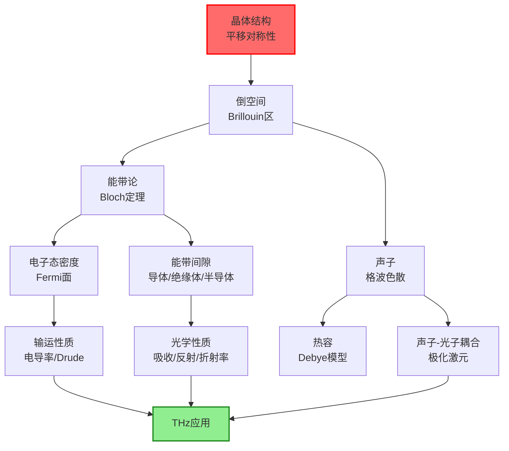
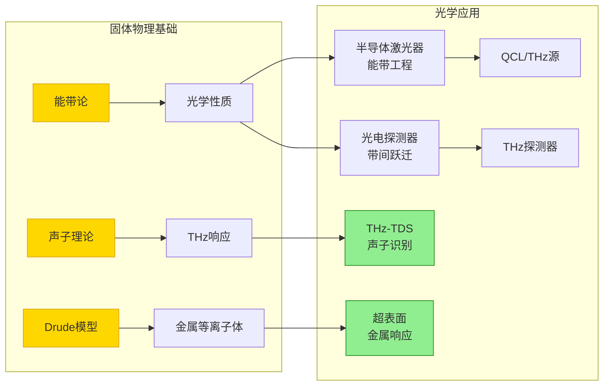

# 固体物理

## 一句话物理图像

> 固体物理的核心问题是：**$10^{23}$ 个原子如何通过周期性排列产生全新的集体行为**——电子不再属于单个原子，而是在整个晶体中"巡游"形成能带；声子不再是个别振动，而是整个晶格的集体激发。正是这些集体行为决定了固体的光学、电学、热学性质，也决定了一切光学器件（激光器、探测器、超表面）的物理极限。

## 零、动机与全景

### 为什么光学研究者必须懂固体物理？

你设计的每一个光学器件——THz超表面、光子晶体、半导体激光器——本质上都在操控固体中电子和声子与光场的耦合。不理解能带结构，就无法解释为什么Si在1.1 μm处突然透明；不理解Drude模型，就无法设计THz频段的金属超表面；不理解声子色散，就无法理解THz时域光谱中的特征吸收峰。

| 研究方向 | 固体物理关联 |
|---------|------------|
| THz时域光谱 | 声子极化激元 → 材料特征吸收峰 |
| 超表面设计 | Drude/Lorentz介电模型 → 结构单元的电磁响应 |
| 半导体激光 | 能带工程 → 带隙设计、量子阱 |
| 非线性频率转换 | 电子非线性极化率 → 晶体对称性约束 |
| 金属等离子体 | 自由电子气集体振荡 → 等离激元频率 |

---

## 一、晶体结构与对称性

### 1.1 物理图像：为什么周期性如此重要？

晶体的根本特征是**平移对称性**——存在三个基矢 $\mathbf{a}_1, \mathbf{a}_2, \mathbf{a}_3$，使得势场满足：

$$V(\mathbf{r} + \mathbf{R}) = V(\mathbf{r}), \quad \mathbf{R} = n_1\mathbf{a}_1 + n_2\mathbf{a}_2 + n_3\mathbf{a}_3$$

这个看似简单的条件，直接导致两个革命性结果：
1. **Bloch定理**：电子波函数具有周期性调制平面波的形式
2. **声子色散**：晶格振动形成具有确定色散关系的格波

> [!concept] 深层图像
> 平移对称性意味着动量 $\mathbf{k}$ 是好量子数（确切说是晶体动量 $\hbar\mathbf{k}$）。整个能带论和声子理论都建立在这个基础上。一旦周期性被破坏（缺陷、无序、表面）， $\mathbf{k}$ 不再是好量子数——这就是为什么缺陷态、表面态有独特的物理。

### 1.2 七大晶系与十四种Bravais格子

| 晶系 | 点阵数 | 对称性特征 | 典型材料（光学相关） |
|------|--------|-----------|-------------------|
| 立方 | 3 | 最高对称（4个 $C_3$ 轴） | Si, GaAs, NaCl |
| 四方 | 2 | 一个 $C_4$ 轴 | TiO₂（金红石）, BaTiO₃ |
| 六方 | 1 | 一个 $C_6$ 轴 | ZnO, GaN, 石墨 |
| 三方 | 1 | 一个 $C_3$ 轴 | LiNbO₃, SiO₂（石英） |
| 正交 | 4 | 三个互相垂直的 $C_2$ 轴 | YVO₄ |
| 单斜 | 2 | 一个 $C_2$ 轴 | 石膏 |
| 三斜 | 1 | 无旋转对称轴 | KDP(KH₂PO₄) |

> **光学意义**：晶系决定非线性光学张量 $d_{ijk}$ 的非零分量。例如立方晶体（如Si）所有二阶非线性系数为零（反演对称）；六方ZnO的 $d_{33}$ 最大。

### 1.3 点群与对称操作

固体物理中的对称操作包括旋转 $\{C_n\}$、镜面 $\{\sigma\}$、反演 $\{i\}$ 和旋转反演 $\{S_n\}$。32个点群完整描述了晶体的宏观对称性。

**反演对称性的光学意义**：
- 有反演中心（如Si, NaCl）→ 所有偶阶非线性为零（$d_{ijk} = 0$, $\chi^{(2)} = 0$）
- 无反演中心（如GaAs, LiNbO₃, ZnO）→ 可以有SHG、电光效应
- 表面/界面天然破坏反演对称 → 表面SHG可探测界面结构

---

## 二、倒空间与Brillouin区

### 2.1 倒格子定义

给定正格子基矢 $\mathbf{a}_1, \mathbf{a}_2, \mathbf{a}_3$，倒格子基矢定义为：

$$\mathbf{b}_1 = 2\pi \frac{\mathbf{a}_2 \times \mathbf{a}_3}{\mathbf{a}_1 \cdot (\mathbf{a}_2 \times \mathbf{a}_3)}, \quad \mathbf{b}_2 = 2\pi \frac{\mathbf{a}_3 \times \mathbf{a}_1}{V_{\text{cell}}}, \quad \mathbf{b}_3 = 2\pi \frac{\mathbf{a}_1 \times \mathbf{a}_2}{V_{\text{cell}}}$$

满足正交关系：

$$\mathbf{a}_i \cdot \mathbf{b}_j = 2\pi \delta_{ij}$$

> [!concept] 为什么需要倒空间？
> 倒空间的物理意义：正空间中的**周期性** $\to$ 倒空间中的**离散点**。正空间晶格常数为 $a$，倒空间最短矢量为 $2\pi/a$。X射线衍射中的Laue条件 $\mathbf{k}' - \mathbf{k} = \mathbf{G}$ 直接在倒空间表述。电子的Bloch态用倒空间中的 $\mathbf{k}$ 标记。

### 2.2 Brillouin区

第一Brillouin区是倒空间中的Wigner-Seitz原胞——从原点到最近邻倒格矢的垂直平分面围成的区域。它是倒空间的"基本单元"，所有物理上不等价的 $\mathbf{k}$ 值都在其中。

**三种常见结构的Brillouin区关键点**：

| 结构 | 高对称点 | 物理意义 |
|------|---------|---------|
| 面心立方(FCC) | $\Gamma(0,0,0)$, $L(\pi/a,\pi/a,\pi/a)$, $X(2\pi/a,0,0)$, $K$ | Si, GaAs的能带极值在 $\Gamma$ 或 $L$ |
| 体心立方(BCC) | $\Gamma$, $H$, $N$, $P$ | 碱金属（Na, K） |
| 六方 | $\Gamma$, $M$, $K$, $A$ | GaN, ZnO, 石墨烯 |

### 2.3 数值示例：Si的倒格子

Si是金刚石结构（FCC + 两原子基元），晶格常数 $a = 5.43$ Å。

正格子基矢：$\mathbf{a}_1 = \frac{a}{2}(0,1,1)$, $\mathbf{a}_2 = \frac{a}{2}(1,0,1)$, $\mathbf{a}_3 = \frac{a}{2}(1,1,0)$

倒格子基矢（计算得BCC类型）：
$$\mathbf{b}_1 = \frac{2\pi}{a}(-1,1,1), \quad |\mathbf{b}_1| = \frac{2\pi\sqrt{3}}{a} \approx 2.00 \text{ Å}^{-1}$$

第一Brillouin区体积：$V_{\text{BZ}} = (2\pi)^3/V_{\text{cell}} = (2\pi)^3 \cdot 4/a^3 \approx 30.5 \text{ Å}^{-3}$

---

## 三、Bloch定理与能带论

### 3.1 Bloch定理推导

**前提**：周期势 $V(\mathbf{r}+\mathbf{R})=V(\mathbf{r})$，单电子Schrodinger方程：

$$\left[-\frac{\hbar^2}{2m}\nabla^2 + V(\mathbf{r})\right]\psi(\mathbf{r}) = E\psi(\mathbf{r})$$

**第一步**：定义平移算符 $\hat{T}_{\mathbf{R}}$，作用于任意函数 $f(\mathbf{r})$：

$$\hat{T}_{\mathbf{R}} f(\mathbf{r}) = f(\mathbf{r}+\mathbf{R})$$

**第二步**：Hamilton量与平移算符对易。因为 $V$ 有周期性，动能 $\nabla^2$ 也有平移不变性，所以 $[\hat{H}, \hat{T}_{\mathbf{R}}] = 0$。可以选取共同本征态。

**第三步**：$\hat{T}_{\mathbf{R}}$ 的本征值。由群论，$\hat{T}_{\mathbf{R}}$ 必须满足乘法规则 $\hat{T}_{\mathbf{R}_1}\hat{T}_{\mathbf{R}_2} = \hat{T}_{\mathbf{R}_1+\mathbf{R}_2}$，因此本征值必有形式 $e^{i\mathbf{k}\cdot\mathbf{R}}$，其中 $\mathbf{k}$ 是倒空间矢量。

**第四步（结论）**：Bloch定理——本征态可以写成：

$$\boxed{\psi_{n\mathbf{k}}(\mathbf{r}) = e^{i\mathbf{k}\cdot\mathbf{r}} u_{n\mathbf{k}}(\mathbf{r}), \quad u_{n\mathbf{k}}(\mathbf{r}+\mathbf{R}) = u_{n\mathbf{k}}(\mathbf{r})}$$

其中 $n$ 是能带指标，$\mathbf{k}$ 是波矢（限制在第一BZ内），$u_{n\mathbf{k}}$ 是周期性调制函数。

> [!concept] Bloch定理的物理图像
> 电子在周期势中的行为像一个"被调制"的自由粒子。因子 $e^{i\mathbf{k}\cdot\mathbf{r}}$ 给出平面波传播，而 $u_{n\mathbf{k}}(\mathbf{r})$ 在每个原胞内调制幅度——在原子核附近振荡剧烈（束缚态特征），在原子间隙处较平滑（自由电子特征）。**能带就是这两种特征竞争的结果**。

### 3.2 近自由电子近似（NFE）

假设周期势很弱，用微扰论处理。零阶（自由电子）：

$$E^{(0)}_{\mathbf{k}} = \frac{\hbar^2 k^2}{2m}$$

一级微扰不改变能量（对角矩阵元 $V_0$ 仅移动零点）。**关键效应出现在二级微扰**：当两个态 $\mathbf{k}$ 和 $\mathbf{k}+\mathbf{G}$ 近简并时（即 $\mathbf{k}$ 接近BZ边界），简并微扰给出：

$$E_{\pm} = \frac{1}{2}\left[E^{(0)}_{\mathbf{k}} + E^{(0)}_{\mathbf{k}+\mathbf{G}}\right] \pm \frac{1}{2}\sqrt{\left[E^{(0)}_{\mathbf{k}} - E^{(0)}_{\mathbf{k}+\mathbf{G}}\right]^2 + 4|V_{\mathbf{G}}|^2}$$

在BZ边界 $\mathbf{k} = \mathbf{G}/2$ 处：

$$E_{\pm} = \frac{\hbar^2 G^2}{8m} \pm |V_{\mathbf{G}}|$$

**物理意义**：Bragg反射使能带打开**带隙** $E_g = 2|V_{\mathbf{G}}|$。带隙处电子无法传播——这正是晶体变为绝缘体/半导体的根本原因。

### 3.3 紧束缚近似（Tight Binding）

从另一个极端出发——假设电子主要局域在原子轨道上，通过原子间的跃迁（hopping）形成能带。

$$E(\mathbf{k}) = \varepsilon_0 - t\sum_{\delta} e^{i\mathbf{k}\cdot\boldsymbol{\delta}}$$

其中 $\varepsilon_0$ 是原子轨道能量，$t$ 是最近邻跃迁积分，$\boldsymbol{\delta}$ 遍历最近邻矢量。

**简单立方晶格**（6个最近邻 $\boldsymbol{\delta} = \pm a\hat{x}, \pm a\hat{y}, \pm a\hat{z}$）：

$$E(\mathbf{k}) = \varepsilon_0 - 2t[\cos(k_x a) + \cos(k_y a) + \cos(k_z a)]$$

带宽 $W = 12t$（从 $\varepsilon_0 - 6t$ 到 $\varepsilon_0 + 6t$）。

> [!concept] 两种近似的互补性
> NFE适合金属（电子离域），TB适合绝缘体/窄带材料（电子局域）。真实的DFT计算综合了两者的思想——平面波基组（NFE思路）加赝势（TB思路）。

### 3.4 能带的分类与Fermi面

根据能带填充情况，固体分为三类：

| 类型 | Fermi能级位置 | $E_g$ | 典型材料 |
|------|-------------|-------|---------|
| 金属 | 穿过能带 | 0 | Au, Cu, Al |
| 半导体 | 带隙中 | 0.1-4 eV | Si(1.12eV), GaAs(1.42eV) |
| 绝缘体 | 带隙中 | >4 eV | SiO₂(9eV), 金刚石(5.5eV) |

**Fermi面**：$T=0$ 时电子占据态的边界在 $\mathbf{k}$ 空间中形成的曲面。金属有Fermi面，绝缘体/半导体没有（T=0时）。

**有效质量**：在能带极值附近展开 $E(\mathbf{k})$：

$$E(\mathbf{k}) = E_c + \frac{\hbar^2(k_x-k_{0x})^2}{2m_x^*} + \cdots$$

有效质量张量：$\frac{1}{m_{ij}^*} = \frac{1}{\hbar^2}\frac{\partial^2 E}{\partial k_i \partial k_j}\bigg|_{\mathbf{k}_0}$

| 材料 | $m_e^*/m_e$ | $m_h^*/m_e$ | 类型 |
|------|-----------|-----------|------|
| GaAs | 0.067 | 0.45 | 直接带隙 |
| Si | 0.98(纵向), 0.19(横向) | 0.49(重空穴) | 间接带隙 |
| InSb | 0.014 | 0.40 | 窄带隙 |
| GaN | 0.20 | 0.80 | 宽带隙 |

> **光学意义**：有效质量直接决定光跃迁的联合态密度、载流子迁移率和Fermi波长——超表面中金属单元的尺寸通常在Fermi波长量级。

---

## 四、声子与晶格振动

### 4.1 物理图像：从N个弹簧到色散关系

将晶体视为 $N$ 个质量为 $M$ 的原子通过弹簧（力常数 $\beta$）连接的一维链。经典运动方程：

$$M\ddot{u}_n = \beta(u_{n+1} - u_n) - \beta(u_n - u_{n-1}) = \beta(u_{n+1} + u_{n-1} - 2u_n)$$

其中 $u_n$ 是第 $n$ 个原子的位移。用Bloch定理的类比——平面波解 $u_n = u_0 e^{i(kna - \omega t)}$ 代入：

$$-M\omega^2 = \beta(e^{ika} + e^{-ika} - 2) = 2\beta(\cos ka - 1)$$

$$\boxed{\omega(k) = 2\sqrt{\frac{\beta}{M}}\left|\sin\frac{ka}{2}\right|}$$

**色散关系的特征**：
- $k \to 0$（长波极限）：$\omega \approx v_s |k|$，线性色散（声速 $v_s = a\sqrt{\beta/M}$）
- $k = \pi/a$（BZ边界）：$\omega_{\max} = 2\sqrt{\beta/M}$，群速度 $v_g = d\omega/dk = 0$
- 频率范围有限 → 不存在 $\omega > \omega_{\max}$ 的声子模式

### 4.2 双原子链与光学声子

一维双原子链（质量 $M_1 > M_2$，力常数 $\beta$）：

$$\omega^2_{\pm}(k) = \beta\left(\frac{1}{M_1}+\frac{1}{M_2}\right) \pm \beta\sqrt{\left(\frac{1}{M_1}+\frac{1}{M_2}\right)^2 - \frac{4\sin^2(ka/2)}{M_1 M_2}}$$

两条色散支：
- **声学支**（$\omega_-$）：$k \to 0$ 时 $\omega \to 0$，两原子同相振动
- **光学支**（$\omega_+$）：$k \to 0$ 时 $\omega \to \omega_0 = \sqrt{2\beta(1/M_1+1/M_2)}$，两原子反相振动

> [!concept] 为什么叫"光学"声子？
> 离子晶体中，正负离子反相振动产生振荡电偶极矩，可以直接与红外/THz光场耦合。这就是THz时域光谱中最常看到的**声子极化激元**吸收峰的来源。如NaCl在 $\sim 8 \mu\text{m}$ 处的强Reststrahlen吸收带。

### 4.3 三维声子色散

三维晶体中每个原子3个自由度，$N$ 个原子的原胞产生 $3N$ 条声子支：3条声学支（1纵LA + 2横TA）+ $3(N-1)$ 条光学支。

| 晶体 | 原胞原子数 | 声子支数 | 光学声子特征 |
|------|----------|---------|------------|
| Si（金刚石） | 2 | 6 | 1LO+1TO（红外无活性，Raman活性） |
| GaAs（闪锌矿） | 2 | 6 | 1LO+1TO（红外+Raman活性） |
| NaCl | 2 | 6 | 强红外活性（Reststrahlen带） |
| TiO₂（金红石） | 6 | 18 | 多个红外活性模 |

### 4.4 声子与THz光谱的定量关联

THz-TDS测量的是介电函数 $\varepsilon(\omega)$ 中的声子贡献。用Lorentz振子模型描述：

$$\varepsilon(\omega) = \varepsilon_\infty + \sum_j \frac{S_j \omega_{TO,j}^2}{\omega_{TO,j}^2 - \omega^2 - i\gamma_j\omega}$$

其中 $\omega_{TO,j}$ 是第 $j$ 个横光学声子频率，$S_j$ 是振子强度，$\gamma_j$ 是阻尼。

**Lyddane-Sachs-Teller关系**：

$$\frac{\varepsilon_0}{\varepsilon_\infty} = \prod_j \frac{\omega_{LO,j}}{\omega_{TO,j}}$$

> **THz应用**：通过THz-TDS测量 $\varepsilon(\omega)$，拟合Lorentz参数，可以无损提取材料的声子特征频率和振子强度。这是THz光谱最独特的优势之一。

---

## 五、电子输运：Drude模型与半经典理论

### 5.1 Drude模型推导

假设电子是经典自由粒子，受外电场驱动，以弛豫时间 $\tau$ 为平均碰撞间隔。

运动方程：$m\frac{d\mathbf{v}}{dt} = -e\mathbf{E} - \frac{m\mathbf{v}}{\tau}$

稳态（$d\mathbf{v}/dt = 0$）：$\mathbf{v}_d = -\frac{e\tau}{m}\mathbf{E}$

电流密度：$\mathbf{J} = -ne\mathbf{v}_d = \frac{ne^2\tau}{m}\mathbf{E} = \sigma\mathbf{E}$

$$\boxed{\sigma_{\text{DC}} = \frac{ne^2\tau}{m}}$$

> [!concept] Drude模型的局限与适用范围
> Drude模型忽略了能带结构、Fermi面、量子统计。在以下情况下有效：(1) 自由电子气近似成立（碱金属、简单金属），(2) 高频极限下与实验定性符合。在以下情况失败：(1) 过渡金属（d电子局域），(2) 强关联体系（高温超导），(3) 布洛赫电子在磁场中的量子振荡。

### 5.2 交流电导率与Drude介电函数

对交变电场 $E(t) = E_0 e^{-i\omega t}$，运动方程的稳态解给出交流电导率：

$$\sigma(\omega) = \frac{ne^2\tau/m}{1-i\omega\tau} = \frac{\sigma_{\text{DC}}}{1-i\omega\tau}$$

通过 $\varepsilon(\omega) = 1 + \frac{i\sigma(\omega)}{\omega\varepsilon_0}$ 得到**Drude介电函数**：

$$\boxed{\varepsilon(\omega) = 1 - \frac{\omega_p^2}{\omega^2 + i\gamma\omega} = 1 - \frac{\omega_p^2}{\omega(\omega+i\gamma)}}$$

其中等离子体频率 $\omega_p = \sqrt{ne^2/m\varepsilon_0}$，$\gamma = 1/\tau$。

**频率区间分析**：

| 频率范围 | $\varepsilon$ | 物理行为 |
|---------|-------------|---------|
| $\omega \ll \gamma$ | 虚部主导，$|\varepsilon| \gg 1$ | 趋肤效应，金属高反射 |
| $\gamma \ll \omega < \omega_p$ | 实部为负，$\text{Re}(\varepsilon) < 0$ | **金属高反射**（超表面的物理基础） |
| $\omega = \omega_p$ | $\text{Re}(\varepsilon) = 0$ | 等离激元共振 |
| $\omega > \omega_p$ | 实部为正 | 金属变透明（紫外透明） |

### 5.3 数值示例：金的Drude参数

Au的参数：$n \approx 5.9 \times 10^{28}\text{ m}^{-3}$, $m^* \approx m_e$, $\tau \approx 30$ fs。

$$\omega_p = \sqrt{\frac{ne^2}{m\varepsilon_0}} \approx 1.37 \times 10^{16}\text{ rad/s} \quad (\hbar\omega_p \approx 9.0\text{ eV})$$
$$\gamma = 1/\tau \approx 3.3 \times 10^{13}\text{ s}^{-1} \quad (\hbar\gamma \approx 0.022\text{ eV})$$

在THz频段（$\omega \sim 2\pi \times 1\text{ THz} \approx 6.3 \times 10^{12}$ rad/s）：

$$\varepsilon(\omega_{\text{THz}}) \approx 1 - \frac{\omega_p^2}{\omega^2} \approx -\left(\frac{\omega_p}{\omega}\right)^2 \approx -4.7 \times 10^6$$

> **超表面设计的含义**：THz频段金属的 $|\varepsilon|$ 巨大（$10^5$-$10^6$量级），趋肤深度 $\delta = c/\omega_p \approx 22$ nm 极浅。这意味着THz超表面的金属单元可以很薄（~100 nm），金属可近似为完美电导体(PEC)。

---

## 六、固体的光学性质

### 6.1 介电函数的微观理论

将Drude模型扩展，加入带间跃迁（Lorentz振子）：

$$\varepsilon(\omega) = \varepsilon_\infty - \underbrace{\frac{\omega_p^2}{\omega^2 + i\gamma_D\omega}}_{\text{Drude（自由电子）}} + \underbrace{\sum_j \frac{f_j\omega_{p,j}^2}{\omega_{0,j}^2 - \omega^2 - i\gamma_j\omega}}_{\text{Lorentz（束缚电子/声子）}}$$

各项的物理来源：
- **Drude项**：自由电子的集体响应（金属）
- **Lorentz项**：束缚电子的带间跃迁或离子晶体的声子共振
- **$\varepsilon_\infty$**：高频（紫外）带间跃迁的背景贡献

### 6.2 Kramers-Kronig关系

介电函数实部和虚部不是独立的，由因果性联系：

$$\text{Re}[\varepsilon(\omega)] - 1 = \frac{2}{\pi}\mathcal{P}\int_0^\infty \frac{\omega' \text{Im}[\varepsilon(\omega')]}{\omega'^2 - \omega^2}d\omega'$$
$$\text{Im}[\varepsilon(\omega)] = -\frac{2\omega}{\pi}\mathcal{P}\int_0^\infty \frac{\text{Re}[\varepsilon(\omega')] - 1}{\omega'^2 - \omega^2}d\omega'$$

> **实用意义**：在THz-TDS中同时测量振幅和相位，直接获得 $\text{Re}[\varepsilon]$ 和 $\text{Im}[\varepsilon]$，无需KK变换——这是THz-TDS相对于FTIR的巨大优势。

### 6.3 带间跃迁与吸收边

对于直接带隙半导体，频率 $\omega > E_g/\hbar$ 时光子可以激发价带到导带的跃迁。吸收系数：

$$\alpha(\omega) \propto \frac{(\hbar\omega - E_g)^{1/2}}{\hbar\omega} \quad \text{（直接带隙，允许跃迁）}$$

$$\alpha(\omega) \propto \frac{(\hbar\omega - E_g \pm E_p)^{2}}{\hbar\omega} \quad \text{（间接带隙，需声子辅助）}$$

| 材料 | 带隙类型 | $E_g$ (eV) | 截止波长 |
|------|---------|-----------|---------|
| Si | 间接 | 1.12 | 1.11 μm |
| GaAs | 直接 | 1.42 | 0.87 μm |
| InSb | 直接 | 0.17 | 7.3 μm |
| GaN | 直接 | 3.40 | 365 nm |
| ZnO | 直接 | 3.37 | 368 nm |

### 6.4 晶体对称性对光学性质的限制

二阶非线性极化率 $d_{ijk} = \frac{1}{2}\chi^{(2)}_{ijk}$ 受晶体对称性约束。Kleinman对称性（无耗近似下）进一步减少独立分量数。

| 晶系 | 点群 | 独立 $d$ 系数数 | 非零分量示例 |
|------|------|---------------|------------|
| 三斜 | 1 | 18 | 全部独立 |
| 单斜 | 2, m | 8-10 | $d_{123}, d_{213}, \ldots$ |
| 六方 | 6mm | 3 | $d_{31}=d_{32}, d_{33}, d_{15}=d_{24}$ |
| 六方 | 6 | 4 | $d_{14}=-d_{25}$ |
| 立方 | $\bar{4}3m$ | 1 | $d_{14}=d_{25}=d_{36}$（GaAs） |
| 立方 | m3m | 0 | 全部为零（反演对称，如Si） |

> **超表面设计的意义**：天然材料中 $d_{ijk}$ 受对称性限制。超表面通过亚波长结构可以**人为打破对称性**，实现天然晶体中不可能的非线性过程——这是非线性超表面的核心动机之一。

---

## 七、半经典输运与有效质量近似

### 7.1 半经典运动方程

将电子视为半经典粒子，在能带 $E_n(\mathbf{k})$ 中运动：

$$\dot{\mathbf{r}} = \frac{1}{\hbar}\nabla_{\mathbf{k}} E_n(\mathbf{k}) = \mathbf{v}_n(\mathbf{k})$$

$$\hbar\dot{\mathbf{k}} = -e\left[\mathbf{E}(\mathbf{r},t) + \mathbf{v}_n(\mathbf{k}) \times \mathbf{B}(\mathbf{r},t)\right]$$

> [!concept] 这组方程的深刻含义
> 第一式说群速度由能带色散决定——即使外力为零，有效质量为负的区域电子会反向运动！第二式说晶体动量的变化率等于Lorentz力——但要注意晶体动量 $\hbar\mathbf{k}$ 不等于真实动量，差一个晶格反作用力。

### 7.2 有效质量近似下的回旋共振

在均匀磁场 $\mathbf{B}$ 中，电子在 $\mathbf{k}$ 空间沿等能面运动（回旋运动），回旋频率：

$$\omega_c = \frac{eB}{m^*}$$

对于各向异性有效质量（如Si的椭球等能面），取回旋有效质量：

$$\frac{1}{m_c} = \sqrt{\frac{m_t^2}{m_l}} \quad \text{（Si导带）}$$

**de Haas-van Alphen效应**：磁化率随 $1/B$ 振荡，周期正比于Fermi面截面的极值面积 $A_{\text{ext}}$：

$$\Delta\left(\frac{1}{B}\right) = \frac{2\pi e}{\hbar A_{\text{ext}}}$$

这是实验测量Fermi面拓扑的最有力工具。

---

## 八、介观量子现象概览

### 8.1 量子限制效应

当材料某一维度尺寸 $L$ 小于相关特征长度时，出现量子限制效应：

$$\Delta E \sim \frac{\hbar^2\pi^2}{2m^*L^2}$$

| 结构 | 限制维度 | 能级特征 | 典型尺寸 |
|------|---------|---------|---------|
| 量子阱 | 1维 | 分立能级 + 连续平面 | $L \sim 5$-$20$ nm |
| 量子线 | 2维 | 分立能级 + 一维色散 | $d \sim 5$-$10$ nm |
| 量子点 | 3维 | 全分立能级（类原子） | $d \sim 2$-$10$ nm |

> **光学关联**：量子阱激光器（QW laser）通过量子限制效应调控跃迁能量和态密度，实现比体材料更高的增益和更低的阈值电流。

### 8.2 能态密度与维度

$$g(E) \propto \begin{cases} \sqrt{E} & 3\text{D} \\ \text{const} & 2\text{D} \\ 1/\sqrt{E} & 1\text{D} \\ \delta(E-E_n) & 0\text{D} \end{cases}$$

低维系统态密度的尖锐特征导致增强的光-物质相互作用——这正是量子阱/量子点激光器和二维材料（石墨烯、TMD）光学性质突出的根本原因。

---

## 九、应用全景：固体物理与光学研究的连接

### THz研究者的核心知识清单

| 固体物理概念 | THz研究中的直接应用 |
|------------|-------------------|
| Drude介电函数 | 金属超表面单元的电磁响应建模 |
| Lorentz振子 | 声子极化激元的THz光谱分析 |
| 能带论 | 半导体THz发射器（GaAs, InGaAs）的泵浦光选择 |
| 有效质量 | PCA中载流子加速 → THz辐射效率 |
| 声子色散 | THz-TDS特征峰的指认和材料识别 |
| 量子限制 | THz QCL的子带间跃迁设计 |
| 晶体对称性 | 非线性THz产生（光整流）的晶体选择 |

---

## 参考文献

1. Kittel, C. *Introduction to Solid State Physics*, 8th ed. Wiley, 2004. — 固体物理标准教材
2. Ashcroft, N.W. & Mermin, N.D. *Solid State Physics*. Saunders, 1976. — 更深理论视角
3. Yu, P.Y. & Cardona, M. *Fundamentals of Semiconductors*, 4th ed. Springer, 2010. — 半导体光学性质
4. Dressel, M. & Grüner, G. *Electrodynamics of Solids*. Cambridge, 2002. — Drude/Lorentz光学性质的完整推导

---

*相关笔记：[[半导体物理]] · [[凝聚态物理]] · [[超表面与超材料]] · [[激光物理]] · [[量子光学]]*
