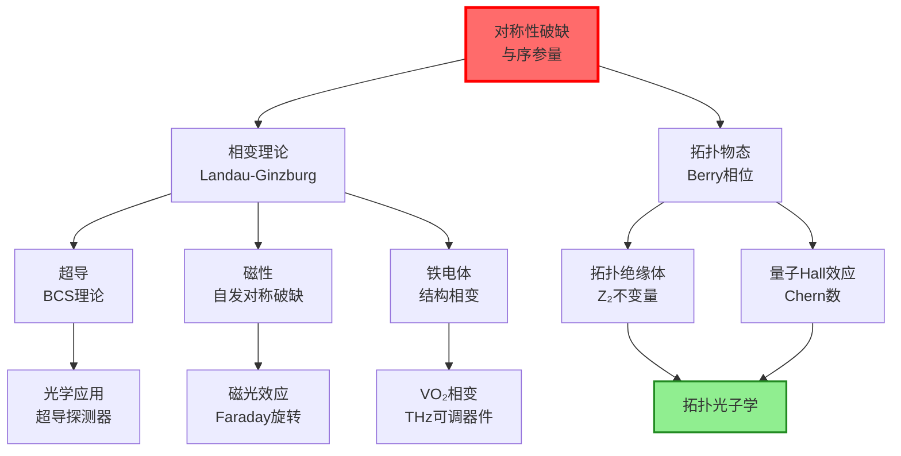
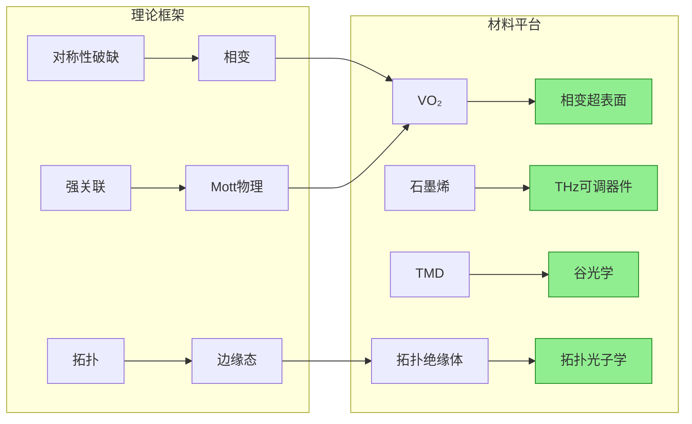

# 凝聚态物理

## 一句话物理图像

> 凝聚态物理研究的是**多体系统的集体行为**——$10^{23}$ 个粒子的相互作用如何涌现出单粒子永远无法产生的全新物态：超导态（零电阻+完全抗磁）、铁磁态（自发磁化）、拓扑绝缘体（导电表面+绝缘体相）。核心方法论是**对称性破缺**与**序参量**，核心数学工具是**Green函数与重整化群**。

## 零、动机与全景

### 凝聚态物理与光学研究的交叉

| 研究方向 | 凝聚态物理关联 |
|---------|------------|
| 拓扑光子晶体 | 拓扑绝缘体的光学类比 |
| 超表面中的谷Hall效应 | 二维材料（石墨烯、TMD）的谷自由度 |
| THz可调超表面 | VO₂相变、石墨烯Fermi能级调控 |
| 强耦合微腔 | 激子-极化激元BEC |
| 量子材料光谱学 | 非线性光学探测序参量和对称性 |

---

## 一、对称性破缺与序参量

### 1.1 物理图像：从无序到有序

高温下系统处于对称性较高的无序态（如顺磁态）。降温时，某种对称性自发破缺，系统进入有序态（如铁磁态）。**序参量** $\eta$ 定量描述有序程度：

- $\eta = 0$：无序相（高温）
- $\eta \neq 0$：有序相（低温）

> [!concept] 对称性破缺的深刻含义
> 高温相的对称群 $G$ 包含低温相的对称群 $H$（$H \subset G$）。对称性破缺意味着系统"选择"了一个特定的方向——这不是基本定律的改变，而是**解**不再具有方程的全部对称性。Landau的天才在于用序参量将这个选择参数化。

### 1.2 Landau自由能与相变分类

Landau将自由能展开为序参量的幂级数：

$$F(\eta, T) = F_0 + a(T)\eta^2 + \frac{b}{4}\eta^4 + \cdots$$

其中 $a(T) = \alpha(T - T_c)$，$b > 0$ 保证稳定性。

**二级相变**（连续相变，$\eta$ 连续变化）：

$\partial F/\partial \eta = 0$ 给出平衡条件：$2a(T)\eta + b\eta^3 = 0$

- $T > T_c$：$a > 0$，唯一极小值在 $\eta = 0$（无序相）
- $T < T_c$：$a < 0$，极小值在 $\eta = \pm\sqrt{|a|/b} = \pm\sqrt{\alpha(T_c-T)/b}$

$$\boxed{\eta(T) \propto (T_c - T)^{\beta}, \quad \beta = \frac{1}{2} \text{（平均场）}}$$

> **注意**：$\beta = 1/2$ 是Landau平均场结果。实际三维Ising模型 $\beta \approx 0.326$，三维XY模型 $\beta \approx 0.349$。Landau理论正确抓住了定性物理，但忽略了涨落。

### 1.3 各类序参量与相变

| 物态 | 序参量 $\eta$ | 破缺的对称性 | $T_c$（典型值） |
|------|-------------|------------|---------------|
| 铁磁体 | 磁化强度 $\mathbf{M}$ | 时间反演+旋转对称 | Fe: 1043 K |
| 铁电体 | 极化强度 $\mathbf{P}$ | 空间反演对称 | BaTiO₃: 393 K |
| 超导体 | Cooper对波函数 $\psi$ | U(1)规范对称 | Nb: 9.3 K |
| 超流体 | 宏观波函数 $\psi$ | U(1)规范对称 | ⁴He: 2.17 K |
| 液晶（向列相） | 指向矢 $\mathbf{n}$ | 旋转对称 | 5CB: 35°C |
| 电荷密度波 | CDW振幅 | 平移对称 | NbSe₂: 33 K |

---

## 二、相变理论深入

### 2.1 临界指数与标度律

在临界点 $T_c$ 附近，各物理量以幂律发散或趋于零：

$$\eta \sim |t|^\beta, \quad \chi \sim |t|^{-\gamma}, \quad C \sim |t|^{-\alpha}, \quad \xi \sim |t|^{-\nu}$$

其中 $t = (T-T_c)/T_c$ 是约化温度。

**平均场理论预测**：$\beta = 1/2$, $\gamma = 1$, $\alpha = 0$（跳跃）, $\nu = 1/2$

**实验/精确结果（3D Ising）**：$\beta = 0.326$, $\gamma = 1.237$, $\alpha = 0.110$, $\nu = 0.630$

**标度律**（不同临界指数之间的关系）：
- Rushbrooke: $\alpha + 2\beta + \gamma = 2$
- Widom: $\gamma = \beta(\delta - 1)$
- Josephson: $d\nu = 2-\alpha$（$d$是空间维度）

> [!concept] 为什么平均场失败？
> 平均场忽略了序参量的空间涨落。在临界点附近，关联长度 $\xi \to \infty$，系统上所有尺度的涨落都重要。重整化群（Wilson, 1971）正确处理了这些涨落——对临界指数的精确计算是20世纪理论物理的伟大成就之一。

### 2.2 关联函数与关联长度

序参量的空间关联函数：

$$G(\mathbf{r}) = \langle \eta(\mathbf{r})\eta(0) \rangle \sim \frac{e^{-r/\xi}}{r^{(d-1)/2}}$$

关联长度 $\xi$ 是系统中"有序区域"的特征尺度。$T > T_c$ 时 $\xi$ 有限但随 $T \to T_c$ 发散。

在 Ornstein-Zernike 近似下：

$$\xi(T) = \xi_0 |t|^{-\nu}$$

$\xi_0$ 是微观尺度（晶格常数量级）。

### 2.3 VO₂相变：THz可调器件的物理基础

VO₂在 $T_c \approx 340$ K（67°C）发生绝缘体-金属相变（IMT），电阻率变化4-5个量级。这是THz可调超表面最常用的相变材料。

**相变特征**：
- 低温相：单斜结构（$P2_1/c$），Mott绝缘体，$E_g \approx 0.7$ eV
- 高温相：金红石结构（$P4_2/mnm$），金属态
- 伴随结构相变（对称性变化）+ 电子相变（Mott转变）

**驱动方式**：

| 驱动 | 机制 | 时间尺度 |
|------|------|---------|
| 温度 | 热激发 | 秒级 |
| 电场 | 载流子注入 | ns级 |
| 光泵浦 | 光致相变 | sub-ps级 |
| 应变 | 晶格失配 | 静态调控 |

> **THz应用**：VO₂薄膜图案化为超表面单元，通过温度/电场/光泵浦控制相变状态，实现THz振幅/相位的动态调控。相变前后 $\Delta\varepsilon \sim 10^2$，可实现超过2π的相位调制。

---

## 三、超导电性

### 3.1 BCS理论的物理图像

超导的两个基本现象：
1. **零电阻**：直流电阻精确为零（持久电流已观测数年无衰减）
2. **Meissner效应**：完全抗磁性，磁通量被排斥（$B = 0$ 在超导体内部）

**Cooper对**：BCS理论的核心是电子通过声子媒介形成束缚对。两个动量相反的电子 $(\mathbf{k}\uparrow, -\mathbf{k}\downarrow)$ 通过交换虚声子产生有效吸引：

$$V_{\text{eff}} \approx -\frac{|g_{\mathbf{q}}|^2}{\hbar\omega_{\mathbf{q}}} < 0$$

Cooper对的束缚能就是**超导能隙**：

$$\Delta(0) = 1.76\, k_B T_c \quad \text{（BCS弱耦合极限）}$$

### 3.2 Ginzburg-Landau理论

序参量 $\psi(\mathbf{r}) = |\psi|e^{i\phi}$ 描述超导电子对的宏观量子态。GL自由能：

$$F = \int d^3r \left[ \alpha|\psi|^2 + \frac{\beta}{2}|\psi|^4 + \frac{1}{2m^*}\left|(-i\hbar\nabla - e^*\mathbf{A})\psi\right|^2 + \frac{|\mathbf{B}|^2}{2\mu_0} \right]$$

其中 $e^* = 2e$ 是Cooper对电荷，$m^* = 2m_e$。

**两个特征长度**：
- **相干长度** $\xi = \hbar/\sqrt{2m^*|\alpha|}$ — 序参量空间变化的特征尺度
- **穿透深度** $\lambda = \sqrt{m^*/\mu_0 e^{*2}|\psi|^2}$ — 磁场穿透深度

**GL参数**：$\kappa = \lambda/\xi$
- $\kappa < 1/\sqrt{2}$：I类超导体（完全Meissner效应）
- $\kappa > 1/\sqrt{2}$：II类超导体（混合态，存在磁通量子vortex）

### 3.3 磁通量子化

超导环中的磁通量是量子化的：

$$\Phi = n\Phi_0, \quad \Phi_0 = \frac{h}{2e} = 2.07 \times 10^{-15}\text{ Wb}$$

这个量子化来自序参量 $\psi = |\psi|e^{i\phi}$ 的单值性要求：绕环一圈相位变化必须是 $2\pi$ 的整数倍。

> **光学关联**：超导单光子探测器（SNSPD）利用超导纳米线中单个光子破坏局部超导态产生的hot spot来探测。在THz/红外天文探测中极其重要。

---

## 四、磁性

### 4.1 磁性分类

| 类型 | 磁化率 $\chi$ | 物理机制 | 典型材料 |
|------|-------------|---------|---------|
| 抗磁 | $\chi < 0$，小（$\sim -10^{-5}$） | Lorentz力诱导电流 | Cu, Au, Bi |
| 顺磁 | $\chi > 0$，小（$\sim 10^{-3}$） | 未配对电子的Curie定律 | Al, Pt |
| 铁磁 | $\chi \gg 0$，有磁滞 | 交换作用平行排列 | Fe, Co, Ni |
| 反铁磁 | $\chi > 0$，小 | 交换作用反平行 | Cr, MnO, NiO |
| 亚铁磁 | $\chi \gg 0$ | 不等反平行 | Fe₃O₄（磁铁矿） |

### 4.2 铁磁性的Heisenberg模型

自旋Hamilton量：

$$\hat{H} = -J\sum_{\langle i,j\rangle}\hat{\mathbf{S}}_i \cdot \hat{\mathbf{S}}_j - g\mu_B\mathbf{B}\cdot\sum_i\hat{\mathbf{S}}_i$$

$J > 0$：铁磁耦合（基态自旋平行）；$J < 0$：反铁磁耦合。

**自发磁化的平均场近似**：

$$M(T) = M_0 \cdot B_S\left(\frac{3S}{S+1}\frac{T_c}{T}\frac{M}{M_0}\right)$$

其中 $B_S(x)$ 是Brillouin函数。$T \to 0$ 时 $M \to M_0$，$T \to T_c$ 时 $M \to 0$。

### 4.3 自旋波与磁振子

铁磁体中的低能激发是自旋波（magnon）。一维Heisenberg链的色散关系：

$$\hbar\omega(\mathbf{k}) = 2JS\left[1 - \cos(ka)\right] \approx 2JSk^2a^2 \quad (k \to 0)$$

注意声子色散是线性的（$\omega \propto k$），而磁振子色散是**二次的**（$\omega \propto k^2$）。

**磁振子对热容的贡献**（$T \ll T_c$）：

$$C_{\text{magnon}} \propto T^{3/2}$$

与Debye声子的 $T^3$ 律不同——实验上可以区分。

### 4.4 磁光效应

磁有序导致的光学各向异性——Faraday旋转和Kerr效应是光学探测磁性的重要工具。

**Faraday旋转**：线偏光通过磁化介质时偏振面旋转角度：

$$\theta_F = V \int_0^L B\,dz$$

$V$ 是Verdet常数。在铁磁体中 $\theta_F$ 可以很大（每微米几度）。

> **THz应用**：THz磁光光谱可以探测自旋动力学（自旋进动频率在GHz-THz范围），研究反铁磁自旋电子学。

---

## 五、拓扑物态

### 5.1 Berry相位：拓扑物理的数学基础

量子力学中，当系统的Hamilton量随参数 $\mathbf{R}$ 缓慢变化绕回路 $C$ 一周后，波函数除了动力学相位外还获得一个**几何相位**：

$$\gamma_n = i\oint_C \langle n(\mathbf{R})|\nabla_{\mathbf{R}}|n(\mathbf{R})\rangle \cdot d\mathbf{R}$$

Berry联络 $\mathbf{A}_n(\mathbf{R}) = i\langle n|\nabla_{\mathbf{R}}|n\rangle$ 是规范势的类比。对应的"磁场"（Berry曲率）：

$$\Omega_{n,\mu\nu}(\mathbf{R}) = \partial_\mu A_{n,\nu} - \partial_\nu A_{n,\mu}$$

**关键定理**：Berry相位 = Berry曲率在曲面上的积分，可以写成 $\mathbf{k}$ 空间中的Chern数：

$$C_n = \frac{1}{2\pi}\int_{\text{BZ}} \Omega_n(\mathbf{k})\, d^2k$$

Chern数是**拓扑不变量**——在能带的连续变形下不变，只有当能隙关闭时才能改变。

> [!concept] 拓扑与物理的连接
> Chern数 $C \neq 0$ 意味着能带具有非平庸拓扑。在有限系统中，这必然导致**边缘态**——体内绝缘但边缘导电。边缘态数 = Chern数。这是拓扑绝缘体和量子Hall效应的理论基础。

### 5.2 量子Hall效应

二维电子气在强磁场下的Hall电导率被量子化：

$$\sigma_{xy} = \nu \frac{e^2}{h}, \quad \nu = 1, 2, 3, \ldots$$

TKNN定理证明 $\nu$ 就是填满的Landau能带的Chern数之和。精确量子化来自拓扑保护——杂质、样品形状等都不影响 $\sigma_{xy}$ 的量子化值。

### 5.3 拓扑绝缘体

**二维拓扑绝缘体**（量子自旋Hall效应）：
- 体态有带隙（绝缘体）
- 边缘有反向自旋传播的边缘态（螺旋边缘态）
- 时间反演对称性保护
- $Z_2$ 拓扑不变量 $\nu = 1$（非平庸）

**三维拓扑绝缘体**（Bi₂Se₃, Bi₂Te₃）：
- 体态有带隙
- **表面有Dirac锥**（线性色散的表面态）
- 自旋-动量锁定（自旋垂直于动量）

> **光学关联**：拓扑绝缘体的表面Dirac态可以用非线性光学（SHG、THG）探测。表面态的自旋-动量锁定也启发了拓扑光子学中的类比设计。详见[[拓扑光学]]。

### 5.4 拓扑相变

拓扑相变不涉及对称性破缺（无局域序参量），而是拓扑不变量的突变。这类相变由能隙关闭驱动：

$$E_g \to 0 \text{（在某个 } \mathbf{k} \text{ 点）} \to \text{拓扑不变量改变} \to E_g \text{ 重新打开}$$

这是超越Landau对称性破缺范式的新相变类型。

---

## 六、强关联体系

### 6.1 Hubbard模型

描述电子在晶格上的关联运动：

$$\hat{H} = -t\sum_{\langle i,j\rangle,\sigma}(\hat{c}_{i\sigma}^\dagger\hat{c}_{j\sigma} + \text{h.c.}) + U\sum_i \hat{n}_{i\uparrow}\hat{n}_{i\downarrow}$$

- $t$：跃迁积分（动能，倾向离域）
- $U$：在位Coulomb排斥（势能，倾向局域化）

**三个极限**：

| 极限 | 参数关系 | 基态 | 物理图像 |
|------|---------|------|---------|
| 自由电子 | $U = 0$ | 金属 | 能带论成立 |
| Mott绝缘体 | $U \gg t$，半填充 | 绝缘体 | 每个格点一个电子，Coulomb排斥阻止运动 |
| 中间耦合 | $U \sim t$ | 强关联金属 | 准粒子有效质量 $m^* \gg m$ |

### 6.2 Mott绝缘体与Mott转变

半填充Hubbard模型中，$U/t$ 超过临界值后系统从金属变为绝缘体——即使能带是半填满的（能带论预测应为金属）。这就是**Mott绝缘体**。

典型Mott绝缘体：VO₂（低温相）、NiO、V₂O₃。

**Mott转变的物理**：当 $U$ 很大时，电子局域化在每个格点上以避免Coulomb排斥代价。能带分裂成上下两个Hubbard子带，中间打开Mott能隙 $\Delta_{\text{Mott}} \sim U - W$（$W$是带宽）。

> **THz关联**：VO₂的绝缘体-金属相变本质上是Mott转变。THz光谱可以直接观测相变前后的低能电导率变化（Drude峰的出现/消失）。

### 6.3 重费米子体系

某些含f电子的金属（CeCu₂Si₂, UPt₃）具有极大的电子有效质量：

$$\frac{m^*}{m_e} \sim 100 - 1000$$

物理图像：f电子的局域磁矩与传导电子通过Kondo效应强耦合，形成准粒子。这些准粒子保留了传导电子的运动性但质量极大。

**重费米子的特征温度** $T^* \sim T_K$（Kondo温度），$T < T^*$ 时f电子被"裹挟"参与Fermi液体。

### 6.4 强关联体系的实验探测

| 探测手段 | 测量物理量 | 能量范围 |
|---------|-----------|---------|
| ARPES | $E(\mathbf{k})$ 能带色散 | eV |
| STM/STS | 局域态密度 | meV-eV |
| THz-TDS | 低频电导率 $\sigma(\omega)$ | meV |
| 中子散射 | 自旋关联/磁振子 | meV |
| 拉曼散射 | 电子/磁激发 | meV-eV |
| SHG/THG | 对称性/序参量 | eV |

---

## 七、量子多体理论方法概览

### 7.1 第二量子化

将多体问题从波函数描述转到产生/湮灭算符描述：

$$\hat{H} = \sum_{ij} t_{ij} \hat{c}_i^\dagger \hat{c}_j + \frac{1}{2}\sum_{ijkl} V_{ijkl} \hat{c}_i^\dagger \hat{c}_j^\dagger \hat{c}_l \hat{c}_k$$

对于费米子，算符满足反对易关系 $\{c_i, c_j^\dagger\} = \delta_{ij}$，自动处理Pauli不相容原理。

### 7.2 Green函数

单粒子Green函数定义：

$$G(\mathbf{r}, t; \mathbf{r}', t') = -i\langle T[\hat{\psi}(\mathbf{r},t)\hat{\psi}^\dagger(\mathbf{r}',t')]\rangle$$

$T$ 是时序算符。Green函数的物理意义：
- $G$ 的极点 → 准粒子能量 $E(\mathbf{k})$
- $G$ 的虚部 → 准粒子寿命 $\tau \sim 1/\text{Im}[\Sigma]$
- $G$ 的留数 → 准粒子权重 $Z$（费米液体中 $0 < Z < 1$）

**谱函数**：

$$A(\mathbf{k}, \omega) = -\frac{1}{\pi}\text{Im}\,G^R(\mathbf{k}, \omega)$$

ARPES实验直接测量 $A(\mathbf{k}, \omega)$。

### 7.3 自能Dyson方程

Green函数满足Dyson方程：

$$G = G_0 + G_0 \Sigma G$$

或等价地：

$$G(\mathbf{k}, \omega) = \frac{1}{\omega - \varepsilon_{\mathbf{k}} - \Sigma(\mathbf{k}, \omega)}$$

自能 $\Sigma$ 包含所有多体效应。$\Sigma$ 的实部移动准粒子能量，虚部给出准粒子衰变率。

**近似方法**：

| 方法 | 自能近似 | 适用范围 |
|------|---------|---------|
| Hartree-Fock | $\Sigma = V_{\text{HF}}$（静态） | 弱关联 |
| GW近似 | $\Sigma = iGW$ | 半导体带隙修正 |
| DMFT | $\Sigma(\omega)$（局域动态） | 强关联，$d/f$电子 |
| QMC | 精确（数值） | 小系统，基准计算 |

---

## 八、二维材料

### 8.1 石墨烯

石墨烯的电子结构由紧束缚模型描述（$p_z$ 轨道，蜂窝格子）：

$$E(\mathbf{k}) = \pm t\sqrt{1 + 4\cos\frac{\sqrt{3}k_xa}{2}\cos\frac{k_ya}{2} + 4\cos^2\frac{k_ya}{2}}$$

在Dirac点 $K$ 和 $K'$ 附近展开：

$$E(\mathbf{q}) = \pm \hbar v_F |\mathbf{q}|, \quad v_F \approx 10^6\text{ m/s} \approx c/300$$

> [!concept] 石墨烯的独特光学性质
> 石墨烯的吸收率是普适常数 $\alpha_{\text{abs}} = \pi\alpha \approx 2.3\%$（$\alpha = e^2/4\pi\varepsilon_0\hbar c \approx 1/137$），与频率无关（从可见到红外）。这个惊人的结果来自二维Dirac费米子的性质。通过栅压调控Fermi能级 $E_F$，可以实现电控光开关——THz可调超表面的核心机制之一。

### 8.2 过渡金属二硫化物（TMD）

MoS₂, WS₂, MoSe₂, WSe₂ 等层状材料：
- 单层：直接带隙（$\sim 1.5$-$2.0$ eV），强激子效应（束缚能 $\sim 0.5$ eV）
- 多层：间接带隙
- 谷自由度：$K$ 和 $K'$ 谷可由圆偏光选择性激发（谷光学）

| 材料 | 带隙（单层） | 激子束缚能 | 应用 |
|------|-----------|----------|------|
| MoS₂ | 1.90 eV | $\sim 0.5$ eV | 光电器件 |
| WS₂ | 2.00 eV | $\sim 0.7$ eV | 谷电子学 |
| MoSe₂ | 1.66 eV | $\sim 0.5$ eV | 激子-极化激元 |
| WSe₂ | 1.65 eV | $\sim 0.5$ eV | 单光子发射 |

### 8.3 二维材料的THz响应

石墨烯在THz频段的电导率（Kubo公式，$T = 0$）：

$$\sigma(\omega) = \frac{e^2}{4\hbar}\left[\tanh\frac{\hbar\omega+2E_F}{4k_BT} + \tanh\frac{\hbar\omega-2E_F}{4k_BT}\right] + i\frac{e^2}{\pi\hbar}\ln\frac{2|E_F|-\hbar\omega}{2|E_F|+\hbar\omega}$$

低频极限（$\hbar\omega \ll E_F$）：$\sigma_0 = e^2E_F/\pi\hbar^2$（Drude型）

**THz调控**：通过栅压改变 $E_F$，$\sigma(\omega)$ 可在Drude型（金属）和Pauli阻塞（透明）之间切换。

---

## 九、应用全景

### 光学研究者需要理解的凝聚态前沿

| 凝聚态概念 | 对光学研究的影响 |
|-----------|----------------|
| Landau相变理论 | 理解相变材料（VO₂, GST）的温度/电场响应 |
| BCS超导理论 | 超导单光子探测器的原理 |
| Berry相位/拓扑 | 拓扑光子晶体的设计原理 |
| Hubbard/Mott物理 | 关联材料的光谱分析 |
| 二维材料电子结构 | 石墨烯THz调制器的设计优化 |
| 磁光效应 | 自旋-光子耦合器件 |
| 激子物理 | 低维材料的光学非线性增强 |

---

## 参考文献

1. Chaikin, P.M. & Lubensky, T.C. *Principles of Condensed Matter Physics*. Cambridge, 1995. — 相变与软凝聚态
2. Sachdev, S. *Quantum Phase Transitions*, 2nd ed. Cambridge, 2011. — 量子相变
3. Coleman, P. *Introduction to Many-Body Physics*. Cambridge, 2015. — 多体理论入门
4. Bernevig, B.A. & Hughes, T.L. *Topological Insulators and Topological Superconductors*. Princeton, 2013. — 拓扑物态
5. Giuliani, G. & Vignale, G. *Quantum Theory of the Electron Liquid*. Cambridge, 2005. — Fermi液体理论

---

*相关笔记：[[固体物理]] · [[拓扑光学]] · [[超表面与超材料]] · [[半导体物理]] · [[量子光学]]*
