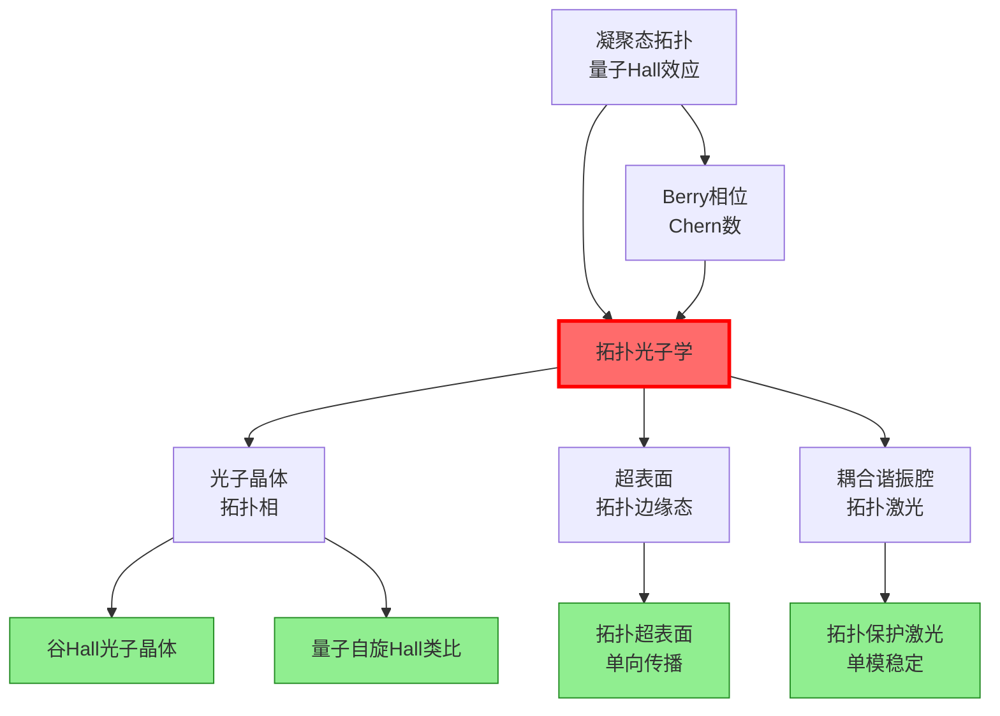
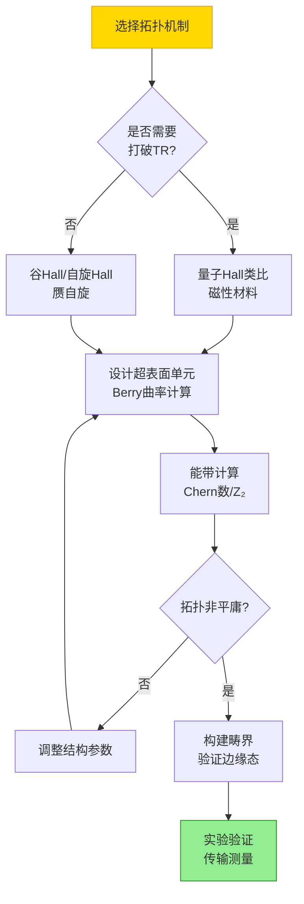
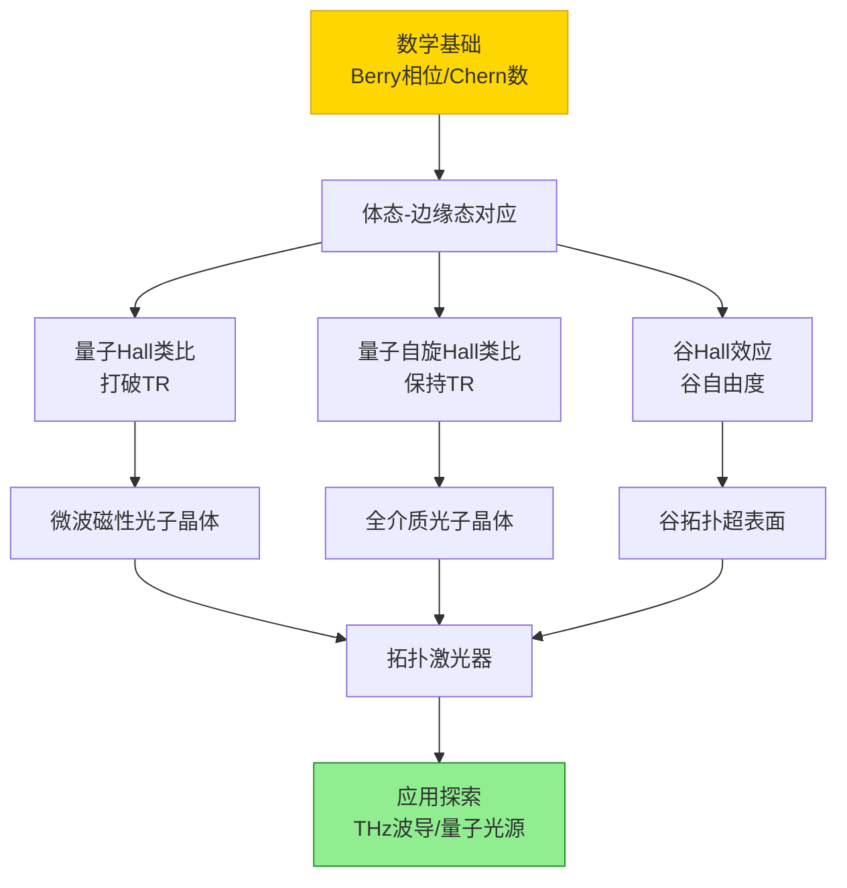

# 拓扑光学

## 一句话物理图像

> 拓扑光学将凝聚态拓扑物态的概念移植到光子系统——光子晶体中的**谷Hall效应**、**量子自旋Hall类比**、**Floquet拓扑相**使光沿着设计好的"拓扑保护"路径传播，**免疫背向散射**。核心数学是**Berry相位与拓扑不变量**（Chern数、$Z_2$不变量），核心物理是**体态-边缘态对应原理**。

## 零、动机与全景

### 为什么拓扑光学是热点？

传统光子器件（波导、谐振腔、超表面）的性能受限于**缺陷和 disorder**——杂质散射、制备误差、弯曲损耗限制了集成光路的复杂度。拓扑光学的承诺是：利用拓扑保护，设计出**对制造误差和缺陷免疫**的光路。

| 对比 | 传统光子器件 | 拓扑光子器件 |
|------|-----------|------------|
| 缺陷响应 | 散射、反射、损耗 | 绕过缺陷，无背向散射 |
| 制造容差 | 严格（纳米精度） | 宽松（拓扑保护） |
| 设计范式 | 局域优化（超表面单元） | 全局拓扑（能带拓扑性质） |
| 波导弯曲 | 辐射损耗 | 无损（拓扑保护传输） |

---

## 一、数学基础：Berry相位与拓扑不变量

### 1.1 Berry相位推导

考虑参数空间 $\mathbf{R}$ 中Hamilton量 $H(\mathbf{R})$ 的第 $n$ 个本征态 $|n(\mathbf{R})\rangle$。当 $\mathbf{R}$ 沿闭合回路 $C$ 缓慢变化时，态矢量获得几何相位：

**第一步**：参数化时间演化。$\mathbf{R}(t)$，$0 \leq t \leq T$，$\mathbf{R}(0) = \mathbf{R}(T)$。

**第二步**：绝热近似下，系统始终处于瞬时本征态 $|n(\mathbf{R}(t))\rangle$，相位随时间演化：

$$|\psi(t)\rangle = e^{i\gamma_n(t)} e^{-\frac{i}{\hbar}\int_0^t E_n(\mathbf{R}(t'))dt'} |n(\mathbf{R}(t))\rangle$$

**第三步**：代入含时Schrodinger方程，分离动力学相位后得到几何相位的演化方程：

$$\dot{\gamma}_n(t) = i\langle n(\mathbf{R})|\nabla_{\mathbf{R}}|n(\mathbf{R})\rangle \cdot \dot{\mathbf{R}}$$

**第四步**：绕回路积分得到Berry相位：

$$\boxed{\gamma_n = i\oint_C \langle n(\mathbf{R})|\nabla_{\mathbf{R}}|n(\mathbf{R})\rangle \cdot d\mathbf{R} = \oint_C \mathbf{A}_n \cdot d\mathbf{R}}$$

其中 **Berry联络** $\mathbf{A}_n = i\langle n|\nabla_{\mathbf{R}}|n\rangle$ 是 $\mathbf{R}$ 空间中的"规范势"。

### 1.2 Berry曲率与Chern数

定义 **Berry曲率**（类比磁场）：

$$\boldsymbol{\Omega}_n = \nabla_{\mathbf{R}} \times \mathbf{A}_n$$

利用Stokes定理，Berry相位 = Berry曲率在回路所围曲面上的积分：

$$\gamma_n = \int_S \boldsymbol{\Omega}_n \cdot d\mathbf{S}$$

**Chern数**：Berry曲率在整个Brillouin区（闭流形）上的积分除以 $2\pi$：

$$\boxed{C_n = \frac{1}{2\pi}\int_{\text{BZ}} \Omega_n(\mathbf{k})\, d^2k \in \mathbb{Z}}$$

Chern数是拓扑不变量——对能带的任何连续变形（保持带隙打开）不变。

### 1.4 数值示例：二能级系统的Berry曲率

考虑最简单的参数空间模型——自旋1/2在磁场 $\mathbf{B} = B(\sin\theta\cos\phi, \sin\theta\sin\phi, \cos\theta)$ 中，Hamilton量 $H = -\mathbf{B}\cdot\boldsymbol{\sigma}$。

基态 $|-\rangle = \begin{pmatrix}\sin(\theta/2)e^{-i\phi}\\-\cos(\theta/2)\end{pmatrix}$，参数空间是球面 $(\theta, \phi)$。

Berry联络：
$$A_\theta = i\langle-|\partial_\theta|-\rangle = 0, \quad A_\phi = i\langle-|\partial_\phi|-\rangle = -\sin^2(\theta/2)$$

Berry曲率：
$$\Omega_{\theta\phi} = \partial_\theta A_\phi - \partial_\phi A_\theta = -\frac{1}{2}\sin\theta$$

Chern数：
$$C = \frac{1}{2\pi}\int_0^\pi d\theta\int_0^{2\pi} d\phi \left(-\frac{1}{2}\sin\theta\right) = -\frac{1}{4\pi}\cdot 2\cdot 2\pi = -1$$

**物理意义**：基态的Chern数 $C = -1$，对应参数空间（球面）上的"磁单极"。这正是量子Hall效应中Landau能级的拓扑性质。每个Landau能级 $C = -1$，填满 $\nu$ 个能级则总Chern数为 $-\nu$，给出 $\sigma_{xy} = \nu e^2/h$。

> [!concept] 规范不变性
> Berry联络 $\mathbf{A}_n$ 在规范变换 $|n\rangle \to e^{i\varphi(\mathbf{R})}|n\rangle$ 下变化：$\mathbf{A}_n \to \mathbf{A}_n - \nabla\varphi$。但Berry曲率 $\boldsymbol{\Omega}$ 和Chern数 $C$ 是规范不变的。这正是电磁学中 $\mathbf{A} \to \mathbf{A} - \nabla\chi$, $\mathbf{B} = \nabla \times \mathbf{A}$ 不变的类比。

### 1.3 光子系统中的Berry曲率

在光子晶体中，$\mathbf{k}$ 就是参数空间。第 $n$ 条光子能带的Berry曲率：

$$\Omega_n(\mathbf{k}) = i\sum_{m \neq n}\frac{\langle n|\nabla_{\mathbf{k}}\hat{H}|m\rangle \times \langle m|\nabla_{\mathbf{k}}\hat{H}|n\rangle}{(E_n - E_m)^2}$$

这是光子系统与电子系统的**直接类比**——将电子Hamilton量替换为Maxwell方程的本征值问题。

---

## 二、体态-边缘态对应原理

### 2.1 核心定理

**Bulk-boundary correspondence**（体态-边缘态对应原理）：

如果二维系统的体能带具有非零Chern数 $C$，则在有限系统的边缘上必然出现 $|C|$ 条手性边缘态（chiral edge state）。

$$\text{边缘态数量} = \sum_{\text{填满能带}} C_n$$

> **物理图像**：想象一个二维光子晶体板，体能带Chern数 $C = 1$。在板的边缘，存在一条只能单向传播的光模式——向左传的光遇到缺陷时不会反射，而是绕过缺陷继续传播。因为根本没有反向传播的模式可以散射进去。

### 2.2 手性边缘态的特性

| 性质 | 传统波导模式 | 拓扑手性边缘态 |
|------|-----------|-------------|
| 传播方向 | 双向 | 单向（单向） |
| 缺陷散射 | 强 | 零（拓扑保护） |
| 背向散射 | 有 | 无（无反向通道） |
| 弯曲损耗 | 有（辐射） | 极低 |
| 制造容差 | 高精度要求 | 宽松 |

### 2.3 数值示例：Haldane模型

Haldane模型（1988）在石墨烯格子中加入破缺时间反演对称性的次近邻跃迁，使体能带Chern数 $C = \pm 1$。

次近邻复数跃迁：$t_2 e^{i\phi}$（$\phi$ 是Haldane相位）

当 $\phi \neq 0, \pi$ 时，两条能带的Chern数分别为 $C = +1$ 和 $C = -1$，打开拓扑非平庸带隙。

边缘态色散：$\omega(k_\parallel)$ 在带隙中穿过Fermi能级，群速度 $v_g = d\omega/dk_\parallel > 0$（单向）。

### 2.4 边缘态的计算方法

**超胞方法（Supercell method）**：

1. 构建超胞：在一个方向（$y$）堆叠拓扑非平庸相（A相）和拓扑平庸相（B相），形成畴界
2. 在垂直方向（$x$）保持周期边界条件，Bloch波矢 $k_x$
3. 计算超胞的投影能带 $E_n(k_x)$
4. 带隙中出现的模式就是畴界上的边缘态

**解析方法（Jackiw-Rebbi模型）**：

对一维Dirac方程（畴壁处质量项变号）：

$$[-i\sigma_x\partial_x + m(x)\sigma_y]\psi = E\psi$$

$m(x) = m_0\text{sgn}(x)$（质量在畴壁变号）。零能束缚态解：

$$\psi_0(x) \propto e^{-|m_0||x|/v}\begin{pmatrix}1\\i\end{pmatrix}$$

这个态是拓扑保护的——只要质量变号就必然存在，与 $m_0$ 的具体值无关。

---

## 三、光子晶体的拓扑相

### 3.1 量子Hall类比（打破时间反演）

**实现方式**：在光子晶体中引入磁场（Faraday效应材料如YIG — Y₃Fe₅O₁₂）打破时间反演对称性。

**设计要素**：
- 柱阵列（介电柱或磁性柱）排列成三角/蜂窝格子
- 外加磁场使YIG柱具有非互易磁导率张量
- 体能带获得非零Chern数

**特征频率**：微波段（GHz），因为YIG在微波段有大的Faraday旋转

> [!concept] 光子 vs 电子的关键区别
> 光子没有Fermi面，不存在"部分填充的能带"。在光学中，通常通过**带隙中的边缘态频率**选择性地激发拓扑模式。激发方式包括：近场耦合、天线馈入、或者非线性频率转换。

### 3.2 量子自旋Hall类比（保持时间反演）

利用**赝自旋**（pseudo-spin）模拟电子的自旋自由度：

**实现方案**：

| 方案 | 赝自旋来源 | 对称性要求 | 频段 |
|------|----------|-----------|------|
| 介电柱六角格子 | TE/TM模式简并 | $C_6$ 旋转对称 | 微波-红外 |
| 双螺旋超表面 | LCP/RCP圆偏振 | 面内旋转对称 | 红外-可见 |
| 耦合环形腔 | 顺时针/逆时针模式 | 镜面对称 | 微波 |

**$Z_2$ 拓扑不变量**：对每条Kramers简并能带对计算 $Z_2$ 指标 $\nu$：
- $\nu = 0$：拓扑平庸（普通绝缘体）
- $\nu = 1$：拓扑非平庸（存在螺旋边缘态）

### 3.3 谷Hall效应

**谷（Valley）** 是六角Brillouin区中不等价的 $K$ 和 $K'$ 点。谷Hall效应利用谷自由度实现拓扑边缘态。

**谷光子晶体设计**：
- 三角格子介电柱，打破空间反演对称性（例如两种不同尺寸的柱交替排列）
- $K$ 和 $K'$ 谷的Berry曲率相反：$\Omega_K = -\Omega_{K'}$
- 每个谷的"谷Chern数" $C_K = -C_{K'} = \pm 1/2$

**谷边缘态**：在两种不同打破方式（A和B）的畴界上，出现谷依赖的边缘态。$K$ 谷的边缘态向一个方向传播，$K'$ 谷的向反方向。

> **优势**：谷Hall拓扑不需要打破时间反演对称性（不需要磁性材料），因此在光频段更容易实现。

### 3.4 Floquet拓扑相

对光子晶体进行**时间周期性调制**（如机械旋转、动态折射率调控），等效Hamilton量具有Floquet准能带结构，即使静态系统是平庸的，也可以实现拓扑相。

$$H_F = \frac{1}{T}\int_0^T H(t)\, dt \quad \text{（Floquet平均Hamilton量）}$$

Floquet拓扑绝缘体的优势：纯光学手段（无需磁性材料）实现时间反演破缺拓扑相。

### 3.5 数值示例：三角格子光子晶体的谷Hall设计

设计参数：三角格子介电柱（$\varepsilon = 11.56$，对应Si在红外），半径 $r = 0.2a$，嵌入空气背景。

**打破反演对称性**：将柱的半径按 $r_A = r_0 + \delta$, $r_B = r_0 - \delta$ 交替变化（蜂窝格子等效）。

当 $\delta > 0$ 时，$K$ 和 $K'$ 谷的Berry曲率：
$$\Omega_K = +\frac{c}{\delta_g^2}\delta, \quad \Omega_{K'} = -\frac{c}{\delta_g^2}\delta$$

其中 $\delta_g$ 是带隙宽度，$c$ 是正比于跃迁矩阵元的常数。

**参数计算**（$a = 500$ nm，工作波长 $\sim 1.55\,\mu\text{m}$）：
- 带隙中心频率：$\omega_g \approx 0.38 \times 2\pi c/a \approx 144$ THz
- 带隙宽度：$\Delta\omega/\omega_g \approx 8\%$（$\delta = 0.05a$ 时）
- 边缘态群速度：$v_g \approx 0.2c$
- 边缘态局域长度：$\xi \approx 3a$

> **THz频段换算**：若 $a = 50\,\mu\text{m}$，则 $\omega_g \approx 1.44$ THz，带隙宽度 $\sim 115$ GHz，恰好落在THz-TDS的测量范围内。

---

## 四、拓扑超表面

### 4.1 拓扑超表面的设计原理

将拓扑光子晶体的概念缩小到亚波长尺度——超表面上的拓扑边缘态。

**关键挑战**：
- 光子晶体的晶格常数 ~ $\lambda/2$（衍射极限）
- 超表面单元 ~ $\lambda/10$-$\lambda/5$
- 需要在更小的结构中实现足够的能带拓扑性质

**设计方法**：

### 4.2 拓扑超表面实例

**全介质谷Hall超表面**（Si柱在SiO₂基底上）：
- 三角晶格，两种尺寸Si柱交替排列打破 $C_3$ 对称性
- 工作波长 $\lambda \sim 1.55\,\mu\text{m}$（通信波段）
- 畴界上的拓扑边缘态可以在90°弯曲中无背向散射传输
- 带宽 $\Delta\lambda/\lambda \sim 10\%$

**THz拓扑光子晶体**：
- THz频段的优势：结构尺寸适中（$a \sim 50$-$100\,\mu\text{m}$），加工容易
- 用PDMS或高阻Si的柱阵列
- 可以与THz-TDS系统直接对接验证

**具体THz拓扑器件设计**：

| 参数 | 值 | 说明 |
|------|---|------|
| 晶格常数 $a$ | 75 μm | 对应 $\sim 1$ THz |
| Si柱半径 | $r_1 = 14\,\mu\text{m}$, $r_2 = 10\,\mu\text{m}$ | 打破反演对称 |
| Si柱高度 | 100 μm | 垂直方向足够高 |
| 基底 | 高阻Si或PDMS | 低损耗THz材料 |
| 带隙中心 | 1.0 THz | THz-TDS最佳范围 |
| 带隙宽度 | 80 GHz ($\sim 8\%$) | 足够宽的实际带宽 |
| 边缘态Q值 | $>10^3$ | 受限于材料损耗 |

### 4.3 拓扑边缘态的数值验证

验证拓扑边缘态的标准流程：

1. **体能带计算**：无限周期结构的能带，确认带隙和Chern数
2. **超胞计算**：有限宽度条状结构，计算投影能带，确认带隙中的边缘态色散
3. **传输模拟**：FDTD计算光通过畴界的传输谱，确认拓扑保护（对比无缺陷vs有缺陷）
4. **场分布**：确认能量局域在畴界上

**关键判据**：缺陷处的背向散射 $< -20$ dB（传统波导通常 $> -5$ dB）

---

## 五、拓扑激光器

### 5.1 物理动机

传统半导体激光器的模式选择依赖于精确的腔体设计——制造误差导致多模振荡、模式跳变。拓扑激光器利用拓扑边缘态作为谐振腔，**单模运行天然得到保证**（只有一条拓扑保护模式）。

### 5.2 拓扑激光器的类型

| 类型 | 增益介质 | 拓扑机制 | 特征 |
|------|---------|---------|------|
| 耦合环形腔拓扑激光 | 量子点/量子阱 | 趋肤效应 | 单模，阈值低 |
| 谷Hall拓扑激光 | GaAs/InP | 谷拓扑 | 无需磁场 |
| 非Hermitian拓扑激光 | 有源超表面 | PT对称破缺 | 异常点增强 |

### 5.3 耦合环形腔拓扑激光的物理

$N$ 个环形谐振腔通过耦合波导连接形成一维链。在环形腔之间引入复数耦合：

$$\kappa_n = |\kappa| e^{i\phi_n}$$

其中 $\phi_n$ 随位置变化（模拟磁场）。系统的Floquet拓扑类比使得边缘腔具有局域的拓扑模式——只有边缘腔的模式具有净增益，实现稳定的单模激光。

**实验结果**（Bahari et al., Science 2017）：
- $N = 10$ 个环形腔
- 拓扑保护单模运行
- 对制造误差的鲁棒性比传统腔高一个量级

---

## 六、非Hermitian拓扑物理

### 6.1 光学系统的非厄米性

光子系统天然是**非厄米的**——存在损耗（吸收、辐射）和增益（泵浦）。Hamilton量 $H \neq H^\dagger$。

本征值变为复数：$E_n = E_n' + iE_n''$
- $E_n'' < 0$：损耗态
- $E_n'' > 0$：增益态（放大的模式）

### 6.2 PT对称性

Parity-Time (PT) 对称系统：$[PT, H] = 0$

一维PT对称耦合波导：折射率分布 $n(x) = n_0 + i\gamma x$（一侧增益，一侧损耗）

传输矩阵：$\begin{pmatrix} a_{out} \\ b_{out} \end{pmatrix} = \begin{pmatrix} e^{i\phi} & 0 \\ 0 & e^{-i\phi} \end{pmatrix} \begin{pmatrix} \cos\kappa L & i\sin\kappa L \\ i\sin\kappa L & \cos\kappa L \end{pmatrix} \begin{pmatrix} a_{in} \\ b_{in} \end{pmatrix}$

**异常点（Exceptional Point）**：$\gamma = \kappa$ 时两个本征值和本征态同时合并。

### 6.3 非厄米拓扑的新物理

- **趋肤效应（Skin effect）**：所有本征态指数局域在边界，体态不再扩展——传统的体态-边缘态对应原理失效
- **非厄米费米弧**：在三维非厄米系统中，体态和边缘态在复能量平面上通过费米弧连接
- **拓扑激光**：利用异常点增强的模式选择性实现低阈值激光

---

## 七、拓扑光学的实验方法

### 7.1 微波段实验

| 组件 | 材料/方法 |
|------|---------|
| 光子晶体 | 金属柱/陶瓷柱阵列 |
| 磁性材料 | YIG（Y₃Fe₅O₁₂）柱，外加磁场 |
| 测量 | 矢量网络分析仪（VNA）+ 同轴探头 |
| 频率 | 4-12 GHz |

**经典实验**：Wang et al., Nature 2009 — 首次在磁性光子晶体中观测到单向拓扑边缘态。

### 7.2 光频段实验

| 组件 | 材料/方法 |
|------|---------|
| 光子晶体 | Si/SiO₂柱阵列，电子束光刻 |
| 超表面 | 高深宽比Si/TiO₂柱 |
| 测量 | 近场光学显微镜（SNOM）/ 传输谱 |
| 波长 | 1.3-1.6 μm（通信波段） |

### 7.3 THz段实验

| 组件 | 材料/方法 |
|------|---------|
| 光子晶体 | PDMS/Si柱阵列，3D打印或光刻 |
| 超表面 | 高阻Si/金属图案 |
| 测量 | THz-TDS |
| 频率 | 0.1-3 THz |

> **THz的优势**：结构尺寸在50-500 μm范围，加工精度要求相对宽松。THz-TDS可以直接测量传输振幅和相位，验证拓扑边缘态的单向性和背向散射抑制。

---

## 八、前沿方向与开放问题

### 8.1 当前研究热点

| 方向 | 核心问题 | 代表工作 |
|------|---------|---------|
| 高阶拓扑绝缘体 | 拓扑角态/铰链态 | Benalcazar et al., Science 2017 |
| 非阿贝尔拓扑 | 拯流拓扑缺陷 | Tiwari et al., Nature Photonics 2023 |
| 拓扑量子光源 | 边缘态中的量子光发射 | Barik et al., Science 2018 |
| 拓扑声子学 | 声子/弹性波的拓扑保护 | Nash et al., Nature Physics 2015 |
| 非线性拓扑光学 | 拓扑保护的非线性频率转换 | Smirnova et al., Nature Photonics 2020 |

### 8.2 关键开放问题

1. **宽带拓扑**：当前拓扑保护带宽 $\Delta\omega/\omega \sim 5\%$-$15\%$，能否扩展到倍频程？
2. **三维拓扑**：从2D到3D的拓扑光子器件，Weyl点的实验实现
3. **非线性拓扑**：非线性效应对拓扑保护的影响——增强还是破坏？
4. **动态拓扑**：用可调材料（VO₂、GST、石墨烯）实现可重构的拓扑相变
5. **量子拓扑光学**：拓扑保护的单光子传输和量子信息处理

### 8.3 对THz/超表面研究的影响

| 拓扑光学概念 | THz/超表面应用前景 |
|------------|-------------------|
| 谷Hall边缘态 | 无缺陷敏感的THz波导 |
| 拓扑超表面 | 宽制造容差的THz功能器件 |
| 非厄米拓扑 | 可调THz激光器/放大器 |
| Floquet拓扑 | 动态可重构THz拓扑器件 |
| 拓扑谐振腔 | 稳定单模THz QCL |

---

## 九、知识框架与学习路线

**推荐学习路径**：
1. 掌握Berry相位 → 理解Chern数（2周）
2. 读Haldane原始论文 → 理解拓扑相变（1周）
3. 读Raghu & Haldane (2008) → 光子量子Hall类比（1周）
4. 了解谷Hall光子晶体 → Lu et al., Nature Photonics 2014（1周）
5. 非厄米拓扑 → 阅读Ozawa et al., Rev. Mod. Phys. 2019（2周）

---

## 参考文献

1. Lu, L., Joannopoulos, J.D. & Soljačić, M. "Topological photonics." *Nature Photonics* 8, 821-829 (2014). — 拓扑光学综述
2. Ozawa, T. et al. "Topological photonics." *Rev. Mod. Phys.* 91, 015006 (2019). — 最全面的综述
3. Haldane, F.D.M. & Raghu, S. "Possible realization of directional optical waveguides in photonic crystals with broken time-reversal symmetry." *PRL* 100, 013904 (2008). — 光子量子Hall奠基
4. Wang, Z., Chong, Y., Joannopoulos, J.D. & Soljačić, M. "Observation of unidirectional backscattering-immune topological electromagnetic states." *Nature* 461, 772-775 (2009). — 首次实验
5. Noh, J. et al. "Topological protection of photonic mid-gap defect modes." *Nature Photonics* 11, 424-428 (2017). — 拓扑保护验证
6. Bahari, B. et al. "Nonreciprocal lasing in topological cavities of arbitrary geometries." *Science* 358, 636-640 (2017). — 拓扑激光器
7. Bernevig, B.A. & Hughes, T.L. *Topological Insulators and Topological Superconductors*. Princeton, 2013. — 拓扑物理教材

---

*相关笔记：[[凝聚态物理]] · [[超表面与超材料]] · [[纳米光学]] · [[量子光学]] · [[激光物理]]*
