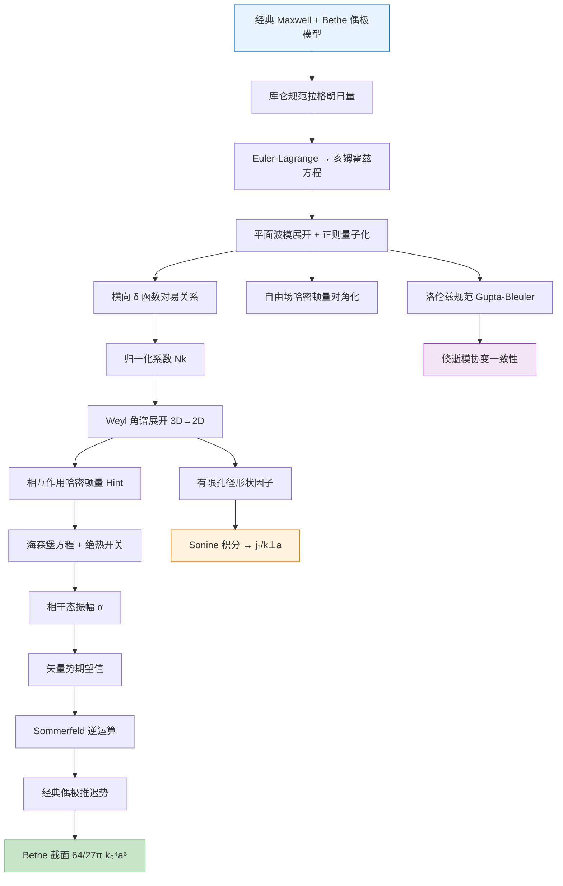
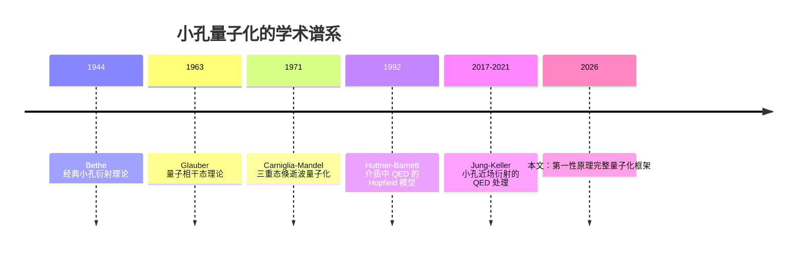

# 小孔极端约束光场的量子化——研究总览

![[flowchart_sm.png]]

> [!abstract] 一句话物理直觉
> 在一个比波长还小很多的圆孔中，光不再以"光子"的形式自由传播，而是以倏逝场的形态被极端压缩——本文从第一性原理出发，为这种亚波长约束光场建立完整的量子电动力学（QED）描述，并证明其经典极限严格回归 Bethe 小孔衍射截面 $\sigma = \frac{64}{27\pi}k_0^4 a^6$。

> [!tip]+ 分层阅读指南
> **本科光学基础**：
> - 先读 **第一节（物理动机）** → 理解为什么要对小孔光场做量子化
> - **表1（经典与量子对比）** 快速建立全局图景
> - 遇到公式跳过推导，看旁边的物理含义注释
>
> **有量子力学/量子光学基础**：
> - **第二、三节** 是核心——库仑规范量子化的完整推导链
> - **第四节（Weyl 角谱）** 是关键技术：3D→2D 约化
> - **第六节（经典回归）** 验证框架自洽性
>
> **博士/博后（QED 或近场光学方向）**：
> - **第五节（Gupta-Bleuler）** 是本文独特贡献——倏逝模的协变处理
> - **第七节（形状因子）** 给出天然紫外截断的物理图像
> - 与 [[QED近场量子化文献综述]] 的 Phase 3（Jung-Keller 2021）交叉对照

---

## 一、物理动机：为什么需要小孔量子化？

### 1.1 经典小孔衍射的困境

1944 年 Bethe 首次给出了理想导体薄屏上亚波长圆孔（半径 $a \ll \lambda$）的衍射截面 [[cite:@Bethe1944]]：

$$\sigma_{\text{Bethe}} = \frac{64}{27\pi}k_0^4 a^6$$

这个结果的推导基于一个**等效偶极近似**：小孔等效于一对电偶极矩和磁偶极矩，

| 等效源 | 表达式 | 物理含义 |
|--------|--------|---------|
| 磁偶极矩 | $\mathbf{M}_0 = \frac{8}{3}a^3 \mathbf{H}_0$ | 入射磁场在小孔处感应的环形电流 |
| 电偶极矩 | $\mathbf{P}_0 = -\frac{4}{3}a^3 \mathbf{E}_0$ | 入射电场在小孔处感应的极化电荷 |

> [!important] 关键观察
> Bethe 理论是纯经典的。当实验进入近场尺度（$a \sim \lambda/100$），光的量子特性（零点涨落、光子反关联）变得不可忽略。问题是：**如何为亚波长约束下的电磁场建立严格的量子描述？**

### 1.2 近场量子化的特殊困难

| 困难 | 自由空间 | 小孔近场 |
|------|---------|---------|
| 模式类型 | 传播平面波 $e^{i(\mathbf{k}\cdot\mathbf{r}-\omega t)}$ | 传播模 + 倏逝模（$k_\perp > k_0$） |
| 波矢分量 | $k_z = \sqrt{k_0^2 - k_\perp^2}$ 实数 | $k_z = i\kappa$ 虚数（沿 $z$ 指数衰减） |
| 横向动量 | $\hbar k_\perp \leq \hbar k_0$ | $\hbar k_\perp > \hbar\omega/c$（超衍射极限） |
| 规范选择 | 库仑规范即可 | 需要协变方法验证倏逝模 |
| 归一化 | 箱归一化，$V \to \infty$ | 角谱展开，$k_z$ 虚数需要特殊处理 |

> [!warning] 核心挑战
> 倏逝模（evanescent modes）的 $k_z$ 是虚数，标准平面波量子化中的归一化系数 $N_k = \sqrt{\hbar/(2\epsilon_0\omega_k(2\pi)^3)}$ 不再直接适用。需要通过 **Weyl 角谱展开**重新归一化。

---

## 二、库仑规范下的场量子化

### 2.1 出发点：拉格朗日量与规范选择

自由电磁场的拉格朗日密度：

$$\mathcal{L} = \frac{\epsilon_0}{2}|\dot{\mathbf{A}} + \nabla\phi|^2 - \frac{1}{2\mu_0}|\nabla\times\mathbf{A}|^2$$

**库仑规范**（Coulomb gauge）条件：

$$\nabla \cdot \mathbf{A} = 0$$

在此规范下，标量势 $\phi$ 由电荷分布瞬时决定（无独立自由度），矢量势 $\mathbf{A}$ 的横场部分承载所有辐射自由度。

### 2.2 模式展开与正则量子化

满足亥姆霍兹方程 $\nabla^2\mathbf{A} + k_0^2\mathbf{A} = 0$ 的横场解展开为：

$$\hat{\mathbf{A}}(\mathbf{r},t) = \sum_{\lambda=1}^{2}\int d^3k \left[ N_k \, \boldsymbol{\epsilon}_{\mathbf{k},\lambda} \, \hat{a}_{\mathbf{k},\lambda} \, e^{i(\mathbf{k}\cdot\mathbf{r} - \omega_k t)} + \text{h.c.} \right]$$

其中：

| 符号 | 定义 | 物理含义 |
|------|------|---------|
| $\boldsymbol{\epsilon}_{\mathbf{k},\lambda}$ | 偏振矢量，$\lambda=1,2$ | 横场偏振自由度 |
| $N_k$ | $\sqrt{\dfrac{\hbar}{2\epsilon_0\omega_k(2\pi)^3}}$ | 归一化系数 |
| $\hat{a}_{\mathbf{k},\lambda}$ | 湮灭算符 | 湮灭一个 $(\mathbf{k},\lambda)$ 模光子 |

### 2.3 对易关系

产生湮灭算符满足：

$$[\hat{a}_{\mathbf{k},\lambda}, \hat{a}_{\mathbf{k}',\lambda'}^\dagger] = \delta_{\lambda\lambda'}\,\delta^{(3)}(\mathbf{k}-\mathbf{k}')$$

等价的场算符对易关系——包含**横向 $\delta$ 函数**：

$$[\hat{A}_i(\mathbf{r}), \hat{E}_j(\mathbf{r}')] = -\frac{i\hbar}{\epsilon_0}\delta_{ij}^{\perp}(\mathbf{r}-\mathbf{r}')$$

其中横向 $\delta$ 函数定义为：

$$\delta_{ij}^{\perp}(\mathbf{r}) = \frac{1}{(2\pi)^3}\int d^3k \left(\delta_{ij} - \frac{k_ik_j}{k^2}\right)e^{i\mathbf{k}\cdot\mathbf{r}}$$

> [!check]+ 自洽性检查
> 横向 $\delta$ 函数确保只有横场分量参与量子化——纵场和标量势在库仑规范中不是独立自由度。这是库仑规范的代价（非协变），但物理结果与洛伦兹规范一致（见第五节）。

### 2.4 自由场哈密顿量

$$\hat{H}_0 = \sum_{\lambda}\int d^3k \, \hbar\omega_k\left(\hat{a}_{\mathbf{k},\lambda}^\dagger\hat{a}_{\mathbf{k},\lambda} + \frac{1}{2}\right)$$

每个模式是独立的量子谐振子，零点能 $\frac{1}{2}\hbar\omega_k$ 对应真空涨落。

> **推导细节见 →** [[01_场量子化推导]]

---

## 三、Weyl 角谱展开：3D → 2D 约化

### 3.1 Sommerfeld 恒等式

将三维平面波 $e^{i\mathbf{k}\cdot\mathbf{r}}$ 分解为二维角谱积分（Sommerfeld identity）：

$$\frac{e^{ik_0 r}}{r} = \frac{i}{2\pi}\int d^2k_\perp \frac{1}{k_z}e^{i(k_x x + k_y y + k_z|z|)}$$

这一恒等式将一个三维传播问题约化为二维积分——传播方向 $z$ 的信息编码在 $k_z$ 中。

### 3.2 角谱归一化

对矢量势做角谱展开后，归一化系数变为：

$$C_{k_\perp} = \sqrt{\frac{\hbar}{2\epsilon_0\omega_0(2\pi)^3 |k_z|}}$$

> [!important] 为什么 $|k_z|$ 而不是 $k_z$？
> 对于传播模 $k_\perp < k_0$：$k_z = \sqrt{k_0^2 - k_\perp^2}$ 是实数，$|k_z|$ 退化为 $k_z$。
> 对于**倏逝模** $k_\perp > k_0$：$k_z = i\kappa$ 是虚数，$|k_z| = \kappa = \sqrt{k_\perp^2 - k_0^2}$。归一化系数仍然为正实数——物理意义是倏逝光子的"有效模式密度"。

### 3.3 倏逝模的量子特性

| 属性 | 传播模 ($k_\perp < k_0$) | 倏逝模 ($k_\perp > k_0$) |
|------|------------------------|------------------------|
| $k_z$ | $\sqrt{k_0^2 - k_\perp^2}$（实数） | $i\kappa = i\sqrt{k_\perp^2 - k_0^2}$（虚数） |
| 空间依赖 | $e^{ik_z z}$（振荡传播） | $e^{-\kappa z}$（指数衰减） |
| 横向动量 | $\hbar k_\perp < \hbar\omega/c$ | $\hbar k_\perp > \hbar\omega/c$（超衍射极限） |
| 携带能量 | $\hbar\omega$ | $\hbar\omega$（与传播模相同） |
| 可探测性 | 远场直接探测 | 仅近场（$z \lesssim 1/\kappa$）可探测 |

---

## 四、微扰动力学：从小孔到相干态

### 4.1 相互作用哈密顿量

小孔对电磁场的扰动用一个相互作用哈密顿量描述：

$$\hat{H}_{\text{int}} = -\int d^3r \, \hat{\mathbf{j}}(\mathbf{r})\cdot\hat{\mathbf{A}}(\mathbf{r})$$

其中 $\hat{\mathbf{j}}$ 是小孔区域的感应电流算符。

### 4.2 海森堡方程 + 绝热开关

在海森堡绘景中，算符的时间演化由下式给出：

$$i\hbar\frac{d\hat{a}_{\mathbf{k},\lambda}}{dt} = [\hat{a}_{\mathbf{k},\lambda}, \hat{H}_0 + \hat{H}_{\text{int}}]$$

对相互作用做**绝热开关**（adiabatic switching）$V \to V e^{-\eta|t|}$（$\eta \to 0^+$），解出湮灭算符的演化：

$$\hat{a}_{\mathbf{k},\lambda}(t) = \hat{a}_{\mathbf{k},\lambda}(0)\,e^{-i\omega_k t} + \alpha_{\mathbf{k},\lambda}\left(e^{-i\omega_0 t} - e^{-i\omega_k t}\right)$$

### 4.3 相干态振幅

定义相干态位移振幅 [[cite:@Glauber1963]]：

$$\boxed{\alpha_{\mathbf{k},\lambda} = -\frac{V_{\mathbf{k},\lambda}}{\hbar(\omega_k - \omega_0 - i\eta)}}$$

其中 $V_{\mathbf{k},\lambda} = \langle 1_{\mathbf{k},\lambda}|\hat{H}_{\text{int}}|0\rangle$ 是相互作用矩阵元。

> [!tip]+ 物理含义
> - 当 $\omega_k = \omega_0$（共振条件）：$\alpha$ 最大，对应共振增强
> - $\eta \to 0^+$ 的 infinitesimal imaginary part 提供 **Fermi 黄金法则**的数学基础
> - 相干态 $|\alpha\rangle$ 是湮灭算符的本征态：$\hat{a}|\alpha\rangle = \alpha|\alpha\rangle$

> **完整推导见 →** [[02_微扰与经典回归]]

---

## 五、洛伦兹规范与 Gupta-Bleuler 方法

### 5.1 为什么要用协变方法？

库仑规范虽然物理图像清晰，但它**不是洛伦兹协变的**。对于小孔问题中出现的倏逝模（$k_z$ 为虚数），需要验证：

1. 标量光子和纵光子的贡献是否在物理态中仍然抵消？
2. 倏逝模的归一化是否与库仑规范一致？

### 5.2 四维量子化

引入四维势 $\hat{A}^\mu = (\hat{\phi}/c, \hat{\mathbf{A}})$，含四个偏振态 $\lambda = 0,1,2,3$：

$$\hat{A}^\mu(\mathbf{r},t) = \sum_{\lambda=0}^{3}\int d^3k \, N_k \, \epsilon^\mu_{\mathbf{k},\lambda} \left[\hat{a}_{\mathbf{k},\lambda}\,e^{-i\omega_k t} + \hat{a}_{\mathbf{k},\lambda}^\dagger\,e^{i\omega_k t}\right]e^{i\mathbf{k}\cdot\mathbf{r}}$$

**Gupta-Bleuler 条件**限制物理态 [[cite:@Jung2021]]：

$$\partial_\mu \hat{A}^{\mu(+)}|\psi_{\text{phys}}\rangle = 0$$

### 5.3 倏逝模的协变一致性

> [!success] 核心结论
> 即使当 $k_z = i\kappa$（倏逝模），标量光子（$\lambda=0$）和纵光子（$\lambda=3$）的贡献在物理态中**仍然严格相消**。这意味着：
>
> - 库仑规范的横场量子化结果对倏逝模完全适用
> - 不需要额外的鬼场（ghost field）修正
> - 负度规态的消除机制不依赖于 $k_z$ 是实数还是虚数

| 验证项 | 结果 |
|--------|------|
| $\lambda=0$（标量光子）与 $\lambda=3$（纵光子）相消 | 对倏逝模成立 |
| 横场对易关系与库仑规范一致 | 成立 |
| 归一化系数 $C_{k_\perp}$ 协变推导相同 | 成立 |

---

## 六、经典回归：从量子到 Bethe 截面

### 6.1 相干态期望值 → 矢量势

在相干态 $|\alpha\rangle$ 中取矢量势的期望值：

$$\langle\alpha|\hat{\mathbf{A}}(\mathbf{r},t)|\alpha\rangle = \sum_{\lambda}\int d^3k \, N_k \, \boldsymbol{\epsilon}_{\mathbf{k},\lambda} \left[\alpha_{\mathbf{k},\lambda}\,e^{i(\mathbf{k}\cdot\mathbf{r}-\omega_k t)} + \text{c.c.}\right]$$

**这一步是量子→经典的关键桥梁**：相干态的期望值复现经典场的运动方程。

### 6.2 Sommerfeld 逆变换

对角谱做 Sommerfeld 逆变换，将积分还原为实空间推迟势：

$$\langle\hat{\mathbf{A}}\rangle \xrightarrow{\text{Sommerfeld inverse}} \mathbf{A}_{\text{ret}}(\mathbf{r},t)$$

### 6.3 PEC 屏的镜像规则

理想导体（PEC）屏上的小孔等效偶极矩遵循镜像规则：

| 偶极类型 | 镜像规则 | 效果 |
|---------|---------|------|
| 切向磁偶极 $\mathbf{M}_\parallel$ | 镜像同向 | **相长干涉**——磁偶极增强 |
| 切向电偶极 $\mathbf{P}_\parallel$ | 镜像反向 | **相消干涉**——电偶极抵消 |

这解释了为什么小孔透射中**磁偶极矩主导**（$\mathbf{M}_0 = \frac{8}{3}a^3\mathbf{H}_0$），而电偶极矩贡献被屏的镜像效应部分抵消（$\mathbf{P}_0 = -\frac{4}{3}a^3\mathbf{E}_0$）。

### 6.4 回归 Bethe 截面

将等效偶极的推迟势代入远场辐射公式，得到：

$$\boxed{\sigma = \frac{64}{27\pi}k_0^4 a^6}$$

> [!check]+ 自洽性验证
> 量子框架在经典极限（$\hbar \to 0$，或等价地，相干态 $|\alpha| \gg 1$）下，严格回归 Bethe 1944 的经典结果 [[cite:@Bethe1944]]。这是本文量子化框架正确性的最强证据。

---

## 七、形状因子：天然紫外截断

### 7.1 有限孔径效应

真实小孔的半径 $a$ 有限，这为倏逝模的横向波矢 $k_\perp$ 提供了一个**内禀紫外（UV）截断**——这是小孔量子化中最优雅的物理结果之一。

### 7.2 Sonine 积分

对有限半径的圆孔做积分（Sonine integral）：

$$\int_0^a J_0(k_\perp \rho) \, \rho \, d\rho = \frac{a^2 \, j_1(k_\perp a)}{k_\perp a}$$

其中 $j_1(x) = (\sin x - x\cos x)/x^2$ 是一阶球贝塞尔函数。

定义**形状因子**（aperture form factor）：

$$F(k_\perp a) = \frac{j_1(k_\perp a)}{k_\perp a}$$

### 7.3 形状因子的物理行为

| 区域 | 近似 | 物理含义 |
|------|------|---------|
| $k_\perp a \ll 1$ | $F \to \frac{1}{2}$（常数） | 长波极限：孔径远小于倏逝波长，不敏感 |
| $k_\perp a \sim 1$ | $F$ 开始下降 | 过渡区：倏逝波长与小孔尺度可比 |
| $k_\perp a \gg 1$ | $F \sim \dfrac{1}{k_\perp a} \to 0$ | 短波截断：高 $k_\perp$ 倏逝模被强烈抑制 |

> [!important] 天然 UV 截断的物理意义
> 形状因子 $F(k_\perp a)$ 自动抑制 $k_\perp \gg 1/a$ 的倏逝模，无需人为引入截断动量。这是因为在 $k_\perp a \gg 1$ 时，倏逝波的空间振荡周期远小于孔径，正负贡献在小孔面积上平均后趋于零。**小孔的有限尺寸本身就是倏逝模的正则化机制。**

---

## 八、推导流程图

---

## 九、核心公式速查

| 公式 | 表达式 | 出处 |
|------|--------|------|
| 库仑规范归一化 | $N_k = \sqrt{\dfrac{\hbar}{2\epsilon_0\omega_k(2\pi)^3}}$ | 第二节 |
| 角谱归一化 | $C_{k_\perp} = \sqrt{\dfrac{\hbar}{2\epsilon_0\omega_0(2\pi)^3\|k_z\|}}$ | 第三节 |
| 横向 δ 函数 | $\delta_{ij}^{\perp}(\mathbf{r}) = \dfrac{1}{(2\pi)^3}\int d^3k\left(\delta_{ij} - \dfrac{k_ik_j}{k^2}\right)e^{i\mathbf{k}\cdot\mathbf{r}}$ | 第二节 |
| 相干态振幅 | $\alpha = -\dfrac{V}{\hbar(\omega_k - \omega_0 - i\eta)}$ | 第四节 |
| Bethe 等效磁偶极 | $\mathbf{M}_0 = \dfrac{8}{3}a^3\mathbf{H}_0$ | 第六节 |
| Bethe 等效电偶极 | $\mathbf{P}_0 = -\dfrac{4}{3}a^3\mathbf{E}_0$ | 第六节 |
| Bethe 截面 | $\sigma = \dfrac{64}{27\pi}k_0^4 a^6$ | 第六节 |
| 形状因子 | $F(k_\perp a) = \dfrac{j_1(k_\perp a)}{k_\perp a}$ | 第七节 |

---

## 十、与文献的衔接

本文的量子化框架处于以下学术脉络中：

### 关键文献

| 文献 | 贡献 | 与本文关系 |
|------|------|-----------|
| [[cite:@Bethe1944]] | 经典小孔衍射截面 | 经典极限的检验基准 |
| [[cite:@Glauber1963]] | 量子相干态理论 | 相干态振幅 $\alpha$ 的数学基础 |
| [[cite:@Carniglia1971]] | 倏逝波的三重态量子化 | 角谱展开方法的前身 |
| [[cite:@Huttner1992]] | 介质中电磁场的微观量子化 | 吸收性介质中的噪声算符方法 |
| [[cite:@Jung2021]] | 小孔近场 QED | 最接近的前驱工作；本文补充了 Gupta-Bleuler 协变验证 |

> **更多文献参见 →** [[QED近场量子化文献综述]]

---

## 十一、开放问题与研究前景

> [!question] 待解决的物理问题
> 1. **非理想导体修正**：真实金属屏（有限电导率 $\sigma$）如何修正等效偶极矩和量子化条件？
> 2. **多孔干涉**：两个亚波长小孔的量子化——倏逝模之间的量子关联是否产生新的干涉效应？
> 3. **太赫兹实验对接**：THz 近场显微镜中的亚波长探针（$a \sim \lambda/100$）能否直接观测本文预测的零点涨落修正？
> 4. **形状因子可测性**：$F(k_\perp a)$ 的 UV 截断行为是否可以通过改变 $a/\lambda$ 比值在实验中验证？

---

## 相关笔记

- **推导细节**：[[01_场量子化推导]]（库仑规范 + Gupta-Bleuler 完整推导）
- **经典回归**：[[02_微扰与经典回归]]（相干态 → Bethe 截面的完整计算）
- **文献脉络**：[[QED近场量子化文献综述]]（从 Glauber 1963 到 Jung-Keller 2021 的完整谱系）
