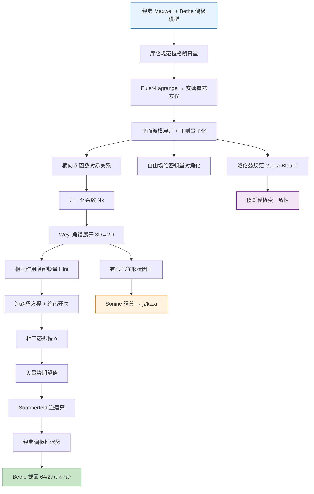
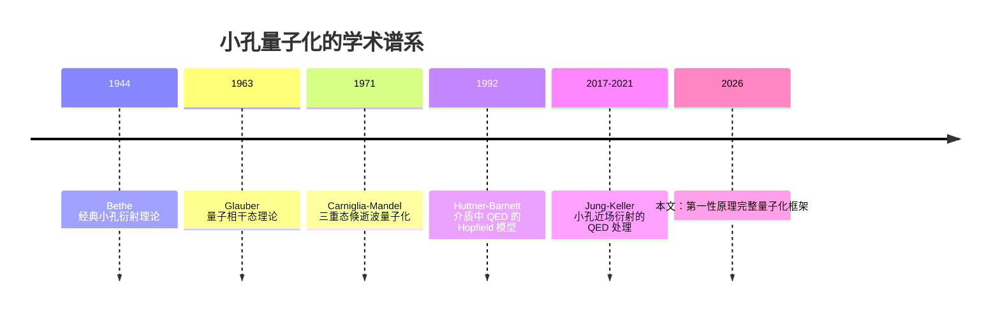

# 小孔极端约束光场的量子化——研究总览

![[flowchart_sm.png]]

> [!abstract] 一句话物理直觉
> 在一个比波长还小很多的圆孔中，光不再以"光子"的形式自由传播，而是以倏逝场的形态被极端压缩——本文从第一性原理出发，为这种亚波长约束光场建立完整的量子电动力学（QED）描述，并证明其经典极限严格回归 Bethe 小孔衍射截面 $\sigma = \frac{64}{27\pi}k_0^4 a^6$。

> [!tip]+ 分层阅读指南
> **本科光学基础**：
> - 先读 **第一节（物理动机）** → 理解为什么要对小孔光场做量子化
> - **表1（经典与量子对比）** 快速建立全局图景
> - 遇到公式跳过推导，看旁边的物理含义注释
>
> **有量子力学/量子光学基础**：
> - **第二、三节** 是核心——库仑规范量子化的完整推导链
> - **第四节（Weyl 角谱）** 是关键技术：3D→2D 约化
> - **第六节（经典回归）** 验证框架自洽性
>
> **博士/博后（QED 或近场光学方向）**：
> - **第五节（Gupta-Bleuler）** 是本文独特贡献——倏逝模的协变处理
> - **第七节（形状因子）** 给出天然紫外截断的物理图像
> - 与 [[QED近场量子化文献综述]] 的 Phase 3（Jung-Keller 2021）交叉对照

---

## 一、物理动机：为什么需要小孔量子化？

### 1.1 实验前沿：量子效应逼近可观测边界

近年来，极端光学实验已逼近约束光场量子效应的可观测边界：

| 实验进展 | 尺度/精度 | 物理含义 |
|----------|----------|---------|
| 纳米结构模式体积压缩 | $\sim 1\;\text{nm}^3$ | 场量子涨落被增强到可观测水平 |
| 阿秒隧穿测量 | 34 as 时间分辨 | 电子动力学标尺进入量子场耦合区间 |
| THz 近场显微镜 | $a \sim \lambda/100$ | 探针尺度远小于波长，倏逝场主导 |

> [!important] 核心物理问题
> 当约束光场在纳米-阿秒尺度与物质耦合时，场的量子涨落将影响可观测的电子动力学。这要求为约束光场建立量子化描述——而小孔作为最简单的亚波长约束结构，是理论构建的自然起点。

### 1.2 经典小孔衍射的 Bethe 理论

1944 年 Bethe 首次给出了理想导体薄屏上亚波长圆孔（半径 $a \ll \lambda_0$）的衍射截面 [[cite:@Bethe1944]]：
$$\sigma_{\text{Bethe}} = \frac{64}{27\pi}k_0^4 a^6$$
这个结果的推导基于一个**等效偶极近似**：小孔等效于一对电偶极矩和磁偶极矩，
| 等效源 | 表达式 | 物理含义 |
|--------|--------|---------|
| 磁偶极矩 | $\mathbf{M}_0 = \frac{8}{3}a^3 (2\mathbf{H}_0)$ | 入射磁场在小孔处感应的环形电流 |
| 电偶极矩 | $\mathbf{P}_0 = -\frac{4}{3}a^3 \mathbf{E}_0$ | 入射电场在小孔处感应的极化电荷 |

> **穿透等效表象：偶极矩的微观物理图像**
> 在进入量子化推导前，必须厘清经典等效偶极矩背后的真实物理图景。Bethe 模型的本质是**场等效原理**与**二次辐射**的结合：
> 
> **1. 局域驱动场：为何磁偶极矩多出系数 $2$？**
> 在未打孔的理想导体表面，入射波与全反射波发生干涉。由于短路边界条件，切向磁场同向叠加增强为 $2\mathbf{H}_0$。公式中的系数 $2$ 并非透射场，而是驱动小孔发生极化的**真实局域总磁场**。（注：切向电场因反向抵消为 $0$，故电偶极矩直接由法向电场 $\mathbf{E}_0$ 驱动）。
> 
> **2. 抗磁极化：为何透射等效磁矩方向“反向”？**
> 亚波长小孔在电磁场中可视为一块极薄的“抗磁微元”。孔边缘环绕的感应电流为了维持理想导体的边界条件，产生了一个与入射磁场**方向相反**的磁偶极矩 $\mathbf{M}_0$。这是一种极化的响应，用于部分抵消并重构局域场。
> 
> **3. 惠更斯二次辐射：远场衍射的真正来源**
> 入射波与反射波都被限制在屏上方（$z<0$），**远场接收到的并非“漏过去”的入射光**。被强局域场深度极化的小孔，充当了交变偶极子天线。它向屏下方（$z>0$）独立辐射出全新的球面波，这才是我们观测到的远场衍射图样。

Bethe 理论在经典远场分析中非常有效，但在涉及光子统计和真空涨落等近场量子特性时却力有不逮。

*** 

### 1.3 近场量子化的特殊困难

| 困难 | 自由空间 | 小孔近场 |
|------|---------|---------|
| 模式类型 | 传播平面波 $e^{i(\mathbf{k}\cdot\mathbf{r}-\omega t)}$ | 传播模 + 倏逝模（$k_\perp > k_0$） |
| 波矢分量 | $k_z = \sqrt{k_0^2 - k_\perp^2}$ 实数 | $k_z = i\kappa$ 虚数（沿 $z$ 指数衰减） |
| 横向动量 | $\hbar k_\perp \leq \hbar k_0$ | $\hbar k_\perp > \hbar\omega/c$（超衍射极限） |
| 规范选择 | 库仑规范即可 | 需要协变方法验证倏逝模 |
| 归一化 | 箱归一化，$V \to \infty$ | 角谱展开，$k_z$ 虚数需要特殊处理 |

> [!warning] 核心挑战
> 倏逝模（evanescent modes）的 $k_z$ 是虚数，标准平面波量子化中的归一化系数 $N_k = \sqrt{\hbar/(2\epsilon_0\omega_k(2\pi)^3)}$ 不再直接适用。需要通过 **Weyl 角谱展开**重新归一化。

---

## 二、偶极子模型：经典图像的出发点

### 2.1 磁偶极子与电偶极子

小孔衍射问题的物理核心在于：将亚波长圆孔（$a \ll \lambda_0$）等效为一对位于原点的振荡偶极子。它们的偶极矩随时间简谐振荡：

$$\mathbf{M}(t) = \mathbf{M}_0 e^{-i\omega_0 t} + \text{c.c.}, \quad \mathbf{P}(t) = \mathbf{P}_0 e^{-i\omega_0 t} + \text{c.c.}$$

> [!tip] 物理图像
> - **磁偶极子** $\mathbf{M}_0$：入射磁场 $\mathbf{H}_0$ 在小孔处感应出环形电流，该环流等效为一个磁偶极矩，方向位于小孔平面内，大小正比于孔径的立方 $a^3$。
> - **电偶极子** $\mathbf{P}_0$：入射电场 $\mathbf{E}_0$ 在小孔处感应出极化电荷分布（正负电荷对），等效为电偶极矩。


# 2.1 节：偶极子模型的物理基础

> [!abstract] 本节导读
> 本节从第一性原理出发，澄清 Bethe 偶极子模型中涉及的几个关键物理问题：等效电流环的物理图像与系数来源、磁矢势的物理含义、磁极化电流的定义，以及含源亥姆霍兹方程与相互作用哈密顿量之间的严格桥接。这些问题看似基础，实则涉及连续介质理论与等效源模型之间的深层联系。

---

## 2.1.1 等效电流环的物理图像

### 1. 电流流向与空间分布

在 Bethe 偶极子模型中，小孔在入射场作用下产生的等效磁偶极矩来源于**孔缘处环绕的感应电流**。其物理图像如下：

```
              金属屏 (z = 0⁻) 俯视图
              
                        2H₀ (切向磁场增强)
                            ⊗
                            ↓
        ════════════════════════════════════
        ║                                   ║
        ║      ↺ ↺ ↺ ↺ ↺ ↺ ↺ ↺              ║  ← 电流沿孔缘环绕
        ║    ↺                   ↺          ║
        ║   ↺     ⬤ 小孔      ↺            ║
        ║    ↺                 ↺           ║
        ║      ↺ ↺ ↺ ↺ ↺ ↺ ↺              ║
        ════════════════════════════════════
        
        侧视图 (x-z 截面)：
        
        z < 0                    z > 0
         ↓                        ↑
    ════════════════════════════════════
    ║                                   ║
    ║            ⊙→⊙→⊙                 ║  ← 感应电流 (沿 y 方向)
    ║           (沿孔缘)                ║
    ║                                   ║
    ════════════════════════════════════
         金属屏
```

| 项目 | 内容 |
|------|------|
| **电流分布** | 沿圆孔孔缘（$r = a$ 处）形成环形电流 $J_\phi$ |
| **方向** | 环绕小孔，沿方位角方向 $\hat{\phi}$ |
| **驱动机制** | 入射波与反射波在屏上方干涉，使切向磁场增强为 $2\mathbf{H}_0$，该增强磁场穿透小孔，在孔缘驱动感应环形电流 |
| **物理约束** | 理想导体边界条件要求 $z = 0$ 处切向电场为零 |

### 2. 磁偶极矩系数 $\frac{8}{3}$ 的来源

**标准磁偶极矩定义**（电流环）：
$$\mathbf{m} = I \cdot \mathbf{A}_{\text{loop}}$$

其中 $I$ 为环路电流，$\mathbf{A}_{\text{loop}} = \pi a^2 \hat{\mathbf{z}}$ 为环路围出的面积。

**量纲分析**：
- 电流 $I$ 的量纲：$[\mathbf{I}] = \mathrm{A}$
- 环路面积：$[\pi a^2] = \mathrm{m}^2$
- $[\mathbf{m}] = \mathrm{A} \cdot \mathrm{m}^2$

**系数推导**：感应电流的大小由小孔处的感应电场决定。在亚波长极限下，磁场在孔内近似均匀分布，由此得到：

$$\mathbf{M}_0 = \frac{4}{3}a^3 (2\mathbf{H}_0)$$

其中：
- $a^3$ 来自电流 $\propto$ 面积 $\times$ 磁场 $\propto a \cdot H_0$，而 $\mathbf{m} = I \cdot \pi a^2 \propto a^3 \mathbf{H}_0$
- 系数 $\frac{8}{3}$ 来自 **Bethe 边界匹配计算**的精确结果（1944）
- 因子 $2$ 来自入射波与反射波的干涉增强

---

## 2.1.2 磁矢势的物理含义

### 1. 量纲推导

从定义出发：
$$\mathbf{B} = \nabla \times \mathbf{A}$$

| 量 | 定义 | 量纲 |
|----|------|------|
| $[\mathbf{B}]$ | 磁感应强度 | $\mathrm{T} = \mathrm{V}\cdot\mathrm{s}/\mathrm{m}^2$ |
| $[\nabla \times]$ | 算子 | $1/\mathrm{m}$ |
| $[\mathbf{A}]$ | 磁矢势 | $\mathrm{T}\cdot\mathrm{m} = \mathrm{V}\cdot\mathrm{s}/\mathrm{m}$ |

$$\boxed{[\mathbf{A}] = \frac{\mathrm{V}\cdot\mathrm{s}}{\mathrm{m}}}$$

### 2. 磁能与磁矢势的类比

| 电学量 | 表达式 | 磁学量 | 表达式 |
|-------|--------|-------|--------|
| 标势 | $\phi$ $[\mathrm{V}]$ | 矢势 | $\mathbf{A}$ $[\mathrm{V}\cdot\mathrm{s}/\mathrm{m}]$ |
| 源项 | 电荷 $q$ $[\mathrm{C}]$ | 源项 | 电流元 $\mathbf{J}\,dV$ $[\mathrm{A}/\mathrm{m}^2]$ |
| 势能 | $U = q\phi$ $[\mathrm{J}]$ | 磁能 | $U = \int \mathbf{A}\cdot\mathbf{J}\,dV$ $[\mathrm{J}]$ |

**核心关系式**：
$$U = \frac{1}{2} \int \mathbf{A} \cdot \mathbf{J} \, dV$$

> [!tip] 物理直觉
> 类比成立，但有本质差异：
> - 电势能：$\phi$ 是标量，电荷是点电荷（局域的），积分退化为乘法
> - 磁能：$\mathbf{A}$ 是矢量，电流是分布的（$\mathbf{J}$ 是空间密度），积分不可分离

### 3. 物理应用：法拉第电磁感应

从矢势出发理解感应电动势：

$$\varepsilon = \oint \mathbf{E} \cdot d\boldsymbol{\ell} = -\frac{d}{dt}\int \mathbf{B} \cdot d\mathbf{S} = -\frac{d\Phi}{dt}$$

而 $\Phi = \oint \mathbf{A} \cdot d\boldsymbol{\ell}$，所以：

$$\varepsilon = -\frac{d}{dt}\oint \mathbf{A} \cdot d\boldsymbol{\ell} = -\oint \frac{\partial \mathbf{A}}{\partial t} \cdot d\boldsymbol{\ell}$$

这正是 **法拉第电磁感应定律** 的矢势表述。

---

## 2.1.3 磁极化电流的物理定义

### 1. 三种来源

磁极化电流来源于磁偶极子的微观环路电流，完整的表达式为：

$$\mathbf{J}_M = \underbrace{\frac{\partial \mathbf{M}}{\partial t}}_{\text{时间变化项}} + \underbrace{\nabla \times \mathbf{M}}_{\text{空间不均匀项}}$$

| 类型 | 表达式 | 物理来源 | 量纲 |
|------|--------|---------|------|
| **时间变化磁化电流** | $\mathbf{J}_{M,t} = \dfrac{\partial \mathbf{M}}{\partial t}$ | 磁偶极矩随时间变化 | $\mathrm{A/m}^2$ |
| **空间不均匀磁化电流** | $\mathbf{J}_{M,\nabla} = \nabla \times \mathbf{M}$ | 磁化强度空间梯度产生环路电流 | $\mathrm{A/m}^2$ |
| **总有效磁流密度** | $\mathbf{J}_M = \dfrac{\partial \mathbf{M}}{\partial t} + \nabla \times \mathbf{M}$ | 等效安培定律中的完整源项 | $\mathrm{A/m}^2$ |

### 2. 与电极化电流的对照

| | 电极化 | 磁极化 |
|--|-------|-------|
| **极化强度定义** | $\mathbf{P}$ $[\mathrm{C/m}^2]$ | $\mathbf{M}$ $[\mathrm{A/m}]$ |
| **极化电流** | $\mathbf{J}_P = \dfrac{\partial \mathbf{P}}{\partial t}$ | $\mathbf{J}_M = \dfrac{\partial \mathbf{M}}{\partial t} + \nabla \times \mathbf{M}$ |
| **来源** | 电荷分离（真实电荷往复运动） | 磁偶极矩变化（真实环路电流） |
| **与时间的关系** | 仅含时间变化项 | 含时间变化项 + 空间不均匀项 |

> [!warning] 注意不对称性
> 电极化电流只有时间变化项，但磁极化电流还多出一个 $\nabla \times \mathbf{M}$ 项。这是因为**磁偶极子的微观电流本身就是环路电流**，其散度为零但旋度不为零。

---

## 2.1.4 含源亥姆霍兹方程 → 相互作用哈密顿量的桥接

### 1. 核心矛盾：两种 P 的量纲冲突

```
┌──────────────────────────────────────────────────────────────────┐
│                                                                  │
│   含源亥姆霍兹方程                        相互作用哈密顿量       │
│                                                                  │
│   ∇²A + k²A = -μ₀J_eff                    H_int = -d · E        │
│                                                                  │
│   J_eff ⊃ ∂P/∂t                           d: 电偶极矩算符        │
│                                                                  │
│   P 是极化强度                           P₀ = ∫P d³r            │
│   [P] = C/m²                              [P₀] = C·m            │
│                                                                  │
│   量纲不一致！                                             │
│                                                                  │
└──────────────────────────────────────────────────────────────────┘
```

### 2. 物理量层级结构

这是同一物理量在不同描述层级上的表现：

```
┌─────────────────────────────────────────────────────────────────────┐
│                                                                     │
│   微观层面：电流环路 (单个分子/原子)                                  │
│                                                                     │
│        I                                                            │
│       ↺ ↺ ↺                                                        │
│      ↺   ↺                                                         │
│       ↺ ↺                                                           │
│          ↓                                                          │
│     磁偶极矩 m = I·A    (量纲: A·m²)                                │
│     电偶极矩 p = q·d    (量纲: C·m)                                 │
│                                                                     │
└─────────────────────────────────────────────────────────────────────┘
                              ↓ 空间分布 + 量子化
┌─────────────────────────────────────────────────────────────────────┐
│                                                                     │
│   连续介质层面：极化强度                                              │
│                                                                     │
│   P(r) = Σ p_i · δ(r - r_i)                                         │
│                                                                     │
│   [P] = (C·m) / m³ = C/m²                                           │
│                                                                     │
│   ↑ 这个 P 出现在含源亥姆霍兹方程中                                   │
│                                                                     │
└─────────────────────────────────────────────────────────────────────┘
                              ↓ 空间积分
┌─────────────────────────────────────────────────────────────────────┐
│                                                                     │
│   局域系统层面：总偶极矩 (原子/小孔等效)                              │
│                                                                     │
│   P₀ = ∫_V P(r) d³r                                                 │
│                                                                     │
│   [P₀] = (C/m²) · m³ = C·m                                          │
│                                                                     │
│   ↑ 这个 P₀ 出现在相互作用哈密顿量中                                  │
│                                                                     │
└─────────────────────────────────────────────────────────────────────┘
```

### 3. 严格的数学桥接流程

**步骤 1**：写出完整的场-源耦合方程

$$\nabla^2 \mathbf{A}(\mathbf{r}) + k^2 \mathbf{A}(\mathbf{r}) = -\mu_0 \mathbf{J}_{\text{eff}}(\mathbf{r})$$

其中有效电流：
$$\mathbf{J}_{\text{eff}} = \mathbf{J}_{\text{cond}} + \frac{\partial \mathbf{P}}{\partial t} + \nabla \times \mathbf{M}$$

> [!note] 注意
> 此处 $\mathbf{P}$ 和 $\mathbf{M}$ 是**极化强度**（单位体积的偶极矩），量纲分别为 $\mathrm{C/m}^2$ 和 $\mathrm{A/m}$。注意区分，根据物理意义判断其代表什么物理量。

**步骤 2**：写出体系的完整哈密顿量

从拉格朗日量密度 $\mathcal{L}_{\text{int}} = -\mathbf{J} \cdot \mathbf{A}$ 出发：

$$H_{\text{int}} = -\int \mathbf{J}(\mathbf{r}) \cdot \mathbf{A}(\mathbf{r}) \, d^3r$$

**步骤 3**：分离局域与扩展——从极化强度到总偶极矩

对**局域系统**（原子、小孔等），定义总电偶极矩算符：

$$\mathbf{d} = \int \mathbf{r} \, \rho(\mathbf{r}) \, d^3r$$

电偶极矩与极化强度的关系：

$$\mathbf{P}(\mathbf{r}) = \sum_i \mathbf{p}_i \, \delta(\mathbf{r} - \mathbf{r}_i) \quad \Longrightarrow \quad \mathbf{d} = \int \mathbf{P}(\mathbf{r}) \, d^3r$$

**步骤 4**：应用偶极近似

$$\mathbf{A}(\mathbf{r}_0 + \boldsymbol{\rho}) \approx \mathbf{A}(\mathbf{r}_0) \quad (\rho \ll \lambda)$$

于是：

$$H_{\text{int}} = -\int \mathbf{J}(\mathbf{r}) \cdot \mathbf{A}(\mathbf{r}_0) \, d^3r = -\mathbf{d} \cdot \mathbf{A}(\mathbf{r}_0) = -\mathbf{d} \cdot \mathbf{E}(\mathbf{r}_0)$$

### 4. 关键恒等式链

```
┌─────────────────────────────────────────────────────────────────┐
│                                                                 │
│   H_int 中的偶极矩项（量纲：C·m × V/m = J）                      │
│                                                                 │
│   -d · E    ← 总偶极矩 × 局域电场                                │
│         ↑                                                       │
│         │ 偶极近似 + 空间积分                                     │
│         │                                                       │
│   -∫ J(r)·A(r) d³r  ← 电流密度 × 矢势（量纲：A/m² × V·s/m）      │
│         ↑                                                       │
│         │ 极化电流替换                                           │
│         │                                                       │
│   -∫ (∂P/∂t)·A d³r  ← 极化强度 × 矢势（量纲：C/m² × V·s/m）      │
│         ↑                                                       │
│         │ 模式展开                                               │
│         │                                                       │
│   含源亥姆霍兹方程（场方程层面）                                  │
│                                                                 │
└─────────────────────────────────────────────────────────────────┘
```

### 5. 量纲验证表

| 量 | 定义 | 量纲 |
|----|------|------|
| 极化强度 $\mathbf{P}$ | 单位体积的电偶极矩 | $\dfrac{\mathrm{C}\cdot\mathrm{m}}{\mathrm{m}^3} = \dfrac{\mathrm{C}}{\mathrm{m}^2}$ |
| 磁化强度 $\mathbf{M}$ | 单位体积的磁偶极矩 | $\dfrac{\mathrm{A}\cdot\mathrm{m}^2}{\mathrm{m}^3} = \dfrac{\mathrm{A}}{\mathrm{m}}$ |
| 总电偶极矩 $\mathbf{d}$ | $\int \mathbf{P} \, d^3r$ | $\dfrac{\mathrm{C}}{\mathrm{m}^2} \cdot \mathrm{m}^3 = \mathrm{C}\cdot\mathrm{m}$ |
| 总磁偶极矩 $\mathbf{m}$ | $\int \mathbf{M} \, d^3r$ | $\dfrac{\mathrm{A}}{\mathrm{m}} \cdot \mathrm{m}^3 = \mathrm{A}\cdot\mathrm{m}^2$ |
| 电场 $\mathbf{E}$ | $-\partial \mathbf{A}/\partial t$ | $\dfrac{\mathrm{V}}{\mathrm{m}}$ |
| 耦合项 $H_{\text{int}}$ | $-\mathbf{d} \cdot \mathbf{E}$ | $\mathrm{C}\cdot\mathrm{m} \cdot \dfrac{\mathrm{V}}{\mathrm{m}} = \mathrm{J}$ ✓ |

---

## 2.1.5 Bethe 等效偶极子模型的本质

### 1. 等效表象的物理含义

Bethe 模型的核心是**场等效原理**与**二次辐射**的结合：

```
┌─────────────────────────────────────────────────────────────────┐
│                                                                 │
│   第一步：局域驱动场                                             │
│                                                                 │
│   入射波 + 反射波 → 屏上方总场                                   │
│                        ↓                                         │
│                   切向磁场增强为 2H₀                             │
│                   切向电场为零                                   │
│                        ↓                                         │
│              驱动小孔发生极化                                    │
│                                                                 │
│   第二步：等效源                                                  │
│                                                                 │
│   极化的小孔 → 等效偶极子 P₀, M₀                                 │
│                    ↓                                             │
│              不是"透过"而是"辐射"                               │
│                                                                 │
│   第三步：惠更斯二次辐射                                         │
│                                                                 │
│   等效偶极子 → 向屏下方辐射球面波                                │
│                    ↓                                             │
│              远场观测到的衍射图样                                 │
│                                                                 │
└─────────────────────────────────────────────────────────────────┘
```

### 2. 两种物理图景的对比

| 物理图景 | 经典理解 | 量子化理解 |
|---------|---------|-----------|
| **场来源** | 入射光"漏过"小孔 | 零点涨落驱动等效偶极子辐射 |
| **偶极矩角色** | 经典源项 | 量子算符 $\hat{\mathbf{d}}$ |
| **辐射机制** | 确定性的偶极辐射 | 概率性的光子发射 |
| **截面公式** | $\sigma = \frac{64}{27\pi}k_0^4 a^6$ | $S_{\text{photon}} \propto \sigma$ |

---

### 2.2 偶极子产生的电磁场

偶极子的标势 $\varphi$ 和矢量势 $\mathbf{A}$ 满足**含源亥姆霍兹方程**：

$$\nabla^2\mathbf{A} - \frac{1}{c^2}\frac{\partial^2\mathbf{A}}{\partial t^2} = \mathbf{J}_{\text{eff}} = \nabla \times \mathbf{M}(t) + \frac{\partial \mathbf{P}(t)}{\partial t}$$

其中 $\mathbf{J}_{\text{eff}}$ 是有效电流密度，包含磁化电流（$\nabla \times \mathbf{M}$）和极化电流（$\dot{\mathbf{P}}$）两部分。电场和磁场分别由下式给出：

$$\mathbf{E} = -\nabla\varphi - \frac{\partial \mathbf{A}}{\partial t}, \quad \mathbf{B} = \nabla \times \mathbf{A}$$

> [!important] 从经典到量子的桥梁
> 经典理论中，$\mathbf{M}_0$ 和 $\mathbf{P}_0$ 是确定的数；量子化后，场 $\mathbf{A}$ 变为算符 $\hat{\mathbf{A}}$，偶极矩与量子化场的耦合通过相互作用哈密顿量 $\hat{H}_{\text{int}}$ 描述。整篇文章的推导路线就是：**经典偶极模型 → 场量子化 → 相干态 → 回归经典**。

---

## 三、库仑规范下的场量子化

### 3.1 出发点：拉格朗日量与规范选择

自由电磁场在**库仑规范** $\nabla \cdot \mathbf{A} = 0$ 下的拉格朗日密度为：

$$\mathcal{L} = \frac{\epsilon_0}{2}\dot{\mathbf{A}}^2 - \frac{1}{2\mu_0}(\nabla\times\mathbf{A})^2$$

> [!note] 为什么没有 $\nabla\phi$ 项？
> 库仑规范下，标量势 $\phi$ 由电荷分布瞬时决定（无独立辐射自由度），可以设 $\phi = 0$。因此拉格朗日量只含矢量势 $\mathbf{A}$，且 $\mathbf{E} = -\dot{\mathbf{A}}$。有源时需加入耦合项 $\mathbf{A}\cdot(\nabla\times\mathbf{M}) + \mathbf{A}\cdot\dot{\mathbf{P}}$。

### 3.2 模式展开与正则量子化

### 3.2 模式展开与正则量子化

满足亥姆霍兹方程 $\nabla^2\mathbf{A} - \frac{1}{c^2}\frac{\partial^2\mathbf{A}}{\partial t^2} = 0$ 的横场解展开为：

$$\hat{\mathbf{A}}(\mathbf{r},t) = \sum_{\lambda=1}^{2}\int d^3k \left[ N_k \, \boldsymbol{\epsilon}_{\mathbf{k},\lambda} \, \hat{a}_{\mathbf{k},\lambda} \, e^{-i(\omega_k t - \mathbf{k}\cdot\mathbf{r})} + \text{h.c.} \right]$$

其中：

| 符号 | 定义 | 物理含义 |
|------|------|---------|
| $\boldsymbol{\epsilon}_{\mathbf{k},\lambda}$ | 偏振矢量，$\lambda=1,2$ | 横场偏振自由度 |
| $N_k$ | $\sqrt{\dfrac{\hbar}{2\epsilon_0\omega_k(2\pi)^3}}$ | 归一化系数 |
| $\hat{a}_{\mathbf{k},\lambda}$ | 湮灭算符 | 湮灭一个 $(\mathbf{k},\lambda)$ 模光子 |

### 3.3 对易关系

产生湮灭算符满足：

$$[\hat{a}_{\mathbf{k},\lambda}, \hat{a}_{\mathbf{k}',\lambda'}^\dagger] = \delta_{\lambda\lambda'}\,\delta^{(3)}(\mathbf{k}-\mathbf{k}')$$

等价的场算符对易关系——包含**横向 $\delta$ 函数**：

$$[\hat{A}_i(\mathbf{r}), \hat{E}_j(\mathbf{r}')] = -\frac{i\hbar}{\epsilon_0}\delta_{ij}^{\perp}(\mathbf{r}-\mathbf{r}')$$

其中横向 $\delta$ 函数定义为：

$$\delta_{ij}^{\perp}(\mathbf{r}) = \frac{1}{(2\pi)^3}\int d^3k \left(\delta_{ij} - \frac{k_ik_j}{k^2}\right)e^{i\mathbf{k}\cdot\mathbf{r}}$$

> [!check]+ 自洽性检查
> 横向 $\delta$ 函数确保只有横场分量参与量子化——纵场和标量势在库仑规范中不是独立自由度。这是库仑规范的代价（非协变），但物理结果与洛伦兹规范一致（见第五节）。

### 3.4 自由场哈密顿量

$$\hat{H}_0 = \sum_{\lambda}\int d^3k \, \hbar\omega_k\left(\hat{a}_{\mathbf{k},\lambda}^\dagger\hat{a}_{\mathbf{k},\lambda} + \frac{1}{2}\right)$$

每个模式是独立的量子谐振子，零点能 $\frac{1}{2}\hbar\omega_k$ 对应真空涨落。

> **推导细节见 →** [[01_场量子化推导]]

---

## 四、Weyl 角谱展开：3D → 2D 约化

### 4.1 Weyl 角谱展开的动机

三维模式展开 $\int d^3k$ 中的 $k_z$ 积分对于小孔问题可以约化。关键观察是：对于频率 $\omega_0 = c|\mathbf{k}_0|$ 的单频源，偶极辐射光子可分为两组：

| 模式类型 | 条件 | $k_z$ 值 | 物理含义 |
|----------|------|----------|---------|
| 传播模 | $k_\perp < k_0$ | $k_z = \sqrt{k_0^2 - k_\perp^2}$（实数） | 沿 $z$ 方向振荡传播 |
| 倏逝模 | $k_\perp > k_0$ | $k_z = i\kappa$，$\kappa = \sqrt{k_\perp^2 - k_0^2}$（虚数） | 沿 $z$ 方向指数衰减 |

### 4.2 Sommerfeld 恒等式

将三维平面波 $e^{i\mathbf{k}\cdot\mathbf{r}}$ 分解为二维角谱积分（Sommerfeld identity）：

$$\frac{e^{ik_0 r}}{r} = \frac{i}{2\pi}\int d^2k_\perp \frac{1}{k_z}e^{i(k_x x + k_y y + k_z|z|)}$$

这一恒等式将一个三维传播问题约化为二维积分——传播方向 $z$ 的信息编码在 $k_z$ 中。

### 4.3 角谱归一化与真空相关函数

对矢量势做角谱展开后，归一化系数 $C_{k_\perp}$ 通过**真空相关函数**确定。计算场的真空两点函数：

$$D(\mathbf{r}, 0) = \langle 0|\hat{\mathbf{A}}^{(+)}(\mathbf{r})\hat{\mathbf{A}}^{(-)}(\mathbf{0})|0\rangle = \int d^2k_\perp\,|C_{k_\perp}|^2\,e^{i\mathbf{k}\cdot\mathbf{r}}$$

在小孔平面 $z=0$ 处，将此式与 Sommerfeld 恒等式给出的格林函数对比，可得：

$$C_{k_\perp} = \sqrt{\frac{\hbar}{2\epsilon_0\omega_0(2\pi)^3 |k_z|}}$$

> [!important] 为什么 $|k_z|$ 而不是 $k_z$？
> 对于传播模 $k_\perp < k_0$：$k_z = \sqrt{k_0^2 - k_\perp^2}$ 是实数，$|k_z|$ 退化为 $k_z$。
> 对于**倏逝模** $k_\perp > k_0$：$k_z = i\kappa$ 是虚数，$|k_z| = \kappa = \sqrt{k_\perp^2 - k_0^2}$。归一化系数仍然为正实数——物理意义是倏逝光子的"有效模式密度"。

结合三维对易关系固定的整体归一化系数 $N_k$（见第二节），最终得到：

$$C_{k_\perp} = \sqrt{\frac{\hbar}{2\epsilon_0\omega_0(2\pi)^3 |k_z|}}$$

### 4.4 倏逝模的量子特性

| 属性 | 传播模 ($k_\perp < k_0$) | 倏逝模 ($k_\perp > k_0$) |
|------|------------------------|------------------------|
| $k_z$ | $\sqrt{k_0^2 - k_\perp^2}$（实数） | $i\kappa = i\sqrt{k_\perp^2 - k_0^2}$（虚数） |
| 空间依赖 | $e^{ik_z z}$（振荡传播） | $e^{-\kappa z}$（指数衰减） |
| 横向动量 | $\hbar k_\perp < \hbar\omega/c$ | $\hbar k_\perp > \hbar\omega/c$（超衍射极限） |
| 携带能量 | $\hbar\omega$ | $\hbar\omega$（与传播模相同） |
| 可探测性 | 远场直接探测 | 仅近场（$z \lesssim 1/\kappa$）可探测 |

---

## 五、微扰动力学：从小孔到相干态

### 5.1 相互作用哈密顿量

小孔的等效偶极矩与量子化电磁场的耦合通过相互作用哈密顿量描述：

$$\hat{H}_{\text{int}}(t) = -\mathbf{M}(t)\cdot(\nabla \times \hat{\mathbf{A}})\big|_{\mathbf{r}=0} + \mathbf{P}(t)\cdot\frac{\partial\hat{\mathbf{A}}}{\partial t}\bigg|_{\mathbf{r}=0}$$

> [!tip] 物理含义
> 第一项是磁偶极矩与量子化磁场的耦合，第二项是电偶极矩与量子化电场的耦合（注意 $\hat{\mathbf{E}} = -\dot{\hat{\mathbf{A}}}$）。偶极矩取经典量（外部驱动），场取量子算符——这是半经典处理的特征。

### 5.2 海森堡方程 + 绝热开关

在海森堡绘景中，算符的时间演化由下式给出：

$$i\hbar\frac{d\hat{a}_{\mathbf{k},\lambda}}{dt} = [\hat{a}_{\mathbf{k},\lambda}, \hat{H}_0 + \hat{H}_{\text{int}}]$$

对相互作用做**绝热开关**（adiabatic switching）$V \to V e^{-\eta|t|}$（$\eta \to 0^+$），解出湮灭算符的演化：

$$\hat{a}_{\mathbf{k},\lambda}(t) = \hat{a}_{\mathbf{k},\lambda}(0)\,e^{-i\omega_k t} + \alpha_{\mathbf{k},\lambda}\left(e^{-i\omega_0 t} - e^{-i\omega_k t}\right)$$

### 5.3 相干态振幅

定义相干态位移振幅 [[cite:@Glauber1963]]：

$$\boxed{\alpha_{\mathbf{k},\lambda} = -\frac{V_{\mathbf{k},\lambda}}{\hbar(\omega_k - \omega_0 - i\eta)}}$$

其中 $V_{\mathbf{k},\lambda} = \langle 1_{\mathbf{k},\lambda}|\hat{H}_{\text{int}}|0\rangle$ 是相互作用矩阵元。

> [!tip]+ 物理含义
> - 当 $\omega_k = \omega_0$（共振条件）：$\alpha$ 最大，对应共振增强
> - $\eta \to 0^+$ 的 infinitesimal imaginary part 提供 **Fermi 黄金法则**的数学基础
> - 相干态 $|\alpha\rangle$ 是湮灭算符的本征态：$\hat{a}|\alpha\rangle = \alpha|\alpha\rangle$

> **完整推导见 →** [[02_微扰与经典回归]]

---

## 六、洛伦兹规范与 Gupta-Bleuler 方法

### 6.1 为什么要用协变方法？

库仑规范虽然物理图像清晰，但它**不是洛伦兹协变的**。对于小孔问题中出现的倏逝模（$k_z$ 为虚数），需要验证：

1. 标量光子和纵光子的贡献是否在物理态中仍然抵消？
2. 倏逝模的归一化是否与库仑规范一致？

### 6.2 四维量子化

引入四维势 $\hat{A}^\mu = (\hat{\phi}/c, \hat{\mathbf{A}})$，含四个偏振态 $\lambda = 0,1,2,3$：

$$\hat{A}^\mu(\mathbf{r},t) = \sum_{\lambda=0}^{3}\int d^3k \, N_k \, \epsilon^\mu_{\mathbf{k},\lambda} \left[\hat{a}_{\mathbf{k},\lambda}\,e^{-i\omega_k t} + \hat{a}_{\mathbf{k},\lambda}^\dagger\,e^{i\omega_k t}\right]e^{i\mathbf{k}\cdot\mathbf{r}}$$

**Gupta-Bleuler 条件**限制物理态 [[cite:@Jung2021]]：

$$\partial_\mu \hat{A}^{\mu(+)}|\psi_{\text{phys}}\rangle = 0$$

### 6.3 倏逝模的协变一致性

> [!success] 核心结论
> 即使当 $k_z = i\kappa$（倏逝模），标量光子（$\lambda=0$）和纵光子（$\lambda=3$）的贡献在物理态中**仍然严格相消**。这意味着：
>
> - 库仑规范的横场量子化结果对倏逝模完全适用
> - 不需要额外的鬼场（ghost field）修正
> - 负度规态的消除机制不依赖于 $k_z$ 是实数还是虚数

| 验证项 | 结果 |
|--------|------|
| $\lambda=0$（标量光子）与 $\lambda=3$（纵光子）相消 | 对倏逝模成立 |
| 横场对易关系与库仑规范一致 | 成立 |
| 归一化系数 $C_{k_\perp}$ 协变推导相同 | 成立 |

---

## 七、经典回归：从量子到 Bethe 截面

### 7.1 相干态期望值 → 矢量势

在相干态 $|\alpha\rangle$ 中取矢量势的期望值：

$$\langle\alpha|\hat{\mathbf{A}}(\mathbf{r},t)|\alpha\rangle = \sum_{\lambda}\int d^3k \, N_k \, \boldsymbol{\epsilon}_{\mathbf{k},\lambda} \left[\alpha_{\mathbf{k},\lambda}\,e^{i(\mathbf{k}\cdot\mathbf{r}-\omega_k t)} + \text{c.c.}\right]$$

**这一步是量子→经典的关键桥梁**：相干态的期望值复现经典场的运动方程。

### 7.2 Sommerfeld 逆变换

对角谱做 Sommerfeld 逆变换，将积分还原为实空间推迟势：

$$\langle\hat{\mathbf{A}}\rangle \xrightarrow{\text{Sommerfeld inverse}} \mathbf{A}_{\text{ret}}(\mathbf{r},t)$$

### 7.3 PEC 屏的镜像规则

理想导体（PEC）屏上的小孔等效偶极矩遵循镜像规则：

| 偶极类型 | 镜像规则 | 效果 |
|---------|---------|------|
| 切向磁偶极 $\mathbf{M}_\parallel$ | 镜像同向 | **相长干涉**——磁偶极增强 |
| 切向电偶极 $\mathbf{P}_\parallel$ | 镜像反向 | **相消干涉**——电偶极抵消 |

这解释了为什么小孔透射中**磁偶极矩主导**（$\mathbf{M}_0 = \frac{8}{3}a^3\mathbf{H}_0$），而电偶极矩贡献被屏的镜像效应部分抵消（$\mathbf{P}_0 = -\frac{4}{3}a^3\mathbf{E}_0$）。

### 7.4 远场辐射功率与 Bethe 截面

将等效偶极的推迟势代入远场辐射公式（$k_0 r \gg 1$），远场电场的渐近形式为：

$$\mathbf{E} \approx \frac{i\omega_0\mu_0}{4\pi}\frac{e^{-i(\omega_0 t - k_0 r)}}{r}\left[ik_0(\hat{\mathbf{r}}\times\mathbf{M}_0)\times\hat{\mathbf{r}} - \frac{i\omega_0}{c}\mathbf{P}_{0\perp}\right]$$

时间平均 Poynting 矢量 $\langle\mathbf{S}\rangle = \frac{1}{2\mu_0 c}|\mathbf{E}|^2\hat{\mathbf{r}}$，对半球面积分后，磁偶极和电偶极交叉项因轴对称性为零，总辐射功率：

$$P_{\text{rad}} = \frac{\mu_0 c k_0^4}{6\pi}\left(|\mathbf{M}_0|^2 + c^2|\mathbf{P}_0|^2\right)$$

入射能流 $S_{\text{inc}} = \frac{1}{2}\mu_0 c|\mathbf{H}_0|^2$，截面 $\sigma = P_{\text{rad}}/S_{\text{inc}}$。垂直入射时仅磁偶极项存活：

$$\boxed{\sigma = \frac{64}{27\pi}k_0^4 a^6}$$

> [!check]+ 自洽性验证
> 量子框架在经典极限（$\hbar \to 0$，或等价地，相干态 $|\alpha| \gg 1$）下，严格回归 Bethe 1944 的经典结果 [[cite:@Bethe1944]]。这是本文量子化框架正确性的最强证据。

---

## 八、形状因子：天然紫外截断

### 8.1 有限孔径效应

真实小孔的半径 $a$ 有限，这为倏逝模的横向波矢 $k_\perp$ 提供了一个**内禀紫外（UV）截断**——这是小孔量子化中最优雅的物理结果之一。

### 8.2 Sonine 积分

对有限半径的圆孔做积分（Sonine integral）：

$$\int_0^a J_0(k_\perp \rho) \, \rho \, d\rho = \frac{a^2 \, j_1(k_\perp a)}{k_\perp a}$$

其中 $j_1(x) = (\sin x - x\cos x)/x^2$ 是一阶球贝塞尔函数。

定义**形状因子**（aperture form factor）：

$$F(k_\perp a) = \frac{j_1(k_\perp a)}{k_\perp a}$$

### 8.3 形状因子的物理行为

| 区域 | 近似 | 物理含义 |
|------|------|---------|
| $k_\perp a \ll 1$ | $F \to \frac{1}{2}$（常数） | 长波极限：孔径远小于倏逝波长，不敏感 |
| $k_\perp a \sim 1$ | $F$ 开始下降 | 过渡区：倏逝波长与小孔尺度可比 |
| $k_\perp a \gg 1$ | $F \sim \dfrac{1}{k_\perp a} \to 0$ | 短波截断：高 $k_\perp$ 倏逝模被强烈抑制 |

> [!important] 天然 UV 截断的物理意义
> 形状因子 $F(k_\perp a)$ 自动抑制 $k_\perp \gg 1/a$ 的倏逝模，无需人为引入截断动量。这是因为在 $k_\perp a \gg 1$ 时，倏逝波的空间振荡周期远小于孔径，正负贡献在小孔面积上平均后趋于零。**小孔的有限尺寸本身就是倏逝模的正则化机制。**

---

## 九、推导流程图



---

## 十、核心公式速查

| 公式 | 表达式 | 出处 |
|------|--------|------|
| 库仑规范归一化 | $N_k = \sqrt{\dfrac{\hbar}{2\epsilon_0\omega_k(2\pi)^3}}$ | 第二节 |
| 角谱归一化 | $C_{k_\perp} = \sqrt{\dfrac{\hbar}{2\epsilon_0\omega_0(2\pi)^3\|k_z\|}}$ | 第三节 |
| 横向 δ 函数 | $\delta_{ij}^{\perp}(\mathbf{r}) = \dfrac{1}{(2\pi)^3}\int d^3k\left(\delta_{ij} - \dfrac{k_ik_j}{k^2}\right)e^{i\mathbf{k}\cdot\mathbf{r}}$ | 第二节 |
| 相干态振幅 | $\alpha = -\dfrac{V}{\hbar(\omega_k - \omega_0 - i\eta)}$ | 第四节 |
| Bethe 等效磁偶极 | $\mathbf{M}_0 = \dfrac{8}{3}a^3\mathbf{H}_0$ | 第六节 |
| Bethe 等效电偶极 | $\mathbf{P}_0 = -\dfrac{4}{3}a^3\mathbf{E}_0$ | 第六节 |
| Bethe 截面 | $\sigma = \dfrac{64}{27\pi}k_0^4 a^6$ | 第六节 |
| 形状因子 | $F(k_\perp a) = \dfrac{j_1(k_\perp a)}{k_\perp a}$ | 第七节 |

---

## 十一、与文献的衔接

本文的量子化框架处于以下学术脉络中：



### 关键文献

| 文献 | 贡献 | 与本文关系 |
|------|------|-----------|
| [[cite:@Bethe1944]] | 经典小孔衍射截面 | 经典极限的检验基准 |
| [[cite:@Glauber1963]] | 量子相干态理论 | 相干态振幅 $\alpha$ 的数学基础 |
| [[cite:@Carniglia1971]] | 倏逝波的三重态量子化 | 角谱展开方法的前身 |
| [[cite:@Huttner1992]] | 介质中电磁场的微观量子化 | 吸收性介质中的噪声算符方法 |
| [[cite:@Jung2021]] | 小孔近场 QED | 最接近的前驱工作；本文补充了 Gupta-Bleuler 协变验证 |

> **更多文献参见 →** [[QED近场量子化文献综述]]

---

## 十二、开放问题与研究前景

> [!question] 待解决的物理问题
> 1. **非理想导体修正**：真实金属屏（有限电导率 $\sigma$）如何修正等效偶极矩和量子化条件？
> 2. **多孔干涉**：两个亚波长小孔的量子化——倏逝模之间的量子关联是否产生新的干涉效应？
> 3. **太赫兹实验对接**：THz 近场显微镜中的亚波长探针（$a \sim \lambda/100$）能否直接观测本文预测的零点涨落修正？
> 4. **形状因子可测性**：$F(k_\perp a)$ 的 UV 截断行为是否可以通过改变 $a/\lambda$ 比值在实验中验证？

---

## 相关笔记

- **推导细节**：[[01_场量子化推导]]（库仑规范 + Gupta-Bleuler 完整推导）
- **经典回归**：[[02_微扰与经典回归]]（相干态 → Bethe 截面的完整计算）
- **文献脉络**：[[QED近场量子化文献综述]]（从 Glauber 1963 到 Jung-Keller 2021 的完整谱系）
