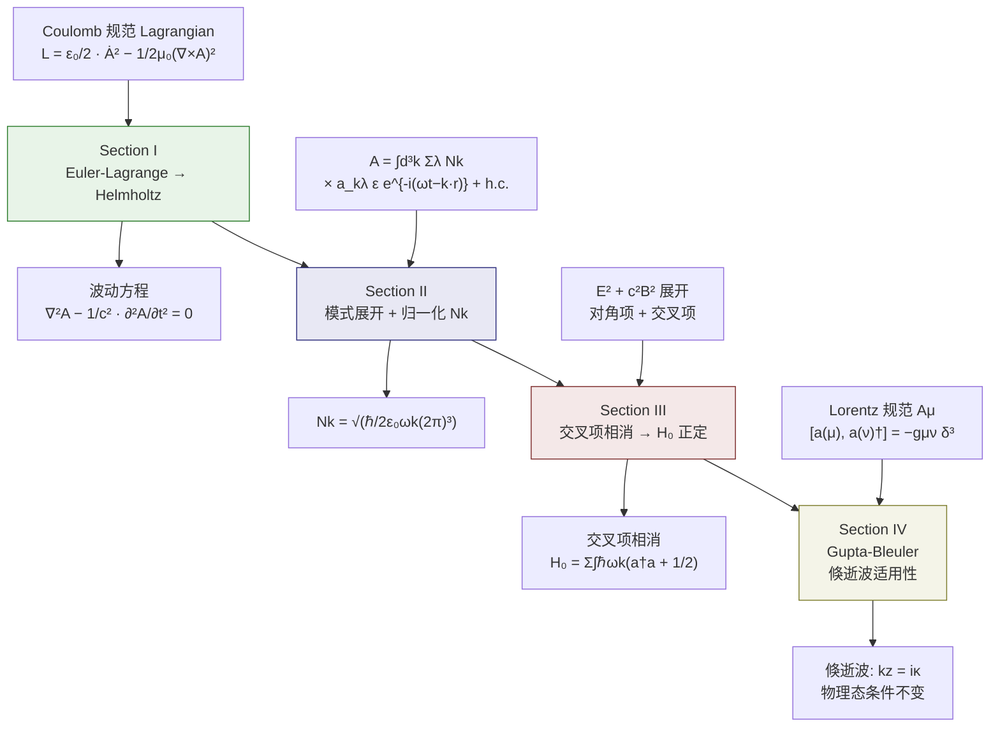

# 小孔量子化：场量子化推导（SM Sections I–IV）

> [!abstract] 物理直觉
> 自由电磁场的量子化分四步走：从 Coulomb 规范 Lagrangian 出发，经 Euler-Lagrange 方程得到波动方程；用平面波展开后通过正则对易关系定出归一化系数 $N_k$；验证 Hamiltonian 中交叉项精确相消以保证能量正定；最后用 Gupta-Bleuler 方法证明——即使在倏逝波区域，Lorentz 规范的物理态条件与 Coulomb 规范等价，为小孔近场的量子化提供坚实基础。

## 逻辑流总览

---

## Section 0：偶极子模型——物理出发点

### 这个推导在做什么

在量子化之前，先建立经典偶极辐射的物理图像。亚波长小孔（$a \ll \lambda_0$）的衍射场等效于一对位于原点的振荡偶极子，它们产生的矢量势满足含源亥姆霍兹方程。这一经典图像是后续量子化的物理出发点。

### 0.1 磁偶极矩与电偶极矩

小孔的等效偶极矩随时间简谐振荡：

$$\mathbf{M}(t) = \mathbf{M}_0 e^{-i\omega_0 t} + \text{c.c.}, \quad \mathbf{P}(t) = \mathbf{P}_0 e^{-i\omega_0 t} + \text{c.c.}$$

> [!tip] 偶极矩的物理来源
> - **磁偶极矩** $\mathbf{M}_0 = \frac{8}{3}a^3\mathbf{H}_0$：入射磁场在小孔边缘感应出环形电流。根据安培环路定律，闭合环流等效为磁偶极矩。大小正比于 $a^3$（体积效应）和入射磁场强度 $\mathbf{H}_0$。
> - **电偶极矩** $\mathbf{P}_0 = -\frac{4}{3}a^3\mathbf{E}_0$：入射电场在小孔两侧感应出正负电荷积累。大小正比于 $a^3$ 和入射电场强度 $\mathbf{E}_0$。负号来自 PEC 边界条件。
> - 两者之比 $|\mathbf{M}_0|/|\mathbf{P}_0| = 2|\mathbf{H}_0|/|\mathbf{E}_0|$，磁偶极矩在小孔透射中占主导。

### 0.2 含源亥姆霍兹方程

偶极子产生的矢量势 $\mathbf{A}(\mathbf{r},t)$ 满足经典亥姆霍兹波动方程：

$$\nabla^2\mathbf{A} - \frac{1}{c^2}\frac{\partial^2\mathbf{A}}{\partial t^2} = \mathbf{J} + \frac{\partial\mathbf{P}(t)}{\partial t}$$

其中 $\mathbf{J} = \nabla \times \mathbf{M}(t)$ 为磁化电流密度，$\frac{\partial\mathbf{P}}{\partial t}$ 为电极化电流密度。电磁场由下式给出：

$$\mathbf{E} = -\nabla\varphi - \frac{\partial\mathbf{A}}{\partial t}, \quad \mathbf{B} = \nabla \times \mathbf{A}$$

> [!important] 经典→量子的桥梁
> 经典理论中 $\mathbf{M}_0$ 和 $\mathbf{P}_0$ 是确定的数，$\mathbf{A}$ 是经典场。量子化将把 $\mathbf{A}$ 提升为算符 $\hat{\mathbf{A}}$，而偶极矩保持为经典参量（半经典近似）。量子化的核心目标：为含源的 $\mathbf{A}$ 建立算符描述，使得偶极辐射可以在量子力学框架中严格处理。

---

## Section I：Euler-Lagrange 方程 → 波动方程

### 这个推导在做什么

从电磁场的 Lagrangian 密度出发，通过经典分析力学的 Euler-Lagrange 方程，推导出自由空间中矢势 $\mathbf{A}$ 满足的波动方程。这一步确立了经典场方程，是量子化的出发点。

### I.1 Coulomb 规范下的 Lagrangian 密度

在 Coulomb 规范 $\nabla \cdot \mathbf{A} = 0$ 下，自由电磁场的 Lagrangian 密度为：

$$
\mathcal{L} = \frac{\varepsilon_0}{2}\dot{A}_j\dot{A}_j - \frac{1}{2\mu_0}(\nabla \times \mathbf{A})^2
$$

其中重复下标求和（Einstein 约定），广义坐标取为矢势的各个分量 $A_j$（$j = 1,2,3$）。

> [!tip] 物理含义
> - 第一项 $\frac{\varepsilon_0}{2}\dot{A}_j^2$ 是场的"动能"——对应电场能量 $\frac{\varepsilon_0}{2}|\mathbf{E}|^2$，因为 $\mathbf{E} = -\dot{\mathbf{A}}$（Coulomb 规范下 $\phi = 0$）。
> - 第二项 $\frac{1}{2\mu_0}(\nabla \times \mathbf{A})^2$ 是场的"势能"——对应磁场能量 $\frac{1}{2\mu_0}|\mathbf{B}|^2$。

### I.2 Euler-Lagrange 方程的三项

Euler-Lagrange 方程的一般形式为：

$$
\frac{\partial \mathcal{L}}{\partial A_j} - \frac{\partial}{\partial t}\frac{\partial \mathcal{L}}{\partial \dot{A}_j} - \frac{\partial}{\partial x_l}\frac{\partial \mathcal{L}}{\partial(\partial_l A_j)} = 0
$$

逐项分析：

**第 1 项：$\partial\mathcal{L}/\partial A_j$**

自由场情况下，$\mathbf{A}$ 不显式出现在 Lagrangian 中，因此：

$$
\frac{\partial \mathcal{L}}{\partial A_j} = 0
$$

> [!note] 有源情形的修正
> 当存在极化 $\mathbf{P}$ 和磁化 $\mathbf{M}$ 时，相互作用项使 $\partial\mathcal{L}/\partial A_j \neq 0$，贡献有效电流密度：
> $$\mathbf{J}_{\text{eff}} = \nabla \times \mathbf{M} + \varepsilon_0 \frac{\partial \mathbf{P}}{\partial t}$$
> 这直接联系到宏观 Maxwell 方程中的源项。

**第 2 项：时间导数部分**

$$
-\frac{\partial}{\partial t}\frac{\partial \mathcal{L}}{\partial \dot{A}_j} = -\frac{\partial}{\partial t}(\varepsilon_0 \dot{A}_j) = -\varepsilon_0 \ddot{A}_j
$$

这是惯性项，给出波动方程的时间二阶导数。

**第 3 项：空间导数部分（关键计算）**

磁场项 $(\nabla \times \mathbf{A})^2$ 写成分量形式：

$$
(\nabla \times \mathbf{A})^2 = \epsilon_{lmn}(\partial_l A_m)(\epsilon_{lpq}\partial_p A_q) = \epsilon_{lmn}\epsilon_{lpq}(\partial_l A_m)(\partial_p A_q)
$$

对 $A_j$ 求泛函导数：

$$
-\frac{\partial}{\partial x_l}\frac{\partial \mathcal{L}}{\partial(\partial_l A_j)} = -\frac{1}{2\mu_0}\frac{\partial}{\partial x_l}\left[-2\,\epsilon_{lmn}\epsilon_{lpq}\,\delta_{mj}\,\partial_p A_q\right]
$$

### I.3 Levi-Civita 收缩恒等式

这是整个推导的核心技巧。利用双重 Levi-Civita 符号的收缩：

$$
\epsilon_{lmn}\epsilon_{lpq} = \delta_{mp}\delta_{nq} - \delta_{mq}\delta_{np}
$$

> [!note] 收缩规则的记忆口诀
> - 一对下标收缩（这里是 $l$）→ 剩余 4 个自由下标，生成两个 Kronecker delta 的差。
> - 如果收缩两对下标 → $\epsilon_{lmn}\epsilon_{lmq} = 2\delta_{nq}$。
> - 如果收缩三对下标 → $\epsilon_{lmn}\epsilon_{lmn} = 6$。

代入收缩结果后：

$$
(\delta_{mp}\delta_{nq} - \delta_{mq}\delta_{np})\partial_p\partial_l(\delta_{mj} A_q) = \partial_n\partial_l A_q \cdot (\text{经指标替换})
$$

化简后得到空间导数项为：

$$
\frac{1}{\mu_0}\left[\nabla(\nabla \cdot \mathbf{A}) - \nabla^2 \mathbf{A}\right]
$$

> [!warning] 常见陷阱
> 容易漏掉 $\nabla(\nabla \cdot \mathbf{A})$ 这一项。它来自 $\delta_{mq}\delta_{np}$ 那个交叉项，不是简单的 Laplacian。只有利用 Coulomb 规范条件 $\nabla \cdot \mathbf{A} = 0$ 才能将其消去。

### I.4 波动方程

结合三项并利用 Coulomb 规范 $\nabla \cdot \mathbf{A} = 0$：

$$
0 - \varepsilon_0 \ddot{A}_j + \frac{1}{\mu_0}(-\nabla^2 A_j) = 0
$$

$$
\boxed{\nabla^2 \mathbf{A} - \frac{1}{c^2}\frac{\partial^2 \mathbf{A}}{\partial t^2} = 0}
$$

其中 $\mu_0 \varepsilon_0 = 1/c^2$。

> [!tip] 与主文方程的对应
> 这是 Supplemental Material 的 Eq. (S1)，对应正文中的波动方程。有源时右边加入 $-\mu_0 \mathbf{J}_{\text{eff}}$ 项。

---

## Section II：模式展开与归一化系数 $N_k$

### 这个推导在做什么

将经典场 $\mathbf{A}$ 按平面波模式展开，引入产生/湮灭算符 $a_{k\lambda}^\dagger$, $a_{k\lambda}$，然后通过正则对易关系 $[A_i, \Pi_j] = i\hbar\delta_{ij}^{\perp}$ 确定归一化系数 $N_k$。这一步完成了从经典场到量子场的过渡。

### II.1 模式展开

自由场的一般解可展开为平面波的叠加：

$$
\mathbf{A}(\mathbf{r}, t) = \int d^3k \sum_{\lambda=1}^{2} N_k \left[a_{k\lambda}\,\boldsymbol{\varepsilon}_{k\lambda}\,e^{-i(\omega_k t - \mathbf{k}\cdot\mathbf{r})} + a_{k\lambda}^\dagger\,\boldsymbol{\varepsilon}_{k\lambda}^*\,e^{+i(\omega_k t - \mathbf{k}\cdot\mathbf{r})}\right]
$$

其中：
- $N_k$：待定归一化系数（本节的目标就是求它）
- $a_{k\lambda}$, $a_{k\lambda}^\dagger$：湮灭和产生算符
- $\boldsymbol{\varepsilon}_{k\lambda}$：偏振矢量（$\lambda = 1, 2$，两个独立的横向偏振）
- $\omega_k = c|\mathbf{k}|$：色散关系

> [!note] 为什么只有两个偏振？
> Coulomb 规范 $\nabla \cdot \mathbf{A} = 0$ 要求 $\mathbf{k} \cdot \boldsymbol{\varepsilon}_{k\lambda} = 0$，即偏振必须垂直于传播方向。对于每个 $\mathbf{k}$，只有两个独立的横向自由度。

### II.2 共轭动量

正则共轭动量为：

$$
\boldsymbol{\Pi}(\mathbf{r}, t) = \frac{\partial \mathcal{L}}{\partial \dot{\mathbf{A}}} = -\varepsilon_0 \dot{\mathbf{A}} = \varepsilon_0 \mathbf{E}
$$

$$
\Pi_j = i\varepsilon_0 \int d^3k \sum_\lambda N_k\,\omega_k \left[-a_{k\lambda}\,\varepsilon_{k\lambda,j}\,e^{-i(\omega_k t - \mathbf{k}\cdot\mathbf{r})} + a_{k\lambda}^\dagger\,\varepsilon_{k\lambda,j}^*\,e^{+i(\omega_k t - \mathbf{k}\cdot\mathbf{r})}\right]
$$

注意 $\Pi_j$ 展开式前面多了一个因子 $i\omega_k$（来自对时间的导数），并且正负号与 $\mathbf{A}$ 的展开相反。

### II.3 正则对易关系

量子化的核心假设是等时对易关系：

$$
[A_i(\mathbf{r}), \Pi_j(\mathbf{r}')] = i\hbar\,\delta_{ij}^{\perp}(\mathbf{r} - \mathbf{r}')
$$

其中 $\delta_{ij}^{\perp}$ 是**横向 delta 函数**（见下文）。

### II.4 对易关系的展开

将 $\mathbf{A}$ 和 $\boldsymbol{\Pi}$ 的展开式代入对易关系，左边会产生 4 种类型的对易子：

$$
[a_{k\lambda}, a_{k'\lambda'}^\dagger], \quad [a_{k\lambda}^\dagger, a_{k'\lambda'}], \quad [a_{k\lambda}, a_{k'\lambda'}], \quad [a_{k\lambda}^\dagger, a_{k'\lambda'}^\dagger]
$$

利用 Bose 子对易关系：

$$
[a_{k\lambda}, a_{k'\lambda'}^\dagger] = \delta_{\lambda\lambda'}\,\delta^{(3)}(\mathbf{k} - \mathbf{k}')
$$

交叉项 $[a, a]$ 和 $[a^\dagger, a^\dagger]$ 为零。展开后，只有 $[a, a^\dagger]$ 和 $[a^\dagger, a]$ 两类对易子有贡献。

### II.5 偏振求和 → 横向 delta 函数

关键的一步是对偏振指标求和：

$$
\sum_{\lambda=1}^{2} \varepsilon_{k\lambda,i}\,\varepsilon_{k\lambda,j}^* = \delta_{ij}^{\perp}(\hat{\mathbf{k}}) \equiv \delta_{ij} - \frac{k_i k_j}{|\mathbf{k}|^2}
$$

> [!tip] 横向 delta 函数的物理含义
> $\delta_{ij}^{\perp}(\hat{\mathbf{k}})$ 是一个投影算符——它将任意矢量投影到垂直于 $\mathbf{k}$ 的平面上。这正是 Coulomb 规范 $\mathbf{k} \cdot \mathbf{A} = 0$ 的数学体现：只有横向分量是动力学自由度。

### II.6 匹配确定 $N_k$

对易关系左边化简后为：

$$
[A_i, \Pi_j] = 2\varepsilon_0 N_k^2 \int d^3k\,\omega_k\,\delta_{ij}^{\perp}(\hat{\mathbf{k}})\,\delta^{(3)}(\mathbf{k} - \mathbf{k}')
$$

右边是：

$$
i\hbar\,\delta_{ij}^{\perp}(\mathbf{r} - \mathbf{r}') = i\hbar \int \frac{d^3k}{(2\pi)^3}\left(\delta_{ij} - \frac{k_i k_j}{|\mathbf{k}|^2}\right)e^{i\mathbf{k}\cdot(\mathbf{r}-\mathbf{r}')}
$$

两边对比，注意 $\delta^{(3)}(\mathbf{k} - \mathbf{k}')$ 与 $\frac{1}{(2\pi)^3}$ 的 Fourier 变换关系，得到：

$$
2\varepsilon_0 N_k^2\,\omega_k = \frac{\hbar}{(2\pi)^3}
$$

解出归一化系数：

$$
\boxed{N_k = \sqrt{\frac{\hbar}{2\varepsilon_0\omega_k(2\pi)^3}}}
$$

> [!warning] 常见陷阱：$(2\pi)^3$ 因子
> 不同教科书对平面波的 Fourier 约定不同（是否把 $(2\pi)^3$ 放在波函数或 delta 函数中），会导致 $N_k$ 表达式差一个 $(2\pi)^{3/2}$ 因子。本推导采用 $\mathbf{A} \propto e^{i\mathbf{k}\cdot\mathbf{r}}$ 不带 $1/(2\pi)^{3/2}$ 的约定。

---

## Section III：Hamiltonian 中交叉项的相消

### 这个推导在做什么

验证量子化后的自由场 Hamiltonian $H_0$ 确实具有谐振子求和的形式。关键在于证明 $\mathbf{E}^2$ 和 $c^2\mathbf{B}^2$ 展开中的交叉项（$aa$ 型和 $a^\dagger a^\dagger$ 型）在空间积分后精确相消，保证能量正定。

### III.1 Hamiltonian 的结构

$$
H_0 = \frac{1}{2}\int d^3r \left[\varepsilon_0 |\mathbf{E}|^2 + \frac{1}{\mu_0}|\mathbf{B}|^2\right] = \frac{\varepsilon_0}{2}\int d^3r \left[|\mathbf{E}|^2 + c^2|\mathbf{B}|^2\right]
$$

将 $\mathbf{E}$ 和 $\mathbf{B}$ 用模式展开后代入，每一项都包含：

$$
|\mathbf{E}|^2 \sim |a_{k\lambda} e^{i\mathbf{k}\cdot\mathbf{r}} + a_{k\lambda}^\dagger e^{-i\mathbf{k}\cdot\mathbf{r}}|^2
$$

展开后产生**四类项**：

| 项的类型 | 算符结构 | 物理含义 |
|---------|---------|---------|
| 对角项 | $a_{k\lambda}^\dagger a_{k'\lambda'}$ | 光子数算符，正定 |
| 对角项 | $a_{k\lambda} a_{k'\lambda'}^\dagger$ | 光子数算符，经对易关系后也是正定的 |
| 交叉项 | $a_{k\lambda} a_{k'\lambda'}\,e^{-2i\omega t}$ | 双光子产生，频率 $2\omega$ |
| 交叉项 | $a_{k\lambda}^\dagger a_{k'\lambda'}^\dagger\,e^{+2i\omega t}$ | 双光子湮灭，频率 $2\omega$ |

### III.2 空间积分 → $\delta^{(3)}(\mathbf{k} + \mathbf{k}')$

交叉项的空间积分产生：

$$
\int d^3r\,e^{i(\mathbf{k} + \mathbf{k}')\cdot\mathbf{r}} = (2\pi)^3\,\delta^{(3)}(\mathbf{k} + \mathbf{k}')
$$

这意味着 $\mathbf{k}' = -\mathbf{k}$。

> [!note] 为什么是 $\mathbf{k}' = -\mathbf{k}$ 而不是 $\mathbf{k}' = \mathbf{k}$？
> 交叉项中两个 $a$（或两个 $a^\dagger$）的指数因子分别是 $e^{i\mathbf{k}\cdot\mathbf{r}}$ 和 $e^{i\mathbf{k}'\cdot\mathbf{r}}$，相乘后得到 $e^{i(\mathbf{k}+\mathbf{k}')\cdot\mathbf{r}}$。空间积分要求 $\mathbf{k} + \mathbf{k}' = 0$，即动量守恒的"反向匹配"。

### III.3 电场与磁场的交叉项对比

**电场 $\mathbf{E}$ 的交叉项：**

$$
\mathbf{E}_{\text{cross}} \propto N_k^2\sum_{\lambda\lambda'}\omega_k^2\,\boldsymbol{\varepsilon}_{k\lambda}\boldsymbol{\varepsilon}_{k'\lambda'}\,a_{k\lambda}a_{k'\lambda'}\,e^{-2i\omega_k t}
$$

当 $\mathbf{k}' = -\mathbf{k}$ 时，偏振矢量的行为：

$$
\boldsymbol{\varepsilon}_{-\mathbf{k},\lambda'} = \boldsymbol{\varepsilon}_{\mathbf{k},\lambda'}^*
$$

因此 $\mathbf{E}$ 的交叉项振幅正比于 $\omega_k^2 \boldsymbol{\varepsilon}\boldsymbol{\varepsilon}^*$。

**磁场 $\mathbf{B} = \nabla \times \mathbf{A}$ 的交叉项：**

关键区别在于 $\mathbf{B}$ 多了一个 $\mathbf{k} \times \boldsymbol{\varepsilon}$ 因子：

$$
\mathbf{B} \propto N_k \sum_\lambda (\mathbf{k} \times \boldsymbol{\varepsilon}_{k\lambda})\,a_{k\lambda}\,e^{i\mathbf{k}\cdot\mathbf{r}} + \text{h.c.}
$$

当 $\mathbf{k}' = -\mathbf{k}$ 时：

$$
(-\mathbf{k}) \times \boldsymbol{\varepsilon}_{-\mathbf{k},\lambda'} = -\mathbf{k} \times \boldsymbol{\varepsilon}_{\mathbf{k},\lambda'}^*
$$

多了一个**负号**。

### III.4 精确相消

将 $|\mathbf{E}|^2 + c^2|\mathbf{B}|^2$ 中的交叉项单独取出：

$$
\mathbf{E}^2\text{ 交叉项} \propto +\omega_k^2\,\sum_{\lambda\lambda'}(\boldsymbol{\varepsilon}_{\lambda}\cdot\boldsymbol{\varepsilon}_{\lambda'}^*)\,a_{k\lambda}a_{-k,\lambda'}\,e^{-2i\omega_k t}
$$

$$
c^2\mathbf{B}^2\text{ 交叉项} \propto -c^2|\mathbf{k}|^2\,\sum_{\lambda\lambda'}[(\hat{\mathbf{k}}\times\boldsymbol{\varepsilon}_{\lambda})\cdot(\hat{\mathbf{k}}\times\boldsymbol{\varepsilon}_{\lambda'}^*)]\,a_{k\lambda}a_{-k,\lambda'}\,e^{-2i\omega_k t}
$$

利用色散关系 $\omega_k = c|\mathbf{k}|$（即 $\omega_k^2 = c^2|\mathbf{k}|^2$）以及矢量恒等式：

$$
(\hat{\mathbf{k}} \times \boldsymbol{\varepsilon}_\lambda) \cdot (\hat{\mathbf{k}} \times \boldsymbol{\varepsilon}_{\lambda'}^*) = \boldsymbol{\varepsilon}_\lambda \cdot \boldsymbol{\varepsilon}_{\lambda'}^*
$$

（因为 $\boldsymbol{\varepsilon} \perp \hat{\mathbf{k}}$），两交叉项等大反号，**精确相消**：

$$
\mathbf{E}^2_{\text{cross}} + c^2\mathbf{B}^2_{\text{cross}} = 0
$$

> [!tip] 为什么必须相消？——物理直觉
> 如果交叉项不消去，Hamiltonian 中会包含 $aa$ 和 $a^\dagger a^\dagger$ 项，它们随时间以频率 $2\omega$ 振荡，这意味着能量不守恒。对于自由场，能量守恒是根本要求。交叉项相消是 Lorentz 不变性（自由场的时空对称性）在量子化中的直接体现。

### III.5 最终结果

只有对角项存活，经过对易关系 $[a, a^\dagger] = 1$ 处理后：

$$
\boxed{H_0 = \sum_\lambda \int d^3k\;\hbar\omega_k\left(a_{k\lambda}^\dagger a_{k\lambda} + \frac{1}{2}\right)}
$$

这是无穷多个独立谐振子的总和，每个模式 $(k, \lambda)$ 对应一个量子谐振子，零点能为 $\frac{1}{2}\hbar\omega_k$。

> [!warning] 零点能的发散
> 严格来说 $\sum_k \frac{1}{2}\hbar\omega_k$ 是紫外发散的。在实际计算中（Casimir 效应、Lamb 移动等），只有能量差才有物理意义，零点能可以通过正规化 (normal ordering) 消去。但在小孔量子化问题中，倏逝模式的零点能修正可能导致可观测效应——这正是本文的核心物理之一。详见 [[02_微扰与经典回归]]。

---

## Section IV：Gupta-Bleuler 方法与倏逝模式

### 这个推导在做什么

自由空间中 Coulomb 规范的量子化已经完成（Sections I–III）。但在小孔衍射问题中，近场区域存在倏逝波 (evanescent waves)，其波矢出现虚分量 $k_z = i\kappa$。本节证明：使用 Gupta-Bleuler 方法的 Lorentz 规范量子化，在倏逝波区域同样适用，且物理态条件与 Coulomb 规范等价。

### IV.1 为什么需要 Lorentz 规范？

Coulomb 规范 $\nabla \cdot \mathbf{A} = 0$ 在自由空间很好用，但它破坏了明显的 Lorentz 协变性。更重要的是，在倏逝波区域：

- 波矢 $\mathbf{k}$ 的 $z$ 分量变为虚数：$k_z = i\kappa$
- "横向" 条件 $\mathbf{k} \cdot \boldsymbol{\varepsilon} = 0$ 的含义变得模糊
- 需要一个协变的量子化方案来保证结果的正确性

Lorentz 规范 $\partial_\mu A^\mu = 0$ 是协变的，适用于所有参考系和所有模式的波矢。

### IV.2 洛伦兹规范条件与协变波动方程

库仑规范选取 $\nabla \cdot \mathbf{A} = 0$，将矢量势限制在横向自由度，但**破坏了明显的洛伦兹协变性**。洛伦兹规范通过引入协变标量条件消除这一不足：

$$
\partial_\mu A^\mu \equiv \frac{1}{c^2}\frac{\partial\phi}{\partial t} + \nabla \cdot \mathbf{A} = 0
$$

此条件在洛伦兹变换下保持不变，是协变标量方程。引入四维矢量势 $A^\mu = (\phi/c, \mathbf{A})$，闵可夫斯基度规 $(+,-,-,-)$，Maxwell 张量 $F_{\mu\nu} = \partial_\mu A_\nu - \partial_\nu A_\mu$。四个分量满足统一的协变达朗贝尔方程：

$$
\square A^\mu \equiv \left(\frac{1}{c^2}\frac{\partial^2}{\partial t^2} - \nabla^2\right)A^\mu = \mu_0 J^\mu
$$

### IV.3 费米拉格朗日量与正则量子化

洛伦兹规范下，电磁场的**费米拉格朗日量**密度为：

$$
\mathcal{L}_F = -\frac{1}{4\mu_0}F_{\mu\nu}F^{\mu\nu} - \frac{1}{2\mu_0}(\partial_\mu A^\mu)^2
$$

> [!tip] 第二项的作用
> 第一项 $-\frac{1}{4\mu_0}F_{\mu\nu}F^{\mu\nu}$ 是标准 Maxwell 拉格朗日量。第二项 $-\frac{1}{2\mu_0}(\partial_\mu A^\mu)^2$ 是**规范固定项**，它使 Euler-Lagrange 方程直接给出达朗贝尔方程 $\square A^\mu = 0$（而非一般的 $\square A^\mu - \partial^\mu(\partial_\nu A^\nu) = 0$）。

对 $\mathcal{L}_F$ 应用 Euler-Lagrange 方程，计算正则共轭动量 $\Pi^\mu = \frac{\partial\mathcal{L}_F}{\partial(\partial_0 A_\mu)}$：

**时间分量**：

$$
\Pi^0 = \frac{\partial\mathcal{L}_F}{\partial(\partial_0 A_0)} = -\epsilon_0\,\partial_0 A^0
$$

**空间分量**：

$$
\Pi^i = \epsilon_0(\partial^i A^0 - \partial^0 A^i) = \epsilon_0 E^i
$$

> [!warning] 与库仑规范的关键区别
> 库仑规范中 $\Pi^0 = 0$（时间分量无独立自由度）。而洛伦兹规范中 $\Pi^0 \neq 0$，四个分量地位平等，代价是引入非物理极化自由度（标量光子和纵向光子）。

### IV.4 四分量模展开与协变对易关系

对每一波矢 $\mathbf{k}$，定义四组正交极化四矢量 $\varepsilon_{(\lambda)}^\mu$（$\lambda = 0,1,2,3$）：

| $\lambda$ | 极化类型 | 物理含义 |
|-----------|---------|---------|
| 0 | 类时（标量极化） | 非物理，负模态 |
| 1, 2 | 横向极化 | 物理光子 |
| 3 | 纵向极化（沿 $\hat{\mathbf{k}}$） | 非物理，与标量光子配对 |

完备正交关系：$\sum_\lambda g^{\lambda\lambda}\varepsilon_{(\lambda)}^\mu\varepsilon_{(\lambda)}^\nu = g^{\mu\nu}$。

自由场算符的四分量模展开为：

$$
\hat{A}^\mu(\mathbf{r},t) = \int d^3k \sum_{\lambda=0}^{3} N_k \left[\varepsilon_{(\lambda)}^\mu\,\hat{a}_{(\lambda)}(\mathbf{k})\,e^{-i(\omega_k t - \mathbf{k}\cdot\mathbf{r})} + \text{h.c.}\right]
$$

归一化系数 $N_k = \sqrt{\hbar/(2\epsilon_0\omega_k(2\pi)^3)}$ 与库仑规范相同。对 $\hat{A}_\mu$ 和 $\hat{\Pi}_\nu$ 实施正则量子化，协变等时对易关系为：

$$
[\hat{A}_\mu(\mathbf{r},t), \hat{\Pi}_\nu(\mathbf{r}',t)] = i\hbar\,g_{\mu\nu}\,\delta^{(3)}(\mathbf{r}-\mathbf{r}')
$$

由此产生湮灭/产生算符的对易关系：

$$
[\hat{a}_{(\lambda)}(\mathbf{k}), \hat{a}_{(\lambda')}^\dagger(\mathbf{k}')] = -g_{\lambda\lambda'}\,\delta^{(3)}(\mathbf{k}-\mathbf{k}')
$$

> [!warning] 负模问题
> 当 $\lambda = \lambda' = 0$（标量光子）时，$g_{00} = +1$，所以 $[\hat{a}_{(0)}, \hat{a}_{(0)}^\dagger] = -\delta^{(3)}$。这意味着标量光子的产生算符生成**负范数态** $\|\hat{a}_{(0)}^\dagger|0\rangle\|^2 < 0$，在物理上不可接受——需要 Gupta-Bleuler 方法解决。

### IV.5 Gupta-Bleuler 量子化

Gupta 和 Bleuler 提出：将算符 $\partial_\mu\hat{A}^\mu$ 分解为正频部分（含湮灭算符）和负频部分，**弱洛伦兹条件**定义为正频部分湮灭物理态：

$$
\partial_\mu\hat{A}^{\mu(+)}|\text{phys}\rangle = 0
$$

在动量空间中，等价于标量与纵向湮灭算符的组合湮灭物理态：

$$
[\hat{a}_{(0)}(\mathbf{k}) - \hat{a}_{(3)}(\mathbf{k})]|\text{phys}\rangle = 0 \quad (\forall \mathbf{k})
$$

物理 Hilbert 空间的关键性质：
1. **正半定性**：任意物理态范数 $\langle\text{phys}|\text{phys}\rangle \geq 0$
2. 标量与纵向光子**成对出现**且数目相等
3. 纯横向 Fock 态（即库仑规范态）自动满足此条件

### IV.6 E 和 B 场算符的规范不变性

电场和磁场均由规范不变量 $F_{\mu\nu}$ 决定：$E^i = -cF^{0i}$，$B^i = \frac{1}{2}\epsilon^{ijk}F_{jk}$。

**磁场算符**：标量光子贡献 $\mathbf{k}\times\varepsilon_{(0)} = 0$（类时矢量与 $\mathbf{k}$ 叉乘为零），纵向光子贡献 $\mathbf{k}\times\hat{\mathbf{k}} = 0$（叉乘自身为零）。因此**磁场算符仅含横向模式**。

**电场算符**：Gupta-Bleuler 条件保证标量与纵向贡献在物理矩阵元之间**精确抵消**。因此洛伦兹规范中物理态间的电场算符期望值与库仑规范完全一致：

$$
\hat{\mathbf{E}}_{\text{phys}}^{(+)} = i\int d^3k \sum_{\lambda=1,2}\omega_k N_k\,\varepsilon_{(\lambda)}\,\hat{a}_{(\lambda)}(\mathbf{k})\,e^{i(\mathbf{k}\cdot\mathbf{r}-\omega_k t)}
$$

哈密顿量在物理态上简化为：

$$
\hat{H}\big|_{\mathcal{H}_{\text{phys}}} = \int d^3k\,\hbar\omega_k \sum_{\lambda=1,2}\hat{a}_{(\lambda)}^\dagger(\mathbf{k})\hat{a}_{(\lambda)}(\mathbf{k})
$$

> [!success] 核心结论
> 在物理 Hilbert 空间上，洛伦兹规范量子化与库仑规范**完全等价**——真实的物理态仅有横向极化光子参与贡献。规范不变性证明是本文理论框架严格性的基石。

### IV.7 倏逝波的物理态条件

将倏逝波的 $k^\mu = (\omega/c, k_x, k_y, i\kappa)$ 代入 Gupta-Bleuler 条件，利用色散关系 $k_0 = \omega/c = \sqrt{k_\perp^2 - \kappa^2}$，有效纵向波数恰好等于时间分量。横向极化 $\lambda = 1,2$ 的贡献自动为零（$\mathbf{k}\cdot\varepsilon = 0$），剩余标量与纵向部分：

$$
\left[\frac{\omega}{c}\hat{a}^{(0)}(\mathbf{k}) - \sqrt{k_\perp^2 - \kappa^2}\,\hat{a}^{(3)}(\mathbf{k})\right]|\text{phys}\rangle = 0
$$

两个系数相等（$= k_0$），因此：

$$
\boxed{\left(\hat{a}^{(0)} - \hat{a}^{(3)}\right)|\text{phys}\rangle = 0}
$$

> [!success] 核心结论
> 倏逝波的 Gupta-Bleuler 条件与传播波**形式完全一致**——标量与纵向光子配对抵消，物理态仅有横向自由度。这意味着库仑规范在倏逝波区域同样安全可用，不需要额外修正。

### IV.8 对小孔量子化的意义

> [!note] 与 [[02_微扰与经典回归]] 的衔接
> 有了 Section IV 的保证，我们可以在 Coulomb 规范下统一处理传播波和倏逝波的量子化，然后在 [[02_微扰与经典回归]] 中引入介质（小孔边界）作为微扰，计算量子修正和经典极限的回归。

---

## 公式速查表

| 公式 | 编号 | 用途 |
|------|------|------|
| $\mathbf{M}_0 = \frac{8}{3}a^3\mathbf{H}_0,\;\mathbf{P}_0 = -\frac{4}{3}a^3\mathbf{E}_0$ | (D) | Bethe 等效偶极矩 |
| $\nabla^2\mathbf{A} - c^{-2}\partial_t^2\mathbf{A} = \nabla\times\mathbf{M} + \dot{\mathbf{P}}$ | (H) | 含源亥姆霍兹方程 |
| $\mathcal{L} = \frac{\varepsilon_0}{2}\dot{A}_j\dot{A}_j - \frac{1}{2\mu_0}(\nabla\times\mathbf{A})^2$ | (S-L) | Coulomb 规范 Lagrangian |
| $\epsilon_{lmn}\epsilon_{lpq} = \delta_{mp}\delta_{nq} - \delta_{mq}\delta_{np}$ | (S-ε) | Levi-Civita 收缩恒等式 |
| $\sum_\lambda \varepsilon_{k\lambda,i}\varepsilon_{k\lambda,j}^* = \delta_{ij} - k_ik_j/\|\mathbf{k}\|^2$ | (S-δ⊥) | 横向 delta 函数 |
| $N_k = \sqrt{\hbar/(2\varepsilon_0\omega_k(2\pi)^3)}$ | (S-N) | 归一化系数 |
| $H_0 = \sum_\lambda\int d^3k\;\hbar\omega_k(a_{k\lambda}^\dagger a_{k\lambda} + \tfrac{1}{2})$ | (S-H) | 自由场 Hamiltonian |
| $\mathcal{L}_F = -\frac{1}{4\mu_0}F_{\mu\nu}F^{\mu\nu} - \frac{1}{2\mu_0}(\partial_\mu A^\mu)^2$ | (F-L) | 费米 Lagrangian |
| $(\hat{a}^{(0)} - \hat{a}^{(3)})\|\text{phys}\rangle = 0$ | (S-GB) | Gupta-Bleuler 条件（含倏逝波） |

---

## 参考文献

- Cohen-Tannoudji, C., Dupont-Roc, J., & Grynberg, G. *Photons and Atoms: Introduction to Quantum Electrodynamics* (Wiley, 1997), Chapters I–III. — Coulomb 规范量子化的标准参考。
- Gupta, S. N. "Theory of Longitudinal Photons in Quantum Electrodynamics." *Proc. Phys. Soc. A* **63**, 681 (1950). — Gupta-Bleuler 方法的原始文献。
- Bleuler, K. "Eine neue Methode zur Behandlung der longitudinalen und skalaren Photonen." *Helv. Phys. Acta* **23**, 567 (1950). — 独立提出同一方法。
- Milonni, P. W. *The Quantum Vacuum: An Introduction to Quantum Electrodynamics* (Academic Press, 1994). — 零点能与正规化的详细讨论。
- Berman, P. R. & Malinovsky, V. S. *Principles of Laser Spectroscopy and Quantum Optics* (Wiley, 2011). — 模式展开与归一化的清晰推导。

> [!note] 与本文的关系
> 以上教科书处理的是自由空间传播波的量子化。本文 Supplemental Material 的贡献在于将 Gupta-Bleuler 方法推广到倏逝波区域（Section IV），证明 Coulomb 规范在小孔近场中的适用性——这在标准教科书中通常不涉及。
