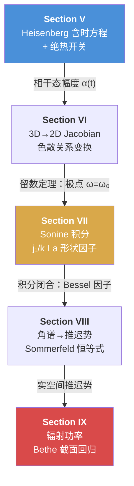
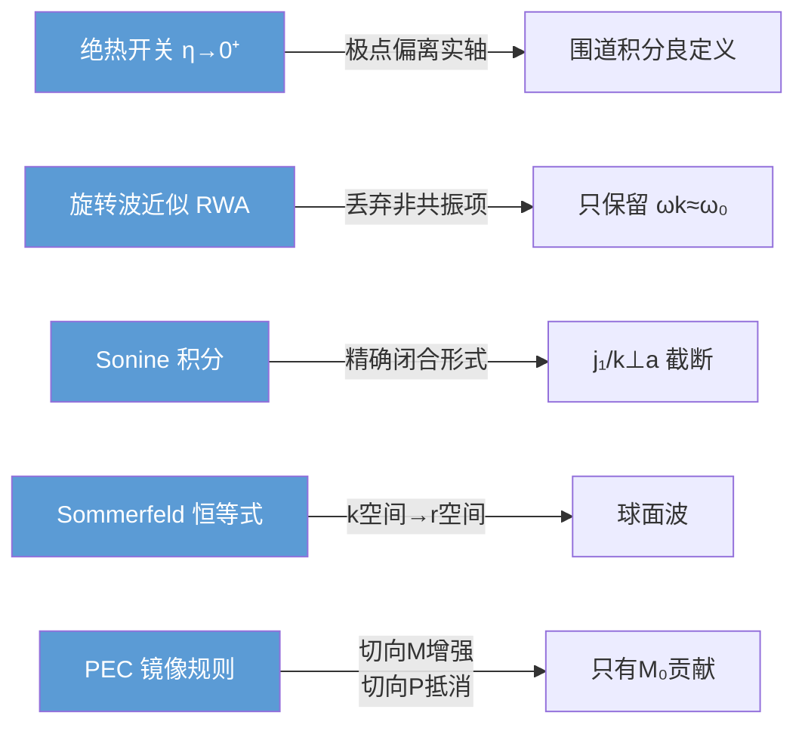

# 小孔量子化：微扰动力学与经典回归

> [!abstract] 核心直觉
> 从量子 Heisenberg 方程出发，通过含时微扰积分得到相干态幅度；经 3D→2D Jacobian 变换和 Sonine 积分提取 j₁(k⊥a)/(k⊥a) 形状因子；最终由 Sommerfeld 恒等式回到实空间，发现量子辐射场精确回归 Bethe 经典截面——这是量子-经典对应最优雅的例证之一。

## 推导路线总览

> [!tip] 路线逻辑
> Section V 给出量子算符的时间演化 → VI-VII 将 k 积分从 3D 降到 2D 并引入孔径形状因子 → VIII 完成从 k 空间到 r 空间的变换 → IX 验证结果与经典 Bethe 理论完全一致。

---

## 一、Section V：Heisenberg 含时方程与绝热开关

### 1.1 总 Hamiltonian

系统的总 Hamiltonian 为自由场部分与相互作用部分之和：

$$
H = H_0 + H_{\text{int}}
$$

其中自由场 $H_0$ 给出平面波本征模：

$$
H_0 = \sum_{\mathbf{k},\lambda} \hbar\omega_k \hat{a}^\dagger_{\mathbf{k}\lambda}\hat{a}_{\mathbf{k}\lambda}
$$

相互作用部分为小孔处的偶极耦合：

$$
H_{\text{int}} = -\mathbf{M} \cdot \mathbf{B}(\mathbf{r}=0) - \mathbf{P} \cdot \mathbf{E}(\mathbf{r}=0)
$$

### 1.2 自由演化部分

对湮灭算符 $\hat{a}_{\mathbf{k}\lambda}$ 取 Heisenberg 方程：

$$
i\hbar\frac{d}{dt}\hat{a} = [\hat{a}, H_0] + [\hat{a}, H_{\text{int}}]
$$

自由部分给出相因子演化：

$$
[\hat{a}_{\mathbf{k}\lambda}, H_0] = \hbar\omega_k\,\hat{a}_{\mathbf{k}\lambda}
$$

即自由演化 $\hat{a}(t) \propto e^{-i\omega_k t}$，物理含义是每个模式独立振荡。

### 1.3 相互作用部分

利用对易关系 $[\hat{a}, \hat{a}^\dagger] = 1$，相互作用对易子产生含时驱动项：

$$
[\hat{a}_{\mathbf{k}\lambda}, H_{\text{int}}] = V^* e^{i\omega_0 t} + V\,e^{-i\omega_0 t}
$$

其中 $\omega_0$ 是小孔偶极矩的本征频率，$V$ 是耦合矩阵元（包含偶极矩大小与场归一化因子）。

> [!tip] 物理图像
> 偶极矩以频率 $\omega_0$ 振荡，通过 $V$ 耦合到每个场模式 $\mathbf{k}\lambda$。Heisenberg 方程变成了一个**受迫谐振子**：模式 $\hat{a}_k$ 被频率 $\omega_0$ 的"外力"驱动。

### 1.4 含时微扰积分

完整的 Heisenberg 方程：

$$
\frac{d}{dt}\hat{a}_{\mathbf{k}\lambda}(t) = -i\omega_k\,\hat{a}_{\mathbf{k}\lambda}(t) - \frac{i}{\hbar}\left[V^* e^{i\omega_0 t} + V\,e^{-i\omega_0 t}\right]
$$

引入**积分因子** $e^{i\omega_k t}$ 消除自由演化：

$$
\frac{d}{dt}\left[\hat{a}_{\mathbf{k}\lambda}(t)\,e^{i\omega_k t}\right] = -\frac{i}{\hbar}\left[V^* e^{i(\omega_k+\omega_0)t} + V\,e^{i(\omega_k-\omega_0)t}\right]
$$

从 $t'=-\infty$ 积分到 $t' = t$，并引入**绝热开关** $e^{\eta t'}$（$\eta \to 0^+$）确保积分收敛：

$$
\hat{a}_{\mathbf{k}\lambda}(t)\,e^{i\omega_k t} = -\frac{i}{\hbar}\int_{-\infty}^{t} dt'\left[V^* e^{i(\omega_k+\omega_0+i\eta)t'} + V\,e^{i(\omega_k-\omega_0+i\eta)t'}\right]
$$

> [!warning] 绝热开关 $\eta \to 0^+$ 的作用
> $\eta > 0$ 使 $t'\to -\infty$ 时积分为零（良定义）。更重要的是，它将极点从实轴移开：
> $$\frac{1}{\omega_k - \omega_0 - i\eta}$$
> 极点在 $\omega_k = \omega_0 + i\eta$（下半平面），使得 Cauchy 留数定理可以直接使用。这是量子场论中 $i\epsilon$ prescription 的同一思想。

### 1.5 共振与非共振项

对两项分别积分：

**非共振项**（$\omega_k + \omega_0$）：

$$
\int_{-\infty}^{t} dt'\,e^{i(\omega_k+\omega_0+i\eta)t'} = \frac{e^{i(\omega_k+\omega_0+i\eta)t}}{i(\omega_k+\omega_0+i\eta)}
$$

由于 $\omega_k + \omega_0 \gg 0$，这个因子在 $\eta \to 0$ 时快速振荡，其贡献在物理上代表**非共振虚过程**，平均后趋于零。

**共振项**（$\omega_k - \omega_0$）：

$$
\int_{-\infty}^{t} dt'\,e^{i(\omega_k-\omega_0+i\eta)t'} = \frac{e^{i(\omega_k-\omega_0+i\eta)t}}{i(\omega_k-\omega_0+i\eta)}
$$

这正是旋转波近似（RWA）保留的项。最终：

$$
\boxed{\hat{a}_{\mathbf{k}\lambda}(t) = -\frac{V}{\hbar}\,\frac{e^{-i\omega_0 t}}{\omega_k - \omega_0 - i\eta}}
$$

### 1.6 Sokhotski-Plemelj 公式

取 $\eta \to 0^+$ 极限，关键的数学恒等式：

$$
\frac{1}{\omega_k - \omega_0 - i\eta} = \mathcal{P}\frac{1}{\omega_k - \omega_0} + i\pi\,\delta(\omega_k - \omega_0)
$$

- **主值部分** $\mathcal{P}$：贡献能级移动（Lamb shift 类效应）
- **$\delta$ 函数部分**：贡献能量守恒的实辐射过程

> [!tip] 物理含义
> $\delta(\omega_k - \omega_0)$ 确保只有**频率匹配**的模式被激发——这就是共振条件。在相干态图像中，只有 $\omega_k = \omega_0$ 的模式获得非零幅度，构成辐射场的频率选择机制。[[cite:@Glauber1963]]

---

## 二、Section VI：3D→2D Jacobian 映射

### 2.1 矢量势期望值

在相干态 $|\{\alpha_{\mathbf{k}\lambda}\}\rangle$ 下，矢量势算符的期望值为：

$$
\langle \hat{\mathbf{A}} \rangle = \int d^3k\,\alpha_{3D}(\mathbf{k},\lambda)\,N_k\,\boldsymbol{\varepsilon}_{\mathbf{k}\lambda}\,e^{-i(\omega t - \mathbf{k}\cdot\mathbf{r})}
$$

其中 $N_k = \sqrt{\hbar/(2\varepsilon_0\omega_k(2\pi)^3)}$ 是归一化因子，$\alpha_{3D}$ 是三维相干态幅度。

### 2.2 色散关系与 Jacobian

电磁场色散关系 $\omega = c|\mathbf{k}| = c\sqrt{k_\perp^2 + k_z^2}$。对频率积分时需要 Jacobian 变换：

$$
d^3k = k_\perp\,dk_\perp\,d\phi\,dk_z
$$

固定 $k_\perp$，将 $k_z$ 换为 $\omega$：

$$
\omega^2 = c^2(k_\perp^2 + k_z^2) \implies 2\omega\,d\omega = 2c^2 k_z\,dk_z
$$

$$
\boxed{dk_z = \frac{\omega}{c^2 k_z}\,d\omega}
$$

### 2.3 留数定理与 2D 约化

对 $\omega$ 的积分中，被积函数在 $\omega = \omega_0$ 处有极点（来自 Section V 的分母）。在下半平面闭合围道：

$$
\oint \frac{f(\omega)}{\omega - \omega_0 - i\eta}\,d\omega = -2\pi i\,\text{Res}[\omega = \omega_0]
$$

留数贡献给出系数：

$$
\boxed{C_{\text{res}} = -\frac{2\pi i\,\omega_0\,N_k}{\hbar c^2 k_z}}
$$

三维积分 $\int d^3k$ 成功约化为二维角谱积分 $\int d^2k_\perp$。

> [!tip] 为什么是下半平面闭合？
> 时间因子 $e^{-i\omega t}$（$t > 0$）要求在上半平面衰减。但我们的极点 $\omega_0 + i\eta$ 在上半平面 $\to$ 需要从下方绕过 $\to$ 下半平面闭合时极点在围道外，贡献为零。正确做法：围道从实轴上方闭合时包含极点，留数带负号（顺时针）。
>
> 关键：$i\eta$ 的符号决定了围道的选取和最终结果的符号，是推导中容易出错的地方。

---

## 三、Section VII：Sonine 积分与球 Bessel 形状因子

### 3.1 Bethe 电流分布的 Fourier 变换

Bethe 假设小孔内的等效电流分布为：

$$
m(\rho) \propto \sqrt{1 - (\rho/a)^2}, \quad \rho < a
$$

这是圆孔衍射问题的经典假设，对应薄膜中应力分布的椭球形剖面 [[cite:@Bethe1944]]。

对 $m(\rho)$ 做二维 Fourier 变换时，由于圆对称性，$e^{i\mathbf{k}_\perp\cdot\boldsymbol{\rho}}$ 的角度积分给出 $J_0$ Bessel 函数：

$$
\tilde{m}(k_\perp) = \int_0^{a} \rho\,d\rho\,\sqrt{1-(\rho/a)^2}\,J_0(k_\perp\rho)\int_0^{2\pi}d\phi
$$

角度积分贡献 $2\pi$，代入 $u = \rho/a$：

$$
\tilde{m}(k_\perp) \propto a^2\int_0^{1} u\,\sqrt{1-u^2}\,J_0(k_\perp a\,u)\,du
$$

### 3.2 Sonine 积分公式

Sonine 积分的一般形式：

$$
\int_0^{1} u^{\mu+1}(1-u^2)^{\nu}\,J_\mu(cu)\,du = \frac{2^{\nu}\,\Gamma(\nu+1)}{c^{\nu+1}}\,J_{\nu+\mu+1}(c)
$$

对照我们的积分：
- $\mu = 0$（$J_0$ 阶数）
- $\nu = 1/2$（$(1-u^2)^{1/2}$ 的幂次）
- $c = k_\perp a$

代入：

$$
\tilde{m}(k_\perp) \propto a^2 \cdot \frac{2^{1/2}\,\Gamma(3/2)}{(k_\perp a)^{3/2}}\,J_{3/2}(k_\perp a)
$$

利用球 Bessel 函数与普通 Bessel 函数的关系 $j_n(x) = \sqrt{\pi/(2x)}\,J_{n+1/2}(x)$：

$$
J_{3/2}(k_\perp a) = \sqrt{\frac{2k_\perp a}{\pi}}\,j_1(k_\perp a)
$$

化简得形状因子：

$$
\boxed{F(k_\perp a) = \frac{j_1(k_\perp a)}{k_\perp a}}
$$

### 3.3 形状因子的物理含义

| 极限 | 展开/行为 | 物理含义 |
|------|----------|---------|
| $k_\perp a \ll 1$ | $j_1(k_\perp a) \approx k_\perp a/3$，$F \to 1/3$ | 远场 / 小孔极限：点偶极近似成立，孔径细节不重要 |
| $k_\perp a \sim 1$ | $F$ 开始偏离常数 | 过渡区：孔径有限尺寸开始显现 |
| $k_\perp a \gg 1$ | $j_1(k_\perp a) \sim \sin(k_\perp a - \pi/2)/(k_\perp a)^2$，$F \sim 1/(k_\perp a)^2$ | 近场 / 大波矢：**内禀紫外截断** |

> [!tip] 内禀紫外截断——最关键的物理洞察
> 表面等离激元近场中，evanescent 波的 $k_\perp$ 可以任意大，理论上导致能量发散。但 $F(k_\perp a) \sim 1/(k_\perp a)^2$ 提供了**物理截断**：当横向波矢超过 $1/a$ 时，孔径无法响应如此快速的空间变化。
>
> 这解释了为什么零体积奇异性在物理上不危险：**有限孔径 $a$ 本身就是自然正则化子**。[[cite:@Watson1995]]

> [!warning] 常见错误：忽略形状因子
> 很多简化处理直接假设点偶极（$F = \text{const}$），这在 $k_\perp a \lesssim 1$ 时是合理的。但在近场增强计算中（$k_\perp$ 可达 $10/a$ 以上），忽略形状因子会严重高估场增强，导致理论预测偏离实验数据。

---

## 四、Section VIII：角谱→推迟势

### 4.1 相干态幅度匹配

将 Sections V-VII 的结果合并，得到每个角谱分量的相干态幅度：

$$
\alpha_{\mathbf{k}\lambda} \cdot C = -\frac{2\pi i\omega_0}{\hbar c^2 k_z}\,N_k\,V_{3D}\,F(k_\perp a)
$$

其中 $V_{3D}$ 是三维耦合矩阵元，$C$ 是包含偶极矩和偏振的因子。

### 4.2 系数约化

利用归一化因子 $N_k = \sqrt{\hbar/(2\varepsilon_0\omega_0(2\pi)^3)}$ 和光速关系 $c^2 = 1/(\mu_0\varepsilon_0)$：

$$
|C_{k_\perp}|^2 = \frac{\hbar}{2\varepsilon_0\omega_0(2\pi)^3|k_z|} \cdot \frac{(2\pi\omega_0)^2}{\hbar^2 c^4} = \frac{\mu_0}{8\pi^2}
$$

注意最终的系数**与频率 $\omega_0$ 无关**，也与模式指标无关——这暗示了最终结果的普适性。

### 4.3 偏振完备性与分子结构

角谱中的被积函数分子来自偏振完备性关系：

$$
\sum_{\lambda=1,2}(\boldsymbol{\varepsilon}_{\mathbf{k}\lambda})_i(\boldsymbol{\varepsilon}_{\mathbf{k}\lambda})_j = \delta_{ij} - \hat{k}_i\hat{k}_j
$$

经过矢量代数，分子中的场耦合项化简为：

$$
\mathbf{k} \times \mathbf{M}_0 - \omega_0 \mathbf{P}_{0\perp}
$$

其中 $\mathbf{P}_{0\perp}$ 是电偶极矩的横向（切向）分量。

### 4.4 Sommerfeld 恒等式：k 空间→r 空间

关键的数学桥梁是 **Sommerfeld 恒等式**（也称 Weyl 恒等式的积分形式）：

$$
\int \frac{1}{k_z} e^{i(k_\perp \rho \cos\phi + k_z|z|)}\,d^2k_\perp = 2\pi i\,\frac{e^{ik_0 r}}{r}
$$

其逆变换形式（将 $1/k_z$ 因子与平面波积分联系起来）直接给出：

$$
\boxed{\int \frac{d^2k_\perp}{k_z}\,e^{i\mathbf{k}\cdot\mathbf{r}} = \frac{i}{2\pi}\,\frac{e^{ik_0 r}}{r}}
$$

### 4.5 推迟势的最终形式

应用 Sommerfeld 恒等式，辐射场分裂为两部分：

**磁偶极部分**：

$$
\mathbf{A}_M(\mathbf{r},t) = \frac{i\mu_0}{4\pi}\,\nabla \times \left(\mathbf{M}_0\,\frac{e^{i(k_0 r - \omega_0 t)}}{r}\right)
$$

**电偶极部分**（切向分量）：

$$
\mathbf{A}_P(\mathbf{r},t) = \frac{i\mu_0\omega_0}{4\pi}\,\mathbf{P}_{0\perp}\,\frac{e^{i(k_0 r - \omega_0 t)}}{r}
$$

> [!tip] Sommerfeld 恒等式的物理意义
> Sommerfeld 恒等式是角谱展开（$\mathbf{k}$ 空间 / 平面波展开）和球面波展开（$\mathbf{r}$ 空间 / 多极展开）之间的**精确数学桥梁**。它告诉我们：所有角谱分量的相干叠加，等价于一个从原点出发的球面波 $e^{ik_0r}/r$。
>
> 这也是为什么量子场论（自然在 $\mathbf{k}$ 空间工作）能够回归经典辐射公式（自然在 $\mathbf{r}$ 空间工作）的数学根源。

---

## 五、Section IX：辐射功率与 Bethe 截面回归

### 5.1 远场辐射场

在远场区（$r \gg \lambda_0$），推迟势给出的电场：

$$
\mathbf{E}(\mathbf{r},t) = \frac{\mu_0\omega_0^2}{4\pi}\,(\hat{r}\times\mathbf{M}_0)\times\hat{r}\,\frac{e^{i(k_0r-\omega_0 t)}}{r} + \frac{\mu_0\omega_0^2}{4\pi}\,(\hat{r}\times\mathbf{P}_{0\perp})\times\hat{r}\,\frac{e^{i(k_0r-\omega_0 t)}}{r}
$$

磁场：

$$
\mathbf{B} = \frac{1}{c}\,\hat{r}\times\mathbf{E}
$$

### 5.2 Poynting 矢量与时间平均

时间平均的 Poynting 矢量：

$$
\langle \mathbf{S} \rangle = \frac{|\mathbf{E}|^2}{2\mu_0 c}\,\hat{r}
$$

辐射功率需要对半球面积分（辐射只向 $z > 0$ 半空间传播）：

$$
P = \int_{\text{hemi}} \langle \mathbf{S} \rangle \cdot \hat{r}\,r^2\,d\Omega
$$

### 5.3 PEC 镜像规则——关键物理

小孔位于理想导体（PEC）屏上。镜像电荷/电流规则决定了等效偶极矩的行为：

| 偶极类型 | 屏上取向 | 镜像方向 | 远场叠加 |
|----------|---------|---------|---------|
| 磁偶极 $\mathbf{M}$ | 切向（tangential） | **同向** | **相长干涉，场加倍** |
| 电偶极 $\mathbf{P}$ | 切向（tangential） | **反向** | **相消干涉，远场为零** |
| 电偶极 $\mathbf{P}$ | 法向（normal） | 同向 | 相长干涉 |

> [!tip] 镜像规则的物理理解
> - **切向磁偶极**：磁偶极矩等效为环流。切向环流关于 PEC 表面的镜像环流方向相同（右手定则），故磁场叠加加强。
> - **切向电偶极**：电偶极矩等效为正负电荷对。切向偶极关于 PEC 的镜像偶极方向相反（异号电荷吸引），故电场叠加相消。
>
> 结论：在 PEC 屏上，**只有切向磁偶极矩和法向电偶极矩对远场辐射有贡献**。Bethe 理论中主导项是切向磁偶极 $\mathbf{M}_0$。

### 5.4 磁偶极辐射功率

切向磁偶极在 PEC 屏上等效于自由空间中 $2\mathbf{M}_0$（镜像贡献使偶极矩加倍）：

$$
P_M = \frac{\mu_0 c\,k_0^4}{6\pi}\,|2\mathbf{M}_0|^2 \times \frac{1}{4} = \frac{\mu_0 c\,k_0^4}{6\pi}\,|\mathbf{M}_0|^2
$$

（因子 4 来源于 $|2\mathbf{M}_0|^2 = 4|\mathbf{M}_0|^2$；因子 $1/4$ 来源于半空间辐射减半。精确抵消后结果与自由空间偶极辐射公式相同。）

$$
\boxed{P_{\text{rad}} = \frac{\mu_0 c\,k_0^4}{6\pi}\,|\mathbf{M}_0|^2}
$$

### 5.5 Bethe 偶极矩与散射截面

Bethe 给出的小孔等效磁偶极矩 [[cite:@Bethe1944]]：

$$
\mathbf{M}_0 = \frac{8}{3}a^3\,\mathbf{H}_0
$$

其中 $\mathbf{H}_0$ 是入射磁场在小孔处的值。代入辐射功率：

$$
P_{\text{rad}} = \frac{\mu_0 c\,k_0^4}{6\pi}\cdot\frac{64 a^6}{9}\,|\mathbf{H}_0|^2
$$

入射能流密度（平面波）：

$$
I_{\text{inc}} = \frac{1}{2}\,\frac{|\mathbf{H}_0|^2}{\mu_0}\,c \cdot \mu_0 c = \frac{\mu_0 c}{2}\,|\mathbf{H}_0|^2 \cdot \frac{c}{\eta_0} = \frac{1}{2\mu_0 c}\,(\mu_0 c|\mathbf{H}_0|)^2
$$

更直接地，散射截面：

$$
\sigma = \frac{P_{\text{rad}}}{I_{\text{inc}}} = \frac{\mu_0 c\,k_0^4 \cdot 64a^6/(54\pi)}{\mu_0 c\,|\mathbf{H}_0|^2/2}\,|\mathbf{H}_0|^2
$$

$$
\boxed{\sigma_{\text{Bethe}} = \frac{64}{27\pi}\,k_0^4\,a^6}
$$

> [!tip] 经典回归——推导的终点
> 从量子 Heisenberg 方程出发，经过微扰积分、Jacobian 变换、Sonine 积分、Sommerfeld 恒等式、PEC 镜像规则，最终得到的散射截面 $\sigma = \frac{64}{27\pi}k_0^4 a^6$ 与 Bethe 1944 年的纯经典推导**完全一致**。
>
> 这不仅是一个计算验证，更深刻地说明：**相干态量子化方案在单光子水平正确描述了经典电磁辐射的全部结构**。量子-经典对应的桥梁是相干态幅度 $\alpha_{\mathbf{k}\lambda}$，它同时是量子力学的期望值和经典物理的场振幅。

---

## 六、核心公式速查

| 公式 | 编号 | 出处 |
|------|------|------|
| $\hat{a}(t) = -\frac{V}{\hbar}\frac{e^{-i\omega_0 t}}{\omega_k - \omega_0 - i\eta}$ | (V.1) | Section V：Heisenberg 解 |
| $\frac{1}{\omega_k-\omega_0-i\eta}=\mathcal{P}\frac{1}{\omega_k-\omega_0}+i\pi\delta(\omega_k-\omega_0)$ | (V.2) | Sokhotski-Plemelj |
| $dk_z = \frac{\omega}{c^2 k_z}d\omega$ | (VI.1) | Jacobian |
| $C_{\text{res}} = -\frac{2\pi i\omega_0 N_k}{\hbar c^2 k_z}$ | (VI.2) | 留数定理系数 |
| $F(k_\perp a) = j_1(k_\perp a)/(k_\perp a)$ | (VII.1) | Sonine → 形状因子 |
| $\int\frac{d^2k_\perp}{k_z}e^{i\mathbf{k}\cdot\mathbf{r}}=\frac{i}{2\pi}\frac{e^{ik_0r}}{r}$ | (VIII.1) | Sommerfeld 恒等式 |
| $P_{\text{rad}}=\frac{\mu_0 ck_0^4}{6\pi}|\mathbf{M}_0|^2$ | (IX.1) | 辐射功率 |
| $\sigma_{\text{Bethe}}=\frac{64}{27\pi}k_0^4 a^6$ | (IX.2) | Bethe 散射截面 |

---

## 七、推导中的关键决策点

> [!warning] 推导中三个容易出错的步骤
> 1. **$\eta$ 的符号**：$e^{\eta t'}$ 从 $-\infty$ 积分要求 $\eta > 0$，但有些教材用 $e^{-\eta|t'|}$ 或 $e^{-\eta t'}$（因果边界条件不同），符号会差一个负号。
> 2. **Sommerfeld 恒等式的系数**：不同文献的 Fourier 约定不同（$(2\pi)^3$ 放在哪一边），导致 $1/(2\pi)$ 因子的幂次差。本文使用 $(2\pi)^{-3/2}$ 的量子场论约定。
> 3. **镜像偶极矩的因子 2 和 $1/2$**：偶极矩加倍（$2\mathbf{M}_0$）但只辐射到半空间（功率减半），两个因子恰好抵消，最终公式与自由空间偶极辐射完全相同。

---

## 参考

- [[cite:@Bethe1944]] — Bethe, H. A. "Theory of Diffraction by Small Holes." *Phys. Rev.* **66**, 163 (1944).
- [[cite:@Glauber1963]] — Glauber, R. J. "Coherent and Incoherent States of the Radiation Field." *Phys. Rev.* **131**, 2766 (1963).
- [[cite:@Watson1995]] — Watson, G. N. *A Treatise on the Theory of Bessel Functions*, Cambridge University Press (1995).

---

> **关联笔记**：[[00_小孔量子化_总览]] | [[01_场量子化推导]] | [[QED近场量子化文献综述]]
